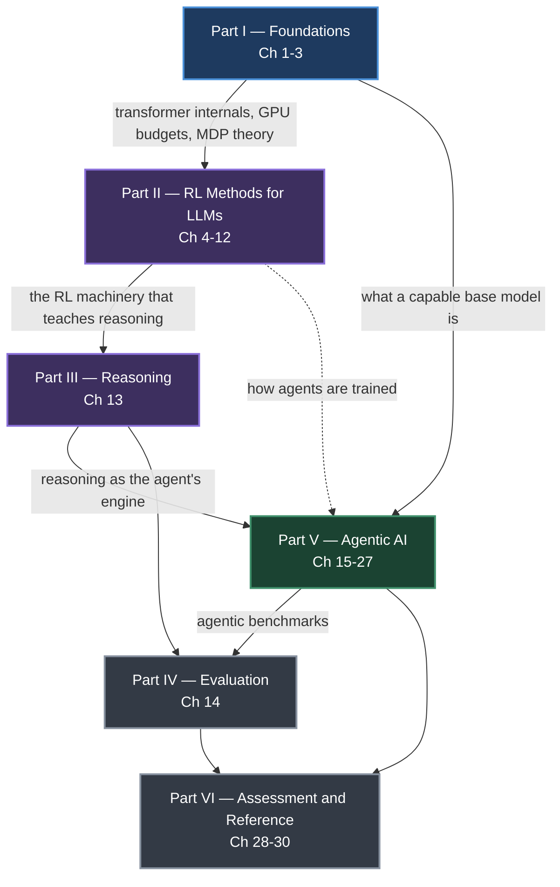

# The Hitchhiker's Guide to Agentic AI — Explained

Chapter-by-chapter study notes on **[The Hitchhiker's Guide to Agentic AI: From Foundations to Systems](https://arxiv.org/abs/2606.24937)** by **Haggai Roitman** (2026, v1.3) — a 636-page survey that runs from transformer internals through RLHF, reasoning models, and the full agentic stack.

Each of the 30 chapters is distilled into a standalone file: the mental model up front as a diagram, the concrete numbers preserved in tables, the math carried with symbol definitions, a decision guide for choosing between methods, the failure modes named, and a practitioner checklist at the end. **174 Mermaid diagrams** across the repo, all rendering natively on GitHub.

> [!NOTE]
> These are independent study notes. They are **not** affiliated with, reviewed by, or endorsed by the author. The book is the authority — where these notes and the book disagree, the book is right. Read the original: [arXiv:2606.24937](https://arxiv.org/abs/2606.24937).

---

## Start Here

| If you… | Go to |
|---|---|
| Want the shortest path to a working mental model | [Reading paths → "I have one afternoon"](reference/reading-paths.md) |
| Are building an agent right now | [Ch 15](chapters/15-introduction-to-agentic-ai.md) → [18](chapters/18-agent-harness-context-and-orchestration.md) → [19](chapters/19-loop-engineering.md) → [22](chapters/22-model-context-protocol.md) |
| Need to pick an alignment algorithm | [Alignment Algorithm Cheatsheet](reference/algorithm-cheatsheet.md) |
| Are debugging a training run | [Ch 29 — failure-mode diagnostics](chapters/29-quick-reference.md) |
| Hit an acronym you don't know | [Glossary](reference/glossary.md) — 141 entries |
| Want to read the whole thing | [Ch 00 — Preface & Introduction](chapters/00-preface-and-introduction.md) |

---

## How the Six Parts Build



*The dependency structure of the book. Foundations feed everything; the RL chapters produce the reasoning models that agents run on; evaluation cuts across both.*

The book's own thesis is that these layers are not separable in practice. An engineer debugging a diverged training run needs the GPU memory hierarchy from Chapter 2. An agent developer choosing a context-compaction threshold needs to understand what the model was trained to do with long contexts. The parts are ordered so each one earns the next.

---

## All 30 Chapters

### Part I — Foundations

| # | Chapter | What it gives you | Pages | Read |
|---|---|---|---|---|
| 1 | [LLM Architecture and Optimization Methods](chapters/01-llm-architecture-and-optimization.md) | Tokenization, the transformer block, attention, positional encodings, Flash Attention 1–4, AdamW and Muon, LoRA/PEFT, MoE, decoding methods, quantization, speculative decoding, safety | 39–110 | 35 min |
| 2 | [Systems Foundations for LLMs](chapters/02-systems-foundations-for-llms.md) | GPU memory hierarchy, the roofline model, why attention is memory-bound and the FFN compute-bound, NVLink/InfiniBand, vLLM and PagedAttention, NVIDIA Dynamo | 111–124 | 18 min |
| 3 | [Introduction to Reinforcement Learning](chapters/03-introduction-to-reinforcement-learning.md) | MDPs, Bellman equations, TD learning, Q-learning, REINFORCE, actor-critic, GAE and the bias–variance dial, reward shaping | 125–137 | 16 min |

### Part II — RL Methods for LLMs

| # | Chapter | What it gives you | Pages | Read |
|---|---|---|---|---|
| 4 | [RL Foundations for Language Models](chapters/04-rl-foundations-for-language-models.md) | The mapping from classical RL to text generation — what state, action, and reward mean when the environment is a token sequence | 139–141 | 7 min |
| 5 | [PPO — Proximal Policy Optimization](chapters/05-ppo-proximal-policy-optimization.md) | The clipped objective derived in six steps, the four-model setup, rollout buffers, the weight lifecycle, TRL config | 142–150 | 16 min |
| 6 | [DPO — Direct Preference Optimization](chapters/06-dpo-direct-preference-optimization.md) | The full derivation that eliminates the reward model, gradient analysis, β selection, batch scaling, and eight variants | 151–163 | 18 min |
| 7 | [GRPO — Group Relative Policy Optimization](chapters/07-grpo-group-relative-policy-optimization.md) | Dropping the value network entirely, group-relative advantage, group-size analysis, and twelve GRPO variants compared | 164–179 | 20 min |
| 8 | [Preference Optimization Variants](chapters/08-preference-optimization-variants.md) | Online DPO, KTO, IPO, ORPO, Best-of-N — and the master table for choosing between all of them | 180–187 | 14 min |
| 9 | [Reward Model Training](chapters/09-reward-model-training.md) | Bradley–Terry derived, reward model architectures, process vs outcome reward models, RLVR, multi-objective rewards | 188–195 | 14 min |
| 10 | [SFT Best Practices and Techniques](chapters/10-sft-best-practices.md) | The LIMA principle, packing and masking, catastrophic forgetting vs the alignment tax, and why SFT quality sets the RL ceiling | 196–204 | 15 min |
| 11 | [System Architecture and Infrastructure at Scale](chapters/11-system-architecture-at-scale.md) | Data/tensor/pipeline/sequence parallelism, ZeRO stages, memory budgets, fault tolerance, Decoupled DiLoCo, Miles | 205–228 | 25 min |
| 12 | [LLM Agentic Training](chapters/12-llm-agentic-training.md) | Trajectory-level RL, credit assignment across turns, interactive RL environments, training on real production traces | 229–258 | 28 min |

### Part III — Reasoning

| # | Chapter | What it gives you | Pages | Read |
|---|---|---|---|---|
| 13 | [RL for Large Reasoning Models](chapters/13-rl-for-large-reasoning-models.md) | How RLVR produces chain-of-thought with no demonstrations, DeepSeek-R1's pipeline, o1/o3, MCTS, test-time compute scaling laws, latent reasoning, on-policy self-distillation | 260–285 | 26 min |

### Part IV — Evaluation

| # | Chapter | What it gives you | Pages | Read |
|---|---|---|---|---|
| 14 | [LLM Evaluation](chapters/14-llm-evaluation.md) | Metric selection, LLM-as-Judge and its position/verbosity biases, inter-annotator agreement, ELO and Bradley–Terry ranking, contamination detection, agentic metrics | 287–303 | 22 min |

### Part V — Agentic AI

| # | Chapter | What it gives you | Pages | Read |
|---|---|---|---|---|
| 15 | [Introduction to Agentic AI](chapters/15-introduction-to-agentic-ai.md) | What makes a system agentic rather than a chatbot, and the map of the whole agentic stack | 305–307 | 7 min |
| 16 | [Retrieval-Augmented Generation](chapters/16-retrieval-augmented-generation.md) | Chunking, embeddings, vector indexes, BM25 and hybrid fusion, reranking, query transformation, agentic RAG, REFRAG | 308–332 | 25 min |
| 17 | [Agentic Memory Systems](chapters/17-agentic-memory-systems.md) | Working/episodic/semantic/procedural memory, the write–consolidate–retrieve–forget lifecycle, MemGPT, Mem0, CoALA, proactive memory | 333–356 | 24 min |
| 18 | [Agent Harness — Context Management and Orchestration](chapters/18-agent-harness-context-and-orchestration.md) | The layer that actually determines agent quality: context budgeting, compaction, tool selection at scale, sub-agent isolation | 357–382 | 26 min |
| 19 | [Loop Engineering](chapters/19-loop-engineering.md) | The agent loop as an engineering artifact — termination conditions, step budgets, retry ladders, reflection, context engineering | 383–397 | 20 min |
| 20 | [Agent Design Patterns](chapters/20-agent-design-patterns.md) | Prompt chaining, routing, parallelization, orchestrator-workers, evaluator-optimizer, ReAct, planning, reflection — with a selection guide | 398–403 | 10 min |
| 21 | [Agentic Environments and Benchmarks](chapters/21-agentic-environments-and-benchmarks.md) | SWE-bench, WebArena, OSWorld, GAIA, UniClawBench, Long-Horizon-Terminal-Bench, sandboxing, and what each benchmark actually measures | 404–420 | 20 min |
| 22 | [Model Context Protocol (MCP)](chapters/22-model-context-protocol.md) | The N×M integration problem, host/client/server architecture, the four primitives, JSON-RPC lifecycle, transports, the security trust hierarchy | 421–440 | 22 min |
| 23 | [Agent Skills](chapters/23-agent-skills.md) | Skills vs tools vs MCP servers, progressive disclosure, the skill lifecycle, and when to use a skill instead of fine-tuning | 441–445 | 9 min |
| 24 | [Agent-to-Agent Communication (A2A)](chapters/24-agent-to-agent-communication.md) | Agent cards, the seven-state task lifecycle, SSE streaming and push notifications, Contract Net bidding, A2A vs MCP | 446–467 | 24 min |
| 25 | [Multi-Agent Systems](chapters/25-multi-agent-systems.md) | Topologies, coordination mechanisms, Markov games and CTDE, error amplification — and a clear-eyed account of when one agent is better | 468–488 | 22 min |
| 26 | [Agent Development Frameworks](chapters/26-agent-development-frameworks.md) | LangGraph, AutoGen, CrewAI, OpenAI Agents SDK, DSPy, Semantic Kernel, NOOA — as a buyer's guide with a selection tree | 489–521 | 30 min |
| 27 | [Agentic UI Frameworks](chapters/27-agentic-ui-frameworks.md) | Why agent UIs differ from chat UIs, streaming state sync, generative UI, and the three-tier human-in-the-loop approval model | 522–543 | 22 min |

### Part VI — Assessment and Reference

| # | Chapter | What it gives you | Pages | Read |
|---|---|---|---|---|
| 28 | [Quiz Questions and Detailed Answers](chapters/28-quiz-questions-and-answers.md) | A study guide to the book's 108-question bank: topic coverage, 45 self-test prompts, five worked examples | 545–596 | 15 min |
| 29 | [Quick Reference](chapters/29-quick-reference.md) | 26 key equations, hyperparameter tables, and a symptom → diagnosis → fix → chapter routing table | 597–604 | 12 min |
| 30 | [Conclusion and Future Directions](chapters/30-conclusion-and-future-directions.md) | The seven recurring themes, seven areas of open problems, and the author's read on where the field stands | 605–636 | 14 min |

Plus [Chapter 00 — Preface & Introduction](chapters/00-preface-and-introduction.md) (12 min): why the book exists, the ten milestone systems from Deep Blue to agentic AI, and the author's deliberate scope omissions.

---

## Reference Material

| File | What it is |
|---|---|
| [Glossary](reference/glossary.md) | 141 acronyms and terms, each with an expansion, a one-line meaning, and a link to the chapter that explains it |
| [Alignment Algorithm Cheatsheet](reference/algorithm-cheatsheet.md) | PPO, DPO, GRPO, Online DPO, KTO, IPO, ORPO, SimPO, Best-of-N — one master table, nine loss functions, a selection flowchart, and the lineage from REINFORCE |
| [Reading Paths](reference/reading-paths.md) | Seven named routes through the repo with time estimates, from a 94-minute afternoon to the 9h48m front-to-back read |

---

## What You'll Be Able to Do

**After Part I** — reason about a transformer's memory and compute profile, read a training config and predict what it will do, and follow any policy-gradient derivation.

**After Part II** — choose among 20+ alignment algorithms based on the data and compute you actually have, implement the pipeline in TRL, and diagnose reward hacking, mode collapse, and KL divergence blowup.

**After Part III** — explain how reasoning emerges from a verifiable reward signal alone, and reason about test-time compute budgets.

**After Part IV** — design an evaluation pipeline that survives contact with contamination, judge bias, and Goodhart's Law.

**After Part V** — architect a production agent: harness, context budget, memory, tools over MCP, a loop with real termination conditions, and a UI with human-in-the-loop approval.

---

## On Fidelity

Every number, method name, benchmark score, and claim in these notes comes from the book. Where the PDF extraction garbled a figure, the file says so and points at the book page rather than guessing. Where the author is stating an opinion rather than settled consensus, the notes attribute it to him.

Two things these notes deliberately do **not** do: reproduce the book's 108-question quiz bank (Chapter 28 is a study guide to it, not a copy), and reproduce long passages verbatim. This is a summary meant to send you to the source, not to replace it.

---

## License and Attribution

The source book is licensed **CC BY-SA 4.0** by Haggai Roitman. These notes are a derivative work and are therefore released under the **same license** — see [LICENSE](LICENSE).

If you use this repo, cite the book:

```bibtex
@misc{roitman2026hitchhikers,
  title  = {The Hitchhiker's Guide to Agentic AI: From Foundations to Systems},
  author = {Haggai Roitman},
  year   = {2026},
  note   = {Version 1.3},
  eprint = {2606.24937},
  archivePrefix = {arXiv},
  primaryClass  = {cs.AI}
}
```

Corrections and improvements are welcome — see [CONTRIBUTING.md](CONTRIBUTING.md).
