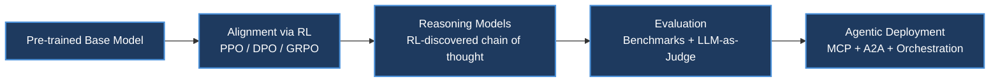
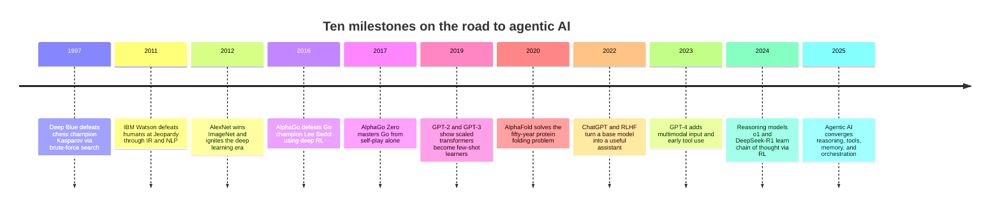
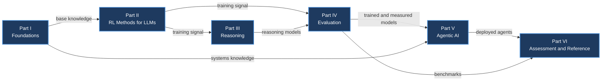

# Preface & Introduction

**Front Matter** · Book pages 25–37 · ~12 min read

[Index](../README.md) · [Chapter 1. LLM Architecture and Optimization →](01-llm-architecture-and-optimization.md)

---

## Why This Guide Exists

Building intelligent AI systems in 2026 requires mastering an extraordinary breadth of knowledge — how transformers process language internally, the hardware and systems that make training possible, the optimization techniques that make it efficient, the reinforcement learning (RL) algorithms that teach models to reason and align with human intent, and the multi-agent architectures that coordinate autonomous systems at scale. That knowledge is scattered across hundreds of papers, blog posts, GitHub repositories, and tribal knowledge inside a handful of labs. Haggai Roitman — a researcher and engineer with two decades at the intersection of AI research and large-scale production systems, over 100 peer-reviewed publications, roughly 100 patents, and a PhD from the Technion — wrote this guide as the single, unified reference he wished existed: one that covers the entire stack, not just the theory but the implementation details that make things actually work.

The framing is personal. Roitman's fascination with intelligent agents began two decades ago during his first engineering degree, where he studied Agent-Oriented Software Engineering (AOSE) and built multi-agent systems in JADE (Java Agent DEvelopment Framework), a FIPA-compliant platform where agents negotiated over shared resources and coordinated autonomously. Around the same time, Berners-Lee, Hendler, and Lassila's paper "The Semantic Web" painted a vision of machine-readable knowledge that agents could reason over. Those two threads — autonomous agent architectures and semantic knowledge representation — set the direction of his career. One early project crystallized the vision: a shopping agent built with OntoBuilder under Prof. Avigdor Gal, designed to fill product search queries and orders automatically across heterogeneous websites by matching and mapping their differing schemas through ontology matching. In practice, the brittleness of hand-crafted ontologies, the messiness of real-world product data, and the lack of robust natural language understanding kept that vision perpetually "five years away."

Over the following years he tracked each successive wave — neural networks and heuristic search for combinatorial optimization, deep learning and representation learning, information retrieval and personalization at scale, and finally large language models (LLMs) — each bringing powerful new tools toward the same unchanged dream: systems that understand, reason, and act autonomously in complex environments. What makes 2024–2026 remarkable, in Roitman's view, is that these threads have finally converged: LLMs supply language understanding and generation, RL teaches them to reason and align with human intent, tool-use protocols like the Model Context Protocol (MCP) give them hands to act in the world, and agent orchestration frameworks provide the coordination layer JADE envisioned twenty years ago — now powered by foundation models instead of hand-coded ontologies.

## Table of Contents

- [The Mental Model](#the-mental-model)
- [The Landscape in 2026](#the-landscape-in-2026)
- [Who This Guide Is For](#who-this-guide-is-for)
- [Design Philosophy and Scope](#design-philosophy-and-scope)
- [What's New in Version 1.3](#whats-new-in-version-13)
- [The Road to Agentic AI](#the-road-to-agentic-ai)
- [Map of the Six Parts](#map-of-the-six-parts)
- [Glossary of Acronyms](#glossary-of-acronyms)
- [How to Use This Repo](#how-to-use-this-repo)
- [Going Deeper](#going-deeper)

---

## The Mental Model

*The modern LLM development pipeline: a base model is aligned, taught to reason, evaluated, and finally deployed as an autonomous agent — each stage mapping to a part of this guide.*

> [!NOTE]
> Book page 35 contains the guide's Figure 1, "the modern LLM development pipeline," as an image. The extraction captured only the caption — "from pre-trained base model through alignment and reasoning to autonomous agentic capability; each stage maps to a part of this guide" — not the diagram artwork itself. The flowchart above reconstructs those named stages from the caption and the guide's own part structure.

The book's thesis is that building great AI systems requires understanding the *entire* pipeline, not one layer of it. An engineer debugging a training run needs GPU memory hierarchies and optimizer dynamics; a fine-tuning practitioner needs to know when LoRA (Low-Rank Adaptation) suffices versus full-parameter training; an agent developer needs to understand how the underlying model was trained; a technical leader evaluating frameworks needs to understand what trade-offs each one makes. Each arrow in the diagram above is a part of this guide: Parts I–II build and align the base model, Part III teaches it to reason, Part IV measures whether any of it worked, and Part V turns the result into a deployed agent.

## The Landscape in 2026

Roitman frames three decades of progress as four compounding eras:

| Era | Years | Defining moves |
|---|---|---|
| Architectural foundations | 2017–2020 | The Transformer introduces self-attention as a universal sequence primitive; scaling laws show bigger models on more data reliably improve; GPT-2/GPT-3 prove decoder-only transformers become capable few-shot learners at scale. |
| Systems and efficiency | 2020–2023 | Flash Attention trains 2–4× faster by removing memory bottlenecks; LoRA fine-tunes 70B+ parameter models on a single node; Mixture of Experts (MoE) decouples model capacity from compute cost; vLLM brings inference throughput within reach of real-time use. |
| Alignment via RL | 2022–2024 | Reinforcement Learning from Human Feedback (RLHF) turns capable-but-unhelpful base models into useful assistants — the recipe behind ChatGPT; Direct Preference Optimization (DPO) collapses the reward model and RL loop into one supervised loss; variants proliferate (KTO, IPO, ORPO, GRPO). |
| Reasoning and autonomy | 2024–2026 | DeepSeek-R1 and OpenAI's o1/o3 show RL can teach reasoning itself — chain of thought, backtracking, and self-verification emerge spontaneously; MCP standardizes tool access, Agent-to-Agent (A2A) enables inter-agent communication, and production-grade orchestration frameworks mature. |

This guide picks up the story at the foundation-model era and carries it forward through alignment, reasoning, and autonomous agency.

## Who This Guide Is For

The book targets practitioners who build things: ML engineers who need to understand transformer internals, training infrastructure, and optimization; applied researchers evaluating architectures, fine-tuning strategies, and RL methods; agent developers who need orchestration patterns, memory architectures, tool integration via MCP, and multi-agent coordination via A2A; systems engineers responsible for GPU clusters and distributed training; and technical leaders making architectural and resourcing decisions across the full stack. Roitman assumes familiarity with neural networks and basic probability, but no prior LLM, RL, or systems knowledge — the guide is meant to build from first principles through to production deployment with vLLM, LoRA/QLoRA (Quantized LoRA), quantization, RLHF/DPO/GRPO pipelines, reasoning models like DeepSeek-R1 and o1/o3, and agentic architecture selection.

## Design Philosophy and Scope

Three principles guide the book: **intuition first, formalism second** — every equation is preceded by a plain-English explanation of what it means and why it matters; **implementation-aware** — theory is paired with code, hyperparameter tables, memory budgets, architecture diagrams, and debugging strategies throughout; and **honest about what works** — the text states plainly which approaches are production-tested and which are still research explorations.

The guide is scoped to text-in, text-out language models and the RL, systems, and agentic infrastructure built around them. Three areas are deliberately excluded, each with a stated reason:

- **Multimodal models** (vision–language, audio, video) are left out because their contrastive pre-training, cross-modal alignment, and modality-specific encoders each merit book-length treatment; including them would double the scope without deepening the RL and agentic core that unifies the guide.
- **Domain-specific deployments** (healthcare, legal, finance, scientific discovery) are excluded because regulatory constraints, specialized evaluation, and data-access issues are orthogonal to the general methods covered — the guide provides the building blocks practitioners adapt to these domains, but leaves the adaptation itself to dedicated references.
- **Personalization and recommendation systems** are excluded because they rest on user modeling, collaborative filtering, and interaction-history architectures — a parallel research tradition with its own distinct techniques (sequential models, bandit-based exploration, cold-start handling) that warrant separate coverage.

Roitman's stated reason for the boundary: it keeps one coherent thread — from architectural foundations and systems infrastructure, through the training algorithms that produce aligned and reasoning models, to the orchestration and deployment of autonomous agents — without fragmenting the narrative across modalities and verticals.

## What's New in Version 1.3

Version 1.3 adds nineteen new topics reflecting developments through mid-2026:

| Chapter | New topics |
|---|---|
| 1 — LLM Architecture and Optimization | Muon optimizer (Newton–Schulz orthogonalization, an AdamW successor adopted by GLM-5, Kimi K2, DeepSeek-V4); Multi-head Latent Attention (MLA), DeepSeek's KV-cache compression via low-rank latent projection; FP8/FP4 training with per-tile micro-scaling; auxiliary-loss-free MoE load balancing; mid-training as the emerging stage between pre-training and SFT (Supervised Fine-Tuning) that prepares models for RL |
| 2 — Systems Foundations | Dynamo, NVIDIA's datacenter-scale inference orchestration framework |
| 11 — System Architecture at Scale | Decoupled DiLoCo (Google's geo-distributed training, 236× bandwidth reduction); Miles, a PyTorch-native RL post-training engine |
| 12 — LLM Agentic Training | Interactive RL environments (NeMo Gym, RLFactory, MOSAIC) for agentic post-training; training on real production agent traces as RL signal |
| 13 — RL for Large Reasoning Models | Inference-time compute scaling laws; latent reasoning (coconut-style continuous thought without token-level chain of thought); on-policy self-distillation, achieving RL-level reasoning at 10–100× lower compute |
| 17 — Agentic Memory Systems | Proactive memory architectures (Meta AI's behavioral-state decay and anticipatory retrieval) |
| 19 — Loop Engineering | Context engineering — optimizing what fills the context window (Lütke, Karpathy, Anthropic) |
| 21 — Agentic Environments | UniClawBench and Terminal-Bench, 2026 benchmarks for robotic manipulation and long-horizon terminal tasks |
| 25 — Multi-Agent Systems | BDI-LLM (Belief–Desire–Intention) self-evolving agents with learned plan libraries |
| 26 — Agent Development Frameworks | NVIDIA OO Agents (NOOA), an object-oriented framework where agents are Python objects, methods are tools, and agent bodies become LLM-driven loops |

## The Road to Agentic AI

*Ten systems, each solving a narrower problem than the last, collectively building the techniques, hardware, and ambition behind today's agentic AI.*

Each milestone shares a common arc, in Roitman's phrasing: **architecture innovation + scale + learning signal = breakthrough**. Deep Blue (1997) evaluated roughly 200 million chess positions per second with a handcrafted evaluation function — it beat a world champion but generalized to nothing else. IBM Watson (2011) combined information retrieval, NLP, and massive parallelism to win at open-domain question answering, but needed years of domain-specific engineering. AlexNet (2012) proved deep networks trained on GPUs could learn representations from raw data, triggering the hardware investment that eventually made LLMs possible. AlphaGo (2016) replaced Deep Blue's brute force with learning — policy and value networks plus Monte Carlo Tree Search (MCTS) mastering a 10^170-state game — and AlphaGo Zero (2017) then learned entirely from self-play. GPT-2/GPT-3 (2019–2020) showed that scaling decoder-only transformers to 175 billion parameters produces emergent few-shot learning across tasks never explicitly trained for. AlphaFold (2020) cracked protein structure prediction by combining attention over residue pairs with massive compute. ChatGPT (2022), aligned via RLHF, was the inflection point where AI became a consumer product used by hundreds of millions, and its reward-model-plus-PPO (Proximal Policy Optimization) recipe became the template for all subsequent LLM post-training. GPT-4 (2023) added multimodal capability and tool use (code interpreter, web browsing), hinting at agentic behavior. Reasoning models (2024) — o1 and DeepSeek-R1 — showed RL could teach reasoning itself, with chain of thought, backtracking, and self-verification emerging from reward signals alone. And Agentic AI (2025–present) is the convergence point: reasoning-capable LLMs equipped with standardized tool access (MCP), inter-agent communication (A2A), persistent memory, and sophisticated orchestration — autonomously writing code, conducting research, and coordinating with other agents.

The learning signal itself has expanded across this arc — from game outcomes, to internet text, to human feedback, to verifiable rewards and environment interaction — and the architectures have grown to match.

## Map of the Six Parts

*Part I supplies the architecture and systems knowledge every later part assumes; Part II turns that into aligned models; Part III specializes alignment into reasoning; Part IV measures both; Part V deploys the result as agents; Part VI consolidates assessment and reference material.*

Part I (Chapters 1–3) builds the base knowledge everything else depends on: LLM internals, the hardware and distributed-systems layer, and RL from first principles. Part II (Chapters 4–12) is the training and alignment core — every major RL/preference algorithm with math, intuition, and code, plus reward modeling, SFT, system architecture at scale, and agentic training. Part III (Chapter 13) covers the reasoning frontier — how RL teaches multi-step reasoning. Part IV (Chapter 14) provides the methodology for measuring whether any of it worked. Part V (Chapters 15–27), the largest part, takes a trained model to a deployed autonomous system — retrieval, memory, orchestration, loop engineering, design patterns, environments, MCP, agent skills, A2A, multi-agent systems, development frameworks, and agentic UI. Part VI (Chapters 28–30) consolidates 108 quiz questions with worked answers, a quick-reference chapter of equations and failure-mode diagnostics, and a conclusion on future directions.

| # | Chapter | Part |
|---|---|---|
| 1 | LLM Architecture and Optimization | I — Foundations |
| 2 | Systems Foundations for LLMs | I — Foundations |
| 3 | Introduction to Reinforcement Learning | I — Foundations |
| 4 | RL Foundations for Language Models | II — RL Methods for LLMs |
| 5 | PPO: Proximal Policy Optimization | II — RL Methods for LLMs |
| 6 | DPO: Direct Preference Optimization | II — RL Methods for LLMs |
| 7 | GRPO: Group Relative Policy Optimization | II — RL Methods for LLMs |
| 8 | Preference Optimization Variants | II — RL Methods for LLMs |
| 9 | Reward Model Training | II — RL Methods for LLMs |
| 10 | SFT Best Practices | II — RL Methods for LLMs |
| 11 | System Architecture at Scale | II — RL Methods for LLMs |
| 12 | LLM Agentic Training | II — RL Methods for LLMs |
| 13 | RL for Large Reasoning Models | III — Reasoning |
| 14 | LLM Evaluation | IV — Evaluation |
| 15 | Introduction to Agentic AI | V — Agentic AI |
| 16 | Retrieval-Augmented Generation | V — Agentic AI |
| 17 | Agentic Memory Systems | V — Agentic AI |
| 18 | Agent Harness, Context, and Orchestration | V — Agentic AI |
| 19 | Loop Engineering | V — Agentic AI |
| 20 | Agent Design Patterns | V — Agentic AI |
| 21 | Agentic Environments and Benchmarks | V — Agentic AI |
| 22 | Model Context Protocol | V — Agentic AI |
| 23 | Agent Skills | V — Agentic AI |
| 24 | Agent-to-Agent Communication | V — Agentic AI |
| 25 | Multi-Agent Systems | V — Agentic AI |
| 26 | Agent Development Frameworks | V — Agentic AI |
| 27 | Agentic UI Frameworks | V — Agentic AI |
| 28 | Quiz Questions and Answers | VI — Assessment & Reference |
| 29 | Quick Reference | VI — Assessment & Reference |
| 30 | Conclusion and Future Directions | VI — Assessment & Reference |

## Glossary of Acronyms

The guide's own glossary covers the acronyms used throughout, each expanded in full where the concept first appears. Reproduced here for quick lookup:

| Acronym | Meaning |
|---|---|
| A2A | Agent-to-Agent (communication protocol) |
| AdamW | Adam with decoupled Weight decay |
| BDI | Belief–Desire–Intention (agent architecture) |
| BERT | Bidirectional Encoder Representations from Transformers |
| BLEU | Bilingual Evaluation Understudy (metric) |
| BPE | Byte-Pair Encoding |
| BT | Bradley–Terry (preference model) |
| CoT | Chain of Thought |
| CTDE | Centralized Training, Decentralized Execution |
| CUDA | Compute Unified Device Architecture |
| DAG | Directed Acyclic Graph |
| DAPO | Dynamic Adaptive Policy Optimization |
| DDP | Distributed Data Parallel |
| DiLoCo | Distributed Low-Communication (training) |
| DP | Data Parallelism |
| DPO | Direct Preference Optimization |
| DQN | Deep Q-Network |
| DRAM | Dynamic Random-Access Memory |
| ELO | Elo rating system (named after Arpad Elo) |
| EOS | End of Sequence (token) |
| FA | Flash Attention |
| FFN | Feed-Forward Network |
| FLOP | Floating-Point Operation |
| FSDP | Fully Sharded Data Parallel |
| GAE | Generalized Advantage Estimation |
| GAIA | General AI Assistants (benchmark) |
| GEMM | General Matrix Multiplication |
| GQA | Grouped Query Attention |
| GRPO | Group Relative Policy Optimization |
| HBM | High Bandwidth Memory |
| IPO | Identity Preference Optimization |
| KL | Kullback–Leibler (divergence) |
| KTO | Kahneman–Tversky Optimization |
| KV | Key–Value (cache) |
| LATS | Language Agent Tree Search |
| LLM | Large Language Model |
| LoRA | Low-Rank Adaptation |
| LR | Learning Rate |
| MCP | Model Context Protocol |
| MCTS | Monte Carlo Tree Search |
| MDP | Markov Decision Process |
| MFU | Model FLOPS Utilization |
| MHA | Multi-Head Attention |
| MLA | Multi-head Latent Attention |
| MLP | Multi-Layer Perceptron |
| MoE | Mixture of Experts |
| NLL | Negative Log-Likelihood |
| NOOA | NVIDIA Object-Oriented Agents |
| OPSD | On-Policy Self-Distillation |
| ORM | Outcome Reward Model |
| ORPO | Odds Ratio Preference Optimization |
| PEFT | Parameter-Efficient Fine-Tuning |
| PP | Pipeline Parallelism |
| PPO | Proximal Policy Optimization |
| PRM | Process Reward Model |
| QLoRA | Quantized Low-Rank Adaptation |
| RAG | Retrieval-Augmented Generation |
| ReAct | Reasoning + Acting (agent pattern) |
| RL | Reinforcement Learning |
| RLHF | Reinforcement Learning from Human Feedback |
| RLVR | Reinforcement Learning with Verifiable Rewards |
| RM | Reward Model |
| RoPE | Rotary Position Embedding |
| ROUGE | Recall-Oriented Understudy for Gisting Evaluation |
| RRF | Reciprocal Rank Fusion |
| SDK | Software Development Kit |
| SFT | Supervised Fine-Tuning |
| SGD | Stochastic Gradient Descent |
| SM | Streaming Multiprocessor |
| SPLADE | SParse Lexical AnD Expansion |
| SRAM | Static Random-Access Memory |
| SSE | Server-Sent Events |
| SWE-bench | Software Engineering Benchmark |
| TD | Temporal Difference (learning) |
| TP | Tensor Parallelism |
| TRL | Transformer Reinforcement Learning (library) |
| UCB | Upper Confidence Bound |
| vLLM | Virtual LLM (inference engine) |

## How to Use This Repo

- **New to LLMs or RL:** read Part I (Chapters 1–3) sequentially first — everything downstream assumes it.
- **Already know transformers and classical RL:** skip to Part II (Chapters 4–12) for the full RL-for-LLMs toolkit — PPO, DPO, GRPO, and the preference-optimization variants.
- **Building an agent today:** start with Part V (Chapters 15–27) and treat Parts I–IV as reference material to dip back into when a term (KV cache, GAE, reward hacking) needs grounding.
- **Evaluating whether a technique is production-ready:** look for the guide's own "honest about what works" framing inside each chapter — it separates production-tested methods from research explorations.
- **Each chapter file stands alone:** acronyms are expanded on first use per file, so you can search-and-jump to a single chapter rather than reading front-to-back.
- **Use Chapter 29 (Quick Reference)** as a lookup table once you've read the relevant chapter at least once, and Chapter 28's 108 quiz questions to self-check before moving to the next part.

## Going Deeper

- Haggai Roitman, *The Hitchhiker's Guide to Agentic AI: From Foundations to Systems*, arXiv:2606.24937v2 (2026) — the full source this repo summarizes.
- Berners-Lee, Hendler, and Lassila, "The Semantic Web" — the paper that, alongside AOSE and JADE, shaped the author's early framing of autonomous agents.
- Krizhevsky, Sutskever, and Hinton — the AlexNet paper that triggered the deep learning era referenced in "The Road to Agentic AI."

---

[Index](../README.md) · [Chapter 1. LLM Architecture and Optimization →](01-llm-architecture-and-optimization.md)

*Summary of the front matter of [The Hitchhiker's Guide to Agentic AI](https://arxiv.org/abs/2606.24937)
by Haggai Roitman. Licensed CC BY-SA 4.0. Independent study notes — not affiliated with or
endorsed by the author.*
