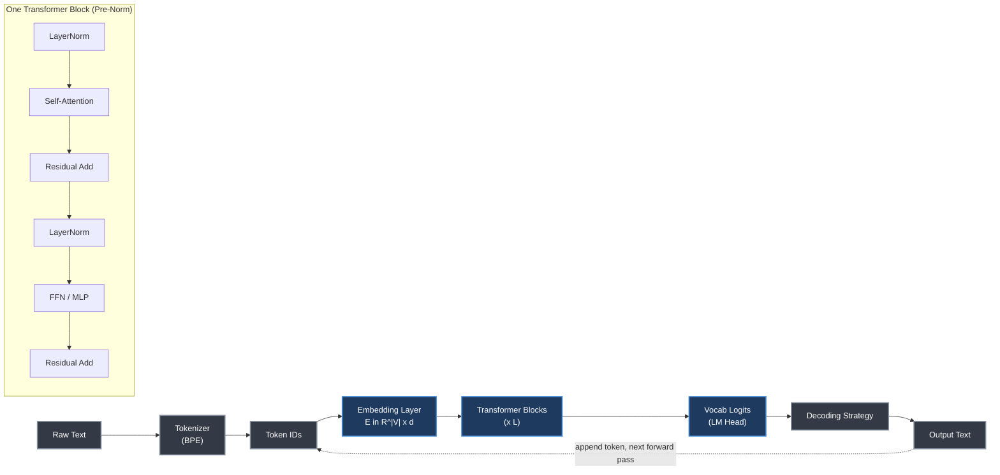
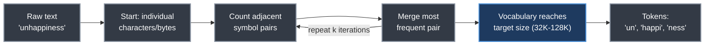
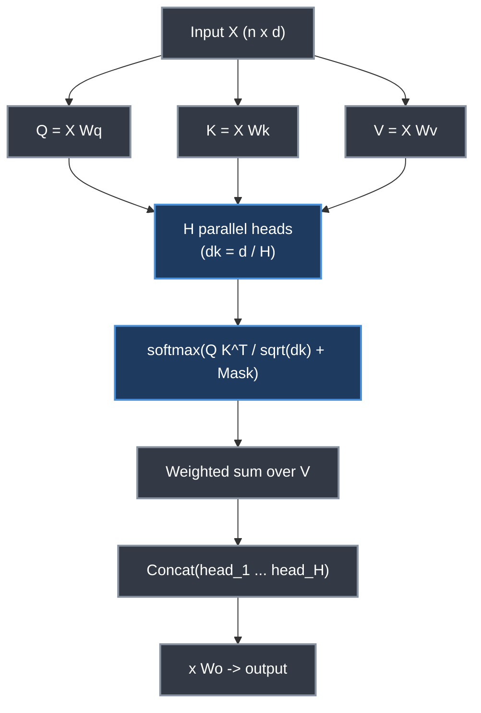
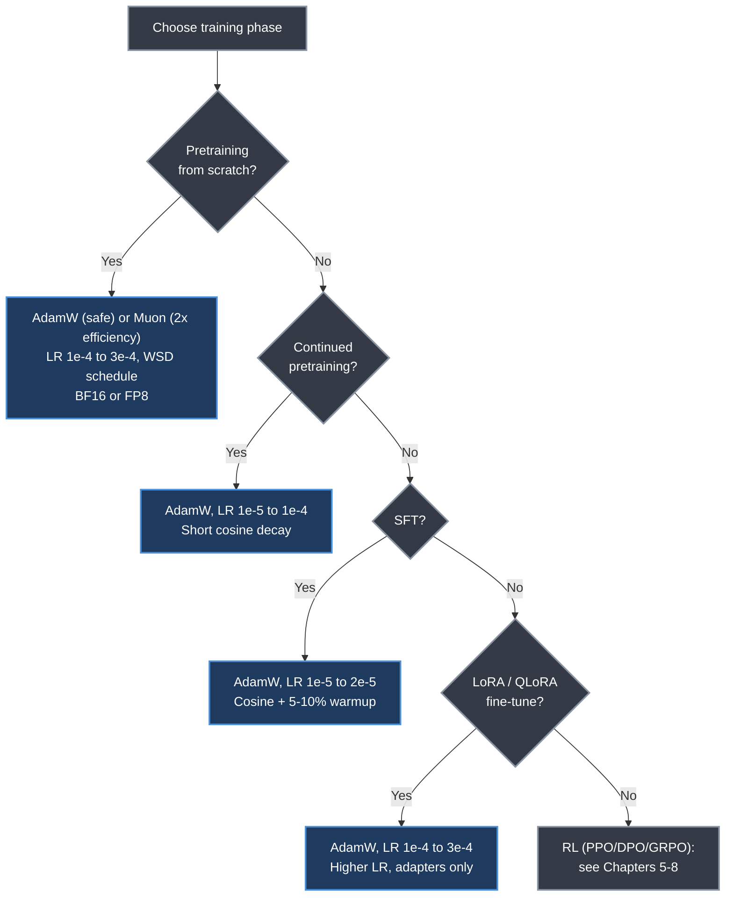
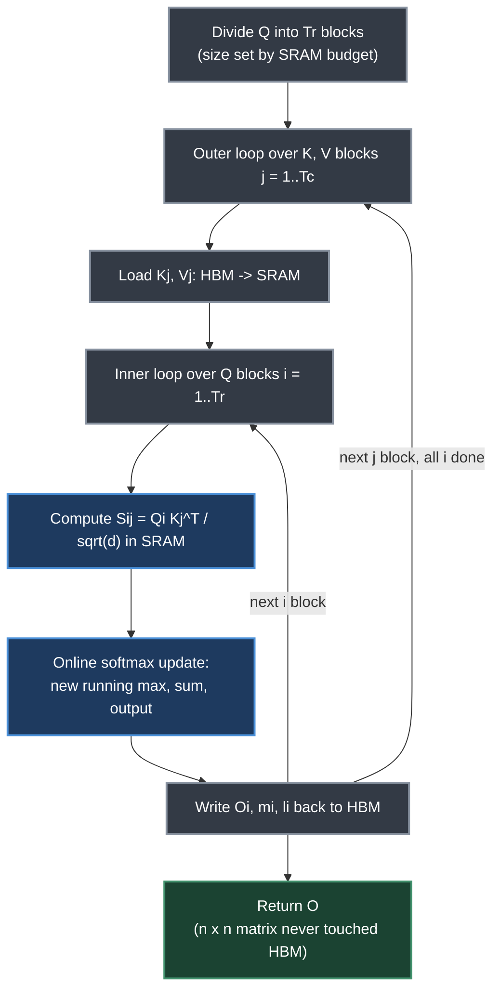
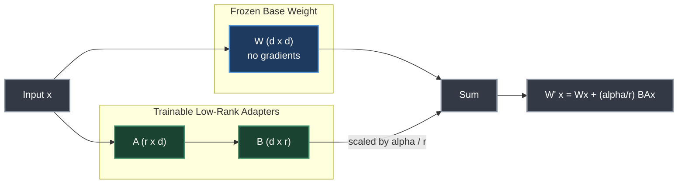
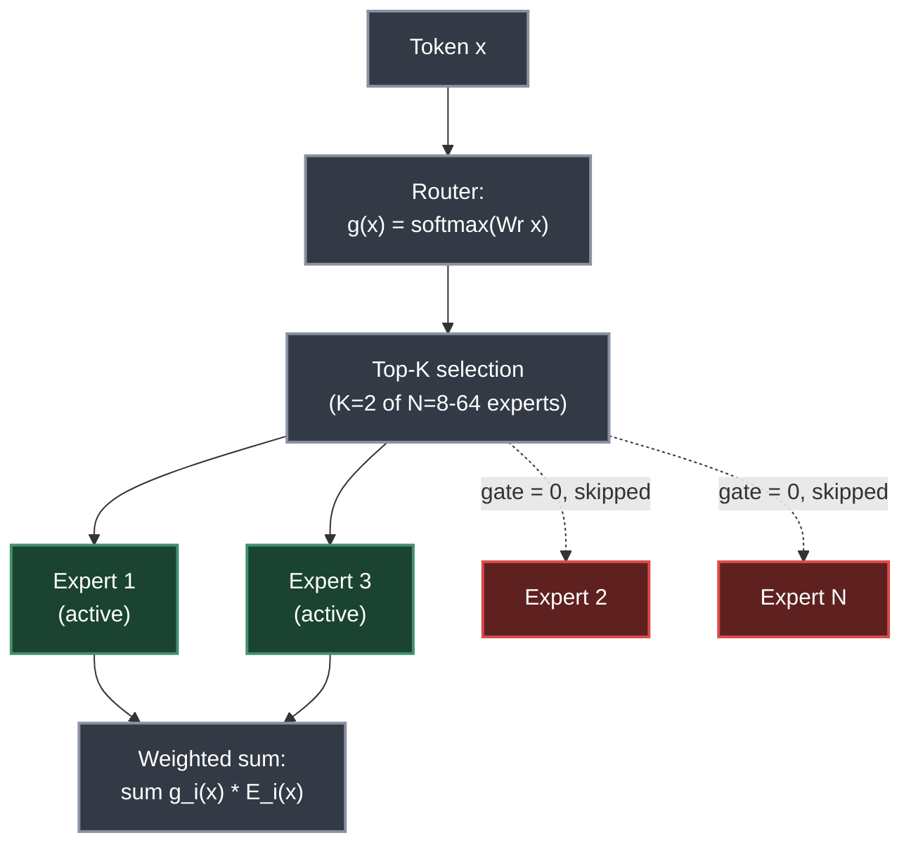
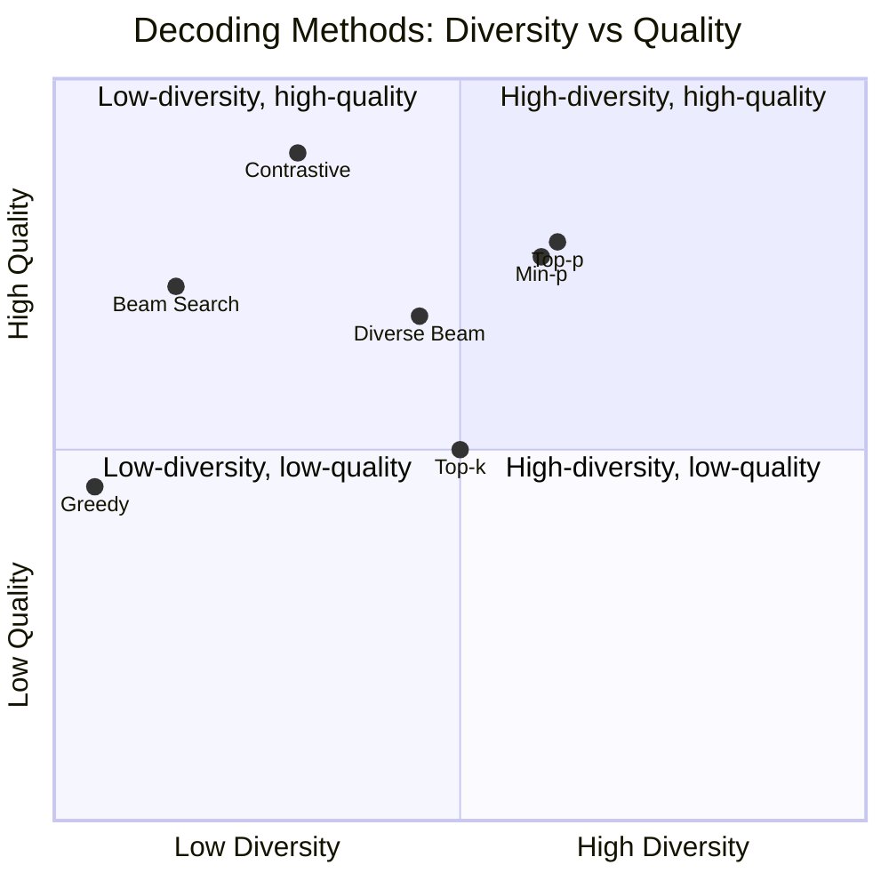
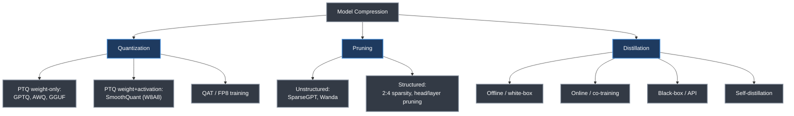

# Chapter 1. LLM Architecture and Optimization Methods

> *"The entire process follows a simple pipeline: text → tokens → representations → tokens → text."*

**Part I — Foundations** · Book pages 39–110 · ~35 min read

[← Preface & Introduction](00-preface-and-introduction.md) · [Index](../README.md) · [Chapter 2. Systems Foundations for LLMs →](02-systems-foundations-for-llms.md)

---

## What This Chapter Is About

Every technique in later chapters — reinforcement learning from human feedback (RLHF), agentic loops, retrieval-augmented generation (RAG) — sits on top of a Large Language Model (LLM) built from a fixed set of architectural and optimization building blocks. This chapter is the reference for those blocks: how text becomes tokens, how a transformer turns tokens into predictions, how gradient-based optimizers converge at billion-parameter scale, and how practitioners make training and inference cheap enough to run.

The chapter runs as a curriculum: the transformer itself (tokenization, attention, positional encoding, normalization), how to train it efficiently (optimizers, schedules, mixed precision, Flash Attention), how to adapt it cheaply (Low-Rank Adaptation, or LoRA, and Parameter-Efficient Fine-Tuning, or PEFT), how to scale it (Mixture of Experts, or MoE), how to decode from it (sampling, constrained generation), how to compress it (quantization, pruning, distillation, speculative decoding), and how to keep it honest and safe. Someone who reads only the tables — model-size reference, hyperparameter defaults, quantization trade-offs — already has a working reference card for LLM engineering decisions.

## Table of Contents

- [The Mental Model](#the-mental-model)
- [Tokenization](#tokenization)
- [The Transformer Architecture](#the-transformer-architecture)
  - [Encoder-Decoder vs. Decoder-Only](#encoder-decoder-vs-decoder-only)
  - [Embeddings and Self-Attention](#embeddings-and-self-attention)
  - [Multi-Head Attention, GQA, and MLA](#multi-head-attention-gqa-and-mla)
  - [Positional Encodings](#positional-encodings)
  - [FFN and Layer Normalization](#ffn-and-layer-normalization)
  - [Model Size Reference](#model-size-reference)
  - [Attention Pathologies](#attention-pathologies)
- [Prediction Heads](#prediction-heads)
- [Optimization Theory](#optimization-theory)
- [Flash Attention](#flash-attention)
- [Pretraining Best Practices](#pretraining-best-practices)
- [Supervised Fine-Tuning](#supervised-fine-tuning)
- [LoRA and Parameter-Efficient Fine-Tuning](#lora-and-parameter-efficient-fine-tuning)
- [Mixture of Experts](#mixture-of-experts)
- [Diversity in LLM Training](#diversity-in-llm-training)
- [Decoding Methods](#decoding-methods)
- [Prompt Engineering](#prompt-engineering)
- [Model Compression](#model-compression)
- [Speculative Decoding](#speculative-decoding)
- [Hallucination Detection](#hallucination-detection)
- [LLM Safety and Responsible AI](#llm-safety-and-responsible-ai)
- [Key Formulas](#key-formulas)
- [Decision Guide](#decision-guide)
- [Common Pitfalls](#common-pitfalls)
- [Summary](#summary)
- [Practitioner Checklist](#practitioner-checklist)
- [Going Deeper](#going-deeper)

---

## The Mental Model

*The LLM pipeline: text is tokenized into subword IDs, embedded into dense vectors, processed through L stacked transformer blocks (inset), projected to vocabulary logits, and decoded back to text. The dashed edge is the autoregressive loop — each generated token is appended to the input for the next forward pass.*

Every remaining section is a zoom-in on one box in this diagram: how the tokenizer builds its vocabulary, what happens inside a transformer block, how the optimizer updates weights, and how the decoding strategy turns logits into text.

## Tokenization

Subword tokenization is the standard because character-level models need prohibitively long sequences (quadratic attention cost) while word-level models cannot handle rare/novel words and need huge embedding tables (~500K+ vocabulary). Subwords balance both: common words stay single tokens, rare words decompose, and vocabulary stays at 32K–128K tokens.

**Byte-Pair Encoding (BPE)** is the dominant algorithm (GPT-4, Llama-3, Mistral): start from individual characters/bytes, count adjacent symbol pairs, merge the most frequent pair into a new symbol, and repeat until the vocabulary budget is reached.

*The BPE training loop: repeated merging of the most frequent adjacent pair converts a character alphabet into a subword vocabulary.*

| Granularity | Vocab Size | Sequence Length | Issues |
|---|---|---|---|
| Character | ~256 | Very long | Attention cost O(n²); hard to learn long-range semantics |
| Word | ~500K+ | Short | Cannot handle rare/novel words; huge embedding table |
| Subword | 32K–128K | Moderate | Best trade-off: short sequences, open vocabulary |

Alternatives: **WordPiece** (BERT, DistilBERT) maximizes training-data likelihood rather than raw pair frequency; **Unigram LM** (SentencePiece — T5, XLNet) works top-down, pruning a large vocabulary by likelihood impact; **Byte-level BPE** (GPT-2+) operates on raw bytes with a 256-symbol base vocabulary, eliminating unknown tokens entirely.

Best practices: use 128K vocabulary for multilingual/code coverage (Llama-3's choice); always include `<bos>`, `<eos>`, `<pad>`, `<unk>`, plus role markers (`<|user|>`, `<|assistant|>`) for chat models; measure fertility (tokens-per-word) to catch poor language coverage; consider digit-level tokenization ("2024" → `["2","0","2","4"]`) for arithmetic; never split special tokens into sub-pieces. During SFT, mask loss on structural tokens so the model isn't trained to "predict" formatting; during PPO/GRPO ensure policy and reference tokenize identically — mismatches corrupt the KL computation.

## The Transformer Architecture

### Encoder-Decoder vs. Decoder-Only

The original Transformer was an encoder-decoder for sequence-to-sequence tasks. The **encoder** processes the full input bidirectionally (no causal mask). The **decoder** adds masked self-attention (causal mask: position *i* only attends to positions ≤ *i*) plus **cross-attention**, where decoder queries attend to encoder keys/values so the decoder can dynamically focus on different parts of the input at each generation step.

Modern LLMs (GPT, Llama, Qwen) are **decoder-only**: they drop the encoder and cross-attention entirely, relying on a single causal self-attention stack to both encode context and generate continuations. This wins because it's simpler (one model, one loss), scales better (every parameter contributes to generation), and unifies pretraining and fine-tuning under one next-token objective. Encoder-decoder models (T5, BART) remain relevant for tasks with distinct input/output structure, and cross-attention reappears in multimodal models where a vision encoder feeds keys/values to a language decoder.

| Architecture | Examples | Use Case |
|---|---|---|
| Decoder-only | GPT-4, Llama, Mistral, Qwen | Autoregressive generation; dominant for chat/reasoning |
| Encoder-decoder | T5, BART, Flan-T5 | Seq2seq (translation, summarization); less common now |
| Encoder-only | BERT, RoBERTa | Classification/embeddings; not for generation |

### Embeddings and Self-Attention

The embedding layer is a lookup table E ∈ R^(|V| × d): token ID *x* maps to row E[x] ∈ R^d. For Llama-3, this table is 128,256 × 4,096 = 525M parameters — 6.5% of the 8B model. Many models tie this matrix with the output projection head (W_head = Eᵀ), saving parameters.

> [!NOTE]
> Pretrained embeddings suffer from **anisotropy** — they occupy a narrow cone rather than spreading uniformly, breaking cosine-similarity retrieval (all pairs score >0.7 regardless of content). **Whitening**, a linear transform to zero mean and identity covariance, restores isotropy and can simultaneously reduce dimensionality (like PCA).

Scaled dot-product self-attention lets each token attend to all others: Q, K, V are linear projections of the input, and `Attention(Q,K,V) = softmax(QKᵀ/√d_k + M)V`, where causal mask M sets disallowed future positions to −∞. Naive attention costs O(n²·d) time and O(n²) memory — at 128K context and d=4096, the attention matrix alone is 64 GB in FP32.

| Seq Length | Attention Ops | Matrix Size | Practical Impact |
|---|---|---|---|
| 2K | 4M | 16 MB | Fast; fits in SRAM |
| 8K | 64M | 256 MB | Manageable with FlashAttention |
| 32K | 1B | 4 GB | Requires memory-efficient kernels |
| 128K | 16B | 64 GB | Exceeds single GPU HBM |
| 1M | 1T | 4 TB | Impossible without sub-quadratic methods |

Five families address this: (1) **exact attention with IO-awareness** (Flash Attention, below — orthogonal to sparsity, so production systems combine both), (2) **sliding window/local attention** (Mistral uses window=4096, cost O(n·w)), (3) **sparse patterns** combining local windows with periodic global tokens (BigBird, LongT5), (4) **linear attention/state-space models** (Mamba, RWKV) — a genuinely different, less expressive architecture that still lags transformers on long-range reasoning, and (5) **KV cache compression** at inference (H2O, StreamingLLM, quantized caches).

### Multi-Head Attention, GQA, and MLA

*Multi-head attention: each of H heads computes its own scaled dot-product attention over a d/H-dimensional slice, and the outputs are concatenated and re-projected.*

Instead of one d-dimensional attention function, multi-head attention runs H parallel heads at dimension d_k = d/H, each free to specialize (syntax, semantics, positional proximity). Two compression variants reduce the KV cache for inference:

- **Grouped Query Attention (GQA)**: Llama-3 uses fewer K/V heads than Q heads (8 KV heads shared across 32 Q heads), cutting KV cache size 4× with minimal quality loss.
- **Multi-head Latent Attention (MLA)**: DeepSeek-V2 compresses all key-value information into a single low-rank latent vector per token, c_t = W_DKV h_t, with K_t, V_t decompressed on the fly. Learned end-to-end, quality matches or exceeds GQA while the cache is smaller still — MLA underlies DeepSeek-V3/V4.

### Positional Encodings

Transformers are permutation-equivariant by construction, so they need explicit positional signal.

| Method | Used By | Extrapolation | Extra Params |
|---|---|---|---|
| Sinusoidal | Original Transformer | Poor | None |
| Learned Absolute | GPT-2, BERT | None | L_max × d |
| RoPE (Rotary) | Llama, Qwen, Mistral | Good (with scaling) | None |
| ALiBi | BLOOM, MPT | Excellent | None |

**RoPE (Rotary Position Embedding)** rotates query/key vectors in 2D subspaces by a position-dependent angle, so the dot product between rotated Q and K depends only on the relative position m − n. **ALiBi** drops positional embeddings entirely, instead subtracting a linear penalty m·|i−j| from attention scores, with head-specific slopes m_h = 2^(−8h/H).

To extend a RoPE model beyond training length L to L′: **linear scaling** (Position Interpolation) divides positions by L/L′ but compresses resolution; **NTK-aware scaling** stretches the base frequency θ (10000 → 10000·s^(d/(d−2))), preserving local information while extending global range; **YaRN** combines NTK scaling with an attention-temperature correction and light fine-tuning — this is how Llama-3 extended from 8K training to 128K deployment. Ring Attention distributes sequence-parallel attention across GPUs for 1M+ token contexts. Even so, **"lost in the middle"** means a 1M-context model doesn't necessarily use all of it — models over-focus on the beginning and end.

### FFN and Layer Normalization

The FFN (feed-forward network / MLP), applied per position, is `FFN(x) = W2·σ(W1x + b1) + b2` with W1 ∈ R^(d×4d). Modern LLMs (Llama, Mistral) use **SwiGLU**: `FFN(x) = W2(Swish(W1x) ⊙ W3x)`, needing three weight matrices but delivering better quality; hidden dimension is typically 8/3 × d, rounded to a multiple of 256 for Tensor Core efficiency. Interpretability work suggests FFN layers act as key-value memory — W1 rows are keys, W2 columns are values.

**Layer normalization** stabilizes deep-network training. **RMSNorm**, used by all modern LLMs, drops mean-centering and normalizes only by root-mean-square — no β term, ~5–10% faster on GPU, equivalent quality. Placement matters: **Pre-Norm** (`h + Attn(LayerNorm(h))`, GPT-2+ and all modern LLMs) stabilizes training and allows higher LRs without careful warmup, unlike the original **Post-Norm** (`h + LayerNorm(Attn(h))`). Without normalization, a 128-layer transformer's activation magnitudes could vary by 10^30× between the first and last layer.

### Model Size Reference

| Model | Params | Layers | d | Heads | KV Heads | Context |
|---|---|---|---|---|---|---|
| Llama-3.1 8B | 8B | 32 | 4096 | 32 | 8 | 128K |
| Llama-3.1 405B | 405B | 126 | 16384 | 128 | 8 | 128K |
| Llama-4 Maverick | 400B (17B active) | 48 | 5120 | 40 | 8 | 1M |
| Mistral Large 2 | 123B | 88 | 12288 | 96 | 8 | 128K |
| Qwen-2.5 72B | 72B | 80 | 8192 | 64 | 8 | 128K |
| DeepSeek-V3 | 671B (37B active) | 61 | 7168 | 128 | MLA | 128K |

"Active" parameters (MoE models) reflect per-token compute cost; total parameters reflect capacity. DeepSeek-V3 uses MLA instead of standard GQA.

### Attention Pathologies

**Attention sink**: models allocate 20–50% of total attention mass to the first token regardless of content, because softmax must sum to 1 and the model needs a "dump" location when nothing is relevant. Evicting this token from a sliding-window KV cache causes catastrophic perplexity spikes — StreamingLLM's fix is to always retain the first *k* sink tokens alongside the recent window.

**Attention dilution / "lost in the middle"**: as sequence length n grows, average attention weight per token falls as O(1/n). Liu et al. showed a U-shaped retrieval curve — start/end information is retrieved reliably, middle information is often ignored, compounded by RoPE's positional decay. Mitigations: put critical content at the start/end of the prompt, train on long documents with varied information placement, or use landmark-token signposts.

Other documented phenomena: **attention head specialization** (syntax/co-reference/positional heads — many can be pruned), **induction heads** (implement `[A][B]...[A]→[B]` copying, critical for in-context learning), **attention collapse** (deep-network heads converge to the same positions), and **retrieval heads** (specialize in fact-retrieval — pruning them causes hallucination spikes).

Interpretability runs from raw attention maps (cheapest, least faithful — Jain and Wallace showed attention often doesn't correlate with gradient-based importance) → probing classifiers → **Sparse Autoencoders (SAEs)**, which decompose polysemantic neuron activations into monosemantic, steerable features (Anthropic trained SAEs with up to 34M features on Claude 3 Sonnet) → **Natural Language Autoencoders (NLAEs)**, replacing the sparse bottleneck with an auto-generated language description of active concepts → causal tracing/patching, the most faithful and most expensive method.

## Prediction Heads

The same transformer backbone supports different tasks purely by swapping the head on top of the final hidden state h_t.

| Head | Output | Loss | Stage | Purpose |
|---|---|---|---|---|
| LM Head | R^\|V\| | Cross-entropy (all tokens) | Pretraining | Learn language from raw text |
| Conditional Head | R^\|V\| | Cross-entropy (response only) | SFT | Learn to follow instructions |
| Value Head | R¹ | MSE | RL (PPO) | Estimate state value for advantage |
| Reward Head | R¹ | Pairwise ranking | RM training | Score response quality |

The LM head and SFT conditional head are architecturally identical — SFT just masks the loss on prompt tokens (set to −100), so the prompt provides context but no gradient. The **value head** used in PPO/GRPO replaces vocabulary logits with a scalar regression output V(s_t) = w_valueᵀh_t + b, trained by MSE against actual returns; initialize it near zero, since large initial value estimates cause wild advantages and unstable PPO updates. Weight tying (`lm_head.weight is model.embed_tokens.weight`) means the LM head often reuses the embedding table rather than being separately learned — embedding geometry directly determines token probabilities.

## Optimization Theory

Gradient descent updates θ_{t+1} = θ_t − η∇_θL(θ_t). Computing the exact gradient over trillions of tokens is infeasible, so **Stochastic Gradient Descent (SGD)** estimates it from a mini-batch of B tokens (typically 1K–4M) — at B=4096 against 15T total tokens, each step is ~4 billion times cheaper than full-batch, and the resulting noise acts as regularization that finds flatter, better-generalizing minima.

Plain SGD fails for LLMs: gradient scales differ wildly across layers (a single η is wrong for most parameters), embedding gradients are sparse, high-dimensional landscapes have many saddle points, and SGD is highly sensitive to LR — a 2× change can diverge training. **Adam** fixes this with per-parameter adaptive rates via first-moment (momentum) and second-moment (adaptive scaling) estimates, bias-corrected for early steps. Typical values: β₁=0.9, β₂=0.95 or 0.999, ε=10⁻⁸, η=10⁻⁴ to 10⁻⁵.

**AdamW** fixes a subtle bug: plain L2 regularization inside Adam divides the weight-decay gradient by the same adaptive factor 1/√v̂_t as the loss gradient, so parameters with large gradient variance get *less* effective decay — not the intended uniform regularization. AdamW decouples weight decay, applying it directly to the parameters outside the adaptive scaling (typical λ=0.1). **Always use AdamW, never plain Adam, for LLM training.**

> [!NOTE]
> **Muon** (Liu et al., 2025) is the first serious challenger to AdamW's decade-long dominance. It orthogonalizes the momentum buffer via Newton-Schulz iteration (5–10 steps, converging to M̃_t with M̃_tᵀM̃_t ≈ I) before applying it to hidden-layer weight matrices, preventing Adam's known failure mode of collapsing updates onto a low-rank subspace. Muon claims ~2× compute efficiency (same validation loss in roughly half the steps) and is adopted for pretraining by GLM-4.5/GLM-5, Kimi K2 (via MuonClip, adding QK-Clip to cap attention logits — Kimi K2 trained 15.5T tokens with zero loss spikes), and DeepSeek-V4. AdamW remains the safe default for fine-tuning, LoRA, and RL, where Muon's behavior is less well characterized.

**Learning rate is the single most important hyperparameter**, and **batch size** is the second (it affects gradient noise and effective LR via the linear scaling rule).

| Phase | Typical LR | Notes |
|---|---|---|
| Pretraining (from scratch) | 1e-4 to 3e-4 | Large model, large batch |
| Continued pretraining | 1e-5 to 1e-4 | Smaller LR to preserve knowledge |
| SFT | 1e-5 to 2e-5 | Standard range |
| LoRA fine-tuning | 1e-4 to 3e-4 | Higher LR for adapter weights |

**Warmup** is necessary because Adam's second-moment estimate v_t starts at zero — after bias correction at t=1 with β₂=0.999, the effective LR is ~1000× smaller than intended, and an unusually large first gradient can dominate the estimate. Linear warmup ramps η_t = η_max × t/T_warmup over 1–5% of steps for pretraining, 3–10% for fine-tuning (50–200 steps typical for SFT).

Schedules: **constant** (simplest, risks under-converging); **cosine decay** (standard for pretraining/SFT, η_min typically η_max/10); **linear decay** (simpler, similar results); **WSD (Warmup-Stable-Decay)** — the emerging pretraining standard (Llama-3-era), with a long stable phase at η_max allowing checkpointing at any point, then fast decay in the last 10–20% of steps; **cosine with restarts (SGDR)**, less common for LLMs.

**Gradient clipping** rescales the gradient when its global norm exceeds threshold τ (typically 1.0): `g_t ← g_t · min(1, τ/‖g_t‖₂)`. Unlike a smaller LR, clipping preserves gradient direction while only limiting magnitude.

**Mixed precision**: BF16 shares FP32's 8-bit exponent range so it doesn't overflow and needs no loss scaling; FP16 has only 5 exponent bits (range ~6×10⁻⁵ to 65504) and requires dynamic loss scaling to avoid NaN/Inf. A100/H100 support BF16 natively — prefer it. FP32 "master weights" matter most for long runs and small LRs, where updates would otherwise be lost to BF16's 7-bit mantissa (~0.8% relative precision); cost is 2× weight storage. DeepSeek-V3 trained 671B parameters in **FP8** (E4M3 forward, E5M2 backward) with tile-wise scaling at <0.25% relative loss degradation versus BF16, at ~$5.6M total cost; Nemotron 3 pushed to **NVFP4** (4-bit) stably over 25T tokens by keeping ~15% of layers in BF16. Precision engineering reduces frontier training costs 3–5×.

*A decision path through optimizer and learning-rate choices by training phase; every branch converges on AdamW as the safe default, with Muon as an emerging pretraining-only alternative.*

Monitor: gradient norm should stay below `max_grad_norm` most of the time; repeated excess above 1.0 means reduce LR or increase warmup; exactly 0 means vanishing gradients or a loss bug; a shrinking FP16 loss scale signals overflow (switch to BF16).

## Flash Attention

Flash Attention does not change attention's mathematical result — it eliminates the need to materialize the n×n attention matrix in High-Bandwidth Memory (HBM) by computing attention in tiles that fit in fast on-chip SRAM, cutting HBM footprint from O(n²) to O(n) and delivering **2–4× end-to-end wall-clock speedup**.

The key trick is **online softmax**: since softmax needs a running maximum for numerical stability, Flash Attention updates the running max, normalization sum, and output incrementally as it processes each K/V block, so the full score matrix S_ij is computed in SRAM and *discarded* — never written to HBM.

*Flash Attention's block-tiled forward pass: only Q, K, V blocks and the small running statistics ever touch HBM; the attention score tile lives and dies in SRAM.*

Standard attention memory: for n=8192, d=128, BF16, the attention matrix is ~134 MB per head — 4.3 GB for one layer with 32 heads. FLOPs stay identical between standard and Flash Attention (O(n²d)); the speedup comes entirely from slashing HBM traffic.

Hardware co-evolution across four generations:

| Version | Target Hardware | Key Technique | Result |
|---|---|---|---|
| FA1 | General GPUs | Tiling + online softmax | O(n²) → O(n) HBM |
| FA2 | A100 | Fewer non-matmul ops, sequence-dim parallelism, causal-mask block skipping | ~2× speedup for causal attention |
| FA3 | H100 (Hopper) | TMA async data movement, warp specialization, FP8 support | Up to 75% of H100 peak (vs. ~35% for FA2) |
| FA4 | B200/GB200 (Blackwell) | Async MMA pipelines, software-emulated exponential, conditional rescaling, Tensor Memory + 2-CTA backward | 1613 TFLOP/s (71% of Blackwell peak); 1.3× faster than cuDNN 9.13; 2.7× faster than Triton |

FA4 is the first version written in CuTe-DSL (CUTLASS 4.x), compiling 20–30× faster than C++ CUTLASS templates. Each generation's bottleneck shifted: A100 was memory-bandwidth limited, H100 was data-movement limited, B200 is non-matmul-compute limited — new algorithmic ideas were required at each step, not just recompilation.

## Pretraining Best Practices

All modern decoder-only LLMs use causal language modeling: predict the next token given all previous tokens, with no explicit supervision beyond that objective — emergent capabilities like in-context learning and reasoning follow from scale alone.

**Data recipe**: 1–15 trillion tokens for frontier models (Llama-3 used 15T); sourced roughly 80% web crawl, 10% code, 5% books/papers, 5% curated; deduplicated via MinHash + exact substring matching; filtered by perplexity-based classifiers and heuristics (length, language ID, toxicity); mixed with temperature-weighted sampling, upweighting code and math for reasoning.

**Scaling laws** (Hoffmann et al., Chinchilla): compute-optimal training balances model size N and data size D, both scaling as C^0.5. A 70B model is compute-optimal at ~1.4T tokens — but frontier models are deliberately *over-trained* beyond Chinchilla-optimal, because inference cost scales with model size, not training tokens, so a smaller over-trained model is cheaper to deploy.

| Setting | Llama-3 405B | Llama-3 8B | Qwen-2.5 72B | Mistral 7B |
|---|---|---|---|---|
| Tokens | 15T | 15T | 18T | 8T |
| Batch size (tokens) | 16M | 4M | 4M | 4M |
| Peak LR | 8e-5 | 3e-4 | 3e-4 | 3e-4 |
| Schedule | WSD | WSD | Cosine | Cosine |
| Weight decay | 0.1 | 0.1 | 0.1 | 0.1 |
| Context length | 8192 | 8192 | 4096→32K | 8192 |

Failure modes: **loss spikes** from bad batches or numerical instability (Llama-3's mitigation: roll back to a checkpoint, skip the offending batch); **memorization** (verbatim regurgitation — fix with aggressive dedup); training-length/deployment-length mismatch (fix via continued pretraining on long documents plus RoPE scaling).

> [!IMPORTANT]
> **Mid-training** ("continued pretraining" or "annealing") is a distinct stage between raw pretraining and post-training, up-weighting STEM/math/code on curated data and extending context to 128K–256K tokens. Its purpose isn't new knowledge — it instills the cognitive behaviors (verification, backtracking, subgoal decomposition) that RL later amplifies. OctoThinker found the *same* GRPO recipe produced strong reasoning gains on Qwen (reasoning-dense mid-training) but failed entirely on Llama, which lacked it — mid-training composition, not model size or architecture, determined RL-readiness. Typical scale: 100B–500B curated tokens with cosine-decayed LR.

## Supervised Fine-Tuning

SFT uses the identical causal LM loss, computed only on response tokens (prompt labels set to −100). The **LIMA principle** (Zhou et al.) showed 1,000 carefully curated examples can match models trained on 50K+ noisy examples, provided the data is diverse (QA, summarization, code, math, creative writing, multi-turn), correct, length-balanced, and decontaminated against benchmarks.

Efficiency libraries provide drop-in gains over vanilla HuggingFace training:

| Library | Mechanism | Result |
|---|---|---|
| **Liger Kernel** | Triton-fused kernels (cross-entropy, RMSNorm, SwiGLU, RoPE) | 20% higher throughput, up to 60% memory reduction |
| **Unsloth** | Manual backprop through LoRA, fused 4-bit dequantization | 2–5× faster, 60–70% less VRAM; trains 70B QLoRA on one 48GB GPU |
| **torchtune** | Pure PyTorch recipes, native FSDP2/compile | Comparable speed with full debuggability |

Best practices: **packing** (concatenate short examples into one sequence separated by EOS, avoiding padding waste); **NEFTune** (uniform noise on embeddings, α=5, improves MT-Bench 5–15% at zero cost); always use the model's native chat template; 2–3 epochs for large datasets, up to 5 for small curated sets (over-training causes format memorization). SFT teaches format and instruction-following but cannot reliably teach preference, refusal calibration, or complex multi-step reasoning — those need RLHF/DPO (Chapters 5–8).

## LoRA and Parameter-Efficient Fine-Tuning

Full fine-tuning a 70B model requires storing 70B trainable parameters plus optimizer states — 560+ GB. LoRA learns a low-rank perturbation instead of updating the full weight matrix:

*LoRA freezes the base weight W and learns only the two small matrices B and A; at inference their product merges back into W at zero overhead.*

At r=16, d=4096, LoRA adds 2×4096×16 = 131K parameters per layer versus 16.8M for the full matrix. The α/r scaling keeps update magnitude roughly constant across ranks — common practice sets α=r or α=2r, letting teams sweep r ∈ {8,16,32,64} without re-tuning LR. Aghajanyan et al. showed fine-tuning operates in a very low-dimensional subspace (a 175B model's task may have intrinsic dimensionality <10,000), which is why low-rank updates suffice.

| Hyperparameter | Typical Values | Guidance |
|---|---|---|
| r (rank) | 8, 16, 32, 64 | Higher = more capacity, more memory. Start at 16. |
| lora_alpha | 16, 32 (= r or 2r) | Controls update magnitude via α/r scaling |
| target_modules | q/k/v/o_proj (+ gate/up/down_proj for full coverage) | All attention projections at minimum |
| lora_dropout | 0.0–0.1 | Usually 0.05 for small datasets |
| Learning rate | 1e-4 to 3e-4 | Higher than full fine-tuning — only adapters update |

Rank rules of thumb: r=8 for simple single-domain tasks, r=16 as a general-purpose default, r=32–64 for complex math/code/multi-turn reasoning (approaching full fine-tune quality), r=128+ shows diminishing returns.

| Variant | Key Innovation | When to Use |
|---|---|---|
| **QLoRA** | 4-bit (NF4) quantized base + BF16 LoRA, double quantization | Fine-tune 70B on a single 48GB GPU |
| **DoRA** | Decomposes W into magnitude + direction; LoRA updates direction only | 1–3% better on reasoning/instruction-following, zero extra inference cost |
| **LoRA+** | η_B ≈ 16 × η_A (asymmetric LR for the two matrices) | Free ~2% quality gain, no extra cost |
| **AdaLoRA** | Dynamic rank budget across layers via SVD importance | Very tight compute budget |
| **rsLoRA** | Scales by α/√r instead of α/r | Stable at high ranks (r≥64) |
| **VeRA** | Shared frozen random A, B; trains only diagonal scaling vectors | Extreme parameter efficiency (~10× fewer than LoRA), 90–95% of LoRA quality |
| **LoRA-FA** | Freezes A after init, trains only B | Halves LoRA memory |

> [!NOTE]
> **QLoRA memory example** (70B model, r=16, all linear layers): base model in NF4 ≈ 35 GB, LoRA adapters in BF16 ≈ 160 MB, adapter optimizer states ≈ 320 MB, activations with gradient checkpointing ≈ 8 GB — total ≈ 44 GB, fitting a single 48GB GPU versus 560 GB for full fine-tuning (7× A100-80GB).

Other PEFT families exist for historical/niche context: **Adapters** (bottleneck MLPs, add inference latency), **Prefix Tuning** (virtual tokens on K/V, consumes context length), **Prompt Tuning** (soft prompt embeddings, <0.01% params but weaker on complex tasks), **IA3** (rescaling vectors, deprecated), **BitFit** (bias-only training, near-zero params). LoRA won because it merges at zero inference overhead, composes for multi-tenant serving (swap adapters per request), and has first-class support across HuggingFace PEFT, TRL, and vLLM.

## Mixture of Experts

MoE scales capacity without proportionally scaling compute, activating only a subset of parameters per token.

*MoE with 8 experts and Top-2 routing: only the two highest-gated experts run per token, so total parameters scale with N while active (compute) parameters scale with K/N.*

**Load balancing** matters because an unconstrained router may collapse onto 1–2 experts, wasting capacity. The standard fix adds an auxiliary balancing loss, L_bal = α·N·Σf_i·p_i (fraction routed × mean router probability, per expert), pushing toward uniform utilization.

Top-k selection is non-differentiable, so two tricks make it trainable: **Noisy Top-K Gating** (Shazeer et al.) adds learnable Gaussian noise to router logits before selection, removed at inference for deterministic routing — used by the original Sparsely-Gated MoE, Mixtral, and DeepSeek-V2. **Gumbel-Softmax** offers a differentiable-relaxation alternative, annealing temperature τ from 1.0 to 0.1–0.5; Switch Transformer instead simplifies to Top-1 with no noise, relying on the balancing loss alone.

> [!NOTE]
> DeepSeek's **auxiliary-loss-free load balancing** moves balancing out of the gradient entirely, into a per-expert routing bias updated from observed utilization — this achieves both better quality and more expert specialization than the loss-based approach, because the auxiliary loss actively fights the router's drive to specialize. A follow-up finding from Qwen: computing balance statistics per micro-batch (the common default) silently destroys specialization, because micro-batches are too homogeneous; aggregating over the full global batch (confirmed by MAI-Thinking-1) restores the needed diversity signal.

| Model | Total Params | Active Params | Experts | Innovation |
|---|---|---|---|---|
| Switch Transformer | 1.6T | 100B | 128, Top-1 | First large-scale MoE; simplified routing |
| Mixtral 8x7B | 47B | 13B | 8, Top-2 | Open-weight; matches Llama-2 70B quality |
| DeepSeek-V2 | 236B | 21B | 160, Top-6 | Shared + routed experts |
| Qwen-MoE | 14.3B | 2.7B | 60, Top-4 | Fine-grained experts for efficiency |
| DBRX | 132B | 36B | 16, Top-4 | Fine-grained, 4 experts/block |

## Diversity in LLM Training

Diversity in data, outputs, and optimization trajectories prevents mode collapse. Sampling-time controls include temperature (higher τ flattens the distribution), top-p/min-p (adaptive thresholds), and frequency/presence penalties (force lexical variety within a response). Training-data diversity relies on deduplication (MinHash, n-gram overlap — duplicates cause overfitting to specific patterns), prompt diversity across domains and difficulty (the "Goldilocks principle": target 20–80% success rate per prompt), and temperature-weighted multi-domain mixing.

## Decoding Methods

Given P(x_t | x_{<t}) at each step, the decoding strategy determines how the next token is chosen — and profoundly affects quality, diversity, and coherence.

- **Greedy**: always pick arg max P(v). Deterministic, fast, no hyperparameters — but repetitive and generic.
- **Beam search** (width B): keep the B highest-scoring partial hypotheses, with length normalization (exponent α ∈ [0.6, 1.0]). Good for translation/summarization; still converges to generic outputs for open-ended generation.
- **Diverse beam search**: partitions beams into G groups with a dissimilarity penalty between them; useful for reranking pipelines but can degrade individual beam quality.
- **Top-k sampling**: sample only from the k most probable tokens. Simple, but a fixed k is wrong for both very peaked and very flat distributions.
- **Top-p (nucleus)**: sample from the smallest token set whose cumulative probability ≥ p (typically 0.9–0.95). Adapts to distribution shape.
- **Min-p**: keep tokens with P ≥ p_min × P_max (relative floor). More principled than top-k, scales naturally with model confidence.
- **Temperature scaling**: divide logits by T before sampling; T<1 sharpens, T>1 flattens, T→0 becomes greedy. Typical: T=0.7 factual, T=1.0–1.2 creative, T=0.0 code/math.
- **Contrastive decoding**: maximize `log P_expert(v) − log P_amateur(v)` within an adaptive plausibility set, subtracting a weak model's "generic signal." Reduces repetition without training, but doubles compute.
- **Repetition penalties**: divide/multiply logits of already-generated tokens by θ (typically 1.1–1.3); OpenAI-style frequency/presence penalties are simpler additive variants.
- **Constrained (structured) decoding**: compiles a JSON schema or regex into a finite-state machine, masking disallowed tokens to −∞ at every step — guarantees syntactic validity. Key libraries: Outlines, lm-format-enforcer, Guidance, XGrammar (full context-free grammars).

*Decoding methods trade diversity against quality differently: beam search and contrastive decoding favor quality at the cost of diversity, while top-p and min-p occupy the adaptive high-diversity, high-quality region favored for open-ended generation.*

| Method | Deterministic | Diversity | Quality | Best For |
|---|---|---|---|---|
| Greedy | Yes | None | Medium | Code, factual QA |
| Beam Search (B=4–8) | Yes | Low | High (narrow) | Translation, summarization |
| Diverse Beam Search | Yes | Medium | High | Candidate generation for reranking |
| Top-k (k=50) | No | Medium | Medium | General-purpose generation |
| Top-p (p=0.9) | No | Adaptive | High | Default for open-ended tasks |
| Min-p (p_min=0.1) | No | Adaptive | High | Robust alternative to top-p |
| Contrastive | Yes | Low | Very High | Factual, coherent long-form |

## Prompt Engineering

**In-context learning (ICL)** lets models learn tasks at inference time purely from examples — no gradient updates — driven by induction heads (attention heads implementing copy-patterns like `[A][B]...[A]→[B]`) and implicit task vectors in the residual stream. ICL emerges above ~1B parameters and improves log-linearly with scale.

- **Zero-shot**: task description only; works for well-specified, heavily-pretrained tasks; fails on novel formats or ambiguous requirements.
- **Few-shot**: k input-output examples before the query. Performance improves from 0 to 4–8 examples then plateaus; beyond ~20, gains are marginal. Min et al. found example *format and label space* matter more than label *correctness* — even random labels help.
- **Instruction prompts**: role/persona → task → context → constraints → examples → input. System prompts get higher attention priority than user messages in most models.
- **Structured output (JSON/XML)**: schema-first prompting, explicit "respond only with valid JSON," XML tags for delimiters, and — for guarantees — constrained decoding. Enum fields are far more reliable than free-text.
- **Chain-of-Thought (CoT)**: intermediate reasoning steps before the final answer, serializing computation and reducing compounding per-step error. Variants: zero-shot CoT ("Let's think step by step"), few-shot CoT, **self-consistency** (sample N paths, majority-vote), Tree of Thoughts (branching with backtracking), Plan-and-Solve, ReAct (interleaved reasoning and tool-acting). CoT hurts simple single-step tasks — added latency, occasional overthinking.
- **Advanced**: RAG grounds responses in retrieved documents; prompt chaining decomposes a task into a pipeline of simpler prompts; Constitutional AI has the model critique and revise its own output against stated principles; automated optimization (APE, DSPy, OPRO) uses an LLM to generate/score prompts; **Attentive Reasoning Queries (ARQ)** decomposes a query into focused sub-queries targeting narrow context slices, countering lost-in-the-middle.

| Failure Mode | Symptom | Solution |
|---|---|---|
| Instruction amnesia | Model ignores constraints in long prompts | Move constraints to end; repeat key rules; use system prompt |
| Format drift | Output degrades over long generations | Constrained decoding; shorter chained prompts |
| Sycophancy | Model agrees with incorrect premises | Add "challenge assumptions if incorrect" |
| Hallucinated details | Model invents facts not in context | "If unknown, say I don't know"; RAG with source attribution |
| Refusal over-triggering | Refuses benign requests | Clarify legitimate intent explicitly |

## Model Compression

Three complementary approaches reduce inference cost: quantization, pruning, and distillation.

*Model compression splits into three complementary axes — quantization, pruning, and distillation — which multiply together (a sparse, quantized, distilled model compounds all three savings).*

**Quantization**: `x_q = round((x−z)/s)`, dequantized as `s·x_q + z`.

| Method | Bits | Type | Key Idea |
|---|---|---|---|
| GPTQ | 4-bit | PTQ, weight-only | Layer-wise, minimizes ‖WX − ŴX‖² via optimal brain surgeon |
| AWQ | 4-bit | PTQ, weight-only | Protects salient weights (1% of weights carry 99% importance) |
| GGUF | 2–8 bit | PTQ, weight-only | CPU-optimized (llama.cpp), per-block quantization |
| FP8 (E4M3) | 8-bit | Training + inference | Native H100 support, 2× throughput vs. BF16 |
| SmoothQuant | W8A8 | PTQ, weight+activation | Smooths activation outliers into weights, enables INT8 GEMM |
| QAT | 4-bit | QAT | Highest quality, most expensive |
| AQLM | 2-bit | PTQ, additive codes | Extreme compression via learned codebooks |

Rule of thumb: always quantize for serving (W4A16 gives 2× memory savings, <1% quality loss for 70B+ models); FP8 on H100 gives 2× training throughput at minimal quality loss; GGUF Q4_K_M for edge/consumer hardware; in RLHF, quantize frozen reference/reward models but keep the policy in BF16.

**Pruning** exploits over-parameterization. Unstructured pruning zeroes individual weights (50–90% sparsity, needs sparse GEMM kernels like 2:4 on A100/H100 for exactly 2× speedup); structured pruning removes whole heads/layers/neurons, cutting FLOPs without special kernels. **SparseGPT** achieves 50% unstructured sparsity on 175B models with minimal quality loss via approximate inverse-Hessian one-shot pruning; **Wanda** prunes by |weight| × ‖activation‖ with no calibration data, competitive with SparseGPT.

**Distillation** trains a student on a temperature-softened teacher distribution: `L_distill = α·T²·KL(P_teacher^(T) ‖ P_student^(T)) + (1−α)·L_CE`, typically T ∈ [2,20], α ∈ [0.5,0.9]. Paradigms: **offline/white-box** (precomputed teacher logits, reproducible but storage-heavy); **online/co-training** (teacher runs live, adapts to student weaknesses, 2× compute); **black-box/API** (only teacher text available — effectively SFT, loses dark knowledge); **self-distillation** (a larger version of the same architecture family, bounded by the model's own ceiling). Diminishing returns below ~10% of teacher parameter count.

| Method | Size (70B baseline) | Speed | Quality | Use Case |
|---|---|---|---|---|
| BF16 (baseline) | 140 GB | 1× | 100% | Training, reference |
| FP8 (E4M3) | 70 GB | 2× | 99.5% | H100 inference |
| INT8 (SmoothQuant) | 70 GB | 1.8× | 99% | A100 inference |
| 4-bit (AWQ) | 35 GB | 2.5× | 97–98% | Serving at scale |
| 2-bit (AQLM) | 17.5 GB | 3× | 90–93% | Edge, experimental |
| Pruned 50% (2:4) | 70 GB | 1.8× | 97% | Structured speedup |
| Distilled 8B | 16 GB | 10× | 80–85% | Mobile, edge |

## Speculative Decoding

Speculative decoding accelerates autoregressive generation without quality loss: a fast **draft** mechanism proposes k candidate tokens, the large **target** model verifies all k in one batched forward pass, and tokens are accepted left-to-right while `P_target(x̂_i) ≥ r_i · P_draft(x̂_i)` (r_i ~ Uniform[0,1]); on first rejection, resample and discard the rest. This scheme guarantees the output distribution exactly matches P_target. Expected tokens per step at acceptance rate α with k draft tokens is `(1−α^(k+1))/(1−α)` — at α=0.8, k=5, that's 3.4 tokens/step versus 1 for standard decoding.

| Method | Draft Source | Speedup | Key Idea |
|---|---|---|---|
| Standard | Small model (1–7B) | 2–3× | Separate draft model; simple but loads 2 models |
| Medusa | Parallel LM heads | 2–3× | k extra heads predicting t+1, t+2, ... t+k in parallel |
| Eagle | Feature-level | 2.5–3.5× | Lightweight decoder drafts from target's hidden states |
| Eagle-2 | Context-aware | 3–4× | Dynamic draft tree, confidence-based expansion |
| N-gram Lookup | N-gram cache | 1.5–2× | Match prompt/generation n-grams; zero cost |
| Lookahead | Jacobi iteration | 2–2.5× | Parallel Jacobi decoding, no draft model |
| Multi-token | Modified architecture | 2–3× | Model natively predicts multiple tokens per step |

**Medusa** adds k tiny linear prediction heads to the frozen backbone (Head i predicts t+i+1), verified via tree-structured search; training fine-tunes only the heads (~1 epoch, <1% memory overhead). **Eagle** improves on this by feeding the target model's hidden states into a small autoregressive decoder, capturing inter-token dependencies Medusa's independent heads miss — Eagle reaches 85–95% acceptance versus Medusa's 60–80%. **N-gram lookup** needs no model or training: cache n-grams from the prompt/generation, match against the current context, propose the continuation — best for code, structured output, and repetitive text; essentially zero cost. vLLM exposes all of these through a unified `speculative_config`.

> [!WARNING]
> Speculative decoding is *not* free everywhere. At batch sizes ≥64 generation is already compute-efficient and speculation overhead doesn't pay off; if the draft distribution diverges too far from the target, acceptance drops below 50% and speculation becomes slower than standard decoding; and for outputs under ~20 tokens, setup cost exceeds any savings. It helps most for latency-sensitive, single-stream generation — chatbots, interactive code completion.

## Hallucination Detection

Hallucinations split into three types: **intrinsic** (contradicts the provided input/context), **extrinsic** (unverifiable, factually wrong claims), and **faithfulness** (diverges from the instruction or stated constraints).

| Method | Mechanism | Signal |
|---|---|---|
| Token-level entropy | High entropy at generation time indicates uncertainty | H(P(x_t)) > τ |
| Sequence log-prob | Low average log-probability suggests confabulation | Mean log P(x_t) |
| Consistency sampling (SelfCheckGPT) | Generate N responses; low agreement flags hallucination | Contradiction rate |
| Semantic entropy | Cluster meanings (not surface strings); high entropy = uncertain | Cluster diversity |
| DoLA | Contrast logits between later ("mature") and earlier ("premature") layers | Layer divergence |

**Semantic entropy** (Kuhn et al.) fixes the problem that token-level entropy is unreliable for paraphrases (different tokens, same meaning) by clustering multiple sampled responses via natural language inference and computing entropy over meaning clusters. **SelfCheckGPT** checks whether claims in a primary response are corroborated by alternative sampled responses, needing no external knowledge. **DoLA** amplifies factual signal by contrasting a later transformer layer's logits against an earlier layer's, requiring only one extra forward pass and no retraining.

> [!WARNING]
> These methods detect *uncertainty*, not *incorrectness* — a model can be confidently, consistently wrong. For reliable detection, combine model-level signals with retrieval-based verification or external fact-checking.

## LLM Safety and Responsible AI

| Threat Category | Description |
|---|---|
| Harmful content | Toxic, violent, or illegal instructions |
| Bias and discrimination | Perpetuating stereotypes; unfair treatment across demographics |
| Privacy violations | PII leakage from training data; memorization attacks |
| Jailbreaking | Adversarial prompts bypassing safety guardrails |
| Misinformation | Convincing but false claims at scale |
| Dual-use | Legitimate capabilities weaponized for harm |

Safety is applied at every pipeline stage: data filtering during pretraining, refusal examples during SFT, safety-specific reward models during RLHF, and iterative red-teaming throughout. Key mechanisms: **Constitutional AI** (self-critique against a stated set of principles, then revision), a **separate safety reward model** combined with a helpfulness reward model via weighted sum during RLHF, input/output **guardrail classifiers** at serving time, and systematic **red teaming** to find failure modes pre-deployment.

Over-optimizing safety causes **over-refusal** — declining benign requests. The goal is a Pareto-optimal policy: `max E[R_helpful] subject to E[R_safety] ≥ τ`, implemented practically as `R = α·R_helpful + (1−α)·R_safety` with α typically 0.6–0.8; Meta reports Llama-3 uses distinct safety and helpfulness reward models with margin-based weighting. Evaluation combines safety benchmarks (ToxiGen, RealToxicityPrompts, BBQ, CrowS-Pairs), jailbreak robustness testing (GCG attacks, multi-turn jailbreaks, encoded prompts), over-refusal rate (target <5% false-positive refusals on benign prompts), and expert red-team evaluations.

> [!WARNING]
> Safety is never complete. New attack vectors — multi-modal jailbreaks, fine-tuning attacks that strip safety training, many-shot prompting — are discovered continuously. It requires ongoing monitoring, rapid response, and defense-in-depth across multiple independent layers.

## Key Formulas

$$\text{Attention}(Q,K,V) = \text{softmax}\left(\frac{QK^T}{\sqrt{d_k}} + M\right)V$$

| Symbol | Meaning |
|---|---|
| Q, K, V | Query, key, value projections of the input, each in R^(n×d_k) |
| d_k | Per-head key/query dimension |
| M | Causal mask: 0 where i≥j (attend), −∞ where i<j (blocked) |

At the limits: as $d_k \to \infty$ without the $\sqrt{d_k}$ scaling, dot products grow large and softmax saturates into a near-one-hot distribution, causing vanishing gradients — this is exactly why the scaling term exists.

$$\theta_{t+1} = \theta_t - \eta \cdot \frac{\hat{m}_t}{\sqrt{\hat{v}_t}+\epsilon} - \eta\lambda\theta_t \quad \text{(AdamW)}$$

| Symbol | Meaning |
|---|---|
| $\hat{m}_t$ | Bias-corrected first-moment (momentum) estimate |
| $\hat{v}_t$ | Bias-corrected second-moment (adaptive scale) estimate |
| η | Learning rate |
| λ | Weight decay coefficient (typical 0.1) |

At the limit λ=0, AdamW reduces to plain Adam; the decoupled term ηλθ_t is *not* divided by √v̂_t, which is precisely what distinguishes it from L2-regularized Adam.

$$W' = W + \frac{\alpha}{r}BA \quad \text{(LoRA)}$$

| Symbol | Meaning |
|---|---|
| W | Frozen base weight, R^(d×d) |
| B, A | Trainable low-rank factors, R^(d×r) and R^(r×d) |
| α/r | Scaling factor keeping update magnitude rank-independent |

At r=d, LoRA recovers full fine-tuning expressiveness (but loses all parameter savings); at r→0, the update vanishes and the model reverts to the frozen base.

$$\text{MoE}(x) = \sum_{i=1}^N g_i(x)\cdot E_i(x), \quad g(x) = \text{TopK}(\text{softmax}(W_r x))$$

| Symbol | Meaning |
|---|---|
| E_i | Expert i, a standard FFN |
| g_i(x) | Router gate weight for expert i (nonzero only for the top-K) |
| K, N | Active experts per token, total experts (typically K=2, N=8–64) |

At K=N (all experts active), MoE reduces to a dense ensemble at full compute cost; the entire point of the architecture is K≪N.

## Decision Guide

| Question | Answer |
|---|---|
| Fine-tuning a model and GPU memory is tight? | LoRA/QLoRA — r=16 default, r=32–64 for complex reasoning tasks |
| Pretraining from scratch at frontier scale? | AdamW (safe default) or Muon if validated on your architecture; WSD schedule |
| Need guaranteed-valid JSON/structured output? | Constrained decoding (Outlines, XGrammar) — not prompting alone |
| Open-ended creative generation? | Top-p (p=0.9–0.95) or min-p, temperature 1.0–1.2 |
| Factual QA or code generation? | Greedy or low-temperature top-p/min-p; consider contrastive decoding for long-form factuality |
| Serving a 70B+ model at scale? | W4A16 quantization (AWQ/GPTQ) as the default; FP8 on H100 for 2× training throughput |
| Latency-sensitive single-stream chat? | Speculative decoding (Eagle-2 if a draft model is available, n-gram otherwise) |
| Long context beyond training length? | RoPE + YaRN/NTK scaling, plus continued pretraining on long documents |
| Attention cost dominating at long context? | Flash Attention as the execution engine, combined with sliding-window or block-sparse masks |
| Distilling to a smaller model? | Offline white-box if you have teacher logits; black-box SFT otherwise; keep student ≥10% of teacher size |

## Common Pitfalls

> [!WARNING]
> Using plain Adam with L2 regularization instead of AdamW gives non-uniform effective weight decay across parameters — always confirm your optimizer class is AdamW.

> [!WARNING]
> Skipping learning-rate warmup with a high peak LR destabilizes early training, because Adam's second-moment estimate starts at zero and an early large gradient can dominate it.

> [!WARNING]
> FP16 training without loss scaling silently overflows (NaN/Inf) because of its narrow ~6×10⁻⁵–65504 dynamic range; prefer BF16 on Ampere+ GPUs, which needs no scaling at all.

> [!WARNING]
> Evicting the first tokens from a sliding-window KV cache destroys the model's attention sink and causes a catastrophic perplexity spike — always retain the first *k* sink tokens.

> [!WARNING]
> Mismatched tokenization or special-token handling between the policy and reference model during PPO/GRPO corrupts the KL computation — verify identical tokenizer configuration before RL training.

> [!WARNING]
> A 1M-token context window does not mean 1M tokens are used effectively — the "lost in the middle" effect means information in the middle of long contexts is systematically under-retrieved regardless of nominal context length.

> [!WARNING]
> Speculative decoding can be *slower* than standard decoding at high batch sizes or with a draft model too dissimilar from the target — profile before deploying it in production.

## Summary

- Subword tokenization (BPE at 32K–128K vocabulary) is the universal front end; special tokens must be atomic and loss-masked during SFT, and policy/reference tokenization must match exactly during RL.
- Decoder-only transformers dominate because a single causal self-attention stack unifies pretraining and fine-tuning under one next-token objective — GQA and MLA compress the KV cache 4× or more with minimal quality loss.
- RoPE with NTK/YaRN scaling is the standard way to extend context beyond training length, but "lost in the middle" means long context is not automatically long-context-effective.
- AdamW is the safe default optimizer for all training phases; Muon (orthogonalized momentum) claims ~2× pretraining efficiency and is already used by GLM-5, Kimi K2, and DeepSeek-V4, but its behavior on LoRA and RL training is less proven.
- Flash Attention delivers 2–4× wall-clock speedup with zero quality change by eliminating O(n²) HBM traffic, not by reducing FLOPs — each hardware generation (A100→H100→B200) has required a new algorithmic idea (FA1/2→FA3→FA4) as the bottleneck shifted.
- LoRA fine-tunes with <1% of parameters by exploiting the low intrinsic dimensionality of fine-tuning tasks; QLoRA (4-bit base + LoRA) trains a 70B model on a single 48GB GPU at ~44 GB total memory versus 560 GB for full fine-tuning.
- MoE scales total capacity independent of per-token compute cost (DeepSeek-V3: 671B total, 37B active) but requires careful load balancing — DeepSeek's auxiliary-loss-free bias approach and global-batch balance-statistic aggregation both outperform the classic per-microbatch auxiliary loss.
- Top-p/min-p sampling adapts nucleus size to model confidence and is the default for open-ended generation; constrained decoding guarantees syntactic validity for any output a program will consume.
- Compression methods compound: a pruned, quantized, distilled model captures savings from all three axes simultaneously, while speculative decoding accelerates inference losslessly by exploiting the gap between cheap drafting and expensive verification.

## Practitioner Checklist

- [ ] Confirm tokenizer special tokens (`<bos>`, `<eos>`, role markers) are atomic and consistent between training and inference.
- [ ] Verify policy and reference model use identical tokenization before any PPO/GRPO run.
- [ ] Use AdamW (β₁=0.9, β₂=0.95 or 0.999, ε=10⁻⁸, λ≈0.1) unless you've validated Muon for your pretraining setup.
- [ ] Set warmup to 1–5% of steps for pretraining, 5–10% for fine-tuning; use cosine or WSD schedule.
- [ ] Prefer BF16 over FP16 on Ampere+ GPUs; enable FP32 master weights for long runs or small LRs.
- [ ] Combine Flash Attention with sliding-window or block-sparse masks, not as a substitute for them.
- [ ] Start LoRA at r=16, α=r or 2r; move to QLoRA if GPU memory is constrained; try DoRA or LoRA+ for a near-free gain.
- [ ] If using MoE, verify load-balancing statistics are aggregated at the global-batch level, not per micro-batch.
- [ ] Default to top-p (0.9–0.95) or min-p for open-ended generation; use constrained decoding whenever a program consumes the output.
- [ ] Quantize for serving by default (W4A16 via AWQ/GPTQ); reserve full BF16 for training and reference runs.
- [ ] Evaluate speculative decoding only for latency-sensitive, low-batch, single-stream serving — profile before deploying.
- [ ] Pair any hallucination-detection signal with retrieval-based verification before trusting it in production.
- [ ] Track over-refusal rate (<5% target) alongside safety benchmarks.

## Going Deeper

- "Attention Is All You Need" — Vaswani et al. (the original Transformer)
- "Language Models are Few-Shot Learners" (GPT-3) — Brown et al.
- "LoRA: Low-Rank Adaptation of Large Language Models" — Hu et al.
- "QLoRA: Efficient Finetuning of Quantized LLMs" — Dettmers et al.
- "FlashAttention" and "FlashAttention-2" — Dao et al.
- "Training Compute-Optimal Large Language Models" (Chinchilla) — Hoffmann et al.
- "RoFormer: Enhanced Transformer with Rotary Position Embedding" — Su et al.
- "Outrageously Large Neural Networks: The Sparsely-Gated Mixture-of-Experts Layer" — Shazeer et al.
- "DeepSeek-V2" and "DeepSeek-V3" technical reports — DeepSeek-AI
- "LIMA: Less Is More for Alignment" — Zhou et al.
- "Chain-of-Thought Prompting Elicits Reasoning in Large Language Models" — Wei et al.
- "SelfCheckGPT" — Manakul et al.; "Semantic Uncertainty" — Kuhn et al.
- "Constitutional AI: Harmlessness from AI Feedback" — Bai et al.
- Outlines, XGrammar, and vLLM documentation (constrained and speculative decoding)

---

[← Preface & Introduction](00-preface-and-introduction.md) · [Index](../README.md) · [Chapter 2. Systems Foundations for LLMs →](02-systems-foundations-for-llms.md)

*Summary of Chapter 1 of [The Hitchhiker's Guide to Agentic AI](https://arxiv.org/abs/2606.24937)
by Haggai Roitman. Licensed CC BY-SA 4.0. Independent study notes — not affiliated with or
endorsed by the author.*
