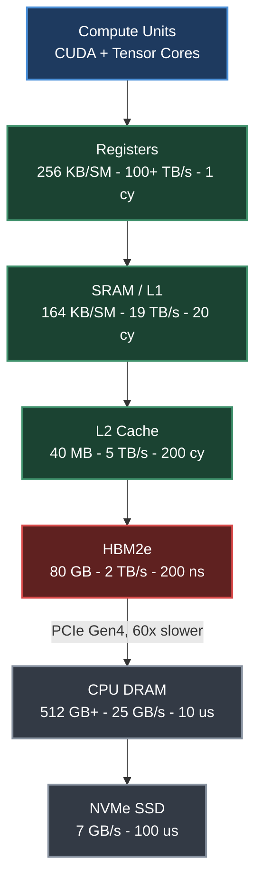
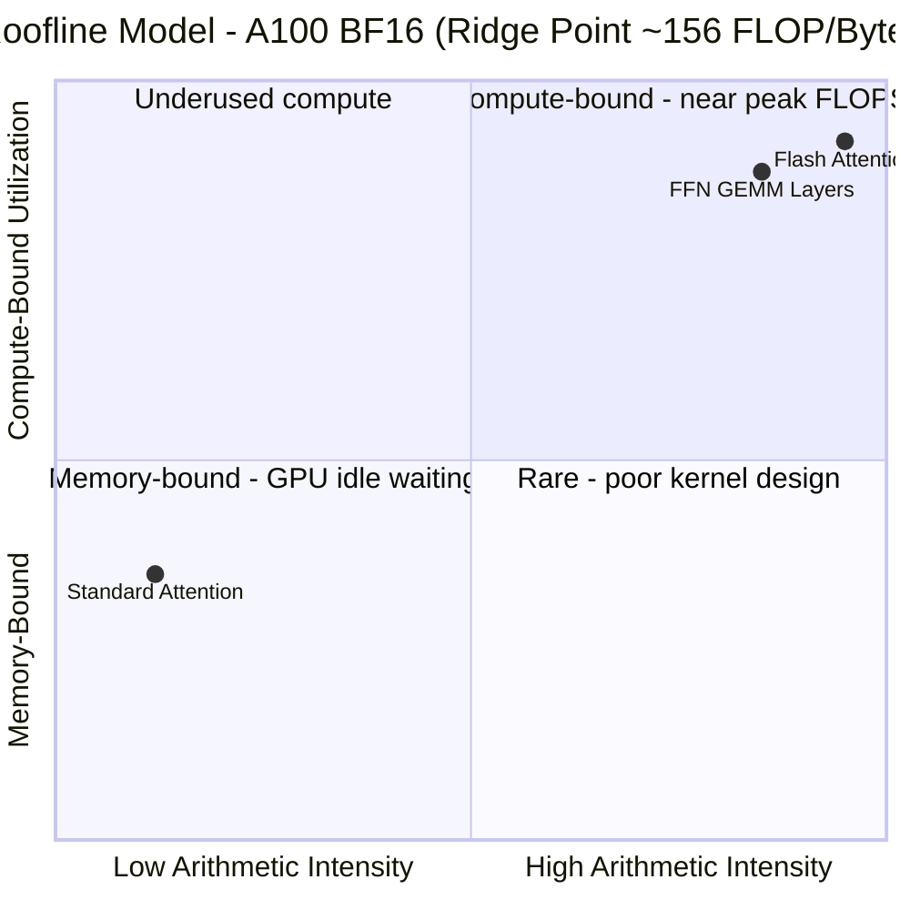
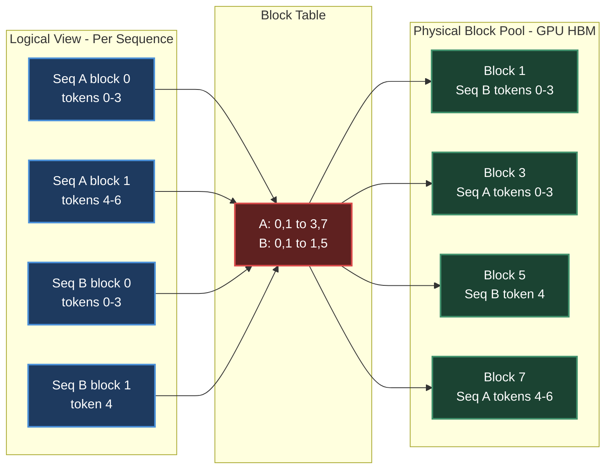
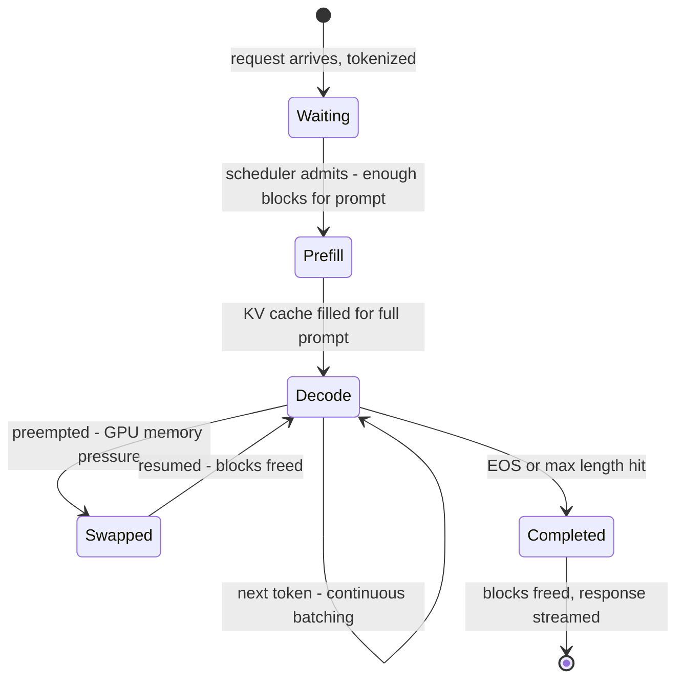

# Chapter 2. Systems Foundations for LLMs

> *"Understanding the hierarchy is not optional – it is the foundation for every optimization technique discussed in later sections."*

**Part I — Foundations** · Book pages 111–124 · ~18 min read

[← Chapter 1. LLM Architecture and Optimization](01-llm-architecture-and-optimization.md) · [Index](../README.md) · [Chapter 3. Introduction to Reinforcement Learning →](03-introduction-to-reinforcement-learning.md)

---

## What This Chapter Is About

Every parallelism strategy, kernel optimization, and infrastructure budget in later chapters rests on hardware facts: how fast a GPU (Graphics Processing Unit) moves a byte versus how fast it computes, and how many GPUs can talk before the network becomes the bottleneck. The chapter covers silicon upward — GPUs versus CPUs, NVIDIA's architecture generations, the Streaming Multiprocessor (SM), and why the memory hierarchy (registers → SRAM → L2 → HBM → CPU DRAM → NVMe) determines compute- versus memory-bound via arithmetic intensity and the roofline model, explaining why attention is memory-bound while the feed-forward network (FFN) is compute-bound — then vLLM, the engine that made PagedAttention the default way to manage the key-value (KV) cache.

Naive KV cache allocation wastes 60–80% of GPU memory to fragmentation; PagedAttention borrows the OS trick of paging to fix it, and continuous batching, speculative decoding, prefix caching, and guided decoding all build on top — together why vLLM serves a 70B model at 2,500–4,000 tokens/second where naive Hugging Face generation manages 300–600.

A reader of only this chapter should come away able to judge whether a kernel is memory- or compute-bound from first principles, and explain why production inference needs paged, not contiguous, KV cache memory.

## Table of Contents

- [The Mental Model](#the-mental-model)
- [GPU Architecture](#gpu-architecture)
  - [Why GPUs for Deep Learning](#why-gpus-for-deep-learning)
  - [NVIDIA GPU Microarchitecture Generations](#nvidia-gpu-microarchitecture-generations)
  - [Common GPUs for Training and Inference](#common-gpus-for-training-and-inference)
  - [The Streaming Multiprocessor](#the-streaming-multiprocessor)
  - [Chip Scaling Across Generations](#chip-scaling-across-generations)
  - [Arithmetic Intensity and the Roofline Model](#arithmetic-intensity-and-the-roofline-model)
  - [Attention Is Memory-Bound, FFN Is Compute-Bound](#attention-is-memory-bound-ffn-is-compute-bound)
  - [Tensor Cores](#tensor-cores)
  - [Communication Architecture](#communication-architecture)
- [vLLM: PagedAttention Inference](#vllm-pagedattention-inference)
  - [The KV Cache Fragmentation Problem](#the-kv-cache-fragmentation-problem)
  - [PagedAttention Mechanics](#pagedattention-mechanics)
  - [Benefits of PagedAttention](#benefits-of-pagedattention)
  - [Continuous Batching](#continuous-batching)
  - [Speculative Decoding in vLLM](#speculative-decoding-in-vllm)
  - [Memory Savings at Scale](#memory-savings-at-scale)
  - [Architecture and Request Lifecycle](#architecture-and-request-lifecycle)
  - [Prefix Caching](#prefix-caching)
  - [Guided Decoding](#guided-decoding)
  - [Dynamo Orchestration](#dynamo-orchestration)
- [Key Formulas](#key-formulas)
- [Decision Guide](#decision-guide)
- [Common Pitfalls](#common-pitfalls)
- [Summary](#summary)
- [Practitioner Checklist](#practitioner-checklist)
- [Going Deeper](#going-deeper)

---

## The Mental Model



*GPU memory hierarchy on an A100. Every level down is roughly 10x slower and 100–1000x larger than the one above. The A100 delivers 312 TFLOP/s of BF16 compute but only 2 TB/s of HBM bandwidth — a 156-to-1 ratio that is the single most important number in this chapter.*

Every optimization below is a variation on one theme: keep data as high in this hierarchy as possible, as long as possible. Registers are effectively free. SRAM is fast but tiny (164 KB/SM) and must be explicitly managed — the resource Flash Attention is built around. HBM (High Bandwidth Memory) holds weights, KV caches, activations, and optimizer states, but at 2 TB/s is 156x slower per FLOP than the A100's compute units. CPU DRAM and NVMe sit across PCIe, another 60x and thousands-of-times slower — usable for offloading only when compute-to-IO ratio is favorable.

## GPU Architecture

### Why GPUs for Deep Learning

CPUs optimize for *latency* — 8–96 cores, large caches, branch predictors, out-of-order execution, built to run a few threads as fast as possible. GPUs optimize for *throughput* — thousands of simple execution units grouped into SMs run thousands of threads in parallel. Deep learning is dominated by matrix multiplications — O(n³) operations on O(n²) data — an embarrassingly parallel shape that fits GPU throughput. A single 70B-parameter forward pass needs roughly 140 TFLOP (tera-floating-point operations) per token, which is why LLM training runs 100–1000x faster on GPUs than CPUs.

### NVIDIA GPU Microarchitecture Generations

| Architecture | Year | Flagship | Key Deep Learning Innovation |
|---|---|---|---|
| Pascal | 2016 | P100 | First HBM GPU; FP16 support; NVLink 1 |
| Volta | 2017 | V100 | Tensor Cores (first generation); mixed-precision training |
| Turing | 2018 | T4 | INT8 inference; RT cores (not used for ML) |
| Ampere | 2020 | A100 | BF16 Tensor Cores; TF32; 3rd-gen NVLink; MIG (Multi-Instance GPU) |
| Hopper | 2022 | H100 | FP8 Tensor Cores; TMA (Tensor Memory Accelerator); Transformer Engine; NVLink 4 |
| Blackwell | 2024 | B200 | 2nd-gen Transformer Engine; NVLink 5 (1.8 TB/s); FP4 |

### Common GPUs for Training and Inference

| GPU | Arch | HBM | BF16 TFLOP/s | HBM BW | NVLink | LLM Role |
|---|---|---|---|---|---|---|
| V100-32GB | Volta | 32 GB | 125* | 900 GB/s | 300 GB/s | Legacy; small-model fine-tune |
| A100-40GB | Ampere | 40 GB | 312 | 1.5 TB/s | 600 GB/s | Budget training/inference |
| A100-80GB | Ampere | 80 GB | 312 | 2.0 TB/s | 600 GB/s | Standard RLHF, Reinforcement Learning from Human Feedback (8–64 GPUs for 70B) |
| H100 SXM | Hopper | 80 GB | 990 | 3.35 TB/s | 900 GB/s | 3x faster training than A100 |
| H200 SXM | Hopper | 141 GB | 990 | 4.8 TB/s | 900 GB/s | Fits 70B policy + reference on fewer GPUs |
| B200 SXM | Blackwell | 192 GB | 2250 | 8.0 TB/s | 1800 GB/s | Next-gen; 2x over H100 |
| MI300X (AMD) | CDNA3 | 192 GB | 1300 | 5.3 TB/s | N/A | Most memory of any listed GPU; ROCm |
| TPU v5e (Google) | — | 16 GB | 197 | 1.6 TB/s | ICI 1.6 TB/s | Cloud-only; JAX/XLA |

All bandwidth figures are bidirectional.

> [!NOTE]
> The V100's 125 TFLOP/s* carries a footnote whose text was not captured by extraction (page 112) — treat it as a precision caveat, not a directly comparable BF16 figure.

> [!TIP]
> Which GPU to choose depends on the workload — see the [Decision Guide](#decision-guide) for the full training/inference/fine-tuning breakdown.

### The Streaming Multiprocessor

A GPU is an array of SMs, each an independent processor with its own register file, shared memory, and execution units.

| Component | Role | A100 spec |
|---|---|---|
| CUDA Cores | Scalar ALUs (Arithmetic Logic Units) for FP32/INT32; element-wise ops, reductions, non-matrix ops | 64 per SM |
| Tensor Cores | Matrix-multiply-accumulate (MMA) units; one 4×4×4 fused multiply-add per cycle | 4 per SM, ~16x CUDA-core throughput |
| Register File | Fastest storage, 1-cycle latency, shared among active threads | 256 KB/SM (65,536 32-bit registers) |
| Shared Memory / L1 | On-chip SRAM explicitly managed by the programmer; the basis of Flash Attention's performance | 192 KB/SM (up to 164 KB configurable as shared memory) |
| Warp Schedulers | Hide memory latency by switching between warps (32-thread groups) | 4 per SM |

The full A100 chip packs 108 such SMs behind a shared 40 MB L2 cache and 80 GB of HBM2e. GPUs use Single Instruction, Multiple Threads (SIMT): within a 32-thread warp, all threads run the same instruction on different data; divergent branches (`if`/`else`) serialize both paths — warp divergence — so kernels minimize branching. Core LLM ops (GEMM — General Matrix Multiply, attention, softmax) have uniform control flow, ideal for SIMT.

### Chip Scaling Across Generations

| Architecture | SMs | Tensor Cores/SM | SRAM/SM | L2 | Key Change |
|---|---|---|---|---|---|
| Volta (V100) | 80 | 8 | 128 KB | 6 MB | Introduced Tensor Cores |
| Ampere (A100) | 108 | 4 | 192 KB | 40 MB | BF16/TF32; larger L2 |
| Hopper (H100) | 132 | 4 | 256 KB | 50 MB | TMA; FP8; Thread Block Clusters |
| Blackwell (B200) | 148 | 4 | 256 KB | 128 MB | 2x die size; FP4; TMEM (Tensor Memory); NVLink 5 |

### Arithmetic Intensity and the Roofline Model

Arithmetic intensity *I* measures FLOPs per byte moved from HBM:

$$I = \frac{\text{FLOPs}}{\text{Bytes accessed from HBM}}$$

A kernel is memory-bound when *I* < *I*<sub>ridge</sub> and compute-bound when *I* > *I*<sub>ridge</sub>, where the ridge point is the hardware's peak compute divided by its peak bandwidth:

$$I_{ridge} = \frac{\text{Peak FLOP/s}}{\text{Peak Bandwidth}} = \frac{312\times10^{12}}{2\times10^{12}} = 156 \text{ FLOP/Byte (A100 BF16)}$$



*Standard attention sits deep in the memory-bound quadrant at ~62 FLOP/Byte; Flash Attention and the FFN's large GEMMs sit near the compute-bound corner. Positions are illustrative, not literal coordinates.*

For a single attention head with sequence length n = 4096 and head dimension d = 128, standard (non-Flash) attention does ≈4n²d ≈ 8.6 GFLOP of work, but its memory traffic is dominated by four full passes over the n×n score matrix — write scores, read them back for softmax, write softmax output, read it again for the final matmul — totaling ≈138 MB. That gives *I* ≈ 62 FLOP/Byte, only 40% of the A100's ridge point: the GPU sits idle roughly 60% of the time waiting on memory.

Flash Attention fixes this by never materializing the n×n matrix — tiling Q, K, V in SRAM, reading/writing only 4·n·d·2 = 4 MB total. Each byte is reused across O(n) computations, pushing *I* to n/2 = 2048 FLOP/Byte — 13x above ridge. The kernel hits the A100's full 312 TFLOP/s peak needing only ≈152 GB/s of bandwidth (7.6% of HBM capacity) — memory is no longer the bottleneck.

### Attention Is Memory-Bound, FFN Is Compute-Bound

Attention's QKᵀ product is O(n²d) FLOPs but needs O(n²) memory for the score matrix — at long sequence lengths, memory traffic dominates and attention is memory-bound. The FFN's two linear layers, shaped [d_model, 4·d_model], are large GEMMs with high arithmetic intensity and stay compute-bound. So Flash Attention (a memory optimization) helps attention but not the FFN, while quantization (shrinking weight size) helps the FFN more.

### Tensor Cores

Tensor Cores are specialized MMA units, introduced with Volta in 2017, each performing a 4×4×4 matrix multiply per cycle: D = A×B+C. The A100 has 432 Tensor Cores across its 108 SMs (4/SM) and delivers 312 TFLOP/s at BF16 — ~16x the FP32 CUDA cores on the same chip.

- **Precisions:** FP64, TF32, BF16, FP16, INT8, FP8 (H100+).
- **Accumulation** is always FP32 internally, even for BF16 inputs, preventing catastrophic cancellation.
- **Dimension requirement:** most efficient at multiples of 8 (BF16) or 16 (FP8) — padding to these is often worthwhile.
- **WGMMA (Hopper):** warpgroup-level MMA on larger 64×256×16 tiles, pipelined with TMA data movement.

> [!WARNING]
> **The Tensor Core Trap.** Tensor Cores only help when the kernel is compute-bound. At batch size 1 (single-sequence inference), GEMM tiles are tiny, Tensor Core utilization is low, and you fall back into the memory-bound regime — which is exactly why inference engines batch requests aggressively.

### Communication Architecture

Distributed training and inference move enormous data between GPUs, nodes, and storage; the communication fabric is often the bottleneck at scale.

**PCIe** is the host-device link, also used for cross-node GPU traffic when NVLink is unavailable and for NVMe access via the CPU:

| Generation | x16 BW (each direction) | Bidirectional | Notes |
|---|---|---|---|
| PCIe Gen3 | 16 GB/s | 32 GB/s | Common in older servers |
| PCIe Gen4 | 32 GB/s | 64 GB/s | A100 PCIe, most current servers |
| PCIe Gen5 | 64 GB/s | 128 GB/s | H100 PCIe, emerging |

> [!WARNING]
> **PCIe is not for GPU-GPU communication.** PCIe Gen4's 32 GB/s is 28x lower than NVLink 4's 900 GB/s; on NVLink-less multi-GPU servers (e.g., consumer GPUs), tensor parallelism becomes extremely slow.

**NVLink** is the intra-node interconnect:

| Generation | Links | Total BW | GPU |
|---|---|---|---|
| NVLink 2 | 6 | 300 GB/s | V100 |
| NVLink 3 | 12 | 600 GB/s | A100 |
| NVLink 4 | 18 | 900 GB/s | H100 |
| NVLink 5 | 18 | 1800 GB/s | B200 (Blackwell) |

The H100 SXM5's 18 NVLink 4 links each give 50 GB/s bidirectional, 900 GB/s total. In a DGX H100, all 8 GPUs connect through NVSwitch for full bisection bandwidth — any GPU reaches any other at full speed, not just ring neighbors. A ring AllReduce achieves only ~0.57×*B*<sub>link</sub> at N = 8; NVSwitch's tree-based algorithms get closer to peak: ~700 GB/s (ring) versus ~900 GB/s (NVSwitch) on DGX H100.

**InfiniBand** carries inter-node traffic: NDR (Next Data Rate) 400 Gb/s = 50 GB/s/port unidirectional, versus 25 GB/s for prior-gen HDR (High Data Rate) 200 Gb/s. RDMA (Remote Direct Memory Access) reads/writes remote GPU memory without the remote CPU; GPUDirect RDMA routes HBM → NIC → network → NIC → HBM directly, at ~1–2 μs latency versus ~100 μs for TCP/IP.

Large clusters use fat-tree topologies — a 3-level fat-tree with k-port switches supports k³/4 nodes at full bisection bandwidth (k = 64 at 400 Gb/s NDR gives 64³/4 = 65,536 nodes) — with rail-optimized wiring so each GPU's NIC (Network Interface Card) hits a different top-of-rack switch, letting an AllReduce use every link at once.

```mermaid
flowchart TB
    subgraph Node1["Node 1 - 8x GPU Server"]
        G1["GPUs 0-7"]
        SW1["NVSwitch\n900 GB/s full bisection"]
        G1 --- SW1
    end
    subgraph Node2["Node 2 - 8x GPU Server"]
        G2["GPUs 0-7"]
        SW2["NVSwitch\n900 GB/s full bisection"]
        G2 --- SW2
    end
    SW1 -->|InfiniBand NDR rail-optimized| TOR["Top-of-Rack Switch"]
    SW2 -->|InfiniBand NDR rail-optimized| TOR

    classDef fast fill:#1b4332,stroke:#40916c,stroke-width:2px,color:#ffffff
    classDef net fill:#333a45,stroke:#8892a0,stroke-width:2px,color:#ffffff
    class G1,G2,SW1,SW2 fast
    class TOR net
```



*Two-node, 8-GPU-per-node topology. Intra-node traffic stays on NVLink through NVSwitch; inter-node traffic crosses InfiniBand NDR, one NIC per GPU for rail-optimized AllReduce.*

Distributed training relies on a small set of collective primitives:

| Primitive | Use Case | Volume |
|---|---|---|
| AllReduce | Gradient sync (DDP — Distributed Data Parallel, FSDP — Fully Sharded Data Parallel) | 2(N−1)/N × param size |
| AllGather | Collect sharded weights (FSDP) | (N−1)/N × param size |
| ReduceScatter | Scatter gradients (FSDP) | (N−1)/N × param size |
| AllGather | Tensor-parallel activation exchange | activation size |
| Point-to-Point | Pipeline parallel send/recv | micro-batch activation |
| Broadcast | Weight sync to new workers | full model size |

**Worked example:** 8 nodes × 8 GPUs = 64 GPUs, data-parallel degree 64, BF16 gradients for a 70B model. Gradient size = 70×10⁹×2 bytes = 140 GB; ring AllReduce volume/GPU = 2×(64−1)/64×140 ≈ 275 GB. Inter-node bandwidth (8 NICs × 50 GB/s, rail-optimized) = 400 GB/s, so AllReduce takes ≈275/400 ≈ 0.69 s/step — 41% of a 1-second compute step, why gradient compression, mixed precision, and FSDP overlap matter at this scale.

## vLLM: PagedAttention Inference

vLLM introduced PagedAttention, borrowing the paging abstraction operating systems use for RAM and applying it to the GPU's KV cache — the stored key/value tensors for every previous token, and the dominant memory consumer during inference.

### The KV Cache Fragmentation Problem

$$\text{KV cache size} = 2 \times L \times H \times d \times n \times \text{bytes\_per\_element}$$

For Llama-3 70B (BF16) with L = 80 layers, H = 8 heads (GQA — Grouped Query Attention), d = 128: size = 2×80×8×128×n×2 = 327,680×n bytes — ≈1.3 GB per sequence at n = 4096 tokens.

Traditional systems pre-allocate a contiguous block per sequence sized to the maximum possible length, causing two kinds of waste. **Internal fragmentation:** a sequence generating only 500 tokens still holds a block reserved for 4096 — 3596 wasted slots. **External fragmentation:** free memory splits into small non-contiguous gaps as sequences complete, so a long sequence can fail to allocate even with enough total free memory. Naive allocation leaves GPU memory utilization at only 20–40%.

### PagedAttention Mechanics

PagedAttention (Kwon et al., 2023) carves the KV cache into fixed-size pages (blocks) and uses a block table — analogous to a CPU page table — translating each sequence's logical token positions into scattered physical addresses.

- **Block size:** typically 16 tokens (tunable); each block stores 16×2×L×H×d elements.
- **Block table:** per-sequence mapping from logical to physical block index.
- **Physical block pool:** pre-allocated fixed-size blocks; allocation is O(1), popping a free list.
- **Attention kernel:** gathers KV blocks from non-contiguous locations via the block table.



*Two 4-token-block sequences (A: 7 tokens, B: 5 tokens) mapped through a block table into non-contiguous physical blocks. Block 7 is partially filled with sequence A's tail; the kernel gathers it and block 3 in order via the table.*

### Benefits of PagedAttention

**Near-zero waste.** Internal fragmentation is bounded to at most one partially-filled block per sequence — with 16-token blocks, worst case is 15 wasted tokens. External fragmentation disappears since blocks are fixed-size and interchangeable.

**Dynamic allocation.** Blocks allocate on demand as a sequence grows; the system never needs the final output length in advance.

**Prefix sharing (copy-on-write).** Sequences sharing a prefix — a system prompt — share physical blocks via the block table; a write diverging from the prefix triggers copy-on-write. Chatbot example, 1000-token prompt, 128 users: without sharing, 128×1000×327,680/10⁹ ≈ 42 GB; with sharing, 1×1000×327,680/10⁹ ≈ 0.33 GB — a ~128x saving.

**Preemption via swap.** When GPU memory is exhausted, vLLM can swap a sequence's KV blocks to CPU DRAM, or discard and recompute later — feasible only because blocks are self-contained and non-contiguous.

### Continuous Batching

Static batching waits for every sequence to finish before starting new ones; if one needs 500 tokens and another needs 10, the GPU idles 490 steps on the finished slot. Continuous batching (iteration-level scheduling) instead processes one decode step at a time — free finished (EOS — End of Sequence) sequences' blocks, fill slots with waiting sequences, run the next step, composition changing every step. This holds utilization near 100% for 1.5–3x throughput over static batching, depending on PagedAttention's dynamic block allocation.

### Speculative Decoding in vLLM

A small draft model (e.g., 1B parameters) proposes k candidate tokens; the target model verifies them in one forward pass, accepting every token up to the first rejection (expected: 3–5 tokens/step) — a 2–3x speedup for single-sequence generation with no quality loss. vLLM gives draft tokens speculative KV blocks: freed cheaply on rejection, promoted to the main sequence on acceptance, with an O(k) block-table update.

### Memory Savings at Scale

Setup: Llama-3 70B, BF16, single 8×A100-80GB node, tensor-parallel. Weights: 70×10⁹×2 bytes = 140 GB ÷ 8 GPUs = 17.5 GB/GPU; remaining for KV cache: 80 − 17.5 − 3 (overhead) = 59.5 GB/GPU. KV cache per token per GPU (TP = 8, 1/8 heads each): 2×80×1×128×2 = 40,960 bytes ≈ 40 KB/token → 59.5×10⁹/40,960 ≈ 1.45 million tokens of capacity, well past 128 concurrent 4096-token sequences (524,288 tokens). Without PagedAttention, ~50% fragmentation waste fits only 64 sequences.

Larger blocks reduce block-table overhead and improve locality; smaller blocks reduce internal fragmentation and enable finer prefix sharing. vLLM's default of 16 tokens/block balances the two; 100K+ token sequences may prefer 32–64.

### Architecture and Request Lifecycle

vLLM wraps PagedAttention in a full serving stack — continuous batching, prefix caching, speculative decoding, and tensor-parallel sharding together maximize throughput per GPU dollar.

| Component | Responsibility |
|---|---|
| API Server | Accepts OpenAI-compatible requests, tokenizes inputs, creates sequence groups (for beam search or multiple samples) |
| Scheduler | Maintains `waiting` (prefill pending), `running` (decoding), and `swapped` (preempted, KV offloaded) queues; each iteration decides which requests run given available memory blocks |
| Block Manager | Maps logical to physical blocks; handles allocation, copy-on-write, GPU↔CPU swap, and prefix caching |
| Model Executor | Runs the forward pass, manages tensor parallelism across GPUs, dispatches attention kernels against paged blocks |
| KV Cache Pool | Pre-allocated GPU memory in fixed-size blocks (default: 16 tokens × num_heads × head_dim × 2 bytes); no runtime dynamic allocation, so zero fragmentation |



*Request lifecycle in vLLM. Prefill (the full prompt in one pass) is compute-bound; decode (one token per sequence per step, batched with every other running sequence) is memory-bound. Preemption swaps a sequence's blocks to CPU rather than discarding progress outright.*

When a sequence's last block fills during decode, the Block Manager allocates a new one; on completion (EOS or max length) its blocks free immediately and the response streams back.

### Prefix Caching

When requests share a prefix (a system prompt, few-shot examples), vLLM hashes each logical block's token content and checks new arrivals against the cache. On a hit, it skips prefill for those tokens and reuses the physical blocks, dropping time-to-first-token (TTFT) sharply. Eviction follows LRU (Least Recently Used), freeing blocks only under memory pressure. For chat apps with 2K+ token system prompts shared across all users, this cuts TTFT by 60–80%.

### Guided Decoding

vLLM natively supports constrained decoding through pluggable backends, guaranteeing structured output with minimal overhead. The OpenAI-compatible API accepts constraints via `guided_*` parameters or `response_format`:

```python
from openai import OpenAI
client = OpenAI(base_url="http://localhost:8000/v1")

response = client.chat.completions.create(
    model="meta-llama/Llama-3-70B-Instruct",
    messages=[{"role": "user",
               "content": "Extract: name, age, city from: "
                          "'John is 30 and lives in NYC'"}],
    extra_body={
        "guided_json": {
            "type": "object",
            "properties": {
                "name": {"type": "string"},
                "age": {"type": "integer"},
                "city": {"type": "string"}
            },
            "required": ["name", "age", "city"]
        }
    }
)
# Output is guaranteed valid JSON matching the schema
```

`guided_regex` and `guided_choice` follow the same pattern. Two backends compute the mask: **XGrammar** (default since v0.7), a pushdown-automaton engine for JSON schemas, regexes, and EBNF (Extended Backus-Naur Form) grammars, fastest via its C++ core; and **Outlines**, an FSM (Finite State Machine)-based fallback. The mask applies after logits, before sampling — under 1 ms/step, O(1) lookup, negligible throughput loss (<2%). The real cost is compiling a schema into an FSM/PDA (Pushdown Automaton) index, 0.5–5 s, cached by vLLM and paid once per schema.

> [!WARNING]
> **Structured output ≠ correct output.** Constrained decoding guarantees syntactic validity — the output parses as JSON and matches the schema's types. It does not guarantee semantic correctness: the model can still hallucinate values that parse correctly but are factually wrong. Always validate business logic downstream.

| Metric | vLLM | HF (Hugging Face) Generate | Why |
|---|---|---|---|
| Throughput (tok/s) | 2,500–4,000 | 300–600 | Continuous batching + PagedAttention |
| Memory utilization | 90–95% | 50–60% | Zero fragmentation, dynamic block allocation |
| Max concurrent sequences | 200–500 | 16–32 | Paged KV eliminates per-sequence reservation |
| Time-to-first-token | 100–300 ms | 500–2000 ms | Prefix caching for repeated system prompts |

*(70B model, 4×A100, tensor parallel = 4.)*

### Dynamo Orchestration

NVIDIA Dynamo is an open-source orchestration layer above individual engines (SGLang, TensorRT-LLM, vLLM), coordinating them into a multi-node serving system: disaggregated serving (prefill/decode on specialized node pools), KV-cache-locality routing, multi-tier caching (GPU → CPU → SSD), and automatic scaling — closing the gap between single-GPU optimization (vLLM) and datacenter-scale production serving.

## Key Formulas

$$I = \frac{\text{FLOPs}}{\text{Bytes accessed from HBM}} \qquad I_{ridge} = \frac{\text{Peak FLOP/s}}{\text{Peak Bandwidth}}$$

$$\text{KV cache size} = 2 \times L \times H \times d \times n \times \text{bytes\_per\_element}$$

| Symbol | Meaning |
|---|---|
| *I* | Arithmetic intensity of a kernel (FLOP/Byte) |
| *I*<sub>ridge</sub> | Hardware ridge point — the intensity at which compute and bandwidth limits cross |
| *L* | Number of transformer layers |
| *H* | Number of attention heads (KV heads under GQA) |
| *d* | Head dimension |
| *n* | Sequence length in tokens |

At the limits: as *I* → 0, a kernel is purely memory-bound and added compute is free until bandwidth saturates. As *I* → ∞, a kernel is purely compute-bound and extra bandwidth adds nothing — where Flash Attention's *I* ≈ 2048 FLOP/Byte lands, 13x past the A100's *I*<sub>ridge</sub> = 156.

## Decision Guide

| Scenario | Choice | Why |
|---|---|---|
| Training 70B+ models | H100/B200 nodes with NVLink, min. 8×H100/instance | Tensor parallelism needs fast interconnect |
| Latency-sensitive inference, bandwidth-bound | H100/H200 | Highest HBM bandwidth per GPU |
| Latency-sensitive inference, KV-cache-heavy | MI300X | Most HBM capacity (192 GB) |
| Fine-tuning 7B–13B | Single A100-80GB + LoRA (Low-Rank Adaptation) | Cost-effective |
| Budget LoRA fine-tuning on 7B models | A100-40GB or A10 (24 GB) | Lowest cost |
| Tensor Parallelism (TP) | Within a node, over NVLink only | Needs an all-reduce every layer; TP=8 standard on H100 DGX nodes |
| Pipeline Parallelism (PP) | Can cross nodes | Point-to-point between stages; adds bubble overhead |
| Data Parallelism (DP) | Can cross nodes via InfiniBand | AllReduce of gradients; scales well with fast IB |
| FSDP / ZeRO (Zero Redundancy Optimizer) | Preferred over plain DP for large models | AllGather + ReduceScatter; shards optimizer state, overlaps communication |

## Common Pitfalls

> [!WARNING]
> **The tensor core trap.** Batch size 1 produces tiny GEMM tiles, leaving Tensor Cores under-utilized and the kernel memory-bound regardless of hardware — batch aggressively.

> [!WARNING]
> **PCIe is not for GPU-GPU traffic.** PCIe Gen4 (32 GB/s) is 28x slower than NVLink 4 (900 GB/s); NVLink-less multi-GPU servers make tensor parallelism the bottleneck.

> [!WARNING]
> **Pre-allocating KV cache to max sequence length.** Naive contiguous allocation caps GPU memory utilization at 20–40% from fragmentation — the problem PagedAttention exists to fix.

> [!WARNING]
> **Underestimating communication overhead.** In the worked 70B gradient AllReduce, communication consumed 41% of a 1-second training step — treat interconnect bandwidth as a capacity constraint, not an afterthought.

> [!WARNING]
> **Guided decoding is not a correctness guarantee.** It guarantees syntax, not semantics — a schema-valid JSON object can still contain hallucinated values.

## Summary

- GPUs beat CPUs by 100–1000x on LLM workloads because deep learning is dominated by O(n³) matmuls on O(n²) data — a shape that fits thousands of throughput-oriented cores, not a handful of latency-optimized ones.
- The A100 does ~156 FLOP per byte from HBM (312 TFLOP/s ÷ 2 TB/s); any kernel below that ridge point is memory-bound regardless of raw compute available.
- Standard attention hits only ~62 FLOP/Byte (40% of ridge, GPU idle ~60% of the time) from four passes over the n×n score matrix; Flash Attention tiles Q/K/V in SRAM to reach ~2048 FLOP/Byte, 13x above ridge, needing only ~152 GB/s to sustain peak throughput.
- FFN layers are large, high-intensity GEMMs that stay compute-bound, so Flash Attention helps attention but not FFN, while quantization helps FFN more than attention.
- NVLink (900 GB/s on H100, 28x PCIe Gen4) carries GPU-to-GPU traffic within a node; InfiniBand NDR (50 GB/s/port, ~1–2 μs latency via GPUDirect RDMA) carries it between nodes — yet an 8-node/64-GPU 70B gradient AllReduce still eats ~41% of a 1-second training step.
- PagedAttention applies OS-style paging to the KV cache — 16-token blocks plus a block table — eliminating the fragmentation that caps naive allocation at 20–40% GPU memory utilization.
- Prefix sharing via copy-on-write cuts shared-prompt KV cache memory ~128x for a 128-user chatbot (42 GB to 0.33 GB), and prefix caching cuts TTFT 60–80% for repeated prompts.
- Continuous batching plus PagedAttention keeps utilization near 100% for 1.5–3x throughput over static batching; vLLM reaches 2,500–4,000 tok/s on a 70B model versus 300–600 tok/s for Hugging Face generate.
- Guided decoding (XGrammar default, Outlines fallback) masks logits in O(1) per step, under 1 ms overhead and under 2% throughput loss, but guarantees only syntactic validity, never semantic correctness.

## Practitioner Checklist

- [ ] Compute arithmetic intensity (FLOPs ÷ bytes from HBM) for custom kernels before assuming compute-bound.
- [ ] Compare against the ridge point (Peak FLOP/s ÷ Peak Bandwidth, ≈156 FLOP/Byte on A100 BF16) to classify memory- vs compute-bound.
- [ ] Use Flash Attention (or equivalent SRAM tiling) once sequence length pushes attention into the memory-bound regime.
- [ ] Batch inference requests aggressively — Tensor Cores sit idle at batch size 1.
- [ ] Never route GPU-to-GPU traffic over PCIe when NVLink is available.
- [ ] Keep tensor parallelism inside a node over NVLink; let pipeline/data parallelism cross nodes over InfiniBand.
- [ ] Prefer FSDP/ZeRO over plain DDP for large models to shard optimizer state and overlap communication.
- [ ] Choose KV cache block size deliberately — 16 tokens by default, 32–64 for 100K+ token sequences.
- [ ] Enable prefix caching for chat workloads with long, repeated system prompts.
- [ ] Size KV cache capacity from GPU memory minus weights minus overhead, not a fixed max-length assumption.
- [ ] Use `guided_json`/`guided_regex`/`guided_choice` for structured output, but still validate results downstream.
- [ ] Match GPU to workload: H100/B200+NVLink for 70B+ training, H100/H200 for bandwidth-sensitive inference, MI300X for KV-cache-heavy inference.

## Going Deeper

- **"Efficient Memory Management for Large Language Model Serving with PagedAttention"** — Kwon et al., 2023. The vLLM/PagedAttention paper.
- **XGrammar** — pushdown-automaton engine; vLLM's default guided-decoding backend since v0.7.
- **Outlines** — FSM-based constrained-decoding library; vLLM's fallback backend.
- **NVIDIA Dynamo** — orchestration layer for datacenter-scale disaggregated serving across vLLM, SGLang, and TensorRT-LLM.
- **DeepSpeed ZeRO-Infinity** — CPU/NVMe optimizer-state offload over the PCIe/NVMe links covered in this chapter.

---

[← Chapter 1. LLM Architecture and Optimization](01-llm-architecture-and-optimization.md) · [Index](../README.md) · [Chapter 3. Introduction to Reinforcement Learning →](03-introduction-to-reinforcement-learning.md)

*Summary of Chapter 2 of [The Hitchhiker's Guide to Agentic AI](https://arxiv.org/abs/2606.24937)
by Haggai Roitman. Licensed CC BY-SA 4.0. Independent study notes — not affiliated with or
endorsed by the author.*
