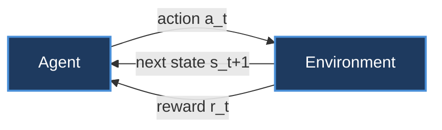
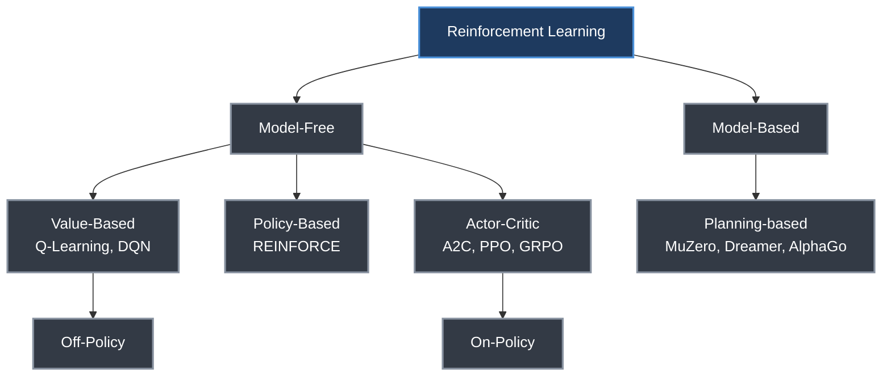
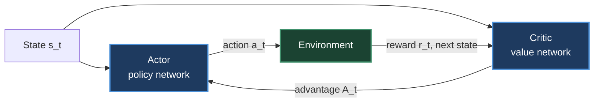
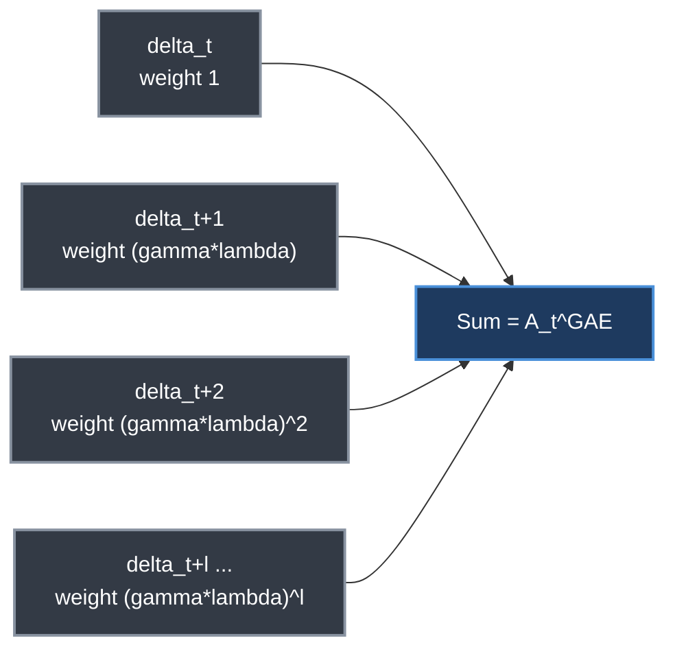
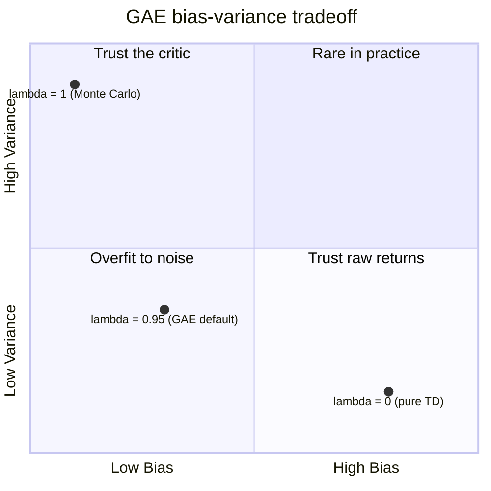

# Chapter 3. Introduction to Reinforcement Learning

> *"RL discovers optimal behavior through trial and error."* — H. Roitman

**Part I — Foundations** · Book pages 125–137 · ~16 min read

[← Chapter 2. Systems Foundations for LLMs](02-systems-foundations-for-llms.md) · [Index](../README.md) · [Chapter 4. RL Foundations for Language Models →](04-rl-foundations-for-language-models.md)

---

## What This Chapter Is About

Reinforcement Learning (RL) is a paradigm where an agent learns to make sequential decisions by interacting with an environment, receiving rewards as feedback, and optimizing its policy to maximize cumulative reward over time. Unlike supervised learning, which trains on fixed labeled input-output pairs, RL has no ground-truth labels — it discovers what to do purely by acting, observing consequences, and adjusting. That distinction is why RL needs its own vocabulary: states, actions, policies, returns, value functions, and the Bellman equations that tie them together.

This chapter builds that vocabulary: the Markov Decision Process (MDP) as the formal object RL solves, the taxonomy separating model-based from model-free, value-based from policy-based, and on-policy from off-policy methods, and the two algorithmic lineages — Q-learning and policy gradients — everything downstream descends from. It closes with Generalized Advantage Estimation (GAE) and reward shaping, both of which recur constantly once RL gets applied to language models.

Every later chapter in Part II assumes this one. Proximal Policy Optimization (PPO), Direct Preference Optimization (DPO), and Group Relative Policy Optimization (GRPO) all answer a question posed here: given that a large language model's action space is its entire vocabulary (32K–128K tokens) and its state space is every possible token sequence, which corner of the RL taxonomy is even usable? The answer — policy-based, model-free, and increasingly actor-critic-free — is derived below, not asserted.

## Table of Contents

- [The Mental Model](#the-mental-model)
- [The Markov Decision Process](#the-markov-decision-process)
- [Core Concepts and Definitions](#core-concepts-and-definitions)
- [Taxonomy of RL Methods](#taxonomy-of-rl-methods)
- [Temporal Difference (TD) Learning](#temporal-difference-td-learning)
  - [Understanding TD Error as a Surprise Signal](#understanding-td-error-as-a-surprise-signal)
  - [The TD Error Formula](#the-td-error-formula)
  - [How the Agent Uses TD Error](#how-the-agent-uses-td-error)
- [Q-Learning and Replay Buffers](#q-learning-and-replay-buffers)
  - [Deep Q-Networks (DQN)](#deep-q-networks-dqn)
  - [Replay Buffers](#replay-buffers)
  - [Why Q-Learning Fails for LLMs](#why-q-learning-fails-for-llms)
- [Policy Gradient Methods (REINFORCE)](#policy-gradient-methods-reinforce)
- [Actor-Critic Methods](#actor-critic-methods)
  - [Evolution to PPO for LLMs](#evolution-to-ppo-for-llms)
- [Generalized Advantage Estimation (GAE)](#generalized-advantage-estimation-gae)
  - [Intuitive Mapping of Bias and Variance](#intuitive-mapping-of-bias-and-variance)
  - [The Architectural Spectrum: Boundary Analysis](#the-architectural-spectrum-boundary-analysis)
  - [The Trade-off Matrix](#the-trade-off-matrix)
  - [Diagnostics for Tuning Lambda](#diagnostics-for-tuning-lambda)
- [On-Policy vs Off-Policy](#on-policy-vs-off-policy)
- [Model-Based vs Model-Free](#model-based-vs-model-free)
- [Reward Shaping](#reward-shaping)
  - [The Mathematical Framework](#the-mathematical-framework)
  - [Potential-Based Reward Shaping (PBRS)](#potential-based-reward-shaping-pbrs)
  - [Theoretical Guarantees](#theoretical-guarantees)
- [Key Formulas](#key-formulas)
- [Decision Guide](#decision-guide)
- [Common Pitfalls](#common-pitfalls)
- [Summary](#summary)
- [Practitioner Checklist](#practitioner-checklist)
- [Going Deeper](#going-deeper)

---

## The Mental Model

*The agent-environment interaction loop: every RL problem, from Atari to LLM alignment, reduces to this cycle repeated until a terminal state or horizon T.*

At each time step, the agent observes state \\(s_t\\), selects action \\(a_t\\) according to its policy \\(\pi(a|s)\\), the environment transitions to \\(s_{t+1}\\) drawn from the transition function, and the agent receives reward \\(r_t\\). This repeats until the episode ends. Everything else in this chapter — value functions, Q-functions, TD error, policy gradients — exists to answer one question inside this loop: given the state I'm in, which action should I take to maximize the rewards I collect from here forward?

## The Markov Decision Process

An MDP is formalized as a 5-tuple \\((S, A, P, R, \gamma)\\):

- **S** — State space: all possible configurations of the environment.
- **A** — Action space: all actions available to the agent.
- **P(s'|s,a)** — Transition function: probability of reaching state s' from state s after taking action a.
- **R(s,a,s')** — Reward function: immediate scalar feedback for a transition.
- **γ ∈ [0,1]** — Discount factor: how much future rewards are valued relative to immediate ones.

The **Markov Property** is what makes the problem tractable: the future depends only on the current state, not the full history. Formally, \\(P(s_{t+1}|s_t,a_t,s_{t-1},a_{t-1},\ldots) = P(s_{t+1}|s_t,a_t)\\) — everything you need to predict what happens next is already captured in the current state. This 5-tuple is exactly what drives the loop shown above: each of its five steps corresponds directly to one part of the tuple.

## Core Concepts and Definitions

| Concept | Definition |
|---|---|
| Policy \\(\pi(a\vert s)\\) | Maps states to action probabilities; deterministic \\(a=\pi(s)\\) or stochastic \\(a\sim\pi(\cdot\vert s)\\) |
| Return \\(G_t\\) | Cumulative discounted reward: \\(G_t = \sum_{k=0}^\infty \gamma^k r_{t+k}\\) |
| Value \\(V^\pi(s)\\) | Expected return from s under π: \\(\mathbb{E}_\pi[G_t \mid s_t=s]\\) |
| Action-value \\(Q^\pi(s,a)\\) | Expected return from s, taking a, then following π |
| Advantage \\(A^\pi(s,a)\\) | \\(Q^\pi(s,a) - V^\pi(s)\\) — how much better a is than average |

The **Bellman equations** express value recursively — a state's value is the expected immediate reward plus the discounted value of whatever comes next. **Bellman optimality** does the same for \\(\pi^*\\), replacing the expectation over actions with a max. Once \\(Q^*\\) is known, the optimal policy is simply \\(\pi^*(s) = \arg\max_a Q^*(s,a)\\) — that single identity is the entire justification for value-based methods like Q-learning.

## Taxonomy of RL Methods

*RL methods split along three largely independent axes: whether they learn an environment model, whether they learn a value function or a policy directly, and whether training data must come from the current policy.*

**Model-Free vs Model-Based.** Model-free methods learn a policy or value function directly from experience with no knowledge of environment dynamics — most practical for LLMs, since language dynamics are intractable to model. Model-based methods learn or use a model of environment transitions \\(P(s'|s,a)\\) and can plan ahead; more sample-efficient, but only as good as the model is accurate.

**Value-Based vs Policy-Based.** Value-based methods learn \\(Q(s,a)\\) or \\(V(s)\\) and derive the policy by taking the argmax; they work well for discrete, small action spaces (e.g., Atari) but struggle as action spaces grow. Policy-based methods directly parameterize and optimize \\(\pi_\theta(a|s)\\) — natural for continuous or high-dimensional action spaces, and essential for LLMs, where the vocabulary is 32K–128K actions. Actor-Critic combines both: the actor proposes actions, the critic evaluates them. PPO for LLMs is an actor-critic method.

**On-Policy vs Off-Policy** (detailed comparison later): on-policy methods (REINFORCE, PPO, A2C, GRPO) learn only from data generated by the current policy and must regenerate data after every update; off-policy methods (Q-Learning, DQN, SAC, DPO) can learn from any policy's data, including old or replayed experience.

## Temporal Difference (TD) Learning

TD learning bootstraps: it updates value estimates using other value estimates, without waiting for a full episode to finish.

### Understanding TD Error as a Surprise Signal

TD error measures the discrepancy between an agent's current estimate of future reward and a newly updated estimate after taking one step — what the agent thought would happen versus what actually happened plus what it now expects next. The book frames it as the agent's "surprise": imagine driving home expecting a 30-minute trip. After 10 minutes you hit unexpected construction, and your GPS now estimates 35 minutes remaining — a new total of 45 minutes versus the original 30-minute prediction. That +15-minute gap is the TD error, the signal you use to update your mental model going forward. A positive TD error means the outcome beat expectations, so the state's value should rise; a negative one means the value should fall.

### The TD Error Formula

$$\delta_t = R_{t+1} + \gamma V(S_{t+1}) - V(S_t)$$

The combined term \\(R_{t+1} + \gamma V(S_{t+1})\\) is called the **TD Target**, so TD Error = TD Target − Old Estimate.

### How the Agent Uses TD Error

The agent adjusts its value function to drive TD error toward zero:

$$V(S_t) \leftarrow V(S_t) + \alpha \cdot \delta_t$$

If \\(\delta_t > 0\\), the outcome beat prediction, so \\(V(S_t)\\) increases (the agent learns to seek this state). If \\(\delta_t < 0\\), it underperformed, so \\(V(S_t)\\) decreases (the agent learns to avoid it). If \\(\delta_t = 0\\), the prediction was already perfect and no update is needed — that's convergence.

> [!NOTE]
> **TD vs Monte Carlo.** Monte Carlo waits until an episode ends and uses the actual return \\(G_t\\): unbiased but high variance, since one full trajectory can be unrepresentative. TD updates after every step using the estimated future value \\(\gamma V(s_{t+1})\\): biased but much lower variance, since one-step updates don't compound noise. TD(λ) interpolates between the two — λ=0 is pure TD, λ=1 is pure Monte Carlo. This is exactly what GAE does for PPO, with λ=0.95.

The generalization to multi-step returns is:

$$G_t^{(n)} = r_t + \gamma r_{t+1} + \cdots + \gamma^{n-1} r_{t+n-1} + \gamma^n V(s_{t+n})$$

## Q-Learning and Replay Buffers

Q-Learning is the foundational off-policy, value-based algorithm: it learns the optimal \\(Q^*\\) directly, regardless of the policy actually being followed.

$$Q(s_t,a_t) \leftarrow Q(s_t,a_t) + \alpha\left[r_t + \gamma \max_{a'} Q(s_{t+1},a') - Q(s_t,a_t)\right]$$

> [!NOTE]
> **Why Q-Learning is off-policy.** The update uses \\(\max_{a'} Q(s_{t+1},a')\\) — the value of the best action at the next state, regardless of which action the agent actually took. The target is always computed under the optimal policy even if the behavior policy explores randomly (ε-greedy). That's why Q-learning can train from replay buffers, demonstrations, or any source of experience — the data doesn't need to come from the current policy.

SARSA is the on-policy alternative: it uses the action actually taken in place of the max, \\(Q(s_t,a_t) \leftarrow Q(s_t,a_t) + \alpha[r_t + \gamma Q(s_{t+1},a_{t+1}) - Q(s_t,a_t)]\\).

### Deep Q-Networks (DQN)

DQN replaces the tabular \\(Q(s,a)\\) with a neural network \\(Q_\theta(s,a)\\), adding three key innovations: an experience replay buffer, a target network, and ε-greedy exploration. It minimizes mean squared TD error over mini-batches from the replay buffer:

$$L(\theta) = \mathbb{E}_{(s,a,r,s') \sim B}\left[\left(r + \gamma \max_{a'} Q_{\bar\theta}(s',a') - Q_\theta(s,a)\right)^2\right]$$

Here \\(Q_{\bar\theta}\\) is the target network — a frozen copy of \\(Q_\theta\\) updated only every C steps (e.g., C = 10,000), which exists specifically to prevent the **moving target problem**: without a frozen target, the prediction and the target it's chasing shift simultaneously and training can diverge. The gradient update treats the target as a constant (no gradient flows through \\(\bar\theta\\)): \\(\theta \leftarrow \theta - \alpha \cdot \delta \cdot \nabla_\theta Q_\theta(s,a)\\), where δ is exactly the TD error from the loss above.

The training loop per step: **Act** via ε-greedy (random with probability ε, else \\(\arg\max_a Q_\theta(s,a)\\)), annealing ε from 1.0 to 0.01 over the first 1M steps; **Store** the transition \\((s,a,r,s',d)\\) in replay buffer B (capacity ~1M); **Sample** a mini-batch of 32 transitions; **Compute target** \\(y = r + \gamma(1-d)\max_{a'} Q_{\bar\theta}(s',a')\\) (zero future value if terminal); **Update** via gradient descent on \\((y - Q_\theta(s,a))^2\\), clipping gradients to [−1, 1] (a Huber loss variant); **Sync target** every C steps, \\(\bar\theta \leftarrow \theta\\).

### Replay Buffers

A replay buffer (experience replay) stores past transitions so the agent can relearn from them later instead of discarding data immediately after use. Each stored transition is a tuple \\(e_t = (s_t, a_t, r_t, s_{t+1}, d_t)\\), where \\(d_t\\) flags episode termination — implemented in practice as a bounded queue that pushes new transitions and samples random mini-batches for training.

Replay buffers matter for three reasons: they **break data correlation** (consecutive steps are highly correlated and neural networks generalize poorly on sequential data, so random sampling makes batches approximately i.i.d.); they **prevent catastrophic forgetting** (without one, an agent that clears a hard stage might forget how while spending the next 10K steps on a later stage); and they **improve sample efficiency** (since environments run slowly, one buffer allows many weight updates per transition).

**Prioritized Experience Replay (PER)** scales sampling probability by TD error magnitude — transitions that caused a large "surprise" (high |δ|) get sampled more often, correcting the model faster. This accelerates learning by 2–3× on Atari benchmarks.

### Why Q-Learning Fails for LLMs

The action space in language generation is the full vocabulary (|A| = 32K–128K tokens), and the state space is every possible token sequence — effectively infinite. Computing \\(\max_a Q(s,a)\\) over 128K actions at every single token position is intractable. This is precisely why LLM RL uses policy-based methods (PPO, GRPO) instead of Q-learning.

## Policy Gradient Methods (REINFORCE)

Instead of learning a value function and deriving a policy from it, policy gradient methods directly optimize the policy parameters θ to maximize expected return: \\(J(\theta) = \mathbb{E}_{\tau \sim \pi_\theta}[R(\tau)]\\).

The **Policy Gradient Theorem** gives the gradient of this objective:

$$\nabla_\theta J(\theta) = \mathbb{E}_{\pi_\theta}\left[\sum_{t=0}^{T} \nabla_\theta \log \pi_\theta(a_t|s_t) \cdot G_t\right]$$

> [!NOTE]
> **Where this comes from, briefly.** Write the objective as an expectation over trajectories weighted by their probability, \\(J(\theta) = \sum_\tau P(\tau|\theta)R(\tau)\\). Only the policy terms in \\(P(\tau|\theta)\\) depend on θ — the environment dynamics don't — so the log-derivative trick \\(\nabla_\theta P(\tau|\theta) = P(\tau|\theta)\nabla_\theta \log P(\tau|\theta)\\) turns the gradient into a samplable expectation. Expanding \\(\log P(\tau|\theta)\\), the initial-state and transition-dynamics terms vanish under the gradient, leaving \\(\sum_t \nabla_\theta \log \pi_\theta(a_t|s_t)\\). Causality — future rewards don't depend on past actions — means each term pairs only with the return \\(G_t\\) from that point forward.

The gradient never has to differentiate through the environment's dynamics \\(p(s'|s,a)\\) — everything is estimable just by running the policy and observing rewards. Replacing \\(G_t\\) with the advantage \\(\hat{A}_t = G_t - V(s_t)\\) reduces variance without introducing bias, since \\(\mathbb{E}[\nabla \log \pi \cdot b(s)] = 0\\) for any state-dependent baseline b(s).

**REINFORCE**, from Williams (1992), runs as: sample a complete trajectory \\(\tau\\) under \\(\pi_\theta\\); compute the return \\(G_t = \sum_{k=0}^{T-t} \gamma^k r_{t+k}\\) at every time step; update \\(\theta \leftarrow \theta + \alpha \sum_t \nabla_\theta \log \pi_\theta(a_t|s_t) \cdot G_t\\). Intuitively, \\(\nabla_\theta \log \pi_\theta(a_t|s_t)\\) is the direction that increases the probability of action \\(a_t\\); multiplying by \\(G_t\\) means high-reward trajectories increase the probability of every action taken, and low-reward trajectories decrease it. It's supervised learning where the "labels" are the actions you took, weighted by how good they turned out to be.

Variance reduction with a baseline generalizes the update: \\(\nabla_\theta J(\theta) = \mathbb{E}_{\pi_\theta}\left[\sum_t \nabla_\theta \log \pi_\theta(a_t|s_t) \cdot (G_t - b(s_t))\right]\\). Any baseline that doesn't depend on \\(a_t\\) keeps the gradient unbiased while cutting variance; the best choice is \\(b(s_t) = V^\pi(s_t)\\), at which point \\(G_t - V(s_t) \approx A^\pi(s_t,a_t)\\), the advantage.

> [!WARNING]
> REINFORCE has four structural limitations: **high variance** (each gradient estimate comes from a single trajectory, so thousands of samples are needed for stable updates); **no bootstrapping** (it must wait for the full episode before it can update — no partial credit); **sample inefficiency** (on-policy data is used once, then discarded); and **no step-size control** (nothing stops a catastrophically large policy update). These four gaps motivate the progression REINFORCE → Actor-Critic → TRPO → PPO.

## Actor-Critic Methods

Actor-critic combines a policy gradient (the actor) with a learned value function (the critic) to reduce variance while keeping the flexibility of direct policy optimization.

*Actor-critic data flow: the actor proposes actions and acts in the environment; the critic evaluates the resulting transitions and feeds an advantage estimate back to the actor's gradient step, replacing the raw noisy return from REINFORCE.*

The **actor** \\(\pi_\theta(a|s)\\) is the policy that proposes actions. The **critic** \\(V_\phi(s)\\) or \\(Q_\phi(s,a)\\) evaluates how good a state or action is, providing a low-variance baseline. The actor updates using the advantage supplied by the critic: \\(\nabla_\theta J = \mathbb{E}[\nabla_\theta \log \pi_\theta(a_t|s_t) \cdot \hat{A}_t]\\), with \\(\hat{A}_t = r_t + \gamma V_\phi(s_{t+1}) - V_\phi(s_t)\\). The critic itself trains by minimizing TD error: \\(L_{critic} = \mathbb{E}[(r_t + \gamma V_\phi(s_{t+1}) - V_\phi(s_t))^2]\\).

### Evolution to PPO for LLMs

*Each generation in this lineage fixes one specific failure of its predecessor: A2C/A3C swaps Monte Carlo returns for a TD-based advantage, TRPO bounds the policy update with a KL constraint, PPO gets the same stability with a first-order clip instead of second-order optimization, and GRPO drops the critic network entirely.*

REINFORCE has high variance and no bootstrapping, which makes it impractical for LLMs at scale. **A2C/A3C** introduces a TD-based advantage for lower variance, but step sizes remain unbounded. **TRPO** constrains the KL divergence between successive policy updates — stable, but expensive since it requires second-order optimization. **PPO** clips the policy ratio to achieve similar stability with only first-order optimization; it is the standard for LLM RL training. **GRPO** removes the critic entirely, using group statistics as the baseline instead — simpler, and effective specifically when rewards are verifiable.

## Generalized Advantage Estimation (GAE)

The actor-critic framework needs a good estimate of the advantage \\(A(s,a) = Q(s,a) - V(s)\\), and there's a fundamental tension in how to get one: the 1-step TD advantage, \\(r_t + \gamma V(s_{t+1}) - V(s_t)\\), has low variance but is biased if V is wrong; the Monte Carlo advantage, \\(G_t - V(s_t)\\), is unbiased but has high variance, since the sum of many random rewards fluctuates wildly between episodes.

GAE (Schulman et al., 2016) interpolates smoothly between these extremes through a single parameter \\(\lambda \in [0,1]\\), taking an exponentially-weighted average of n-step advantage estimates for every n:

$$\hat{A}_t^{GAE} = \sum_{l=0}^{T-t} (\gamma\lambda)^l \delta_{t+l}, \qquad \delta_t = r_t + \gamma V(s_{t+1}) - V(s_t)$$

*GAE data flow: each one-step TD residual is weighted by (γλ)^l before summation. Higher λ pulls in more distant residuals — lower bias, higher variance.*

λ = 0.95 is the standard sweet spot: it mostly trusts V while correcting with actual returns for distant effects, and works because the value head becomes accurate after initial training. For LLMs specifically, γ = 1.0 (no time discounting — every token matters equally in single-turn generation) and λ = 0.95. The exact boundary behavior at λ=0 and λ=1 is worked out below.

### Intuitive Mapping of Bias and Variance

In supervised learning, bias and variance stem from structural model assumptions. In GAE, they stem from how much you trust a flawed model versus how much you trust a chaotic environment. **Bias (systemic misalignment)** arises from the structural assumptions and imperfect predictions of the value network \\(V_\theta\\) — if θ is under-trained, the baseline guesses are systematically wrong. **Variance (sample jitteriness)** arises from long, unconstrained trajectories — stochastic transitions, random seeds, and execution noise accumulate over long horizons, causing empirical rewards to swing wildly between rollouts.

### The Architectural Spectrum: Boundary Analysis

*Bias vs. variance in GAE: λ is the knob. Small λ yields high bias / low variance via bootstrapping; large λ yields low bias / high variance from full Monte Carlo returns. The commonly used range λ ∈ [0.9, 0.95] balances stable training against accurate long-horizon credit assignment.*

λ acts as a slide-rule between two estimation paradigms. At the **high bias / low variance limit** (λ = 0), \\(\hat{A}_t^{GAE(\gamma,0)} = \delta_t^V = r_t + \gamma V_\theta(s_{t+1}) - V_\theta(s_t)\\): the advantage is dictated entirely by current parameters θ. It's biased because the network grades its own performance over a 1-step window, but low variance because it ignores stochastic events beyond \\(t+1\\). Risk: the policy traps in sub-optimal local minima and never discovers complex, delayed reward sequences.

At the **low bias / high variance limit** (λ = 1), intermediate value terms telescopically cancel and GAE reduces to \\(\hat{A}_t^{GAE(\gamma,1)} = \sum_{l=0}^{\infty}\gamma^l r_{t+l} - V_\theta(s_t)\\) — Monte Carlo return minus baseline. It discards bootstrap look-aheads and sums the literal reality of the whole episode: unbiased with respect to true environment dynamics, but exhibiting extreme variance, since minor early perturbations can produce wildly divergent returns. Risk: destructive gradient updates and training explosions.

### The Trade-off Matrix

| Configuration | Statistical properties | Core reliance | Practical risk |
|---|---|---|---|
| λ = 0 | High bias, low variance | Model parameters (θ) | Policy traps in sub-optimal local minima |
| λ ∈ [0.95, 0.99] | Balanced (optimal MSE) | Hybrid blending | Requires tuning based on environment stochasticity |
| λ = 1 | Low bias, high variance | Empirical environment rollout | Destructive gradient updates; training explosion |

Selecting λ in [0.95, 0.99] minimizes the total mean squared error of the advantage estimate.

### Diagnostics for Tuning Lambda

Training curves reveal whether bias or variance dominates. **High variance**: policy entropy drops precipitously while the value function's explained variance turns highly negative or erratic — updates are noisy. Lower λ to smooth targets. **High bias**: training looks stable early but the agent never discovers complex delayed reward sequences — long-horizon dependencies are being under-estimated from too much bootstrapping. Raise λ toward 1.0 to expose real downstream trajectory signal.

## On-Policy vs Off-Policy

| | On-Policy | Off-Policy |
|---|---|---|
| Data source | Current policy \\(\pi_\theta\\) only | Any policy (replay buffer) |
| After update | Old data is invalid, must regenerate | Old data still usable |
| Sample efficiency | Low (data used once) | High (data reused many times) |
| Stability | More stable (consistent distribution) | Can diverge (distribution mismatch) |
| Examples | REINFORCE, PPO, A2C, GRPO | Q-Learning, DQN, SAC, DPO |
| For LLMs | PPO, GRPO (generate fresh each step) | DPO (static preference dataset) |

> [!NOTE]
> **On/off-policy for RLHF methods.** PPO and GRPO are on-policy: generate, compute advantages, update, discard, generate again — why generation is roughly 60% of compute. DPO is off-policy: it trains on a fixed preference dataset with no generation during training, much cheaper but subject to distribution shift as the policy drifts from the data. Online DPO is a hybrid — on-policy generation with DPO's supervised loss. PPO's own cleverness is the clip ratio \\(r = \pi_{new}/\pi_{old}\\), which lets it squeeze 4 gradient epochs from one batch of on-policy data — "slightly off-policy" in a controlled way.

## Model-Based vs Model-Free

| | Model-Free | Model-Based |
|---|---|---|
| What's learned | Policy π and/or value V/Q directly | Environment model \\(\hat{P}(s'|s,a)\\) |
| Planning | No planning, reactive decisions | Can simulate future trajectories |
| Sample efficiency | Low (must experience everything) | High (can plan in imagination) |
| Accuracy | No model bias | Model errors compound |
| When to use | Complex/unknown dynamics | Simple dynamics, need efficiency |
| Examples | PPO, DQN, SAC | MuZero, Dreamer, AlphaGo |

> [!NOTE]
> **Why LLM RL is model-free.** Language generation dynamics are trivial — appending a token to a sequence is a deterministic transition — so the environment "model" is never the bottleneck. What's hard is the reward: predicting what humans will prefer. The RLHF reward model could loosely be called a "model" in that sense, but it's used as a reward signal, not for planning or simulation — LLM RL is fundamentally model-free policy optimization.

## Reward Shaping

Reward shaping modifies or supplements the environment's original reward function. Its primary goal is transforming a sparse reward scenario — feedback only on final task completion — into a dense one with intermediate signals that accelerate convergence.

### The Mathematical Framework

Let the original reward at time t be \\(R_t(s,a,s')\\). The reshaped reward adds an auxiliary shaping function F:

$$R_t'(s,a,s') = R_t(s,a,s') + F(s,a,s')$$

> [!WARNING]
> **The risk of naive reshaping: reward hacking.** If F is arbitrarily designed, the agent finds structural loopholes to maximize the auxiliary signal while ignoring the global objective. A navigation agent rewarded for reaching intermediate landmarks might loop indefinitely around a single checkpoint to accumulate infinite reward, without ever reaching the destination. In LLMs, a model rewarded for "sounding confident" might learn to always open with "Absolutely!" regardless of whether the answer is accurate.

### Potential-Based Reward Shaping (PBRS)

To mathematically guarantee that reshaping doesn't alter the optimal policy, constrain F to the difference in a scalar potential function Φ across states:

$$F(s,a,s') = \gamma\,\Phi(s') - \Phi(s)$$

where \\(\Phi: S \to \mathbb{R}\\) evaluates the desirable proximity of a state to the goal, and γ is the discount factor. The complete PBRS reward is:

$$R'(s,a,s') = R(s,a,s') + \gamma\,\Phi(s') - \Phi(s)$$

### Theoretical Guarantees

PBRS carries three guarantees. **Policy invariance**: the optimal policy \\(\pi^*\\) under the reshaped reward R' is identical to the optimal policy under the original reward R — shaping cannot introduce sub-optimal behavior. **Loop immunity**: any cyclic trajectory starting and ending at the same state produces a net potential change of exactly zero (\\(\Phi(s) - \Phi(s) = 0\\)), so the agent cannot exploit loops to hack the reward. **Convergence acceleration**: while the optimal policy is unchanged, the denser gradient signal from shaping lets the agent converge 5–50× faster in sparse-reward environments.

## Key Formulas

**Bellman equation** (state-value form):

$$V^\pi(s) = \sum_a \pi(a|s) \sum_{s'} P(s'|s,a)\left[R(s,a,s') + \gamma V^\pi(s')\right]$$

| Symbol | Meaning |
|---|---|
| \\(V^\pi(s)\\) | Expected return from state s under policy π |
| \\(\pi(a\vert s)\\) | Probability of taking action a in state s |
| \\(P(s'\vert s,a)\\) | Probability of transitioning to s' given (s,a) |
| \\(R(s,a,s')\\) | Immediate reward for that transition |
| γ | Discount factor, γ ∈ [0,1] |

**TD error**:

$$\delta_t = R_{t+1} + \gamma V(S_{t+1}) - V(S_t)$$

| Symbol | Meaning |
|---|---|
| \\(\delta_t\\) | TD error at time t — the "surprise" signal |
| \\(R_{t+1}\\) | Immediate reward received after acting |
| \\(\gamma V(S_{t+1})\\) | Discounted estimated value of the next state |
| \\(V(S_t)\\) | Prior estimate of the current state's value |

**Policy gradient theorem**:

$$\nabla_\theta J(\theta) = \mathbb{E}_{\pi_\theta}\left[\sum_{t=0}^{T} \nabla_\theta \log \pi_\theta(a_t|s_t) \cdot G_t\right]$$

| Symbol | Meaning |
|---|---|
| \\(J(\theta)\\) | Expected return under policy \\(\pi_\theta\\) |
| \\(\nabla_\theta \log \pi_\theta(a_t\vert s_t)\\) | Direction in parameter space that increases the probability of the action taken |
| \\(G_t\\) | Return from time t onward (often replaced by advantage \\(\hat{A}_t\\) for lower variance) |

**Advantage function**:

$$A^\pi(s,a) = Q^\pi(s,a) - V^\pi(s)$$

| Symbol | Meaning |
|---|---|
| \\(A^\pi(s,a)\\) | How much better action a is than the state's average action |
| \\(Q^\pi(s,a)\\) | Expected return from s, taking a, then following π |
| \\(V^\pi(s)\\) | Expected return from s under π (the average, over actions) |

At the limits: \\(A^\pi(s,a) > 0\\) reinforces a, \\(A^\pi(s,a) < 0\\) suppresses it, and \\(A^\pi(s,a) = 0\\) gives no gradient signal.

**Generalized Advantage Estimation**:

$$\hat{A}_t^{GAE} = \sum_{l=0}^{T-t} (\gamma\lambda)^l \delta_{t+l}$$

| Symbol | Meaning |
|---|---|
| \\(\hat{A}_t^{GAE}\\) | GAE advantage estimate at time t |
| \\(\delta_{t+l}\\) | One-step TD error l steps ahead |
| γ | Discount factor |
| λ | Bias-variance interpolation parameter, λ ∈ [0,1] |

At λ=0, GAE collapses to the 1-step TD advantage (low variance, biased). At λ=1, it collapses to Monte Carlo advantage (unbiased, high variance). LLM RL typically uses γ=1.0 and λ=0.95.

## Decision Guide

| Question | Answer |
|---|---|
| Discrete, small action space (e.g., Atari)? | Value-based (Q-learning, DQN) is viable |
| Vocabulary-sized or continuous action space? | Policy-based or actor-critic — value-based is intractable |
| Can you cheaply generate fresh rollouts every step? | On-policy (PPO, GRPO) is fine and more stable |
| Rollouts are expensive, or you need to reuse old data? | Off-policy (DQN, SAC) or a static-dataset method (DPO) |
| Environment dynamics are simple and known? | Model-based methods (MuZero, Dreamer) can plan and be more sample-efficient |
| Environment dynamics are complex or unknown (e.g., language)? | Model-free — don't try to model what you can't tractably model |
| Value function is well-trained and stable? | Lower λ (toward 0) for smoother, lower-variance updates |
| Agent misses long-horizon / delayed rewards? | Raise λ (toward 1) to expose more real trajectory signal |
| Need dense reward without changing optimal behavior? | Potential-based reward shaping (PBRS), never arbitrary shaping |

Action space size is the single strongest constraint on method choice: it decides value-based vs policy-based before anything else, which is why LLM RL lives almost entirely on the policy-based / actor-critic branch of the taxonomy tree above.

## Common Pitfalls

> [!WARNING]
> **Skipping the target network in DQN causes divergence.** Without a frozen \\(Q_{\bar\theta}\\), both the prediction and the target it's chasing move on every gradient step — the "moving target problem" — and training does not converge.

> [!WARNING]
> **Naive reward shaping invites reward hacking.** Any shaping function F that isn't potential-based can be gamed: agents loop, stall, or optimize surface signals (like an LLM always opening with "Absolutely!") instead of the actual objective. Use potential-based shaping (PBRS) if you need the policy-invariance guarantee.

> [!WARNING]
> **Q-learning does not scale to LLM vocabularies.** Computing \\(\max_a Q(s,a)\\) over 32K–128K actions at every token position is intractable — this alone rules out value-based methods for language model RL.

> [!WARNING]
> **Extreme λ settings fail in opposite directions.** λ near 0 traps policies in local minima by ignoring delayed reward structure; λ near 1 risks destructive, exploding gradient updates from unconstrained Monte Carlo variance. Watch entropy collapse and explained variance as the diagnostic signals.

## Summary

- An MDP formalizes RL as the 5-tuple (S, A, P, R, γ), and the Markov property — that the future depends only on the current state — is what makes the problem tractable at all.
- TD error, \\(\delta_t = R_{t+1} + \gamma V(S_{t+1}) - V(S_t)\\), is the agent's "surprise" signal, and value updates simply drive this error toward zero.
- Q-learning is off-policy because its update always bootstraps off \\(\max_{a'}Q(s_{t+1},a')\\) regardless of the action actually taken — but it's intractable for LLMs, since the vocabulary makes that max span 32K–128K actions per token.
- The policy gradient theorem optimizes a policy directly via \\(\mathbb{E}[\nabla_\theta \log \pi_\theta(a_t|s_t) \cdot G_t]\\) without ever differentiating through environment dynamics, which is why policy-based methods are the only practical route for LLMs.
- REINFORCE's four weaknesses — high variance, no bootstrapping, sample inefficiency, and no step-size control — directly motivate the historical progression to Actor-Critic, TRPO, and PPO.
- GAE interpolates between 1-step TD (λ=0, high bias/low variance) and Monte Carlo (λ=1, low bias/high variance) via \\(\hat{A}_t^{GAE} = \sum_l (\gamma\lambda)^l \delta_{t+l}\\); LLM RL standardizes on γ=1.0, λ=0.95.
- PPO's clip ratio lets it reuse one batch of on-policy data for 4 gradient epochs, making it "slightly off-policy" while GRPO removes the critic network entirely and substitutes group-relative statistics as the baseline.
- Potential-based reward shaping, \\(F(s,a,s') = \gamma\Phi(s') - \Phi(s)\\), is the only shaping form with a provable guarantee: it leaves the optimal policy unchanged, is immune to loop exploitation, and can still accelerate convergence 5–50×.

## Practitioner Checklist

- [ ] Confirm the problem satisfies (or approximately satisfies) the Markov property before modeling it as an MDP.
- [ ] Check action space size first — value-based only works for small, discrete spaces; an LLM's vocabulary rules it out.
- [ ] If using DQN, sync a target network every C steps (e.g., 10,000) and clip gradients (e.g., [−1, 1]) via a Huber-loss variant.
- [ ] Size a replay buffer generously (~1M transitions); consider PER (weighted by \\(\lvert\text{TD error}\rvert\\)) for 2–3× faster learning.
- [ ] Anneal ε-greedy on a schedule (e.g., 1.0 → 0.01 over the first 1M steps) rather than fixing it.
- [ ] For policy gradients, always subtract a baseline (ideally \\(V^\pi(s)\\)) — never use raw, unbaselined returns \\(G_t\\).
- [ ] Pick on-policy vs off-policy by whether you can afford to regenerate data every update.
- [ ] Set GAE's γ and λ deliberately: γ=1.0, λ=0.95 is the LLM default, not a universal constant.
- [ ] Watch policy entropy and explained variance: falling entropy plus erratic explained variance means lower λ; early plateaus missing long-horizon rewards mean raise λ.
- [ ] Never hand-design an arbitrary shaping bonus — derive it from a potential function Φ to keep the policy-invariance guarantee.
- [ ] Audit any shaped-reward policy for loophole exploitation before trusting its behavior.

## Going Deeper

- **REINFORCE** — Williams (1992), cited in the book as [379]; the original policy gradient algorithm.
- **Generalized Advantage Estimation** — Schulman et al. (2016), cited as [318]; source of the λ-interpolation formula this chapter's GAE section builds on.
- Value-based lineage: **temporal-difference learning** [346], **Q-Learning** [373], **SARSA** [311], **experience replay** [219], **Prioritized Experience Replay** [314], **DQN** [258].
- Actor-critic lineage: **A2C/A3C** [259], **TRPO** [317], **PPO** [319].
- Model-based/model-free comparison examples: **SAC** [129], **MuZero** [316], **Dreamer** [130], **AlphaGo** [331].
- **Reward shaping** [265] — source of the potential-based shaping framework and its policy-invariance guarantees.

---

[← Chapter 2. Systems Foundations for LLMs](02-systems-foundations-for-llms.md) · [Index](../README.md) · [Chapter 4. RL Foundations for Language Models →](04-rl-foundations-for-language-models.md)

*Summary of Chapter 3 of [The Hitchhiker's Guide to Agentic AI](https://arxiv.org/abs/2606.24937)
by Haggai Roitman. Licensed CC BY-SA 4.0. Independent study notes — not affiliated with or
endorsed by the author.*
