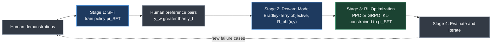

# Chapter 4. RL Foundations for Language Models

> *"By generating novel text, receiving reward feedback, and updating toward higher-reward behaviours, an RL-trained model can discover strategies that no human demonstrator wrote."* — H. Roitman

**Part II — RL Methods for LLMs** · Book pages 139–141 · ~7 min read

[← Chapter 3. Introduction to Reinforcement Learning](03-introduction-to-reinforcement-learning.md) · [Index](../README.md) · [Chapter 5. PPO — Proximal Policy Optimization →](05-ppo-proximal-policy-optimization.md)

---

## What This Chapter Is About

Supervised fine-tuning (SFT) teaches a model to imitate demonstrations, but imitation has a ceiling: the model can never exceed the quality of its training data. Reinforcement learning (RL) breaks that ceiling by letting the model generate novel text, receive reward feedback, and update toward higher-reward behavior — discovering outputs no human demonstrator ever wrote. GPT-4, Claude, Llama-3, and DeepSeek-R1 all share this mechanism: RL applied after SFT turns a capable but unsteered model into an aligned, or more capable, assistant.

This short chapter bridges Chapter 3's classical RL machinery and Part II's LLM-specific algorithms (Chapters 5–11). It names the two paradigms under which RL gets applied to language models — Reinforcement Learning from Human Feedback (RLHF)/DPO and RL from Verifiable Rewards (RLVR) — recasts autoregressive text generation as a Markov Decision Process (MDP), and walks through the four-stage RLHF pipeline the rest of Part II elaborates on.

## Table of Contents

- [The Mental Model](#the-mental-model)
- [Two Paradigms for RL in LLMs](#two-paradigms-for-rl-in-llms)
- [Classical RL vs. LLM RL: The Mapping](#classical-rl-vs-llm-rl-the-mapping)
- [The RLHF Pipeline](#the-rlhf-pipeline)
- [How LLM RL Differs from Classical RL](#how-llm-rl-differs-from-classical-rl)
- [Roadmap of This Part](#roadmap-of-this-part)
- [Common Pitfalls](#common-pitfalls)
- [Summary](#summary)
- [Practitioner Checklist](#practitioner-checklist)
- [Going Deeper](#going-deeper)

---

## The Mental Model

```mermaid
flowchart LR
    Prompt["Prompt x"] --> State["State s_t\nx + y_1..y_t-1"]
    State --> Policy["Policy pi_theta(a_t | s_t)\n= LLM softmax output"]
    Policy --> Action["Action a_t\nnext token, chosen from |V|"]
    Action --> Trans["Transition\nappend token, deterministic"]
    Trans -->|response continues| State
    Trans -->|response complete| Terminal["Terminal state"]
    Terminal --> Reward["Reward r\nRLHF: reward-model score\nRLVR: verified correctness"]

    classDef core fill:#1e3a5f,stroke:#4a90d9,stroke-width:2px,color:#ffffff
    classDef neutral fill:#333a45,stroke:#8892a0,stroke-width:2px,color:#ffffff
    class State,Policy,Action core
    class Prompt,Trans,Terminal,Reward neutral
```

*The LLM writes one token at a time: it reads everything written so far (state), picks the next token (action), the sequence grows by one token (transition), and — once the response is finished — a judge scores it (reward). The policy isn't a separate network; it's the model's own softmax output.*

The goal is to learn a writing strategy — a policy — that consistently earns high scores. RL training only has to adjust the weights θ so token sequences earning higher reward become more probable; no separate policy network is needed.

## Two Paradigms for RL in LLMs

RL methods for language models fall into two broad paradigms.

**Paradigm 1 — Alignment via Human Preferences (RLHF/DPO).** The original motivation for applying RL to LLMs was alignment: making models helpful, harmless, and honest. RLHF trains a reward model from pairwise human judgments ("which response is better?") and optimizes the policy to maximize that learned reward. Direct Preference Optimization (DPO) eliminates the reward model entirely, converting preferences directly into a supervised loss. Both produce aligned assistants that follow instructions and respect safety constraints.

**Paradigm 2 — Capability Enhancement via Verifiable Rewards (RLVR).** More recently, RL has been used to teach new capabilities — reasoning, mathematics, code generation — where reward comes not from human preferences but from verifiable outcomes: did the model get the answer right, did the code pass its tests? DeepSeek-R1 demonstrated that Group Relative Policy Optimization (GRPO) with rule-based rewards (format correctness plus answer accuracy) trains sophisticated chain-of-thought reasoning without any human preference data. RLVR is now dominant for building reasoning models and agentic systems.

Both paradigms share the same core machinery: a policy π_θ (the LLM) generating text autoregressively; a reward signal r(x, y); a Kullback-Leibler (KL) constraint against a reference policy to prevent degenerate solutions; and policy-gradient optimization (PPO or GRPO) pushing the model toward higher reward.

## Classical RL vs. LLM RL: The Mapping

The insight that makes RL applicable to language models at all is recasting autoregressive generation as an MDP, term for term against Chapter 3's classical formulation:

| Classical RL | LLM equivalent | Notes |
|---|---|---|
| State | s_t = (x, y_1, …, y_t−1) | Prompt plus tokens so far; grows by one token per step |
| Action | a_t — the next token | Chosen from the vocabulary |
| Action space size | 32K–128K discrete tokens | Exploration is implicit, via temperature sampling |
| Transition | Deterministic append | No environment stochasticity, unlike a game engine |
| Episode | One full response | Ends when generation completes |
| Trajectory | Full generated sequence (prompt + response) | Same concept as classical RL |
| Reward | r(x, y), usually once at the end | Sparse; RLHF = reward-model score, RLVR = verified correctness |
| Discount factor | γ = 1.0 | Finite episodes — no discounting needed |
| Policy | π_θ(a_t \| s_t) = LLM softmax output | No separate policy network required |

## The RLHF Pipeline

*SFT produces an instruction-following starting policy, a reward model learns to score outputs from human pairwise comparisons, and RL optimization pushes the policy toward higher reward under a KL leash. Evaluation feeds new failure cases back into the demonstration pool.*

**(1) SFT:** train a base model on demonstrations to produce π_SFT, a policy that follows instructions. **(2) Reward Model:** collect human preference comparisons (y_w ≻ y_l) and train R_φ(x, y) via the Bradley-Terry objective. **(3) RL Optimization:** optimize the policy against the reward model via PPO or GRPO, subject to a KL constraint against π_SFT. **(4) Evaluation and Iteration:** evaluate, collect new failure cases, iterate.

For RLVR, stages 1–2 are replaced: SFT trains on reasoning traces instead of instruction demonstrations, and a verifier (e.g., checking math correctness) replaces the reward model. Stage 3 is unchanged.

## How LLM RL Differs from Classical RL

These differences are why PPO and GRPO dominate over DQN-style approaches for LLMs:

- **Deterministic transitions.** The next state is just the concatenation of previous tokens — no stochastic environment.
- **Sparse reward.** Feedback usually arrives once at the end (outcome reward) or at key steps (process reward).
- **Massive action space.** 32K–128K tokens per step; exploration is implicit, via temperature sampling.
- **KL anchor.** Training stays close to the SFT policy, preventing reward hacking at the cost of reduced exploration.
- **No value function needed.** GRPO eliminates the critic network, using group-relative reward normalization instead.

## Roadmap of This Part

*Part II builds the RL-for-LLMs toolkit chapter by chapter, in the order the book presents it.*

- **PPO** (Ch. 5) — clipped surrogate objective, Generalized Advantage Estimation (GAE), critic network, full RLHF loop; the workhorse behind GPT-4 and Claude.
- **DPO** (Ch. 6) — bypasses RL via a contrastive supervised loss.
- **GRPO** (Ch. 7) — DeepSeek's critic-free, group-normalized algorithm behind DeepSeek-R1.
- **Preference variants** (Ch. 8) — Online DPO, Kahneman-Tversky Optimization (KTO), Best-of-N, method selection.
- **Reward modeling** (Ch. 9) — Bradley-Terry models, process vs. outcome rewards, rule-based RLVR rewards.
- **SFT best practices** (Ch. 10) — sequence packing, chat templates, data mixing, SFT's effect on the RL ceiling.
- **Systems engineering** (Ch. 11) — parallelism, generation–training decoupling, GPU-scale infrastructure.

## Common Pitfalls

> [!WARNING]
> Optimizing against the reward model without a KL constraint against π_SFT invites reward hacking — the policy exploits the reward model's blind spots instead of genuinely improving.

> [!WARNING]
> Treating text generation as having stochastic transitions is a category error. The transition is deterministic token concatenation; the only randomness comes from sampling temperature, not an external environment.

## Summary

- Imitation (SFT) has a hard ceiling — the model can never exceed its demonstration data's quality — and RL breaks that ceiling by rewarding novel, higher-quality generations directly.
- Two paradigms dominate: RLHF/DPO for alignment via human preferences, and RLVR for capability enhancement via verifiable rewards.
- DeepSeek-R1 showed GRPO with rule-based rewards (format correctness + answer accuracy) trains chain-of-thought reasoning with zero human preference data.
- Text generation maps onto an MDP: state is the prompt plus tokens so far, action is the next token from a 32K–128K vocabulary, transitions are deterministic appends, and γ = 1.0 since episodes are finite.
- The LLM's softmax output already is the policy π_θ(a_t | s_t) — RL training needs no separate policy network, only weight updates raising the probability of higher-reward sequences.
- The RLHF pipeline runs four stages — SFT, reward-model training via Bradley-Terry, RL optimization under a KL constraint, and evaluation/iteration — and RLVR swaps stages 1–2 for reasoning-trace SFT and a verifier.
- LLM RL's deterministic transitions, sparse reward, massive action space, KL anchor, and (for GRPO) missing value function are why PPO and GRPO dominate over DQN-style methods here.

## Practitioner Checklist

- [ ] Decide upfront whether the goal is alignment (RLHF/DPO) or capability enhancement (RLVR) — the reward source differs.
- [ ] Confirm SFT already produces a reasonably instruction-following policy before layering RL on top; RL refines, it doesn't fix a broken SFT stage.
- [ ] If building a reward model, train it on pairwise preferences (y_w ≻ y_l) via Bradley-Terry, not absolute scores.
- [ ] For RLVR, confirm the verifier checks the right thing (correctness, test pass/fail) before trusting its reward.
- [ ] Keep a KL constraint against π_SFT active during RL optimization to guard against reward hacking.
- [ ] Remember the action space is the full vocabulary (32K–128K tokens) — sampling temperature, not an exploration bonus, drives exploration.
- [ ] Treat reward as sparse by default (end-of-sequence only) unless you deliberately engineer process-level rewards.
- [ ] Set γ = 1.0 for single-response episodes — there is no principled reason to discount within one finite generation.

## Going Deeper

> [!NOTE]
> This chapter's pages carry only bracketed citation numbers ([280], [302], [72], …) with no author/title text, so full bibliographic entries aren't reproduced here — consult the book's own reference list.

- **RLHF** — trains a reward model from pairwise human comparisons, then optimizes the policy against it.
- **DPO** — converts preference data into a supervised contrastive loss, eliminating the reward model.
- **GRPO** — DeepSeek's critic-free, group-normalized policy-gradient method behind the DeepSeek-R1 reasoning results.

---

[← Chapter 3. Introduction to Reinforcement Learning](03-introduction-to-reinforcement-learning.md) · [Index](../README.md) · [Chapter 5. PPO — Proximal Policy Optimization →](05-ppo-proximal-policy-optimization.md)

*Summary of Chapter 4 of [The Hitchhiker's Guide to Agentic AI](https://arxiv.org/abs/2606.24937)
by Haggai Roitman. Licensed CC BY-SA 4.0. Independent study notes — not affiliated with or
endorsed by the author.*
