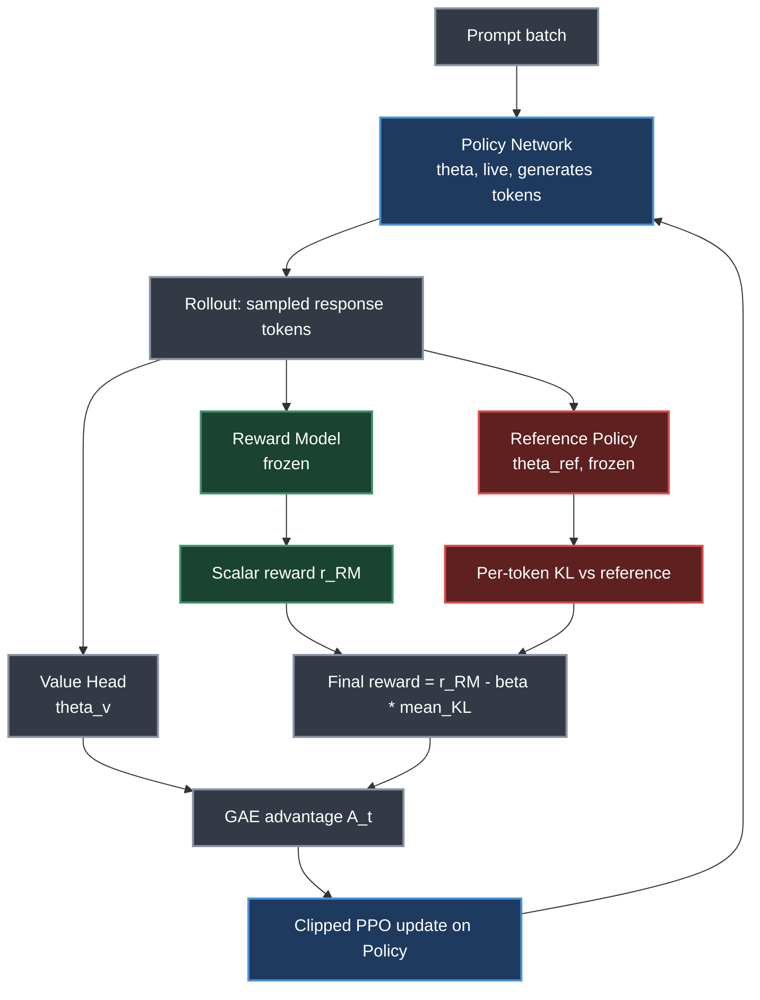
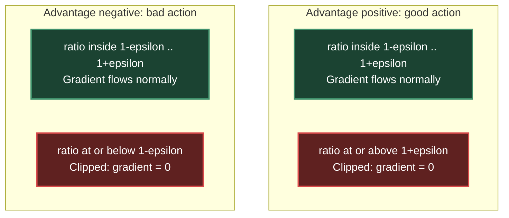
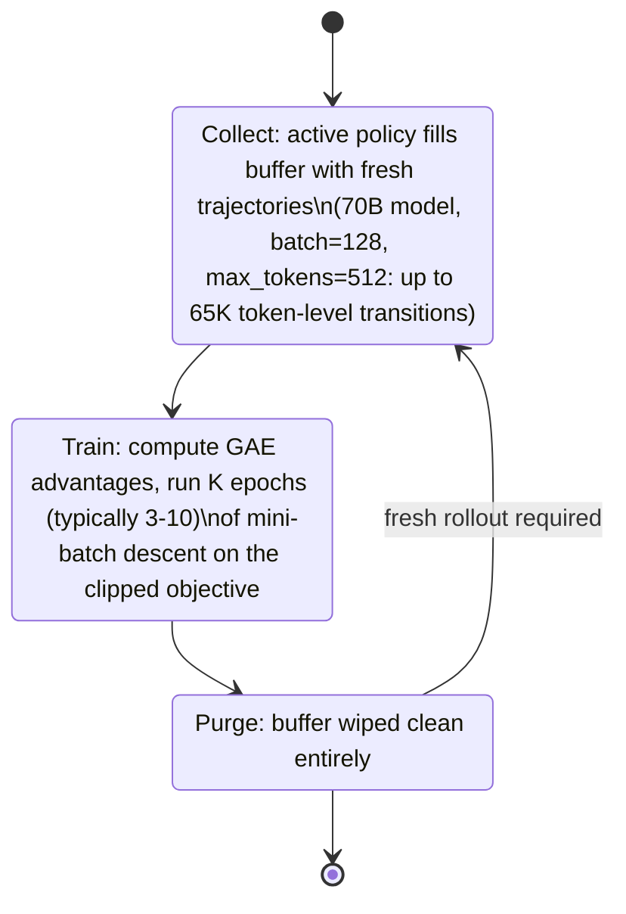
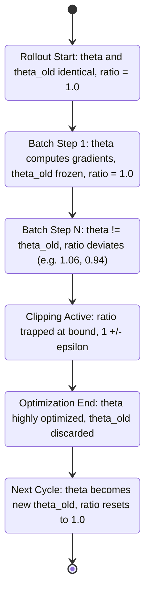

# Chapter 5. PPO — Proximal Policy Optimization

> *"Don't get greedy on one good example. Don't forget too aggressively based on one bad example."*
> — Roitman, on the intuition behind PPO's clipped objective

**Part II — RL Methods for LLMs** · Book pages 142–150 · ~16 min read

[← Chapter 4. RL Foundations for Language Models](04-rl-foundations-for-language-models.md) · [Index](../README.md) · [Chapter 6. DPO — Direct Preference Optimization →](06-dpo-direct-preference-optimization.md)

---

## What This Chapter Is About

Proximal Policy Optimization (PPO) is the algorithm that made Reinforcement Learning from Human Feedback (RLHF) practical at Large Language Model (LLM) scale. Before PPO, keeping a policy gradient update from wrecking the policy meant Trust Region Policy Optimization (TRPO)'s hard Kullback-Leibler (KL) divergence constraint, enforced with second-order optimization — Fisher information matrices, conjugate gradients — that does not scale to distributed training of billion-parameter models. PPO replaces that machinery with a clipped surrogate objective a first-order optimizer like Adam can handle directly, at a fraction of the implementation cost and with distributed training that works almost trivially.

This chapter builds PPO from the ground up: why vanilla policy gradients are dangerous, what the clipped objective does in each regime a probability ratio can fall into, and a six-step derivation connecting the RL objective to the final update rule. It then moves into engineering — the rollout buffer's lifecycle, the two-network bookkeeping that makes the ratio computable, and how it wires into an RLHF loop for a 70B-parameter chat model — before closing with a working Hugging Face Transformer Reinforcement Learning (TRL) configuration and the hyperparameters that most often break a run.

If you remember one thing: PPO's clipping does not bound the policy update size directly — it bounds the *incentive* the objective gives the optimizer to push further, once the ratio has moved past 1±ε. That is why the algorithm is stable without ever computing a Hessian.

## Table of Contents

- [The Mental Model](#the-mental-model)
- [Motivation and History](#motivation-and-history)
- [The Clipped Objective](#the-clipped-objective)
- [Full PPO Loss](#full-ppo-loss)
- [Deriving the PPO Gradient and Update Rule](#deriving-the-ppo-gradient-and-update-rule)
- [Rollout Buffer and Rollouts](#rollout-buffer-and-rollouts)
- [PPO for RLHF: The Full Loop](#ppo-for-rlhf-the-full-loop)
- [Detailed Mechanics: Logits and Policy Updates](#detailed-mechanics-logits-and-policy-updates)
- [TRL Implementation](#trl-implementation)
- [Critical Hyperparameters](#critical-hyperparameters)
- [Key Formulas](#key-formulas)
- [Decision Guide](#decision-guide)
- [Common Pitfalls](#common-pitfalls)
- [Summary](#summary)
- [Practitioner Checklist](#practitioner-checklist)
- [Going Deeper](#going-deeper)

---

## The Mental Model



*Four models cooperate on every PPO step: the live policy generates, the reward model scores, the frozen reference bounds how far the policy is allowed to drift, and the value head supplies the baseline that Generalized Advantage Estimation (GAE) turns into an advantage. Only the policy (and its value head) actually get gradient updates.*

PPO for RLHF is not one network training against a loss — it is four models with four different roles, three of which never receive a gradient. The policy network is the only one being optimized; the reward model is frozen and scores completed responses; the reference policy is frozen and keeps the live policy from drifting into incoherent territory (measured via per-token KL divergence); the value head shares the policy's trunk but predicts expected return, giving GAE a baseline. Every downstream quantity — the KL penalty, the advantage, the clipped loss — compares the live policy against one of these frozen anchors.

## Motivation and History

Vanilla policy gradient updates carry no constraint on step size. A single unlucky batch can push the policy into a region where it generates incoherent output; that output collects low reward; the next gradient, computed from that bad region, makes the policy worse still — a positive feedback loop toward unrecoverable collapse.

Two solutions define the timeline:

| Method | Year | Mechanism | Cost |
|---|---|---|---|
| TRPO | 2015 | Hard constraint on KL divergence between old and new policy | Second-order optimization: Fisher information matrix, conjugate gradients |
| PPO | 2017 | First-order clipped surrogate objective approximating the same stability | ~10× simpler to implement |

TRPO works, but its second-order machinery is expensive and awkward to scale. PPO showed that a much simpler first-order clipped objective achieves nearly the same stability, works almost as well empirically, and scales to distributed training with far less engineering effort — why it, not TRPO, became the RLHF workhorse.

## The Clipped Objective

PPO's core innovation is a clipped surrogate objective that prevents destructively large policy updates while staying implementable with ordinary backpropagation:

$$L^{CLIP}(\theta) = \mathbb{E}_t\Big[\min\big(r_t(\theta)\hat{A}_t,\ \text{clip}(r_t(\theta), 1-\epsilon, 1+\epsilon)\hat{A}_t\big)\Big]$$

where $r_t(\theta) = \dfrac{\pi_\theta(a_t \mid s_t)}{\pi_{\theta_{old}}(a_t \mid s_t)}$ is the probability ratio between the current and old policy for the action actually taken.

The `min` operator creates a pessimistic bound, and its behavior splits cleanly by the sign of the advantage $\hat{A}_t$:

- **Good action ($\hat{A} > 0$):** you want to increase its probability. The surrogate $r\hat{A}$ grows as $r$ increases, but the clip caps the benefit at $r = 1+\epsilon$ — don't get greedy on one good example.
- **Bad action ($\hat{A} < 0$):** you want to decrease its probability. $r\hat{A}$ improves as $r$ decreases, but the clip caps the benefit at $r = 1-\epsilon$ — don't forget too aggressively based on one bad example.

Net effect: the objective's incentive to keep pushing the policy vanishes once the ratio moves past $1\pm\epsilon$ in the favorable direction, capping policy change at roughly ±20% per update step for the default $\epsilon = 0.2$. This prevents both catastrophic collapse and overconfident specialization on a handful of examples.



*The three effective regimes of the clipped objective: inside the clip band the gradient behaves like the unconstrained surrogate; past either edge, in the direction that would keep helping the surrogate, the gradient is exactly zero.*

## Full PPO Loss

The clipped policy loss is only one term of the total loss the optimizer actually minimizes:

$$L = L^{CLIP} - c_1\big(V_\theta(s_t) - V_t^{target}\big)^2 + c_2 H[\pi_\theta(\cdot \mid s_t)]$$

- **Value loss ($c_1 = 0.1$):** trains the critic (value head) to predict returns; also clipped for stability.
- **Entropy bonus ($c_2 = 0.01$):** prevents premature convergence to a deterministic policy — critical for exploration.

## Deriving the PPO Gradient and Update Rule

This derivation traces the mathematical path from the general RL objective to the concrete PPO update rule, in six steps.

### Step 1 — The RL Objective

The goal is to maximize expected cumulative reward under the policy:

$$J(\theta) = \mathbb{E}_{\tau \sim \pi_\theta}\left[\sum_{t=0}^{T} r_t\right]$$

### Step 2 — Policy Gradient Theorem

The gradient of $J(\theta)$ with respect to the policy parameters:

$$\nabla_\theta J(\theta) = \mathbb{E}_{\pi_\theta}\left[\sum_{t=0}^{T} \nabla_\theta \log \pi_\theta(a_t \mid s_t) \cdot \hat{A}_t\right]$$

$\hat{A}_t$ is the advantage function — how much better action $a_t$ was than average in state $s_t$. Substituting the advantage for the full return reduces variance in this estimator.

### Step 3 — Importance Sampling for Off-Policy Data

PPO collects data using $\pi_{\theta_{old}}$ but updates $\pi_\theta$. Correcting that distribution mismatch requires importance sampling:

$$\nabla_\theta J(\theta) = \mathbb{E}_{\pi_{\theta_{old}}}\left[\frac{\pi_\theta(a_t \mid s_t)}{\pi_{\theta_{old}}(a_t \mid s_t)} \nabla_\theta \log \pi_\theta(a_t \mid s_t) \cdot \hat{A}_t\right]$$

Defining the probability ratio $r_t(\theta) = \dfrac{\pi_\theta(a_t \mid s_t)}{\pi_{\theta_{old}}(a_t \mid s_t)}$ and using the identity $\nabla_\theta \log f = \dfrac{\nabla_\theta f}{f}$ collapses this to:

$$\nabla_\theta J(\theta) = \mathbb{E}_{\pi_{\theta_{old}}}\big[\nabla_\theta r_t(\theta) \cdot \hat{A}_t\big]$$

which means maximizing the surrogate objective $L^{CPI}(\theta) = \mathbb{E}_t\big[r_t(\theta) \cdot \hat{A}_t\big]$ — the conservative policy iteration (CPI) surrogate. This ratio trick is also what lets PPO reuse one batch of rollouts across multiple gradient epochs instead of collecting fresh data for every step.

### Step 4 — The Problem with Unconstrained Surrogates

$L^{CPI}$ is valid, but unconstrained, a single gradient step can push $r_t(\theta)$ far from 1.0: importance weights become extreme (high variance), the policy enters untested regions where the reward model's scores are unreliable, and collapse follows from which the policy cannot recover. TRPO's answer is to constrain $D_{KL}(\pi_{\theta_{old}} \| \pi_\theta) \le \delta$ directly — which works, but needs the expensive second-order methods described above.

### Step 5 — PPO's Clipped Surrogate as a First-Order Approximation

PPO replaces the hard KL constraint with the clipped objective from earlier, achieving similar behavior with only first-order gradients. Let $L_t = \min(r_t\hat{A}_t, \bar{r}_t\hat{A}_t)$ where $\bar{r}_t = \text{clip}(r_t, 1-\epsilon, 1+\epsilon)$. Its gradient is piecewise:

$$\nabla_\theta L_t = \begin{cases} \nabla_\theta r_t(\theta) \cdot \hat{A}_t & \text{if } r_t\hat{A}_t < \bar{r}_t\hat{A}_t \text{ (unclipped term smaller)} \\ 0 & \text{if } r_t\hat{A}_t \ge \bar{r}_t\hat{A}_t \text{ (clipped term smaller, gradient = 0)} \end{cases}$$

Expanded into the four cases the condition can produce:

| Condition | Gradient behavior |
|---|---|
| $\hat{A}_t > 0$ and $r_t < 1+\epsilon$ | Flows normally — policy is encouraged to increase $\pi_\theta(a_t\mid s_t)$ |
| $\hat{A}_t > 0$ and $r_t \ge 1+\epsilon$ | Zero — already increased enough, stop pushing |
| $\hat{A}_t < 0$ and $r_t > 1-\epsilon$ | Flows normally — policy is encouraged to decrease $\pi_\theta(a_t\mid s_t)$ |
| $\hat{A}_t < 0$ and $r_t \le 1-\epsilon$ | Zero — already decreased enough, stop pushing |

### Step 6 — The Complete PPO Update Rule

Combining the clipped policy loss, value loss, and entropy bonus into one gradient ascent step:

$$\theta_{k+1} = \theta_k + \alpha \cdot \nabla_\theta\big[L^{CLIP}(\theta) - c_1 L^{VF}(\theta) + c_2 H[\pi_\theta]\big]$$

where $L^{VF}(\theta) = \big(V_\theta(s_t) - V_t^{target}\big)^2$ is the value function regression loss and $H[\pi_\theta] = -\sum_a \pi_\theta(a\mid s_t)\log\pi_\theta(a\mid s_t)$ is the policy's entropy.

> [!TIP]
> Why this works, in five links: (1) the policy gradient theorem gives the improvement direction; (2) importance sampling lets you reuse $\pi_{\theta_{old}}$'s data across epochs; (3) clipping keeps importance weights from going extreme; (4) `min` always takes the more conservative of clipped/unclipped, a pessimistic lower bound; (5) the result is monotonic improvement using only first-order gradients — no Hessians, no conjugate gradients, no line searches.

## Rollout Buffer and Rollouts

PPO's data management relies on a short-term storage system called a rollout buffer. Unlike off-policy algorithms such as Deep Q-Network (DQN), which store experiences indefinitely in a replay buffer, PPO needs an ephemeral structure to satisfy its on-policy constraints.

### What Is a Rollout?

A rollout (trajectory) is a sequence of interactions generated by the agent running its current policy: observe a state, select an action, receive a reward, move to the next state, repeat until the episode ends. In LLMs and RLHF, a rollout is a prompt taken from a dataset, with the model generating tokens one at a time until an end-of-text marker is hit — each token is one "step."

### The Rollout Buffer

For every generated token/step, the buffer records:

$$B = \{(s_t, a_t, \log\pi_{\theta_{old}}(a_t\mid s_t), r_t, V(s_t))\}_{t=1}^{T}$$

- $s_t, a_t, r_t$: state, action taken, and reward at step $t$.
- $\log\pi_{\theta_{old}}(a_t\mid s_t)$: log-probability of the action under the exact policy that generated it, needed for the ratio computation.
- $V(s_t)$: the value function's baseline prediction, needed for GAE.

### The Rollout Buffer Lifecycle

The buffer runs a strict three-phase cycle:



*The rollout buffer's clockwork cycle. Because PPO is on-policy, data generated under the old policy cannot be reused after training — the ratio $r_t(\theta)$ would go stale and the clipping guarantee would break — so the buffer is emptied every cycle and fresh generation is mandatory.*

> [!NOTE]
> Replay buffer (DQN, Soft Actor-Critic) is off-policy: millions of transitions stored indefinitely, sampled randomly, reused across many updates. Rollout buffer (PPO, Group Relative Policy Optimization) is on-policy: one batch of trajectories, used for a few epochs, then discarded — why the 60–70% generation bottleneck is particularly painful for PPO.

vLLM is the generation workhorse: batched generation of 256+ responses in parallel, memory efficiency that raises GPU utilization, and key-value (KV) cache sharing across all $N=8$ responses per prompt (as in GRPO) instead of redundant prefill. OpenRLHF and TRL use vLLM as the generation backend, separate from training workers (DeepSpeed/Fully Sharded Data Parallel).

## PPO for RLHF: The Full Loop

```mermaid
flowchart LR
    Prompts["128 prompts"] --> Gen["Generate responses\ntemperature 0.7, top-p 0.9"]
    Gen --> Score["Reward model scores\neach prompt-response pair"]
    Score --> KLc["Compute per-token KL\nvs reference policy"]
    KLc --> FinalReward["Final reward\nr_RM - 0.05 * mean_KL"]
    FinalReward --> GAEc["GAE advantage\nwhitened"]
    GAEc --> Upd["Clipped PPO update\n4 epochs, mini-batch 16"]
    Upd -->|updated policy weights| Gen

    classDef core fill:#1e3a5f,stroke:#4a90d9,stroke-width:2px,color:#ffffff
    classDef good fill:#1b4332,stroke:#40916c,stroke-width:2px,color:#ffffff
    classDef neutral fill:#333a45,stroke:#8892a0,stroke-width:2px,color:#ffffff

    class Gen,Upd core
    class Score,FinalReward good
    class Prompts,KLc,GAEc neutral
```



*One full PPO cycle for a 70B chat model: generation dominates wall-clock time, scoring and KL are cheap by comparison, and the loop feeds the just-updated policy back into the next generation step.*

A concrete pass for a 70B chat model (Llama-3-70B policy, batch of 128 prompts, 512 max tokens):

| Step | What happens |
|---|---|
| 1. Generate | Sample 128 responses at temperature 0.7, top-p 0.9 — 60% of wall-clock time |
| 2. Score | Reward model scores each (prompt, response) pair; observed range 0.2–0.95 |
| 3. KL | Per-token $\text{KL}_t = \log\pi_\theta(y_t\mid y_{<t}) - \log\pi_{ref}(y_t\mid y_{<t})$; mean typically 3–8 |
| 4. Final reward | $R = r_{RM} - 0.05 \times \text{mean\_KL}$, applied only at the last token |
| 5. GAE | Compute $\hat{A}_t$ per token from value-head predictions, then whiten (zero mean, unit variance) |
| 6. Update | 4 epochs of stochastic gradient descent (SGD), mini-batches of 16, clip $\epsilon = 0.2$, gradient norm clipped at 1.0 |

Result: win-rate improves roughly 0.005 per step; after 10K steps, a 5–10% absolute improvement over the Supervised Fine-Tuning (SFT) baseline.

> [!WARNING]
> **Tokenization determines what a "step" is.** A conceptual action — outputting "2024," say — can span 1–4 tokens, which skews things: per-token KL totals differ for identical meaning depending on how it's tokenized (rare words split into more subwords accrue higher total penalty); GAE assigns advantage per token even though the model mostly "decides" only at a word's first token; and reward placed only at the final token forces GAE to propagate credit backward, diluting signal for longer responses. Mitigations include normalizing KL by length, word-level reward shaping, or rewarding at semantic boundaries.

## Detailed Mechanics: Logits and Policy Updates

PPO manages two parameter states sharing one network topology but holding different weights: the **policy network** $\pi_\theta$ — live, continuously updated via backpropagation — and the **old policy network** $\pi_{\theta_{old}}$ — a frozen snapshot anchoring one optimization cycle so the policy cannot shift too drastically.

### Phase 1: Rollout (Data Collection)

At each time-step $t$: the environment yields state $s_t$ (prompt plus tokens generated so far); $s_t$ passes through the frozen snapshot $\theta_{old}$; the network outputs raw logits $z_{old}$, sized to the vocabulary (32K–128K); probabilities come from softmax:

$$P(a \mid s_t) = \text{Softmax}(z_{old}) = \frac{\exp(z_{old,a})}{\sum_{j=1}^{|V|}\exp(z_{old,j})}$$

Action $a_t$ is sampled from $P(a\mid s_t)$, and the transition $\langle s_t, a_t, r_t, s_{t+1}\rangle$ plus $\log\pi_{\theta_{old}}(a_t\mid s_t)$ is stored in the rollout buffer.

> [!TIP]
> Storing $\log\pi_{\theta_{old}}(a_t\mid s_t)$ as a scalar during rollout avoids re-running the frozen network during optimization — one saved forward pass per mini-batch, which matters at 70B scale.

### Phase 2: Optimization Loop (Mini-Batch Updates)

Once the buffer is full, PPO runs $K$ epochs (typically 3–10) over mini-batches, producing logits for both policies from the same stored $s_t$: the old policy's $z_{old} = f(s_t;\theta_{old})$ is just the stored rollout scalar, never recomputed; the live policy's $z_{new} = f(s_t;\theta)$ changes continuously as $\theta$ updates each step, while $z_{old}$ stays static.

### From Logits to Probability Ratio

The ratio $r_t(\theta)$ is computed in log-space to avoid numerical underflow/overflow from dividing raw probabilities:

$$r_t(\theta) = \exp\big(\text{LogSoftmax}(z_{new})[a_t] - \text{LogSoftmax}(z_{old})[a_t]\big)$$

That ratio feeds directly into the clipping objective above, never touching a raw probability.

### The PPO Weight Lifecycle



*How $\theta$ and $\theta_{old}$ evolve across one PPO cycle. The ratio starts pinned at 1.0 by identity, drifts as mini-batch updates accumulate, traps at the clip bound for outlying tokens, and resets to 1.0 once $\theta$ is copied into $\theta_{old}$ for the next rollout.*

### Continuous Action Spaces Extension

For continuous action spaces — not typical for LLMs, but important for robotics RL — the network outputs a predicted mean $\mu$ and standard deviation $\sigma$ instead of discrete logits. Log-probabilities come from the Gaussian log-PDF:

$$\log\pi(a_t\mid s_t) = -\frac{1}{2}\left(\frac{a_t-\mu}{\sigma}\right)^2 - \log(\sigma) - \frac{1}{2}\log(2\pi)$$

The ratio $r_t(\theta) = \exp(\log\pi_\theta - \log\pi_{\theta_{old}})$ is then identical, fed into the same clipping objective — only the log-probability computation changes.

## TRL Implementation

The Hugging Face TRL library provides production-ready implementations of all major RL methods for LLMs. A representative PPO setup for Llama-3.1-8B-Instruct with a Low-Rank Adaptation (LoRA) adapter:

```python
from trl import PPOConfig, PPOTrainer, AutoModelForCausalLMWithValueHead
from transformers import AutoTokenizer
from peft import LoraConfig

# Model setup
model = AutoModelForCausalLMWithValueHead.from_pretrained(
    "meta-llama/Llama-3.1-8B-Instruct",
    torch_dtype=torch.bfloat16, device_map="auto",
    peft_config=LoraConfig(r=64, lora_alpha=16,
        target_modules=["q_proj", "v_proj", "k_proj", "o_proj"])
)
tokenizer = AutoTokenizer.from_pretrained("meta-llama/Llama-3.1-8B-Instruct")

# PPO config with all critical hyperparameters
ppo_config = PPOConfig(
    learning_rate=1.5e-6,        # Low LR for stability
    batch_size=128,              # Prompts per step
    mini_batch_size=16,          # Gradient accumulation unit
    ppo_epochs=4,                # Epochs per batch (reuse data)
    gamma=1.0,                   # No discounting (single turn)
    lam=0.95,                    # GAE lambda
    cliprange=0.2,               # PPO epsilon
    cliprange_value=0.2,         # Value function clipping
    vf_coef=0.1,                 # Value loss coefficient
    init_kl_coef=0.05,           # Initial KL penalty
    target_kl=6.0,               # Adaptive KL target
    whiten_rewards=True,         # Normalize advantages
    gradient_accumulation_steps=4,
    max_grad_norm=1.0,
)

ppo_trainer = PPOTrainer(config=ppo_config, model=model, tokenizer=tokenizer,
    dataset=prompt_dataset, data_collator=collator)

# Training loop
for batch in ppo_trainer.dataloader:
    # 1. Generate responses
    query_tensors = batch["input_ids"]
    response_tensors = ppo_trainer.generate(
        query_tensors, max_new_tokens=512, temperature=0.7,
        top_p=0.9, do_sample=True
    )
    # 2. Score with reward model
    texts = [tokenizer.decode(r, skip_special_tokens=True) for r in response_tensors]
    rewards = [torch.tensor(reward_model.score(q, r)) for q, r in zip(batch["query"], texts)]
    # 3. PPO update (handles KL, GAE, clipping internally)
    stats = ppo_trainer.step(query_tensors, response_tensors, rewards)
    # Monitor: stats["ppo/mean_scores"], stats["ppo/policy/approx_kl"]
```

## Critical Hyperparameters

| Parameter | Typical | Effect of Getting It Wrong |
|---|---|---|
| `cliprange` | 0.2 | Too low: no learning. Too high: instability. |
| `init_kl_coef` | 0.01–0.1 | Too low: reward hacking. Too high: stuck at SFT. |
| `target_kl` | 4–8 | Adaptive controller target. Lower = more conservative. |
| `ppo_epochs` | 4 | Too many: overfits to batch. Too few: wastes generation compute. |
| `learning_rate` | 1–5 × 10⁻⁶ | Too high: catastrophic forgetting. |
| `batch_size` | 64–256 | Larger = smoother gradients, more generation compute. |
| `temperature` | 0.7–1.0 | Lower: less exploration. Higher: noisier advantages. |

## Key Formulas

**Probability ratio**

$$r_t(\theta) = \frac{\pi_\theta(a_t\mid s_t)}{\pi_{\theta_{old}}(a_t\mid s_t)}$$

| Symbol | Meaning |
|---|---|
| $\pi_\theta$ | Live policy, current weights |
| $\pi_{\theta_{old}}$ | Frozen snapshot that generated the rollout |
| $a_t, s_t$ | Action (token) and state (prompt + prior tokens) at step $t$ |

At $r_t = 1$ the two policies agree exactly — no distribution shift. As epochs accumulate within a cycle, $r_t$ drifts from 1 in either direction; the clipped objective bounds how much that drift can influence the gradient.

**Clipped surrogate objective**

$$L^{CLIP}(\theta) = \mathbb{E}_t\Big[\min\big(r_t(\theta)\hat{A}_t,\ \text{clip}(r_t(\theta), 1-\epsilon, 1+\epsilon)\hat{A}_t\big)\Big]$$

| Symbol | Meaning |
|---|---|
| $\hat{A}_t$ | GAE advantage estimate at step $t$ |
| $\epsilon$ | Clip range, typically 0.2 |
| $\text{clip}(x, lo, hi)$ | $x$ bounded to $[lo, hi]$ |

Limit behavior: as $\epsilon \to 0$, the clip band collapses to $[1,1]$, so almost any ratio movement gets clipped and the gradient vanishes almost immediately — an extremely conservative regime. As $\epsilon \to \infty$, the bound disappears and $L^{CLIP}$ reduces to the unconstrained surrogate $L^{CPI} = \mathbb{E}_t[r_t\hat{A}_t]$, reintroducing the collapse risk clipping was built to prevent.

**Full loss with value and entropy terms**

$$L = L^{CLIP}(\theta) - c_1\big(V_\theta(s_t) - V_t^{target}\big)^2 + c_2 H[\pi_\theta(\cdot\mid s_t)]$$

| Symbol | Meaning | Typical value |
|---|---|---|
| $c_1$ | Value loss coefficient | 0.1 |
| $c_2$ | Entropy bonus coefficient | 0.01 |
| $V_\theta(s_t)$ | Value head's prediction | — |
| $V_t^{target}$ | Bootstrapped return target | — |
| $H[\pi_\theta]$ | Policy entropy at $s_t$ | — |

As $c_2 \to 0$, nothing discourages early collapse to a near-deterministic distribution, starving exploration. As $c_1$ grows large relative to the policy term, value-fitting dominates the gradient and can slow policy improvement.

**KL penalty**

$$\text{KL}_t = \log\pi_\theta(y_t\mid y_{<t}) - \log\pi_{ref}(y_t\mid y_{<t}), \qquad R = r_{RM} - 0.05 \times \text{mean\_KL}$$

| Symbol | Meaning |
|---|---|
| $\pi_{ref}$ | Frozen reference policy (typically the SFT checkpoint) |
| $r_{RM}$ | Reward model's scalar score for the full response |
| mean_KL | Per-token KL averaged across the response, typically 3–8 |

The KL term is a soft penalty, not a hard constraint like TRPO's — as its coefficient (`init_kl_coef`, typically 0.01–0.1) shrinks toward 0, the policy drifts freely from the reference, risking reward hacking; as it grows large, the policy stays pinned close to the reference and barely improves past the SFT baseline.

## Decision Guide

| Question | TRPO | PPO |
|---|---|---|
| Constraint mechanism | Hard KL constraint, $D_{KL} \le \delta$ | Soft, via clipped surrogate |
| Optimization order | Second-order (Fisher information, conjugate gradients) | First-order (ordinary backprop) |
| Implementation complexity | High | ~10× simpler |
| Distributed training | Awkward to scale | Scales trivially |
| Empirical stability | Excellent, by construction | Nearly as good in practice |

Roitman treats this as closed: PPO's first-order approximation gets close enough to TRPO's guarantees that TRPO's added cost is rarely justified at LLM scale.

## Common Pitfalls

> [!WARNING]
> **Unconstrained surrogate gradients cause unrecoverable collapse.** Without clipping, one unlucky batch can push $r_t(\theta)$ far from 1.0: importance weights spike, the policy enters untested regions the reward model scores unreliably, and the collapse compounds — garbage scores low, worsening the next gradient.

> [!WARNING]
> **Reusing rollout-buffer data across cycles breaks PPO's guarantees.** Data generated by the old policy cannot be safely carried into the next update cycle — the ratio $r_t(\theta)$ goes stale and the clipping math no longer holds. Purge and refill every cycle.

> [!WARNING]
> **Tokenization skews KL accounting and credit assignment.** Rare words split into more subwords accrue disproportionately higher total KL penalty, and GAE spreads credit across tokens even though the model effectively "decides" only at a word's first token. See [Critical Hyperparameters](#critical-hyperparameters) for what going wrong on `cliprange` or `init_kl_coef` looks like.

## Summary

- PPO replaces TRPO's expensive second-order, hard-KL-constrained optimization with a first-order clipped surrogate that is roughly 10× simpler to implement and scales to distributed training far more easily.
- The `min` operator creates a pessimistic bound: for good actions ($\hat{A}>0$) benefit caps at ratio $1+\epsilon$, for bad actions ($\hat{A}<0$) penalty caps at ratio $1-\epsilon$, bounding policy change to roughly ±20% per step at the default $\epsilon=0.2$.
- The full loss adds a clipped value loss ($c_1=0.1$) and an entropy bonus ($c_2=0.01$) to the clipped policy objective — entropy is what keeps the policy from collapsing to determinism too early.
- The six-step derivation shows the clipped surrogate is not an ad hoc trick: it is a first-order approximation of TRPO's KL-constrained trust region, reached by combining the policy gradient theorem with importance sampling.
- The rollout buffer is strictly ephemeral — collect, train for K epochs (typically 3–10), then purge completely — because on-policy math breaks the instant stale data re-enters the ratio computation.
- Generation dominates PPO wall-clock time (60–70%), which is why vLLM's batched generation and KV-cache prefix sharing matter as much to throughput as the optimization math.
- A concrete 70B-model PPO step (batch 128, 4 epochs, mini-batch 16, $\epsilon=0.2$) improves win-rate roughly 0.005 per step, reaching 5–10% absolute improvement over SFT after 10K steps.
- Tokenization determines what a PPO "step" actually is, and skews both KL accounting and per-token credit assignment via GAE.

## Practitioner Checklist

- [ ] Confirm the reward model, reference policy, and value head are frozen except where the algorithm explicitly updates them.
- [ ] Set `cliprange` (ε) to 0.2 as a starting point; tune only after confirming the run is otherwise stable.
- [ ] Set `init_kl_coef` in 0.01–0.1 (watch for reward hacking too low, SFT-locked plateaus too high) and `target_kl` in 4–8.
- [ ] Cap `ppo_epochs` around 4 — more overfits the buffer, fewer wastes expensive generation compute.
- [ ] Keep `learning_rate` in 1–5 × 10⁻⁶; higher risks catastrophic forgetting of the SFT policy.
- [ ] Whiten advantages before feeding them into the clipped objective, and clip gradient norm at 1.0.
- [ ] Purge the rollout buffer completely after every training phase — never reuse trajectories across cycles.
- [ ] Store $\log\pi_{\theta_{old}}$ at rollout time instead of recomputing it, and compute the ratio in log-space (`exp(log_new - log_old)`).
- [ ] Route generation through vLLM to keep the 60–70% generation bottleneck as small as possible.
- [ ] Decide how to place the KL/reward signal at the token level (final-token only vs. length-normalized) given tokenizer behavior.
- [ ] Monitor `ppo/mean_scores` and `ppo/policy/approx_kl` during training to catch instability early.

## Going Deeper

- Schulman et al., *Trust Region Policy Optimization* — the hard-KL-constrained predecessor PPO approximates.
- Schulman et al., *Proximal Policy Optimization Algorithms* — the original clipped-surrogate paper.
- Hugging Face TRL (Transformer Reinforcement Learning) library — production implementation behind `PPOConfig`/`PPOTrainer`.
- OpenRLHF — alternative RLHF framework, separating vLLM generation workers from DeepSpeed/FSDP training workers.

---

[← Chapter 4. RL Foundations for Language Models](04-rl-foundations-for-language-models.md) · [Index](../README.md) · [Chapter 6. DPO — Direct Preference Optimization →](06-dpo-direct-preference-optimization.md)

*Summary of Chapter 5 of [The Hitchhiker's Guide to Agentic AI](https://arxiv.org/abs/2606.24937)
by Haggai Roitman. Licensed CC BY-SA 4.0. Independent study notes — not affiliated with or
endorsed by the author.*
