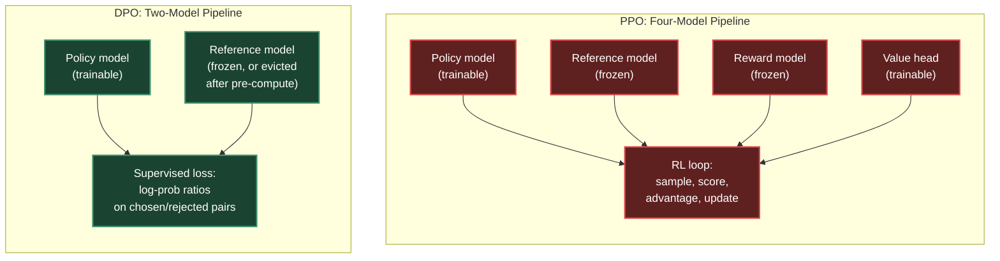
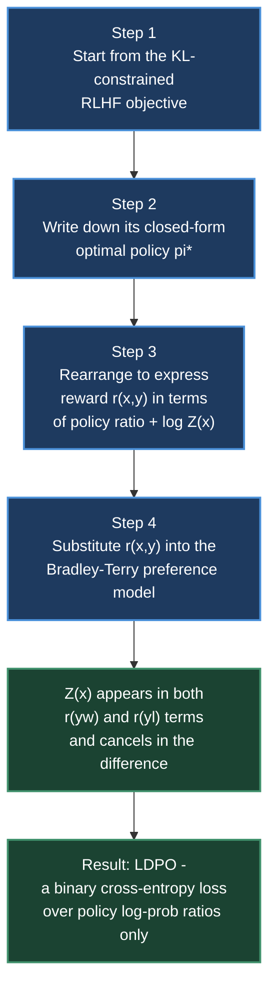
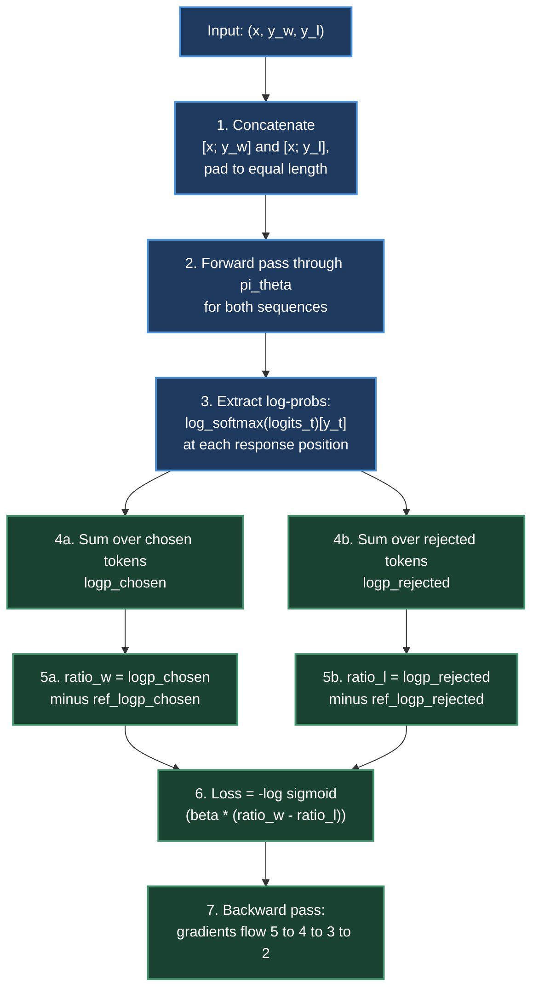
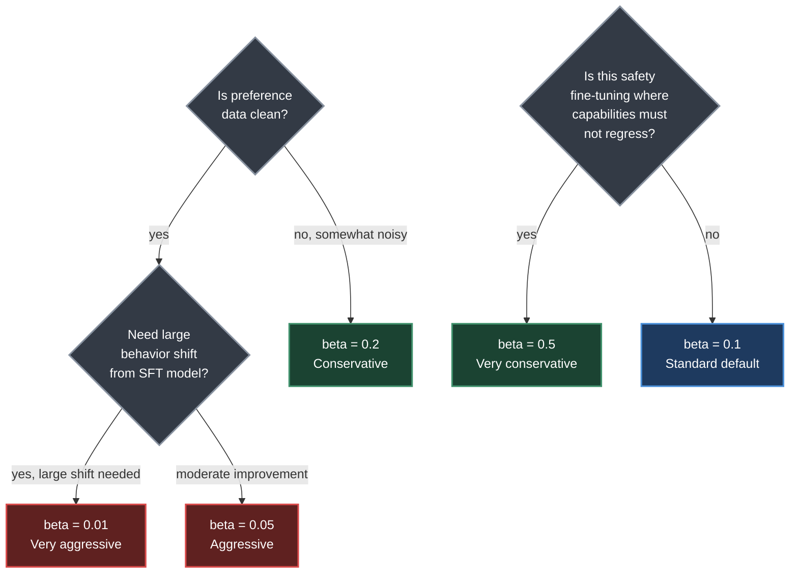
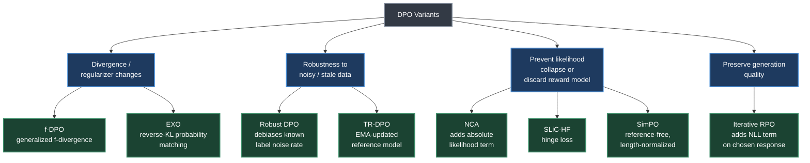

# Chapter 6. DPO — Direct Preference Optimization

> *"Can we skip the RL and learn directly from preferences?"*

**Part II — RL Methods for LLMs** · Book pages 151–163 · ~18 min read

[← Chapter 5. PPO — Proximal Policy Optimization](05-ppo-proximal-policy-optimization.md) · [Index](../README.md) · [Chapter 7. GRPO — Group Relative Policy Optimization →](07-grpo-group-relative-policy-optimization.md)

---

## What This Chapter Is About

Proximal Policy Optimization (PPO) aligns a language model by holding four models in memory at once — policy, reference model, reward model, and a value head — and running a full reinforcement learning loop on top of them. That infrastructure is expensive and notoriously unstable. Direct Preference Optimization (DPO) asks a sharper question: if the optimal policy under the standard Reinforcement Learning from Human Feedback (RLHF) objective already has a closed-form solution, can you derive a supervised loss that reaches that same optimum without ever training a reward model or running policy-gradient rollouts?

The answer is yes, and the derivation is the intellectual core of this chapter. Rearranging the closed-form optimal policy to express the reward function in terms of the policy itself, then substituting that expression into the Bradley-Terry preference model, causes an unwieldy normalization constant to cancel out. What remains is a binary cross-entropy loss over pairs of chosen and rejected responses — computable directly from the policy's and reference model's log-probabilities, with no reward model and no on-policy sampling.

This chapter walks through that derivation step by step, then descends into the full mechanics of a DPO training step: how sequence-level log-probabilities are computed, which tokens receive gradient, what a Hugging Face TRL (Transformer Reinforcement Learning) implementation looks like, how to size batches and manage VRAM (Video RAM), and which of DPO's variants (f-DPO, Robust DPO, TR-DPO, EXO, NCA, SLiC-HF, Iterative RPO, SimPO) fixes which failure mode. DPO's appeal is operational as much as mathematical: two models instead of four, a supervised loop instead of an RL loop, and predictable, interpretable gradients.

## Table of Contents

- [The Mental Model](#the-mental-model)
- [Mathematical Derivation](#mathematical-derivation)
  - [Key Formulas](#key-formulas)
- [Gradient Analysis](#gradient-analysis)
- [TRL Implementation](#trl-implementation)
- [How DPO Works: Full Mechanics](#how-dpo-works-full-mechanics)
  - [Sequence-Level Log-Probabilities](#sequence-level-log-probabilities)
  - [The DPO Loss Decomposed](#the-dpo-loss-decomposed)
  - [Forward Pass: Step by Step](#forward-pass-step-by-step)
  - [Token-Level Gradient Analysis](#token-level-gradient-analysis)
  - [Length Normalization](#length-normalization)
  - [Label Masking](#label-masking)
  - [Pseudocode: DPO Training Step](#pseudocode-dpo-training-step)
- [Common Pitfalls](#common-pitfalls)
- [DPO Variants and When Each Fails](#dpo-variants-and-when-each-fails)
- [β Selection Guide](#β-selection-guide)
- [Batch Size Configuration and Scaling](#batch-size-configuration-and-scaling)
- [DPO Extensions and Variants Taxonomy](#dpo-extensions-and-variants-taxonomy)
- [Decision Guide](#decision-guide)
- [Summary](#summary)
- [Practitioner Checklist](#practitioner-checklist)
- [Going Deeper](#going-deeper)

---

## The Mental Model



*PPO carries four models through an RL loop (policy, reference, reward model, value head); DPO collapses the reward model and RL loop into a single supervised loss over two models, and even the reference model can be evicted after its log-probabilities are pre-computed.*

The reduction from four models to two — and from an RL loop to a supervised loss — is possible because DPO does not approximate the RLHF objective. It solves for the exact same optimum analytically, then works backward to a loss function whose gradient descent reaches that optimum directly. Everything else in this chapter follows from that one algebraic move.

## Mathematical Derivation

The chapter presents the derivation in four explicit steps, and the mechanism to hold onto is that the reward function's normalization term is *the same function of the prompt* on both the chosen and rejected sides of a comparison — so when the two log-ratios are subtracted, it disappears.



*The derivation's pivot is Step 5: the partition function Z(x) depends only on the prompt x, so it is identical in the expression for r(yw) and r(yl); subtracting one from the other in the Bradley-Terry model cancels it exactly, leaving a loss with no reward model term at all.*

**Step 1 — Start from the RLHF objective.** The standard RLHF objective maximizes expected reward under the policy while penalizing divergence from a reference policy via a KL term, scaled by a coefficient β:

$$\max_{\pi} \; \mathbb{E}_{x, y \sim \pi}[r(x, y)] - \beta D_{KL}[\pi \| \pi_{ref}]$$

**Step 2 — Write the closed-form optimal solution.** This constrained optimization has a known closed-form solution: the optimal policy re-weights the reference policy by an exponentiated, temperature-scaled reward, normalized by a partition function Z(x):

$$\pi^*(y|x) = \frac{1}{Z(x)} \pi_{ref}(y|x) \exp\left(\frac{r(x,y)}{\beta}\right)$$

**Step 3 — Rearrange to isolate the reward.** Solving this equation for r(x, y) gives the reward as a function of the optimal policy, the reference policy, and the partition function:

$$r(x, y) = \beta \log \frac{\pi^*(y|x)}{\pi_{ref}(y|x)} + \beta \log Z(x)$$

**Step 4 — Substitute into the Bradley-Terry preference model.** The Bradley-Terry model expresses the probability that a chosen response y_w is preferred over a rejected response y_l as a sigmoid of the reward difference: P(y_w ≻ y_l) = σ(r(y_w) − r(y_l)). Substituting the Step 3 expression for both r(y_w) and r(y_l), the β log Z(x) term — identical in both — cancels in the subtraction, since Z(x) depends only on the shared prompt x. What remains is the **DPO loss**:

$$\mathcal{L}_{DPO}(\theta) = -\mathbb{E}_{(x,y_w,y_l)}\left[\log \sigma\left(\beta \log \frac{\pi_\theta(y_w|x)}{\pi_{ref}(y_w|x)} - \beta \log \frac{\pi_\theta(y_l|x)}{\pi_{ref}(y_l|x)}\right)\right]$$

The chapter frames this as DPO's essential move: it defines an **implicit reward** $\hat{r}(x, y) = \beta \log \frac{\pi_\theta(y|x)}{\pi_{ref}(y|x)}$, and minimizes a cross-entropy loss whose "label" is simply that the chosen response's implicit reward should exceed the rejected response's. The reference model functions as a regularizer: the policy is only allowed to deviate from it insofar as doing so improves the preference margin.

### Key Formulas

| Symbol | Meaning |
|---|---|
| $\pi_\theta$ | Trainable policy (the model being fine-tuned) |
| $\pi_{ref}$ | Frozen reference policy (typically the SFT checkpoint) |
| $\pi^*$ | Closed-form optimal policy under the RLHF objective |
| $r(x,y)$ | Reward function over prompt x and response y |
| $Z(x)$ | Partition function normalizing $\pi^*$; depends only on x |
| $\beta$ | KL penalty coefficient; controls how far $\pi_\theta$ may deviate from $\pi_{ref}$ |
| $y_w$ | Chosen (winning) response |
| $y_l$ | Rejected (losing) response |
| $\hat{r}(x,y)$ | Implicit reward: $\beta \log(\pi_\theta(y|x)/\pi_{ref}(y|x))$ |
| $\sigma(\cdot)$ | Sigmoid function |

**What β controls.** β is the single hyperparameter governing the tradeoff between alignment strength and stability:

- **Large β:** a large margin is required to satisfy the loss, so the policy must move aggressively away from the reference — with a risk of catastrophic forgetting of the base model's capabilities.
- **Small β:** a small margin suffices, so the policy stays close to the reference — a conservative update.

The DPO gradient, derived by differentiating the loss with respect to θ, is:

$$\nabla_\theta \mathcal{L} = -\beta \cdot \underbrace{\sigma(-\hat{r}_w + \hat{r}_l)}_{\text{weight: higher when model is wrong}} \cdot \left[\nabla_\theta \log \pi_\theta(y_w|x) - \nabla_\theta \log \pi_\theta(y_l|x)\right]$$

The gradient always pushes the chosen response's log-probability up and the rejected response's down; the coefficient in front is a per-example weight that grows when the model currently ranks the pair incorrectly (chosen scored lower than rejected) and shrinks toward zero once the model already prefers the chosen response by a wide margin. This is what lets DPO concentrate learning on "confusing" pairs rather than pairs it has already solved.

> [!NOTE]
> The chapter's worked example: prompt "Explain quantum entanglement to a 10-year-old," with β = 0.1. Chosen response has log π_θ = −15.3, log π_ref = −16.1 → implicit reward r̂_w = 0.1 × (−15.3 − (−16.1)) = 0.08. Rejected response has log π_θ = −12.8, log π_ref = −12.5 → r̂_l = 0.1 × (−12.8 − (−12.5)) = −0.03. Loss input σ(0.08 − (−0.03)) = σ(0.11) = 0.527, giving loss −log(0.527) = 0.64. The model barely prefers the chosen response, so the gradient pushes hard; training continues until the margin stabilizes around 1/(2β).

## Gradient Analysis

The weighting term σ(−r̂_w + r̂_l) behaves as an adaptive learning rate at the example level: it is largest exactly when the policy currently gets the comparison wrong, and it shrinks automatically as the policy learns to separate chosen from rejected — so DPO does not keep over-optimizing pairs it has already mastered.

## TRL Implementation

The chapter gives a minimal working TRL example fine-tuning Llama-3.1-8B-Instruct with LoRA (Low-Rank Adaptation):

```python
from trl import DPOConfig, DPOTrainer
from transformers import AutoModelForCausalLM, AutoTokenizer
from peft import LoraConfig
from datasets import load_dataset

model = AutoModelForCausalLM.from_pretrained(
    "meta-llama/Llama-3.1-8B-Instruct",
    torch_dtype=torch.bfloat16, attn_implementation="flash_attention_2")
tokenizer = AutoTokenizer.from_pretrained("meta-llama/Llama-3.1-8B-Instruct")

# Dataset format: {"prompt": str, "chosen": str, "rejected": str}
dataset = load_dataset("argilla/ultrafeedback-binarized-preferences")

lora_config = LoraConfig(r=64, lora_alpha=16, lora_dropout=0.05,
    target_modules=["q_proj","k_proj","v_proj","o_proj",
                     "gate_proj","up_proj","down_proj"])

dpo_config = DPOConfig(
    output_dir="./dpo_output",
    beta=0.1,                              # KL regularization strength
    learning_rate=5e-7,                    # Very low LR for stability
    loss_type="sigmoid",                   # Standard DPO loss
    max_length=2048,
    max_prompt_length=1024,
    per_device_train_batch_size=2,
    gradient_accumulation_steps=8,         # Effective batch = 16
    gradient_checkpointing=True,
    bf16=True,
    num_train_epochs=1,                    # DPO overfits fast - 1 epoch!
    warmup_ratio=0.1,
)

trainer = DPOTrainer(
    model=model,
    ref_model=None,   # With LoRA, ref = base model (no copy needed!)
    args=dpo_config,
    train_dataset=dataset["train"],
    eval_dataset=dataset["test"],
    tokenizer=tokenizer,
    peft_config=lora_config,
)
trainer.train()
# Key metrics: train/rewards/chosen, train/rewards/rejected, train/rewards/margins
```

Two details stand out: LoRA training needs no separate reference-model copy, since disabling the adapters recovers the base model as reference; and one epoch is standard practice, since DPO overfits quickly.

## How DPO Works: Full Mechanics

### Sequence-Level Log-Probabilities

The core quantity DPO consumes is the log-probability of an entire response sequence y = (y₁, …, y_T) given the prompt x, computed as the sum of per-token log-probabilities:

$$\log \pi_\theta(y|x) = \sum_{t=1}^{T} \log \pi_\theta(y_t \mid x, y_{<t})$$

Each term is the log-softmax output at position t for the actual token y_t — identical to standard language-modeling cross-entropy, except summed rather than averaged. Critically, the gradient flows through **every** token position in both the chosen and rejected sequences; no intermediate token is masked out of the sum.

### The DPO Loss Decomposed

Restating the loss with an explicit "implicit reward margin" term h_θ:

$$\mathcal{L}_{DPO}(\theta) = -\mathbb{E}_{(x,y_w,y_l)\sim D}\left[\log \sigma(\beta \cdot h_\theta(x, y_w, y_l))\right]$$

where

$$h_\theta(x, y_w, y_l) = \underbrace{\log \frac{\pi_\theta(y_w|x)}{\pi_{ref}(y_w|x)}}_{\text{chosen reward proxy}} - \underbrace{\log \frac{\pi_\theta(y_l|x)}{\pi_{ref}(y_l|x)}}_{\text{rejected reward proxy}}$$

Expanded into token-level terms, h_θ is a difference of two token sums:

$$h_\theta = \sum_{t=1}^{|y_w|}\left[\log \pi_\theta(y_w^t|x,y_w^{<t}) - \log \pi_{ref}(y_w^t|x,y_w^{<t})\right] - \sum_{t=1}^{|y_l|}\left[\log \pi_\theta(y_l^t|x,y_l^{<t}) - \log \pi_{ref}(y_l^t|x,y_l^{<t})\right]$$

### Forward Pass: Step by Step



*The DPO forward pass runs two sequences (chosen and rejected) through the policy, sums token log-probs on each side, subtracts the corresponding reference sums, and combines the two ratios into a single sigmoid loss — the reference log-probs can be pre-computed and cached rather than computed on this pass.*

The seven steps, following the chapter directly:

1. **Concatenate:** form two sequences, [x; y_w] and [x; y_l], padded to equal length within the batch.
2. **Forward pass (policy π_θ):** run both sequences through the model, collecting logits at every response position.
3. **Extract log-probs:** at each response position t, take log softmax(logits_t)[y_t] — the log-probability of the actual token.
4. **Sum over tokens:** logp_chosen = Σ log π_θ(y_w^t | x, y_w^{<t}); logp_rejected = Σ log π_θ(y_l^t | x, y_l^{<t}), summed over response positions only.
5. **Subtract reference** (pre-computed or from a second forward pass): ratio_w = logp_chosen − ref_logp_chosen; ratio_l = logp_rejected − ref_logp_rejected.
6. **Compute loss:** L = −log σ(β · (ratio_w − ratio_l)).
7. **Backward pass:** gradients flow back through steps 5 → 4 → 3 → 2 to update θ.

### Token-Level Gradient Analysis

Every token does receive a gradient. The gradient with respect to the logits at position t in the chosen sequence is:

$$\frac{\partial \mathcal{L}}{\partial \text{logits}_t^{(w)}} = -\underbrace{\sigma(-\beta \cdot h_\theta)}_{\text{scaling factor}} \cdot \beta \cdot \frac{\partial \log \pi_\theta(y_w^t|\cdot)}{\partial \text{logits}_t^{(w)}}$$

The scaling factor σ(−β · h_θ) is shared across every token in both sequences and behaves as an adaptive learning rate:

- **h_θ small** (model can't yet distinguish chosen from rejected): scaling ≈ 0.5 — strong gradient, learn aggressively.
- **h_θ large** (model already prefers chosen): scaling ≈ 0 — negligible gradient, avoid over-fitting.

Chosen tokens have their probability pushed up; rejected tokens have theirs pushed down. Only the *difference* from π_ref matters — if the policy already matches the reference's high probability on the chosen response, there is little gradient left to apply.

### Length Normalization

Longer sequences naturally accumulate lower summed log-probabilities (more negative terms added), so if |y_w| ≫ |y_l|, standard DPO's loss can be biased toward preferring shorter responses. Two approaches:

| Approach | Mechanism | Tradeoff |
|---|---|---|
| Length-normalized DPO | Replace log π_θ(y\|x) with (1/\|y\|) Σ_t log π_θ(y_t\|·) | Reduces length gaming; adopted by SimPO; can hurt instruction-following quality |
| Standard DPO | Raw sum, no normalization | Implicitly penalizes verbosity (must assign high probability to every token); more common in production |

### Label Masking

| Token category | Gets gradient? | Why |
|---|---|---|
| Prompt tokens (x) | No | Loss is computed only over response positions; prompt logits don't contribute to log π(y\|x) |
| Chosen response tokens (y_w) | Yes, all | Each token contributes to the sum; gradient pushes probability up |
| Rejected response tokens (y_l) | Yes, all | Each token contributes to the sum; gradient pushes probability down |
| Padding tokens | No | Masked out via the attention mask |

### Pseudocode: DPO Training Step

```python
def dpo_loss(model, ref_model, batch, beta=0.1):
    """One DPO training step."""
    # batch contains: input_ids_chosen, input_ids_rejected,
    #                  labels_chosen, labels_rejected (prompt masked to -100)

    # 1. Forward pass: get per-token log-probs
    logps_chosen = get_sequence_logprob(model, batch["chosen"])
    logps_rejected = get_sequence_logprob(model, batch["rejected"])

    # 2. Reference log-probs (pre-computed or computed here)
    with torch.no_grad():
        ref_logps_chosen = get_sequence_logprob(ref_model, batch["chosen"])
        ref_logps_rejected = get_sequence_logprob(ref_model, batch["rejected"])

    # 3. Compute implicit reward margins
    chosen_rewards = beta * (logps_chosen - ref_logps_chosen)
    rejected_rewards = beta * (logps_rejected - ref_logps_rejected)

    # 4. DPO loss = -log(sigmoid(chosen_reward - rejected_reward))
    loss = -F.logsigmoid(chosen_rewards - rejected_rewards).mean()
    return loss

def get_sequence_logprob(model, sequences):
    """Sum of log-probs over response tokens only."""
    outputs = model(sequences["input_ids"], attention_mask=sequences["mask"])
    logits = outputs.logits[:, :-1, :]        # Shift for next-token prediction
    labels = sequences["labels"][:, 1:]        # Shifted labels
    log_probs = F.log_softmax(logits, dim=-1)
    token_logps = log_probs.gather(-1, labels.unsqueeze(-1)).squeeze(-1)
    mask = (labels != -100).float()             # Only response tokens
    return (token_logps * mask).sum(dim=-1)     # Shape: [batch_size]
```

## Common Pitfalls

> [!WARNING]
> **Forgetting to mask the prompt.** If prompt tokens are included in the log-prob sum, the model optimizes for prompt likelihood (useless), and the effective β is wrong.

> [!WARNING]
> **Using mean instead of sum.** (1/T)Σ_t log π versus Σ_t log π produce different implicit length penalties. Whichever is chosen must be applied consistently to both π_θ and π_ref.

> [!WARNING]
> **Stale reference model.** If π_ref is too far from π_θ (for example, base model instead of the fine-tuned SFT checkpoint), the KL term dominates and gradients vanish. Use the SFT checkpoint, not the base model, as reference.

> [!WARNING]
> **β too large.** Magnifies log-prob differences, saturating the sigmoid and producing zero gradients. Start at β = 0.1 and tune within [0.05, 0.5].

> [!WARNING]
> **β too small.** Theoretically permits more freedom from the reference (a weaker KL constraint), but the gradient — proportional to β · σ(−βh) — becomes vanishingly small, flattening the loss landscape and slowing convergence dramatically. The model has "permission" to move far but receives almost no signal about which direction to move.

## DPO Variants and When Each Fails

The chapter lists five concrete failure modes for standard DPO:

1. **Distribution shift.** Preference data was generated from an old model; the current policy generates different text, so the loss optimizes on examples no longer representative of its own outputs.
2. **No exploration.** DPO cannot discover behaviors absent from the dataset — it can get stuck in a local optimum.
3. **Reference collapse.** If the reference model is too strong (too close), the policy can't move; if too weak (too far), there is no effective regularization.
4. **Data quality.** Noisy labels poison training. Unlike PPO, which averages signal over many sampled rollouts, DPO memorizes individual pairs directly.
5. **Preference data diversity.** Chosen/rejected pairs need to span the full spectrum of quality differences, not just good-vs-terrible contrasts; pairs that differ in *approach* — not just quality — teach richer distinctions.

## β Selection Guide

| β | Regime | When to Use |
|---|---|---|
| 0.01 | Very aggressive | Only if data is extremely clean and you need large distributional shift |
| 0.05 | Aggressive | Good data, want noticeable improvement over SFT |
| 0.1 | Standard | Default starting point — good balance of quality vs. stability |
| 0.2 | Conservative | Noisy data, or model already close to desired behavior |
| 0.5 | Very conservative | Safety fine-tuning where you must not break capabilities |



*β selection trades margin aggressiveness against stability: smaller values permit larger distributional shifts but demand cleaner data and risk a flat loss landscape, while larger values are the conservative choice for safety-critical fine-tuning.*

## Batch Size Configuration and Scaling

DPO's pairwise loss — comparing a preferred sequence against a dispreferred one — changes memory utilization and optimization stability relative to standard SFT's single-sequence token prediction.

**Global batch size target.** Empirical evidence across DPO implementations establishes:

$$B_{global} \in [32, 128]$$

- **B_global < 32:** severe gradient noise in implicit reward estimation, causing the policy to oscillate destructively between alignment goals (for example, helpfulness vs. safety).
- **B_global > 128:** diminishing returns on convergence velocity, with high communication overhead across distributed compute.

**Mathematical decomposition.** Because DPO loads two model copies simultaneously (active policy π_θ and frozen reference π_ref), per-sequence memory is doubled. The global batch size decomposes as:

$$B_{global} = B_{micro} \times N_{GPUs} \times K_{accum}$$

| Symbol | Meaning |
|---|---|
| $B_{micro}$ | Per-device micro-batch size (preference pairs per forward pass) |
| $N_{GPUs}$ | Number of parallel data-processing devices |
| $K_{accum}$ | Gradient accumulation steps before a weight update |

The pairing multiplier: a single DPO instance is one prompt plus a chosen and a rejected response, so the actual tensor load per micro-batch is:

$$T_{sequences} = 2 \times B_{micro}$$

For models larger than 7B parameters on 80GB GPUs with 4096–8192 token contexts, the physical limit is B_micro ∈ [1, 2].

**Distributed scaling configurations** (B_global = 64 target):

| Configuration | Single GPU | 8-GPU Node |
|---|---|---|
| B_global | 64 | 64 |
| B_micro | 2 (4 sequences) | 2 (4 sequences) |
| N_GPUs | 1 | 8 |
| K_accum | 32 steps | 4 steps |
| Throughput | Sequential / slow | High parallel throughput |

**VRAM optimization: pre-computing reference log-probabilities.** Since π_ref is completely static throughout training, its outputs need not be recomputed every step:

1. Execute a forward pass over the full dataset D using only π_ref before training begins.
2. Cache the scalars log π_ref(y_w|x) and log π_ref(y_l|x) to disk.
3. Evict π_ref entirely from GPU memory.

The freed GPU memory doubles, letting B_micro increase from 1–2 to 4–8 and maximizing hardware utilization. In TRL, this is enabled with `precompute_ref_log_probs=True` in `DPOConfig`. For 70B-parameter models, this eviction saves approximately 140GB of GPU memory across the cluster.

## DPO Extensions and Variants Taxonomy



*Each DPO variant targets one specific weak point in the base derivation — the choice of divergence, robustness to noisy or stale data, preventing the model from collapsing both responses' likelihoods, or preserving the model's ability to generate (not just discriminate).*

**f-DPO — Generalized f-Divergence DPO [363].** Standard DPO regularizes with reverse KL divergence, which is mode-seeking: it concentrates probability mass on a few high-reward responses. Forward KL is mode-covering: it spreads mass to cover all plausible responses. f-DPO generalizes to any f-divergence, replacing the log-ratio with the derivative of the divergence's generator function:

$$\mathcal{L}_{f\text{-}DPO} = -\mathbb{E}\left[f'\left(\frac{\pi_\theta(y_w|q)}{\pi_{ref}(y_w|q)}\right) - f'\left(\frac{\pi_\theta(y_l|q)}{\pi_{ref}(y_l|q)}\right)\right]$$

| Divergence | f′(u) | Behavior |
|---|---|---|
| reverse_kl | log u | Standard DPO; mode-seeking |
| forward_kl | −1/u | Mode-covering; better diversity |
| js_divergence | log(2u/(u+1)) | Balanced mode-seeking/covering |
| alpha_divergence | u^(α−1) | Interpolates forward↔reverse KL |

Use JS divergence for a balance of diversity and quality, forward KL for creative tasks where diversity matters most, reverse KL (standard DPO) for tasks with a single correct answer, and alpha divergence to tune continuously between the two.

**Robust DPO [56].** Human preference annotations are noisy — annotators disagree, err, and sometimes flip labels. Robust DPO analytically debiases the loss under a known noise rate ϵ:

$$\mathcal{L}_{robust} = \frac{(1-\epsilon)\mathcal{L}_{DPO}(y_w, y_l) - \epsilon \mathcal{L}_{DPO}(y_l, y_w)}{1 - 2\epsilon}$$

At ϵ = 0 this reduces to standard DPO; at ϵ = 0.5 the denominator goes to zero, since the labels are pure noise and no learning is possible. In practice ϵ ∈ [0.05, 0.2] covers most real annotation noise. In TRL: `loss_type="robust"`, `label_smoothing=0.1` (corresponding to ϵ = 0.1).

**TR-DPO — Trust Region DPO [116].** A fixed reference model means the KL penalty term β log(π_θ/π_ref) grows as the policy improves, eventually dominating the loss and blocking further progress. TR-DPO periodically updates the reference model via an exponential moving average with mixup coefficient α, applied every T_sync gradient steps:

$$\pi_{ref}^{(t+1)} \leftarrow \alpha \cdot \pi_\theta^{(t)} + (1-\alpha) \cdot \pi_{ref}^{(t)}$$

In TRL: `sync_ref_model=True`, `ref_model_mixup_alpha=0.6`, `ref_model_sync_steps=512`. Use TR-DPO for long training runs where the policy drifts far from its starting reference, when the loss plateaus early from KL-penalty domination, or in iterative pipelines where fresh preference data is collected from the current policy; set α near 1 for fast reference updates, near 0 for slow ones.

**EXO — Exact Optimisation [163].** DPO is derived under a reverse-KL constraint, but the resulting loss actually optimizes a forward-KL objective in reward space — the wrong direction, per the chapter's framing. EXO corrects this with reverse-KL probability matching against the theoretically optimal target distribution p*(y|q) ∝ π_ref(y|q) exp(r(y,q)/β), approximated in practice with swapped roles of π_θ and π_ref relative to standard DPO:

$$\mathcal{L}_{EXO} \approx -\mathbb{E}\left[\log \sigma\left(\beta \log \frac{\pi_{ref}(y_w|q)}{\pi_\theta(y_w|q)} - \beta \log \frac{\pi_{ref}(y_l|q)}{\pi_\theta(y_l|q)}\right)\right]$$

In TRL: `loss_type="exo_pair"`.

**NCA — Noise Contrastive Alignment [43].** A known DPO failure mode is likelihood collapse: because the loss cares only about the *difference* between chosen and rejected reward, the model can learn to decrease both — including the winning response's probability. NCA adds an absolute-likelihood term with implicit reward r_y = β log(π_θ(y|q)/π_ref(y|q)):

$$\mathcal{L}_{NCA} = -\log\sigma(r_w) - \tfrac{1}{2}\log\sigma(-r_w) - \tfrac{1}{2}\log\sigma(-r_l)$$

The first term rewards high r_w directly; the second and third penalize high reward for both responses, preventing collapse. In TRL: `loss_type="nca_pair"`, and a small β (for example 0.01) is recommended so the absolute-likelihood term dominates. Use NCA when the winning response's probability is observed decreasing during training, or when absolute response quality matters, not just relative ranking.

**SLiC-HF — Sequence Likelihood Calibration [432].** The log-sigmoid loss is smooth but can converge slowly when the margin is large. SLiC-HF substitutes a hinge loss, zero once the margin exceeds threshold δ and linear otherwise:

$$\mathcal{L}_{SLiC} = \max\left(0, \delta - \beta\log\frac{\pi_\theta(y_w|q)}{\pi_{ref}(y_w|q)} + \beta\log\frac{\pi_\theta(y_l|q)}{\pi_{ref}(y_l|q)}\right)$$

Simpler and faster, and the chapter notes it is "surprisingly competitive." In TRL: `loss_type="hinge"`.

**Iterative RPO — Reasoning Preference Optimisation.** Standard DPO trains the model to *discriminate* between winning and losing responses, but reasoning tasks also require the model to *generate* correct reasoning traces — a model that can discriminate but not generate is useless at inference. RPO adds a negative log-likelihood (NLL) term on the winning response:

$$\mathcal{L}_{RPO} = \lambda_1 \mathcal{L}_{DPO}(y_w, y_l) + \lambda_2 \mathcal{L}_{NLL}(y_w), \quad \mathcal{L}_{NLL}(y_w) = -\log \pi_\theta(y_w|q)$$

In TRL: `rpo_alpha=1.0` as the NLL regularization weight. Use RPO for reasoning tasks (math, code, logic) requiring step-by-step generation, when DPO training degrades fluency, or in iterative pipelines that generate rollouts, label them, and retrain.

**SimPO — Simple Preference Optimisation [252].** DPO requires a reference model to compute its implicit reward, doubling memory and adding complexity. SimPO eliminates the reference model entirely, defining the implicit reward as the length-normalized average log-probability of the response:

$$r_{SimPO}(y|q) = \frac{\beta}{|y|}\log\pi_\theta(y|q)$$

$$\mathcal{L}_{SimPO} = -\mathbb{E}\left[\log\sigma\left(\frac{\beta}{|y_w|}\log\pi_\theta(y_w|q) - \frac{\beta}{|y_l|}\log\pi_\theta(y_l|q) - \gamma\right)\right]$$

where γ > 0 is a target reward margin ensuring the winning response's reward exceeds the losing response's by at least γ. Length normalization is critical: without it, the model learns to prefer longer responses. In TRL: `loss_type="simpo"`, `simpo_gamma=0.5`, `beta=2.5` (note SimPO's β plays the role of a length-normalization coefficient, not a KL-strength coefficient), and `ref_model=None`.

| Method | Reference model? | Implicit reward basis |
|---|---|---|
| DPO | Required | Log-ratio to reference |
| ORPO | Reference-free | Odds-ratio term added to SFT loss |
| SimPO | Reference-free | Length-normalized log-prob + margin |

The chapter summarizes SimPO as simpler than DPO (no reference model) and more principled than ORPO.

## Decision Guide

| Situation | Recommended variant |
|---|---|
| Standard case, clean data, single correct answer | Standard DPO (`loss_type="sigmoid"`) |
| Need creative diversity, multiple valid answers | f-DPO with forward_kl or js_divergence |
| Known/estimated label noise rate | Robust DPO |
| Long training run, policy drifting from reference | TR-DPO |
| Loss plateaus early from KL domination | TR-DPO |
| Want theoretically correct reverse-KL alignment | EXO |
| Winning response probability observed decreasing | NCA |
| Want simpler, faster-converging loss | SLiC-HF |
| Reasoning tasks (math, code, logic) | Iterative RPO |
| Want to cut memory in half, no reference model | SimPO |
| GPU-memory constrained, standard DPO otherwise | Pre-compute + evict reference log-probs |

## Summary

- DPO derives a supervised loss that reaches the exact optimum of the KL-constrained RLHF objective by exploiting the closed-form optimal policy; substituting it into the Bradley-Terry model cancels the intractable partition function Z(x).
- The resulting loss needs only two models — policy and frozen reference — versus PPO's four (policy, reference, reward model, value head), and needs no RL rollout loop.
- The DPO gradient weight σ(−r̂_w + r̂_l) acts as an adaptive per-example learning rate, concentrating updates on pairs the model currently ranks incorrectly and fading to near-zero once a pair is already well-separated.
- Every response token in both chosen and rejected sequences receives gradient; prompt tokens and padding do not, and masking the prompt correctly is essential to a correct effective β.
- Standard (unnormalized) DPO implicitly penalizes verbose responses because longer sequences sum more negative log-probability terms; length-normalized variants (as SimPO adopts) trade that off against instruction-following quality.
- The recommended global batch size for DPO is 32–128; below 32, gradient noise causes destructive policy oscillation, and above 128 returns diminish while communication overhead rises.
- Pre-computing and caching reference log-probabilities, then evicting π_ref from GPU memory, doubles available VRAM and can save roughly 140GB across a cluster for 70B-parameter models.
- β = 0.1 is the standard starting point, tunable in [0.05, 0.5]; too large saturates the sigmoid into zero gradients, too small flattens the loss landscape and stalls convergence even though it nominally permits larger policy shifts.
- Eight named variants (f-DPO, Robust DPO, TR-DPO, EXO, NCA, SLiC-HF, Iterative RPO, SimPO) each target one specific weakness of vanilla DPO — divergence choice, label noise, reference staleness, KL direction, likelihood collapse, convergence speed, generation quality, or reference-model memory cost.

## Practitioner Checklist

- [ ] Confirm the reference model is the SFT checkpoint, not the base pretrained model.
- [ ] Mask prompt tokens and padding out of the log-probability sum; verify only response tokens contribute.
- [ ] Use `sum`, not `mean`, over tokens consistently for both π_θ and π_ref (or length-normalize both consistently).
- [ ] Start β at 0.1; move within [0.05, 0.5] based on data cleanliness and desired shift magnitude.
- [ ] Target a global batch size in [32, 128]; below 32 expect destructive oscillation.
- [ ] Enable `precompute_ref_log_probs=True` to evict the reference model and roughly double usable VRAM.
- [ ] Cap training to about 1 epoch — DPO overfits fast.
- [ ] Monitor `train/rewards/chosen`, `train/rewards/rejected`, and `train/rewards/margins` during training.
- [ ] If the chosen response's probability is observed decreasing, switch to or blend in NCA's absolute-likelihood term.
- [ ] For reasoning tasks, add an NLL term on the chosen response (Iterative RPO) so the model retains generation ability, not just discrimination.
- [ ] If VRAM-constrained and willing to drop the reference model, evaluate SimPO instead of standard DPO.
- [ ] Audit preference-pair diversity: ensure pairs span quality differences in approach, not only good-vs-terrible contrasts.
- [ ] If annotation noise is suspected, estimate ϵ and switch to Robust DPO's debiased loss.
- [ ] For long runs where the KL term seems to dominate and the loss plateaus, enable TR-DPO's EMA reference sync.

## Going Deeper

- DPO original paper: Rafailov et al., *Direct Preference Optimization: Your Language Model is Secretly a Reward Model* [302].
- f-DPO: Wang et al. [363], generalized f-divergence preference optimization.
- Robust DPO: [56], analytic debiasing under a known label-noise model.
- TR-DPO: [116], trust-region / periodically-synced reference model.
- EXO: [163], exact reverse-KL probability-matching optimization.
- NCA: [43], noise-contrastive alignment addressing likelihood collapse.
- SLiC-HF: Zhao et al. [432], sequence likelihood calibration with hinge loss.
- SimPO: Meng et al. [252], reference-free, length-normalized simple preference optimization.
- HuggingFace TRL library documentation for `DPOTrainer` and `DPOConfig`.
- Dataset referenced in the TRL example: `argilla/ultrafeedback-binarized-preferences`.

---

[← Chapter 5. PPO — Proximal Policy Optimization](05-ppo-proximal-policy-optimization.md) · [Index](../README.md) · [Chapter 7. GRPO — Group Relative Policy Optimization →](07-grpo-group-relative-policy-optimization.md)

*Summary of Chapter 6 of [The Hitchhiker's Guide to Agentic AI](https://arxiv.org/abs/2606.24937)
by Haggai Roitman. Licensed CC BY-SA 4.0. Independent study notes — not affiliated with or
endorsed by the author.*
