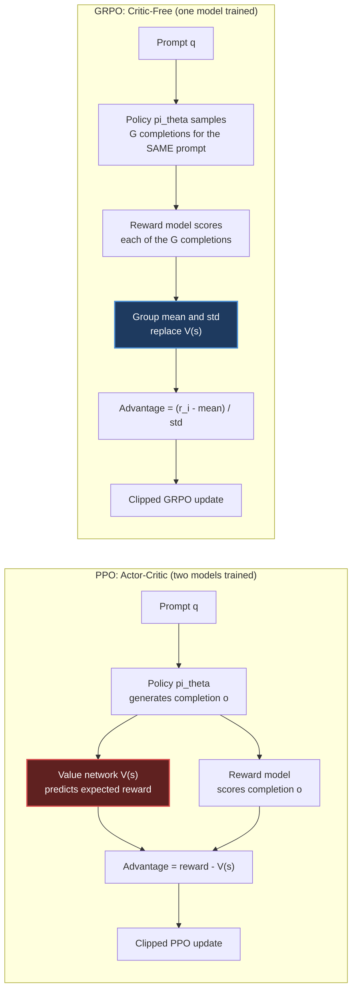
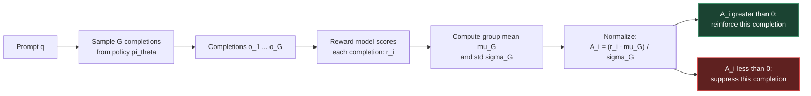
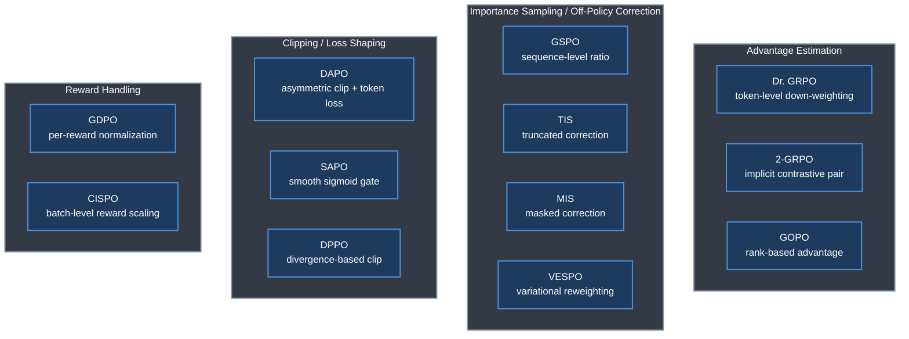
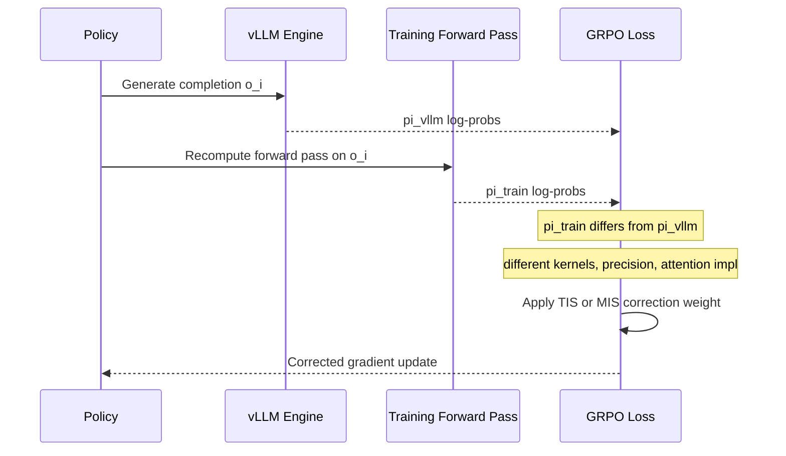
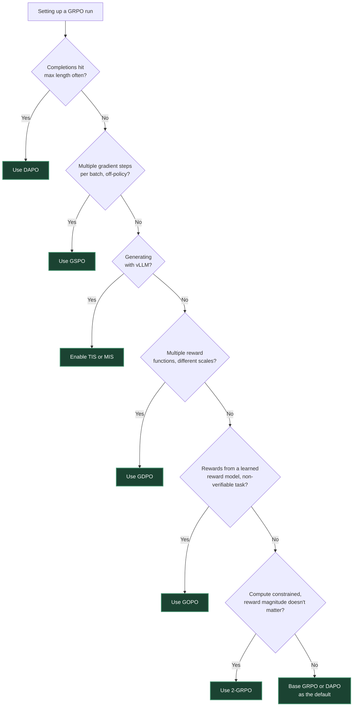

# Chapter 7. GRPO — Group Relative Policy Optimization

> *"Instead of learning a value function, estimate it empirically from a group of samples."*

**Part II — RL Methods for LLMs** · Book pages 164–179 · ~20 min read

[← Chapter 6. DPO — Direct Preference Optimization](06-dpo-direct-preference-optimization.md) · [Index](../README.md) · [Chapter 8. Preference Optimization Variants →](08-preference-optimization-variants.md)

---

## What This Chapter Is About

Group Relative Policy Optimization (GRPO) is a reinforcement learning algorithm built specifically for language models, and its one defining move is deleting the critic. PPO trains a separate value network to predict expected reward so it can compute an advantage; for a 70B-parameter model that value head shares (and can double) an already enormous memory footprint, is notoriously hard to train accurately on partial sequences, and injects noisy gradients early in training. GRPO sidesteps all three by sampling several completions to the *same* prompt and using the group's own reward statistics — its mean and standard deviation — as the baseline a critic would otherwise have to learn.

Introduced by DeepSeek as part of DeepSeekMath and scaled up for DeepSeek-R1, GRPO is now the default RL algorithm across open-source alignment frameworks — TRL, OpenRLHF, and veRL all ship it as the primary trainer. It is especially effective for reasoning tasks with verifiable rewards, for large models where critic memory is the binding constraint, and for multi-turn or agentic settings where value estimation across tool calls is close to intractable.

The base algorithm is simple enough to state in four steps, but that simplicity hides real failure modes: groups can go all-right or all-wrong and produce zero signal, symmetric clipping treats exploration and suppression as equally risky when they aren't, and inference engines like vLLM introduce a silent probability mismatch. This chapter covers the base algorithm, a minimal TRL implementation, group sizing, and a field of variants — each patching one specific crack in the base recipe.

## Table of Contents

- [The Mental Model](#the-mental-model)
- [Motivation: Why GRPO Removes the Critic](#motivation-why-grpo-removes-the-critic)
- [The GRPO Algorithm](#the-grpo-algorithm)
- [Key Formulas](#key-formulas)
- [TRL Implementation](#trl-implementation)
- [Group Size Analysis](#group-size-analysis)
- [GRPO Variants and Extensions](#grpo-variants-and-extensions)
  - [Diversity in GRPO Groups](#diversity-in-grpo-groups)
  - [DAPO — Dynamic Adaptive Policy Optimization](#dapo--dynamic-adaptive-policy-optimization)
  - [GSPO — Group Sequence Policy Optimization](#gspo--group-sequence-policy-optimization)
  - [Dr. GRPO — Debiased Reward GRPO](#dr-grpo--debiased-reward-grpo)
  - [2-GRPO — Minimal Two-Rollout GRPO](#2-grpo--minimal-two-rollout-grpo)
  - [SAPO — Soft Adaptive Policy Optimization](#sapo--soft-adaptive-policy-optimization)
  - [TIS and MIS — Truncated and Masked Importance Sampling](#tis-and-mis--truncated-and-masked-importance-sampling)
  - [VESPO — Variational Sequence-Level Soft Policy Optimization](#vespo--variational-sequence-level-soft-policy-optimization)
  - [DPPO — Direct Policy Divergence Policy Optimization](#dppo--direct-policy-divergence-policy-optimization)
  - [ScaleRL and CISPO](#scalerl-and-cispo)
  - [GDPO — Group Reward-Decoupled Policy Optimization](#gdpo--group-reward-decoupled-policy-optimization)
  - [GOPO — Group Ordinal Policy Optimization](#gopo--group-ordinal-policy-optimization)
- [Decision Guide](#decision-guide)
- [Common Pitfalls](#common-pitfalls)
- [Summary](#summary)
- [Practitioner Checklist](#practitioner-checklist)
- [Going Deeper](#going-deeper)

---

## The Mental Model



*PPO trains a value network to predict a baseline reward for each state; that network is removed in GRPO and replaced by the empirical mean and standard deviation of a group of same-prompt rollouts.*

The diagram is the whole idea. In PPO, the value network `V(s)` is a second model — sharing or doubling the policy's memory footprint — predicting what reward a partial sequence should expect, so an advantage (reward minus expectation) can be computed. GRPO throws that model away: because the `G` completions all answer the *same* prompt, their average reward is itself a Monte Carlo estimate of the expected reward — exactly what the value network was trying to predict, computed empirically instead of learned. Subtracting the group mean and dividing by the group std produces an advantage that plugs into the same clipped update, with no critic in the loop.

## Motivation: Why GRPO Removes the Critic

PPO's value model (critic) creates three problems for language models:

1. **Memory.** The value head shares the policy backbone — roughly 140GB for a 70B model — and doubles total memory if kept separate.
2. **Accuracy.** Predicting expected reward for a *partial* sequence is hard; a wrong value estimate produces a wrong advantage and gradient direction.
3. **Training.** The value head needs many samples to converge, emitting noisy predictions early in RL that destabilize policy learning.

GRPO's answer: stop learning `V(s)` and estimate it empirically from `G` responses to the same prompt. Roitman frames this as a case where an empirical baseline from real samples is, in practice, more accurate than a value function still early in training — part of why GRPO has outperformed PPO despite being the "simpler" of the two.

## The GRPO Algorithm



*Group sampling and normalization: G completions to one prompt are scored, and each response's reward is normalized against the group's own mean and standard deviation before it enters the clipped PPO-style update.*

Four steps: for each prompt `x`, sample `G` completions `{y1, ..., yG} ∼ πθ(·|x)`; score each one, `ri = R(x, yi)`; normalize within the group to get advantage `Âi`; apply a PPO-style clipped update. A response above the group mean is reinforced; below the mean, it's suppressed. Dividing by `σG` keeps advantages scale-invariant across prompts with different reward ranges.

> [!NOTE]
> The book's Figure 7.1: G=5 responses to one math prompt, three correct (r=1), two wrong (r=0). The group mean µG=0.6 is the baseline — correct responses get positive advantage (reinforced), wrong ones negative (suppressed).

Pure GRPO trained on binary correctness rewards (r=1 if correct, r=0 otherwise) is what DeepSeek-R1 used on math and code data — chain-of-thought reasoning, self-verification, and error correction emerged spontaneously, without any explicit instruction to produce them.

## Key Formulas

The group-relative advantage is the core quantity GRPO computes in place of a learned value estimate (in practice, `ε` is added to the denominator for numerical stability):

$$\hat{A}_i = \frac{r_i - \mu_G}{\sigma_G + \epsilon}, \qquad \mu_G = \frac{1}{G}\sum_{j=1}^{G} r_j, \qquad \sigma_G = \mathrm{std}(\{r_j\})$$

The clipped GRPO objective wraps this advantage in the same trust-region update PPO uses, plus a KL penalty back to the reference policy:

$$L = \mathbb{E}\Big[\min\big(\rho_t(\theta)\hat{A}_i,\ \mathrm{clip}(\rho_t(\theta), 1-\epsilon, 1+\epsilon)\hat{A}_i\big)\Big] - \beta\, D_{KL}\big[\pi_\theta \,\|\, \pi_{ref}\big]$$

In its per-token form, as implemented in practice, the loss averages the clipped objective over every token of every completion:

$$L_{GRPO} = -\frac{1}{G}\sum_{i=1}^{G} \frac{1}{|o_i|}\sum_{t=1}^{|o_i|} \min\Big(\rho_{i,t}\hat{A}_i,\ \mathrm{clip}(\rho_{i,t}, 1-\epsilon, 1+\epsilon)\hat{A}_i\Big), \qquad \rho_{i,t} = \frac{\pi_\theta(o_{i,t}\mid q, o_{i,<t})}{\pi_{old}(o_{i,t}\mid q, o_{i,<t})}$$

| Symbol | Meaning |
|---|---|
| `x`, `q` | The prompt |
| `G` | Group size — completions sampled per prompt |
| `yi`, `oi` | The i-th sampled completion, of length `\|oi\|` |
| `ri`, `R(x, yi)` | Reward assigned to completion `i` |
| `µG`, `σG` | Mean, std of reward within the group |
| `ε` | Small constant for numerical stability / clip range (0.2) — context distinguishes them |
| `Âi` | Group-normalized advantage for completion `i` |
| `ρi,t` (or `rt(θ)`) | Per-token importance ratio, `πθ / πold` |
| `β` | KL penalty coefficient |
| `πθ`, `πold`, `πref` | Current policy, policy at rollout time, frozen reference policy |
| `DKL` | KL divergence between current policy and reference policy |

**The memory argument versus PPO.** PPO's value head shares the policy backbone — about 140GB for a 70B model — and doubles that if kept as a separate model. GRPO removes an entire model from memory, which the source describes as halving the training system's engineering complexity on top of the raw memory savings.

## TRL Implementation

HuggingFace TRL's `GRPOTrainer` exposes group size, sampling temperature, and the KL coefficient as config fields:

```python
grpo_config = GRPOConfig(
    num_generations=8,             # G = group size
    temperature=1.0,               # high temp for diversity within group
    max_completion_length=2048,
    beta=0.04,                     # KL penalty coefficient
    learning_rate=1e-6,
    per_device_train_batch_size=2, # prompts/device (x8 gens = 16 responses)
    use_vllm=True,                 # vLLM: critical given 8x rollout cost
    vllm_gpu_memory_utilization=0.7,
)

def reward_fn(completions, prompts, **kwargs):
    return [1.0 if extract_answer(c) == get_ground_truth(p) else 0.0
            for c, p in zip(completions, prompts)]

def format_reward_fn(completions, **kwargs):
    return [0.5 if "\\boxed{" in c else 0.0 for c in completions]  # LaTeX bonus

trainer = GRPOTrainer(model=model, args=grpo_config,
    reward_funcs=[reward_fn, format_reward_fn], train_dataset=math_dataset)
trainer.train()
```

Reward functions combine — correctness and a formatting bonus both feed the same group-normalized advantage. `use_vllm=True` is critical: GRPO generates `G` completions per prompt (8x single-sample rollout cost), so fast batched generation dominates.

## Group Size Analysis

```mermaid
quadrantChart
    title Group Size Tradeoff: Compute Cost vs Signal Quality
    x-axis Low Compute --> High Compute
    y-axis Noisy Signal --> Clean Signal
    quadrant-1 Excellent, expensive
    quadrant-2 Sweet spot
    quadrant-3 Avoid: too noisy
    quadrant-4 Wasteful
    "G=2": [0.08, 0.05]
    "G=4": [0.28, 0.35]
    "G=8": [0.52, 0.62]
    "G=16": [0.78, 0.85]
    "G=32": [0.96, 0.97]
```

*As group size G grows, signal quality improves roughly with compute cost — but the source finds diminishing returns past G=16 for most tasks, and rates G=2 as never recommended on its own.*

| G | Signal Quality | Compute | When to Use |
|---|---|---|---|
| 2 | Very noisy (coin flip) | Low | Never recommended alone — too noisy |
| 4 | Moderate | Moderate | Quick experiments, easy tasks (pass rate >50%) |
| 8 | Good (standard) | High | Default for most tasks |
| 16 | Excellent | Very high | Hard tasks (pass rate <20%) |
| 32 | Near-perfect | Extreme | Only with massive compute, very hard tasks |

> [!WARNING]
> A group must contain **both** successes and failures. If all `G` responses are correct (or all wrong), every advantage normalizes to zero — no learning signal. Prompt difficulty must match the model's current capability.

The source calls this the **Goldilocks rule**: filter prompts to a 20–80% pass rate for the current model, re-filtered roughly every 500 steps.

## GRPO Variants and Extensions

Base GRPO's mechanism — sample a group, normalize, clip — is simple, but practitioners found specific failure modes: pretraining bias diluting gradients, symmetric clipping limiting exploration, wasteful group sizes, reward-scale imbalance across objectives. Each variant below targets one.

| Variant | What It Changes | Problem It Fixes | When to Use |
|---|---|---|---|
| **DAPO** | Asymmetric clip, token-level loss, overlong filtering/punishment, dynamic re-sampling | Symmetric clip over-suppresses; long completions dominate; truncation misleads | Long-form reasoning; default upgrade |
| **GSPO** | Clips one geometric-mean ratio per sequence, not per token | Per-token clip can pass while the sequence product ratio explodes off-policy | `steps_per_generation > 1` |
| **Dr. GRPO** | Down-weights tokens the reference model already favors | Pretraining-common tokens get large gradients despite no task signal | Large pretraining/RL vocabulary mismatch |
| **2-GRPO** | Uses G=2, reads GRPO as implicit DPO-like contrastive objective | Large groups waste compute when the real signal is pairwise contrast | Compute-constrained, verifiable rewards |
| **SAPO** | Replaces hard clip with a smooth sigmoid gate | Discontinuous gradient at the clip edge destabilizes training | Instability from the clip "cliff edge" |
| **TIS** | Truncated correction `min(C, πtrain/πvllm)` | vLLM and training pass compute different log-probs, biasing the ratio | Small, predictable train/vLLM mismatch |
| **MIS** | Zeros the gradient past threshold `C` | Same mismatch as TIS, handled conservatively | Large or unpredictable mismatch |
| **VESPO** | Smooth, asymmetric reweighting kernel from variational inference | Heuristic clipping doesn't principledly handle stale trajectories | Asynchronous / off-policy training |
| **DPPO** | Clips on direct TV/KL divergence, not the ratio | Ratio clipping over/under-penalizes low/high-probability tokens | Skewed token distributions (research-stage) |
| **CISPO / ScaleRL** | Batch-level reward normalization + DAPO's token-level loss | Per-group normalization alone doesn't scale | Large-scale RL; recommended default at scale |
| **GDPO** | Normalizes each reward independently before combining | A high-variance reward drowns out lower-variance ones | Multi-objective rewards, different scales |
| **GOPO** | Replaces reward magnitudes with within-group rank | RM scores are reliable in order only, not magnitude | Non-verifiable, RM-scored tasks |



*Twelve variants grouped by what they modify: advantage estimation, off-policy correction, clip shaping, or reward handling.*

### Diversity in GRPO Groups

Without diversity pressure, RL-trained LLMs collapse to a narrow set of high-reward responses: one "template" per question type, dropping entropy, easier reward hacking, generalization that memorizes reward patterns instead of reasoning. The KL penalty `βDKL[πθ‖πref]` is GRPO's primary diversity mechanism, but the source is explicit it's not sufficient alone.

Within a group: high temperature (τ=0.8–1.0) and larger `N` (8–16) make it more likely the group contains both good and bad approaches; DAPO's "No Repeat" penalty rejects duplicates. Identical responses zero the advantage; overly random ones make the signal noisy — the sweet spot is distinct, on-topic approaches.

| Method | How It Promotes Diversity |
|---|---|
| Entropy bonus | `αH(πθ)` added to reward, penalizing deterministic policies |
| KL penalty | `−βDKL[πθ‖πref]` prevents collapse to a single mode |
| Rejection sampling | Generate many, keep top-k by reward |
| Best-of-N | Generate N at inference, score all, return the best |
| DPO diverse pairs | Chosen/rejected differ in approach, not just quality |
| Multi-reward | Multiple reward models avoid one-dimension collapse |

**Verbalized Sampling (VS)**, training-free, prompts the model to verbalize a probability distribution over several candidates in one generation, then samples from it — bypassing the *typicality bias* by which aligned models otherwise concentrate on one or two "safe" outputs. The source reports 1.6–2.1× diversity gain in creative writing, and recommends VS for generating a group's `G` candidates.

### DAPO — Dynamic Adaptive Policy Optimization

Base GRPO clips symmetrically, treating a token the policy wants to raise the same as one it wants to suppress — but raising a good token is generally safe, while suppressing one that merely appeared in a bad completion can be badly wrong. DAPO bundles five fixes:

1. **Clip-Higher.** `clip(ρ, 1−ε, 1+εhigh)` when `A>0`, ordinary `clip(ρ, 1−ε, 1+ε)` otherwise (ε=0.2, εhigh=0.28) — more room toward good tokens, the usual conservative bound on suppression.
2. **Token-level loss.** Divides by total token count, not by `G`, so long completions don't dominate the gradient just by having more tokens.
3. **Overlong filtering.** Masks completions truncated before an EOS token — penalizing tokens for landing before an arbitrary cutoff is misleading.
4. **Soft overlong punishment.** A length penalty growing smoothly past a "safe" threshold `Lcache` toward `Lmax`.
5. **Dynamic sampling.** Re-samples prompts whose whole group got the same reward, since such groups give zero gradient — keeps effective batch size stable.

```python
config = GRPOConfig(
    epsilon=0.2, epsilon_high=0.28,          # Clip-Higher
    loss_type="dapo",                        # token-level loss aggregation
    mask_truncated_completions=True,         # overlong filtering
    num_generations=8,
)  # DAPO loss internally handles zero-variance group filtering
```

Use DAPO for long-form reasoning that frequently hits the length limit, or when base GRPO shows loss spikes or entropy collapse — recommended as a drop-in improvement for most tasks.

### GSPO — Group Sequence Policy Optimization

GRPO clips ratios per token, but a 500-token sequence's *product* of per-token ratios can be astronomically large or small even with every ratio inside `[1−ε, 1+ε]`. Reusing a batch for multiple gradient steps (off-policy) compounds that until the per-token bound stops constraining the sequence-level shift.

GSPO instead clips a sequence-level importance weight — the geometric mean of per-token ratios, the `|oi|`-th root of the full sequence probability ratio:

$$s_i(\theta) = \left(\frac{\pi_\theta(o_i \mid q)}{\pi_{old}(o_i \mid q)}\right)^{1/|o_i|} = \exp\left(\frac{1}{|o_i|}\sum_{t=1}^{|o_i|}\log\frac{\pi_\theta(o_{i,t}\mid q, o_{i,<t})}{\pi_{old}(o_{i,t}\mid q, o_{i,<t})}\right)$$

A sequence can have every per-token ratio in bounds yet a product ratio around 10^50 under GRPO; GSPO bounds the sequence-level shift itself — theoretically correct for off-policy IS, where GRPO's per-token clip is only an approximation. In TRL: `importance_sampling_level="sequence"`, paired with `steps_per_generation=4`; the benefit is negligible when purely on-policy.

### Dr. GRPO — Debiased Reward GRPO

The pretraining distribution introduces a systematic bias: tokens common in pretraining data get large gradients even when carrying no task-relevant information. Dr. GRPO down-weights tokens the reference (pretrained) model already assigns high probability to, regardless of reward:

$$w_{i,t} = \hat{A}_i \cdot \big(1 - \pi_{ref}(o_{i,t} \mid q, o_{i,<t})\big)$$

This concentrates gradient signal on tokens where the policy genuinely needs to change. In TRL: `loss_type="dr_grpo"`, with a `ref_model` passed to `GRPOTrainer` (required). Use it on tasks with a large pretraining/RL vocabulary mismatch, or when filler tokens dominate the gradient.

### 2-GRPO — Minimal Two-Rollout GRPO

The "It Takes Two" paper shows, empirically and theoretically, that GRPO with `G=2` matches or exceeds `G=16` on most reasoning benchmarks — surprising, given how noisy a two-sample mean should be. The explanation: GRPO's effectiveness does not primarily come from accurate advantage estimation (which needs large `G`); it comes from an implicit contrastive objective structurally similar to DPO:

$$L_{2\text{-}GRPO} \approx -\mathbb{E}_{(o^+,o^-)\sim\pi_\theta}\left[\log \sigma\left(\beta \log\frac{\pi_\theta(o^+\mid q)}{\pi_{old}(o^+\mid q)} - \beta \log\frac{\pi_\theta(o^-\mid q)}{\pi_{old}(o^-\mid q)}\right)\right]$$

where `o+`/`o-` are the higher/lower-reward completions. With `G=2` this structure is explicit; with `G=16` the same signal is diluted across redundant pairs. Roitman treats this as the more fundamental explanation of why GRPO works, over the sample-average-accuracy story the base algorithm implies.

In TRL, the only real change is `num_generations=2` with standard `loss_type="grpo"`. Savings are substantial: 8× less generation compute than `G=16`, and since generation is 60–80% of wall-clock time, total speedup lands around 4–6× end-to-end, with no accuracy loss on GSM8K, MATH, and code benchmarks.

> [!WARNING]
> With `G=2`, the normalized advantage is always `{+1, −1}` (or `{0, 0}` if the two rewards tie) — the gradient magnitude is fixed regardless of how large the actual reward gap is. For tasks where the magnitude of the reward difference matters (e.g., partial credit), a larger `G` may still be worth the extra compute.

### SAPO — Soft Adaptive Policy Optimization

PPO-style clipping creates a discontinuous gradient: zero outside the clip band, non-zero inside. This "cliff edge" destabilizes training near the boundary. SAPO replaces the hard clip with a smooth, temperature-controlled sigmoid gate, asymmetric between positive and negative advantages:

$$L_{SAPO}(\rho, A) = \begin{cases} -A \cdot \sigma\!\left(\dfrac{\rho-1}{\tau_+}\right)\cdot \rho & A > 0 \\[4pt] -A \cdot \sigma\!\left(\dfrac{1-\rho}{\tau_-}\right)\cdot \rho & A \le 0 \end{cases}$$

A higher temperature gives a softer gate (more exploration); as `τ → 0` it recovers hard PPO clipping, and as `τ → ∞` the unclipped policy gradient. In TRL: `loss_type="sapo"`, with `sapo_temperature_pos`/`sapo_temperature_neg` for `τ+`/`τ−` — the source's defaults are `τ+ = 1.0` and `τ− = 1.05` (slightly softer, to avoid over-suppression).

### TIS and MIS — Truncated and Masked Importance Sampling

When vLLM is used for fast generation, the log-probabilities it reports differ from those the training forward pass computes for the same tokens — not a bug, but different CUDA kernels, precision, and attention implementations (FlashAttention vs. PagedAttention). This silently breaks the on-policy assumption: the "old policy" probabilities used for importance ratios are wrong.



*vLLM's log-probabilities disagree with the training forward pass's for the same tokens; TIS and MIS correct the resulting importance-ratio bias before it reaches the gradient.*

**TIS** multiplies the gradient by a correction factor truncated at cap `C`; **MIS** is more conservative and zeros the gradient entirely past `C`:

$$w_{TIS}(o_i) = \min\left(C, \frac{\pi_{train}(o_i\mid q)}{\pi_{vllm}(o_i\mid q)}\right), \qquad w_{MIS}(o_i) = \mathbb{1}\left[\frac{\pi_{train}(o_i\mid q)}{\pi_{vllm}(o_i\mid q)} \le C\right]$$

Both can be computed at the sequence level (geometric mean over tokens, as in GSPO — theoretically correct but higher variance) or token level (biased, lower variance). In TRL: `vllm_importance_sampling_correction=True` with `vllm_importance_sampling_mode="sequence_truncate"` (TIS, `cap=5.0`) or `"sequence_mask"` (MIS, `cap=3.0`). Always consider enabling one with vLLM: TIS when the mismatch is small, MIS when it's large or unpredictable.

### VESPO — Variational Sequence-Level Soft Policy Optimization

Most variants modify clipping heuristically. VESPO instead derives a reward-reshaping kernel from a variational inference framework, treating policy optimization as approximate posterior inference:

$$g(\tau) = W(\tau)^k \cdot \exp\big(\lambda(1 - W(\tau))\big), \qquad W(\tau) = \frac{\pi_\theta(\tau)}{\pi_{old}(\tau)}$$

`W(τ)` is the sequence-level importance weight, `k` controls sharpness, and `λ` controls exponential decay for stale (low-weight) trajectories — smooth everywhere, with high-weight (`W>1`) and low-weight trajectories treated asymmetrically. In TRL: `loss_type="vespo"`, with `vespo_k_pos`/`vespo_lambda_pos`, paired with `steps_per_generation > 1` since handling that staleness is VESPO's whole point.

### DPPO — Direct Policy Divergence Policy Optimization

Ratio clipping is a proxy for constraining KL divergence between old and new policies, but the proxy is imperfect: it over-penalizes low-probability tokens (a small absolute change is a large ratio change) and under-penalizes high-probability ones (a large absolute change is a small ratio change). DPPO replaces ratio clipping with a direct divergence estimate:

$$L_{DPPO} = -\mathbb{E}\Big[\hat{A} \cdot \pi_\theta(o\mid q) \cdot \mathbb{1}\big[D(\pi_\theta \,\|\, \pi_{old}) \le \delta\big]\Big]$$

In practice this is approximated with token-level masks: `binary_tv`/`binary_kl` mask tokens where the TV or KL term exceeds `δ`; `topk_tv`/`topk_kl` keep only the top-k tokens by that contribution.

> [!NOTE]
> DPPO has no built-in TRL trainer yet — applying it requires subclassing `GRPOTrainer` and overriding the loss to clip on distributional divergence instead of the probability ratio. It is most useful when standard ratio clipping visibly fails, e.g. on highly skewed token probability distributions, but remains a research-stage contribution.

### ScaleRL and CISPO

ScaleRL studies what makes RL training scale for LLMs: batch-level reward scaling and DAPO-style token-level loss together unlock strong performance, while *neither is sufficient alone*. CISPO (Clipped IS Policy Optimization) is the resulting algorithm — it normalizes across the entire training batch, not one prompt's group, preventing any single prompt from dominating the gradient:

$$\hat{A}_i = \frac{r_i - \mu_{batch}}{\sigma_{batch} + \epsilon}$$

CISPO's full loss combines this with DAPO's token-level loss aggregation and asymmetric clipping:

$$L_{CISPO} = -\frac{1}{\sum_{i,t} m_{i,t}}\sum_{i=1}^{G}\sum_{t=1}^{|o_i|} m_{i,t}\cdot \min\Big(\rho_{i,t}\hat{A}_i,\ \mathrm{clip}_{DAPO}(\rho_{i,t}, \hat{A}_i)\,\hat{A}_i\Big)$$

where `mi,t` is the overlong-filtering mask.

```python
config = GRPOConfig(
    loss_type="cispo",
    scale_rewards="batch",                  # batch-level reward normalization
    mask_truncated_completions=True,
    epsilon=0.2,
    epsilon_high=5.0,                       # epsilon_max for CISPO, per the ScaleRL paper
    num_generations=8,
)
```

The ScaleRL findings: batch-level scaling alone and token-level loss alone each give a modest improvement; together they're synergistic — significantly better than either alone; larger batch sizes benefit more from batch-level scaling; and CISPO is recommended as the default for large-scale RL training.

### GDPO — Group Reward-Decoupled Policy Optimization

In multi-objective RL — correctness plus format, say — standard GRPO normalizes the *combined* reward. A high-variance reward then dominates the normalized advantage, and the other reward contributes near-zero gradient: advantage collapse. GDPO normalizes each reward independently before aggregating:

$$\hat{A}_n^{(i)} = \frac{r_n^{(i)} - \mu_n}{\sigma_n + \epsilon}, \qquad \hat{A}^{(i)} = \sum_{n=1}^{N} w_n \hat{A}_n^{(i)}$$

where `rn(i)` is the n-th reward for completion `i`, `µn`/`σn` its group mean/std, and `wn` user-specified weights — versus standard `Â(i) = (Σn wn rn(i) − µcombined)/σcombined`, where high-variance rewards dominate. In TRL: `multi_objective_aggregation="normalize_then_sum"` with a `reward_weights` list. Essential whenever combined rewards have very different scales or variances.

### GOPO — Group Ordinal Policy Optimization

Reward models are trained on pairwise comparisons, so only their *rank order* is trustworthy — raw scores carry no inherent meaning. GRPO nonetheless feeds raw magnitudes directly into the advantage; for non-verifiable rewards (summarization, chat) a gap of 0.6 reward points might reflect genuine quality in one region and mean nothing in another.

GOPO discards magnitudes entirely and uses only ordinal rank within the group: rank `N` responses (`rank(oi) ∈ {1, ..., N}`, 1=worst, N=best), then replace the raw advantage with a rank-based score, `f` a monotonic transform (e.g. a linear map to `[−1, 1]`):

$$\hat{A}_i^{GOPO} = f\!\left(\frac{\mathrm{rank}(o_i)}{N}\right)$$

then apply the usual PPO-style clipped objective using these rank-based advantages.

| Aspect | GRPO | GOPO |
|---|---|---|
| Advantage signal | `Âi = (ri − µ)/σ` (magnitudes) | `Âi = f(ranki/N)` (ordinal rank only) |
| Reward-scale sensitivity | High — miscalibrated RM scores distort it | None — invariant to monotonic transforms |
| Best for | Verifiable, well-calibrated rewards | Non-verifiable, RM-based rewards |

Empirically, on non-verifiable tasks GOPO's reward curves sit above GRPO's throughout, win-rates improve at most checkpoints, convergence is faster, and the advantage grows as the reward model gets noisier. Use GRPO when rewards are exact and verifiable; GOPO when they come from a learned reward model whose ordering is trustworthy but whose absolute scores are arbitrary.

## Decision Guide



*Each question routes to the variant fixing that failure mode; branches aren't mutually exclusive — DAPO, GDPO, and TIS/MIS are commonly stacked together.*

## Common Pitfalls

> [!WARNING]
> If every completion in a group gets the same reward — all correct or all wrong — every advantage normalizes to zero and the group contributes no gradient. Curate prompts to a 20–80% pass rate and re-filter periodically.

> [!WARNING]
> Without diversity pressure, RL training collapses to one template answer per question type. Track entropy, unique n-gram ratio, and reward-distribution width together — a simultaneous drop in all three is the collapse signature.

> [!WARNING]
> Generating with vLLM silently breaks the on-policy assumption: its reported log-probabilities differ from the training forward pass's. Without a TIS or MIS correction, this biases gradients in a way that looks like ordinary noise.

> [!WARNING]
> With `G=2`, normalized advantages collapse to `{+1, −1}` regardless of the actual reward gap — fine for binary/verifiable rewards, a real limitation wherever partial credit matters.

> [!WARNING]
> DPPO has no built-in TRL trainer; adopting it means subclassing `GRPOTrainer` yourself. Treat it as research-stage, not a drop-in flag.

## Summary

- GRPO removes the value network entirely, estimating advantage from group-relative rewards — for a 70B model, roughly 140GB of critic memory removed and engineering complexity halved versus PPO.
- The group mean is an empirical Monte Carlo baseline for expected reward; dividing by the group std keeps advantages scale-invariant across prompts with different reward ranges.
- A uniform-outcome group produces zero advantage everywhere; the Goldilocks rule filters prompts to a 20–80% pass rate, re-filtered roughly every 500 steps.
- Pure GRPO on binary correctness rewards drove DeepSeek-R1's spontaneous chain-of-thought, self-verification, and error-correction, without explicit instruction.
- DAPO's five fixes — asymmetric Clip-Higher, token-level loss, overlong filtering/punishment, dynamic sampling — are a recommended default upgrade over base GRPO.
- GSPO clips one sequence-level ratio instead of per-token ratios, mattering most once `steps_per_generation > 1`, where per-token-bounded ratios can compound into an unbounded shift.
- 2-GRPO shows GRPO's power comes from an implicit DPO-like contrastive signal, not accurate value estimation — G=2 matches G=16 at 4–6× less training time.
- vLLM generation introduces a silent train/inference log-probability mismatch that TIS or MIS correction is needed to fix.
- GOPO's rank-based advantage is invariant to monotonic reward transformations — more robust whenever rewards come from a noisy, miscalibrated reward model.

## Practitioner Checklist

- [ ] Set `num_generations` (G) to 8 by default; 16 for hard tasks (<20% pass rate); don't rely on G=2 outside a deliberate 2-GRPO setup.
- [ ] Filter training prompts to a 20–80% pass rate; re-filter roughly every 500 steps.
- [ ] Set rollout temperature to 0.8–1.0 for enough within-group diversity to rank meaningfully.
- [ ] Enable `use_vllm=True` with `vllm_gpu_memory_utilization` (~0.7) budgeted separately from training memory.
- [ ] Enable `vllm_importance_sampling_correction` (TIS or MIS) whenever rollouts come from vLLM.
- [ ] Start `beta` around 0.04; monitor entropy, unique n-gram ratio, and reward-distribution width for a collapse signature.
- [ ] Reach for DAPO (`loss_type="dapo"`, `epsilon_high=0.28`, `mask_truncated_completions=True`) as a default upgrade.
- [ ] Switch `importance_sampling_level="sequence"` (GSPO) once `steps_per_generation > 1`.
- [ ] Use GDPO (`multi_objective_aggregation="normalize_then_sum"`) when combining reward functions of different scales.
- [ ] Prefer GOPO's rank-based advantage over raw GRPO for non-verifiable, RM-scored tasks like chat or summarization.
- [ ] Consider 2-GRPO (`num_generations=2`) when generation compute is the bottleneck and reward magnitude doesn't matter.
- [ ] Budget custom engineering time before DPPO — no built-in TRL trainer, requires subclassing `GRPOTrainer`.

## Going Deeper

- **GRPO / DeepSeekMath** [323], **DeepSeek-R1** [72] — the original algorithm and its production scale-up (spontaneous chain-of-thought).
- **DAPO** [413], **GSPO** [51], **Dr. GRPO** [232] — the five-fix set, sequence-level IS, and pretraining-bias debiasing.
- **"It Takes Two"** [399], **SAPO** [131] — 2-GRPO's contrastive reading, and smooth sigmoid-gated clipping.
- **vLLM/training probability-mismatch analysis** [436], **VESPO** [243], **DPPO** [7] — motivates TIS/MIS; variational reward reshaping; divergence-based trust regions.
- **ScaleRL/CISPO** [242], **GDPO** [437], **GOPO** [54] — scaling laws, per-reward normalization, rank-based advantage.
- **Verbalized Sampling** [422] — training-free prompting for output diversity.
- **HuggingFace TRL** — the `GRPOTrainer`/`GRPOConfig` API used throughout; also the default trainer in OpenRLHF and veRL.

> [!NOTE]
> Bracketed numbers are the book's own bibliography references, reproduced as printed rather than resolved to external titles/authors not given in the extracted text.

---

[← Chapter 6. DPO — Direct Preference Optimization](06-dpo-direct-preference-optimization.md) · [Index](../README.md) · [Chapter 8. Preference Optimization Variants →](08-preference-optimization-variants.md)

*Summary of Chapter 7 of [The Hitchhiker's Guide to Agentic AI](https://arxiv.org/abs/2606.24937)
by Haggai Roitman. Licensed CC BY-SA 4.0. Independent study notes — not affiliated with or
endorsed by the author.*
