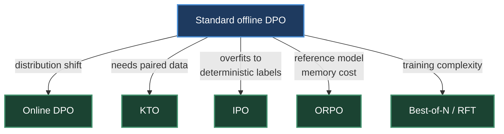
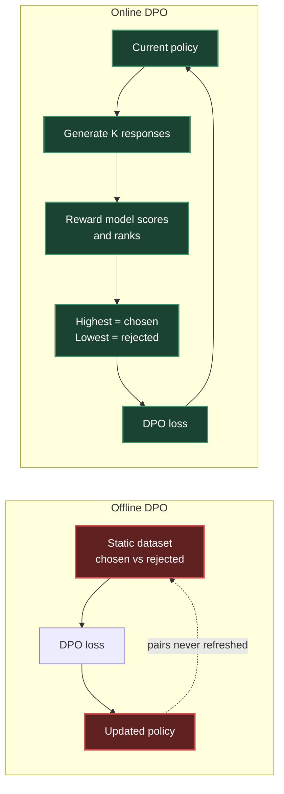
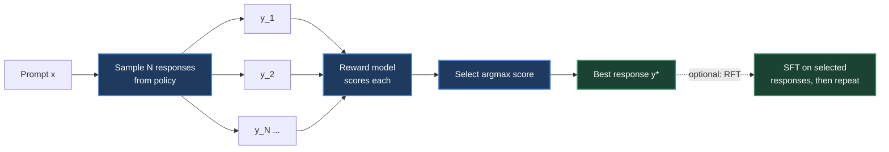
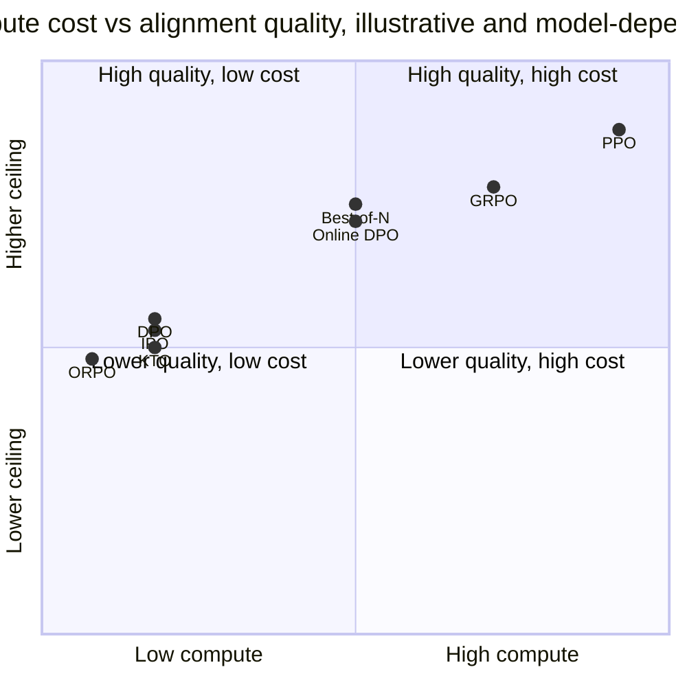
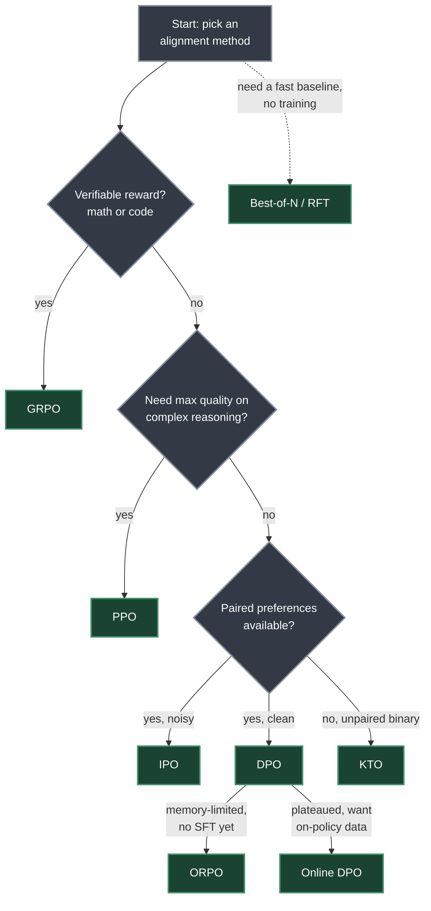

# Chapter 8. Preference Optimization Variants

> *"Every preference-optimization variant fixes exactly one weakness of standard offline DPO — distribution shift, unpaired data, overfitting, reference-model memory, or training complexity — never all of them at once."*

**Part II — RL Methods for LLMs** · Book pages 180–187 · ~14 min read

[← Chapter 7. GRPO — Group Relative Policy Optimization](07-grpo-group-relative-policy-optimization.md) · [Index](../README.md) · [Chapter 9. Reward Model Training →](09-reward-model-training.md)

---

## What This Chapter Is About

Direct Preference Optimization (DPO), covered in Chapter 6, replaced Proximal Policy Optimization (PPO)'s reward-model-plus-rollout loop with a single supervised loss over static preference pairs. That simplicity comes with five specific costs: DPO's static pairs go stale as the policy moves away from the distribution they were sampled from; DPO needs *paired* data (a chosen and a rejected response for the same prompt), which most real feedback isn't; DPO's loss has a degenerate optimum that encourages overfitting; DPO still carries a full reference-model copy in memory; and building a clean offline preference dataset is itself a project. This chapter surveys five methods that each patch exactly one of those five costs, rather than trying to fix all of them at once.

Online DPO reintroduces on-policy generation to solve distribution shift, at the cost of needing a reward model again. Kahneman-Tversky Optimization (KTO) drops the pairing requirement and trains on independent thumbs-up/thumbs-down examples using ideas from behavioral economics. Identity Preference Optimization (IPO) replaces DPO's unbounded log-sigmoid loss with a squared loss that targets a finite margin, closing off the overfitting failure mode. Odds Ratio Preference Optimization (ORPO) removes the reference model entirely by folding a standard supervised fine-tuning (SFT) loss and an odds-ratio preference term into one objective. Best-of-N sampling (rejection sampling) skips gradient-based training altogether at inference time, and doubles as a data-generation step for iterative fine-tuning.

By the end of the chapter you should be able to look at what data you have and pick the cheapest method that fits, rather than defaulting to whichever method you read about most recently.

## Table of Contents

- [The Mental Model](#the-mental-model)
- [Online DPO](#online-dpo)
  - [Motivation](#motivation)
  - [Algorithm](#algorithm)
  - [TRL Implementation](#trl-implementation)
  - [Online DPO vs Offline DPO vs PPO](#online-dpo-vs-offline-dpo-vs-ppo)
- [KTO — Kahneman-Tversky Optimization](#kto--kahneman-tversky-optimization)
- [IPO — Identity Preference Optimization](#ipo--identity-preference-optimization)
- [ORPO — Odds Ratio Preference Optimization](#orpo--odds-ratio-preference-optimization)
- [Best-of-N Sampling](#best-of-n-sampling-rejection-sampling)
- [Choosing an Alignment Method](#choosing-an-alignment-method)
- [Key Formulas](#key-formulas)
- [Decision Guide](#decision-guide)
- [Common Pitfalls](#common-pitfalls)
- [Summary](#summary)
- [Practitioner Checklist](#practitioner-checklist)
- [Going Deeper](#going-deeper)

---

## The Mental Model



*Each variant in this chapter is DPO plus one targeted fix — not a wholesale replacement.*

Read this diagram as the chapter's index. Every method downstream of `DPO0` keeps DPO's basic shape and changes exactly one thing: Online DPO changes where the pairs come from, KTO changes whether pairs are required, IPO changes the loss's saturation behavior, ORPO changes whether a reference model exists, and Best-of-N changes whether there is a training loop at all. None subsumes DPO — each answers whichever of its five weaknesses is actually binding on your project.

---

## Online DPO

### Motivation

Standard DPO's primary limitation is that its preference data was generated by a different model — often an older checkpoint or even a different model family. As training progresses, the policy generates text that looks nothing like the training pairs, so the loss ends up optimizing against an increasingly irrelevant distribution. Online DPO's solution is to generate fresh preference pairs from the *current* policy at every step, judge them with a reward model, and then apply the ordinary DPO loss.

### Algorithm

1. Generate K responses per prompt from the current policy π<sub>θ</sub>.
2. Score all responses with a reward model r<sub>φ</sub>.
3. Create pairs: the highest-scoring response becomes "chosen," the lowest-scoring becomes "rejected."
4. Apply the DPO loss on these fresh pairs.
5. Repeat — new generation happens every step.

Online DPO takes the simple supervised loss, lack of a value function, lack of Generalized Advantage Estimation (GAE), and stable optimization from DPO, while taking on-policy data and self-improvement beyond the fixed dataset from PPO — without any distribution shift. The key difference from GRPO (Chapter 7) is that Online DPO still applies a *pair-based* DPO loss, not GRPO's per-sample advantage from group-relative rewards.

> [!NOTE]
> Online DPO needs a reward model, which offline DPO doesn't, but it has no value head, which PPO does. It sits in the middle of the complexity spectrum between the two.

### TRL Implementation

```python
from trl import OnlineDPOConfig, OnlineDPOTrainer
from transformers import AutoModelForCausalLM, AutoModelForSequenceClassification

model = AutoModelForCausalLM.from_pretrained(
    "meta-llama/Llama-3.1-8B-Instruct", torch_dtype=torch.bfloat16)
reward_model = AutoModelForSequenceClassification.from_pretrained(
    "RLHFlow/ArmoRM-Llama3-8B-v0.1", torch_dtype=torch.bfloat16)

online_dpo_config = OnlineDPOConfig(
    output_dir="./online_dpo_output",
    learning_rate=5e-7,
    beta=0.1,                       # DPO beta, same meaning as standard DPO
    num_generations=4,              # K responses per prompt
    per_device_train_batch_size=4,
    gradient_accumulation_steps=4,
    max_new_tokens=512,
    temperature=0.7,
    bf16=True,
    num_train_epochs=1,
    logging_steps=10,
)

trainer = OnlineDPOTrainer(
    model=model, reward_model=reward_model,
    args=online_dpo_config, train_dataset=prompt_dataset, tokenizer=tokenizer,
)
trainer.train()
```

### Online DPO vs Offline DPO vs PPO

| | Data | Models | Loss | Best For |
|---|---|---|---|---|
| **Offline DPO** | Static pairs | 2 (policy + reference) | DPO | Quick alignment, limited compute |
| **Online DPO** | Fresh from π<sub>θ</sub> | 3 (policy + reference + reward model) | DPO | When DPO plateaus, need exploration |
| **PPO** | Fresh from π<sub>θ</sub> | 4 (policy + reference + reward model + value head) | PPO clip | Max quality, complex reasoning |



*Offline DPO's loop never touches the current policy's own outputs; Online DPO's loop closes on itself every step, which is what removes distribution shift at the cost of needing a reward model.*

---

## KTO — Kahneman-Tversky Optimization

### Motivation

DPO requires paired preferences: for the same prompt, you need both a good and a bad response. In practice, most feedback is unpaired — users give a thumbs up or thumbs down on individual responses, with no matched pair. KTO's insight, drawn from prospect theory in behavioral economics, is that humans feel losses more strongly than equivalent gains, so a thumbs-down should produce a stronger gradient than a thumbs-up.

Desirable responses (y<sub>w</sub>) give the model "utility" from an increased probability, but with diminishing returns — once a response is already likely, the loss doesn't keep pushing harder. Undesirable responses (y<sub>l</sub>) are penalized more strongly than desirable ones are rewarded, by default equally weighted (λ<sub>l</sub> = λ<sub>w</sub> = 1.0) but tunable toward stronger loss aversion by setting λ<sub>l</sub> > λ<sub>w</sub>. The key advantage: each training example is independent, so there's no need for matched pairs — thumbs-up/thumbs-down data can be used directly.

KTO's data format is `{"prompt": ..., "completion": ..., "label": true/false}`, in contrast to DPO's `{"prompt": ..., "chosen": ..., "rejected": ...}`. That unlocks thumbs up/down from production traffic, upvotes/downvotes from forums, human ratings binarized (e.g. 4–5 stars = good, 1–2 stars = bad), and any other per-response quality signal.

### TRL Implementation

```python
from trl import KTOConfig, KTOTrainer

# Dataset format: {"prompt": str, "completion": str, "label": bool}
# label = True for desirable, False for undesirable
kto_dataset = [
    {"prompt": "What's 2+2?", "completion": "The answer is 4.", "label": True},
    {"prompt": "What's 2+2?", "completion": "It might be 5.", "label": False},
]

kto_config = KTOConfig(
    output_dir="./kto_output",
    beta=0.1,
    desirable_weight=1.0,       # Weight for good examples
    undesirable_weight=1.0,     # Weight for bad examples (increase for loss aversion)
    learning_rate=5e-7,
    max_length=2048,
    per_device_train_batch_size=4,
    gradient_accumulation_steps=4,
    num_train_epochs=1,
    bf16=True,
)

trainer = KTOTrainer(
    model=model, ref_model=ref_model,  # Or None with LoRA
    args=kto_config, train_dataset=kto_dataset, tokenizer=tokenizer,
)
trainer.train()
```

**When to choose KTO:** you have binary feedback but not matched pairs; you have production thumbs-up/down data at scale; one class dominates (e.g., 90% good, 10% bad — KTO handles imbalance better than DPO); or you need rapid iteration on noisy labels, since KTO is more robust to label noise than DPO.

---

## IPO — Identity Preference Optimization

### Motivation

DPO has a degenerate solution: it can reach zero loss by making the margin between chosen and rejected infinitely large. In practice this means DPO overfits — pushing the chosen probability toward 1 and the rejected probability toward 0, memorizing the training data. IPO's fix is to replace the log-sigmoid loss, which saturates, with a squared loss that targets a specific, finite margin. The loss is minimized at that finite gap, not at infinity.

Under DPO, σ(margin) → 1 is optimal as margin → ∞, so there's no natural stopping point. Under IPO, the margin optimum sits at 1/(2β), and the squared loss penalizes margins that are either too small *or* too large. The result: IPO is more robust to noisy labels (a mislabeled pair's influence is bounded rather than pushing the loss toward infinity) and generalizes better because it doesn't memorize the training set.

### TRL Implementation

```python
from trl import DPOConfig, DPOTrainer

# IPO is implemented as a DPO loss_type variant in TRL
ipo_config = DPOConfig(
    output_dir="./ipo_output",
    beta=0.1,
    loss_type="ipo",            # The key difference!
    learning_rate=5e-7,
    max_length=2048,
    per_device_train_batch_size=4,
    gradient_accumulation_steps=8,
    bf16=True,
    num_train_epochs=1,
)

trainer = DPOTrainer(
    model=model, ref_model=None, args=ipo_config,
    train_dataset=pref_dataset, tokenizer=tokenizer, peft_config=lora_config,
)
trainer.train()
```

**When to choose IPO over DPO:** noisy preference data (crowdsourced, AI-judged with errors); you're observing DPO overfitting (train loss → 0 but eval degrades); you want more conservative, robust alignment; or you need multiple epochs of training — DPO tends to degrade after epoch 1, while IPO stays more stable across epochs.

---

## ORPO — Odds Ratio Preference Optimization

### Motivation

Every method covered so far still needs a reference model — either as a separate full copy (doubling memory) or implicitly through LoRA. ORPO eliminates the reference model entirely by combining SFT and preference alignment into a single loss. The key insight is to use the odds ratio of generating the chosen response versus the rejected response as the preference signal; the SFT component naturally prevents collapse, so there's no need for KL regularization at all.

The SFT term trains the model to generate the chosen response well, exactly as standard language modeling does. The odds-ratio term additionally pushes the model to prefer chosen over rejected, using a contrast that doesn't require a reference model. Why no reference is needed: the SFT loss already anchors the model to reasonable text, serving the same role that KL-to-reference plays in other methods. The result is one model, one forward pass, one loss — roughly 50% less memory than a reference-carrying method.

### TRL Implementation

```python
from trl import ORPOConfig, ORPOTrainer

orpo_config = ORPOConfig(
    output_dir="./orpo_output",
    beta=0.1,                        # Odds ratio weight (lambda)
    learning_rate=5e-7,
    max_length=2048,
    per_device_train_batch_size=2,
    gradient_accumulation_steps=8,
    bf16=True,
    num_train_epochs=1,
    gradient_checkpointing=True,
)

trainer = ORPOTrainer(
    model=model,                     # No ref_model needed!
    args=orpo_config,
    train_dataset=pref_dataset,      # Same format as DPO: prompt/chosen/rejected
    tokenizer=tokenizer,
    peft_config=lora_config,
)
trainer.train()
```

**When to choose ORPO:** you're memory-constrained and can't afford a reference-model copy (ORPO saves an estimated 70–140GB at 70B scale); you're starting from a base model that hasn't been SFT'd yet, since ORPO performs SFT simultaneously; you want the simplest possible pipeline — one model, one loss, one training run; or you already have good preference data available from the start.

> [!WARNING]
> ORPO is less studied than DPO or PPO, with fewer proven recipes at 70B+ scale. Its SFT component means it needs genuinely high-quality chosen responses, not just a relative preference signal. And because the two loss terms can conflict, it's harder to debug than a single-objective method.

**See also — SimPO:** SimPO is another reference-free preference method, using length-normalized log-probability as an implicit reward and eliminating the reference model entirely, in the same spirit as ORPO. It's covered alongside DPO's other extensions in [Chapter 6](06-dpo-direct-preference-optimization.md).

---

## Best-of-N Sampling (Rejection Sampling)

### Motivation

Sometimes the simplest approach wins. Best-of-N requires no training at all during the RL phase — just generate multiple candidates and pick the best one.

### Algorithm

1. For each prompt, generate N responses from the policy (typically N = 4–64).
2. Score all responses with a reward model.
3. Select the highest-scoring response.
4. (Optional) Use the selected responses as SFT data for the next iteration.

$$y^* = \arg\max_{y_i \sim \pi_\theta(\cdot|x)} r_\phi(x, y_i)$$

At inference time, Best-of-N improves output quality without touching model weights at all. With N = 64, win-rate improves 10–20% over greedy decoding — sometimes matching or exceeding PPO. As a training method, it becomes Rejection Sampling Fine-Tuning (RFT): generate many responses, select the best ones, SFT on the selected responses, and repeat for iterative refinement. This is how many production models are trained in practice — simpler than PPO, almost as effective, and completely stable.

There's also a theoretical connection: Best-of-N implements an implicit KL-constrained policy, π<sub>BoN</sub>(y|x) ∝ π<sub>θ</sub>(y|x)<sup>1−1/N</sup> · r(x, y)<sup>1/N</sup>.



*No gradient update happens in the top row — Best-of-N is inference-time reranking. The dashed edge into RFT is what turns it into a training method.*

### TRL Implementation

```python
from transformers import pipeline
import numpy as np

# Inference-time Best-of-N (manual implementation)
gen_pipeline = pipeline("text-generation", model=model, tokenizer=tokenizer)

def best_of_n(prompt, n=16, temperature=0.8):
    """Generate N candidates and return the highest-reward one."""
    candidates = gen_pipeline(
        prompt, num_return_sequences=n,
        temperature=temperature, do_sample=True, max_new_tokens=512,
    )
    scores = [reward_model.score(prompt, c["generated_text"]) for c in candidates]
    return candidates[np.argmax(scores)]["generated_text"]

best_response = best_of_n(prompt, n=16)

# Training: Rejection Sampling Fine-Tuning (RFT)
from trl import SFTConfig, SFTTrainer

# Step 1: Generate and filter
all_responses = []
for prompt in prompts:
    candidates = [generate(prompt, temp=0.9) for _ in range(16)]
    scores = [reward_model.score(prompt, c) for c in candidates]
    best_idx = np.argmax(scores)
    if scores[best_idx] > threshold:  # Quality gate
        all_responses.append({"prompt": prompt, "completion": candidates[best_idx]})

# Step 2: SFT on best responses
sft_config = SFTConfig(output_dir="./rft_output", learning_rate=2e-5,
                        num_train_epochs=2, max_seq_length=2048)
trainer = SFTTrainer(model=model, args=sft_config, train_dataset=all_responses,
                      tokenizer=tokenizer)
trainer.train()
# Step 3: Repeat from Step 1 with the updated model (iterative RFT)
```

### Scaling Laws for Best-of-N

| N | Quality Gain | Cost | Notes |
|---|---|---|---|
| 1 | Baseline | 1× | Standard sampling |
| 4 | +5–8% win-rate | 4× | Minimum useful. Good cost/quality ratio |
| 16 | +10–15% win-rate | 16× | Strong. Often matches PPO quality |
| 64 | +15–20% win-rate | 64× | Diminishing returns start |
| 256 | +18–22% win-rate | 256× | Only for critical applications |

> [!IMPORTANT]
> Always compare your RL method against Best-of-N at the same compute budget. If PPO with 64 GPU-hours doesn't beat Best-of-N with 64 GPU-hours of generation, your PPO implementation has a bug.

---

## Choosing an Alignment Method

Having surveyed the full landscape of preference optimization and RL-based alignment methods, this section consolidates the trade-offs into a single reference.



*Positions follow Table 8.1's compute tiers (Very low → Very high) and each method's stated best-for use case, not a benchmarked score — the book explicitly labels this frontier illustrative. Methods above the (unmarked) SFT ceiling improve beyond what supervised fine-tuning alone achieves.*

---

## Key Formulas

**KTO loss** — combines a diminishing-returns term for desirable responses with a loss-aversion-weighted term for undesirable ones:

$$L_{KTO} = \mathbb{E}_{y_w}\left[\lambda_w\left(1 - v(x, y_w)\right)\right] + \mathbb{E}_{y_l}\left[\lambda_l \cdot v(x, y_l)\right]$$

$$v(x, y) = \sigma\left(\beta \log \frac{\pi_\theta(y|x)}{\pi_{ref}(y|x)} - z_{ref}\right)$$

| Symbol | Meaning |
|---|---|
| y<sub>w</sub> | a desirable ("good") response |
| y<sub>l</sub> | an undesirable ("bad") response |
| λ<sub>w</sub> | weight on the desirable-response loss (default 1.0) |
| λ<sub>l</sub> | weight on the undesirable-response loss (default 1.0; raise above λ<sub>w</sub> for loss aversion) |
| v(x, y) | value function combining the policy/reference log-ratio and a baseline |
| β | KL strength, same role as DPO's β |
| π<sub>θ</sub>, π<sub>ref</sub> | current policy and reference policy |
| z<sub>ref</sub> | running baseline equal to the expected KL divergence |
| σ | sigmoid function |

**IPO loss** — a squared loss with a finite target margin, replacing DPO's unbounded log-sigmoid:

$$L_{IPO} = \mathbb{E}\left[\left(\log\frac{\pi_\theta(y_w|x)}{\pi_{ref}(y_w|x)} - \log\frac{\pi_\theta(y_l|x)}{\pi_{ref}(y_l|x)} - \frac{1}{2\beta}\right)^2\right]$$

| Symbol | Meaning |
|---|---|
| y<sub>w</sub>, y<sub>l</sub> | chosen and rejected responses |
| π<sub>θ</sub>, π<sub>ref</sub> | current policy and reference policy |
| β | inverse-temperature parameter that sets the target margin |
| 1/(2β) | the finite log-ratio margin at which the loss is minimized — replaces DPO's margin → ∞ |

**ORPO loss** — a standard SFT term plus an odds-ratio preference term, with no reference model:

$$L_{ORPO} = \underbrace{L_{SFT}(y_w)}_{\text{standard NLL on chosen}} - \lambda \cdot \log \sigma\left(\log \frac{\text{odds}_\theta(y_w|x)}{\text{odds}_\theta(y_l|x)}\right)$$

$$\text{odds}_\theta(y|x) = \frac{P_\theta(y|x)}{1 - P_\theta(y|x)}$$

| Symbol | Meaning |
|---|---|
| L<sub>SFT</sub>(y<sub>w</sub>) | standard negative log-likelihood on the chosen response |
| λ | odds-ratio weight (TRL's `beta` parameter, e.g. 0.1) |
| odds<sub>θ</sub>(y\|x) | odds of the current policy generating y given x |
| y<sub>w</sub>, y<sub>l</sub> | chosen and rejected responses |
| σ | sigmoid function |

---

## Decision Guide



*Adapted from the book's step-by-step decision tree into a branching diagram: work top to bottom, and branch off DPO for the two follow-up questions about memory and plateauing.*

| Method | Data Format | Reference Model? | Reward Model? | Online Generation? | Key Hyperparameter | Failure Mode | When to Pick |
|---|---|---|---|---|---|---|---|
| **PPO** | Prompts, online rollouts | Yes | Yes | Yes | Clip range / value coefficient (Ch. 5) | Low stability (Table 8.1) — 4 networks to balance | Max quality, complex reasoning |
| **GRPO** | Prompts, online rollouts, verifiable reward | Yes (no critic) | Yes (verifier/reward) | Yes | Group size G (Ch. 7) | Needs verifiable rewards — weaker fit outside math/code | Math/code with verifiable rewards |
| **DPO** | Offline pairs `{prompt, chosen, rejected}` | Yes | No | No | β, KL strength (e.g. 0.1) | Distribution shift as policy diverges from static pairs; degenerate solution overfits at margin → ∞ | Style/safety alignment, limited compute |
| **Online DPO** | Prompts only, pairs generated online | Yes (3 models) | Yes | Yes | β + K responses per prompt (e.g. 4) | Needs a reward model and fresh generation every step | DPO plateaued, want on-policy exploration |
| **KTO** | Unpaired `{prompt, completion, label}` | Optional (or None with LoRA) | No | No | λ<sub>w</sub> / λ<sub>l</sub> (default 1.0/1.0) | Needs weight tuning on heavily imbalanced label data | Production thumbs up/down, imbalanced or noisy labels |
| **IPO** | Offline pairs (same as DPO) | Yes (or LoRA-implicit) | No | No | β, sets target margin 1/(2β) | Fixed margin can be too loose or tight if β is mis-set | Noisy/crowdsourced preferences, DPO overfitting observed |
| **ORPO** | Offline pairs (same as DPO) | No | No | No | λ, odds-ratio weight (e.g. 0.1) | Two loss terms can conflict; needs high-quality chosen responses; less proven at 70B+ | Memory-constrained, starting from base model |
| **Best-of-N** | Prompts only | No | Yes | Yes (sampling only) | N, candidates per prompt (4–64) | Cost scales with N; diminishing returns past ~64; inference-only unless paired with RFT | Fast strong baseline, generating SFT data |

> [!NOTE]
> PPO and GRPO's key-hyperparameter cells point to Chapters 5 and 7; the rest of the table draws on this chapter's own Table 8.1 and cross-method comparison.

---

## Common Pitfalls

> [!WARNING]
> Standard offline DPO trains on pairs generated by an older checkpoint. As the policy improves, its outputs diverge from those pairs, and the loss optimizes against an increasingly irrelevant distribution. If DPO plateaus, this is usually why — move to Online DPO rather than tuning β further.

> [!WARNING]
> DPO's loss has a degenerate zero-loss solution at infinite margin. Train loss trending toward 0 while eval degrades means DPO is memorizing the training pairs, not generalizing. Switch to IPO's `loss_type="ipo"` to bound the margin.

> [!IMPORTANT]
> Treat Best-of-N as a compute-matched sanity check. If a full RL method can't beat Best-of-N sampling at the same GPU-hour budget, the implementation — not the method — is the likely problem.

---

## Summary

- Online DPO regenerates preference pairs from the live policy every step and scores them with a reward model, fixing the distribution-shift problem that degrades standard offline DPO as training progresses.
- KTO drops the pairing requirement entirely, training on independent `{prompt, completion, label}` examples and weighting undesirable-response loss more heavily than desirable-response gain, following prospect theory's loss aversion.
- IPO replaces DPO's log-sigmoid loss with a squared loss that targets a finite margin of 1/(2β), closing off the degenerate zero-loss-at-infinite-margin solution that drives DPO to overfit and memorize training pairs.
- ORPO removes the reference model altogether by combining a standard SFT loss on the chosen response with an odds-ratio preference term, cutting memory by roughly 50% — an estimated 70–140GB at 70B scale.
- Best-of-N needs no gradient-based training during the RL phase: sampling N = 64 candidates and reward-scoring them lifts win-rate 15–20% over greedy decoding and can match or exceed PPO.
- Every RL alignment method should be benchmarked against Best-of-N at equal compute — a method that can't beat that baseline likely has a bug, not a weak algorithm.
- The five variants each patch exactly one weakness of offline DPO — distribution shift, unpaired data, overfitting, reference-model memory, training complexity — so the right choice depends on which constraint actually binds for your project.
- SimPO offers a separate reference-free path via length-normalized log-probability as an implicit reward, in the same spirit as ORPO, covered alongside DPO's other extensions in Chapter 6.

---

## Practitioner Checklist

- [ ] If eval regresses after epoch 1 while DPO train loss keeps falling, treat it as overfitting and try IPO (`loss_type="ipo"`) before touching β further.
- [ ] If feedback is unpaired thumbs-up/down, don't synthesize pairs — use KTO with `{prompt, completion, label}` directly.
- [ ] Tune KTO's `desirable_weight` / `undesirable_weight` when labels are heavily imbalanced (e.g. 90% good / 10% bad).
- [ ] If GPU memory is the binding constraint, drop the reference model with ORPO rather than approximating it via LoRA — an estimated 70–140GB saved at 70B scale.
- [ ] Before running SFT and DPO as separate stages, consider ORPO for a single-pass pipeline — only when good preference data is already available.
- [ ] If DPO has plateaued, move to Online DPO rather than switching families: same loss, adds a reward model and fresh generation per step.
- [ ] Always benchmark any RL method against Best-of-N at an equal compute budget before trusting its results.
- [ ] Use Best-of-N with N ≥ 16 as a fast baseline before investing in a full RL training loop.
- [ ] For Rejection Sampling Fine-Tuning, set a quality-score threshold before adding a candidate to the SFT set, not just the unconditional argmax.
- [ ] Match reward-model provisioning to the method: Online DPO and Best-of-N need one; DPO, KTO, IPO, ORPO don't.
- [ ] Check whether preference data is noisy or crowdsourced before defaulting to DPO — IPO's squared loss bounds mislabeled-pair damage.
- [ ] Starting from a base (non-SFT'd) model? Prefer ORPO's combined loss over a separate SFT-then-DPO pipeline.

---

## Going Deeper

The chapter cites these methods by reference number without full bibliographic detail on the extracted pages. The titles below are the well-known papers behind each cited method, supplied from general knowledge for orientation — verify against the book's own reference list before citing formally.

- **Online DPO** [127] — related to "Direct Language Model Alignment from Online AI Feedback" (Guo et al.).
- **KTO** [87] — "KTO: Model Alignment as Prospect Theoretic Optimization" (Ethayarajh, Xu, Muennighoff, Jurafsky, Kiela).
- **IPO** [14] — "A General Theoretical Paradigm to Understand Learning from Human Preferences" (Azar, Rowland, Piot, Guo, Calandriello, Valko, Munos).
- **ORPO** [141] — "ORPO: Monolithic Preference Optimization without Reference Model" (Hong, Lee, Thorne).
- **SimPO** [252] — "SimPO: Simple Preference Optimization with a Reference-Free Reward" (Meng, Xia, Chen). See [Chapter 6](06-dpo-direct-preference-optimization.md) for coverage alongside DPO's other extensions.
- **Best-of-N / rejection sampling** [262] — scaling-law framing consistent with the reward-overoptimization literature (e.g. Gao, Schulman, Hilton).
- **Best-of-N's implicit KL-constrained policy result** [105] — the theoretical result behind π<sub>BoN</sub>(y\|x) ∝ π<sub>θ</sub>(y\|x)<sup>1−1/N</sup> · r(x, y)<sup>1/N</sup>.
- HuggingFace TRL — `OnlineDPOTrainer`, `KTOTrainer`, `DPOTrainer` (with `loss_type="ipo"`), `ORPOTrainer`, `SFTTrainer`.

---

[← Chapter 7. GRPO — Group Relative Policy Optimization](07-grpo-group-relative-policy-optimization.md) · [Index](../README.md) · [Chapter 9. Reward Model Training →](09-reward-model-training.md)

*Summary of Chapter 8 of [The Hitchhiker's Guide to Agentic AI](https://arxiv.org/abs/2606.24937)
by Haggai Roitman. Licensed CC BY-SA 4.0. Independent study notes — not affiliated with or
endorsed by the author.*
