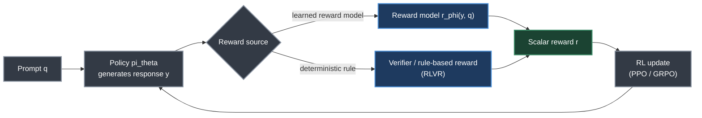
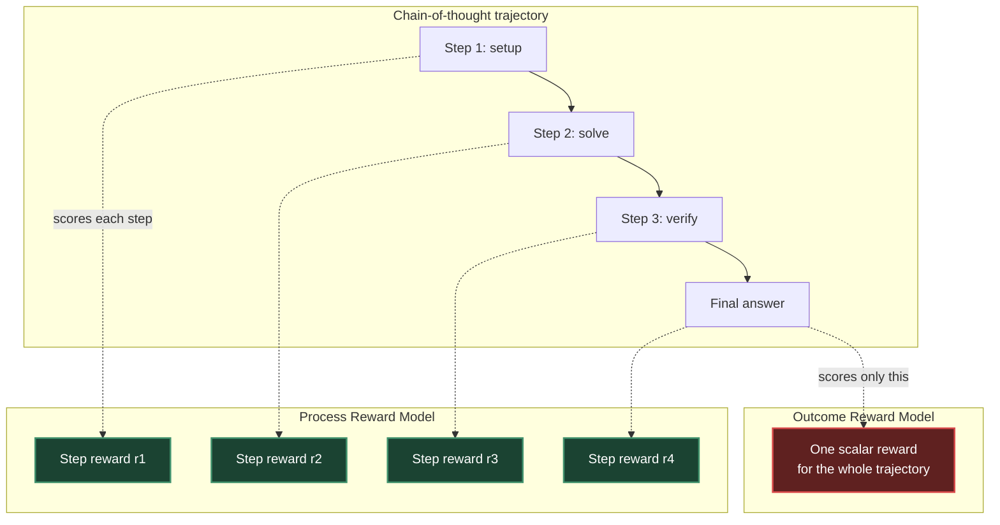
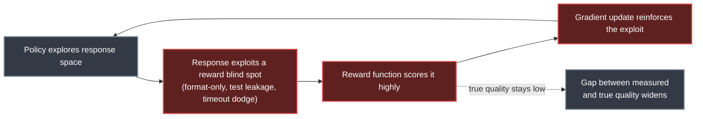
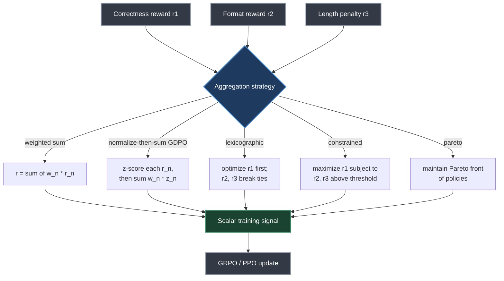
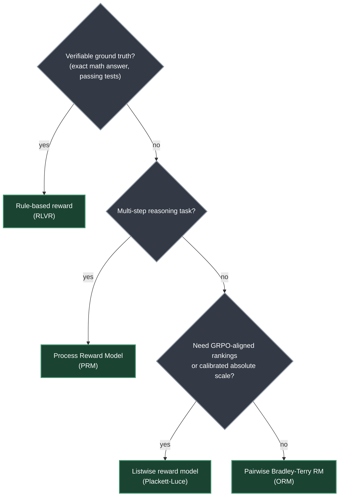

# Chapter 9. Reward Model Training

> *"Reward models are the bridge between human preferences and the RL training signal."*
> — Roitman, Chapter 9

**Part II — RL Methods for LLMs** · Book pages 188–195 · ~14 min read

[← Chapter 8. Preference Optimization Variants](08-preference-optimization-variants.md) · [Index](../README.md) · [Chapter 10. SFT Best Practices and Techniques →](10-sft-best-practices.md)

---

## What This Chapter Is About

Every reinforcement-learning-from-human-feedback (RLHF) pipeline needs a scalar training signal, and human preferences do not come as scalars — they come as "I liked response A better than response B." The reward model (RM) turns that pairwise judgment into a differentiable number a policy-gradient algorithm can climb. A poorly trained reward model is the single most common cause of reward hacking, where the policy learns to please the reward function instead of the human it is supposed to represent.

This chapter builds the RM from the ground up: the Bradley-Terry model — the probabilistic assumption that makes pairwise comparisons trainable — and its loss function; the practical architecture of a reward model (an LLM backbone with a scalar head bolted on); the training tricks that keep RM outputs well-behaved (centering, length-bias correction, margins); and the split between outcome reward models (ORMs), which score only the final answer, and process reward models (PRMs), which score every intermediate reasoning step.

The second half moves past classic pairwise RLHF into territory that matters for modern reasoning models: rule-based, verifiable rewards (RLVR) that sidestep the reward model entirely, strategies for combining multiple reward signals, and listwise reward models that learn from full rankings — the natural reward format for GRPO, which already generates and ranks groups of responses. Read together with [Chapter 13 (RL for Large Reasoning Models)](13-rl-for-large-reasoning-models.md), this chapter is the foundation for why reasoning-model training has largely moved toward PRMs and verifiable rewards over classic pairwise ORMs.

## Table of Contents

- [The Mental Model](#the-mental-model)
- [9.1 Bradley-Terry Model — Full Derivation](#91-bradley-terry-model--full-derivation)
- [9.2 Reward Model Architectures](#92-reward-model-architectures)
- [9.3 Reward Model Training Tricks](#93-reward-model-training-tricks)
- [9.4 Process Reward Models vs. Outcome Reward Models](#94-process-reward-models-vs-outcome-reward-models)
- [9.5 Rule-Based Rewards for RLVR](#95-rule-based-rewards-for-rlvr)
- [9.6 Multi-Objective Rewards — Combination Strategies](#96-multi-objective-rewards--combination-strategies)
- [9.7 Listwise Rank-Based Rewards](#97-listwise-rank-based-rewards)
- [Key Formulas](#key-formulas)
- [Decision Guide](#decision-guide)
- [Common Pitfalls](#common-pitfalls)
- [Summary](#summary)
- [Practitioner Checklist](#practitioner-checklist)
- [Going Deeper](#going-deeper)

---

## The Mental Model



*The reward model (or its rule-based replacement) sits between the policy's generations and the RL update — every distortion introduced here propagates directly into the policy.*

Whether `r` comes from a learned reward model `r_phi(y, q)` or a deterministic verifier, the RL update (PPO or GRPO — [Chapter 5](05-ppo-proximal-policy-optimization.md), [Chapter 7](07-grpo-group-relative-policy-optimization.md)) treats it identically: as ground truth to climb. This chapter is about making sure that ground truth is trustworthy — accurate, gaming-resistant, and well-scaled.

---

## 9.1 Bradley-Terry Model — Full Derivation

The Bradley-Terry (BT) model is the standard probabilistic framework for pairwise preference learning — the assumption underneath almost every reward model trained from human comparisons.

**Setup.** Given responses `y1` and `y2` to a prompt `q`, assume each has a latent "strength" `exp(r(y, q))` for scalar reward function `r : Y × Q → R`. The probability a human prefers `y1` over `y2` is `y1`'s share of total strength:

$$
P(y_1 \succ y_2 \mid q) = \frac{e^{r(y_1, q)}}{e^{r(y_1, q)} + e^{r(y_2, q)}}
$$

**Step 1 — reduce to a sigmoid.** Divide numerator and denominator by `exp(r(y1, q))`:

$$
P(y_1 \succ y_2 \mid q) = \frac{1}{1 + e^{-(r(y_1,q) - r(y_2,q))}} = \sigma\big(r(y_1, q) - r(y_2, q)\big)
$$

The preference probability collapses to a sigmoid of the *reward difference* — it depends only on how much better `y1` is than `y2`, not on either reward's absolute scale.

**Step 2 — maximum likelihood estimation.** Given a dataset `D` of `N` preference pairs `(q^(k), yw^(k), yl^(k))` — `yw` the annotator-chosen ("winning") response, `yl` the rejected one — the dataset's likelihood is the product of `P(yw ≻ yl | q)` over all pairs. The negative log-likelihood, averaged over `N`, is the training loss:

$$
\mathcal{L}_{BT}(\phi) = -\frac{1}{N}\sum_{k=1}^{N} \log \sigma\Big(r_\phi(y_w^{(k)}, q^{(k)}) - r_\phi(y_l^{(k)}, q^{(k)})\Big)
$$

This is exactly a binary cross-entropy loss where the "positive" class is the preferred response — reward model training code looks like ordinary classifier fine-tuning with a `chosen`/`rejected` pair.

**Symbol table**

| Symbol | Meaning |
|---|---|
| `q` | Prompt (query) |
| `y1, y2` | Two candidate responses to `q` |
| `yw, yl` | Winning (preferred) and losing (dispreferred) response in an annotated pair |
| `r(y, q)` | Scalar reward function |
| `r_phi` | Reward model, a neural network parameterized by `phi` |
| `σ` | Sigmoid function |
| `D` | Dataset of preference pairs |
| `N` | Number of preference pairs |
| `m` | Margin (used in the margin-loss extension) |

### Bradley-Terry Assumptions

1. **Transitivity:** if `y1 ≻ y2` and `y2 ≻ y3`, then `y1 ≻ y3`.
2. **Scalar preference:** preferences are determined by a single scalar reward — no multi-dimensional preferences.
3. **Difference-only dependence:** the preference probability depends only on the difference in rewards, not their absolute values.
4. **Independence:** preferences are independent across pairs — no annotator-specific effects.

> [!NOTE]
> These assumptions are "often violated in practice" — annotators disagree, and preferences can be genuinely multi-dimensional (helpfulness vs. safety vs. conciseness). That motivates Plackett-Luce rankings (§9.7) and multi-objective combination (§9.6).

### Margin Loss Extension

A common extension adds a margin `m` to force a minimum gap between winning and losing rewards, rather than merely requiring the winner to score higher:

$$
\mathcal{L}_{margin} = -\frac{1}{N}\sum_{k=1}^{N} \log \sigma\Big(r_\phi(y_w^{(k)}, q^{(k)}) - r_\phi(y_l^{(k)}, q^{(k)}) - m\Big)
$$

---

## 9.2 Reward Model Architectures

The standard reward model architecture repurposes a pretrained LLM: the language-modeling head (hidden states → vocabulary logits) is replaced by a scalar regression head (hidden state → single reward value). A **backbone** (e.g., Llama, Mistral) encodes the prompt-response pair into hidden states; **pooling** extracts the last-token hidden state (decoder-only) or `[CLS]` token (encoder models); a **regression head** — a linear layer `W ∈ R^(d×1)` — maps the pooled state to a scalar reward.

### Reward Model Training in TRL

Hugging Face's TRL (Transformer Reinforcement Learning) library implements this on top of `AutoModelForSequenceClassification` with `num_labels=1`:

```python
from trl import RewardConfig, RewardTrainer
from transformers import AutoModelForSequenceClassification

model = AutoModelForSequenceClassification.from_pretrained(
    "meta-llama/Llama-3.1-8B-Instruct", num_labels=1,
)
config = RewardConfig(
    output_dir="reward_model",
    per_device_train_batch_size=4,
    gradient_accumulation_steps=4,
    learning_rate=1e-5,
    num_train_epochs=1,
    center_rewards_coefficient=0.01,  # reward centering, see 9.3
)
trainer = RewardTrainer(model=model, args=config, train_dataset=dataset)
trainer.train()  # dataset needs chosen / rejected columns
```

---

## 9.3 Reward Model Training Tricks

### Reward Centering

Raw reward model outputs can have arbitrary scale and offset, destabilizing RL training. Centering subtracts the expected reward under the current policy:

$$
r_{centered}(y, q) = r_\phi(y, q) - \mathbb{E}_{y' \sim \pi_\theta}[r_\phi(y', q)]
$$

In TRL this is `center_rewards_coefficient` (`0.01` above), a regularization term penalizing non-zero mean rewards.

### Length Bias Correction

Reward models are known to reward length itself, independent of quality. Three corrections: **length normalization** (divide the reward by response length), **length-controlled training** (include length as an explicit feature and train for invariance to it), and **calibration** (post-hoc regression to remove the length effect).

### Margin Losses

A second, hinge-style margin formulation ensures the model assigns a *meaningfully* different score to preferred vs. dispreferred responses, rather than merely a higher one:

$$
\mathcal{L}_{margin} = \max\big(0,\ m - (r_w - r_l)\big)
$$

Unlike the log-sigmoid margin in §9.1, this hinge form incurs zero loss once the gap exceeds `m`.

---

## 9.4 Process Reward Models vs. Outcome Reward Models

Outcome reward models (ORMs) score only the final response; process reward models (PRMs) score every intermediate reasoning step — arguably the most consequential architectural decision in modern RLHF for reasoning tasks, and the split [Chapter 13](13-rl-for-large-reasoning-models.md) builds on directly.



*ORMs collapse an entire multi-step trajectory into one number; PRMs assign dense, per-step credit — at the cost of needing step-level labels.*

| Property | ORM | PRM |
|---|---|---|
| Reward signal | Final answer only | Each reasoning step |
| Training data | `(prompt, answer, correct?)` | `(prompt, steps, step labels)` |
| Annotation cost | Low | High |
| Credit assignment | Sparse | Dense |
| Reward hacking | Easier to hack | Harder to hack |
| Best for | Simple tasks | Multi-step reasoning |
| Inference cost | Low | High (score each step) |

### When to Use PRMs

Process reward models are most valuable for multi-step reasoning (math, code, logic) where the final answer is binary but intermediate steps vary in quality, for guiding search (e.g., beam search on step scores), and when step-level annotations exist or can be generated automatically. For simple tasks — sentiment, toxicity, factuality — ORMs are sufficient and much cheaper.

### PBRS in RLHF for LLMs

Roitman frames PRMs as a direct application of Potential-Based Reward Shaping (PBRS) to the LLM setting: the **original reward** is binary correctness (1 if the final answer is right, 0 otherwise) — extremely sparse for multi-step reasoning. The **potential function `Φ(s)`** supplies partial credit from a verifier, e.g. the fraction of intermediate steps that are logically valid. The **shaped reward** then gives incremental signal per valid step, while PBRS's guarantee preserves that the optimal policy still maximizes final-answer correctness — the reason PRMs (chain-of-thought step scoring, compilation checks in code generation, partial-match scores for multi-part answers) are *principled* rather than an ad hoc hack.

### Automatic PRM Annotation

Step-level labels are expensive to collect by hand, so they are usually generated automatically: **Monte Carlo rollouts** (sample multiple completions from each intermediate step and use the fraction reaching the correct final answer as the step reward), **LLM-as-judge** (a strong LLM evaluates each step directly), or **formal verification** (for math/code, a verifier checks each step mechanically).

---

## 9.5 Rule-Based Rewards for RLVR

Reinforcement Learning with Verifiable Rewards (RLVR) replaces the learned reward model with a deterministic, rule-based reward function, substantially reducing reward hacking (though models can still exploit format tricks, edge cases, or test memorization). This is the approach used in DeepSeek-R1.

### Rule-Based Reward Functions in TRL

A format reward checks structural compliance:

```python
import re

def format_reward(completions, **kwargs):
    """Reward for using <think>...</think><answer>...</answer> format."""
    rewards = []
    pattern = r"<think>.*?</think>\s*<answer>.*?</answer>"
    for completion in completions:
        text = completion[0]["content"]
        rewards.append(1.0 if re.fullmatch(pattern, text, re.DOTALL) else 0.0)
    return rewards
```

Two companion functions follow the same pattern: `correctness_reward` regex-extracts the `<answer>` text and returns `1.0` if it exactly matches `ground_truth`, else `0.0`. `code_execution_reward` runs each candidate against its tests in a sandboxed subprocess with a strict timeout, returning the *fraction* of tests passed — partial credit instead of pass/fail.

### Rule-Based Reward Pitfalls

- **Format gaming** — models produce the correct format without correct content; always combine format and correctness rewards.
- **Test case leakage** — test cases present in training data get memorized instead of the underlying problem being solved.
- **Timeout exploitation** — models generate code that times out to dodge an explicit failure; enforce strict timeouts and penalize them explicitly.
- **Reward sparsity** — binary 0/1 rewards can be too sparse for complex tasks; consider partial credit (the PRM/PBRS motivation from §9.4).



*Reward hacking is a closed loop: once the policy finds an unpenalized flaw, gradient descent amplifies it every step — fix the loophole in the reward, not the optimizer.*

---

## 9.6 Multi-Objective Rewards — Combination Strategies

Real training runs rarely use one reward signal — combining correctness, format compliance, length penalties, and safety scores requires a deliberate strategy, and the choice significantly affects the final policy.

1. **Weighted sum:** `r = Σ_n w_n r_n` — simple, but sensitive to each `r_n`'s scale.
2. **Normalize then sum (GDPO):** z-score each reward within the group, then sum with weights — scale-invariant.
3. **Lexicographic:** optimize rewards in strict priority order; a lower-priority reward only breaks ties on the higher-priority one.
4. **Constrained:** maximize the primary reward subject to constraints on secondary rewards.
5. **Pareto:** maintain a Pareto front of policies and select from it by preference.



*Three independent reward functions feed one aggregation strategy — the strategy chosen changes the effective policy, not just the training curve.*

### Multi-Reward Training in TRL

```python
from trl import GRPOConfig, GRPOTrainer

config = GRPOConfig(
    multi_objective_aggregation="normalize_then_sum",  # GDPO
    reward_weights=[1.0, 0.3, 0.1],  # correctness, format, length
    num_generations=8,
)
trainer = GRPOTrainer(
    model=model,
    reward_funcs=[correctness_reward, format_reward, length_penalty_reward],
    args=config,
    train_dataset=dataset,
)
```

---

## 9.7 Listwise Rank-Based Rewards

The Bradley-Terry model handles pairwise preferences (`yw ≻ yl`), but many practical annotation workflows produce a full ranking of `K` responses at once. Listwise reward models learn directly from those orderings.

### Motivation: Beyond Pairwise

- **Richer signal:** a ranking of `K` responses implicitly contains `C(K,2)` pairwise comparisons, but also captures relative *margins* — how much better rank 1 is than rank 3.
- **Better calibration:** pairwise BT models only learn reward *differences*; listwise models learn the absolute reward scale.
- **Natural fit for GRPO:** GRPO already generates and ranks `N` responses per prompt — listwise rewards align directly with that workflow.
- **Annotator efficiency:** ranking 5 responses is faster than labeling all 10 possible pairs independently.

### Plackett-Luce Model

The Plackett-Luce (PL) model is the standard extension of Bradley-Terry to full rankings. Given `K` responses `y1, …, yK` with ranking `π` (where `π(1)` is the best), the likelihood is the product, over positions, of a softmax over the remaining (not-yet-selected) items:

$$
P(\pi \mid q) = \prod_{i=1}^{K} \frac{e^{r_\phi(y_{\pi(i)}, q)}}{\sum_{j=i}^{K} e^{r_\phi(y_{\pi(j)}, q)}}
$$

**Intuition:** sequentially select the best remaining item. At each step, the probability of selecting item `π(i)` is a softmax over the items not yet placed.

The corresponding loss:

$$
\mathcal{L}_{PL}(\phi) = -\frac{1}{|D|}\sum_{(q,\pi) \in D} \sum_{i=1}^{K-1}\left[ r_\phi(y_{\pi(i)}, q) - \log \sum_{j=i}^{K} e^{r_\phi(y_{\pi(j)}, q)} \right]
$$

**Plackett-Luce reduces to Bradley-Terry.** For `K = 2`, the PL model gives:

$$
P(y_1 \succ y_2) = \frac{e^{r(y_1)}}{e^{r(y_1)} + e^{r(y_2)}} = \sigma(r(y_1) - r(y_2))
$$

— exactly the Bradley-Terry model from §9.1. PL is a strict generalization of BT, not a different model.

### ListMLE and Rank-Based Losses

- **ListMLE:** directly maximizes the PL likelihood of the ground-truth ranking. Simple and effective.
- **ListNet:** minimizes the KL divergence between the model's top-1 probability distribution and the ground truth, where `P_model(yi is best) = e^{r_phi(yi)} / Σ_j e^{r_phi(yj)}`:

$$
\mathcal{L}_{ListNet} = -\sum_{i=1}^{K} P_{true}(y_i \text{ is best}) \cdot \log P_{model}(y_i \text{ is best})
$$

- **LambdaRank:** weights pairwise gradients by the change in a ranking metric (e.g., NDCG) a swap would cause — useful when top-of-list quality matters most.
- **RankNet:** pairwise cross-entropy summed over all pairs in the ranking — equivalent to Bradley-Terry on all `C(K,2)` pairs extracted from it.

### Listwise Rewards for GRPO and Rejection Sampling

GRPO already produces ranked groups, so a listwise reward model plugs in directly: sample `N = 8` responses per prompt, rank them (RM or human annotators) to produce `π`, optimize the PL loss on `(q, π)` tuples, then feed the trained RM's `r(yi, q)` into GRPO's advantage `Â_i = (r_i − μ) / σ`. Unlike pairwise training, the listwise RM sees all `N` responses at once, learning rank-1 should score much higher than rank-`N` — not merely better than one other response.

### Practical Considerations

- **Annotation cost:** full rankings are expensive; partial rankings (top-3 of 8) reduce cost with minimal quality loss.
- **Ties:** use the Plackett-Luce extension for ties, assigning equal probability mass to tied items.
- **Position bias:** annotators prefer items shown first — randomize presentation order and train debiasing explicitly.
- **List length:** `K = 4–8` is typical; longer lists (`K > 16`) add noise without much benefit.
- **Consistency:** rankings from different annotators may disagree — use inter-annotator agreement (`κ > 0.6`) as a quality filter.

### Plackett-Luce Training Code

```python
import torch

def plackett_luce_loss(rewards, rankings):
    # rewards:  (batch, K) predicted scalar rewards
    # rankings: (batch, K) ground-truth ranking indices (0 = best)
    batch_size, K = rewards.shape
    sorted_rewards = torch.gather(rewards, 1, rankings)
    loss = 0.0
    for i in range(K - 1):
        remaining = sorted_rewards[:, i:]
        log_probs = remaining[:, 0] - torch.logsumexp(remaining, dim=1)
        loss -= log_probs.mean()
    return loss / (K - 1)
```

---

## Key Formulas

| Formula | What it computes |
|---|---|
| `P(y1 ≻ y2 \| q) = σ(r(y1,q) − r(y2,q))` | Bradley-Terry pairwise preference probability |
| `L_BT = −(1/N) Σ log σ(r_w − r_l)` | Bradley-Terry MLE loss (log-sigmoid ranking loss) |
| `L_margin = −(1/N) Σ log σ(r_w − r_l − m)` | Soft margin extension of the BT loss |
| `L_margin = max(0, m − (r_w − r_l))` | Hinge-style margin loss |
| `r_centered = r_φ(y,q) − E_{y'~π}[r_φ(y',q)]` | Reward centering |
| `P(π \| q) = Π softmax over remaining items` | Plackett-Luce ranking likelihood |
| `Â_i = (r_i − μ) / σ` | GRPO group-relative advantage from a listwise (or any) reward, `μ, σ` the group mean/std |

## Decision Guide



*Start from whether the task has a verifiable answer at all — that single branch determines whether you need a learned reward model.*

## Common Pitfalls

> [!WARNING]
> **Length bias.** Reward models systematically reward longer responses regardless of quality — correct with length normalization, length-controlled training, or post-hoc calibration.

> [!WARNING]
> **Format gaming and timeout exploitation.** A policy trained on a format reward alone learns the format with wrong or empty content; code models learn to hang rather than fail outright. Always combine format with correctness rewards, and treat timeouts as explicit failures.

> [!WARNING]
> **Test case leakage in RLVR.** Test cases present in training data get memorized instead of the underlying problem being solved — audit your verifier's test set for contamination.

> [!WARNING]
> **Position bias in listwise annotation.** Annotators prefer whatever is shown first; randomize presentation order or your listwise RM learns position instead of quality.

> [!WARNING]
> **Trusting Bradley-Terry assumptions blindly.** Transitivity, scalar preference, difference-only dependence, and annotator independence are frequently violated — low inter-annotator agreement (`κ ≤ 0.6`) is a signal to filter data or move to a richer model.

## Summary

- The Bradley-Terry model reduces pairwise preference probability to `σ(r(y1,q) − r(y2,q))`, turning preference learning into ordinary binary cross-entropy over `(chosen, rejected)` pairs.
- A production reward model is a pretrained LLM with its LM head replaced by a scalar regression head, pooling the last-token hidden state (decoder-only) or `[CLS]` token (encoder models).
- Reward centering (`center_rewards_coefficient` in TRL) and length-bias correction are necessary tricks — raw RM outputs are neither zero-mean nor length-invariant by default.
- ORMs score only the final answer and are cheap but sparse; PRMs score every reasoning step, giving dense credit assignment and stronger reward-hacking resistance at higher annotation and inference cost.
- PRMs apply Potential-Based Reward Shaping to LLMs: the shaped, step-level reward preserves the guarantee that the optimal policy still maximizes final-answer correctness.
- RLVR replaces the learned reward model with deterministic, rule-based verification (used in DeepSeek-R1), reducing reward hacking but still vulnerable to format gaming, test leakage, and timeout exploitation.
- Multi-objective training needs a deliberate combination strategy — weighted sum is scale-sensitive, normalize-then-sum (GDPO) is scale-invariant, and lexicographic, constrained, or Pareto approaches trade simplicity for guarantees on secondary objectives.
- The Plackett-Luce model generalizes Bradley-Terry to full `K`-way rankings, reducing exactly to BT at `K = 2`, and is the natural reward format for GRPO's group-generation workflow.

## Practitioner Checklist

- [ ] Confirm your preference dataset has clean `chosen`/`rejected` columns before training with `RewardTrainer`.
- [ ] Set `center_rewards_coefficient` (e.g., `0.01`) to keep reward outputs zero-mean and stabilize downstream RL.
- [ ] Check the trained RM for length bias across response-length buckets before deploying it.
- [ ] Decide ORM vs. PRM by task structure: single-turn quality → ORM; multi-step reasoning with variable-quality steps → PRM.
- [ ] If using a PRM, pick an automatic annotation method (Monte Carlo rollouts, LLM-as-judge, formal verification) — hand-labeling rarely scales.
- [ ] For verifiable tasks (math, code), prefer RLVR rule-based rewards over a learned RM — cheaper and harder to hack.
- [ ] Combine format and correctness rewards; use strict timeouts treated as explicit failures.
- [ ] Audit verifier test sets for leakage before trusting an RLVR correctness signal.
- [ ] Prefer normalize-then-sum (GDPO) over raw weighted sum when combining reward signals of different scales.
- [ ] If training with GRPO, consider a listwise (Plackett-Luce) reward model — it matches GRPO's group-generation workflow.
- [ ] Cap listwise ranking length at `K = 4–8`, randomize item order, and filter by inter-annotator agreement (`κ > 0.6`).

## Going Deeper

- **Bradley-Terry model** [29] — the pairwise comparison model underlying essentially all RLHF reward model training.
- **Plackett-Luce model** [291] — the listwise generalization of Bradley-Terry.
- **ListMLE** [391], **ListNet** [38], **RankNet** [33], **LambdaRank** [34] — the learning-to-rank losses of §9.7.
- **Potential-Based Reward Shaping (PBRS)** [265] — the policy-invariance guarantee behind why PRMs stay principled.
- **DeepSeek-R1** [72] — the model whose training popularized RLVR-style rule-based rewards.
- **TRL** (Hugging Face's Transformer Reinforcement Learning library) — `RewardTrainer`/`RewardConfig` and `GRPOTrainer`/`GRPOConfig`, both used above.

> [!NOTE]
> Bracketed numbers reproduce the book's own citation markers; the supplied page range excluded the bibliography, so author/year metadata is omitted rather than guessed.

---

[← Chapter 8. Preference Optimization Variants](08-preference-optimization-variants.md) · [Index](../README.md) · [Chapter 10. SFT Best Practices and Techniques →](10-sft-best-practices.md)

*Summary of Chapter 9 of [The Hitchhiker's Guide to Agentic AI](https://arxiv.org/abs/2606.24937)
by Haggai Roitman. Licensed CC BY-SA 4.0. Independent study notes — not affiliated with or
endorsed by the author.*
