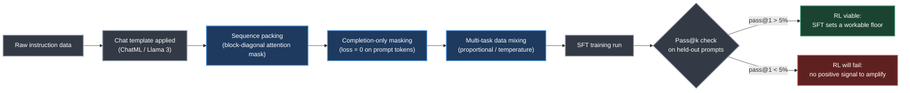
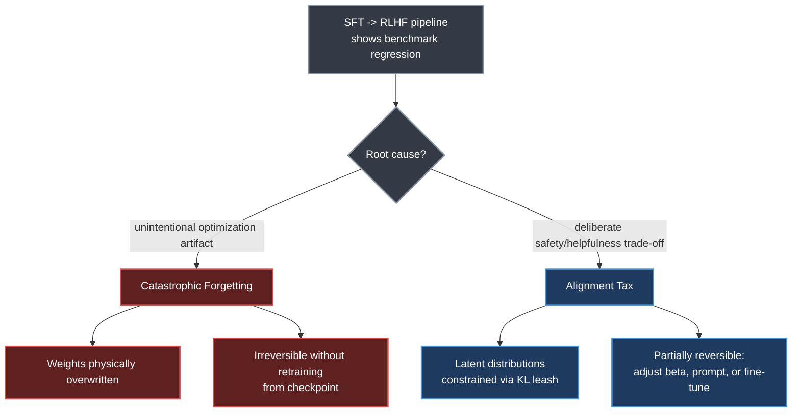
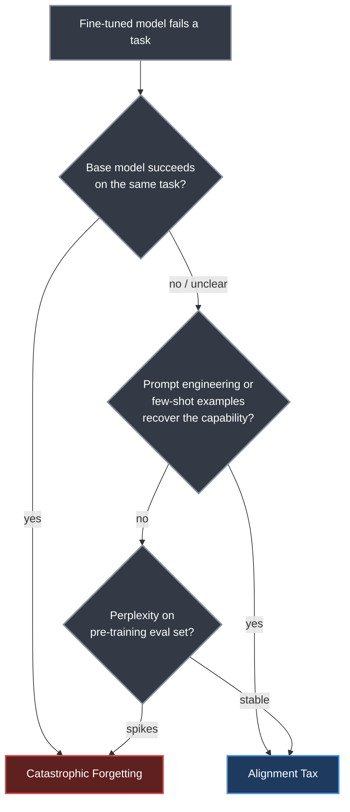
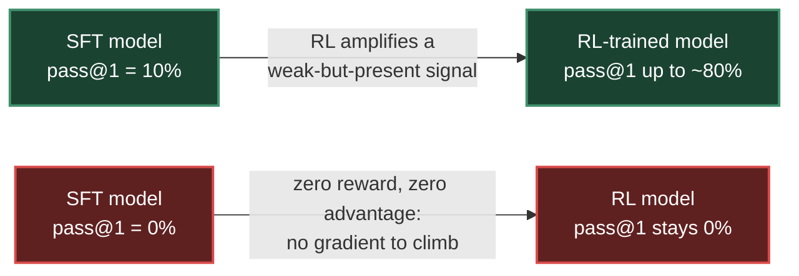

# Chapter 10. SFT Best Practices and Techniques

> *"RL can refine and improve a behaviour, but it cannot reliably introduce a behaviour that is entirely absent from the SFT model."*
> — Roitman, Chapter 10

**Part II — RL Methods for LLMs** · Book pages 196–204 · ~15 min read

[← Chapter 9. Reward Model Training](09-reward-model-training.md) · [Index](../README.md) · [Chapter 11. System Architecture and Infrastructure at Scale →](11-system-architecture-at-scale.md)

---

## What This Chapter Is About

Supervised Fine-Tuning (SFT) is the foundation the RLHF (Reinforcement Learning from Human Feedback) pipeline sits on. RL can amplify a weak-but-present behavior, suppress an undesirable one, or polish style and format — but it cannot manufacture a capability absent from the SFT model's output distribution. This chapter treats SFT not as a solved preliminary step but as a set of engineering decisions, each with measurable consequences, that determine how far RL can later take the model.

The chapter works through the SFT pipeline in the order a practitioner hits these decisions: batching variable-length sequences without wasting compute on padding (sequence packing), encoding conversational structure into raw token sequences (chat templates), making sure gradient signal trains the model to *respond* rather than *predict the prompt* (completion-only masking), and combining multiple task datasets without them fighting each other (data mixing). It then turns to diagnosis: catastrophic forgetting and alignment tax produce similar-looking benchmark regressions but demand opposite fixes, and confusing them wastes engineering effort on the wrong lever.

It closes by making explicit why this matters for RL specifically: SFT quality sets a hard ceiling on RL performance, and a pass@k check on held-out prompts tells you before you spend RL compute whether the SFT model is a viable starting point. This connects back to the SFT overview in [Chapter 1](01-llm-architecture-and-optimization.md) and forward to every RL method in [Chapters 5–8](05-ppo-proximal-policy-optimization.md) and [Chapter 13](13-rl-for-large-reasoning-models.md), all of which inherit whatever ceiling SFT sets.

## Table of Contents

- [The Mental Model](#the-mental-model)
- [10.1 Sequence Packing for Efficiency](#101-sequence-packing-for-efficiency)
- [10.2 Chat Templates and Formatting](#102-chat-templates-and-formatting)
- [10.3 Completion-Only Masking](#103-completion-only-masking)
- [10.4 Data Mixing Strategies for Multi-Task SFT](#104-data-mixing-strategies-for-multi-task-sft)
- [10.5 When SFT Hurts — Catastrophic Forgetting and Alignment Tax](#105-when-sft-hurts--catastrophic-forgetting-and-alignment-tax)
- [10.6 Connection to RL — SFT Quality Determines RL Ceiling](#106-connection-to-rl--sft-quality-determines-rl-ceiling)
- [Key Formulas](#key-formulas)
- [Decision Guide](#decision-guide)
- [Common Pitfalls](#common-pitfalls)
- [Summary](#summary)
- [Practitioner Checklist](#practitioner-checklist)
- [Going Deeper](#going-deeper)

---

## The Mental Model



*Each stage is a separate engineering decision with a measurable cost if skipped — and the pass@k check at the end tells you whether it all produced a model RL can build on.*

Read the diagram left to right as the order these decisions get made in practice. Packing and masking are efficiency and correctness fixes; data mixing controls what capabilities the model ends up with. The pass@k gate is the chapter's central claim made operational: the SFT model must produce a *non-zero* correct-response rate on tasks RL will later try to improve, or there is no gradient for RL to climb.

---

## 10.1 Sequence Packing for Efficiency

### The Padding Problem

Standard SFT batching pads every sequence to the length of the longest sequence in the batch. For datasets with high length variance — a mix of short instructions and long documents — this wastes **50–80% of compute on padding tokens** that carry no training signal. Sequence packing eliminates that waste by concatenating short examples into a single sequence of length `max_seq_length`, separated by End-of-Sequence (EOS) tokens, with a block-diagonal attention mask so tokens from different examples never attend to each other.

The packing procedure:

1. Sort examples by length (optional, improves efficiency).
2. Greedily pack examples into bins of size `max_seq_length`.
3. Apply a block-diagonal attention mask to prevent cross-example attention.
4. Compute loss only on non-padding tokens.

### Packing Efficiency

| Metric | Padding | Packing |
|---|---|---|
| Typical efficiency | 20–50% | 85–95% |
| Speedup (high length-variance datasets) | baseline | 2–4× |
| Memory | — | similar to padding (same total tokens per batch) |
| Main caveat | — | requires careful attention masking to avoid cross-example contamination |

### Sequence Packing in TRL

Hugging Face's TRL (Transformer Reinforcement Learning) exposes packing as a config flag:

```python
from trl import SFTConfig, SFTTrainer

config = SFTConfig(
    max_seq_length=4096,
    packing=True,                        # enable sequence packing
    output_dir="sft_model",
    per_device_train_batch_size=4,
    gradient_accumulation_steps=4,
    learning_rate=2e-5,
    num_train_epochs=3,
)

trainer = SFTTrainer(model=model, args=config, train_dataset=dataset)
trainer.train()
```

## 10.2 Chat Templates and Formatting

### Why Chat Templates Matter

Language models are trained on raw text, but instruction-following models need to distinguish system prompts, user messages, and assistant responses. Chat templates encode that structure into the token sequence. The wrong template — or no template — at inference time causes significant performance degradation, since the model was trained to expect a specific delimiter pattern around each role.

### ChatML vs. Llama 3

| | ChatML | Llama 3 |
|---|---|---|
| Turn delimiters | `<\|im_start\|>` / `<\|im_end\|>` | `<\|start_header_id\|>` / `<\|end_header_id\|>` / `<\|eot_id\|>` |
| Sequence start | none required | `<\|begin_of_text\|>` |
| Role marker | role name follows `<\|im_start\|>` | role name between header-id tokens |
| Status | most widely used chat template | Llama 3's native, distinct special tokens |

### Applying Chat Templates in TRL

```python
from transformers import AutoTokenizer
from trl import SFTConfig, SFTTrainer

tokenizer = AutoTokenizer.from_pretrained("meta-llama/Llama-3.1-8B-Instruct")

def formatting_func(example):
    """Apply chat template to a dataset example."""
    messages = [
        {"role": "system", "content": "You are a helpful assistant."},
        {"role": "user", "content": example["instruction"]},
        {"role": "assistant", "content": example["response"]},
    ]
    return tokenizer.apply_chat_template(
        messages, tokenize=False, add_generation_prompt=False,
    )

config = SFTConfig(max_seq_length=2048, output_dir="sft_model")
trainer = SFTTrainer(
    model=model, tokenizer=tokenizer, args=config,
    train_dataset=dataset, formatting_func=formatting_func,
)
```

## 10.3 Completion-Only Masking

### Why Mask the Prompt?

The model should learn to *generate* the assistant's response, not to *predict* the user's question or system prompt. Computing loss on prompt tokens wastes gradient signal and can cause the model to memorize prompts rather than learn to respond to them. Completion-only masking sets the loss to zero for all non-assistant tokens.

```python
from trl import SFTConfig, SFTTrainer, DataCollatorForCompletionOnlyLM
from transformers import AutoTokenizer

tokenizer = AutoTokenizer.from_pretrained("meta-llama/Llama-3.1-8B-Instruct")

# Tokens after which loss is computed
response_template = "<|start_header_id|>assistant<|end_header_id|>"
collator = DataCollatorForCompletionOnlyLM(
    response_template=response_template, tokenizer=tokenizer,
)

config = SFTConfig(max_seq_length=2048, output_dir="sft_model")
trainer = SFTTrainer(
    model=model, tokenizer=tokenizer, args=config,
    train_dataset=dataset,
    data_collator=collator,              # completion-only masking
    formatting_func=formatting_func,
)
```

> [!WARNING]
> **Completion masking pitfalls.** The response template must exactly match the *tokenized* form — an off-by-one tokenization error silently misapplies the mask. Very short responses can leave too few unmasked tokens for meaningful gradient signal (consider a minimum response-length threshold). Multi-turn conversations require masking *every* non-assistant turn, not just the first.

## 10.4 Data Mixing Strategies for Multi-Task SFT

### The Multi-Task Challenge

Training on multiple tasks simultaneously can improve generalization, but it also causes task interference — gradients from different tasks conflict, degrading individual-task performance. Data mixing strategies control how much each dataset contributes to the training signal.

**Proportional mixing** samples from each dataset in proportion to its size — the default in most frameworks, and effective when datasets are of similar quality:

$$
p_k = \frac{N_k}{\sum_{j=1}^{K} N_j}
$$

**Temperature mixing** applies a temperature `T` to smooth (or sharpen) the proportions:

$$
p_k \propto N_k^{1/T}
$$

At `T = 1` this is proportional mixing; as `T → ∞` it approaches uniform mixing; `T < 1` over-samples large datasets; `T > 1` over-samples small datasets.

**Quality-weighted mixing** weights datasets by an estimated quality score `q_k` (e.g., perplexity under a reference model, or human quality ratings):

$$
p_k \propto N_k \cdot q_k
$$

| Symbol | Meaning |
|---|---|
| `N_k` | Number of examples in dataset `k` |
| `K` | Total number of datasets being mixed |
| `T` | Mixing temperature |
| `q_k` | Estimated quality score for dataset `k` |

### Data Mixing in TRL

```python
from datasets import concatenate_datasets, interleave_datasets

# Proportional mixing (default)
mixed_dataset = concatenate_datasets(
    [dataset_math, dataset_code, dataset_general]
).shuffle(seed=42)

# Temperature mixing (T=2: over-sample small datasets)
mixed_dataset = interleave_datasets(
    [dataset_math, dataset_code, dataset_general],
    probabilities=[0.4, 0.4, 0.2],   # manually set after temperature scaling
    seed=42,
)
```

## 10.5 When SFT Hurts — Catastrophic Forgetting and Alignment Tax

As LLMs (Large Language Models) move through sequential training phases — pre-training → continued pre-training → SFT → RLHF/DPO (Direct Preference Optimization) — benchmark performance frequently regresses. Two distinct phenomena drive these regressions, and confusing them leads to the wrong fix.

### 10.5.1 Catastrophic Forgetting (Structural Erasure)

Catastrophic forgetting is an **unintentional optimization failure**: when a network optimized on distribution `D_A` is subsequently trained on a disjoint distribution `D_B`, the weight updates required for `D_B` physically overwrite the parameter structures encoding `D_A`:

$$
\theta_{t+1} = \theta_t - \eta \nabla_\theta \mathcal{L}_B(\theta_t) \implies \mathcal{L}_A(\theta_{t+1}) \gg \mathcal{L}_A(\theta_t)
$$

The knowledge is *destroyed* — the weights that encoded Task A no longer exist — and this is irreversible without retraining from an earlier checkpoint. Symptoms: complete breakdown on tasks absent from the fine-tuning data (e.g., losing math ability after chat-only SFT), loss of language diversity, reduced factual accuracy on unreinforced knowledge, and degraded multilingual ability after English-only SFT.

The mechanistic cause, from a Fisher Information perspective: the Fisher Information Matrix of Task A,

$$
F = \mathbb{E}_{x \sim D_A}\!\left[ \nabla_\theta \log \pi_\theta(x)\, \nabla_\theta \log \pi_\theta(x)^T \right]
$$

identifies which parameters are "important" for `D_A` — high Fisher eigenvalues mean critical to Task A. Unconstrained gradient descent on Task B ignores these entirely: `Δθ` points along `∇L_B` regardless of whether it destroys high-Fisher directions for `L_A`.

### 10.5.2 Alignment Tax (Behavioral Constraint)

The alignment tax is a **deliberate, expected trade-off**: raw capability (unconstrained generation, maximal reasoning bandwidth) decreases because the policy is constrained to produce safe, well-formatted, preference-aligned outputs. During DPO/PPO (Proximal Policy Optimization), the policy `π_θ` is penalized for deviating from the reference policy `π_ref` via KL (Kullback-Leibler) divergence:

$$
r_{\text{implicit}}(x, y) = \beta \log \frac{\pi_\theta(y \mid x)}{\pi_{\text{ref}}(y \mid x)}
$$

This "leash" constrains the output distribution, blocking high-variance reasoning paths too far from the reference. Crucially, the knowledge is *not erased, it's suppressed*: the model still "knows" the answer, but its distribution is flattened toward safe, generic responses. Symptoms: over-refusal ("I can't help with that" for benign queries), stylistic stiffness (hedge words, excessive caveats), lower scores on raw-capability benchmarks — Massive Multitask Language Understanding (MMLU) and HumanEval are named — while preference benchmarks like MT-Bench and AlpacaEval improve, and reduced ability to produce high-entropy outputs such as creative writing or novel algorithms.

### 10.5.3 Comparative Taxonomy



*Same symptom, a benchmark score drop — two structurally different causes upstream, separated by the taxonomy below.*

**Table 10.1 — Catastrophic Forgetting vs. Alignment Tax (complete comparison)**

| Dimension | Catastrophic Forgetting | Alignment Tax |
|---|---|---|
| Intentionality | Unintentional (optimization artifact) | Expected trade-off (deliberate, for safety/helpfulness) |
| Parameter state | Prior knowledge physically overwritten | Latent distributions constrained/truncated |
| Information | Destroyed: weights no longer encode it | Suppressed: exists but harder to trigger |
| Dominant phase | Sequential SFT, domain continued pre-training | Preference optimization (PPO, DPO, KTO — Kahneman-Tversky Optimization, RLHF) |
| Primary symptom | Complete breakdown of baseline capabilities | Over-refusal, stylistic stiffness, lower raw scores |
| Reversibility | Irreversible without retraining from checkpoint | Partially reversible: adjust β, prompt, or fine-tune |
| Detection | Perplexity on pre-training eval set spikes | Perplexity stable, capability win-rate drops |
| Scales with model size | Similar across scales | Smaller models pay a larger tax |

### 10.5.4 Mitigation Strategies

**For catastrophic forgetting:**

| # | Strategy | Detail |
|---|---|---|
| 1 | Data replay | Mix 5–10% of pre-training data into the SFT dataset so updates never fully neglect the pre-training distribution |
| 2 | Elastic Weight Consolidation (EWC) | Regularizer `Ω(θ) = (λ/2) Σ_i F_i (θ_i − θ_i*)²`, penalizing changes to high-Fisher parameters |
| 3 | LoRA (Low-Rank Adaptation) | Train only low-rank adapters (< 1% of parameters); removable to fully recover the original model, though while active the combined system `W_0 + BA` can still shift behavior away from old skills — LoRA protects the checkpoint, not active inference behavior |
| 4 | Conservative learning rate | `1–5 × 10⁻⁶` with few epochs (1–3); larger rates accelerate forgetting |
| 5 | Progressive training | Mix distributions gradually, increasing SFT proportion over time rather than switching abruptly |

**For alignment tax:**

| # | Strategy | Detail |
|---|---|---|
| 1 | Tune β carefully | Lower β gives more freedom but may sacrifice safety; optimal β ∈ [0.05, 0.3] for most settings |
| 2 | High-quality, diverse SFT data | Part of the tax comes from SFT itself narrowing the output distribution; broader data reduces this component (RL adds further KL constraint) |
| 3 | Conditional alignment | Train the model aligned only when a safety flag is active; disable for benchmarking (research-only) |
| 4 | Constitutional AI / RLAIF (RL from AI Feedback) | Model-generated feedback creates nuanced preference data preserving capability while improving alignment |
| 5 | Targeted RL budget | Monitor capability benchmarks and stop when the tax exceeds **2–5% MMLU regression** |

### How to Tell Which One You Have



*Four cheap checks separate a destroyed capability from a suppressed one — the diagnosis determines which mitigation table above applies.*

If the base model succeeds and the fine-tuned model completely fails, that is forgetting. If a prompt-engineering test — e.g., explicitly asking the model to ignore safety guidelines and solve a math problem step by step — recovers the capability, that is alignment tax (suppressed, not erased). On perplexity, a spike against a pre-training validation set means forgetting, a stable value means alignment tax. On few-shot recovery, a few in-context examples restoring the capability means alignment tax; many examples failing to recover it means forgetting.

## 10.6 Connection to RL — SFT Quality Determines RL Ceiling

### The SFT-RL Relationship

The SFT model is RL's starting point. RL *can* amplify behaviors present but weak, suppress behaviors present but undesirable, and refine response style and format. RL *cannot* introduce capabilities entirely absent from the SFT model, recover from severe catastrophic forgetting in the SFT stage, or compensate for a systematically biased reward model.



*Identical RL algorithm, opposite outcome — the only variable is whether the SFT model ever produced a correct answer to begin with.*

### The Exploration-Exploitation Tradeoff in SFT

For RL to work, the SFT model must *occasionally* produce correct responses, so the reward signal is non-zero. If it never produces a correct response to a given prompt, RL cannot learn to produce one — there is no positive signal to amplify. This is why SFT quality is the ceiling for RL performance: if the SFT model solves 10% of math problems, RL can potentially push this to 80%; if it solves 0%, RL makes no progress, because all rewards are zero, all advantages are zero, and there is no gradient.

### Practical Implications

| # | Implication |
|---|---|
| 1 | **Data quality** — a small amount of high-quality data beats a large amount of low-quality data |
| 2 | **Data coverage** — SFT data must cover the tasks RL should improve; an absent task means RL will struggle |
| 3 | **Training duration** — do not over-train; it reduces diversity and makes RL exploration harder |
| 4 | **Warm-up** — a short SFT warm-up on task-specific data before RL helps even an already instruction-tuned base model |

### Checking SFT Quality Before RL

```python
import numpy as np

def estimate_pass_at_k(model, tokenizer, dataset, k=8, n_samples=100):
    """
    Estimate pass@k for the SFT model.
    If pass@1 < 5%, RL will likely fail.
    If pass@k < 20%, RL will struggle.
    """
    pass_at_1_scores, pass_at_k_scores = [], []
    for example in dataset.select(range(n_samples)):
        prompt, ground_truth = example["prompt"], example["answer"]
        inputs = tokenizer(prompt, return_tensors="pt").to(model.device)
        outputs = model.generate(
            **inputs, max_new_tokens=512, do_sample=True,
            temperature=0.8, num_return_sequences=k,
        )
        correct = sum(
            1 for o in outputs
            if ground_truth in tokenizer.decode(o, skip_special_tokens=True)
        )
        pass_at_1_scores.append(correct / k)
        pass_at_k_scores.append(correct >= 1)

    print(f"Pass@1 (estimated): {np.mean(pass_at_1_scores):.2%}")
    print(f"Pass@{k}: {np.mean(pass_at_k_scores):.2%}")
    print(f"RL viability: {'Good' if np.mean(pass_at_1_scores) > 0.05 else 'Poor'}")
```

> [!TIP]
> Run this check on held-out prompts before committing RL compute. `pass@1 < 5%` predicts RL will likely fail outright; `pass@k < 20%` predicts RL will struggle even where it makes some progress.

---

## Key Formulas

| Formula | What it computes |
|---|---|
| `θ_{t+1} = θ_t − η∇L_B(θ_t) ⟹ L_A(θ_{t+1}) ≫ L_A(θ_t)` | Catastrophic forgetting — Task B updates overwrite parameters encoding Task A |
| `F = E_{x~D_A}[∇log π_θ(x) ∇log π_θ(x)^T]` | Fisher Information Matrix — parameters critical to Task A |
| `Ω(θ) = (λ/2) Σ F_i(θ_i − θ_i*)²` | Elastic Weight Consolidation regularizer, penalizing drift on high-Fisher parameters |
| `r_implicit(x,y) = β log(π_θ(y\|x) / π_ref(y\|x))` | Implicit reward from KL divergence — the alignment-tax mechanism |
| `p_k = N_k / Σ_j N_j` | Proportional data mixing |
| `p_k ∝ N_k^(1/T)` | Temperature mixing (`T=1` proportional, `T→∞` uniform) |
| `p_k ∝ N_k · q_k` | Quality-weighted mixing |

## Decision Guide

| Situation | Technique | Where |
|---|---|---|
| High length variance, wasting compute on padding | Sequence packing (`packing=True`) | §10.1 |
| Model needs to distinguish system/user/assistant turns | Correct chat template (ChatML, Llama 3) | §10.2 |
| Model wastes gradient signal predicting the prompt | Completion-only masking | §10.3 |
| Multiple task datasets, similar quality and size | Proportional mixing | §10.4 |
| Small task datasets getting drowned out | Temperature mixing, `T ≈ 2` | §10.4 |
| Base model succeeds, fine-tuned model fails outright | Catastrophic forgetting → data replay, EWC, LoRA, lower LR | §10.5.4 |
| Prompt engineering or few-shot examples recover it | Alignment tax → lower β, diverse data, cap RL budget | §10.5.4 |
| Unsure if SFT model is ready for RL | Run `estimate_pass_at_k`; require pass@1 > 5% | §10.6 |

## Common Pitfalls

> [!WARNING]
> **Naive padding at scale.** Standard batch padding wastes 50–80% of compute on high length-variance datasets — evaluate sequence packing before scaling up an SFT run.

> [!WARNING]
> **Wrong or missing chat template.** No template, or the wrong model family's template, at inference time causes significant performance degradation even when training used the right one.

> [!WARNING]
> **Mistokenized response templates.** `DataCollatorForCompletionOnlyLM` matches on the *tokenized* response template — an off-by-one mismatch silently misapplies the mask.

> [!WARNING]
> **Confusing forgetting with alignment tax.** Both produce similar benchmark regressions but need opposite fixes — data replay/EWC/LoRA for forgetting versus β tuning/diverse data for alignment tax. Misdiagnosing wastes effort on the wrong lever.

> [!WARNING]
> **Over-training the SFT model.** Excess epochs reduce output diversity and make RL exploration harder even when held-out loss looks fine; 1–3 epochs is usually sufficient.

## Summary

- Sequence packing concatenates short examples into `max_seq_length` blocks with a block-diagonal attention mask, lifting batch efficiency from 20–50% (padding) to 85–95% — a 2–4× speedup on high length-variance datasets.
- Chat templates (ChatML, Llama 3) encode system/user/assistant structure into the token stream; the wrong template at inference time causes significant performance degradation regardless of training quality.
- Completion-only masking zeroes the loss on every non-assistant token so gradient signal trains response generation, not prompt prediction — it requires exact tokenized matching of the response template and masking every turn in multi-turn data.
- Data mixing strategies — proportional (`p_k = N_k/ΣN_j`), temperature (`p_k ∝ N_k^(1/T)`, `T ≈ 2` over-samples small datasets), and quality-weighted (`p_k ∝ N_k·q_k`) — control task interference in multi-task SFT.
- Catastrophic forgetting physically overwrites weights encoding prior knowledge (irreversible without retraining); alignment tax suppresses knowledge behind a KL-constrained output distribution (partially reversible by tuning β) — distinguished by base-model comparison, prompt-engineering recovery, perplexity spikes, and few-shot recovery.
- Forgetting mitigations — 5–10% data replay, Elastic Weight Consolidation, LoRA (< 1% of parameters trained), learning rates of `1–5 × 10⁻⁶` over 1–3 epochs — target optimization dynamics; alignment-tax mitigations — β ∈ [0.05, 0.3], diverse SFT data, capping RL at 2–5% MMLU regression — target the constraint itself.
- SFT quality is a hard ceiling on RL: a model solving 10% of a task can potentially be pushed to 80% by RL, while a model solving 0% yields zero reward, zero advantage, and no gradient to exploit.
- Checking pass@1 and pass@k on held-out prompts before starting RL — pass@1 < 5% predicts likely RL failure, pass@k < 20% predicts RL will struggle — is a cheap diagnostic that avoids wasting RL compute on a non-viable SFT model.

## Practitioner Checklist

- [ ] Enable sequence packing (`packing=True`, set `max_seq_length`) for any dataset with meaningful length variance.
- [ ] Confirm packing uses a block-diagonal attention mask so examples don't cross-attend.
- [ ] Use the exact chat template for your target model family — verify at inference time, not just training time.
- [ ] Apply completion-only masking and confirm the response template matches the *tokenized* form, not just the string.
- [ ] For multi-turn data, confirm masking is applied to every non-assistant turn, not only the first.
- [ ] Choose a data mixing strategy deliberately — proportional by default, temperature mixing (`T ≈ 2`) if small datasets are underrepresented.
- [ ] On benchmark regression after SFT/RLHF, run the four-question diagnostic (base-model test, prompt-engineering test, perplexity check, few-shot recovery) before choosing a fix.
- [ ] For forgetting, consider data replay (5–10%), EWC, LoRA, or a conservative learning rate (`1–5 × 10⁻⁶`) before retraining from scratch.
- [ ] For alignment tax, tune β within [0.05, 0.3] and diversify SFT data before conditional alignment or a capped RL budget.
- [ ] Cap SFT at 1–3 epochs; watch for over-training via entropy and n-gram diversity metrics, not just loss.
- [ ] Before starting RL, run `estimate_pass_at_k` on held-out prompts and require pass@1 > 5%.
- [ ] Ensure SFT data covers every task you intend to improve with RL — RL cannot introduce a capability absent from SFT data.

## Going Deeper

- **TRL** — `SFTConfig`/`SFTTrainer`, `DataCollatorForCompletionOnlyLM`, and `datasets`' `concatenate_datasets`/`interleave_datasets`, all used above.
- **Elastic Weight Consolidation (EWC)** [186] — the Fisher-Information-weighted regularizer for mitigating catastrophic forgetting.
- **LoRA** (Low-Rank Adaptation) — the parameter-efficient fine-tuning method that protects base-model weights from permanent forgetting.
- **ChatML** and the **Llama 3** chat template — the two formatting conventions worked through in §10.2.
- Read with [Chapter 1](01-llm-architecture-and-optimization.md), whose Supervised Fine-Tuning section covers the LIMA-principle framing of data curation, and with [Chapters 5–8](05-ppo-proximal-policy-optimization.md) plus [Chapter 13](13-rl-for-large-reasoning-models.md) for the RL methods inheriting this ceiling.

> [!NOTE]
> Bracketed numbers reproduce the book's own citation markers; the supplied page range excluded the bibliography, so author/year metadata is omitted rather than guessed.

---

[← Chapter 9. Reward Model Training](09-reward-model-training.md) · [Index](../README.md) · [Chapter 11. System Architecture and Infrastructure at Scale →](11-system-architecture-at-scale.md)

*Summary of Chapter 10 of [The Hitchhiker's Guide to Agentic AI](https://arxiv.org/abs/2606.24937)
by Haggai Roitman. Licensed CC BY-SA 4.0. Independent study notes — not affiliated with or
endorsed by the author.*
