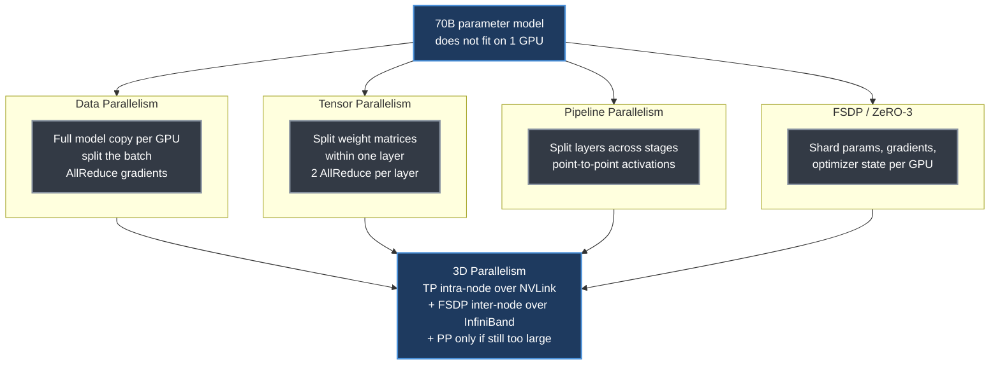
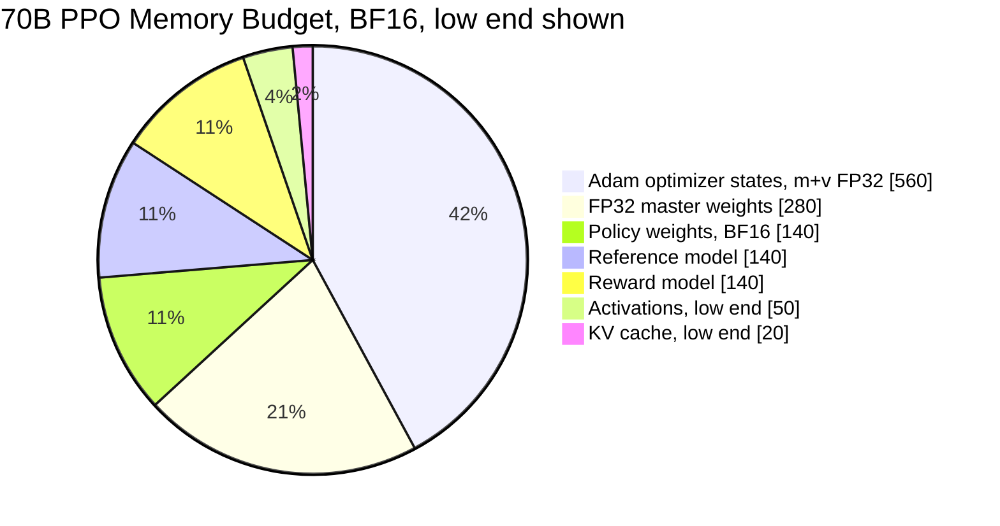
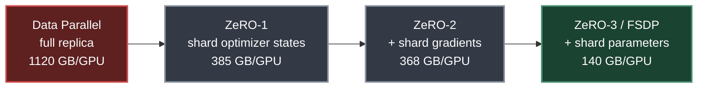
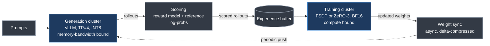
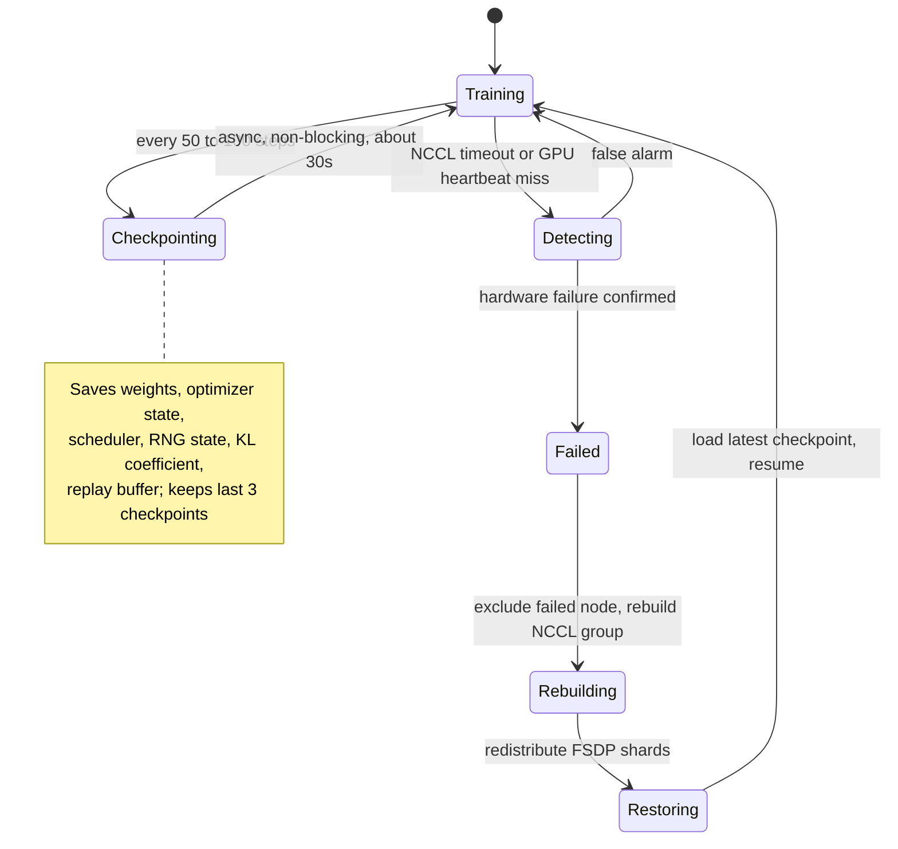
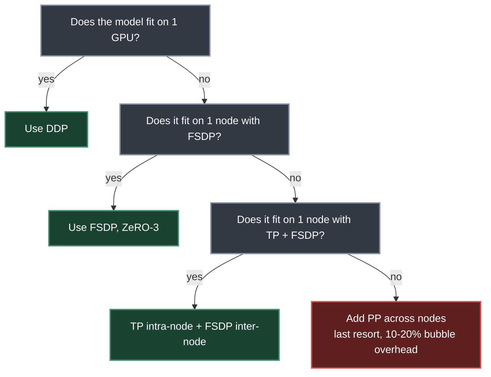

# Chapter 11. System Architecture and Infrastructure at Scale

> *"RLHF requires multiple models to be loaded simultaneously, coordinated through a complex rollout-scoring-training loop, and distributed across dozens to hundreds of GPUs — it is as much a systems engineering challenge as an algorithmic one."*
> — Roitman, Chapter 11

**Part II — RL Methods for LLMs** · Book pages 205–228 · ~25 min read

[← Chapter 10. SFT Best Practices and Techniques](10-sft-best-practices.md) · [Index](../README.md) · [Chapter 12. LLM Agentic Training →](12-llm-agentic-training.md)

---

## What This Chapter Is About

Supervised fine-tuning (SFT) is one model, one forward-backward pass, well-understood scaling. Reinforcement learning from human feedback (RLHF) is not: a single step needs a policy, a reference model, a reward model, and (for PPO) a critic loaded simultaneously, wired through a rollout → scoring → training loop, spread across dozens to hundreds of GPUs. A correct PPO or GRPO implementation still runs out of memory, saturates the network, or falls over on the first hardware failure without the systems layer underneath it.

This chapter builds that layer from the memory ledger up: how much GPU memory the four RLHF models cost, the parallelism strategies (data, tensor, sequence, pipeline, fully sharded data parallelism (FSDP) / Zero Redundancy Optimizer (ZeRO)) used to fit and train them, and why generation and training decouple into independently scaled clusters. It closes with the operational layer separating prototype from production — weight sync, fault tolerance, checkpointing, network topology, throughput, cost, RL-specific optimizer settings — plus two recent systems: Decoupled DiLoCo (Google DeepMind, cross-datacenter training) and Miles (PyTorch's disaggregated RL post-training stack).

## Table of Contents

- [The Mental Model](#the-mental-model)
- [11.1 The Four-Model Memory Challenge](#111-the-four-model-memory-challenge)
- [11.2 Parallelism Strategies in Detail](#112-parallelism-strategies-in-detail)
- [11.3 The Generation Bottleneck](#113-the-generation-bottleneck)
- [11.4 Decoupled Architecture for RLHF](#114-decoupled-architecture-for-rlhf)
- [11.5 Weight Synchronization Strategies](#115-weight-synchronization-strategies)
- [11.6 Memory Optimization Techniques](#116-memory-optimization-techniques)
- [11.7 Fault Tolerance at Scale](#117-fault-tolerance-at-scale)
- [11.8-11.9 Latency, Monitoring, and Network Topology](#118-119-latency-monitoring-and-network-topology)
- [11.11 Training Throughput and MFU](#1111-training-throughput-and-mfu)
- [11.12-11.14 Cost, Checkpointing, and Hardware Selection](#1112-1114-cost-checkpointing-and-hardware-selection)
- [11.15 Optimizer Configuration for RL Training](#1115-optimizer-configuration-for-rl-training)
- [Key Formulas](#key-formulas)
- [Decision Guide](#decision-guide)
- [Common Pitfalls](#common-pitfalls)
- [Summary](#summary)
- [Practitioner Checklist](#practitioner-checklist)
- [Going Deeper](#going-deeper)

---

## The Mental Model



*Four independent axes for splitting a model across GPUs, composed into "3D parallelism" for production-scale training.*

Each axis solves a different bottleneck: DP buys throughput with no memory savings; TP shrinks per-GPU weight memory at the cost of an AllReduce inside every layer, so it stays inside one NVLink node; PP shrinks weight memory further but adds idle "bubble" time; FSDP/ZeRO-3 shards everything and reconstructs full tensors on demand. Production 70B+ systems combine two or three simultaneously — TP=8 intra-node plus FSDP across 8 nodes for a 64-GPU job, adding PP only above ~100B.

## 11.1 The Four-Model Memory Challenge

RLHF loads four models at once: the policy, its FP32 optimizer state, a frozen reference model (for the KL penalty), and a reward model. The book's worked example, 70B in BF16:

| Component | Memory | Notes |
|---|---|---|
| Policy weights (BF16) | 140 GB | 2 bytes/param |
| FP32 master weights | 280 GB | 4 bytes/param, for accumulation |
| Adam optimizer (m + v, FP32) | 560 GB | 2 × 4 bytes/param |
| Gradients (BF16) | 140 GB | 2 bytes/param |
| Reference model | 140 GB | or 70 GB in INT8 |
| Reward model | 140 GB | or 70 GB in INT8 |
| Activations (batch 128, seq 2048) | 50–100 GB | depends on checkpointing |
| KV cache for generation | 20–60 GB | depends on batch/seq |
| **Total** | **1470–1560 GB** | ÷ 80 GB/GPU = 19–20 A100s minimum, no parallelism overhead |



*Memory shares at the low end of the range (1330 of the stated 1470–1560 GB); the optimizer state alone is larger than the policy, reference, and reward models combined.*

The optimizer state and master weights alone (840 GB) dwarf the 140 GB policy — why ZeRO/FSDP sharding targets optimizer state first. Unsharded, this needs 19–20 A100-80GB GPUs just to hold the numbers; with ZeRO-3 it fits in roughly 8 nodes.

## 11.2 Parallelism Strategies in Detail

### Data Parallelism (DP) and DDP

Each GPU holds a full model replica, processes a different mini-batch, and synchronizes gradients. Legacy PyTorch `DataParallel` funnels every gradient through GPU 0 in a single process — GIL-limited, 2–3× slower than the distributed version even on one node, unable to scale past one machine. `DistributedDataParallel` (DDP) runs one process per GPU, averaging gradients with ring-AllReduce overlapped with backward computation, bucketing parameters (25 MB default) so communication starts before backward finishes.

Cost: each GPU stores the full model + optimizer + gradients (~560 GB/GPU for 70B, impossible unsharded), one AllReduce of 2× model-parameter-bytes per step, near-linear scaling only to ~64 GPUs.

> [!IMPORTANT]
> Never use legacy `DataParallel`. Use DDP as the floor; above 7B, prefer FSDP/ZeRO.

### Tensor Parallelism (TP)

Megatron-LM-style TP splits individual weight matrices across `T` GPUs. A column-parallel layer splits the weight column-wise so each GPU computes its slice with **no communication**; a row-parallel layer splits row-wise and needs an AllReduce to sum results. A Transformer block pairs the two: MLP goes column-then-row-parallel (one AllReduce), attention's Q/K/V is column-parallel and the output projection row-parallel (one AllReduce) — **2 AllReduce per layer**.

For 70B (80 layers): 160 AllReduce ops per forward pass, 320 with backward. At NVLink (600 GB/s) each takes <0.5 ms; over InfiniBand (50 GB/s), ~4 ms — 640 ms total, longer than the compute itself. So **TP degree is capped at GPUs-per-node** (typically ≤8).

| TP degree | Use case | Overhead |
|---|---|---|
| TP=1 | Fits on 1 GPU (≤13B BF16) | — |
| TP=2 | 13–34B inference, 2 GPUs | <5% |
| TP=4 | Standard for 34–70B inference | 8–12% |
| TP=8 | Full node, required for 70B+ training | 12–18% |
| TP>8 | Cross-node, only 200B+ models | 30–50% |

Attention head count must divide evenly by TP degree — LLaMA-70B's 64 heads support TP ∈ {1, 2, 4, 8, 16, 32, 64}.

### Sequence Parallelism (SP)

TP shards weight memory, but LayerNorm and Dropout run on the full hidden dimension, replicated on every GPU — activations cost `b × s × d` regardless of TP degree. SP splits the *sequence* dimension for these communication-free ops, gathering the full sequence only where attention or linear layers need it. TP's AllReduce equals ReduceScatter + AllGather; SP just reorders these so LayerNorm runs on a `1/T` slice — **communication volume is unchanged**, a pure memory win, always worth enabling alongside TP. At TP=8, batch=4, seq=2048, the savings are ~59 GB per GPU.

### Pipeline Parallelism (PP)

PP splits the model vertically by layer, assigning layer groups to stages; activations flow forward, gradients flow back. Naive execution with one micro-batch leaves stages idle 75% of the time ("bubbles"). Four schedules trade bubble fraction against activation memory:

| Schedule | Bubble fraction | Memory | Characteristics |
|---|---|---|---|
| GPipe | (P−1)/(M+P−1) | M × activations | Simple; all-forward then all-backward |
| 1F1B | (P−1)/(M+P−1) | P × activations | Interleaved; steady-state memory bounded — production standard |
| Interleaved 1F1B | (P−1)/(M·V+P−1) | P × activations | Virtual stages `V`; further reduces bubble |
| Zero-Bubble (ZB-H1) | ≈0 | P × activations | Splits backward into separate B and W phases |

1F1B (Megatron-LM, DeepSpeed) fills the pipeline with `P−1` warmup micro-batches, alternates one forward/one backward at steady state (bounding peak activation memory to `P` sets, not `M`), then drains — critical when `M=32` but `P=4`. PP communication is point-to-point activation transfer only, no AllReduce: at micro-batch=4, seq=2048, d=8192, that's 128 MB/transfer, ~2.6 ms over InfiniBand. Balance load by assigning more layers to middle stages (embedding/LM-head are cheap).

### Fully Sharded Data Parallelism (FSDP / ZeRO-3)

FSDP (PyTorch) and ZeRO-3 (DeepSpeed) eliminate DDP's memory duplication: each GPU owns only a `1/N` shard of params, gradients, and optimizer state, reconstructing full tensors on-the-fly via AllGather.



*Progressive sharding across ZeRO stages, 70B model on 8 GPUs, baseline BF16 params (140 GB) + BF16 grads (140 GB) + FP32 master+m+v (840 GB) = 1120 GB/GPU unsharded.*

| Strategy | Sharded | Memory/GPU | Communication |
|---|---|---|---|
| DDP (no sharding) | Nothing | 1120 GB | AllReduce (gradients only) |
| ZeRO-1 | Optimizer states | 385 GB | AllReduce (gradients) |
| ZeRO-2 | Optimizer + gradients | 368 GB | AllReduce (gradients) |
| ZeRO-3 / FSDP | Everything | 140 GB | AllGather + ReduceScatter (per layer) |

Per layer: forward AllGathers parameters, computes, discards non-owned shards; backward AllGathers again, computes gradients, ReduceScatters them so each GPU keeps only its shard; the optimizer updates only the owned shard. This costs **3× DDP's communication volume** (2 AllGather + 1 ReduceScatter = 3M bytes vs. DDP's single 2M-byte AllReduce) — worthwhile when the model doesn't fit under DDP, or when frameworks overlap 70–90% of it with compute.

### Combining Strategies: 3D Parallelism

Production 70B+ systems combine all three axes: TP=8 intra-node (NVLink) for AllReduce traffic, FSDP inter-node (InfiniBand) for data parallelism, PP only if still too large (100B+, adding 10–20% bubble overhead). Reference recipe — 70B on 64 A100-80GB across 8 nodes — lands each GPU at ~70 GB.

| Strategy | Splits | Communication | Scaling limit | Overhead | When to use |
|---|---|---|---|---|---|
| DP/DDP | Batch | AllReduce (grads) | ~64 GPUs | 5–10% | Model fits on 1 GPU |
| FSDP | Params+Opt+Grad | AllGather+RS | 100s of GPUs | 10–20% | Default for >13B |
| TP | Weight matrices | AllReduce (2/layer) | 8 GPUs (1 node) | 12–18% | Large model inference+train |
| SP | Activations (seq) | Reuses TP comms | Same as TP | ≈0% extra | Always with TP |
| PP | Layers (stages) | Point-to-point | ~16 stages | 15–30% | 100B+ models only |

### Decoupled DiLoCo: Training Across Datacenters

Standard distributed training assumes 100+ Gbps intra-datacenter interconnects, making cross-region training over commodity internet links infeasible with synchronous gradient AllReduce. **Decoupled DiLoCo** (Google DeepMind, April 2026) removes this assumption. DiLoCo (Distributed Local SGD with Compression) has each worker train independently for `H` inner steps on its local shard, then compute an outer update — average displacement from the shared starting checkpoint — applied via a global optimizer (e.g., Nesterov momentum) before all workers reset to the new shared parameters. Only one model-sized tensor crosses the network every `H` steps, not per-step gradients. *Decoupled* further drops simultaneous synchronization: a coordinator applies outer updates asynchronously as they arrive.

Empirical results, a 12B-parameter model across 4 US regions over 2–5 Gbps internet links:

| Metric | Result |
|---|---|
| Bandwidth reduction | 236× less than synchronous distributed training |
| Speed | 20× faster wall-clock than fully asynchronous SGD |
| Model quality | Matches single-datacenter training on standard LM benchmarks |
| Fault tolerance | Worker failure delays only the outer update, not the whole run |

Implications: **sovereign AI** (compute contribution without routing sensitive data centrally), **multi-cloud training** (spot instances across AWS/GCP/Azure, routing around outages), failure resilience limited to one `H`-step window, and heterogeneous hardware generations running at their own pace.

## 11.3 The Generation Bottleneck

> [!NOTE]
> **Roofline analysis.** A100: 312 TFLOPS (BF16), 2 TB/s HBM bandwidth → crossover at 156 FLOP/byte; below that, an operation is memory-bound.

Autoregressive generation reads all 140 GB of weights per token and does 2 × 70B = 140G FLOPs/token at batch=1 — arithmetic intensity of 1 FLOP/byte, **156× below the roofline**, so only 0.6% of peak FLOPS is used while the GPU sits 99.4% idle. Token rate at batch=1: 2 TB/s ÷ 140 GB = 14.3 tokens/sec, or 35.8s for a 512-token response. Batching amortizes the weight read: batch=64 with TP=4 raises intensity to 64 FLOP/byte — better, still below roofline.

| Config | Batch | Time/batch | Tok/s/GPU | Notes |
|---|---|---|---|---|
| TP=1, batch=1 | 1 | 36s | 14 | Baseline, worst case |
| TP=4, batch=1 | 1 | 9s | 57 | Linear TP scaling for gen |
| TP=4, batch=32 | 32 | 15s | 1,092 | Near-optimal batching |
| TP=4, batch=128, vLLM | 128 | 45s | 1,456 | Continuous batching |
| TP=4, batch=128, INT8 | 128 | 25s | 2,621 | 2× bandwidth savings |

Optimization stack, cumulative: **vLLM + PagedAttention** (2–4×, ends KV-cache fragmentation), **continuous batching** (1.5–2×, starts new sequences instead of waiting on the longest), **speculative decoding** (2–3×, a small draft model proposes 5 tokens, the large model verifies in one pass, accepting 3–4), **INT8/FP8 weights** (2×, halves bandwidth), **CUDA graphs** (1.1–1.3×, removes kernel-launch overhead), **prefix caching** (1.5× for shared system prompts).

## 11.4 Decoupled Architecture for RLHF

Generation is memory-bandwidth bound; training is compute bound. The same hardware/config can't optimize both — DeepSpeed-Chat and OpenRLHF split generation, scoring, and training into independently scalable clusters.



*Decoupled RLHF architecture: each cluster is tuned for its own workload, and scored rollouts buffer between generation and training.*

Benefits: independent scaling; the stateless generation cluster makes fault tolerance trivial (restart, reload weights); overlapping gen at step `N+1` with training at step `N` yields 30–40% speedup; each cluster runs its own quantization — INT8 for generation, BF16 for training.

## 11.5 Weight Synchronization Strategies

| Strategy | Staleness | Bandwidth | Quality impact |
|---|---|---|---|
| Synchronous (every step) | 0 steps | 140 GB/step | Perfect but too slow |
| Periodic (every 50 steps) | 25 avg | 2.8 GB/step amortized | <2% quality loss |
| Delta compression (INT8) | 25 avg | 0.4 GB/step | <3% quality loss |
| Async streaming | 5–10 steps | 14 GB/step (background) | <1% quality loss |

Staleness is tolerable for PPO/GRPO because the clip `[1−ε, 1+ε]` was designed for off-policy data: policy changes ~0.1–1%/step, so 50 steps drift ~5%, well inside the 20% PPO's clip handles by design — quality loss stays under 2% at 50-step staleness. Bandwidth math: 70B BF16 = 140 GB; at InfiniBand 400 Gb/s, full sync takes 2.8s, under 0.5s with delta compression, effectively free with async streaming.

## 11.6 Memory Optimization Techniques

| ZeRO stage | What gets sharded | Memory/GPU (70B, 8 GPUs) |
|---|---|---|
| None (data parallel) | Nothing (full replica) | 560 GB/GPU (impossible) |
| ZeRO-1 | Optimizer states only | 175 GB |
| ZeRO-2 | Optimizer states + gradients | 105 GB |
| ZeRO-3 (FSDP) | Optimizer + gradients + parameters | 70 GB (fits in A100-80GB) |

Additional techniques: **gradient checkpointing** recomputes activations on backward, ~60% memory saved at ~33% extra compute; **mixed precision** keeps forward in BF16, optimizer/master weights in FP32; **CPU offloading (ZeRO-Infinity)** moves optimizer states to CPU RAM, 50% savings at 2–3× slowdown (PCIe 64 GB/s bottleneck); **activation offloading** for critical cases only; **Flash Attention** gives O(n) instead of O(n²) attention memory, 2–4× faster.

Flash Attention matters for RLHF because rollouts are long sequences trained on afterward: a 4K-token sequence with 32 heads needs ~4 GB for attention matrices without it, limiting batch size. With it, memory is dominated by O(n) Q/K/V/O tensors, 8K–32K-token rollouts become feasible, and backward recomputes attention tiles from stored Q/K/V directly — checkpointing the attention layer on top is redundant.

## 11.7 Fault Tolerance at Scale

> [!WARNING]
> Individual GPU MTBF is ~10,000 hours, but a 512-GPU cluster's MTBF is 10,000/512 ≈ 20 hours in theory — realistically 4–8 hours once software and network failures are included. A multi-day training run will see **5–15 failures**; without fault tolerance, one kills the entire job.



*Checkpoint-and-recover lifecycle for a multi-GPU RLHF run: detection, exclusion, rebuild, and resume, layered over a continuous async checkpoint cadence.*

The stack: **detection** via NCCL timeout (60s), GPU heartbeat (10s), NVML health monitoring, ECC counting; **checkpointing** asynchronously every 50–100 steps (~30s for 70B, parallel NVMe writes, last 3 kept); **recovery** — the stateless gen cluster just restarts and reloads weights, while training reloads its checkpoint, rebuilds the NCCL group excluding the failed node, redistributes FSDP shards, resumes; **elastic training** via Torch Elastic / Kubernetes replaces a failed node in minutes on N−1 GPUs; **prevention** via GEMM stress-test pre-screening, hot spares, dual-rail InfiniBand.

## 11.8-11.9 Latency, Monitoring, and Network Topology

**End-to-end latency (70B, per RLHF step):**

| Phase | Time | Bound by | Optimization |
|---|---|---|---|
| Generation (128×512 tok) | 30–45s | Memory bandwidth | vLLM, spec decoding, INT8 |
| Reward scoring | 5–8s | Compute (batch forward) | INT8 reward model, batch=128 |
| Reference log-probs | 4–6s | Compute (batch forward) | INT8 reference, or LoRA (free) |
| PPO update (4 epochs) | 8–12s | Compute (backprop) | FSDP, Flash Attention |
| Weight sync | 0–3s | Network (async) | Delta compression, async |
| **Total (monolithic)** | **50–75s** | | |
| **Total (decoupled, overlapped)** | **35–50s** | | Generation overlaps with previous training step |

**Monitoring:** quality metrics every 10 steps — mean reward (rise then plateau), KL from reference (stay 3–10), response length (watch length hacking), entropy (decrease slowly, not collapse). System metrics every step — GPU utilization (>80% training, >60% gen), memory watermark, generation throughput, gradient norm, NCCL time.

**Network topology:** intra-node NVSwitch gives full-bisection bandwidth between all GPU pairs — critical for TP's per-layer AllReduce.

| Generation | BW per link | Links/GPU | Total BW | Platform |
|---|---|---|---|---|
| NVLink 3.0 | 50 GB/s | 12 | 600 GB/s | A100 (DGX A100) |
| NVLink 4.0 | 50 GB/s | 18 | 900 GB/s | H100 (DGX H100) |
| NVLink 5.0 | 100 GB/s | 18 | 1800 GB/s | B200 (DGX B200) |

Inter-node: InfiniBand NDR (400 Gb/s, 1–2 µs, RDMA, lossless) is the gold standard, dual-rail (800 Gb/s) common in H100 clusters; RoCE v2 (100–400 Gb/s) is cheaper but needs PFC/ECN tuning; Ethernet/TCP (100–400 Gb/s, 10–50 µs) is unsuitable above ~16 GPUs. Clusters use fat-tree (full bisection, expensive) or rail-optimized (GPU `i` shares leaf switch "rail `i`" on every node — cheap within-rail, expensive cross-rail; Meta's RSC, Google's TPU pods); HPC uses 3D torus/Dragonfly. Random node placement can cause 2–3× slowdown — enforce leaf-switch locality.

## 11.11 Training Throughput and MFU

MFU measures observed throughput against peak FLOPS. Larger models need more parallelism, and each layer adds overhead: FSDP AllGather/ReduceScatter (~10–15% at 64 GPUs), pipeline bubbles (~15–25% at PP=4), memory eaten by reference/reward models, layer load imbalance.

| Model | Hardware | MFU | Tokens/sec/GPU | Configuration |
|---|---|---|---|---|
| LLaMA-7B | 8×A100 | 57% | 3,200 | FSDP, Flash Attention, BF16 |
| LLaMA-13B | 16×A100 | 52% | 1,750 | FSDP, Flash Attention, BF16 |
| LLaMA-70B | 64×A100 | 45% | 380 | FSDP+TP=8, Flash Attention |
| GPT-4 (est.) | 10,000+ H100 | 40–50% | — | 3D parallelism |
| PaLM-540B | 6144 TPUv4 | 46% | — | DP+TP+PP |

Target MFU above 40%; below 30%, profile. Effective batch size = micro-batch × grad-accum × DP degree; too small underutilizes the GPU, too large exceeds the critical batch size `B_crit` (~1–4M tokens) and wastes compute/token. RLHF batch = prompts × generations × response length — typical values (128, 1–4, 256–512 tokens) yield 32K–256K tokens/step.

Diagnosing low MFU: utilization <80% → data-loading bottleneck; kernel gaps → Python overhead, use CUDA graphs; communication >20% of step → reduce TP degree; memory at 99% → checkpointing/offloading; OOM during generation → reduce `max_seq_len` or gen batch size.

## 11.12-11.14 Cost, Checkpointing, and Hardware Selection

**Cloud GPU costs (2024–2025 pricing):**

| GPU | On-demand/hr | Spot/hr | Memory | Use case |
|---|---|---|---|---|
| A100 80GB | $2.50–3.50 | $1.00–1.50 | 80 GB HBM2e | Budget training, gen cluster |
| H100 80GB | $4.00–6.00 | $2.00–3.00 | 80 GB HBM3 | Production training |
| H200 141GB | $6.00–8.00 | — | 141 GB HBM3e | Large context, fewer-GPU configs |
| MI300X 192GB | $3.50–5.00 | $1.50–2.50 | 192 GB HBM3 | Cost-effective alternative |

**Worked example — 70B RLHF, 10K steps:** 45s/step decoupled → 125 training hours on 64 A100-80GB at $1.20/hr spot = `(10000×45/3600)×64×1.20` ≈ **$9,600** (gen cluster $4,800 at 60% of time, training cluster $4,800 overlapping to ~$3,400 effective) → **$7,500** with overlap. Levers: spot instances (50–70% savings, checkpoint every ~5 min); right-sizing (A100 matches H100 on tokens/$ for gen); quantized inference (INT8/FP8 halves GPU count); progressive training (8B proxy ~$200 before scaling); LoRA reference-free setup (50% memory cut); curriculum sequence lengths (256→512→1024, ~40% compute saved).

**Checkpointing:** a 70B model's optimizer state alone needs ~840 GB/checkpoint (FP32 master weights + Adam m + v).

| Strategy | Save time (70B) | Storage/checkpoint | Characteristics |
|---|---|---|---|
| Synchronous (all ranks) | 30–60s, blocking | 420 GB | Simple, stalls training |
| Async (background copy) | <1s, non-blocking | 420 GB | Overlaps with next step |
| Incremental (delta) | <1s | 5–20 GB | Only saves changed params |
| Sharded (FSDP native) | 5–10s | 420 GB sharded | Each rank saves its own shard |

`torch.distributed.checkpoint` (`dcp.save` / `dcp.async_save`) handles FSDP-native sharded saves, each rank writing its own shard, non-blocking. RLHF checkpoints add to a standard one: KL coefficient (β) and schedule state, replay buffer, RNG states, prompt-iterator position, reward-model version tag, metrics-run ID.

**Hardware selection by scale:**

| Model size | Phase | Recommended | Configuration |
|---|---|---|---|
| ≤7B | SFT + RLHF | 1–2× A100 | Single node, no parallelism needed |
| 7–13B | SFT + RLHF | 4–8× A100 | FSDP, optional TP=2 for gen |
| 13–34B | SFT + RLHF | 8–16× A100/H100 | FSDP + TP=4 for gen |
| 70B | RLHF (full) | 32–64× A100/H100 | Decoupled, FSDP + TP=8 |
| 70B | RLHF (LoRA) | 8–16× A100/H100 | No reference model, LoRA adapters |
| >100B | RLHF | 128+× H100 | 3D parallelism (TP+PP+DP) |

H100 vs. A100: ~1.6× peak FLOPS (989 vs. 624 TFLOPS BF16 with sparsity), ~2× bandwidth (3.35 vs. 2.0 TB/s), FP8 support, NVLink 4.0 (900 vs. 600 GB/s) → ~1.8–2.2× faster training, ~1.7× faster generation. At ~1.5× the price, H100 wins on training value; A100 spot stays competitive for gen-only clusters.

## 11.15 Optimizer Configuration for RL Training

RL fine-tuning (PPO, GRPO, DPO) faces a non-stationary loss landscape (the policy generates its own next batch), noisier gradients (reward-signal variance), and a KL constraint substituting for weight decay — all pushing optimizer settings away from SFT defaults.

| Method | Optimizer | LR | Weight decay | Warmup | Schedule |
|---|---|---|---|---|---|
| DPO | AdamW | 5e-7 | 0.0 | 50 steps | Constant or linear |
| PPO (policy) | AdamW | 1e-6 | 0.0 | 20 steps | Constant |
| PPO (critic) | AdamW | 1e-6 | 0.0 | 20 steps | Constant |
| GRPO | AdamW | 1e-6 | 0.0 | 20 steps | Constant |

All use β1=0.9, β2=0.95, ε=1e-8, `max_grad_norm=1.0`, BF16 compute. LR runs 10–100× smaller than SFT since the policy must stay close to reference; weight decay is zero since the KL penalty already regularizes; schedules stay constant, not cosine/linear, since RL reward plateaus, spikes, or oscillates with no fixed horizon (a gentle linear decay with min-LR ratio ≥0.5 is the fallback).

**β2 = 0.95, not the default 0.999:** default gives Adam's second moment a ~1000-step memory window; RL's loss landscape shifts too fast for that. β2=0.95 shortens it to ~20 steps; at very small batch sizes (batch=1 online RL) this gets too noisy — fall back to β2=0.99 or raise batch size.

**FP32 master weights are non-negotiable:** RL updates (1e-6–1e-7) are smaller than BF16's ~0.8% mantissa precision can represent — BF16-only training reliably causes reward collapse after 100–500 steps.

**Gradient clipping (`max_grad_norm=1.0`) is critical**, unlike SFT: reward variance, rare high-reward trajectories, and the KL term can spike gradients — one unclipped step above norm 50 can undo hundreds of steps.

| Symptom | Likely cause and fix |
|---|---|
| Reward improves then collapses | LR too high or KL coef too low — reduce LR 2–5× or raise β_KL |
| Gradient norm at clip threshold | Updates too aggressive — reduce LR |
| KL divergence >15 nats | LR too high — reduce 10× or add adaptive KL penalty |
| Reward stuck at baseline | LR too low or weak RM signal — try 2–5× higher LR, check RM calibration |
| Loss NaN after 100+ steps | FP32 master weights missing — enable them, verify BF16 mode |

```python
# TRL PPOConfig — RL-specific optimizer settings (abridged)
ppo_config = PPOConfig(
    learning_rate=1e-6, ppo_epochs=4, mini_batch_size=16, batch_size=64,
    max_grad_norm=1.0, init_kl_coef=0.2, adap_kl_ctrl=True, target_kl=6.0,
    bf16=True,  # BF16 compute, FP32 master weights held separately
)
```

**MoE for RLHF:** MoE reward models offer 3–4× more capacity at the same compute cost, but expert parallelism's all-to-all routing conflicts with pipeline parallelism. GRPO works well with MoE since generation cost tracks active, not total, parameters; LoRA can target just the router/shared layers, or all experts at higher cost.

**Miles — PyTorch-native RL post-training.** Miles connects SGLang (rollout generation) with Megatron-LM (training), supporting **disaggregated** execution (separate GPU pools, the pattern of §11.4) and **colocated** execution (same nodes, smaller experiments) — standardizing infrastructure that was previously ad hoc.

## Key Formulas

$$\text{Bubble fraction} = \frac{P-1}{P+M-1} \approx \frac{P-1}{M} \quad (M \gg P)$$

| Symbol | Meaning |
|---|---|
| `P` | number of pipeline stages |
| `M` | number of micro-batches per step |

To keep bubble overhead under 10%, `M ≥ 10·(P−1)` — for PP=4, at least 30 micro-batches; at `M=1`, the pipeline wastes 75% of the step.

$$\text{Activation savings (SP)} = (T-1) \times b \times s \times d \times n_{\text{layers}} \times 2 \text{ bytes}$$

| Symbol | Meaning |
|---|---|
| `T` | tensor-parallel degree |
| `b`, `s`, `d` | batch size, sequence length, hidden dimension |
| `n_layers` | transformer layer count |

At TP=8, batch=4, seq=2048, this evaluates to ≈59 GB/GPU saved — memory that TP alone leaves replicated on every GPU for LayerNorm/Dropout.

$$\text{MFU} = \frac{\text{observed tokens/sec} \times \text{FLOPs per token}}{\text{peak hardware FLOPS}}, \qquad \text{FLOPs per token} \approx 6P + 12 \cdot n_{\text{layers}} \cdot d_{\text{model}} \cdot s$$

| Symbol | Meaning |
|---|---|
| `P` | model parameter count; factor 6 = 2 (multiply-add) × 3 (fwd + bwd, bwd ≈ 2× fwd) |
| Second term | attention's O(s²) cost |

MFU at 100% means every FLOP is useful compute; production LLM training runs 40–57%, with parallelism overhead, pipeline bubbles, and load imbalance eating the rest.

## Decision Guide



*Parallelism selection order: reach for the cheapest, lowest-overhead strategy first and add complexity only when the model still doesn't fit.*

Two cases fall outside the flowchart: cross-datacenter/sovereign-compute training, where Decoupled DiLoCo trades periodic outer-update sync for 236× less bandwidth; and any production RLHF run ≥13B, where generation and training run as decoupled clusters regardless of internal parallelism, since their hardware bottlenecks differ fundamentally.

## Common Pitfalls

> [!WARNING]
> **Legacy `DataParallel`.** GIL-limited, funnels all gradients through GPU 0, 2–3× slower than DDP, cannot scale past one machine. Always use `DistributedDataParallel`.

> [!WARNING]
> **Tensor parallelism across nodes, or without NVSwitch.** TP's 2-AllReduce-per-layer pattern costs <0.5ms on NVLink but ~4ms over InfiniBand — 640ms of overhead for a 70B model's 80 layers, longer than the compute. Without NVSwitch, PCIe (32–64 GB/s) makes it 10–30× worse. Cap TP at GPUs-per-node (≤8) and never TP>2 without NVSwitch.

> [!WARNING]
> **BF16-only training, no FP32 master weights.** RL updates (LR ~1e-6–1e-7) are smaller than BF16's mantissa can represent relative to weight magnitude — reliably causes reward collapse after 100–500 steps.

> [!WARNING]
> **Disabling or loosening gradient clipping in RL.** Unlike SFT's stable 0.1–1.0 gradient-norm range, RL gradients spike from reward variance and the KL penalty term. One unclipped step above norm 50 can undo hundreds of steps.

> [!WARNING]
> **Random node placement or incomplete RLHF checkpoints.** Non-contiguous node assignment on a 512-GPU job causes 2–3× slowdown from congestion; a checkpoint missing the KL coefficient, replay buffer, or prompt-iterator position breaks reproducibility on resume.

## Summary

- A 70B policy's four-model RLHF memory budget totals 1470–1560 GB in BF16 — Adam optimizer state (560 GB) alone exceeds the 140 GB policy weights 4×, why ZeRO/FSDP shards optimizer state first.
- Tensor parallelism costs 2 AllReduce per layer, ~10× slower over InfiniBand than NVLink — TP is capped at GPUs-per-node (≤8) and paired with FSDP for inter-node scaling.
- Sequence parallelism reorders TP's AllReduce into ReduceScatter+AllGather at identical communication volume — a pure memory win, ~59 GB/GPU saved on 70B at TP=8.
- ZeRO-3/FSDP shards parameters, gradients, and optimizer states, cutting 70B per-GPU memory from 1120 GB unsharded to 140 GB, at 3× DDP's communication cost.
- Decoupled DiLoCo (Google DeepMind) trains across datacenters with 236× less bandwidth and 20× faster wall-clock than async SGD, matching single-datacenter quality.
- Generation is memory-bound (1 FLOP/byte vs. a 156 FLOP/byte A100 roofline crossover), so production systems decouple generation and training, overlapped for a 30–40% speedup.
- RL optimizer settings — LR 10–100× smaller than SFT, β2=0.95, zero weight decay, constant schedule, mandatory FP32 master weights, aggressive clipping — exist because the KL penalty, not weight decay, regularizes.
- Miles pairs SGLang (rollout generation) with Megatron-LM (training), supporting disaggregated and colocated execution.
- A full 70B RLHF run costs roughly $7,500–9,600 on 64 spot A100s over 10K steps, the gap explained by generation/training overlap.

## Practitioner Checklist

- [ ] Compute the full 4-model memory budget (policy, FP32 master, optimizer, gradients, reference, reward, activations, KV cache) before choosing GPU count.
- [ ] Use `DistributedDataParallel`, never `DataParallel`; cap TP at GPUs-per-node (≤8), never TP>2 without NVSwitch.
- [ ] Enable sequence parallelism whenever TP is on — it's free.
- [ ] Default to FSDP/ZeRO-3 above 13B; add TP only when gen latency matters; PP only past ~100B.
- [ ] Enable Flash Attention; skip attention-layer gradient checkpointing on top of it (redundant).
- [ ] Decouple generation and training into separate clusters at 13B+ scale — INT8 gen, BF16 training.
- [ ] Use async or delta-compressed weight sync (5–50 steps), not synchronous per-step.
- [ ] Checkpoint async every 50–100 steps, capturing weights, optimizer state, RNG state, KL coefficient, replay buffer.
- [ ] Set RL hyperparameters explicitly: LR 1e-6 (PPO/GRPO) or 5e-7 (DPO), β2=0.95, no weight decay, constant schedule, FP32 master weights, max_grad_norm=1.0.
- [ ] Monitor mean reward, KL (target 3–10), response length, entropy, GPU utilization, gradient norm.
- [ ] Request contiguous node blocks and leaf-switch locality before a large job starts.
- [ ] Track MFU against 40%; profile below 30%.

## Going Deeper

- **Megatron-LM** — tensor and pipeline parallelism reference implementation (§11.2).
- **DeepSpeed / ZeRO and ZeRO-Infinity** — optimizer-state-sharding library and CPU-offload extension.
- **FSDP** — PyTorch's native ZeRO-3-equivalent.
- **GPipe, PipeDream (1F1B), Zero-Bubble (ZB-H1)** — pipeline-scheduling papers of Table 11.1.
- **Flash Attention** — O(n)-memory attention kernel enabling long-context RLHF rollouts.
- **vLLM and PagedAttention** — KV-cache management behind production generation throughput.
- **Decoupled DiLoCo** (Google DeepMind, April 2026) — cross-datacenter training via asynchronous outer updates.
- **Miles** — PyTorch's disaggregated RL post-training stack, combining SGLang and Megatron-LM.
- **DeepSpeed-Chat and OpenRLHF** — production decoupled-architecture RLHF systems (§11.4).
- **Hugging Face TRL** — `PPOTrainer`/`DPOTrainer` and their configs (§11.15).
- **`torch.distributed.checkpoint`** — PyTorch's sharded, async checkpointing API (§11.13).

> [!NOTE]
> Bracketed citation markers in the source text (e.g., `[209]`, `[431]`, `[114]`, `[295]`) reference the book's bibliography, which was not included in the supplied page range; they are omitted above rather than guessed.

---

[← Chapter 10. SFT Best Practices and Techniques](10-sft-best-practices.md) · [Index](../README.md) · [Chapter 12. LLM Agentic Training →](12-llm-agentic-training.md)

*Summary of Chapter 11 of [The Hitchhiker's Guide to Agentic AI](https://arxiv.org/abs/2606.24937)
by Haggai Roitman. Licensed CC BY-SA 4.0. Independent study notes — not affiliated with or
endorsed by the author.*
