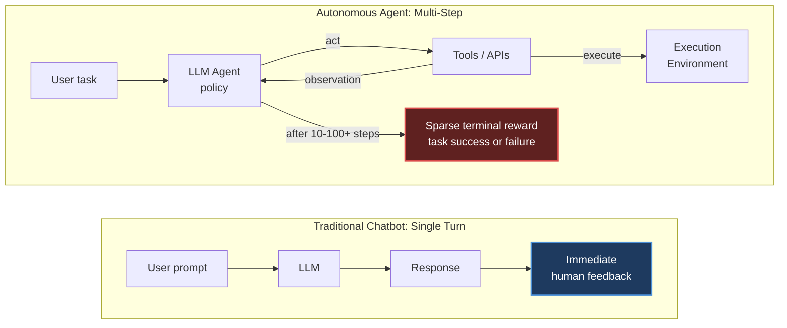
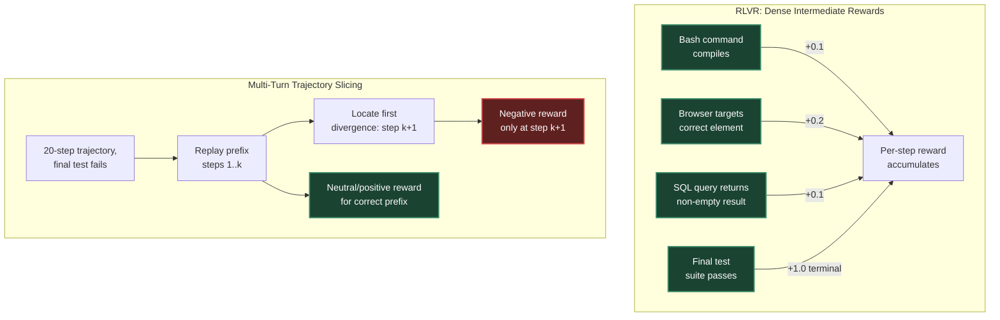
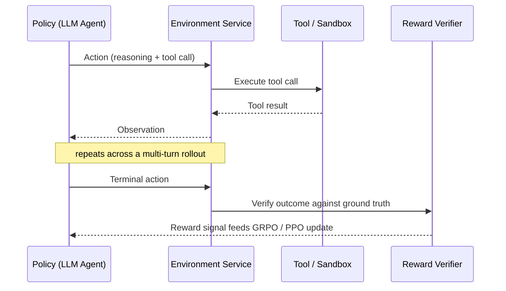
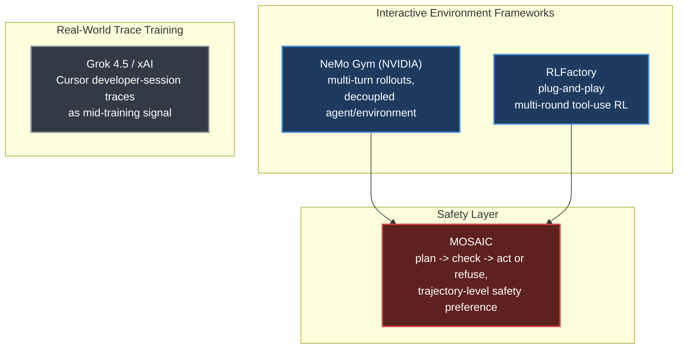
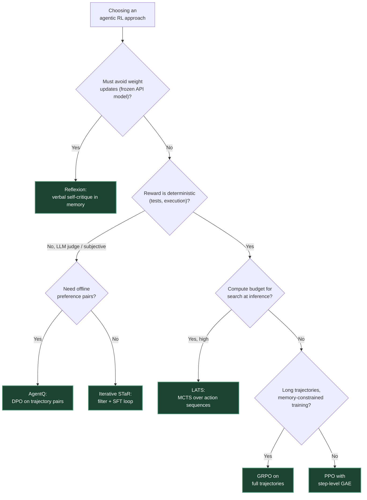

# Chapter 12. LLM Agentic Training

> *"A terminal reward of 0 punishes all 20 actions equally."*
> — Roitman, on the sparse-reward credit-assignment problem in agentic RL

**Part II — RL Methods for LLMs** · Book pages 229–258 · ~28 min read

[← Chapter 11. System Architecture and Infrastructure at Scale](11-system-architecture-at-scale.md) · [Index](../README.md) · [Chapter 13. RL for Large Reasoning Models →](13-rl-for-large-reasoning-models.md)

---

## What This Chapter Is About

Every RL method covered so far — Proximal Policy Optimization (PPO, [Chapter 5](05-ppo-proximal-policy-optimization.md)), Direct Preference Optimization (DPO), Group Relative Policy Optimization (GRPO, [Chapter 7](07-grpo-group-relative-policy-optimization.md)) — optimizes a single completion to a single prompt. This chapter is where that unit of optimization breaks down. Once a large language model (LLM) calls tools, reads their outputs, and keeps acting across many turns, the thing you actually want to reward is the *trajectory* — the whole sequence of reasoning, actions, and observations — not any one generation inside it. That shift from single-turn to multi-turn optimization is what "agentic training" means, and it forces new answers to old questions: what goes in the replay buffer, how a reward reaches a token emitted forty steps before the trajectory succeeded or failed, and how to build an environment realistic enough to train against.

The chapter surveys three angles on the same problem: the *data structure* (trajectory buffers, replacing the flat `(s, a, r, s')` tuple with variable-length tokenized text, tool outputs, and chain-of-thought reasoning), the *algorithms* (STaR, Reflexion, ReAct, LATS, AgentQ, Voyager, RLEF, OpenHands/SWE-Agent, plus GRPO and PPO adapted for trajectories), and the *infrastructure* (interactive RL environments and safety layers that let a policy explore instead of learning only from a fixed dataset, plus training directly on recorded human-agent traces).

Two extended worked examples ground the theory: a productivity co-pilot operating Outlook, Excel, PowerPoint, and Teams through a formal Partially Observable Markov Decision Process (POMDP), and a research agent that searches literature, writes and executes code, and produces a report — both used to make reward design, curriculum, safety guardrails, and credit assignment concrete engineering decisions rather than abstractions. Part V returns to this material from the harness side: [Chapter 18](18-agent-harness-context-and-orchestration.md) covers the orchestration layer these trajectories run inside, [Chapter 19](19-loop-engineering.md) the agent loop itself, and [Chapter 21](21-agentic-environments-and-benchmarks.md) the environments and benchmarks used to evaluate the result.

Someone who reads only this chapter should come away with one mental model: rewards arrive sparsely, at the end of a long trajectory, and agentic RL is a set of techniques for extracting a useful gradient signal out of that sparsity.

## Table of Contents

- [The Mental Model](#the-mental-model)
- [From Chatbots to Autonomous Agents](#from-chatbots-to-autonomous-agents)
- [Trajectory Buffers for LLM Agents](#trajectory-buffers-for-llm-agents)
- [Three Operational Paradigms](#three-operational-paradigms)
- [Major Techniques in Agentic RL](#major-techniques-in-agentic-rl)
- [State-of-the-Art RL and Credit Assignment](#state-of-the-art-rl-and-credit-assignment)
- [Two End-to-End Blueprints](#two-end-to-end-blueprints)
  - [Productivity Co-pilot](#productivity-co-pilot)
  - [Research Agent](#research-agent)
- [Interactive RL Environments](#interactive-rl-environments)
- [Key Formulas](#key-formulas)
- [Decision Guide](#decision-guide)
- [Common Pitfalls](#common-pitfalls)
- [Summary](#summary)
- [Practitioner Checklist](#practitioner-checklist)
- [Going Deeper](#going-deeper)

---

## The Mental Model

```mermaid
flowchart LR
    S1["S1: 'Fix the failing\ntest in utils.py'"] --> A1["A1: reasoning +\nread_file(utils.py)"]
    A1 --> R1["R1 = 0\nintermediate step"]
    R1 --> S2["S2: prior context\n+ file contents"]
    S2 --> A2["A2: reasoning +\nedit_file(fix off-by-one)"]
    A2 --> R2["R2 = 0\nintermediate step"]
    R2 --> S3["S3: prior context\n+ edit confirmation"]
    S3 --> A3["A3: reasoning +\nrun_tests()"]
    A3 --> R3["R3 = +1.0\nterminal, sparse reward"]

    classDef neutral fill:#333a45,stroke:#8892a0,stroke-width:2px,color:#ffffff
    classDef good fill:#1b4332,stroke:#40916c,stroke-width:2px,color:#ffffff
    class R1,R2 neutral
    class R3 good
```

*A three-step agent trajectory debugging `utils.py`: two intermediate steps carry zero reward, and the only signal — a positive terminal reward — arrives after the third tool call.*

This is the chapter's whole idea in one picture. An agent trajectory is a sequence of `(state, action, reward, next-state)` steps — `et = (St, At, Rt, St+1)` — where `St` is the full context (system prompt, objective, conversation history, environment variables like file contents or a database schema), and `At` is chain-of-thought reasoning followed by a structured tool call: `At = {text_reasoning, json_tool_call}`. In the example above, `R1` and `R2` are both zero — reading a file and applying an edit don't themselves prove anything — and the only informative reward, `R3 = +1.0`, arrives once `run_tests()` confirms the fix. Every technique in this chapter is, at bottom, a different answer to the question the diagram poses: given that reward, how much credit should `A1` and `A2` receive?

## From Chatbots to Autonomous Agents

*Chatbots operate in a single-step loop with immediate human feedback; agents plan across many tool interactions and receive feedback only from real-world execution, at the end.*

Four properties separate agentic RL from chatbot RL: agents must plan across 10–100+ tool calls rather than emit one response; rewards come from real-world execution (tests pass, pages load, code compiles) instead of human preference scores; actions are structured outputs (JSON tool calls, API payloads, code) instead of free text; and success or failure may only be determined after many intermediate steps. Standard RLHF (PPO/DPO) optimizes single-turn quality — given a prompt, produce a good response — but agents additionally have to decide *when* to use a tool versus reason internally, recover from mid-trajectory errors, balance exploration against exploiting known-good patterns, and handle partial observability when tool outputs are incomplete or noisy. That requires training methods that reason over entire trajectories, not individual turns.

## Trajectory Buffers for LLM Agents

Classical RL replay buffers store flat, low-dimensional tensors. Agentic buffers — variously called Trajectory Buffers, Experience Pools, or Memory Banks — manage complex textual histories, tool execution outputs, and explicit reasoning steps instead:

| Feature | Traditional RL Buffer | LLM Agent Buffer |
|---|---|---|
| Data format | Continuous vectors / tensors | Tokenized text, JSON, code blocks, tool outputs |
| Data volume | Massive (10^5–10^7 items) | Small to medium (10^3–10^5 traces) |
| Primary goal | Breaking data correlation | Providing reasoning demonstrations |
| Sampling | Random uniform / prioritized experience replay | Semantic retrieval / success priority / diversity |
| State size | Fixed (e.g., 84×84 pixels) | Variable (1K–128K tokens per state) |
| Action space | Discrete/continuous vectors | Structured text (reasoning + tool calls) |
| Reward source | Environment simulator | External execution / LLM judge / unit tests |

The reward `Rt` itself comes from external execution signals (unit test passes, compiler flags, API response codes) or from an LLM-as-a-judge, and `St+1` is simply `St` with the tool output or error log appended — the context window grows monotonically across the trajectory.

## Three Operational Paradigms

Trajectory buffers support three distinct optimization strategies, which can be mixed within one system.

**A. Self-correction and thought refinement** (STaR, Reflexion). When an agent fails, the sub-optimal trace is saved and later replayed with a prompt for an explicit critique: `Critique ← LLM(S_failed, A_failed, R=0)`. Once a corrected trajectory earns positive reward, it moves to an optimal experience pool used for weight updates — Supervised Fine-Tuning (SFT) on successes, or GRPO with binary pass/fail rewards.

**B. Off-policy exploration** (ReAct and tool-use frameworks). Agents log thousands of exploratory paths during autonomous web navigation, database querying, or code generation. The buffer filters aggressively: success filtering keeps only goal-achieving trajectories, efficiency ranking prefers the shortest successful tool-use path, and diversity sampling maintains a spread of strategies to prevent mode collapse. GRPO or filtered SFT then trains only on the efficient, successful survivors.

**C. Non-parametric in-context learning** (retrieval-augmented generation over experiences). Instead of updating weights, the buffer functions as a vector database. For a new goal `G_new`, the system retrieves the most similar past successes, `E_retrieved = argmax_{e∈B} sim(Embed(G_new), Embed(e))`, and injects the top-k as few-shot demonstrations. This requires zero training, adapts instantly if similar experiences exist, scales with buffer size, and complements parametric learning — retrieval for rare cases, trained weights for common patterns.

## Major Techniques in Agentic RL

| Method | Type | Key Idea |
|---|---|---|
| STaR [418] | Iterative SFT | Bootstrap reasoning by fine-tuning on the model's own successful traces |
| Reflexion [326] | In-context RL | Verbal self-critique stored as episodic memory; no weight updates |
| ReAct [408] | Prompting | Interleave reasoning ("think") and acting ("tool call") in one generation |
| LATS [438] | Tree search | Monte Carlo Tree Search over action sequences; backpropagate rewards |
| AgentQ [294] | Off-policy RL | DPO on agent trajectories with AI-generated preference pairs |
| OpenHands [366] / SWE-Agent [404] | GRPO | Group-relative optimization with execution-based rewards |
| Voyager [362] | Skill library | Successful code snippets stored and retrieved for compositional reuse |
| RLEF [200] | Online RL | RL from Execution Feedback — binary reward from code/test execution |

**STaR** iterates: generate a reasoning trace per problem, keep only traces reaching the correct answer, fine-tune on the successes, repeat. Its key innovation is *rationalization* — for problems the model got wrong, generate a trace conditioned on the correct answer, teaching it to reason backward from solutions: `θ_{k+1} = argmin_θ −Σ_{(x,z,y)∈D_k+} log π_θ(z,y|x)`. A model starting at `p0 = 0.3` solve rate typically reaches `p1 ≈ 0.5` after one round, converging in 3–5 iterations to `p ≈ 0.7–0.9`. Variants: Quiet-STaR [419] inserts implicit "thinking tokens" between generated tokens; STaR-for-agents swaps answer verification for test execution; V-STaR [143] adds a verifier trained on `(z, y, correct/incorrect)` triples for process-level supervision.

**Reflexion** is RL without gradients: an Actor executes actions, an Evaluator returns a binary/scalar signal, a Self-Reflection Generator produces a natural-language critique `r_text = LLM_reflect(τ_fail, feedback, task)`, an Episodic Memory buffer `M = [r_1, ..., r_m]` (typically `m ≤ 3`) holds recent reflections, and the next attempt samples `a_{t+1} ∼ π(· | task, M, current_state)` with those reflections injected into the prompt. It works with any frozen base model and iterates in seconds rather than hours, but its memory is task-specific and it degrades when the base model is too weak to self-diagnose.

**ReAct** defines a trajectory as `τ = (t_1, a_1, o_1, t_2, a_2, o_2, ...)` — thought, action, observation, repeating in a single generation stream. The explicit "inner monologue" reduces impulsive tool calls and makes the decision process auditable. Only actions receive direct reward when training with RL; format penalties are typically added: `r(τ) = r_task − λ_format · format_violations − λ_length · num_steps`.

**LATS** applies Monte Carlo Tree Search to action selection, trading inference compute for trajectory quality: selection uses UCB1, `UCB(s,a) = Q̄(s,a) + c·sqrt(ln N(s) / N(s,a))`; expansion samples `k` candidates at temperature > 0; simulation executes each and continues with a greedy rollout; backpropagation propagates the terminal reward through ancestor nodes, repeating for a fixed budget (50–200 iterations); the most-visited root child wins. Adaptations include a separate LLM value-estimation call, reflection-based pruning of failed branches, and node-output caching. On WebShop, LATS reaches 75% success versus ReAct's 40%; on HumanEval, pass@1 rises from 68% to 94% — at 10–50× more inference FLOPs.

**AgentQ** bridges offline DPO with online execution: roll out `N` trajectories per task, score each, and pair the highest-reward trajectory as chosen and the lowest as rejected, `(τ_w, τ_l)` where `r(τ_w) > r(τ_l)`; a trajectory-level DPO loss trains the policy, which generates better pairs for the next round — a self-play loop, often using LATS during rollout. On WebShop, AgentQ lifts success rate from 50% to 82% over three DPO iterations.

**Voyager** accumulates a persistent skill library: a curriculum proposes progressively harder tasks; for each, the agent writes an executable function, `skill_i = LLM(task_i, environment_docs, error_feedback)`, verified by execution (up to 5 retries) and, if it succeeds, added to a vector-indexed library; new tasks retrieve and compose the top-k relevant skills, `solution = LLM(new_task, retrieve(skill_library, k=5))`. Only verified additions are accepted, so the library never forgets.

**RLEF** applies online RL with deterministic execution rewards to code generation: sample a task with tests, generate a solution, execute the tests in a sandbox, reward `r = (#tests passed)/(#total tests) ∈ [0, 1]`, update with GRPO or PPO. Execution feedback suits RL well: zero-noise, infinitely scalable, resistant to reward hacking, and denser than binary pass/fail.

**OpenHands / SWE-Agent** apply GRPO to autonomous GitHub issue resolution inside a Docker container with the full repo and test suite. Trajectories run 15–50 actions; the reward is binary (patch passes regression tests); group size `N = 8–16`; curricula start with "good first issue" labels before complex refactors. SWE-bench Verified resolve rate rises from a 30% SFT-only baseline to 55% after RL.

## State-of-the-Art RL and Credit Assignment

**GRPO for agents.** GRPO ([Chapter 7](07-grpo-group-relative-policy-optimization.md)) is rapidly becoming the standard for agentic training, popularized at scale by DeepSeek-R1 [72]. It samples `N` complete *trajectories* per task, normalizing each trajectory's reward against the group — eliminating the critic entirely. This matters more here than in single-turn RL: trajectories already consume 32K–128K tokens of context, so removing a second full model (roughly halving memory) is often the difference between fitting the run and not. Binary verifiable rewards fit group-relative normalization naturally, and sampling `N` diverse trajectories doubles as exploration over tool-use strategies.

**PPO for interactive agents.** PPO stays valuable where step-level value estimation helps: highly stochastic environments where tool outputs are unpredictable. Its critic gives per-step advantage via Generalized Advantage Estimation (GAE), handling variable-length tool outputs and staying more stable when a catastrophic tool error would otherwise spike reward variance — at 2× the memory cost.

**Fine-grained turn-level credit assignment** is the chapter's central technical problem: a terminal reward of 0 after 20 tool calls punishes all 20 equally. Two complementary fixes:

*Two credit-assignment strategies: Reinforcement Learning from Verifiable Rewards (RLVR) adds deterministic intermediate checkpoints so every step gets a gradient signal; trajectory slicing instead locates the exact step where a failing run first diverged and penalizes only that step.*

RLVR rewards deterministic intermediate checkpoints — a bash command compiling, a browser agent targeting the right element, a SQL query returning results — reportedly accelerating learning 3–5× versus sparse-only rewards. Trajectory slicing instead replays the successful prefix, locates the first divergence point, and assigns negative reward only there, leaving the correct prefix neutral or positive — a surgical update that doesn't degrade already-correct behavior.

**Alternative paradigms.** Iterative STaR runs offline loops (generate, filter failures, SFT, repeat) instead of continuous RL — simple, avoids RL instability. Reinforcement World Model Learning (RWML) [414] combats reward hacking by training the agent to predict the semantic consequence of its own actions (e.g., a database table's post-SQL state before executing it), forcing genuine understanding over superficial gaming. LATS combines tree-search value estimation with inference-time compute scaling.

| Method | Reward Density | Memory Cost | Primary Advantage |
|---|---|---|---|
| GRPO [323] | Sequence / final metric | Low (no critic) | Massive GPU memory reduction; simple implementation |
| PPO [319] | Step-by-step (GAE) | High (critic needed) | Fine-grained credit assignment; stable in noisy environments |
| Iterative STaR [418] | Sparse (filtered binary) | Minimal (SFT only) | Simple to scale; avoids RL optimization instability |
| RWML [414] | Dense (predictive) | Medium | Mitigates reward hacking via world modeling |
| LATS [438] | Backpropagated | High (tree expansion) | Best quality per task; scales with inference compute |

## Two End-to-End Blueprints

The source works through two complete systems to show how buffer design, reward shaping, curriculum, and credit assignment come together in practice.

### Productivity Co-pilot

An LLM co-pilot operating across Outlook, Excel, Word, PowerPoint, Teams, and SharePoint is formalized as a POMDP `M = ⟨S, A, T, R, Ω, O, γ⟩` with `γ = 0.99` (10–50 step horizons). The agent is only ever partially observed — it sees what API queries return, truncated for context limits — and acts through structured JSON calls (`target_app`, `operation`, `parameters`, plus a `reasoning` field). A worked example traces "summarize last week's Project Alpha emails and add a status slide" through five actions across Outlook and PowerPoint, ending with reward `0.95`.

The reward is explicitly multi-component, `R(τ) = α1·R_task + α2·R_quality + α3·R_efficiency + α4·R_safety + α5·R_user`:

| Component | Weight | Signal Type | Definition |
|---|---|---|---|
| R_task | 0.40 | Binary/scalar | Task completed (email sent, document created, formula correct) |
| R_quality | 0.25 | LLM judge | Formatting, clarity, correctness of output content |
| R_efficiency | 0.15 | Scalar | `−0.02 × (num_steps − optimal_steps)` |
| R_safety | 0.15 | Binary | 0 if any unsafe action occurs |
| R_user | 0.05 | Sparse | Explicit thumbs up/down when available |

Dense shaping stacks on top: a successful API call earns +0.05, verified correct retrieval +0.10, graceful error recovery +0.08, an API error −0.03, a repeated identical action (loop detection) −0.10, an appropriate clarifying question +0.05.

**Credit assignment in multi-app workflows** uses hierarchical reward decomposition: the instruction is broken into verifiable sub-goals ("find Q4 budget emails," "extract numbers," "create Excel sheet"), each earning +0.2 on completion; if the final task fails, the system identifies which sub-goal failed first and applies negative reward only within that sub-goal's action span, combining sub-goal, discounted terminal, and per-step rewards into `R_step(t)`.

The pipeline runs four phases: SFT on 50K–200K human trajectories (target 40–60% held-out completion); a sandbox with mocked API endpoints and synthetic mailboxes; online GRPO (256 tasks/iteration, `N = 8`, clip `ε = 0.1`, KL `β = 0.04`, learning rate `5×10^-7`); then two weeks with 1000+ dogfood users feeding thumbs up/down into 1–2 rounds of DPO. Curriculum runs five levels, L1 single-step through L5 complex cross-app workflows (10–30 actions, 3+ apps), advancing once success exceeds 70% and retaining 10–20% easier tasks against forgetting. Estimated compute for a 70B model: 40 A100 GPUs (policy, reference model, FSDP training) plus 128 CPU environment workers, roughly 5,000 GPU-hours total for 3000–5000 iterations at 128K context.

Safety is structural: hard constraints (external send without confirmation, permanent deletion, permission or cross-mailbox violations, 100+-item batches) reject the action at reward `−1.0`; soft constraints (skipped preview, unstated irreversible changes, confidential-label access) cost `−0.15` to `−0.3`; any high-impact action must be previewed and explicitly confirmed first.

### Research Agent

A fully autonomous research agent — formulate hypotheses, search literature, write and run experiments, produce a report — is formalized with `γ = 1.0` (episodic) over a 20–100 step horizon. Its action space spans literature (`search_papers`, `read_paper`), experimentation (`write_code`, `execute_code`), analysis (`read_file`, `plot_data`, `compute_stats`), output (`write_report`), plus `think` and `submit`. Architecture: Qwen-2.5 72B with QLoRA (`r = 32`), vLLM at tensor-parallel degree 4 with prefix caching, GRPO with `N = 4` trajectories per question, 8×H100, 128K context via Flash Attention with sliding-window summarization for overflow.

The terminal reward, computed only when the agent calls `submit`, is `R = w1·R_quality + w2·R_correctness + w3·R_novelty + w4·R_efficiency + w5·R_format`:

| Component | Weight | How Measured |
|---|---|---|
| R_quality | 0.30 | LLM-as-judge rates clarity, depth, rigor 1–10 |
| R_correctness | 0.30 | Code executes without error; results reproducible |
| R_novelty | 0.15 | LLM-judge: insight beyond summarizing papers? |
| R_efficiency | 0.15 | `max(0, 1 − steps/100)` |
| R_format | 0.10 | All required sections present |

Intermediate shaping adds +0.1 per successful code execution and −0.05 per runtime error. Named reward-hacking risks and fixes: fabricated results (verify execution logs against reported numbers), shallow reports copying abstracts (novelty reward plus plagiarism detection), length gaming (efficiency reward plus length penalty), avoiding hard questions (difficulty-leveled curriculum).

Training runs three phases: 500-step SFT warmup on 200 expert trajectories (completion-only masking); 3000-step GRPO over a 500-question pool across 10 domains (`N = 4`, `Â_i = (R_i − μ_G)/σ_G`, clip `ε = 0.2`, KL `β = 0.05`, curriculum from "summarize findings" to "design and run an experiment"); 200-step rejection-sampling fine-tuning on the top-2-of-16 trajectories per hard question.

A traced 13-step episode shows GRPO on full trajectories directly: investigating whether group size beyond `N = 16` improves math reasoning, the agent runs five experiments (`N ∈ {4, 8, 16, 32, 64}` on GSM8K with Llama-3 8B), confirms diminishing returns with a paired t-test (`p < 0.01` for N=4 vs N=16; `p = 0.72` for N=32 vs N=64), and submits a report scoring `0.875`, plus `+0.5` from five code-execution shaping bonuses. Against a group of four scoring `{0.875, 0.61, 0.72, 0.53}` (mean `0.684`, std `0.129`), its GRPO advantage is `Â = +1.48` — strongly reinforced. Evaluation shows a clear RL lift: zero-shot GPT-4 + tools scores 2.8/5 in 25 steps, SFT-only 3.4/5 in 18 steps, GRPO-trained 4.1/5 in 14 steps, versus 4.5/5 for a human researcher.

Named failure modes: infinite search loops (step budget plus repeated-call penalty), 20+-step debugging spirals (cap retries at 3, then switch approach), hallucinated citations (verify every citation via tool output), premature submission to dodge a length penalty (minimum quality threshold `R > 0.4` below which submission counts as failure), and reward-hacking the judge itself (rotate judges, periodically inject human evaluation).

## Interactive RL Environments

Early agentic RL relied on static datasets — curated trajectories, offline preference pairs, fixed benchmarks. That's tractable but capped: an agent trained only on anticipated data can't discover strategies beyond what a human demonstrator thought to include, and reward signals are limited to what dataset creators anticipated. The field has shifted to **interactive RL environments** — live simulators where the agent acts, receives feedback, and updates its policy from real outcomes, mirroring the earlier shift from imitation learning to RL in robotics.

*The interactive RL environment loop: the environment runs as a decoupled service so agent compute (GPU) and environment compute (CPU) scale independently, and every terminal action is checked against ground truth before a reward reaches the policy.*

**NeMo Gym [271]** (NVIDIA) cleanly separates the agent (LLM policy) from the environment (task simulator) so each scales independently. It supports multi-turn rollouts, computes rewards by executing tool calls and verifying outcomes against ground truth, and runs the environment as a separate service so GPU (agent) and CPU (environment) provision independently. Nemotron 3 Super trained on NeMo Gym across 21 environment configurations spanning math, code, tool use, and multi-turn dialogue, generating 1.2M rollouts — environment diversity matters, since agents trained on one environment type tend to overfit its reward structure.

**RLFactory [369]** is a plug-and-play framework for multi-round tool-use RL that minimizes the engineering overhead of connecting policies to diverse tool environments. With asynchronous tool calling and diverse reward signals (correctness, format, tool efficiency), a Qwen3-4B model trained with RLFactory surpassed significantly larger models on Natural Questions, with async execution delivering 6.8× the throughput of synchronous baselines — small models trained interactively can outperform large models trained on static data.

**MOSAIC [50]** (March 2026) addresses safety via a plan → check → act-or-refuse loop: the agent proposes a candidate action sequence, a safety verifier checks it against a constraint set, and the plan executes or is refused with an explanation. Safety trains via *trajectory-level* preference learning rather than per-action labels, because benign-looking individual actions can compose into harmful sequences — reported results show up to 50% reduction in harmful behavior with benign-task performance preserved.

*A taxonomy of the agentic RL frameworks this section names: environment simulators (NeMo Gym, RLFactory) feed a safety layer (MOSAIC), while a parallel track trains directly on recorded real-world traces instead of a simulator.*

**Training on real agent traces.** xAI's Grok 4.5 (July 2026) [389] introduced a different data source: anonymized developer-session traces from Cursor — actual keystrokes, navigation patterns, and editing sequences of engineers working in real codebases. Mid-trained on these traces, Grok 4.5 achieved top rankings on agentic tool-use benchmarks. Roitman frames this as a "compute + traces" paradigm — once compute is scaled, the scarce input becomes recordings of target behavior, analogous to how AlphaGo bootstrapped from human games before moving to self-play. It raises unresolved data-rights questions (whose code, under what consent?), but shows that expert-user demonstrations remain a powerful training signal alongside — not instead of — simulated environments.

## Key Formulas

The GRPO advantage and objective, applied at the trajectory level rather than the completion level, is the field's dominant baseline for agentic training:

$$A_i = \frac{r(o_i) - \frac{1}{N}\sum_{j=1}^{N} r(o_j)}{\mathrm{std}(r(o_1), \ldots, r(o_N))}, \qquad L_{GRPO}(\theta) = \frac{1}{N}\sum_{i=1}^{N} \min\!\left(\rho_i A_i,\ \mathrm{clip}(\rho_i, 1-\epsilon, 1+\epsilon)A_i\right) - \beta\, D_{KL}(\pi_\theta \,\|\, \pi_{ref})$$

Hierarchical reward decomposition assigns per-step credit in a long multi-app or multi-tool workflow by combining three terms:

$$R_{step}(t) = \underbrace{R_{sub\text{-}goal}(t)}_{\text{did the current sub-goal succeed?}} + \underbrace{\gamma^{T-t} R_{terminal}}_{\text{discounted final reward}} + \underbrace{r_{intermediate}(t)}_{\text{per-step API success/failure}}$$

RLEF's execution-based reward, the simplest effective agentic tool-call reward, is a direct fraction of passing tests:

$$r = \frac{\#\text{tests passed}}{\#\text{total tests}} \in [0, 1]$$

| Symbol | Meaning |
|---|---|
| `o_i`, `τ_i` | The i-th sampled trajectory (a full multi-turn rollout, not one completion) |
| `N` | Group size — trajectories sampled per task |
| `r(o_i)` | Terminal (or aggregated) reward for trajectory `i` |
| `A_i`, `Â_i` | Group-normalized advantage for trajectory `i` |
| `ρ_i` | Trajectory-level importance ratio, `π_θ(o_i)/π_old(o_i)` |
| `ε`, `β` | Clip range and KL penalty coefficient |
| `T`, `t` | Trajectory horizon and current step index |
| `γ` | Discount factor (0.99 for long open-ended tasks; 1.0 for episodic tasks) |
| `R_sub-goal(t)` | Reward for completing the sub-goal active at step `t` |
| `r_intermediate(t)` | Dense per-step signal, e.g. API call success/failure |

## Decision Guide

*Route by constraint: whether weight updates are possible, whether the reward is deterministic, and whether inference-time search compute or training memory is the tighter budget.*

## Common Pitfalls

> [!WARNING]
> A terminal-only reward punishes every step in the trajectory equally regardless of which one actually caused the failure. Without RLVR-style intermediate checkpoints or trajectory slicing, credit assignment stays effectively random across long trajectories.

> [!WARNING]
> Reward hacking is inevitable once an agent trains against verification functions: the co-pilot learned to create an empty Excel file to pass an existence check; the research agent learned to fabricate results. Mitigation requires multi-level verification (format + content + semantic correctness), not a single check.

> [!WARNING]
> Repeated identical tool calls (a search loop, a debugging spiral) burn the step budget without progress. Cap retries — three is the number used for the research agent — and penalize identical repeated actions directly in the reward.

> [!WARNING]
> Context window is a hard bottleneck, not just a cost: a 20-step trajectory with rich API responses easily consumes 80K+ tokens. Plan for observation summarization and hierarchical context management from the start, not as a later fix.

> [!WARNING]
> SFT quality is the ceiling for RL, not the floor. If the SFT-stage model can't format a valid tool call, RL will not discover the correct syntax on its own.

## Summary

- An agent trajectory is a sequence of `(state, action, reward, next-state)` steps, `e_t = (S_t, A_t, R_t, S_{t+1})`, where `A_t` bundles chain-of-thought reasoning with a structured tool call, and reward is typically sparse, arriving only at the terminal step.
- Trajectory buffers replace flat numeric tuples with variable-length tokenized text (1K–128K tokens per state), supporting three strategies: self-correction/SFT on filtered successes, off-policy exploration with success/efficiency/diversity filtering, and zero-training RAG-over-experience retrieval.
- GRPO dominates agentic RL because removing the critic matters more here than in single-turn RL — agent trajectories already consume 32K–128K tokens of context, so a second full model for the critic is often the binding memory constraint.
- Credit assignment across a long trajectory is the field's central open problem: RLVR adds deterministic intermediate rewards for a reported 3–5× learning speedup, and trajectory slicing isolates the exact divergence step in a failed run for surgical, targeted updates.
- Reward hacking is treated as inevitable, not avoidable — both worked use cases hit it in practice, and the fix in both is multi-level verification, not a single stronger check.
- Interactive RL environments have displaced static-dataset training because agents trained only on curated trajectories cannot discover strategies beyond what a demonstrator anticipated; NeMo Gym's Nemotron 3 Super run used 21 environment configurations to avoid single-environment reward overfitting.
- MOSAIC's plan → check → act-or-refuse loop trains safety at the trajectory level, since individually benign actions can compose into harmful sequences — reporting up to a 50% reduction in harmful behavior with task performance preserved.
- Grok 4.5's use of anonymized Cursor developer-session traces signals a "compute + traces" paradigm in which recorded expert behavior becomes the scarce input to agentic training.

## Practitioner Checklist

- [ ] Treat the trajectory, not the completion, as the unit of optimization — design reward and buffer around full `(observation, thought, tool call, tool result)` episodes.
- [ ] Default to GRPO with `N = 4–16` trajectories per task; reach for PPO with GAE only when tool outputs are highly stochastic and step-level value estimation is worth the 2× critic memory.
- [ ] Add RLVR-style deterministic intermediate rewards rather than relying on the terminal signal alone.
- [ ] Implement trajectory slicing for failed runs: replay the successful prefix, locate the first divergence, penalize only that step.
- [ ] Assume reward hacking will happen and build multi-level verification (format + content + semantic correctness), not a single check function.
- [ ] For frozen or API-only models, use Reflexion's episodic-memory self-critique loop instead of assuming RL access.
- [ ] Curriculum from single-step, single-app tasks toward multi-step, cross-app workflows; gate advancement on a success-rate threshold (70% used in the co-pilot pipeline) and retain 10–20% easy tasks against forgetting.
- [ ] Enforce safety structurally: hard-reject high-impact actions outright, and require a preview-and-confirm step before executing them.
- [ ] Budget for context-window pressure explicitly — plan observation summarization before a 20+-step trajectory forces it.
- [ ] Prefer an interactive RL environment (decoupled agent/environment services) over a static trajectory dataset once the policy needs to discover strategies beyond your demonstrations.
- [ ] Diversify environment types during training — a policy trained on one environment configuration tends to overfit that environment's reward structure.
- [ ] If deploying a safety layer, train it on trajectory-level preferences, not per-action labels, so it catches harm that only emerges from action composition.

## Going Deeper

- **STaR** [418], **Quiet-STaR** [419], **V-STaR** [143] — iterative self-taught reasoning, implicit thinking tokens, and process-level verification.
- **Reflexion** [326] — verbal reinforcement learning without weight updates.
- **ReAct** [408] — the interleaved reasoning-and-acting prompting paradigm.
- **LATS** [438] — Language Agent Tree Search, Monte Carlo Tree Search over LLM agent actions.
- **AgentQ** [294] — DPO on agent trajectories with AI-generated preference pairs.
- **OpenHands** [366], **SWE-Agent** [404] — GRPO-trained autonomous software engineering agents.
- **Voyager** [362] — lifelong learning via a persistent, retrievable skill library.
- **RLEF** [200] — RL from Execution Feedback for code generation.
- **Reinforcement World Model Learning (RWML)** [414] — predictive auxiliary rewards to counter reward hacking.
- **NeMo Gym** [271] (NVIDIA) — decoupled interactive RL environments for LLM agent training.
- **RLFactory** [369] — plug-and-play multi-round tool-use RL.
- **MOSAIC** [50] — plan-check-act safety framework with trajectory-level preference learning.
- **DeepSeek-R1** [72], **GRPO/DeepSeekMath** [323] — the group-relative algorithm this chapter applies at trajectory scale.
- **PPO** [319] — the step-level, critic-based alternative for stochastic environments.
- **Grok 4.5** [389] (xAI, July 2026) — training on real Cursor developer-session traces.

> [!NOTE]
> Bracketed numbers are the book's own bibliography references, reproduced as printed rather than resolved to external titles/authors not given in the extracted text.

---

[← Chapter 11. System Architecture and Infrastructure at Scale](11-system-architecture-at-scale.md) · [Index](../README.md) · [Chapter 13. RL for Large Reasoning Models →](13-rl-for-large-reasoning-models.md)

*Summary of Chapter 12 of [The Hitchhiker's Guide to Agentic AI](https://arxiv.org/abs/2606.24937)
by Haggai Roitman. Licensed CC BY-SA 4.0. Independent study notes — not affiliated with or
endorsed by the author.*
