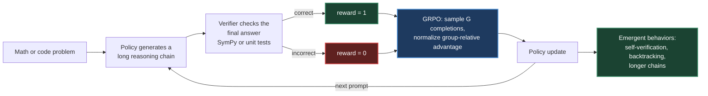
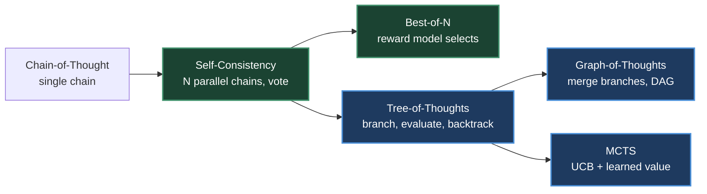
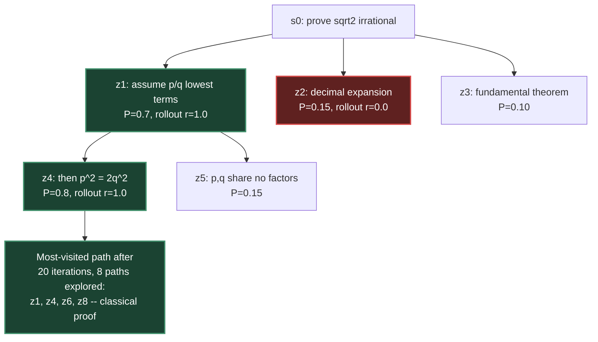
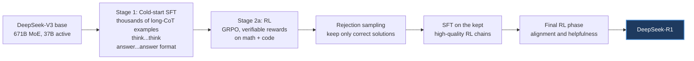
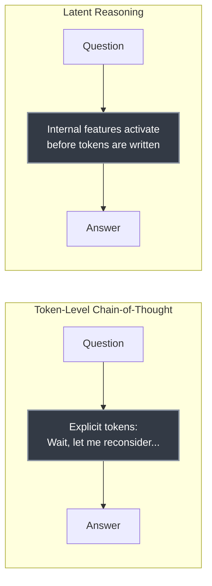
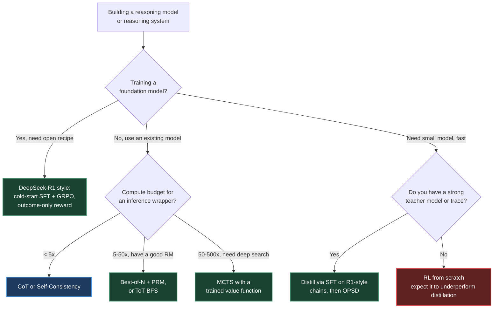

# Chapter 13. RL for Large Reasoning Models

> *"The model becomes its own search algorithm."*

**Part III — Reasoning** · Book pages 260–285 · ~26 min read

[← Chapter 12. LLM Agentic Training](12-llm-agentic-training.md) · [Index](../README.md) · [Chapter 14. LLM Evaluation →](14-llm-evaluation.md)

---

## What This Chapter Is About

Standard large language model (LLM) training optimizes next-token prediction; reasoning-focused reinforcement learning (RL) instead teaches a model to spend extra computation at inference time exploring, verifying, and revising its own intermediate steps before answering. This chapter treats multi-step reasoning as a search over a tree of partial solutions, and shows how RL — using nothing but a verifiable pass/fail signal on the final answer — teaches a model to navigate that tree without ever seeing a chain-of-thought (CoT) demonstration.

The central claim: self-correction, backtracking, and step-by-step verification are *emergent*. DeepSeek-R1's training used only outcome-level correctness rewards, yet phrases like "Wait, let me reconsider..." appeared in its generations without being trained explicitly. The chapter moves through three eras: test-time scaling methods that bolt search onto a fixed model (Tree-of-Thoughts, Monte Carlo Tree Search or MCTS), RL recipes that make a model perform this search implicitly in one generation (DeepSeek-R1, OpenAI o1/o3, QwQ), and newer scaling laws and techniques (inference-time compute scaling, latent reasoning, on-policy self-distillation) explaining why it works and how to make it cheaper. Read alongside [Chapter 7 (Group Relative Policy Optimization, GRPO)](07-grpo-group-relative-policy-optimization.md), the algorithm DeepSeek used, and [Chapter 9 (Reward Model Training)](09-reward-model-training.md), which covers the process reward model (PRM) / outcome reward model (ORM) distinction in depth, this is where those pieces combine into the current reasoning-model paradigm.

## Table of Contents

- [The Mental Model](#the-mental-model)
- [Motivation: Reasoning as a Search Problem](#motivation-reasoning-as-a-search-problem)
  - [Why Reasoning Needs a Different RL Formulation](#why-reasoning-needs-a-different-rl-formulation)
  - [Emergent CoT vs. Trained CoT](#emergent-cot-vs-trained-cot)
  - [Test-Time Compute Scaling Laws](#test-time-compute-scaling-laws)
- [Test-Time Scaling Methods](#test-time-scaling-methods)
  - [Chain-of-Thought and Self-Consistency](#chain-of-thought-and-self-consistency)
  - [Tree-of-Thoughts and Graph-of-Thoughts](#tree-of-thoughts-and-graph-of-thoughts)
  - [Best-of-N and Monte Carlo Tree Search](#best-of-n-and-monte-carlo-tree-search)
  - [Beam Search and Iterative Refinement](#beam-search-and-iterative-refinement)
  - [Method Comparison](#method-comparison)
- [DeepSeek-R1](#deepseek-r1)
  - [Two-Stage Training Pipeline](#two-stage-training-pipeline)
  - [Reward Design: No Process Reward Model](#reward-design-no-process-reward-model)
  - [GRPO for R1](#grpo-for-r1)
  - [Distillation: The R1-Distill Series](#distillation-the-r1-distill-series)
- [OpenAI o1/o3 Series](#openai-o1o3-series)
  - [Hidden Reasoning Tokens](#hidden-reasoning-tokens)
  - [PRM vs. ORM in o1](#prm-vs-orm-in-o1)
  - [Inference-Time and Training-Compute Scaling](#inference-time-and-training-compute-scaling)
  - [o3 and o4-mini](#o3-and-o4-mini)
- [QwQ and Qwen Reasoning Models](#qwq-and-qwen-reasoning-models)
- [Key Methods with Mathematical Foundations](#key-methods-with-mathematical-foundations)
- [Key Formulas](#key-formulas)
- [Scaling Laws for Reasoning](#scaling-laws-for-reasoning)
  - [Training Compute vs. Test-Time Compute](#training-compute-vs-test-time-compute)
  - [Overthinking and Optimal Token Budgets](#overthinking-and-optimal-token-budgets)
  - [Latent Reasoning: Is the Chain the Computation?](#latent-reasoning-is-the-chain-the-computation)
- [On-Policy Self-Distillation](#on-policy-self-distillation)
- [Comparing the Frontier](#comparing-the-frontier)
- [Decision Guide](#decision-guide)
- [Common Pitfalls](#common-pitfalls)
- [Summary](#summary)
- [Practitioner Checklist](#practitioner-checklist)
- [Going Deeper](#going-deeper)

---

## The Mental Model

*Reinforcement Learning from Verifiable Rewards (RLVR), the loop underlying every model in this chapter: a deterministic verifier — not a learned reward model — grades the final answer, and that binary signal alone is enough for RL to discover reasoning behaviors no one programmed in.*

No step in this loop inspects the reasoning chain itself; the verifier only checks the final answer, using symbolic math comparison or code execution — objectively checkable, unlike subjective text quality. Everything else — the model learning to say "wait, let me reconsider," to check its own arithmetic, to try a different approach after a dead end — is discovered because those behaviors raise the *probability of a correct final answer*, not because any reward term singled them out. RLVR is the mechanism behind DeepSeek-R1's "aha moment."

## Motivation: Reasoning as a Search Problem

### Why Reasoning Needs a Different RL Formulation

Standard RL from human feedback (RLHF, Chapter 4) optimizes one scalar reward over a complete response. That breaks down for multi-step reasoning — mathematics, formal verification, competitive programming, scientific derivation:

- **Sparse rewards.** A math problem may take 20 steps; one outcome reward gives no signal for which step caused the error.
- **Long horizons.** Chains span hundreds to thousands of tokens, creating severe credit-assignment problems.
- **Combinatorial search.** The space of valid reasoning paths is exponentially large; the model must search it efficiently, not enumerate it.
- **Verifiability.** Unlike subjective text quality, math/logic correctness is objectively checkable — enabling automated reward with no human annotation.

The book's framing: reasoning is a search over a tree of partial solutions, where each node is a CoT prefix, each edge a reasoning step, and the leaves are final answers. RL for reasoning teaches the model to navigate that tree — exploring promising branches, backtracking from dead ends, allocating compute where it matters most.

### Emergent CoT vs. Trained CoT

CoT was first observed as *emergent*: sufficiently large models (typically ≥100B parameters), given step-by-step examples, spontaneously produced intermediate reasoning that improved accuracy. DeepSeek-R1 answers the natural follow-up — is CoT emergent from scale, or trainable? — with "both, but differently":

| | Emergent CoT (prompting) | Trained CoT (RL) |
|---|---|---|
| Source | In-context learning on a large base model | RL objective on final-answer correctness |
| Requires | ≥100B parameters, careful prompting | Cold-start SFT + RL (works at smaller scale too) |
| Robustness | Brittle, prompt-sensitive | Intrinsic to generation, independent of prompt style |
| Behaviors | Fixed reasoning style from demonstrations | Longer, exploratory; self-correction, backtracking, verification |

> [!NOTE]
> **The "aha moment."** During R1's RL training, models spontaneously began reconsidering their initial approach mid-chain — "Wait, let me reconsider..." or "Actually, I think I made an error..." — never explicitly trained. It emerged purely from maximizing final-answer accuracy, suggesting RL can discover meta-cognitive strategies that are instrumentally useful for hard problems.

### Test-Time Compute Scaling Laws

A central finding motivating this chapter: test-time compute scales predictably with performance. With `Ctrain` training compute (FLOPs) and `Ctest` inference compute (tokens generated):

$$\text{Accuracy}(C_{train}, C_{test}) \approx f(\alpha \log C_{train} + \beta \log C_{test})$$

for a monotone `f` and constants `α, β > 0`. Practically: a smaller model with more inference compute can match a larger model with less — reasoning models trade training compute for inference compute, so you can deploy a smaller reasoning-capable model and let it spend more tokens "thinking" on hard problems.

## Test-Time Scaling Methods

These methods operationalize the scaling law above and form a spectrum trading inference cost for accuracy. Each builds on the last: CoT introduces explicit reasoning, Self-Consistency adds sampling, Tree-of-Thoughts (ToT) adds structured search, Graph-of-Thoughts (GoT) adds merging, and MCTS adds learned value guidance.

*Green methods sample independently and are fully parallelizable; blue methods need sequential depth expansion and structured search. Modern reasoning models perform an implicit version of the blue side inside a single generation.*

### Chain-of-Thought and Self-Consistency

**CoT prompting** underlies every method here. Zero-Shot CoT elicits reasoning by appending "Let's think step by step"; Few-Shot CoT provides exemplars `(x1,z1,y1), ..., (xk,zk,yk)` with hand-written traces `zi`. Formally, `p(y|x) = Σz p(y|x,z)·p(z|x) ≈ p(y|x,z*)·p(z*|x)` for the greedy chain `z*` — the full sum is intractable, so standard CoT samples just one, and an early wrong step corrupts everything downstream with no recovery.

**Self-Consistency** fixes that fragility: sample `N` chains at `T > 0` (0.7–1.0) and majority-vote, `ŷ = argmax_y Σᵢ 1[yᵢ = y]`. Fully parallelizable, accuracy improves monotonically with `N` with diminishing returns past `N ≈ 40`, and it's equivalent to Best-of-N with an outcome reward model (ORM) — majority voting is an implicit ORM. On GSM8K with PaLM-540B: CoT = 56.5%, Self-Consistency (`N=40`) = 74.4%.

> [!TIP]
> Why majority voting works even with a weak model: if per-sample accuracy `p > 0.5`, the law of large numbers drives majority-vote accuracy toward 100% as `N → ∞`. Even at `p = 0.3`, if correct answers concentrate on one value while wrong ones scatter, voting still tends to recover the correct answer.

### Tree-of-Thoughts and Graph-of-Thoughts

**ToT** generalizes CoT into a tree: `ToT = (G, E, V, πθ, Search)` — `G` produces `b` candidate thoughts, `E` scores states as `{sure, maybe, impossible}` or `[0,1]`, `Search` is BFS (top-`k` beam per level) or DFS (backtrack on `impossible`). Cost is `2kbd` LLM calls; on "Game of 24" with `b=3, k=2, d=3` that's 36 calls vs. 1 for CoT, and ToT reaches 74% success there vs. CoT's 4% (same base model, GPT-4).

**GoT** extends ToT into a directed acyclic graph via an **Aggregate/Merge** operation — combining multiple thoughts into one, impossible in a pure tree — alongside Generate, Refine, Score. Merging enables divide-and-conquer and ensemble reasoning: on sorting, GoT cuts cost 62% vs. ToT at equal quality; on set intersection and keyword counting it matches ToT quality with 30–40% fewer calls.

### Best-of-N and Monte Carlo Tree Search

**Best-of-N (BoN)** samples `N` completions and picks the best by reward model, `y* = argmax Rφ(x,y)`. BoN+ORM scores whole solutions; BoN+PRM picks the highest *minimum* step score. With accuracy `p` and an oracle RM, `P(success) = 1 − (1−p)^N`: `p=0.3, N=10` → 97%; `p=0.1, N=50` → 99.5%. In practice imperfect RMs cap useful `N` — beyond `N ≈ 64–256`, RM errors dominate and accuracy plateaus or drops (reward hacking).

**MCTS** combines ToT-style exploration with a learned value estimate and visit counts (from AlphaGo, adapted to reasoning by AlphaProof and rStar). Node selection uses PUCT:

$$a^* = \arg\max_a \left[ Q(s,a) + c_{puct} \cdot P(s,a) \cdot \frac{\sqrt{\sum_b N(s,b)}}{1 + N(s,a)} \right]$$

where `P(s,a) = πθ(a|s)` is the LLM's prior, biasing exploration toward steps it favors while the second term rewards under-explored alternatives.

*One MCTS iteration: Selection (traverse via UCB), Expansion (generate new steps from the leaf), Simulation (rollout to a terminal answer), Backpropagation (update Q and N along the path). Shown: the book's worked example proving √2 irrational — the low-probability decimal-expansion branch scores 0 and is not revisited.*

| Dimension | ToT | MCTS |
|---|---|---|
| Value estimation | LLM prompt ("sure/maybe/impossible") | Learned value network + rollout statistics |
| Exploration | Fixed beam width, no revisiting | UCB adaptively allocates budget to promising nodes |
| Compute allocation | Uniform across depth levels | Focused — more simulations on harder sub-problems |
| Training integration | None — pure prompting | Can distill the MCTS policy into the base model |
| Best for | Simple branching problems (24 game) | Deep exploration (proofs, code) |

### Beam Search and Iterative Refinement

**Beam search over reasoning steps** applies NMT-style beam search at the step level, tracking top-`k` prefixes by `Σ log πθ(sᵢ|s<i) + λ·Vφ(s1,...,sd)` — effectively ToT-BFS with a learned value function instead of a prompted one.

**Iterative refinement** invests compute in depth: `y^(t+1) = LLM("Improve this solution:", y^(t), "Errors found:", e^(t))`, with `e^(t)` from self-verification, external verification, or a critic model. Notable methods: **Self-Refine** (iterative self-feedback), **Reflexion** (verbal RL via memory), **LATS** (tree search plus reflection-based pruning).

### Method Comparison

| Method | Structure | LLM Calls | Parallelizable | Needs RM? | Best For |
|---|---|---|---|---|---|
| CoT | Chain | 1 | N/A | No | Easy–medium problems |
| Self-Consistency | Parallel chains | N | Fully | No (majority vote) | Math with discrete answers |
| Best-of-N + ORM | Parallel chains | N + 1 | Fully | Yes (ORM) | General tasks with a good RM |
| Best-of-N + PRM | Parallel chains | N + N·K | Fully | Yes (PRM) | Complex multi-step reasoning |
| ToT | Tree (BFS/DFS) | O(kbd) | Partial | LLM-as-judge | Structured search problems |
| GoT | DAG | O(kbd) | Partial | LLM-as-judge | Decomposable problems |
| MCTS | Tree + values | O(Nsim·d) | Partial | Yes (value net) | Hard proofs, coding |
| Self-Refine | Linear, iterative | 2T | No | Self-critic | Open-ended generation |
| LATS | Tree + reflection | O(N·d) | Partial | LLM-as-judge | Agent tasks |

Budget picks the method: under 5× base cost, CoT or Self-Consistency; 5–50×, Best-of-N+PRM or ToT-BFS; 50–500×, MCTS with a trained value function — the regime DeepSeek-R1 and OpenAI o1 occupy, since their long CoT is *implicit* tree search run within a single generation, eliminating external orchestration entirely. The model becomes its own search algorithm.

## DeepSeek-R1

DeepSeek-R1 is the first open-source large reasoning model to match or exceed OpenAI o1 on major benchmarks, and its transparent pipeline is the de facto reference for RL-based reasoning.

### Two-Stage Training Pipeline

*Six stages from base model to R1: cold-start SFT establishes the `<think>...</think><answer>...</answer>` format and prevents the instability (language mixing, repetitive loops) pure RL on a raw base model produces; the first GRPO phase discovers reasoning behavior on verifiable rewards before a second SFT-then-RL pass adds general alignment.*

The cold-start dataset holds only ~thousands of examples — deliberately small, so it fixes format and stability without over-constraining the reasoning style RL will go on to discover.

### Reward Design: No Process Reward Model

R1's most consequential choice is what it *doesn't* use — no PRM. Two simple, automatically computable rewards combine instead:

$$r_{acc}(y, y^*) = \begin{cases} 1 & \text{verify}(y, y^*) = \text{True} \\ 0 & \text{otherwise} \end{cases} \qquad r_{acc}^{code}(y, T) = \frac{1}{|T|}\sum_{t \in T} \mathbb{1}[\text{execute}(y,t) = \text{expected}(t)]$$

$$r_{fmt}(y) = \begin{cases} 1 & y \text{ has valid } \texttt{<think>}\text{/}\texttt{<answer>} \text{ tags} \\ 0 & \text{otherwise} \end{cases} \qquad r(y, y^*) = r_{acc}(y, y^*) + \lambda_{fmt} \cdot r_{fmt}(y)$$

Math answers are verified symbolically (SymPy) to accept equivalent forms; `λfmt = 0.1` — small enough not to dominate, large enough to prevent format collapse.

> [!IMPORTANT]
> R1's authors report outcome-only rewards were *sufficient* for RL to discover high-quality reasoning strategies despite long chains — the verifiable nature of math/code reward provides enough signal, and PRMs introduce their own step-level reward-hacking failure modes. This directly contrasts with OpenAI's believed approach (see [PRM vs. ORM in o1](#prm-vs-orm-in-o1)) and the fuller PRM/ORM treatment in [Chapter 9](09-reward-model-training.md).

### GRPO for R1

R1's RL stage uses Group Relative Policy Optimization — full mechanism, variants, and the KL-penalty formulation in [Chapter 7](07-grpo-group-relative-policy-optimization.md); here are R1's specific settings. For question `q`, GRPO samples `G = 8` responses, scores each with the reward above, and normalizes `Âi = (ri − µr)/(σr + ε)` with `ε = 10^-8`, then applies a clipped, length-normalized, per-token update with a KL penalty against `πref` (clip `ε ∈ {0.1, 0.2}`). R1 uses an unbiased KL estimator that avoids evaluating `πref` at every step, always non-negative and zero exactly when `πθ = πref`.

| G (group size) | Effect |
|---|---|
| 2 | High variance in advantage estimates; noisy training |
| 8 | R1's choice — balances variance reduction and compute cost |
| 32 | Cost scales linearly; diminishing returns |

Group sampling gives a natural curriculum: as `µr` rises and `σr` falls over training, problems where all `G` responses are correct (or all wrong) contribute zero gradient — automatically focusing learning at the frontier of the model's current capability.

### Distillation: The R1-Distill Series

R1's other major finding: reasoning capability distills cleanly into much smaller models via plain SFT on R1-generated chains. The R1-Distill series (1.5B, 7B, 8B, 14B, 32B, 70B) is built by generating long-CoT solutions with the 671B R1, filtering to correct ones, and fine-tuning smaller bases (Qwen2.5, Llama-3) on them.

> [!NOTE]
> **Distillation beats RL for small models.** DeepSeek-R1-Distill-Qwen-7B scores higher on MATH than a 7B model trained with GRPO from scratch. Small models lack the capacity to *discover* reasoning strategies via RL exploration, but can learn to *imitate* strategies a larger model already found — the bottleneck for small models is exploration, not representation. Distilled models do generalize somewhat to novel problem types, suggesting real internalization rather than memorization.

## OpenAI o1/o3 Series

OpenAI's o1 (September 2024) and the subsequent o3/o4-mini models are the commercial frontier. Full details remain proprietary, but system cards give substantial insight.

### Hidden Reasoning Tokens

o1's defining choice is hidden reasoning: an internal CoT ("thinking tokens") the user never sees — only the final answer returns. This buys no format constraints, no reward hacking on *style* (no pressure to make invisible reasoning look good), and proprietary protection. RL applies to the full hidden-reasoning-plus-answer sequence but rewards only final-answer quality.

### PRM vs. ORM in o1

OpenAI is believed to use PRMs alongside outcome rewards, contrasting with R1's outcome-only approach — inferred from the PRM800K dataset and "Let's Verify Step by Step," though the exact recipe is undisclosed. An ORM scores a complete response, `RORM(q,y) ∈ [0,1]`. A PRM scores every step `sk` in `y = (s1,...,sK)`:

$$R_{PRM}(q,y) = \sum_{k=1}^{K} \gamma^{K-k} \cdot r_k(q, s_1, \ldots, s_k), \qquad r_k = P(\text{correct final answer} \mid q, s_1, \ldots, s_k)$$

*A PRM scores each reasoning step; the drop at Step 3 pinpoints exactly where the chain went wrong. An ORM only sees "wrong answer" and cannot localize the failure.*

ORM gives clean rewards but suffers acute credit assignment — one wrong step in 50 gets the same zero reward as a random response. PRM fixes that with dense step rewards, but introduces its own problems: step labels need human annotation or an automated proxy (Math-Shepherd, below); models can learn steps that *look* correct without being correct; and PRMs trained on one chain distribution may not generalize to RL's novel chains. PRMs help more clearly at *search* time than at *training* time — [Chapter 9](09-reward-model-training.md) covers the full architecture.

### Inference-Time and Training-Compute Scaling

o1's report shows more thinking tokens monotonically improve hard-task performance, via a thinking-budget parameter `T`:

$$\text{Pass@1}(T) \approx a - b \cdot T^{-c}$$

with `a` the asymptotic ceiling and `c` the improvement rate. On AIME 2024, o1 at full thinking budget reaches ~83% vs. ~13% for GPT-4o (no extended thinking). A broader **compute equivalence principle**: `Performance(Ctrain, Ctest) = g(α·Ctrain^p + β·Ctest^q)`, with `p ≈ q` empirically — training and test-time compute are roughly substitutable, so a smaller model with extended thinking can match a larger one at the cost of latency.

### o3 and o4-mini

| Model | Reported result | Notes |
|---|---|---|
| o3 | 87.5% on ARC-AGI (high compute) | Substantially larger thinking budgets than o1; more sophisticated inference-time search |
| o3 | 45.1% on ARC-AGI, cited separately as the landmark inference-scaling result | The source gives both figures in different subsections without reconciling them — likely different compute settings; both reproduced as given |
| o4-mini | 93% on AIME 2025 with extended thinking | Suggests reasoning capability matters more than model size for math |

o3 and o4-mini also integrate **tool use** — code execution, web search — into reasoning, letting the model verify steps programmatically rather than purely in-context.

## QwQ and Qwen Reasoning Models

Alibaba's Qwen team (QwQ-32B, Qwen3) is the open-source frontier alongside DeepSeek-R1, with a more elaborate pipeline: Qwen2.5 base pretraining → SFT on a broad reasoning mix (math, code, science, logic) → rejection-sampling fine-tuning (RFT) → an RL phase on math/code with verifiable rewards → a second, broader RL phase for instruction-following and safety.

The key innovation is an **iterative rejection-sampling + RL loop**: from SFT policy `π0`, each iteration samples `N` solutions from `π_{k-1}`, keeps the correct ones `Y+(q) = {yi : r(yi,y*)=1}`, SFT-updates on them, then RL-updates with GRPO — repeated for `K` iterations. Rejection sampling anchors the policy with high-quality positives while RL explores beyond the current distribution — more stable than pure RL, more capable than pure SFT.

QwQ-32B and Qwen3 also support **tool-integrated reasoning**: the model invokes a Python interpreter, search engine, or calculator mid-chain via `<tool_call>`/`<tool_response>` tokens nested inside `<think>...</think>`, e.g. calling `numpy` to compute a matrix's eigenvalues before continuing the proof in text. The RL reward is still computed only on the final answer, but the model learns to use tools strategically because doing so raises the probability of a correct one.

## Key Methods with Mathematical Foundations

Several formal frameworks recur across R1/o1/QwQ-style training and the wider literature:

| Method | Idea | Formula / Mechanism |
|---|---|---|
| **MCTS for reasoning** | Value `V(sk)` from `M` rollouts of partial chain `sk` | `V(sk) ≈ (1/M)·Σ R(rolloutm(sk))`; visit-count policy `πMCTS(a\|sk) ∝ N(sk,a)^(1/τ)` can be distilled into `πθ` |
| **Math-Shepherd** | Auto-labels step correctness by sampling completions, no human labels | `r̂k = 1[∃ completion from sk that verifies correct]`, over `M` samples; trained via per-step cross-entropy |
| **STaR** | Bootstraps via rejection sampling + self-fine-tuning | Generate → keep correct → fine-tune → repeat; model rationalizes a known answer even when it can't solve from scratch |
| **Self-play RL** | Model generates both problems and solutions | `L = E[r(y,y*)]` over `q~πgen, y~πsolve`; generator rewarded for challenging-but-solvable problems |
| **RLVR** | Reward = deterministic verifier output | `L = -E[verify(y,y*)] + β·DKL[πθ‖πref]`; no reward-model error possible |
| **Journey Learning** | Trains on full trajectories, including failed branches | `L = -Σt wt·log πθ(at\|st)`, `wt>1` on success/correction steps, `0<wt<1` on failed ones |
| **Quiet-STaR** | Hidden "thought" at every token position | `P(xt+1) = α·πθ(...,zt) + (1-α)·πθ(...)`, trained via REINFORCE (`zt` discrete) |

RLVR's verifiable domains: mathematics (SymPy, Lean, Isabelle), code (unit tests), formal logic (proof checking), factual QA (database lookup), games (win/loss). It avoids reward-model error entirely, since a deterministic verifier replaces a learned one — the remaining risk is passing verification without being genuinely correct (hardcoding outputs, exploiting weak test suites), mitigated with diverse/adversarial tests and hardcoding penalties.

> [!WARNING]
> **Quiet-STaR's compute cost.** A hidden thought of length `Lz` at every token position multiplies inference cost by `Lz + 1`. At `Lz = 8`, that's a 9× increase — impractical for long sequences without speculative decoding or caching for the thoughts.

## Key Formulas

| Symbol | Meaning |
|---|---|
| `Ctrain`, `Ctest` | Training compute (FLOPs), inference/test-time compute (tokens generated) |
| `racc`, `rfmt`, `λfmt` | R1's accuracy reward, format reward, format-reward weight (0.1) |
| `RORM(q,y)`, `RPRM(q,y)` | Outcome reward model score, process reward model score |
| `rk`, `γ` | PRM per-step reward, discount factor over steps |
| `Q(s,a)`, `N(s,a)`, `P(s,a)`, `cpuct` | MCTS mean edge value, visit count, policy prior, exploration constant |
| `V(sk)` | MCTS value of partial state `sk`, from Monte Carlo rollout |
| `T`, `a, b, c` | o1's thinking-token budget and its Pass@1 scaling-law constants |
| `α, β` | Weights on training-compute vs. test-compute log-terms |
| `πθ`, `πref` | Current policy, frozen reference policy |
| `πgen`, `πsolve` | Self-play problem-generator and problem-solver roles (same model) |

The chapter's two headline equations are the test-time scaling law — `Accuracy ≈ f(α log Ctrain + β log Ctest)` — and RLVR's objective, `L = -E[verify(y,y*)] + β·DKL[πθ‖πref]`. Every method here is a strategy for maximizing the second while spending the compute budget implied by the first. GRPO's own group-relative advantage formula, which R1 uses to turn `r(y,y*)` into a policy gradient, is defined in full in [Chapter 7](07-grpo-group-relative-policy-optimization.md#key-formulas).

## Scaling Laws for Reasoning

### Training Compute vs. Test-Time Compute

Given a budget `Ctotal = Ctrain + N·Ctest` across `N` queries, accuracy is modeled multiplicatively:

$$A(C_{train}, C_{test}) \approx 1 - \exp\left(-a \cdot C_{train}^{\alpha} \cdot C_{test}^{\beta}\right)$$

The optimum equalizes marginal return per FLOP, `∂A/∂Ctrain = (1/N)·∂A/∂Ctest`: one training FLOP benefits all `N` queries while one test-time FLOP benefits only one, so at the optimum test-time compute's per-query value is `N`× training's, giving an optimal training fraction `C*train/Ctotal = α/(α+β)` independent of `N` — though `α, β` are problem-dependent in practice: high-volume deployment favors training investment, low-volume high-stakes queries favor test-time compute.

Optimal chain length scales as `L* ∝ (D/C)^γ` for capacity `C`, difficulty `D`: harder problems need longer chains regardless of size, larger models need shorter chains for the same difficulty, and beyond `L*` more tokens stop helping and can hurt.

### Overthinking and Optimal Token Budgets

Snell et al. (2024) showed test-time compute can beat scaling parameters outright for hard reasoning: performance improves **log-linearly** with inference tokens (`acc ≈ a·log(tokens) + b`), task-specific optimal budgets exist beyond which returns diminish sharply, and a smaller model with `k×` more inference compute can match a larger model with `k×` more parameters at lower serving cost for rare hard queries.

But this has a characteristic failure mode: **overthinking**. Models keep generating tokens once the answer is obvious, wasting compute and sometimes *degrading* accuracy — a U-shaped accuracy curve on easy problems (too short: insufficient reasoning; optimal: peak accuracy; too long: the model second-guesses correct answers into errors).

| Technique | Effect |
|---|---|
| Sketch-of-Thought | Compressed reasoning sketch before the full chain — 84% token reduction, minimal accuracy loss |
| Budget-aware prompting | Explicit token budget ("solve this in under 200 tokens") — halves inference cost on known-difficulty problems |
| Enforced shorter chains | Improves accuracy by 34.5% on some tasks by forcing directness, avoiding overthinking spirals |
| Adaptive depth (`reasoning_effort`) | OpenAI's low/medium/high parameter routes queries by estimated difficulty |

| Problem difficulty | Optimal thinking-token fraction `T*think/B` |
|---|---|
| Simple | ≈ 0.3 (30%) |
| Hard | ≈ 0.8 (80%) |
| Very hard | ≈ 0.95 (95%, minimal answer) |

Mapped onto the book's RL framework: each reasoning token is an MDP step, overthinking is reward hacking on a proxy (token count) instead of task success, and efficient reasoning is learning an optimal *stopping* policy — RL-trained reasoning models implicitly learn both *what* to think and *how long*.

### Latent Reasoning: Is the Chain the Computation?

Growing evidence challenges the assumption that visible CoT *is* the reasoning. Sparse-autoencoder probing ("Reasoning Beyond Chain-of-Thought") finds reasoning-specific features activating *before* the corresponding tokens are generated — the model appears to "know" the answer before writing the chain. "Thinking to Recall" (Google, COLM 2026) shows generating a trace unlocks parametric knowledge otherwise unreachable via direct prompting, but suggests the trace may be a scaffold rather than the computation.

*Token-level CoT externalizes reasoning as generated text; the emerging latent-reasoning view holds the answer may already be encoded in internal activations before those tokens exist, with the visible chain acting as a communication protocol rather than the algorithm itself.*

Practical implications: verifying reasoning quality cannot rely solely on reading the chain, since the model may reason correctly behind a misleading or post-hoc trace; and future architectures may reason entirely in latent space, emitting only conclusions.

## On-Policy Self-Distillation

GRPO, process rewards, and MCTS all share a limitation: sparse feedback. RL provides a fixed number of bits per episode regardless of length — a 2,000-token chain landing on the wrong answer gets one scalar penalty, no signal for which tokens caused the failure. **On-Policy Self-Distillation (OPSD)** provides dense, token-level supervision while keeping the on-policy property that makes RL effective.

A single model plays both roles: the **teacher** is the same model conditioned on privileged information (a verified solution appended to the prompt); the **student** is the model given only the question, generating its own rollouts. Training minimizes the per-token divergence between them, evaluated on the *student's own trajectories*, with no separate teacher model required. For student `πθ` and teacher `πθ+` (same weights, privileged context), on a student-sampled trajectory `x = (x1,...,xT)`, OPSD minimizes per-token reverse KL:

$$L_{OPSD}(\theta) = \mathbb{E}_{x \sim \pi_\theta}\left[\sum_{t=1}^{T} KL\big(\pi_\theta(\cdot|x_{<t}) \,\|\, \pi_{\theta^+}(\cdot|x_{<t})\big)\right] \approx \mathbb{E}_{x \sim \pi_\theta}\left[\sum_{t=1}^{T} \log\pi_\theta(x_t|x_{<t}) - \log\pi_{\theta^+}(x_t|x_{<t})\right]$$

The teacher's log-probabilities need only a single gradient-free forward pass — cheaper than a reward model or full RL rollouts with delayed reward. RL teaches O(1) bits per episode (the scalar reward); token-level distillation teaches O(T) bits:

| Result | Figure |
|---|---|
| Qwen3 on AIME'24, on-policy distillation | 74.4%, at **1,800 GPU-hours** |
| Qwen3 on AIME'24, full RL pipeline | 67.6%, at **17,920 GPU-hours** — ~10× more compute for a lower score |
| Gradient-step efficiency vs. GRPO | 7–10× fewer steps to equivalent performance |
| Compute savings (shorter contexts, smaller batches) | 50–100× |

Unlike RL, which memorizes final answers under repeated-prompt training, OPSD approximates the teacher's full output distribution via reverse KL, enabling effective multi-epoch training on small prompt sets.

> [!WARNING]
> **Privilege-induced style drift.** A teacher conditioned on a verified solution already "knows" the answer, so it produces shorter, more direct output; the teacher-student gap then concentrates on *style* tokens rather than task-bearing reasoning, shrinking the student's response length with no accuracy gain. **RLCSD** fixes this by computing the gap under both a correct and an incorrect hint and subtracting the latter, canceling the style component any hint induces. **EGRSD** instead adds an entropy-guided gate that down-weights positions where the teacher is uncertain, concentrating gradient where it's confident and the student diverges.

The emerging pipeline: SFT on teacher traces to initialize the policy, then OPSD to cheaply recover or refine reasoning with dense supervision, then RL for a final push where even the privileged teacher can't reliably solve. Use OPSD when the teacher reliably solves the target tasks or compute is limited; use RL to push past the teacher's ceiling; the strongest recipe uses both, OPSD first, RL beyond it.

## Comparing the Frontier

| Method | PRM | ORM | MCTS | Distill | Tool use | Open |
|---|---|---|---|---|---|---|
| OpenAI o1/o3 | ✓ | ✓ | Unknown | – | ✓ | ✗ |
| DeepSeek-R1 | ✗ | ✓ | ✗ | ✓ | ✗ | ✓ |
| QwQ / Qwen3 | Partial | ✓ | ✗ | ✗ | ✓ | ✓ |
| AlphaProof | ✓ | ✓ | ✓ | – | ✓ | ✗ |
| Math-Shepherd | ✓ | ✓ | ✗ | – | ✗ | ✓ |
| STaR / Quiet-STaR | ✗ | ✓ | ✗ | – | ✗ | ✓ |

## Decision Guide

*Route by what you actually have: a verifiable-reward domain and a foundation model to train, an existing model you can only wrap at inference time, or a small model you need cheaply.*

## Common Pitfalls

> [!WARNING]
> Skipping cold-start SFT and running RL directly on a raw base model produces unstable training — language mixing, repetitive loops. R1's cold-start phase exists specifically to prevent this.

> [!WARNING]
> A PRM trained on one distribution of reasoning chains may not generalize to the novel chains RL itself produces, and models can learn PRM-pleasing steps that aren't actually correct — step-level reward hacking. Treat PRM training signal as less reliable than PRM search-time selection.

> [!WARNING]
> RLVR is not immune to reward hacking — it moves the failure mode from gaming a learned reward model to gaming a fixed verifier: hardcoding expected test outputs or exploiting weak test suites both pass verification without being genuinely correct.

> [!WARNING]
> "Think as long as possible" is not optimal. Overthinking produces a U-shaped accuracy curve on easy problems — past the task-specific optimal budget, more tokens actively hurt accuracy.

> [!WARNING]
> Training a small model with RL from scratch tends to underperform simply distilling a larger reasoning model's chains via SFT — small models are exploration-bottlenecked, not representation-bottlenecked, so RL's exploration advantage doesn't transfer to them.

## Summary

- RLVR — a deterministic verifier grading only the final answer — is sufficient for RL to discover self-verification, backtracking, and error-correction never explicitly trained; DeepSeek-R1's "aha moment" is the empirical proof.
- Test-time scaling methods form an escalating spectrum — CoT, Self-Consistency, Best-of-N, ToT, GoT, MCTS — each trading more inference compute for accuracy: ToT reaches 74% vs. CoT's 4% on Game of 24; GoT cuts sorting cost 62% vs. ToT at equal quality.
- DeepSeek-R1 pairs cold-start SFT with GRPO on a purely outcome-based reward (`racc + 0.1·rfmt`, G=8) and uses no process reward model — a deliberate choice against OpenAI's believed PRM-assisted approach.
- Reasoning capability distills far more efficiently than it trains from scratch in small models: DeepSeek-R1-Distill-Qwen-7B outperforms a 7B model trained with GRPO directly, because small models are exploration-bottlenecked, not representation-bottlenecked.
- Test-time compute is a scaling axis substitutable with training compute (`Pass@1(T) ≈ a - b·T^-c` for o1; log-linear per Snell et al.); o3 reaches 45.1–87.5% on ARC-AGI depending on compute setting.
- Overthinking is real and measurable as a U-shaped accuracy curve versus token budget; mitigations (Sketch-of-Thought, budget-aware prompting, adaptive `reasoning_effort`) recover most of the lost efficiency.
- Emerging evidence (sparse-autoencoder probing, "Thinking to Recall") suggests visible CoT may be a communication protocol for internal computation rather than the computation itself.
- On-Policy Self-Distillation reframes one model as both teacher and student, minimizing per-token reverse KL for O(T) bits of supervision instead of RL's O(1); Qwen3 reports higher AIME'24 accuracy (74.4% vs. 67.6%) at roughly one-tenth the GPU-hours (1,800 vs. 17,920) of full RL.

## Practitioner Checklist

- [ ] Run cold-start SFT on a small long-CoT set before RL to establish `<think>/<answer>` format and prevent training instability.
- [ ] Prefer outcome-only verifiable rewards (symbolic math, unit tests) over a learned PRM wherever the domain supports automatic verification.
- [ ] If step-level signal is needed anyway, generate PRM labels via Math-Shepherd-style sampled-completion verification rather than human annotation.
- [ ] Default GRPO group size `G=8`; curate prompts so groups mix correct and incorrect responses — uniform-outcome groups give zero gradient (see [Chapter 7](07-grpo-group-relative-policy-optimization.md)'s Goldilocks rule).
- [ ] For a small target model, try distillation on a larger model's filtered correct chains before RL from scratch.
- [ ] Consider On-Policy Self-Distillation before full RL: build a teacher by conditioning the same model on a verified solution, minimize per-token reverse KL on the student's own rollouts.
- [ ] With OPSD, watch for privilege-induced style drift (response length shrinking without accuracy gain) and apply an RLCSD or EGRSD correction if it appears.
- [ ] Pick a test-time scaling method by budget: CoT/Self-Consistency under 5×, Best-of-N+PRM or ToT-BFS at 5–50×, MCTS with a trained value function at 50–500×.
- [ ] Set an explicit thinking-token budget or `reasoning_effort` parameter instead of "think as long as possible"; check for the overthinking curve on easy problems.
- [ ] For code-verified RLVR, use diverse/adversarial test suites and hardcoding penalties to reduce verifier exploitation.

## Going Deeper

- **DeepSeek-R1** [72] — cold-start SFT, GRPO with verifiable rewards, distillation; **GRPO / DeepSeekMath** [323] — full treatment in [Chapter 7](07-grpo-group-relative-policy-optimization.md).
- **OpenAI o1** [275], **o3/o4-mini** [278] — hidden-reasoning-token training and inference-time scaling.
- **CoT**, Wei et al. [374]; **Zero-Shot CoT**, Kojima et al. [189]; **Self-Consistency** [367]; **Tree-of-Thoughts** [409], **Graph-of-Thoughts** [25].
- **Best-of-N** [262, 339]; **MCTS/AlphaGo** [187, 331], **AlphaProof** [68], **rStar** [297].
- **Math-Shepherd** [365]; **PRM800K / "Let's Verify Step by Step"** [215].
- **QwQ-32B** [351], **Qwen3** [352]; **STaR** [418], **Quiet-STaR** [419]; **RLVR** [198]; **Journey Learning** [298].
- **Inference-time scaling laws**, Snell et al. [335, 388]; **Chinchilla** [140].
- **Reasoning Beyond Chain-of-Thought** [168]; **Thinking to Recall** [115] (Google, COLM 2026).
- **On-Policy Self-Distillation** [430], **RLCSD** [282], **EGRSD** [181].
- **Reward Model Training** — [Chapter 9](09-reward-model-training.md) covers PRM/ORM architecture and Bradley-Terry training in full.

> [!NOTE]
> Bracketed numbers are the book's own bibliography references, reproduced as printed rather than resolved to external titles/authors not given in the extracted text.

---

[← Chapter 12. LLM Agentic Training](12-llm-agentic-training.md) · [Index](../README.md) · [Chapter 14. LLM Evaluation →](14-llm-evaluation.md)

*Summary of Chapter 13 of [The Hitchhiker's Guide to Agentic AI](https://arxiv.org/abs/2606.24937)
by Haggai Roitman. Licensed CC BY-SA 4.0. Independent study notes — not affiliated with or
endorsed by the author.*
