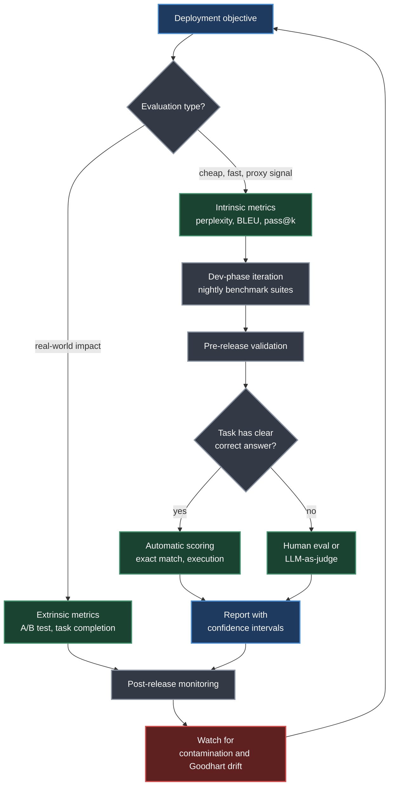
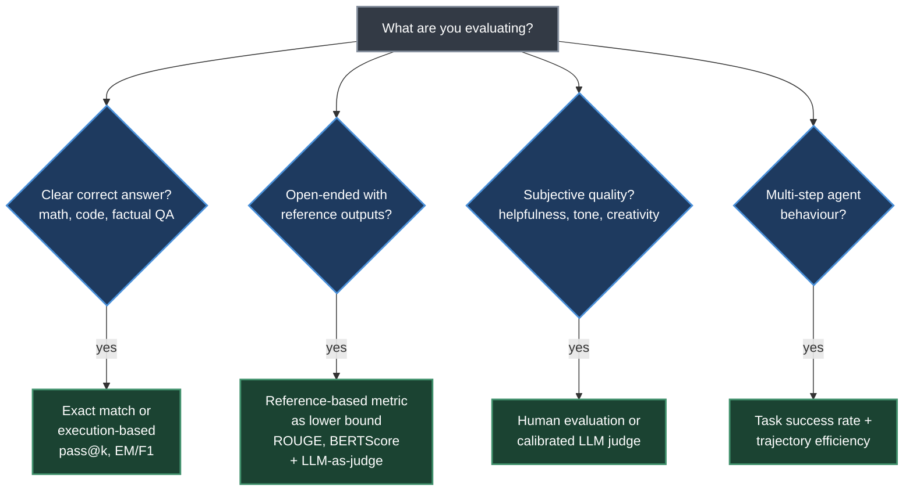
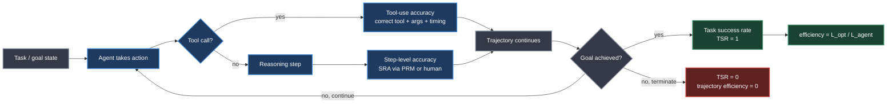
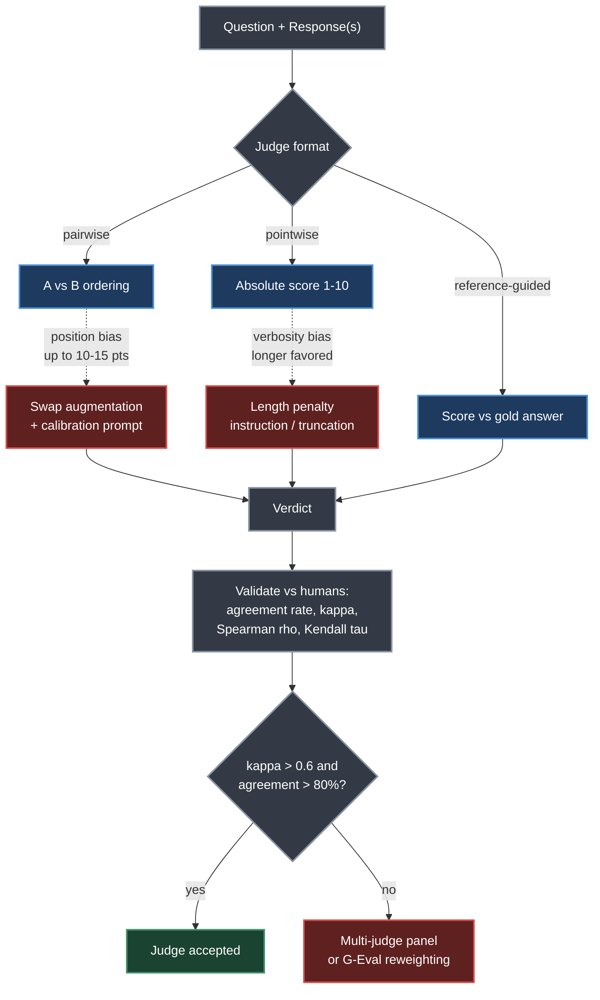
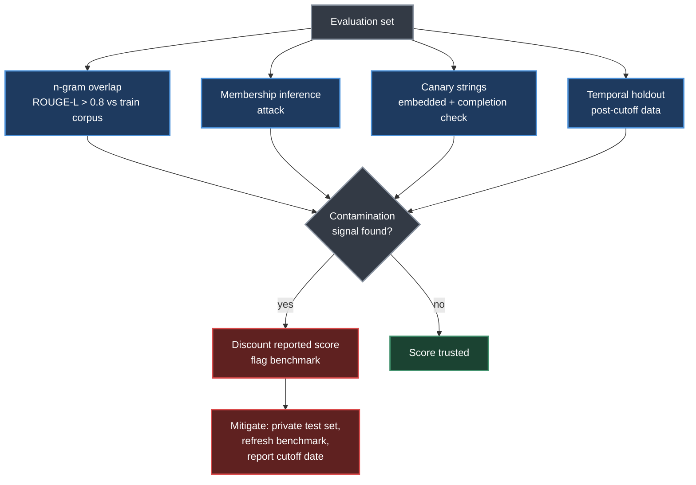

# Chapter 14. LLM Evaluation

> *"Evaluation is the backbone of any rigorous machine learning pipeline, yet it is perhaps the most underappreciated component in the development of large language models."*
> — Roitman, Chapter 14

**Part IV — Evaluation** · Book pages 287–303 · ~22 min read

[← Chapter 13. RL for Large Reasoning Models](13-rl-for-large-reasoning-models.md) · [Index](../README.md) · [Chapter 15. Introduction to Agentic AI →](15-introduction-to-agentic-ai.md)

---

## What This Chapter Is About

Classical supervised learning has it easy: a held-out test set with ground-truth labels gives a clean, automatic signal. Large language model (LLM) evaluation does not have that luxury. Three properties make it structurally harder: the output space is unbounded (a model can produce any string, and there is rarely one correct answer), quality is multidimensional (helpfulness, factuality, safety, coherence, and style can trade off against each other), and — most subtly — evaluation is itself a language task, so a judge model inherits the same failure modes as the model it is judging.

This chapter builds a complete evaluation stack: the taxonomy that drives metric choice before data collection; human annotation pipelines and the statistics (Cohen's kappa, Fleiss' kappa) that make agreement measurable; synthetic data generation (Self-Instruct, Evol-Instruct, Constitutional AI) that reduces dependence on human labels; ranking systems (ELO, Bradley-Terry, TrueSkill) that turn preferences into leaderboards; reference-based and reference-free metrics for generation, code, and QA; metrics purpose-built for multi-step agentic tasks; and LLM-as-judge itself, with its position and verbosity biases and the calibration machinery used to trust it.

It closes with the pitfalls that quietly invalidate results in production — contamination, adaptive overfitting, and Goodhart's Law — because a rigorous-looking metric is worthless once the number stops reflecting reality.

## Table of Contents

- [The Mental Model](#the-mental-model)
- [14.1 Evaluation Scheme Design](#141-evaluation-scheme-design)
- [14.2 Data Collection for Evaluation](#142-data-collection-for-evaluation)
- [14.3 Synthetic Data Generation for Evaluation](#143-synthetic-data-generation-for-evaluation)
- [14.4 Metrics for Ranking Tasks](#144-metrics-for-ranking-tasks)
- [14.5 Metrics for Generation Tasks](#145-metrics-for-generation-tasks)
- [14.6 Metrics for Agentic Tasks](#146-metrics-for-agentic-tasks)
- [14.7 LLM-as-Judge](#147-llm-as-judge)
- [14.8 Evaluation Pitfalls](#148-evaluation-pitfalls)
- [Key Formulas](#key-formulas)
- [Decision Guide](#decision-guide)
- [Common Pitfalls](#common-pitfalls)
- [Summary](#summary)
- [Practitioner Checklist](#practitioner-checklist)
- [Going Deeper](#going-deeper)

---

## The Mental Model

*The evaluation pipeline as a closed loop: intrinsic metrics drive fast development iteration, extrinsic metrics validate before and after release, and the loop is never trusted blindly — it is continuously checked for contamination and Goodhart-style drift.*

The loop mirrors the book's three-phase strategy for a dialogue assistant: in **development**, cheap automatic metrics (perplexity, ROUGE on summarization sub-tasks, pass@k on tool use) plus nightly benchmark suites (MMLU, HellaSwag, HumanEval) drive rapid iteration. In **pre-release**, a human preference study against the previous checkpoint and LLM-as-judge pairwise comparison across a diverse prompt set validate the candidate. In **post-release**, extrinsic metrics — user satisfaction, task completion rate — and watch for prompt distribution shift take over. No single metric survives all three phases.

---

## 14.1 Evaluation Scheme Design

Before collecting a single data point, decide what to measure and how. A principled taxonomy prevents the common mistake of picking metrics for convenience rather than alignment with the deployment objective.

Three axes structure every evaluation design decision:

- **Intrinsic vs. extrinsic.** Intrinsic evaluation measures output properties in isolation — perplexity on a held-out corpus, BLEU against references, pass@k on code. Extrinsic evaluation measures downstream impact: does the LLM reduce ticket escalation, or increase developer velocity? Intrinsic metrics are cheap and reproducible but poorly correlated with real-world utility; extrinsic metrics are expensive but measure what actually matters. Use intrinsic metrics for iteration, extrinsic for final validation.
- **Automatic vs. human.** Automatic evaluation uses deterministic functions (BLEU, exact match) or learned models (BERTScore, LLM-as-judge); human evaluation uses annotators to rate or rank outputs.
- **Reference-based vs. reference-free.** Reference-based metrics (BLEU, ROUGE, BERTScore) compare output to gold references; reference-free metrics (perplexity, LLM-as-judge, human preference) score without one — essential when the output space is too large for exhaustive reference collection, as in open-ended dialogue.

**Table 14.1 — Taxonomy of evaluation approaches and trade-offs**

| Type | Cost | Speed | Reproducibility | Validity |
|---|---|---|---|---|
| Automatic (rule-based) | Very low | Very fast | Perfect | Low–Medium |
| Automatic (model-based) | Low | Fast | High | Medium–High |
| Crowdsourced human | Medium | Days | Medium | Medium |
| Expert human | High | Weeks | Low–Medium | High |
| Extrinsic / A/B test | Very high | Months | Low | Very high |

### When to Use What

The book gives a direct decision framework for task-to-metric mapping:

*Four questions about the task determine the metric family — the branches are not mutually exclusive; a real pipeline runs several in parallel.*

---

## 14.2 Data Collection for Evaluation

High-quality evaluation data is the foundation of trustworthy benchmarks.

### Human Annotation Pipelines

A robust pipeline has five stages: (1) **task definition** — what is rated, on what scale, with what criteria; ambiguity here propagates into noisy labels; (2) **guideline development** — worked examples covering edge cases, iterated with a pilot group; (3) **recruitment and training** — annotators with relevant background, plus a calibration session labeling shared examples and discussing disagreements; (4) **quality control** — embed gold-standard examples and flag annotators below an accuracy threshold; (5) **aggregation** — majority vote, averaging, or a probabilistic model such as Dawid–Skene.

### Inter-Annotator Agreement

Raw agreement (the fraction of items where all annotators agree) is inadequate because it ignores chance agreement. Two chance-corrected measures are standard.

**Cohen's kappa** (two annotators), given observed agreement $p_o$ and expected agreement under independence $p_e$:

$$\kappa = \frac{p_o - p_e}{1 - p_e}, \qquad p_e = \sum_{c=1}^{k} p_{1c} \cdot p_{2c}$$

where $p_{jc}$ is the proportion of items annotator $j$ assigned to category $c$. Kappa ranges from $-1$ (perfect disagreement) through 0 (chance agreement) to 1 (perfect agreement). Values above 0.6 are generally acceptable; above 0.8 is strong agreement.

**Fleiss' kappa** generalizes this to $n$ annotators over $N$ items and $k$ categories, using $\bar{P}$ (mean observed per-item agreement) and $P_e$ (mean expected agreement): $\kappa_F = (\bar{P} - P_e) / (1 - P_e)$.

> [!WARNING]
> Kappa is sensitive to category prevalence: when one category dominates, kappa can be low even with high raw agreement (the **kappa paradox**). For ordinal scales — the 1–5 Likert scales common in LLM evaluation — always report **weighted kappa**, which penalizes disagreements proportionally to their distance.

### Annotation Guideline Design

Effective guidelines share four properties: **operationalized criteria** (replace "helpful" with observable behaviors); **worked examples** (at least two per rating level, including borderline cases); **decision trees** for complex tasks, reducing cognitive load; and **explicit scope**, stating what to ignore (e.g., "do not penalize stylistic preferences; focus only on factual accuracy").

### Crowdsourcing vs. Expert Annotation

**Table 14.2 — Crowdsourcing vs. expert annotation**

| Dimension | Crowdsourcing | Expert Annotation |
|---|---|---|
| Cost per item | Low ($0.01–$0.10) | High ($1–$50) |
| Throughput | Very high | Low |
| Domain knowledge | Low | High |
| Consistency | Variable | High |
| Suitable tasks | Simple preference, fluency | Technical accuracy, safety |
| Platforms | MTurk (Amazon Mechanical Turk), Prolific, Scale AI | Domain specialists, in-house |
| Quality control | Gold examples, attention checks | Calibration sessions, peer review |

For safety-critical evaluation, expert annotation is non-negotiable; for large-scale preference collection, crowdsourcing with rigorous quality control is often the only feasible option.

---

## 14.3 Synthetic Data Generation for Evaluation

Human annotation is expensive and slow. Synthetic data generation uses LLMs themselves to produce evaluation data at scale.

### LLM-as-Judge Calibration

When an LLM generates evaluation labels, its scores must be calibrated against human judgments. Given human preference score $h_i \in [0,1]$ and judge score $\hat{h}_i$, calibration error is the **Expected Calibration Error (ECE)**:

$$\text{ECE} = \sum_{b=1}^{B} \frac{|B_b|}{n} \left| \text{acc}(B_b) - \text{conf}(B_b) \right|$$

where $B_b$ is the $b$-th confidence bin, $\text{acc}(B_b)$ is the fraction of items in the bin where the judge agrees with humans, and $\text{conf}(B_b)$ is the mean judge confidence in that bin. A well-calibrated judge satisfies $E[\hat{h}_i \mid \hat{h}_i = p] = p$ for all $p$. Calibration is improved by **temperature scaling** — dividing the judge's raw logit $z$ by a temperature $T$ tuned on a held-out set to minimize negative log-likelihood.

### Bootstrapping Methods

| Method | Mechanism | Key detail |
|---|---|---|
| **Self-Instruct** | Bootstraps instruction data from a seed set; samples 8 tasks as few-shot examples to prompt the LLM for new tasks, then filters and adds them back to the pool | 175 seed tasks; near-duplicates filtered at ROUGE-L similarity > 0.7 |
| **Evol-Instruct** | Evolves seed instructions via *in-depth* evolution (add constraints, more reasoning steps, deeper domain knowledge) and *in-breadth* evolution (new instruction on a related topic) | Elimination filter rejects copies, refusals ("I'm sorry"), and shorter-than-original rewrites |
| **Constitutional AI (CAI)** | Model critiques and revises its own outputs against a written "constitution"; supervised phase produces SFT targets, RL phase trains a preference model from original-vs-revised pairs | Generates preference data without human exposure to harmful content |
| **Distillation** | A powerful teacher (e.g., GPT-4) generates scores + rationales on (prompt, response) pairs; a smaller model is fine-tuned on these triples as a student judge | Must be validated against held-out human annotations before trust |
| **Arena-style pairwise** | Chatbot Arena: users submit prompts, vote on anonymized model pairs | Anonymization prevents brand bias; near-duplicate prompts are deduplicated |

> [!WARNING]
> **Distillation bias.** A student judge distilled from a single teacher inherits that teacher's biases: verbosity bias (preferring longer responses), self-enhancement bias (if the teacher is also the model being evaluated), and positional bias. Always validate distilled judges against independent human annotations.

---

## 14.4 Metrics for Ranking Tasks

When the goal is to rank models, pairwise comparison data is more reliable than absolute scores.

### ELO Rating System

Borrowed from chess, ELO assigns each model a scalar rating $R$. The probability that model A beats model B is a logistic function of the rating gap:

$$P(A \succ B) = \sigma\left(\frac{R_A - R_B}{s}\right) = \frac{1}{1 + e^{-(R_A - R_B)/s}}, \qquad s = \frac{400}{\ln 10} \approx 173.7$$

so a 400-point gap corresponds to 10:1 odds. After each game with outcome $S_A \in \{0, 0.5, 1\}$, ratings update as $R_A \leftarrow R_A + K(S_A - E_A)$ — Chatbot Arena uses $K = 4$. This is stochastic gradient descent on the logistic-model log-likelihood: each game is a noisy gradient step, and $K$ trades adaptation speed for stability. Because ratings depend on game order, confidence intervals need **bootstrap resampling**: resample the battle log with replacement $B = 1000$ times, recompute ELO from scratch each time, and report the 2.5th/97.5th percentiles.

### Bradley-Terry Model

The Bradley-Terry (BT) model is a maximum-likelihood alternative that uses the full battle history at once rather than processing games sequentially. Given strength parameters $\beta_i > 0$:

$$P(i \succ j) = \frac{\beta_i}{\beta_i + \beta_j}$$

Working in log-space with $\theta_i = \log \beta_i$ gives $P(i \succ j) = \sigma(\theta_i - \theta_j)$ — equivalent to logistic regression with item-specific intercepts. The BT model is identifiable only up to a multiplicative constant, normalized by $\sum_i \log \beta_i = 0$.

### TrueSkill

TrueSkill is a Bayesian rating system modeling each model's skill as a Gaussian $s_i \sim \mathcal{N}(\mu_i, \sigma_i^2)$, with performance $p_i = s_i + \epsilon_i$ where $\epsilon_i \sim \mathcal{N}(0, \beta^2)$ is game noise; the posterior updates via expectation propagation after each outcome. Its distinguishing feature is the uncertainty estimate $\sigma_i$ itself, useful for flagging which models most need more evaluation data.

### Win Rate with Confidence Intervals

The simplest ranking metric is win rate $\hat{p} = w/n$ over $n$ comparisons with $w$ wins. A **Wilson score interval** is preferred over the naive Wald interval because it has better coverage near $p=0$ and $p=1$:

$$\text{CI} = \frac{\hat{p} + \frac{z^2}{2n} \pm z\sqrt{\frac{\hat{p}(1-\hat{p})}{n} + \frac{z^2}{4n^2}}}{1 + \frac{z^2}{n}}, \qquad z = 1.96 \text{ (95% interval)}$$

For multi-way comparisons, compute win rate against a fixed baseline model for comparability.

### Chatbot Arena Methodology

Chatbot Arena combines these elements into a production-scale system: (1) users submit prompts and get responses from two anonymized models; (2) users vote for the preferred response or declare a tie; (3) votes are aggregated with the BT model into a leaderboard; (4) bootstrap confidence intervals are reported per model; (5) models with overlapping intervals are treated as statistically indistinguishable. As of 2024, Chatbot Arena has collected over one million human preference votes — the largest publicly available LLM preference dataset.

---

## 14.5 Metrics for Generation Tasks

Generation metrics quantify output quality for tasks with references or well-defined correctness.

**BLEU** (Bilingual Evaluation Understudy) measures n-gram precision against references $R$:

$$\text{BLEU} = BP \cdot \exp\left(\sum_{n=1}^{N} w_n \log p_n\right), \qquad BP = \begin{cases} 1 & |h| > |r| \\ e^{1 - |r|/|h|} & |h| \le |r| \end{cases}$$

where $p_n$ is n-gram precision clipped to the max reference count. BLEU was designed for translation with multiple references; on open-ended generation with a single reference it is often near zero even for good output, misses paraphrases, and is tokenization-sensitive — use it only with multiple diverse references on low-diversity tasks.

**ROUGE** is a recall-oriented family for summarization: ROUGE-N counts matched n-grams over reference n-gram totals; ROUGE-L uses the longest common subsequence (LCS) ratio $\text{LCS}(h,r)/|r|$; an F-measure variant balances precision and recall.

**BERTScore** computes token-level cosine similarity between contextual embeddings of hypothesis and reference tokens, combined into an F1 ($F_{\text{BERT}} = 2 \cdot P_{\text{BERT}} R_{\text{BERT}} / (P_{\text{BERT}} + R_{\text{BERT}})$). It correlates better with human judgment than BLEU/ROUGE, especially for paraphrases; inverse-document-frequency (IDF) weighting improves correlation further.

**METEOR** fixes BLEU's recall blindness with an F-score over unigram matches plus stemming/synonym matching: $\text{METEOR} = F_{\text{mean}} \cdot (1 - \text{Pen})$, where $F_{\text{mean}} = 10PR/(R+9P)$ and $\text{Pen} = 0.5 \cdot (c/u_m)^3$ penalizes non-contiguous matches ($c$ = chunks, $u_m$ = matched unigrams).

**Perplexity** measures next-token prediction quality on held-out text: $\text{PPL} = \exp\left(-\frac{1}{T}\sum_t \log P_\theta(w_t \mid w_{1:t-1})\right)$. Lower is better; comparable only across models sharing tokenization and test set — best used as a sanity check or distribution-shift detector.

**Pass@k** estimates the probability that at least one of $k$ generated code samples passes all tests, from $n$ total samples with $c$ passing:

$$\text{pass@}k = \mathbb{E}_{\text{problems}}\left[1 - \frac{\binom{n-c}{k}}{\binom{n}{k}}\right]$$

This unbiased estimator avoids the high variance of sampling exactly $k$ solutions directly (when $n - c < k$, the estimator is defined as 1.0). In practice $n=200$ samples are generated and pass@1, pass@10, pass@100 reported; worked example with $n=200$, $c=15$ passing: pass@1 = 0.0750, pass@10 = 0.5391, pass@100 = 0.9999.

**Exact Match (EM) and Token F1** are standard for extractive QA (e.g., SQuAD): EM is a binary indicator of exact string match after normalization (lowercasing, removing articles/punctuation); token F1 treats prediction and gold as token bags, $F1 = 2 \cdot |\text{pred} \cap \text{gold}| / (|\text{pred}| + |\text{gold}|)$, taking the max over multiple gold answers.

**Table 14.3 — Generation metrics: applicability and human correlation**

| Metric | Task | Reference-free? | Human correlation |
|---|---|---|---|
| BLEU | Translation | No | Low–Medium |
| ROUGE | Summarization | No | Medium |
| BERTScore | General NLG (natural language generation) | No | High |
| METEOR | Translation | No | Medium–High |
| Perplexity | LM quality | Yes | Low |
| Pass@k | Code generation | No (tests) | Very high |
| Exact Match | Extractive QA | No | Very high |
| Token F1 | Extractive QA | No | High |

---

## 14.6 Metrics for Agentic Tasks

Agentic LLMs act in environments and complete multi-step tasks; generation metrics are insufficient.

*Every agent trajectory generates four independent measurements — tool-use accuracy, step-level reasoning accuracy, task success, and trajectory efficiency — collected concurrently, not as separate evaluation passes.*

**Task success rate (TSR)** is the fraction of tasks reaching the goal state, $\text{TSR} = \frac{1}{|T|}\sum_{\tau \in T} \mathbb{1}[\text{goal}(\tau) \text{ achieved}]$, verified by a deterministic oracle (database state, filesystem state, test execution). A graded variant, $\text{TSR}_{\text{graded}}$, allows partial credit in $[0,1]$.

**Trajectory efficiency** $\eta = L^* / L_{\text{agent}}$ compares the optimal length $L^*$ to the agent's actual length; $\eta \in (0,1]$, with $\eta=1$ optimal and $\eta=0$ for failures. The **redundancy rate** — actions absent from any optimal trajectory — is complementary.

**Tool-use accuracy (TUA)** is $\text{TUA} = \#\text{correct tool calls} / \#\text{total tool calls}$; a call is correct only if the right tool, valid arguments, and appropriate timing all hold, with partial credit for correct tool + bad arguments.

**Step-level reasoning accuracy (SRA)**, for multi-hop QA or math, is $\text{SRA} = \frac{1}{|T|}\sum_\tau \frac{1}{|S_\tau|}\sum_{s \in S_\tau} \mathbb{1}[s \text{ correct}]$, verified by a process reward model (PRM) or human annotation.

**SWE-bench** evaluates software engineering tasks: given a GitHub issue and repository, the model generates a unified-diff patch, applied and scored against the repo's test suite (% Resolved). SWE-bench Verified is a 500-problem human-curated, unambiguous subset; SWE-bench Lite a 300-problem subset for faster iteration.

**WebArena** evaluates web navigation across 812 tasks in five sandboxed applications, scored by functional (application-state), URL-based, or program-based (custom-script) evaluation.

**Table 14.4 — Agentic evaluation benchmarks**

| Benchmark | Domain | # Tasks | Eval method | SOTA (state of the art) |
|---|---|---|---|---|
| SWE-bench | Software engineering | 2,294 | Test execution | ~43% |
| SWE-bench Lite | Software engineering | 300 | Test execution | ~50% |
| WebArena | Web navigation | 812 | State / URL / program | ~40% |
| ALFWorld | Household tasks | 3,553 | Simulator state | ~90% |
| AgentBench | Multi-domain | 1,091 | Task-specific | ~45% |

> [!NOTE]
> As of 2024: on SWE-bench Verified, the best open-source agent resolves ~43% of issues vs. ~87% human performance (15 min/task allotted); API eval costs ~$0.25/task. On WebArena, humans reach ~78% vs. ~35–45% for SOTA agents.

---

## 14.7 LLM-as-Judge

LLM-as-judge uses a capable LLM to evaluate other (or the same) models' outputs, scaling past human annotation while producing rationales alongside verdicts.

*Both dashed edges mark where bias enters the judging process — position bias attaches to pairwise ordering, verbosity bias attaches to absolute scoring — and each has a dedicated mitigation before the verdict is trusted.*

### Prompt Templates

Three formats dominate. **Pointwise scoring** assigns an absolute score (e.g., 1–10) for helpfulness, accuracy, and clarity, with reasoning required before the score. **Pairwise comparison** shows two responses and asks the judge to output exactly `[[A]]`, `[[B]]`, or `[[C]]` (tie), again after a reasoning trace. **Reference-guided scoring** rates the response against a gold answer — useful where the judge's own knowledge may be unreliable.

### Position and Verbosity Bias

**Position bias** — a systematic preference for whichever response appears first or last — can swing verdicts by as much as 10–15 percentage points. Four mitigations: **swap augmentation** (evaluate both orderings; treat inconsistent verdicts as ties); **calibration prompting** (instruct the judge that order shouldn't matter); **ensemble judging** (aggregate verdicts across judges with different orderings); and **chain-of-thought forcing** (require a rationale before the verdict).

> [!WARNING]
> **Verbosity bias.** LLM judges systematically prefer longer responses even when the extra content is irrelevant. Mitigate with an explicit length-penalty instruction, or by truncating responses to a fixed length before judging.

### Multi-Judge Panels

A single judge carries systematic biases; a panel from different model families is more robust. Given $J$ judges with verdicts $v_1, \ldots, v_J \in \{A, B, \text{tie}\}$, the panel verdict is majority vote and panel agreement is $\text{Agreement} = \frac{1}{\binom{J}{2}} \sum_{i<j} \mathbb{1}[v_i = v_j]$.

**Panel confidence rubric (three-judge panel)**

| Verdict pattern | Confidence level |
|---|---|
| Unanimous (3-0) | High confidence |
| 2–1 split | Medium confidence |
| Three-way tie | Low confidence |

### Agreement Metrics

Judge quality is validated against human annotations on a held-out set using four metrics: **agreement rate**, **Cohen's kappa** (chance-corrected), **Spearman's rho** (rank correlation for ordinal ratings), and **Kendall's tau** (a rank correlation more robust to ties). A judge is reliable if it achieves $\kappa > 0.6$ and agreement rate $> 80\%$ against humans on a representative sample.

### G-Eval Framework

G-Eval structures LLM-based evaluation with chain-of-thought prompting and token-probability weighting, in three steps: (1) prompt the LLM to generate a detailed evaluation rubric; (2) for each score $s \in \{1,\ldots,5\}$, obtain $\log P_\theta(s \mid \text{prompt, steps, response})$ and take the probability-weighted average:

$$\text{G-Eval score} = \sum_{s=1}^{5} s \cdot \frac{e^{\log P_\theta(s)}}{\sum_{s'=1}^{5} e^{\log P_\theta(s')}}$$

(3) normalize by the maximum score. Standard prompting asks for one output token (e.g., "4"), discarding uncertainty; G-Eval reads the full probability distribution over score tokens instead — like using a posterior's mean rather than its mode — achieving higher human correlation, especially on nuanced dimensions like coherence.

---

## 14.8 Evaluation Pitfalls

Even carefully designed pipelines produce misleading results if these failure modes go unchecked.

*Four independent detection signals feed one contamination decision — no single method is trusted alone, since n-gram overlap misses paraphrase, and canary strings only catch verbatim inclusion.*

### Benchmark Contamination

Contamination occurs when evaluation data leaks into training, verbatim or paraphrased, inflating scores without reflecting true generalization. Detection: **n-gram overlap** (flag eval examples with high overlap, e.g. ROUGE-L > 0.8, against the training corpus); **membership inference** (estimate the probability an example was in training); **canary strings** (embed unique random strings and check if the model completes them); **temporal holdout** (eval data created after the training cutoff). Mitigation: a private test set never released publicly, regular benchmark refreshes, and reported cutoff dates and decontamination procedures.

### Overfitting and Goodhart's Law

Even without direct contamination, models can be implicitly optimized for specific benchmarks through repeated evaluation and hyperparameter tuning — **adaptive overfitting**, where the benchmark leaks into development decisions. MMLU, once a hard world-knowledge test, now sees near-human performance while the same models still fail novel knowledge tasks; new benchmarks are temporary signal sources, not permanent ground truth.

This is **Goodhart's Law**: "when a measure becomes a target, it ceases to be a good measure." It appears as **reward hacking** (RLHF models exploit the reward model with verbose, confident but wrong responses), **metric gaming** (models fine-tuned to maximize BLEU/ROUGE score well but help less), and **judge gaming** (models trained on LLM-as-judge feedback learn the judge's biases instead of real quality).

**Defenses:** metric diversity, held-out metrics never used in training or model selection, regular human spot-checks, adversarial evaluation probing for what automated metrics miss, and periodic extrinsic validation of intrinsic metrics.

### Additional Pitfalls

**Prompt sensitivity** — performance shifts with small prompt changes (e.g., "Think step by step"); report the exact prompt and test variants. **Aggregation artefacts** — averaging across tasks of different difficulty can hide a strong-on-easy/weak-on-hard model behind a uniform-looking average. **Selection bias in human evaluation** — crowdsourced annotators are not a random sample of end users. **Evaluation–deployment mismatch** — benchmark prompts are shorter and cleaner than the noisy, multi-turn queries seen in production.

> [!IMPORTANT]
> **Key questions before deploying an evaluation pipeline:** Does the metric align with the deployment objective? Is the data representative of the target distribution? Have contamination and overfitting risks been assessed? Are confidence intervals reported? Is it reproducible (fixed seeds, versioned prompts, public test sets)? Has it been validated against human judgment or extrinsic outcomes?

---

## Key Formulas

| Formula | What it computes |
|---|---|
| `kappa = (p_o - p_e) / (1 - p_e)` | Cohen's kappa (two-annotator, chance-corrected) |
| `kappa_F = (P_bar - P_e) / (1 - P_e)` | Fleiss' kappa (multi-annotator) |
| `ECE = sum_b (\|B_b\|/n) \|acc(B_b) - conf(B_b)\|` | Expected Calibration Error of an LLM judge |
| `P(A>B) = 1 / (1 + 10^((R_B-R_A)/400))` | ELO expected score |
| `R_A <- R_A + K(S_A - E_A)` | ELO update (Chatbot Arena: K = 4) |
| `P(i>j) = beta_i / (beta_i + beta_j)` | Bradley-Terry win probability |
| `CI = [p_hat + z^2/2n +/- z*sqrt(p_hat(1-p_hat)/n + z^2/4n^2)] / (1 + z^2/n)` | Wilson score CI on win rate (z = 1.96) |
| `BLEU = BP * exp(sum_n w_n log p_n)` | n-gram precision with brevity penalty |
| `ROUGE-L = LCS(h,r) / \|r\|` | LCS-based recall |
| `F_BERT = 2 P_BERT R_BERT / (P_BERT + R_BERT)` | BERTScore F1 |
| `METEOR = F_mean * (1 - Pen)` | Unigram F-score with fragmentation penalty |
| `PPL = exp(-(1/T) sum_t log P(w_t\|w_<t))` | Perplexity |
| `pass@k = E[1 - C(n-c,k)/C(n,k)]` | Probability >=1 of k samples passes |
| `F1 = 2\|pred ∩ gold\| / (\|pred\| + \|gold\|)` | Token-level F1 (extractive QA) |
| `TSR = (1/\|T\|) sum 1[goal achieved]` | Task success rate |
| `eta = L_opt / L_agent` | Trajectory efficiency |
| `TUA = correct_tool_calls / total_tool_calls` | Tool-use accuracy |
| `G-Eval = sum_s s * softmax(log P(s))` | Probability-weighted judge score |

---

## Decision Guide

| You want to... | Use | Because |
|---|---|---|
| Rank models from a full battle log / a live stream | Bradley-Terry / ELO | BT uses all data via MLE; ELO updates cheaply online (K-factor tunes speed) |
| Flag which model needs more eval data | TrueSkill | Explicit per-model uncertainty (`sigma`) |
| Score code correctness at scale | Pass@k with execution | Reference-free, execution-grounded, very high human correlation |
| Score open-ended generation cheaply during dev | ROUGE / BERTScore | BERTScore correlates far better than BLEU/ROUGE alone |
| Score subjective quality at scale | Calibrated LLM-as-judge, pairwise + swap augmentation | Scales past human annotation; swap augmentation controls position bias |
| Validate a judge before trusting it | Agreement rate + Cohen's kappa vs. held-out humans | Reliable only above kappa > 0.6, agreement > 80% |
| Evaluate a multi-step agent | TSR + trajectory efficiency + tool-use accuracy | Captures completion, efficiency, and step quality together |
| Guard against inflated benchmark scores | n-gram overlap + canary strings + temporal holdout | No single check catches both verbatim and paraphrased leakage |

---

## Common Pitfalls

> [!WARNING]
> **Kappa paradox.** When one annotation category dominates, kappa can read low even though raw agreement is high — inspect the category distribution alongside kappa, and use weighted kappa for Likert-scale ratings.

> [!WARNING]
> **BLEU on open-ended generation.** With a single reference and high output diversity, BLEU collapses toward zero even for genuinely good responses. Reserve it for multi-reference, low-diversity tasks like translation.

> [!WARNING]
> **Benchmark contamination and adaptive overfitting.** A model can look state-of-the-art on MMLU while still failing novel knowledge tasks — either the benchmark leaked into training, or the community has implicitly optimized for it. Neither requires malicious intent.

> [!WARNING]
> **Goodhart's Law via judge gaming.** A policy trained against LLM-as-judge feedback can learn the judge's biases (verbosity, confident tone) instead of genuine quality — the same reward-hacking dynamic as classic RLHF, with an LLM standing in for the reward model.

## Summary

- Evaluation design starts with a taxonomy, not a metric: intrinsic-vs-extrinsic, automatic-vs-human, and reference-based-vs-free jointly determine which metric family is valid for a task.
- Inter-annotator agreement must be chance-corrected — Cohen's kappa (two annotators) or Fleiss' kappa (multiple) — with values above 0.6 acceptable, above 0.8 strong; the kappa paradox means raw agreement alone can mislead.
- Synthetic evaluation data (Self-Instruct's 175-seed bootstrapping, Evol-Instruct's in-depth/in-breadth evolution, Constitutional AI's critique-and-revise pipeline, teacher-model distillation) scales past annotation cost but inherits the generating model's biases unless validated against humans.
- Pairwise ranking systems trade off differently: ELO updates online with a tunable K-factor (K = 4 in Chatbot Arena) and needs 1000-resample bootstrap intervals; Bradley-Terry uses the full battle log via MLE; TrueSkill adds a per-model uncertainty estimate.
- BLEU and ROUGE correlate weakly to moderately with human judgment; BERTScore's embedding similarity correlates far better, and pass@k, Exact Match, and Token F1 correlate "very high" because they're execution- or string-grounded, not surface-overlap.
- Agentic evaluation needs four concurrent signals — task success rate, trajectory efficiency (`eta = L_opt/L_agent`), tool-use accuracy, and step-level reasoning accuracy — since a completed task can still be inefficient, and an efficient one can still fail.
- LLM-as-judge is trustworthy only after bias mitigation: position bias (10–15 points) via swap augmentation and chain-of-thought forcing, verbosity bias via length penalties, single-judge unreliability via multi-judge panels scored on unanimous/split/tie confidence tiers.
- G-Eval improves on discrete-token judge scoring by reading the full probability distribution over score values, rather than discarding uncertainty at a single sampled token.
- Contamination detection needs multiple independent signals (n-gram overlap, membership inference, canary strings, temporal holdout) since no single method catches both verbatim and paraphrased leakage — and Goodhart's Law means any single optimized-for metric eventually stops measuring what it was built to measure.

## Practitioner Checklist

- [ ] Pick metrics from the intrinsic/extrinsic, reference-based/free taxonomy before collecting data, not after.
- [ ] Report weighted kappa (not raw agreement) for Likert-scale annotation tasks.
- [ ] Embed gold-standard examples in every annotation queue; flag annotators below the accuracy threshold.
- [ ] Validate any distilled or synthetic-data judge against independent held-out human annotations.
- [ ] Report bootstrap confidence intervals (B = 1000) alongside any ELO or Bradley-Terry leaderboard score.
- [ ] Use pass@k with real test execution for code, not surface-level string matching.
- [ ] Prefer BERTScore over BLEU/ROUGE for open-ended generation; reserve BLEU for multi-reference tasks.
- [ ] Log task success rate, trajectory efficiency, and tool-use accuracy from the same trajectories, not separately.
- [ ] Run every judge pairwise comparison in both orderings, with chain-of-thought before the verdict.
- [ ] Accept a judge only above kappa > 0.6 and agreement > 80% vs. humans; escalate to a panel otherwise.
- [ ] Screen for contamination with at least two independent methods before publishing results.
- [ ] Maintain a private, never-released test set and refresh public benchmarks periodically.
- [ ] Report the exact evaluation prompt used and test at least one alternative phrasing.

## Going Deeper

- **Chatbot Arena** [433] — crowdsourced pairwise-battle platform behind the ELO/Bradley-Terry leaderboard methodology of §14.4 and §14.6.
- **Self-Instruct** [371] and **Evol-Instruct** [398] — the two dominant instruction-bootstrapping algorithms for synthetic evaluation data.
- **Constitutional AI (CAI)** [16] — critique-and-revise preference data generation without human exposure to harmful content.
- **G-Eval** [231] — chain-of-thought plus token-probability-weighted LLM-as-judge scoring.
- **BERTScore** [426], **METEOR** [19], **BLEU** [283], **ROUGE** [216] — the generation metrics of Table 14.3.
- **SWE-bench** [169], **WebArena** [440], **ALFWorld** [329], **AgentBench** [229] — the agentic benchmarks of Table 14.4.
- **MMLU** [137] — the book's running example of benchmark-lifecycle overfitting.
- **Pass@k unbiased estimator** [47] — the HumanEval-originated code-correctness metric.
- **TrueSkill** [138] — the Bayesian rating system with explicit per-model uncertainty.

> [!NOTE]
> Bracketed numbers reproduce the book's own citation markers; the supplied page range excluded the bibliography, so author/year metadata is omitted rather than guessed.

---

[← Chapter 13. RL for Large Reasoning Models](13-rl-for-large-reasoning-models.md) · [Index](../README.md) · [Chapter 15. Introduction to Agentic AI →](15-introduction-to-agentic-ai.md)

*Summary of Chapter 14 of [The Hitchhiker's Guide to Agentic AI](https://arxiv.org/abs/2606.24937)
by Haggai Roitman. Licensed CC BY-SA 4.0. Independent study notes — not affiliated with or
endorsed by the author.*
