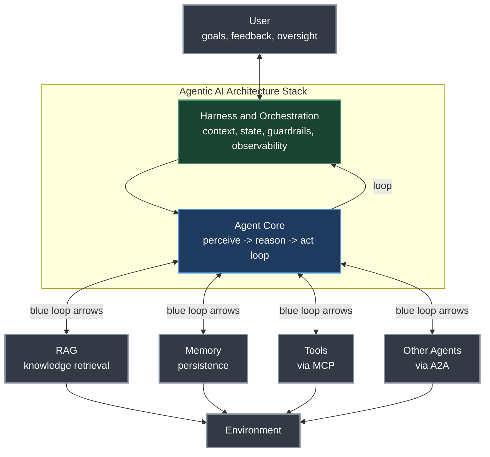
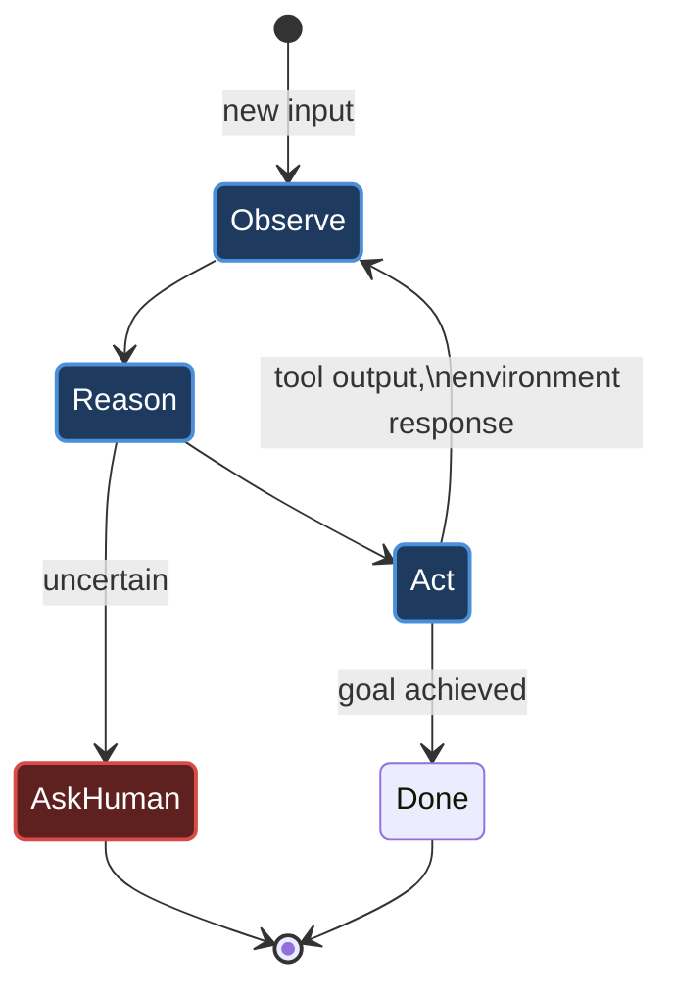
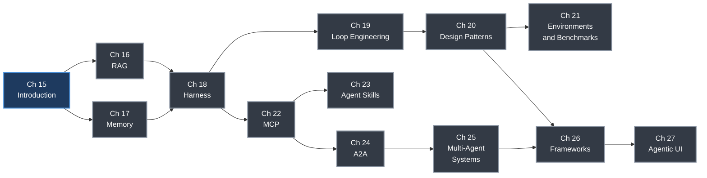

# Chapter 15. Introduction to Agentic AI

> *"An agentic AI system is one where an LLM operates in a loop: it receives observations, reasons about what to do next, takes actions, and iterates until a goal is achieved."*
> — Roitman, Chapter 15

**Part V — Agentic AI** · Book pages 305–307 · ~7 min read

[← Chapter 14. LLM Evaluation](14-llm-evaluation.md) · [Index](../README.md) · [Chapter 16. Retrieval-Augmented Generation →](16-retrieval-augmented-generation.md)

---

## What This Chapter Is About

Parts I–IV built the algorithmic toolkit: transformer architecture and GPU systems, the reinforcement learning (RL) methods that align models with human intent, the reasoning capabilities that emerge from RL training, and evaluation methodology. This chapter opens Part V, which turns to the central question of modern AI engineering: how do you deploy a trained model as an autonomous agent that perceives, plans, acts, and learns in open-ended environments?

An agentic AI system is defined by a loop, not a single forward pass: the large language model (LLM) receives observations from an environment (user messages, tool outputs, sensor data), reasons about what to do next, takes actions (tool calls, code execution, API requests), and iterates until a goal is achieved or it explicitly asks for human input. This is the structural break from the single-turn chatbot paradigm, where the model produces one response and waits.

That shift introduces five challenges a single model call cannot address on its own: persistence (remembering what it did and what failed, across turns and sessions), grounding (accessing knowledge that was not in training data), action (interacting with external systems through well-defined interfaces), coordination (delegating parts of a task too large for one agent), and safety (guardrails and human oversight for autonomous action). Part V's thirteen chapters are organized as a layered architecture, each layer solving exactly one of these problems — this chapter is the map of that stack.

## Table of Contents

- [The Mental Model](#the-mental-model)
- [What Makes a System Agentic](#what-makes-a-system-agentic)
- [The Layered Architecture](#the-layered-architecture)
- [Part V Roadmap](#part-v-roadmap)
- [Summary](#summary)
- [Practitioner Checklist](#practitioner-checklist)
- [Going Deeper](#going-deeper)

---

## The Mental Model

*Figure 15.1 (from the source): the agent core executes a perceive-reason-act loop, coordinated by the harness and orchestration layer, which manages context, state, guardrails, and observability. The agent interacts downward with external systems — RAG for knowledge, memory for persistence, tools via MCP, other agents via A2A — all grounded in an environment, while the user provides goals, feedback, and oversight from above.*

Read this diagram as two loops nested inside each other. The inner loop is the agent core itself: perceive, reason, act, repeat. The outer loop is the harness, which decides *when* the core retrieves, calls a tool, delegates, or stops to ask a human. Everything below the core — RAG, memory, tools, other agents — is an external system the harness mediates access to; everything above is the human closing the loop with goals and correction.

## What Makes a System Agentic

The source draws one sharp line: does the system run in a loop that chooses its own next action, or does it produce one response and stop? A single LLM call — even a sophisticated one — is not agentic by this definition; an agent is a model wrapped in a loop that observes its own outputs and the environment's responses, and decides whether to continue.

| | Plain LLM call | RAG pipeline | Agent |
|---|---|---|---|
| Who runs the loop | No loop — one pass | Fixed pipeline (retrieve, then generate) | The agent core, iteratively |
| Who chooses the next action | N/A | Predetermined by the pipeline | The model, at each step |
| Grounding | None beyond training data | External documents at query time | Whatever the agent decides to retrieve or call |
| Termination | After one response | After one generation | Goal achieved, or the agent asks for human input |

*The agent loop that distinguishes agentic systems from single-turn calls: observe, reason, act, and repeat — a plain LLM call or RAG pipeline exits after one pass through this cycle, while an agent keeps looping until the goal is achieved or it explicitly escalates to a human.*

> [!NOTE]
> The source text does not itself present this comparison as a table — it is derived here from the chapter's prose contrast between the "single-turn chatbot" paradigm and the agentic loop, plus the five challenges (persistence, grounding, action, coordination, safety) it lists as what a single model call cannot address.

## The Layered Architecture

The chapter lists the components as a stack, bottom to top, where each layer solves one problem:

| Layer | Chapter | Problem it solves |
|---|---|---|
| Knowledge | [16 — RAG](16-retrieval-augmented-generation.md) | Grounding: retrieving relevant documents at query time |
| Persistence | [17 — Memory](17-agentic-memory-systems.md) | Recall across a task and across sessions |
| Runtime | [18 — Harness & Orchestration](18-agent-harness-context-and-orchestration.md) | The agent "operating system": loop, context budget, tool dispatch, error recovery, state |
| Inference-time optimization | [19 — Loop Engineering](19-loop-engineering.md) | Generate-verify-retry cycles as policy optimization without weight updates |
| Architecture | [20 — Design Patterns](20-agent-design-patterns.md) | Canonical structures: ReAct, plan-then-execute, reflection |
| Evaluation | [21 — Environments & Benchmarks](21-agentic-environments-and-benchmarks.md) | Where and how to measure agentic behavior |
| Tool integration | [22 — MCP](22-model-context-protocol.md) | The standard interface between agents and tools |
| Capability | [23 — Agent Skills](23-agent-skills.md) | How agents acquire and compose specialized capabilities |
| Inter-agent protocol | [24 — A2A](24-agent-to-agent-communication.md) | Standardized discovery, delegation, and streaming between agents |
| Coordination | [25 — Multi-Agent Systems](25-multi-agent-systems.md) | Hierarchical, peer-to-peer, and swarm collaboration |
| Implementation | [26 — Frameworks](26-agent-development-frameworks.md) | Production toolkits: LangGraph, CrewAI, OpenAI Agents SDK, AutoGen |
| Interaction | [27 — Agentic UI](27-agentic-ui-frameworks.md) | How users supervise and build trust in autonomous systems |

These layers are not independent: the agent core (an LLM with the reasoning capabilities built in Parts II–III) sits at the center, executing the perceive-reason-act loop. RAG feeds it knowledge before each reasoning step; memory gives it continuity across steps and sessions. The harness coordinates everything — when to retrieve, when to call a tool, when to delegate, when to ask the human — while loop engineering formalizes the harness's retry-and-verify cycles as inference-time optimization. MCP is the standard interface to tools, and A2A is the equivalent for inter-agent communication. Design patterns define strategy; frameworks provide the concrete implementation of that strategy. The UI layer closes the loop back to the human.

## Part V Roadmap

*How the thirteen chapters of Part V build on each other: knowledge and persistence (16–17) feed the runtime (18), which loop engineering optimizes (19) and design patterns structure (20), evaluated in Chapter 21; MCP (22) unlocks skills (23) and A2A (24), which enables multi-agent systems (25); frameworks (26) implement all of it, and UI (27) exposes it to the user.*

## Summary

- Agentic AI is defined structurally: an LLM operating in a loop — observe, reason, act, iterate — until a goal is met or it asks for human input, in contrast to a single-turn chatbot that produces one response and stops.
- The source names five challenges a single model call cannot address: persistence, grounding, action, coordination, and safety — and Part V's chapters map one-to-one onto solving them.
- Production agentic systems are a layered stack, not a monolith: knowledge (RAG), persistence (Memory), runtime (Harness & Orchestration), inference-time optimization (Loop Engineering), architecture (Design Patterns), evaluation (Environments & Benchmarks), tool integration (MCP), capability (Agent Skills), inter-agent protocol (A2A), coordination (Multi-Agent Systems), implementation (Frameworks), and interaction (Agentic UI).
- The agent core reuses the reasoning capabilities built in Parts II–III; Part V is about the engineering scaffold around that core, not a new training method.
- The harness is the layer that decides when every other layer gets invoked — when to retrieve, call a tool, delegate to a sub-agent, or escalate to a human — making it the closest analogue to an operating system in this stack.
- MCP and A2A are parallel standardization layers: MCP standardizes agent-to-tool interfaces, A2A standardizes agent-to-agent interfaces.
- Design Patterns and Frameworks are strategy versus implementation: patterns (ReAct, plan-then-execute, reflection) define what to do; frameworks (LangGraph, CrewAI, OpenAI Agents SDK, AutoGen) are how it gets built in production.

## Practitioner Checklist

- [ ] Before calling a system "agentic," confirm it runs in a loop that chooses its own next action — not just a pipeline with a fixed number of stages.
- [ ] Identify which of the five challenges (persistence, grounding, action, coordination, safety) your use case actually needs; not every agent needs all five.
- [ ] Map your planned system onto the twelve-layer stack to spot which layer you are missing, not just which one you are building.
- [ ] Treat the harness as the control point: decide explicitly when it retrieves, calls tools, delegates, or escalates — don't leave this implicit in a prompt.
- [ ] Read Chapters 16–17 (RAG, Memory) before 18 (Harness) — the harness's job is to coordinate them, so understand the pieces first.
- [ ] Read Chapter 19 (Loop Engineering) as the formalization of "how many retries, how much budget" — don't hand-roll retry logic before reading it.
- [ ] Read Chapter 22 (MCP) before 23–24 (Skills, A2A) — both build on the standardized tool interface MCP defines.
- [ ] Decide single-agent vs. multi-agent only after Chapter 25 — the source frames this as a deliberate design choice with debuggable failure modes, not a default.
- [ ] Pick a framework (Chapter 26) only after the pattern (Chapter 20) is settled — frameworks implement patterns, they don't choose them for you.
- [ ] Design the human-facing UI (Chapter 27) alongside the guardrails in Chapter 18 — trust and oversight are named as a full-stack concern, not an afterthought.

## Going Deeper

- H. Roitman, *The Hitchhiker's Guide to Agentic AI: From Foundations to Systems*, arXiv:2606.24937v2 — Part V (Chapters 15–27) is the agentic systems stack this chapter introduces.
- [Chapter 13. RL for Large Reasoning Models](13-rl-for-large-reasoning-models.md) and [Chapter 14. LLM Evaluation](14-llm-evaluation.md) — the reasoning and evaluation foundations the agent core in this chapter's diagram builds on.

---

[← Chapter 14. LLM Evaluation](14-llm-evaluation.md) · [Index](../README.md) · [Chapter 16. Retrieval-Augmented Generation →](16-retrieval-augmented-generation.md)

*Summary of Chapter 15 of [The Hitchhiker's Guide to Agentic AI](https://arxiv.org/abs/2606.24937)
by Haggai Roitman. Licensed CC BY-SA 4.0. Independent study notes — not affiliated with or
endorsed by the author.*
