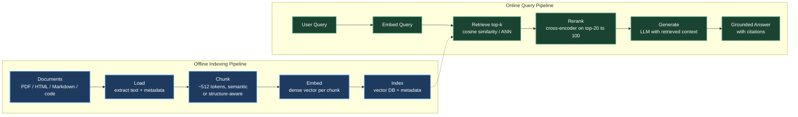
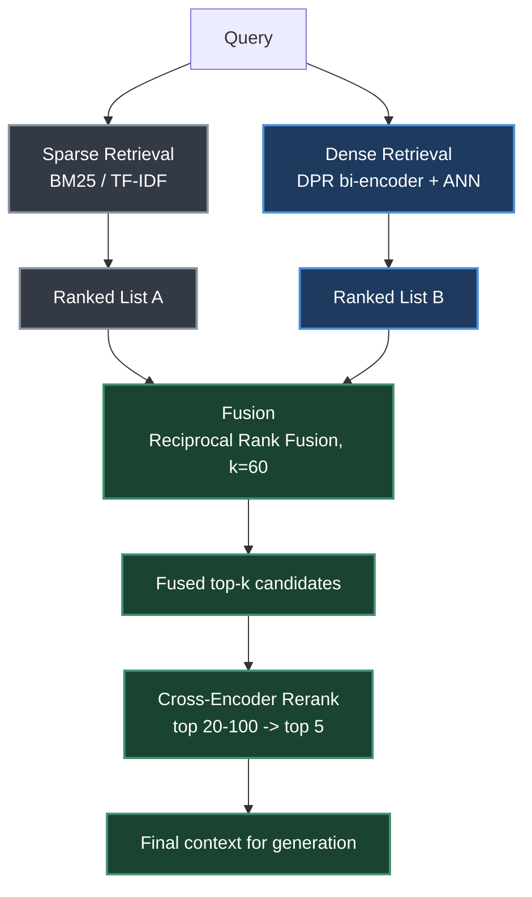
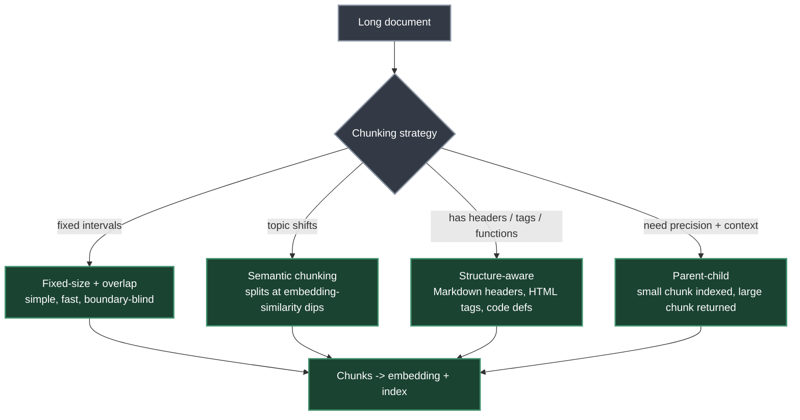
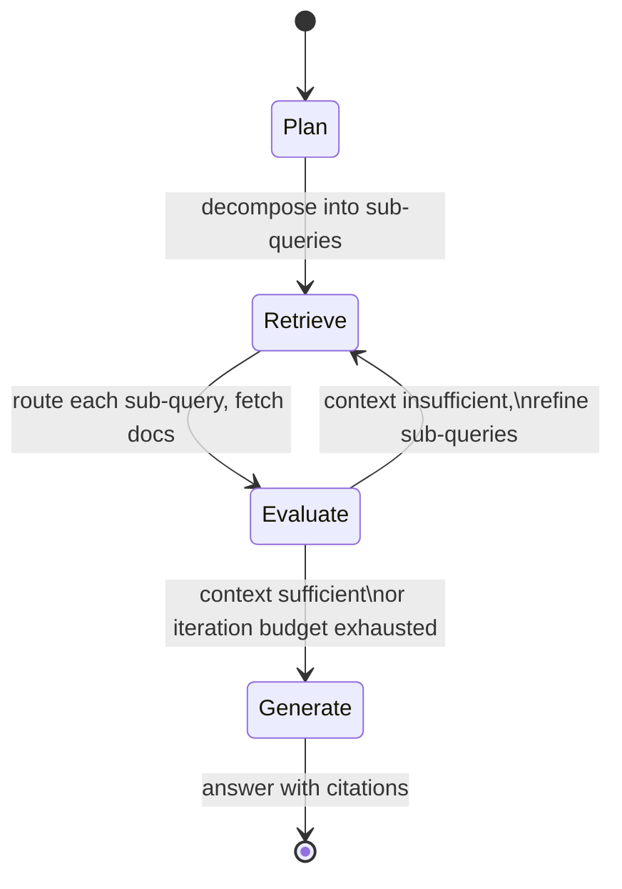
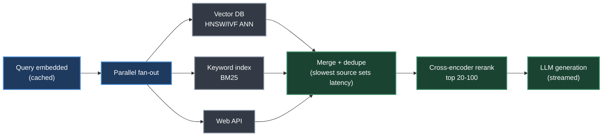
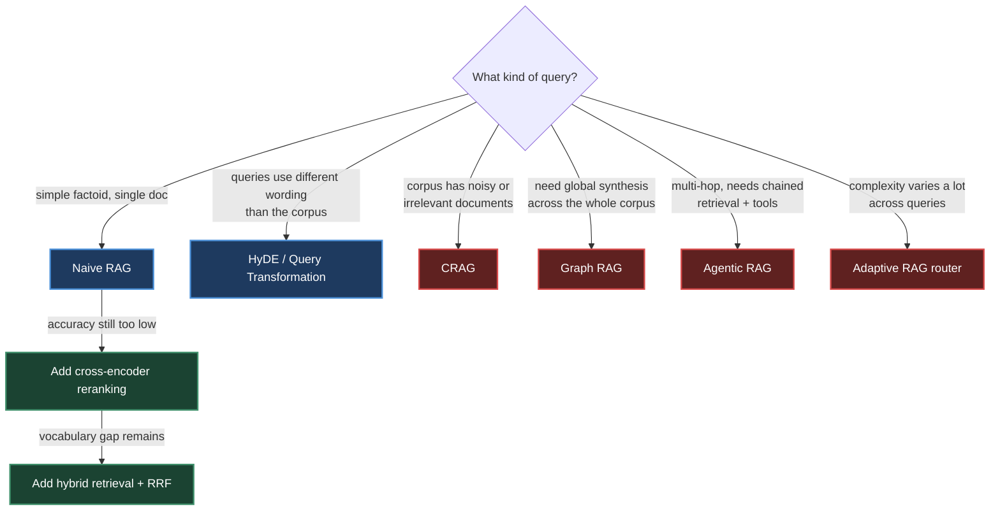

# Chapter 16. Retrieval-Augmented Generation (RAG)

> *"RAG gives a scholar who graduated years ago a library card — they can look things up in real time, cite sources, and acknowledge when they need to check a reference rather than guessing from memory."*

**Part V — Agentic AI** · Book pages 308–332 · ~25 min read

[← Chapter 15. Introduction to Agentic AI](15-introduction-to-agentic-ai.md) · [Index](../README.md) · [Chapter 17. Agentic Memory Systems →](17-agentic-memory-systems.md)

---

## What This Chapter Is About

Large language models store knowledge parametrically — compressed into weights during training. That creates three failure modes: hallucination on anything past the model's reliable boundary, staleness from the training cutoff, and thin coverage of proprietary or domain-specific material the model never saw. Retrieval-Augmented Generation (RAG) attaches a dynamic, updatable, non-parametric memory to the model: an external document corpus is indexed once, and at inference time the system retrieves the passages most relevant to a query and injects them into the prompt before generation.

This chapter is one of the most operationally dense in the book. It moves through the full pipeline — chunking, embedding, indexing, retrieval, reranking, generation — with the concrete hyperparameters production systems actually ship: chunk sizes by use case, embedding model dimensions and MTEB scores, vector database tradeoffs, and latency-optimization tactics. It then covers the retrieval-method landscape (sparse, dense, learned-sparse, late-interaction, hybrid fusion), advanced patterns that add feedback loops around the basic pipeline (Self-RAG, CRAG, Adaptive RAG, Graph RAG, Agentic RAG, Search-R1), and the evaluation metrics — retrieval-side and generation-side — needed to diagnose which stage of the pipeline is actually broken.

RAG is deliberately scoped here as retrieval **into context at query time** — a stateless, per-query lookup against an external corpus. That is a different problem from what an agent remembers across turns or sessions, which Chapter 17 covers as agentic memory. The two are complementary and often composed in the same system, but they solve different problems: RAG answers "what does the corpus say," while memory answers "what has this agent learned or done before."

## Table of Contents

- [The Mental Model](#the-mental-model)
- [Motivation and Problem Statement](#motivation-and-problem-statement)
  - [Parametric vs. Non-Parametric Knowledge](#parametric-vs-non-parametric-knowledge)
  - [When to Use RAG vs. Fine-Tuning vs. Long Context](#when-to-use-rag-vs-fine-tuning-vs-long-context)
- [Core RAG Architecture](#core-rag-architecture)
- [Retrieval Methods](#retrieval-methods)
  - [Sparse Retrieval: BM25 and TF-IDF](#sparse-retrieval-bm25-and-tf-idf)
  - [Dense Retrieval: DPR](#dense-retrieval-dpr)
  - [Hybrid Retrieval with Reciprocal Rank Fusion](#hybrid-retrieval-with-reciprocal-rank-fusion)
  - [Learned Sparse Retrieval: SPLADE and SPLADEv2](#learned-sparse-retrieval-splade-and-spladev2)
  - [ColBERT: Late Interaction](#colbert-late-interaction)
  - [Retrieval Method Comparison](#retrieval-method-comparison)
- [Chunking Strategies](#chunking-strategies)
- [Advanced RAG Patterns](#advanced-rag-patterns)
  - [Query Transformation](#query-transformation)
  - [Re-Ranking](#re-ranking)
  - [Contextual Compression](#contextual-compression)
  - [Self-RAG, CRAG, Adaptive RAG, Graph RAG, RAG-Fusion](#self-rag-crag-adaptive-rag-graph-rag-rag-fusion)
- [Efficient RAG Decoding: REFRAG](#efficient-rag-decoding-refrag)
- [Agentic RAG](#agentic-rag)
  - [Multi-Source Routing](#multi-source-routing)
  - [Full Agentic RAG Implementation](#full-agentic-rag-implementation)
  - [Search-R1: RL-Trained Agentic RAG](#search-r1-rl-trained-agentic-rag)
- [Evaluation](#evaluation)
  - [Retrieval and Generation Metrics](#retrieval-and-generation-metrics)
  - [RAGAs Framework](#ragas-framework)
  - [Common Failure Modes](#common-failure-modes)
- [Production Considerations](#production-considerations)
  - [Embedding Model Selection](#embedding-model-selection)
  - [Vector Database Comparison](#vector-database-comparison)
  - [Latency Optimization](#latency-optimization)
  - [Incremental Indexing and Versioning](#incremental-indexing-and-versioning)
- [RAG + Fine-Tuning Synergy](#rag--fine-tuning-synergy)
- [Decision Guide](#decision-guide)
- [Common Pitfalls](#common-pitfalls)
- [Summary](#summary)
- [Practitioner Checklist](#practitioner-checklist)
- [Going Deeper](#going-deeper)

---

## The Mental Model



*The offline pipeline (blue) indexes the corpus once; the online pipeline (green) serves each query at inference time. Every section in this chapter improves one stage of this diagram.*

Documents enter through loaders that extract clean text and preserve metadata (source URL, page number, section title, timestamp) needed later for filtering and citation. Chunking splits long documents into pieces that fit the embedding model's context window and stay semantically coherent — this is one of the highest-impact design decisions in the whole system. Each chunk is embedded into a dense vector and stored in a vector database. At query time, the query is embedded the same way, the top-k most similar chunks are retrieved, an optional reranker re-scores a small candidate set with a more expensive but more accurate model, and the LLM generates an answer conditioned on the surviving context — ideally with citations back to source documents.

## Motivation and Problem Statement

Large language models store knowledge parametrically — compressed into billions of weights during training. This creates three fundamental limitations:

1. **Hallucination** — models confidently generate plausible-sounding but factually incorrect statements when queried beyond their reliable knowledge boundary.
2. **Knowledge staleness** — training data has a cutoff date; models cannot know about events, papers, or product updates that occurred after training.
3. **Domain specificity** — general-purpose models lack deep knowledge of proprietary codebases, internal documents, specialized regulations, or enterprise data.

### Parametric vs. Non-Parametric Knowledge

Let $M_\theta$ denote a language model with parameters $\theta$, and let $D = \{d_1, d_2, \ldots, d_N\}$ be an external document corpus. The probability of generating answer $a$ given query $q$ under each paradigm is:

$$P_{\text{parametric}}(a \mid q) = P_{M_\theta}(a \mid q) \tag{16.1}$$

$$P_{\text{RAG}}(a \mid q, D) = \sum_{d \in D} P_{M_\theta}(a \mid q, d) \, P_{\text{ret}}(d \mid q, D) \tag{16.2}$$

| Symbol | Meaning |
|---|---|
| $M_\theta$ | Language model with parameters $\theta$ |
| $D$ | External document corpus |
| $P_{\text{ret}}(d \mid q, D)$ | Retrieval distribution over documents given query $q$ |

RAG marginalizes over retrieved evidence, grounding generation in non-parametric knowledge rather than relying solely on what is baked into $\theta$.

### When to Use RAG vs. Fine-Tuning vs. Long Context

| Criterion | RAG | Fine-Tuning | Long Context | RAG + FT |
|---|---|---|---|---|
| Knowledge updates frequently | ✓ | × | × | ✓ |
| Need citations / grounding | ✓ | × | ✓ | ✓ |
| Proprietary large corpus | ✓ | × | × | ✓ |
| Adapt style / format | × | ✓ | × | ✓ |
| Teach new reasoning skills | × | ✓ | × | ✓ |
| Corpus fits in context window | × | × | ✓ | × |
| Low latency required | × | ✓ | × | × |

> [!NOTE]
> RAG is not a replacement for fine-tuning. Fine-tuning teaches the model *how* to reason and respond; RAG provides *what* to reason about. They are complementary — a model fine-tuned to follow instructions well uses retrieved context more effectively than a base model does.

## Core RAG Architecture

A standard RAG system consists of two phases: an offline indexing pipeline that processes and stores documents, and an online retrieval-generation pipeline that serves queries (see the mental-model diagram above).

**Document loading.** Documents arrive in heterogeneous formats (PDF, HTML, Markdown, DOCX, code). Loaders extract clean text and preserve metadata that is stored alongside embeddings for filtering and citation.

**Chunking.** Long documents must be split into chunks that fit within the embedding model's context window (typically 512 tokens) and are semantically coherent. See [Chunking Strategies](#chunking-strategies).

**Embedding.** Each chunk $c_i$ is encoded into a dense vector $e_i = f_\phi(c_i) \in \mathbb{R}^d$ using an embedding model $f_\phi$. These vectors are stored in a vector database alongside the original text and metadata.

**Retrieval.** Given a query $q$, the retrieval step encodes it as $q = f_\phi(q)$ and finds the $k$ most similar chunks by cosine similarity:

$$\text{sim}(q, e_i) = \frac{q \cdot e_i}{\lVert q \rVert \, \lVert e_i \rVert} \tag{16.3}$$

The top-$k$ chunks $C_k = \{c^{(1)}, \ldots, c^{(k)}\}$ are returned as context.

**Generation.** Retrieved chunks are injected into a prompt template:

```python
SYSTEM_PROMPT = """You are a helpful assistant. Answer the question using ONLY
the provided context. If the context does not contain enough information,
say so explicitly. Cite your sources using [Doc N] notation."""

def build_rag_prompt(query: str, chunks: list[dict]) -> str:
    context_str = "\n\n".join(
        f"[Doc {i+1}] (Source: {c['source']}, Page: {c.get('page','N/A')})\n{c['text']}"
        for i, c in enumerate(chunks)
    )
    return f"""{SYSTEM_PROMPT}

Context:
{context_str}

Question: {query}

Answer:"""
```

## Retrieval Methods

### Sparse Retrieval: BM25 and TF-IDF

Sparse retrieval methods represent documents and queries as high-dimensional sparse vectors over the vocabulary. The BM25 scoring function for document $d$ given query $q$ with terms $t_1, \ldots, t_n$ is:

$$\text{BM25}(d, q) = \sum_{i=1}^{n} \text{IDF}(t_i) \cdot \frac{f(t_i, d) \cdot (k_1 + 1)}{f(t_i, d) + k_1 \cdot \left(1 - b + b \cdot \frac{|d|}{\text{avgdl}}\right)} \tag{16.4}$$

| Symbol | Meaning |
|---|---|
| $f(t_i, d)$ | Term frequency of $t_i$ in document $d$ |
| $\lvert d \rvert$ | Document length |
| $\text{avgdl}$ | Average document length across the corpus |
| $k_1$ | Term-frequency saturation, tuned in $[1.2, 2.0]$ |
| $b$ | Length-normalization weight, $b = 0.75$ |

Sparse retrieval still wins for exact keyword matching (product codes, error codes, proper nouns), low-resource domains with insufficient training data for dense models, interpretability, no-GPU speed at billion-document scale, and out-of-vocabulary terms.

### Dense Retrieval: DPR

Dense Passage Retrieval (DPR) uses two separate BERT-based encoders — a query encoder $E_Q$ and a passage encoder $E_P$ — trained with contrastive loss to place relevant query-passage pairs close together in embedding space:

$$\text{sim}(q, p) = E_Q(q)^\top E_P(p) \tag{16.5}$$

Given a batch of $B$ query-passage pairs $\{(q_i, p_i^+)\}_{i=1}^B$, the contrastive loss treats every other passage in the batch as a negative:

$$\mathcal{L}_{\text{DPR}} = -\frac{1}{B}\sum_{i=1}^{B} \log \frac{\exp\left(E_Q(q_i)^\top E_P(p_i^+)/\tau\right)}{\sum_{j=1}^{B} \exp\left(E_Q(q_i)^\top E_P(p_j)/\tau\right)} \tag{16.6}$$

where $\tau$ is a temperature hyperparameter. Hard negatives — passages that are lexically similar but semantically irrelevant — are crucial for training strong retrievers.

At scale, exhaustive search over millions of embeddings is infeasible. FAISS (Facebook AI Similarity Search) provides efficient approximate nearest neighbor (ANN) search using three index families:

- **IVF** (Inverted File Index): cluster vectors into Voronoi cells; search only nearby cells.
- **HNSW** (Hierarchical Navigable Small World): graph-based index with $O(\log N)$ search.
- **PQ** (Product Quantization): compress vectors to reduce memory footprint.

### Hybrid Retrieval with Reciprocal Rank Fusion

A simple linear combination of sparse and dense scores is:

$$s_{\text{hybrid}}(d, q) = \alpha \cdot s_{\text{dense}}(d, q) + (1-\alpha) \cdot s_{\text{sparse}}(d, q) \tag{16.7}$$

Scores from different systems are not directly comparable, so Reciprocal Rank Fusion (RRF) avoids the issue by operating on ranks instead of scores:

$$\text{RRF}(d) = \sum_{r \in R} \frac{1}{k + \text{rank}_r(d)} \tag{16.8}$$

where $R$ is the set of ranked lists (e.g., BM25 ranking and dense ranking), $\text{rank}_r(d)$ is the rank of document $d$ in list $r$, and $k = 60$ is a smoothing constant that reduces the impact of very high-ranked documents.

> [!TIP]
> **Worked example.** BM25 ranks document $d$ at position 3, dense retrieval ranks it at position 7, with $k = 60$: $\text{RRF}(d) = \tfrac{1}{63} + \tfrac{1}{67} \approx 0.0159 + 0.0149 = 0.0308$. A document ranked 1st in both lists scores $\tfrac{1}{61} + \tfrac{1}{61} \approx 0.0328$.

### Learned Sparse Retrieval: SPLADE and SPLADEv2

BM25 relies on exact lexical matching — it fails when the query says "car" but the document says "automobile." Dense retrieval (DPR) captures semantics but loses interpretability, needs a GPU at query time, and produces large indexes. SPLADE (Sparse Lexical and Expansion Model) gets both: sparse vectors, fast to look up in an inverted index like BM25, with learned semantic expansion that handles synonyms and related concepts.

SPLADE uses a pre-trained masked language model (e.g., BERT/DistilBERT) to produce a sparse vector over the entire vocabulary for each document or query, repurposing the MLM head's existing knowledge of which words relate to a position as term-importance weights. Given input text $x = [x_1, \ldots, x_n]$, contextual representations $H \in \mathbb{R}^{n \times |V|}$ come from the MLM head, then are aggregated across positions with a saturating activation:

$$w_t(x) = \log\left(1 + \text{ReLU}\left(\max_{i \in [1,n]} H_i[t]\right)\right) \tag{16.9}$$

The $\log(1+\cdot)$ saturation prevents any single term from dominating (like TF saturation in BM25); ReLU ensures sparsity — most vocabulary terms get weight zero; max pooling captures the strongest signal for each term from anywhere in the text; and expansion means even tokens absent from the original text can get non-zero weight — a document about "neural networks" may pick up weight for "deep learning" or "backpropagation."

Query and document map to sparse vectors $w^q, w^d \in \mathbb{R}^{|V|}$, and relevance is a simple dot product:

$$s(q, d) = \sum_{t \in V} w_t^q \cdot w_t^d \tag{16.10}$$

Because both vectors are sparse — typically 20–200 non-zero entries out of 30K vocabulary — this can be computed efficiently on standard inverted indexes (Lucene, Anserini) with no GPU needed at query time.

SPLADE is trained with contrastive learning (in-batch negatives + hard negatives) plus L1 regularization on both query and document representations to encourage sparsity:

$$\mathcal{L} = \mathcal{L}_{\text{contrastive}} + \lambda_q \lVert w^q \rVert_1 + \lambda_d \lVert w^d \rVert_1 \tag{16.11}$$

SPLADEv2 introduces four refinements: **distillation from a cross-encoder teacher** (e.g., MonoT5) for richer training signal, $\mathcal{L}_{\text{distill}} = \text{KL}(\sigma(s_{\text{student}}) \Vert \sigma(s_{\text{teacher}}))$ (16.12); **separate query/document sparsity targets**, $\lambda_q > \lambda_d$ — e.g., $\lambda_q = 3\times10^{-4}$, $\lambda_d = 1\times10^{-4}$ (16.13); **FLOPS-aware regularization** that penalizes expected retrieval cost via mean per-term activation across the batch (16.14) instead of plain L1, specifically targeting terms non-zero across many documents; and **a lighter backbone**, DistilBERT (66M params) instead of BERT-base (110M), halving encoding time with minimal quality loss.

| Aspect | SPLADE (v1) | SPLADEv2 |
|---|---|---|
| Training signal | Binary relevance + hard negatives | Cross-encoder distillation |
| Sparsity control | L1 regularization | FLOPS-aware regularization |
| Query/doc symmetry | Same encoder, same $\lambda$ | Asymmetric (sparser queries) |
| Backbone | BERT-base (110M) | DistilBERT (66M) |
| MRR@10 (MS MARCO) | 34.0 | 36.8 |
| Avg non-zero terms/doc | ~200 | ~120 (40% sparser) |

Use SPLADE/v2 when you need semantic retrieval without GPU at query time, your infrastructure already has inverted indexes (Elasticsearch, Lucene), or you need interpretable relevance scores. Prefer dense retrieval when you have GPU budget for query encoding, need multilingual support, or your queries are very short (1–2 words, where expansion helps less). Best practice: use SPLADEv2 as the first-stage retriever plus a cross-encoder reranker for top-k — it matches or beats dense retrieval pipelines at lower latency.

### ColBERT: Late Interaction

ColBERT encodes queries and documents into sets of token-level embeddings and scores with a MaxSim operator:

$$s(q, d) = \sum_{i \in |q|} \max_{j \in |d|} q_i^\top d_j \tag{16.15}$$

This late-interaction mechanism is more expressive than single-vector bi-encoders while being far faster than cross-encoders, because document embeddings are pre-computed offline. Both encoders produce per-token embeddings (not a single `[CLS]` vector), each projected to a lower dimension, typically 128:

$$q_i = \text{Linear}(E_Q(q)_i) \in \mathbb{R}^{128}, \quad d_j = \text{Linear}(E_D(d)_j) \in \mathbb{R}^{128} \tag{16.16, 16.17}$$

Training uses pairwise softmax cross-entropy over a positive passage and negatives:

$$\mathcal{L}_{\text{ColBERT}} = -\log \frac{\exp(s(q,d^+))}{\exp(s(q,d^+)) + \sum_{k=1}^{N}\exp(s(q,d_k^-))} \tag{16.18}$$

Negatives come from in-batch negatives (free, abundant), hard negatives mined via BM25 (most impactful for quality), and, in ColBERTv2, distillation negatives mined via a cross-encoder teacher.

Document token embeddings are pre-computed offline (optionally compressed via residual quantization in ColBERTv2); only query tokens are encoded live, and MaxSim runs against stored document embeddings. PLAID indexing clusters document embeddings and uses centroids for initial candidate retrieval before computing exact MaxSim only on candidates — reducing latency 5–10×. Index size is $|d| \times 128$ floats per document — larger than single-vector methods but compressible to ~2 bytes/dimension with quantization.

### Retrieval Method Comparison

| Method | Latency | Accuracy | Index Size | GPU | Best For |
|---|---|---|---|---|---|
| TF-IDF | Very Low | Low | Small | No | Baseline, exact match |
| BM25 | Very Low | Medium | Small | No | Keyword search, rare terms |
| DPR / bi-encoder | Low | High | Large | Yes | Semantic similarity |
| SPLADE | Low | High | Medium | Yes | Hybrid accuracy + speed |
| ColBERT | Medium | Very High | Very Large | Yes | High-accuracy retrieval |
| Cross-encoder | High | Highest | N/A | Yes | Re-ranking top-k |
| Hybrid (RRF) | Low | Very High | Large | Yes | Production systems |



*Dense and sparse retrieval run independently and their ranked lists are combined by rank, not raw score, before a cross-encoder reranks the fused candidate set.*

## Chunking Strategies

Chunking splits documents into segments that are (1) small enough to fit an embedding model's context window, (2) semantically coherent, and (3) contain enough context to be useful when retrieved in isolation. It is one of the highest-impact decisions in RAG system design.

**Fixed-size chunking with overlap.** The simplest strategy: split every $W$ tokens with an overlap of $O$ tokens between consecutive chunks.

```python
from langchain.text_splitter import RecursiveCharacterTextSplitter

splitter = RecursiveCharacterTextSplitter(
    chunk_size=512,       # tokens per chunk
    chunk_overlap=64,     # overlap to preserve context across boundaries
    length_function=len,
    separators=["\n\n", "\n", ". ", " ", ""]
)
chunks = splitter.split_documents(documents)
```

For a document of length $L$ tokens, the number of chunks is:

$$N_{\text{chunks}} = \left\lceil \frac{L - O}{W - O} \right\rceil \tag{16.19}$$

**Semantic chunking.** Splits at topic boundaries detected by measuring embedding similarity between consecutive sentences, rather than at fixed intervals — e.g., splitting at the top 5% most-dissimilar sentence boundaries (95th-percentile threshold).

**Document-structure-aware chunking.** For structured documents, split at natural boundaries: Markdown at `##` headers (preserving section context), HTML at `<section>`/`<article>`/`<p>` tags, code at function/class definitions (preserving imports in each chunk), and tables — keep entire tables as single chunks, never split mid-row.

**Parent-child chunking.** Decouples retrieval granularity from generation context: index small child chunks (e.g., 128 tokens) for precise retrieval, but return large parent chunks (e.g., 512–2000 tokens) to the LLM for richer generation context. LangChain's `ParentDocumentRetriever` implements this pattern directly with separate parent (2000-token) and child (400-token) splitters.



*The right chunking strategy depends on document structure and the query pattern, not on a single universal chunk size.*

Empirical guidelines by use case:

| Use Case | Recommended Chunk Size | Overlap |
|---|---|---|
| Factoid QA (precise facts) | 128–256 tokens | 20–32 tokens |
| Summarization / synthesis | 512–1024 tokens | 64–128 tokens |
| Code retrieval | Full function | None |
| Legal / regulatory documents | Paragraph-level | 1 sentence |
| Conversational / chat | 256–512 tokens | 32–64 tokens |

## Advanced RAG Patterns

### Query Transformation

Raw user queries are often ambiguous, too short, or poorly matched to document language. Several techniques improve retrieval before the search step:

- **HyDE (Hypothetical Document Embeddings).** Instead of embedding the query directly, generate a hypothetical answer and embed *that*: $\hat{d} = \text{LLM}(q)$, $e_{\text{query}} = f_\phi(\hat{d})$ (16.20). The intuition: a hypothetical answer sits in the same linguistic register as real documents, shrinking the query-document distribution gap.
- **Step-back prompting.** For specific questions, first generate a more general "step-back" question, retrieve for both, and combine the contexts. Example: "What is the boiling point of ethanol at 2 atm?" → step-back: "What factors affect the boiling point of liquids?"
- **Multi-query generation.** Generate $M$ diverse reformulations of the query, retrieve for each, and union the results. LangChain's `MultiQueryRetriever` generates 3 variants internally, retrieves for each, and deduplicates.

### Re-Ranking

After initial retrieval of top-k candidates, a cross-encoder scores each query-document pair jointly, attending to both simultaneously, which produces much more accurate relevance scores at higher latency cost:

$$s_{\text{cross}}(q, d) = \text{CrossEncoder}([q; d]) \tag{16.21}$$

Cross-encoders cannot serve as first-stage retrievers — there are no pre-computed document embeddings to score against ahead of time — but they are ideal for re-ranking a small candidate set, typically $k = 20$–$100$.

```python
from sentence_transformers import CrossEncoder

reranker = CrossEncoder("BAAI/bge-reranker-large")

def rerank(query: str, docs: list[str], top_n: int = 5) -> list[str]:
    pairs = [(query, doc) for doc in docs]
    scores = reranker.predict(pairs)
    ranked = sorted(zip(scores, docs), reverse=True)
    return [doc for _, doc in ranked[:top_n]]
```

### Contextual Compression

Retrieved chunks often contain irrelevant sentences surrounding the relevant passage. Contextual compression uses an LLM (via `LLMChainExtractor` in LangChain's `ContextualCompressionRetriever`) to extract only the relevant portions before they reach the generator.

### Self-RAG, CRAG, Adaptive RAG, Graph RAG, RAG-Fusion

| Pattern | Mechanism |
|---|---|
| **Self-RAG** | Trains a single model to decide whether to retrieve, generate with or without retrieval, and critique its own output via reflection tokens: `[Retrieve]` (should I retrieve more?), `[IsRel]` (is the passage relevant?), `[IsSup]` (does the statement follow from the passage?), `[IsUse]` (is the response useful?) — predicted end-to-end alongside the response. |
| **CRAG (Corrective RAG)** | Adds a retrieval evaluator that grades each document Correct / Ambiguous / Incorrect. If all documents are incorrect or ambiguous, falls back to web search; if some are correct, strips irrelevant sentences via knowledge refinement before generating. |
| **Adaptive RAG** | Routes queries to different strategies by predicted complexity: no retrieval for simple factual queries answerable from parameters, single-step RAG for moderate queries, multi-step RAG for complex multi-hop questions. A lightweight classifier trained on complexity labels performs the routing. |
| **Graph RAG** | Builds a knowledge graph from the corpus: LLM entity/relationship extraction per chunk, graph construction $G=(V,E)$, Leiden-algorithm community detection at multiple resolutions, then an LLM summary per community. Global queries map-reduce over community summaries; local queries fall back to standard vector search. Excels at synthesizing across many documents but is expensive to build and maintain. |
| **RAG-Fusion** | Generates multiple search-query variants, retrieves for each, and fuses the ranked lists using RRF (Eq. 16.8) before generation. |

> [!NOTE]
> Graph RAG is better for global queries ("What are the main themes in this corpus?"); standard RAG is better for local queries ("What did document X say about topic Y?").

## Efficient RAG Decoding: REFRAG

A practical bottleneck of RAG is decoding latency: retrieved passages concatenated into the context are often long yet sparsely relevant, inflating time-to-first-token (TTFT) and KV-cache memory. REFRAG observes that because retrieved passages are independently sourced (via diversity or deduplication during re-ranking), their attention patterns are block-diagonal — most cross-passage attention is near zero, so most computation over the RAG context during decoding is unnecessary.

REFRAG exploits this via a three-phase **compress–sense–expand** strategy:

1. **Compress** — replace full KV representations of retrieved passages with compact summaries (e.g., mean-pooled keys/values per passage block).
2. **Sense** — at each decoding step, use lightweight attention over the compressed representations to identify which passage blocks are relevant to the current token.
3. **Expand** — reconstruct full KV entries only for the selected blocks and perform exact attention over that sparse active set.

On LLaMA-based models, REFRAG achieves up to **30.85× TTFT speedup** — a 3.75× improvement over prior sparse-attention baselines — with no loss in perplexity, and extends effective context length **16×** under fixed memory budgets. These gains hold across RAG, multi-turn conversation, and long-document summarization.

> [!NOTE]
> Agentic RAG (next section) requires multiple retrieval rounds per query, compounding latency. Efficient decoding methods like REFRAG are essential infrastructure — they make iterative retrieve-reason-generate loops practical at scale by keeping each round's decoding cost sublinear in context length.

## Agentic RAG

### Motivation: Limits of Static RAG

Standard RAG follows a fixed retrieve-then-generate pattern. This fails on multi-hop questions ("Who founded the company that acquired OpenAI's main competitor in 2023?" requires chaining multiple retrievals), ambiguous queries where the right retrieval strategy depends on what is found, heterogeneous sources where different sub-questions need different knowledge bases, and iterative refinement where an initial retrieval reveals that a different query is actually needed.

Agentic RAG reframes retrieval as a sequential decision problem: the state is the current context (query plus retrieved documents so far), the actions are retrieve, reason, generate, and stop, and the reward is answer correctness. The agent learns a policy for when and what to retrieve.



*Agentic RAG's control loop: plan, retrieve, evaluate sufficiency, and either loop back with refined sub-queries or move to generation — the sense-act-evaluate cycle applied to information gathering.*

### Multi-Source Routing

An agentic RAG system routes sub-queries to specialized knowledge sources, because no single index excels at everything. A financial analyst's assistant, for instance, routes "What is our company's PTO policy?" to a vector DB of internal documents, "What did the Fed announce yesterday?" to web search, "Show Q3 revenue by region" to a SQL database, and "How does our auth middleware validate tokens?" to a code index. A flat single-index approach either misses the answer or returns irrelevant passages.

Three routing strategies, in increasing sophistication:

1. **Rule-based routing** — keyword triggers (SQL keywords → database, URL patterns → web). Fast and interpretable, brittle for ambiguous queries.
2. **Classifier-based routing** — a lightweight model (fine-tuned BERT classifier, or logistic regression over query embeddings) predicts the best source. Low latency (<10 ms), trainable on routing logs, but requires labeled data.
3. **LLM-based routing** — the LLM decides the source via a structured-output call. Most flexible, handles novel query types, can explain its reasoning, but adds one LLM call of latency.

```python
from enum import Enum
from pydantic import BaseModel

class KnowledgeSource(str, Enum):
    VECTOR_DB = "vector_db"      # internal documents
    WEB_SEARCH = "web_search"    # real-time web
    SQL_DB = "sql_db"            # structured data
    CODE_INDEX = "code_index"    # codebase
    API = "api"                  # external APIs

class RouteDecision(BaseModel):
    source: KnowledgeSource
    refined_query: str
    reasoning: str

def route_query(query: str, llm) -> RouteDecision:
    """Use LLM to decide which knowledge source to query."""
    prompt = f"""Given the query: "{query}"
Decide which knowledge source to use:
- vector_db: for internal documents, policies, past reports
- web_search: for current events, recent information
- sql_db: for numerical data, statistics, structured records
- code_index: for code examples, API documentation
- api: for real-time data (weather, stock prices, etc.)
Return a JSON with: source, refined_query, reasoning."""
    return llm.with_structured_output(RouteDecision).invoke(prompt)
```

> [!NOTE]
> Multi-source routing is a classification problem at its simplest and a planning problem at its richest. Treated as an RL policy — state = query plus conversation history, action = source choice plus optional query rewrite, reward = downstream answer quality — the router can be optimized end-to-end via policy gradient techniques (see [Chapter 8](08-preference-optimization-variants.md)).

Practical considerations: fallback chains try the next-best source on low-confidence results; parallel fan-out retrieves from multiple sources at once for ambiguous queries and fuses with RRF; cost awareness accounts for the monetary cost and rate limits of web search or API calls; observability logs every routing decision with its reasoning.

### Full Agentic RAG Implementation

A full agentic RAG system orchestrates plan, retrieve, evaluate, and generate as a graph of stateful nodes, where control flow depends on intermediate results. The implementation below wires four LangGraph nodes into a loop: **Plan** decomposes the query into sub-queries; **Retrieve** routes each sub-query to a source and fetches documents; **Evaluate** judges whether accumulated context is sufficient; **Generate** synthesizes a final cited answer. The key design pattern is the conditional loop — after evaluation, the agent either proceeds to generation (context sufficient, or iteration budget exhausted) or loops back to retrieval with refined sub-queries.

```python
class AgentState(TypedDict):
    query: str
    sub_queries: list[str]
    retrieved_docs: Annotated[list[dict], operator.add]
    context_sufficient: bool
    answer: str
    iterations: int
    max_iterations: int

def should_retrieve(state: AgentState) -> str:
    if state["context_sufficient"]:
        return "generate"
    if state["iterations"] >= state["max_iterations"]:
        return "generate"  # give up and generate with what we have
    return "retrieve"

workflow = StateGraph(AgentState)
workflow.add_node("plan", plan_node)
workflow.add_node("retrieve", retrieve_node)
workflow.add_node("evaluate", evaluate_node)
workflow.add_node("generate", generate_node)
workflow.set_entry_point("plan")
workflow.add_edge("plan", "retrieve")
workflow.add_edge("retrieve", "evaluate")
workflow.add_conditional_edges("evaluate", should_retrieve,
    {"retrieve": "retrieve", "generate": "generate"})
workflow.add_edge("generate", END)
agent = workflow.compile()
```

Agentic RAG can also combine retrieval with computation tools — a document search tool, a SQL query tool, a web search tool, and a Python execution tool wired into a `create_tool_calling_agent`, letting the agent choose retrieval versus computation per sub-step.

### Search-R1: RL-Trained Agentic RAG

The agentic RAG approaches above rely on prompt-engineered orchestration: the agent's search behavior is controlled by instructions, not learned through training. Search-R1 takes a different approach — it trains the LLM via reinforcement learning to learn when, what, and how many times to search as part of its reasoning process, extending the DeepSeek-R1 reasoning framework by treating search-engine queries as actions within the RL loop. During chain-of-thought generation, the model emits `<search>query</search>` tokens that trigger real-time retrieval; results are injected back into the reasoning context and generation continues:

$$\text{think}_1 \to \langle\text{search}\rangle q_1 \langle/\text{search}\rangle \to [\text{results}_1] \to \text{think}_2 \to \cdots \to \text{answer}$$

The entire trajectory — reasoning, searches, and final answer — is scored by a terminal reward: correctness of the final answer against ground truth. Search-R1 trains with GRPO (Group Relative Policy Optimization):

1. Sample $N$ trajectories per question, each with 0–5 search calls.
2. Execute searches in real time against the actual search engine.
3. Score terminal answer correctness (exact match or F1 vs. ground truth).
4. Compute group-relative advantage: $\hat{A}_i = (R_i - \mu_G)/\sigma_G$.
5. Update the policy with the GRPO clipped objective, reinforcing trajectories that searched effectively.

The model learns to search only when uncertain, formulate effective queries, refine iteratively across multiple searches, and integrate retrieved context to support or correct its reasoning.

| Dimension | Prompt-Based Agentic RAG | Search-R1 |
|---|---|---|
| Search decision | Prompt/heuristic | Learned via RL |
| Query formulation | Prompted ("rewrite query") | Trained end-to-end |
| # searches | Fixed or LLM-decided at inference | Learned optimal count |
| Training signal | None (frozen model) | Correctness reward |
| Search integration | Append to context | Interleaved in chain-of-thought |
| Failure recovery | Retry heuristics | Learned backoff/reformulation |
| Overhead at inference | Framework overhead (LangGraph) | Native model behavior |

On open-domain QA benchmarks (NQ, TriviaQA, HotpotQA), a 7B Search-R1 model outperforms standard single-retrieval RAG by **15–20% accuracy**, outperforms prompted ReAct-style agentic RAG by **8–12% accuracy**, and approaches the performance of much larger (70B) models running standard RAG.

> [!NOTE]
> Traditional RAG asks: "Given this query, what should I retrieve?" — a pipeline decision made before generation. Search-R1 asks: "Given what I've reasoned so far, do I need more information, and if so what specific question fills the gap?" — a learned decision made *during* generation. A small model that searches well beats a large model that doesn't search.

## Evaluation

Evaluating a RAG system is harder than evaluating retrieval or generation in isolation, because errors can originate at any stage and compound: a perfect generator cannot compensate for irrelevant retrievals, and a perfect retriever is wasted if the generator hallucinates or ignores the context. Effective evaluation operates at three levels: **retrieval quality** (did the retriever surface the right passages? — Recall, Precision, MRR, NDCG), **generation quality** (is the answer correct, faithful to context, and complete? — Correctness, Faithfulness, Answer Relevance), and **end-to-end quality** (does the full system satisfy the user? — human preference, task success rate, latency-adjusted utility).

> [!WARNING]
> A common failure mode is optimizing only one level — maximizing Recall@K with a large K fills the context with marginally relevant passages that actually degrade generation quality.

### Retrieval and Generation Metrics

Let $R_K$ be the set of retrieved documents at rank $K$, and $R^*$ be the set of relevant documents.

| Metric | Formula | Measures |
|---|---|---|
| Recall@K | $\dfrac{\lvert R_K \cap R^* \rvert}{\lvert R^* \rvert}$ (16.22) | Fraction of all relevant docs surfaced in top-K |
| Precision@K | $\dfrac{\lvert R_K \cap R^* \rvert}{K}$ (16.23) | Fraction of top-K that are relevant |
| MRR | $\dfrac{1}{\lvert Q \rvert}\sum_i \dfrac{1}{\text{rank}_i}$ (16.24) | Mean inverse rank of the first relevant doc |
| NDCG@K | $\text{DCG@K}/\text{IDCG@K}$, $\text{DCG@K}=\sum_{i=1}^{K}\dfrac{\text{rel}_i}{\log_2(i+1)}$ (16.25) | Graded relevance discounted by rank |

Generation-side metrics, all typically computed by an LLM judge:

| Metric | Formula | Measures |
|---|---|---|
| Faithfulness | $\dfrac{\#\text{claims supported by context}}{\#\text{total claims in answer}}$ (16.26) | Whether the answer is grounded in retrieved context |
| Answer Relevance | $\dfrac{1}{N}\sum_i \cos(E(q), E(\hat{q}_i))$ (16.27) | Similarity between the original query and questions generated back from the answer |
| Context Precision@K | $\dfrac{1}{K}\sum_{k=1}^{K}\text{Precision@}k \cdot \mathbb{1}[\text{doc}_k \text{ relevant}]$ (16.28) | Whether relevant chunks rank near the top of retrieved context |
| Context Recall | $\dfrac{\#\text{ground-truth claims attributable to context}}{\#\text{total ground-truth claims}}$ (16.29) | Whether retrieved context covers the ground-truth answer |

### RAGAs Framework

RAGAs (Retrieval Augmented Generation Assessment) provides a reference-free evaluation framework using LLM judges across faithfulness, answer relevancy, context precision, context recall, and answer correctness:

```python
from ragas import evaluate
from ragas.metrics import (
    faithfulness, answer_relevancy,
    context_precision, context_recall, answer_correctness,
)
from datasets import Dataset

eval_dataset = Dataset.from_dict({
    "question": questions,
    "answer": generated_answers,
    "contexts": retrieved_contexts,     # list of lists
    "ground_truth": reference_answers,
})

results = evaluate(
    dataset=eval_dataset,
    metrics=[faithfulness, answer_relevancy, context_precision,
             context_recall, answer_correctness],
)
```

> [!NOTE]
> This is the RAGAs v0.1 API. v0.2+ renames fields to `user_input`, `response`, `retrieved_contexts`, `reference`.

### Common Failure Modes

> [!WARNING]
> **RAG failure modes to monitor:**
> 1. **Retrieval Miss** — the relevant document exists in the corpus but is not retrieved, from poor chunking, embedding model mismatch, or query-document vocabulary gap.
> 2. **Context Poisoning** — retrieved documents contain misleading or contradictory information that causes incorrect generation.
> 3. **Lost-in-the-Middle** — LLMs attend more strongly to the beginning and end of long contexts; relevant information in the middle may be ignored.
> 4. **Over-Retrieval** — too many retrieved chunks dilute the relevant signal and increase latency and cost.
> 5. **Hallucination Despite Retrieval** — the model ignores retrieved context and generates from parametric memory, especially when context contradicts training data.
> 6. **Citation Fabrication** — the model attributes claims to documents that don't actually support them.

## Production Considerations

### Embedding Model Selection

The embedding model is the single most impactful component choice in a RAG system — it determines the quality ceiling for retrieval.

| Model | Dims | Max Tokens | MTEB Avg | Access | Notes |
|---|---|---|---|---|---|
| Voyage voyage-4-large | 1024* | 32K | — | API | Best retrieval quality |
| OpenAI text-embedding-3-large | 3072 | 8191 | 64.6 | API | Matryoshka dims |
| Cohere embed-english-v3.0 | 1024 | 512 | 64.5 | API | int8/binary support |
| Google text-embedding-005 | 768 | 2048 | — | API | Vertex AI integration |
| nvidia/NV-Embed-v2 | 4096 | 32K | 72.3 | Free | #1 MTEB (Sep 2024) |
| Alibaba-NLP/gte-Qwen2-7B | 3584 | 32K | 70.2 | Free | Apache-2.0, multilingual |
| BAAI/bge-m3 | 1024 | 8192 | 65.0 | Free | Dense + sparse + multi-vec |
| jinaai/jina-embeddings-v3 | 1024 | 8192 | 66.0 | Free | Multilingual, LoRA adapters |
| BAAI/bge-large-en-v1.5 | 1024 | 512 | 64.2 | Free | Mature, well-supported |

*MTEB scores are overall averages across retrieval, classification, clustering, and STS tasks, as of 2026.*

Selection criteria: **domain match** — specialized models (voyage-code-3, voyage-finance-2) can beat general models by 5–15% on domain tasks; **context length** — 32K-token models (Voyage-4, NV-Embed-v2) can embed whole documents without chunking; **Matryoshka embeddings** — flexible output dimensions (256–4096) trade quality for storage/latency without re-encoding; **quantization support** — int8/binary quantization (Cohere, Voyage) cuts index size 4–32× with minimal recall loss; **multilingual** — prefer models explicitly trained multilingual (BGE-M3, Jina-v3, Voyage-4) for non-English or cross-lingual RAG.

### Vector Database Comparison

| Database | Hosting | Scale | Filtering | Hybrid | Best For |
|---|---|---|---|---|---|
| FAISS | Self-hosted | Billions | Limited | No | Research, offline |
| Pinecone | Managed | Billions | Yes | Yes | Serverless, easy setup |
| Weaviate | Both | Billions | Yes | Yes | GraphQL, multi-modal |
| Chroma | Self-hosted | Millions | Yes | No | Local dev, prototyping |
| Qdrant | Both | Billions | Yes | Yes | High performance |
| Milvus | Both | Billions | Yes | Yes | Enterprise, GPU accel. |
| pgvector | Self-hosted | Millions | Yes | Yes | Existing Postgres users |

### Latency Optimization

1. **Pre-filtering** — use metadata filters (date range, category, source) to shrink the search space before ANN search.
2. **Approximate NN** — use HNSW or IVF indices instead of exact search; accept ~1% recall loss for a 10× speedup.
3. **Embedding caching** — cache embeddings for frequently repeated queries.
4. **Async retrieval** — retrieve from multiple sources in parallel.
5. **Streaming generation** — stream LLM output while retrieval completes.
6. **Quantization** — use int8 or binary quantization for embeddings to reduce memory and raise throughput.

Techniques 3 and 4 compose naturally: cache the query embedding, then fan out retrieval requests to multiple backends concurrently. In a multi-source system the query may need results from a vector database, a keyword index, and a web API — sequential retrieval sums their latencies, while parallel retrieval pays only the cost of the slowest source. An `lru_cache`-wrapped embedding function plus `asyncio.gather` across sources implements this directly in Python.



*The retrieve-rerank-generate latency budget: parallel fan-out across sources pays only the slowest branch's cost, reranking adds a fixed cross-encoder pass over a bounded candidate set, and streaming generation overlaps output with the tail of retrieval.*

### Incremental Indexing and Versioning

In production the corpus is never static — policies get revised, new reports land daily, deprecated content must be removed. A full re-index is expensive and causes downtime, so incremental indexing applies changes at the document level.

Core operations: **upsert** — when a document is created or updated, delete all existing chunks for that `doc_id`, re-chunk the new content, embed, and insert, guaranteeing no stale fragments linger; **delete/expire** — remove chunks by document ID or by TTL (automatic garbage collection for time-sensitive sources like news or market data); **version tracking** — store a version and `indexed_at` timestamp in chunk metadata, enabling rollback and auditability ("which version did the model see?").

Consistency challenges: **embedding model drift** makes old and new vectors incompatible on upgrade — maintain separate indices per model version and migrate in the background, or use Matryoshka-compatible models where dimension truncation preserves compatibility; **chunk boundary shifts** from a strategy change invalidate existing chunks, so version metadata lets you selectively re-index; **eventual consistency** in distributed vector databases means newly upserted vectors may not be immediately searchable — design the pipeline to tolerate a brief indexing lag, typically seconds to minutes.

```python
class RAGIndexManager:
    def upsert_document(self, doc_id: str, content: str, metadata: dict) -> None:
        """Add or update a document, replacing old chunks."""
        self.vs.delete(filter={"doc_id": doc_id})
        chunks = self.chunker.split_text(content)
        self.vs.add_texts(
            texts=chunks,
            metadatas=[{**metadata, "doc_id": doc_id,
                        "version": metadata.get("version", 1),
                        "indexed_at": datetime.utcnow().isoformat()}
                       for _ in chunks],
        )

    def expire_old_documents(self, ttl_days: int = 365) -> int:
        """Remove documents older than TTL."""
        cutoff = (datetime.utcnow() - timedelta(days=ttl_days)).isoformat()
        return self.vs.delete(filter={"indexed_at": {"$lt": cutoff}})
```

## RAG + Fine-Tuning Synergy

Fine-tuning and RAG address complementary weaknesses: fine-tuning alone gives a model that learns style and format but may hallucinate facts; RAG alone gives a model access to facts but it may not know how to use them optimally; combined, you fine-tune the model to use retrieved context well — cite sources, acknowledge uncertainty, ignore irrelevant context.

**RAFT (Retrieval-Augmented Fine-Tuning)** trains models to answer questions given a mix of relevant and distractor documents, teaching the model to identify and use only the relevant context. For each training example $(q, a, d^*)$, sample $k-1$ distractor documents $\{d_i^-\}$, then fine-tune on $[q, d^*, d_1^-, \ldots, d_{k-1}^-] \to [\text{chain-of-thought} + a]$, where the chain-of-thought explicitly quotes from $d^*$:

$$\mathcal{L}_{\text{RAFT}} = -\mathbb{E}_{(q,a,d^*,\{d^-\})}\left[\log P_\theta\left(\text{CoT}(d^*) \oplus a \mid q, d^*, \{d_i^-\}\right)\right] \tag{16.30}$$

**Joint retriever-generator training** trains the retriever and generator together for maximum performance, with gradients flowing through the retrieval step itself (as in REALM and the original RAG paper):

$$\nabla_\theta \mathcal{L} = \nabla_\theta \left[-\log \sum_{d \in D} P_\theta(a \mid q, d) \cdot P_\phi(d \mid q)\right] \tag{16.31}$$

The retriever parameters $\phi$ update via the REINFORCE estimator, or by treating $P_\phi(d \mid q)$ as a differentiable attention over documents.

> [!WARNING]
> Joint retriever-generator training is powerful but complex: the document index must be periodically refreshed as $\phi$ changes (asynchronous index refresh), the training signal is sparse (only top-k documents contribute), and training is unstable without careful initialization from a pre-trained retriever.

## Decision Guide

| Approach | Accuracy | Latency | Complexity | Cost | Best For |
|---|---|---|---|---|---|
| Naive RAG | Medium | Low | Low | Low | Prototyping, simple QA |
| RAG + Re-ranking | High | Medium | Medium | Medium | Production QA systems |
| HyDE | High | Medium | Low | Medium | Semantic mismatch domains |
| Multi-Query RAG | High | Medium | Medium | Medium | Ambiguous queries |
| RAG-Fusion | High | Medium | Medium | Medium | Diverse query types |
| Self-RAG | High | Medium | High | Medium | Selective retrieval |
| CRAG | High | Medium | High | High | Unreliable corpora |
| Adaptive RAG | High | Low–High | High | Medium | Mixed query complexity |
| Graph RAG | V. High | High | V. High | High | Global synthesis queries |
| Agentic RAG | V. High | High | V. High | High | Multi-hop reasoning |
| RAFT | V. High | Low | V. High | V. High | Domain-specific deployment |



*Start from the query shape, not the fanciest technique — naive RAG with good chunking and hybrid retrieval covers most production QA before you need agentic loops or knowledge graphs.*

Key design questions: What is the query distribution (factoid, analytical, multi-hop)? How large and dynamic is the corpus (favoring managed vector DBs with incremental indexing)? What are the latency requirements (sub-100ms precludes re-ranking and agentic loops)? How critical is grounding (medical, legal, financial domains need faithfulness evaluation and citation verification)? Is the vocabulary specialized enough to need hybrid retrieval or domain-adapted embeddings?

## Common Pitfalls

> [!WARNING]
> **Optimizing Recall@K in isolation.** A large K fills context with marginally relevant passages that degrade generation quality even as retrieval metrics improve — evaluate the full pipeline, not just retrieval.

> [!WARNING]
> **Skipping chunking as a first-class design decision.** Chunk size and overlap are among the highest-impact choices in the whole system; a poorly chunked corpus caps quality no matter how good the embedding model or reranker is.

> [!WARNING]
> **Lost-in-the-middle.** LLMs attend more strongly to the start and end of long contexts, so relevant chunks placed in the middle of a large context window may be effectively ignored — order matters, not just recall.

> [!WARNING]
> **Cross-encoders as first-stage retrievers.** They require a pre-computed embedding for every document pair and cannot be used for retrieval over a large corpus — they only work as a reranker on an already-small candidate set (top-20 to top-100).

> [!WARNING]
> **Embedding model drift on re-indexing.** Upgrading the embedding model silently makes old and new vectors incompatible; migrate with a parallel index and cutover, not an in-place swap.

## Summary

- RAG marginalizes generation over a retrieval distribution ($P_{\text{RAG}}(a\mid q,D) = \sum_d P_{M_\theta}(a\mid q,d)P_{\text{ret}}(d\mid q,D)$), grounding answers in a corpus rather than relying solely on parametric memory — and it is complementary to fine-tuning, not a substitute for it.
- Chunking is one of the highest-leverage design decisions: 128–256 tokens for factoid QA, 512–1024 tokens for summarization, full-function chunks for code, paragraph-level with 1-sentence overlap for legal text — parent-child chunking further decouples retrieval precision (small child chunks) from generation context (large parent chunks).
- Hybrid retrieval — BM25/sparse combined with dense embeddings via Reciprocal Rank Fusion ($k=60$ smoothing constant) — beats either method alone and is the recommended production default, since RRF operates on ranks and avoids the score-comparability problem of linear combination.
- SPLADEv2 improves on SPLADE via cross-encoder distillation, asymmetric query/document sparsity ($\lambda_q > \lambda_d$), FLOPS-aware regularization, and a lighter DistilBERT backbone, lifting MRR@10 on MS MARCO from 34.0 to 36.8 while cutting non-zero terms per document ~40%.
- A cross-encoder reranker on the top 20–100 first-stage candidates is high ROI: it cannot serve as a first-stage retriever (no pre-computed embeddings) but sharply improves precision at the top of the final ranking.
- REFRAG's compress-sense-expand decoding delivers up to 30.85× TTFT speedup and 16× effective context extension by exploiting the block-diagonal attention structure of independently retrieved passages — critical infrastructure for agentic RAG's multi-round retrieval loops.
- Agentic RAG treats retrieval as a sequential decision problem (plan → retrieve → evaluate → generate, looping on insufficient context) and can route sub-queries across vector DBs, SQL, web search, and code indexes; Search-R1 goes further and trains this behavior end-to-end via GRPO, with a 7B model beating standard RAG by 15–20% accuracy on open-domain QA.
- RAG evaluation must cover three levels — retrieval (Recall@K, Precision@K, MRR, NDCG@K), generation (Faithfulness, Answer Relevance, Context Precision/Recall), and end-to-end — because optimizing any one level alone, e.g. maximizing Recall@K, can degrade the others.

## Practitioner Checklist

- [ ] Confirm the corpus and update frequency actually justify RAG over long-context stuffing or fine-tuning (see the decision table).
- [ ] Choose a chunking strategy matched to document type and query pattern; default to 512-token chunks with 10–15% overlap and revisit per use case.
- [ ] Preserve rich metadata (source, date, section, document type) alongside every chunk for filtering and citation.
- [ ] Select an embedding model on domain match and context length, not MTEB score alone; consider Matryoshka models if you need to trade dimension for latency later.
- [ ] Start with naive RAG plus good chunking before reaching for agentic loops or knowledge graphs — Roitman's stated best practice is that this often outperforms complex systems with poor chunking.
- [ ] Add hybrid retrieval (BM25 + dense via RRF, $k=60$) as the production default rather than dense-only.
- [ ] Add a cross-encoder reranker on top-20 to top-100 candidates before generation.
- [ ] Evaluate retrieval and generation quality separately with RAGAs-style metrics before tuning either in isolation.
- [ ] Instrument faithfulness and citation-fabrication monitoring in production with LLM judges.
- [ ] Build incremental indexing (upsert/delete/TTL) with version metadata rather than relying on full re-indexes.
- [ ] Plan for embedding-model migration (parallel index + cutover) before you need it.
- [ ] Use async parallel fan-out and embedding caching if serving from more than one retrieval source.
- [ ] For multi-hop or heterogeneous-source queries, evaluate agentic RAG with multi-source routing rather than forcing everything through one index.
- [ ] Keep RAG (query-time retrieval) and agentic memory (cross-turn/session state, [Chapter 17](17-agentic-memory-systems.md)) architecturally distinct even when they share a vector store.

## Going Deeper

- Lewis et al., "Retrieval-Augmented Generation for Knowledge-Intensive NLP Tasks" — the original RAG paper.
- Karpukhin et al., "Dense Passage Retrieval for Open-Domain Question Answering" (DPR).
- Robertson & Zaragoza, the BM25 scoring function.
- Cormack, Clarke & Buettcher, "Reciprocal Rank Fusion outperforms Condorcet and individual Rank Learning Methods" (RRF).
- Formal, Piwowarski & Clinchant, "SPLADE: Sparse Lexical and Expansion Model for First Stage Ranking"; and the SPLADEv2 follow-up.
- Khattab & Zaharia, "ColBERT: Efficient and Effective Passage Search via Contextualized Late Interaction over BERT"; Santhanam et al., "ColBERTv2" and PLAID indexing.
- Gao et al., "Precise Zero-Shot Dense Retrieval without Relevance Labels" (HyDE).
- Asai et al., "Self-RAG: Learning to Retrieve, Generate, and Critique through Self-Reflection."
- Yan et al., "Corrective Retrieval Augmented Generation" (CRAG).
- Jeong et al., "Adaptive-RAG: Learning to Adapt Retrieval-Augmented Large Language Models through Question Complexity."
- Edge et al. (Microsoft), "From Local to Global: A Graph RAG Approach to Query-Focused Summarization" (Graph RAG).
- Rackauckas, "RAG-Fusion: a New Take on Retrieval-Augmented Generation."
- Es et al., "RAGAs: Automated Evaluation of Retrieval Augmented Generation."
- Liu et al., "Lost in the Middle: How Language Models Use Long Contexts."
- Zhang et al., "RAFT: Adapting Language Model to Domain Specific RAG."
- Guu et al., "REALM: Retrieval-Augmented Language Model Pre-Training."
- Jin et al., "Search-R1: Training LLMs to Reason and Leverage Search Engines with Reinforcement Learning."
- REFRAG (efficient RAG decoding via compress-sense-expand), referenced in the source as [220].
- FAISS (Facebook AI Similarity Search) — Johnson, Douze & Jégou.
- Malkov & Yashunin, "Efficient and robust approximate nearest neighbor search using Hierarchical Navigable Small World graphs" (HNSW).

---

[← Chapter 15. Introduction to Agentic AI](15-introduction-to-agentic-ai.md) · [Index](../README.md) · [Chapter 17. Agentic Memory Systems →](17-agentic-memory-systems.md)

*Summary of Chapter 16 of [The Hitchhiker's Guide to Agentic AI](https://arxiv.org/abs/2606.24937)
by Haggai Roitman. Licensed CC BY-SA 4.0. Independent study notes — not affiliated with or
endorsed by the author.*
