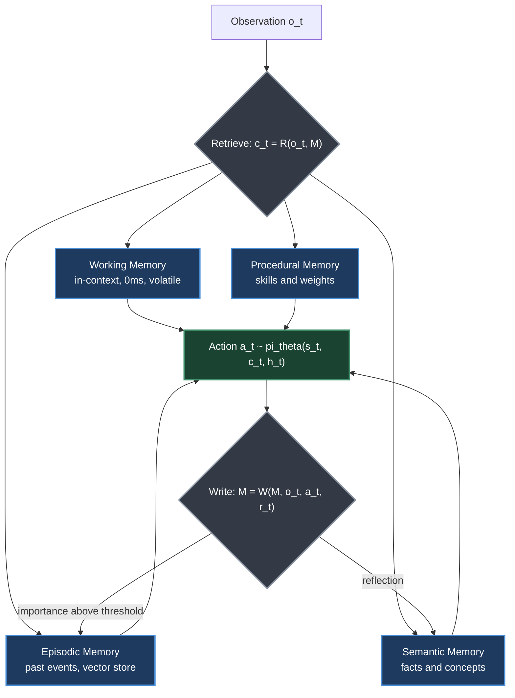
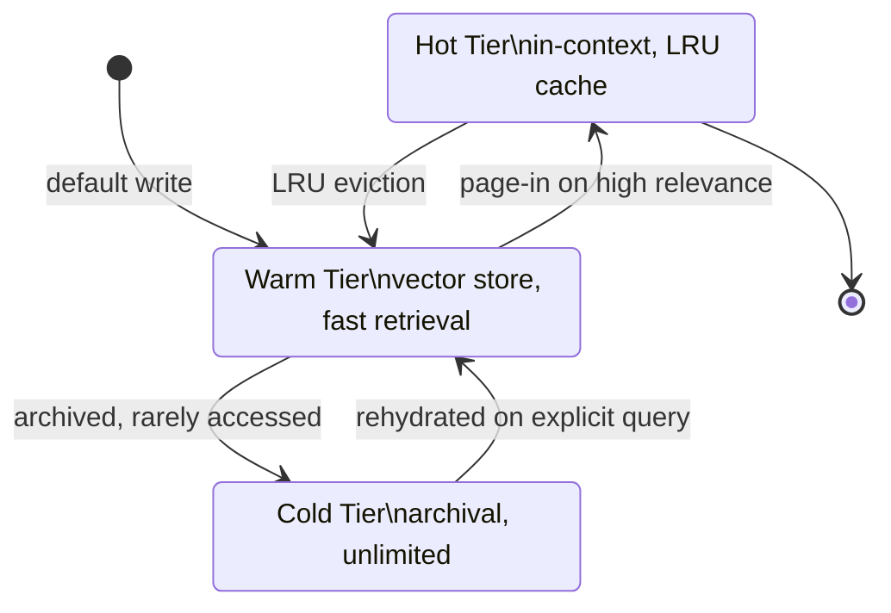
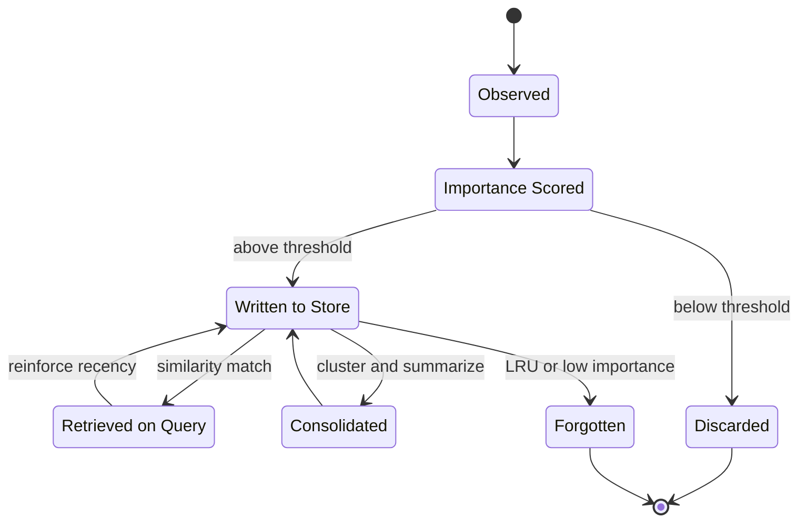
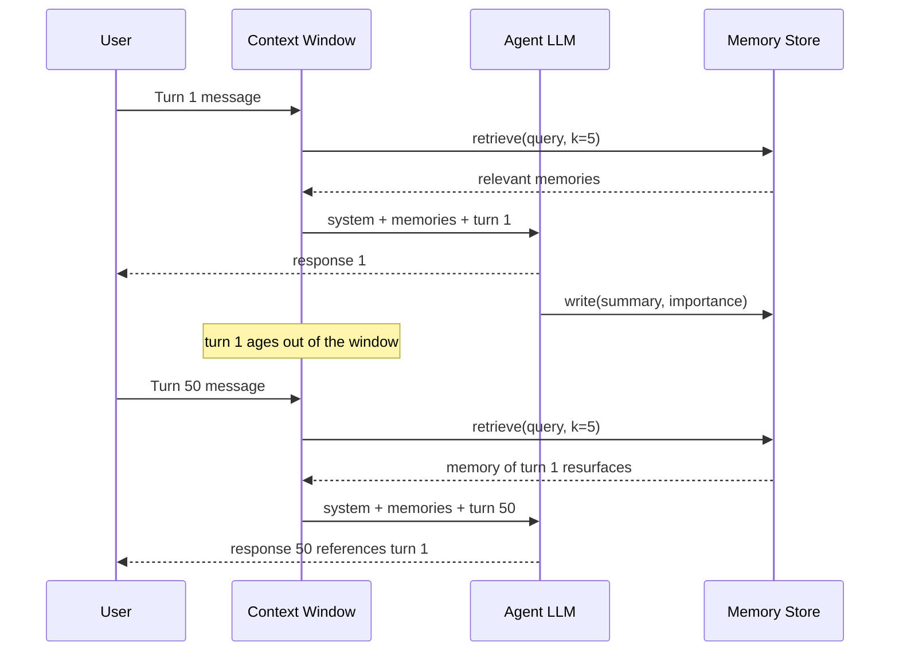
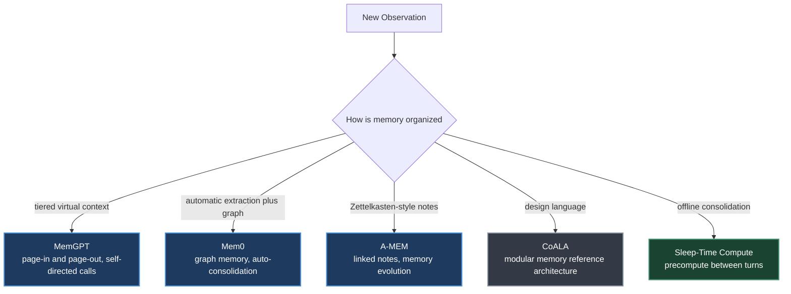
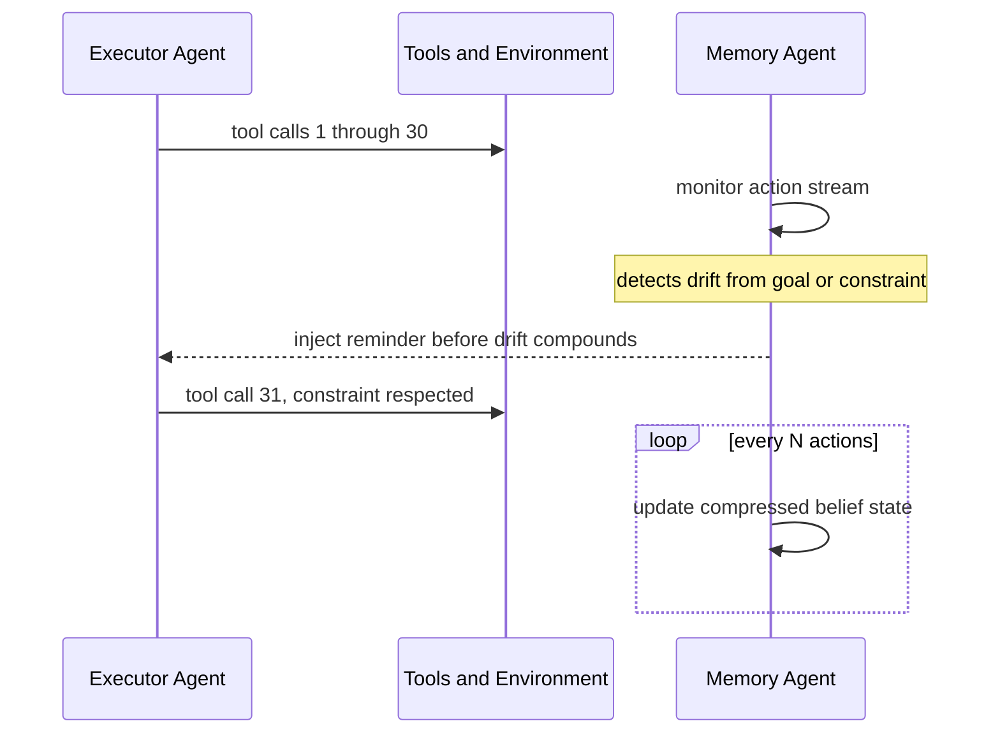

# Chapter 17. Agentic Memory Systems

> *"Memory is not a passive store but an active participant in cognition."*
> — H. Roitman

**Part V — Agentic AI** · Book pages 333–356 · ~24 min read

[← Chapter 16. Retrieval-Augmented Generation](16-retrieval-augmented-generation.md) · [Index](../README.md) · [Chapter 18. Agent Harness — Context Management and Orchestration →](18-agent-harness-context-and-orchestration.md)

---

## What This Chapter Is About

A large language model (LLM) is a stateless function approximator: every call starts from nothing but the prompt in front of it. The context window — the finite token sequence the model can attend to — is the entire world it knows at generation time. That is fine for a single self-contained question. It breaks down for an agent that runs for hours, days, or months: observations, tool outputs, and reasoning traces accumulate faster than any fixed window can hold, and once a fact scrolls out of context it is gone.

Memory systems are the engineering answer to that physical constraint. This chapter builds a taxonomy of memory types borrowed from cognitive science (working, episodic, semantic, procedural), surveys the architectures used to implement each (vector stores, knowledge graphs, key-value memory networks, MemGPT-style tiered context), and formalizes the four operations every memory system must support: write, read, update, and reflect. It closes with how memory is trained end-to-end with reinforcement learning (RL), how it is evaluated, and a 2026 development — proactive memory architectures that monitor an agent's behavior and intervene before it drifts, rather than waiting to be queried.

A reader who takes away only one idea should take this: memory is not a bigger context window. It is a separate subsystem with its own write policy, its own forgetting policy, and its own failure modes — and designing it well is now a first-class agent-engineering skill, distinct from prompt engineering or retrieval engineering.

## Table of Contents

- [The Mental Model](#the-mental-model)
- [Why Agents Need Memory](#why-agents-need-memory)
- [A Taxonomy of Memory Types](#a-taxonomy-of-memory-types)
- [Memory vs. Retrieval-Augmented Generation](#memory-vs-retrieval-augmented-generation)
- [Memory Architectures](#memory-architectures)
  - [RAG-Based Memory](#rag-based-memory)
  - [Summarization-Based Memory](#summarization-based-memory)
  - [Graph-Based Memory](#graph-based-memory)
  - [Key-Value Memory Networks](#key-value-memory-networks)
  - [MemGPT and Virtual Context Management](#memgpt-and-virtual-context-management)
- [Memory Operations](#memory-operations)
  - [Write: Committing to Memory](#write-committing-to-memory)
  - [Read and Retrieve](#read-and-retrieve)
  - [Update: Conflict Resolution and Consolidation](#update-conflict-resolution-and-consolidation)
  - [Reflect: Meta-Cognitive Operations](#reflect-meta-cognitive-operations)
- [Memory Across Turns, Sessions, and Agents](#memory-across-turns-sessions-and-agents)
- [Training Memory Systems with Reinforcement Learning](#training-memory-systems-with-reinforcement-learning)
- [Comparing Memory Architectures](#comparing-memory-architectures)
- [Evaluating Memory Systems](#evaluating-memory-systems)
- [Named Systems and Recent Advances](#named-systems-and-recent-advances)
- [Proactive Memory Architectures](#proactive-memory-architectures)
- [Key Formulas](#key-formulas)
- [Decision Guide](#decision-guide)
- [Common Pitfalls](#common-pitfalls)
- [Summary](#summary)
- [Practitioner Checklist](#practitioner-checklist)
- [Going Deeper](#going-deeper)

---

## The Mental Model

*Every agent step retrieves from four cognitively distinct memory types, acts, and then selectively writes back — episodic memory captures the raw event, and reflection distills it into semantic knowledge.*

This is the formal skeleton the whole chapter builds on. An agent is modeled as a tuple $A = (\pi_\theta, M, R, W)$: a policy $\pi_\theta$ (the LLM), a memory store $M$, a retrieval function $R: Q \times M \to D$ mapping queries to documents, and a write function $W: M \times E \to M$ updating memory with new experience $E$. At each step $t$ the agent observes $o_t$, retrieves $c_t = R(o_t, M)$, and acts as $a_t \sim \pi_\theta(\cdot \mid [s_t; c_t; h_t])$ — conditioning on the system prompt $s_t$, retrieved memory $c_t$, and recent in-context history $h_t$. After acting, it may write: $M \leftarrow W(M, (o_t, a_t, r_t))$. Everything else in the chapter — which memory type to retrieve from, what triggers a write, how consolidation and forgetting keep $M$ bounded — is a design decision inside this loop.

## Why Agents Need Memory

Context length $L$ is finite (GPT-4o's is 128,000 tokens); a single token is roughly 4 characters, and a typical book runs to about 670,000 tokens. A multi-day autonomous agent accumulates observations, tool outputs, and reasoning traces that simply cannot fit in any fixed window, regardless of cost. Roitman identifies three failure modes that follow from memoryless agents:

1. **Catastrophic forgetting of context.** Once an event scrolls out of the context window it is irrecoverably lost — the agent cannot refer back to a decision made 10,000 tokens ago.
2. **Inability to learn from experience.** Without episodic storage, every episode is the agent's first: successful strategies aren't reused, and mistakes repeat.
3. **Lack of personalization.** User preferences, domain facts, and relationship history must be re-established every session.

Cognitive science distinguishes several memory systems in biological agents — working memory (active manipulation), episodic memory (autobiographical events), semantic memory (world knowledge), and procedural memory (skills and habits). Roitman argues that agentic AI benefits from the analogous distinctions not because it simulates neuroscience, but because these categories reflect genuinely different access patterns, update frequencies, and retrieval mechanisms — a claim the rest of the chapter cashes out concretely.

## A Taxonomy of Memory Types

| Type | What It Stores | Lifetime | Write Trigger | Retrieval Mechanism | Example |
|---|---|---|---|---|---|
| **Working (short-term)** | Scratchpad reasoning, chain-of-thought tokens $z_1, \dots, z_k$, recent turn history $[(u_1,a_1),\dots,(u_t,a_t)]$ | Volatile — lost when context clears | Automatic (part of generation) | Already in context: 0 ms latency | The current file being edited, the error message just received |
| **Episodic** | Full or summarized past interactions, successful trajectories, documented failures with root causes | Persists across sessions until evicted or forgotten | On episode end, above an importance threshold | Vector similarity search over episode-summary embeddings; top-$k$ retrieval for a new task $q$ | "Last week I fixed a similar NullPointerException in module X by adding a null check at line 42" |
| **Semantic** | Factual knowledge (entities, attributes, relationships), domain concepts, knowledge-graph triples $(h,r,t)$ | Persists indefinitely — context-independent | Extracted from episodes via reflection, or ingested directly | Embedding lookup or graph traversal (SPARQL, Cypher, or natural-language-to-graph) | "Python's `asyncio.gather` runs coroutines concurrently; exceptions propagate unless `return_exceptions=True`" |
| **Procedural** | Learned tool-use patterns, multi-step action sequences, and — at the limit — the model weights $\theta$ themselves | Very long-lived; changes only via fine-tuning or explicit pattern storage | Consolidated from repeated successful trajectories; fine-tuning is a form of write | Invoked directly as a learned behavior, not queried like a document | The standard debugging workflow: reproduce → isolate → hypothesize → test → fix |

Working memory is fast (zero retrieval latency, it's already in context), volatile, and capacity-limited by $L$. The other three are external stores that trade retrieval latency for unbounded capacity and persistence across sessions — which is the entire point of building them.

## Memory vs. Retrieval-Augmented Generation

Chapter 16 covers Retrieval-Augmented Generation (RAG): retrieval over a fixed, typically curated, external corpus — documentation, a knowledge base, a set of files someone else wrote. Agentic memory reuses much of RAG's machinery (embedding stores, ANN indices, hybrid retrieval, re-ranking — Section 17.3.1 below) but for a fundamentally different store: one the agent itself writes, continuously, about its own experience.

| | RAG (Chapter 16) | Agentic Memory (this chapter) |
|---|---|---|
| Who writes the store | A separate ingestion pipeline, typically offline | The agent itself, online, during and after acting |
| Content | External documents — docs, manuals, files | The agent's own observations, decisions, outcomes, reflections |
| Corpus stability | Fixed (or slowly updated) between queries | Continuously growing and mutating |
| Persistence | Corpus persists; nothing "about the agent" is stored | Persists specifically across sessions and tasks |
| Core failure mode | Retrieving an outdated or irrelevant document | Forgetting, staleness, and contradiction within self-written facts |

In practice the two compose: a production agent typically runs RAG over a static knowledge base *and* a memory system over its own history, retrieving from both into the same context (Section 17.6.1 makes this explicit for multi-agent shared pools). Treat memory as "RAG over the agent's own life," with write and forget policies RAG never needed.

## Memory Architectures

### RAG-Based Memory

The dominant paradigm for external memory: the memory store $M$ is a collection of documents $\{d_i\}_{i=1}^N$, each encoded by an embedding model $\phi$: $v_i = \phi(d_i) \in \mathbb{R}^D$. A query is encoded the same way, and retrieval returns the top-$k$ documents by similarity:

$$\text{Retrieve}(q, M, k) = \arg\max_{S \subseteq [N],\, |S|=k} \sum_{i \in S} \text{sim}(q, v_i)$$

Approximate nearest-neighbor indices — FAISS, HNSW, ScaNN — make this tractable at $N \sim 10^7$. Three strategies: **dense** (neural encoders like DPR or `text-embedding-3-large`, strong semantic match, needs GPU inference), **sparse** (BM25/TF-IDF token overlap, fast, strong on exact keyword matches), and **hybrid**, fusing both via reciprocal rank fusion:

$$\text{RRF}(d,k) = \sum_{r \in \text{rankers}} \frac{1}{k + \text{rank}_r(d)}, \quad k = 60$$

Hybrid consistently beats either alone. A cross-encoder re-ranker $f_\psi(q,d) \in [0,1]$ can then score candidates jointly with the query at the cost of $O(k)$ extra forward passes: retrieve $k' \gg k$ with ANN, re-rank, return top $k$.

> [!WARNING]
> RAG does not eliminate hallucination — it can introduce it. If a retrieved document is outdated, incorrect, or only superficially relevant, the model may confidently incorporate false information. Always attach provenance metadata (source, timestamp, confidence) and consider a faithfulness-verification step.

### Summarization-Based Memory

When verbatim storage is too expensive or noisy, summarization compresses information before storage. **Progressive summarization** maintains a running summary $S_t$, updated as new information $e_t$ arrives:

$$S_{t+1} = \text{LLM}(\text{"Summarize: } [S_t] + [e_t]\text{"})$$

This keeps memory size $O(1)$ but risks losing detail. **Hierarchical compression** organizes memory in levels $L_0 \supset L_1 \supset \cdots \supset L_K$, where $L_0$ is verbatim and each $L_{i+1}$ summarizes $L_i$; retrieval checks the most-compressed level first and drills down as needed (mirroring the technique used by Forte). The practical rule of thumb: store verbatim for precise facts, code snippets, numbers, and user quotes; summarize narrative context and reasoning chains; discard noise and failed tool calls with no informational content.

### Graph-Based Memory

A knowledge graph $G = (V, E, R)$ stores facts as triples $(h, r, t)$, queryable via SPARQL, Cypher, or natural-language-to-graph translation. New observations pass through an extraction model $IE: \text{text} \to \{(h_i, r_i, t_i)\}$, merged into $G$ with coreference resolution and entity linking for consistency. **GraphRAG** augments retrieval with graph traversal — given a query, retrieve seed entities, then expand via $k$-hop neighborhood traversal to surface related facts embedding similarity alone would miss:

$$\text{GraphRetrieve}(q, G, k) = \bigcup_{v \in \text{seeds}(q)} N_k(v, G)$$

This is particularly valuable for multi-hop reasoning. **Temporal knowledge graphs** extend triples with validity intervals, $(h, r, t, [t_{\text{start}}, t_{\text{end}}])$, enabling queries like "Who was the CEO of OpenAI in 2023?" without conflating past and present states.

### Key-Value Memory Networks

Differentiable memory networks represent memory as key-value pairs $\{(k_i, v_i)\}_{i=1}^M$ with soft, attention-based retrieval:

$$\alpha_i = \text{softmax}\left(\frac{q^\top k_i}{\sqrt{D}}\right), \quad c = \sum_{i=1}^M \alpha_i v_i$$

The retrieved context $c$ is a differentiable function of the query, enabling end-to-end training — modern transformer attention is a special case of this mechanism. For agentic use, memory slots can be updated by gradient descent or by explicit write operations.

### MemGPT and Virtual Context Management

MemGPT introduces a virtual-context abstraction analogous to virtual memory in operating systems: memory organized into tiers, with items promoted into "hot" in-context memory (page-in) or evicted (page-out) based on recency, relevance, and an importance tag assigned at write time. Crucially, MemGPT lets the **LLM itself** issue memory-management function calls (`memory_search`, `memory_insert`, `memory_delete`) as part of its action space — making memory management a learned behavior rather than a hard-coded policy, and a natural target for RL training (see below).

*MemGPT's tiered memory mirrors CPU cache hierarchies: hot is free but tiny, warm is fast and bounded, cold is slow but unlimited.*

## Memory Operations

### Write: Committing to Memory

Not every observation should be stored. The write decision is a filtering problem:

$$\text{Write}(e) = \mathbb{1}[\text{importance}(e) > \tau]$$

Importance can be scored by **surprise** ($-\log p_\theta(e \mid \text{context})$ — unexpected events are more informative), by **reward signal** (events tied to high $|r_t|$ are worth remembering), or by **LLM self-assessment** (prompt the model to rate importance 1–10). Before writing a new fact $f_{\text{new}}$, check for conflicts: $\text{Conflict}(f_{\text{new}}, M) = \exists\, f \in M: \text{Contradicts}(f_{\text{new}}, f)$, implemented via a natural-language-inference (NLI) model or by prompting the LLM. On conflict the agent chooses: overwrite, keep both with timestamps, or flag for human review.

Granularity is a second, independent design axis:

| Format | Pros | Cons |
|---|---|---|
| Atomic facts (e.g. "User prefers Python.") | Precise retrieval, composable, easy deduplication and contradiction detection | Loses context; extraction errors; brittle for nuance |
| Structured notes (A-MEM) | Rich metadata — tags, links; supports graph traversal; balances precision and context | Higher write cost; schema design required |
| Summarized episodes (MemGPT) | Preserves narrative coherence; compact; good for multi-turn reasoning | Summarization is lossy; hard to update partially |
| Verbatim transcripts | Lossless; no extraction errors; supports exact quotation | Large storage; noisy retrieval; expensive to scan |

Production systems typically combine granularities: atomic facts for precise recall, summarized episodes for narrative context, verbatim transcripts archived cold for auditability. The Generative Agents architecture stores observations as atomic "memory objects" with natural-language descriptions, importance scores, and timestamps, supporting both precise retrieval and temporal reasoning. Two rules follow: match granularity to query type (factoid questions want atomic facts, "why" questions want episode summaries), and store at the finest grain you can afford — summarizing atoms later is easy, recovering them from a lossy summary is not. Every entry should carry provenance so both agent and user can audit it.

### Read and Retrieve

The retrieval query $q$ need not be the raw observation. Three query-reformulation strategies do better: **HyDE** (Hypothetical Document Embeddings — generate a hypothetical answer, embed *that*, and use it as the query), **query expansion** (generate paraphrases, union the retrieved results), and **step-back prompting** (abstract the specific query to a more general one before retrieving).

Older memories may be less relevant even when topically similar. A time-weighted score handles this:

$$\text{score}(d, q, t) = \lambda \cdot \text{sim}(q, v_d) + (1-\lambda) \cdot \exp\left(-\frac{t - t_d}{\tau_{\text{decay}}}\right)$$

where $t_d$ is the memory's creation time and $\tau_{\text{decay}}$ controls how fast recency fades. The Generative Agents paper uses a similar recency-weighted retrieval score.

### Update: Conflict Resolution and Consolidation

Consolidation merges related memories to cut redundancy and surface higher-level patterns:

$$M' = \text{Consolidate}(M) = \text{Cluster}(M) \cup \text{Summarize}(\text{Cluster}(M))$$

Forgetting is the counterpart — biological memory forgets, and so should artificial memory, or storage grows unbounded. Three mechanisms: **LRU eviction** (drop least-recently-used entries at capacity), **importance-weighted forgetting** ($p(\text{forget} \mid d) \propto \exp(-\text{importance}(d))$), and **spaced repetition** (repeatedly-accessed memories are retained longer, following the exponential forgetting curve).

*The full memory lifecycle: most observations are discarded at the importance gate; survivors are stored, occasionally retrieved and consolidated, and eventually forgotten unless reinforced by access.*

### Reflect: Meta-Cognitive Operations

Reflection is a higher-order operation: the agent reads its own memory and generates insights, $\text{Reflect}(M) \to \{i_1, i_2, \dots\} \subset M_{\text{semantic}}$, where each insight is a higher-level abstraction derived from multiple episodic memories. This is the core mechanism behind **Reflexion** (verbal reinforcement learning via self-reflection): after three failed attempts at a coding problem, the agent retrieves the three failure episodes, generates the insight "I keep forgetting to handle the edge case where the input list is empty," stores it in semantic memory, and checks explicitly for empty inputs on the next attempt.

Reflection's inputs and outputs live in different memory types: it *reads* from episodic memory (specific past events), *computes* in working memory (the active reasoning happens in context), and *writes* to semantic memory (the resulting insight is a context-independent generalization, not an episode-specific record). This mirrors biological consolidation, where episodic experience is gradually transformed into semantic knowledge during sleep and reflection.

## Memory Across Turns, Sessions, and Agents

A persistent user model $U$ tracks explicit preferences, implicit preferences inferred from behavior, expertise level, and ongoing goals — updated after each interaction as $U_{t+1} = \text{Update}(U_t, (u_t, a_t, \text{feedback}_t))$. Session continuity follows a three-step pattern: at session start, retrieve $U$ and recent session summaries and inject them into a personalized system prompt ("You are helping Alice, a senior ML engineer... Last session you helped debug a gradient synchronization issue"); at session end, summarize the session and update $U$.

*The context window forgets by turn 50; the memory store does not — retrieval is what lets a fact from turn 1 reach turn 50's prompt.*

Personalization improves both efficiency (fewer clarifying questions) and quality (responses calibrated to expertise) through adaptive verbosity, domain priming from semantic memory, and proactive recall ("You asked about this topic last month; here's what we found then").

> [!IMPORTANT]
> Persistent user memory raises real privacy concerns. Agents must obtain explicit consent before storing personal information, provide mechanisms to inspect and delete stored memories, enforce access controls in multi-user deployments, and comply with retention regulations (GDPR, CCPA). Design for privacy-by-default, not as an afterthought.

When multiple agents collaborate, memory becomes a coordination mechanism, not just a personal store. Without shared memory, agents must communicate everything through direct messages, creating bandwidth bottlenecks and losing information as conversations scroll out of context. A **shared memory pool** $M_{\text{shared}}$ alongside private stores $M_i$ gives each agent context $\text{context}_i(t) = R(M_i, q_i) \cup R(M_{\text{shared}}, q_i)$ — agent A writes a finding, agent B retrieves it, with no explicit message passing required. The **blackboard architecture** formalizes this: every agent reads from and writes to a shared blackboard, and a controller monitors it and activates agents when their preconditions are met, decoupling agents from direct messaging entirely.

Concurrent writes to shared memory create conflicts, resolved by one of: last-write-wins (simple, loses information), versioned memory (keep full write history, query any version), voting/consensus (require $k$-of-$n$ agents to agree), confidence-weighted merging ($f_{\text{merged}} = \sum_i w_i f_i$ weighted by agent confidence), or designated authority (assign ownership of memory regions to specific agents).

> [!NOTE]
> Roitman flags distributed memory consistency under concurrent writes, network partitions, and adversarial agents as an open problem. Classical solutions (Paxos, Raft) apply but are expensive; approximate consistency with bounded staleness may suffice for many agentic tasks, but the right trade-off is unresolved.

## Training Memory Systems with Reinforcement Learning

Memory operations — read, write, update, reflect — can be treated as actions in an RL framework. The challenge is reward design. Four signal types combine into a per-step memory reward:

$$r_t^{\text{mem}} = r_t^{\text{task}} + \alpha \cdot r_t^{\text{retrieve}} + \beta \cdot r_t^{\text{write}} + \gamma \cdot r_t^{\text{consistency}}$$

where $r^{\text{task}}$ propagates the eventual task outcome back to the retrieval action that enabled it (sparse but unambiguous), $r^{\text{retrieve}} = \text{Relevance}(d_{\text{retrieved}}, \text{task})$ comes from a learned relevance model, $r^{\text{write}} = -\lambda \cdot \mathbb{1}[\text{write}]$ penalizes unnecessary writes to encourage selectivity, and $r^{\text{consistency}}$ rewards internally contradiction-free memory states.

The harder problem is *learning what to remember*: a write policy $\pi_{\text{write}}(e)$ that maximizes future task performance, made difficult because a memory's value is only revealed later (delayed reward), the space of future queries is unknown at write time, and memories interact (the value of storing $e$ depends on what else is in $M$). Three approaches: **hindsight relabeling** (after a successful episode, retroactively label the memories that were retrieved as "important" and train the write policy toward similar items), **meta-RL** (train the write policy across a distribution of tasks so it learns to store what generalizes), and **curiosity-driven storage** (store observations with high prediction error, since surprising items tend to be informative).

Jointly optimizing the policy and the memory system dates to differentiable memory networks and was extended to retrieval-augmented LLMs by REALM. The full objective for a memory-augmented agent:

$$\mathcal{L}(\theta, \phi) = \mathbb{E}_{\tau \sim \pi_\theta}\left[\sum_{t=0}^{T} \gamma^t r_t\right] - \lambda \cdot \mathcal{L}_{\text{mem}}(\phi)$$

where $\theta$ are the LLM parameters, $\phi$ are the memory system's parameters (e.g. retrieval-model weights), and $\mathcal{L}_{\text{mem}}$ regularizes memory complexity. Trained this way, a coding agent learns to store API signatures, a research agent learns to store citation chains, and a customer-service agent learns to store complaint patterns — memory becomes a learned inductive bias tailored to the domain, rather than a fixed heuristic.

## Comparing Memory Architectures

| Architecture | Capacity | Retrieval Latency | Update Cost | Trainable | Best For |
|---|---|---|---|---|---|
| In-context (working) | $O(L)$ tokens | 0 ms | Free | Via fine-tuning | Short tasks, active reasoning |
| Dense RAG | $O(10^7)$ docs | 10–50 ms | $O(1)$ embed | Encoder only | Semantic search, QA |
| Sparse (BM25) | $O(10^8)$ docs | 1–5 ms | $O(\lvert d \rvert)$ index | No | Keyword search, legal/medical |
| Hybrid RAG | $O(10^7)$ docs | 15–60 ms | $O(1)$ embed | Encoder only | General-purpose retrieval |
| Summarization | Unlimited | 0 ms (in-context) | $O(\lvert e \rvert)$ LLM call | Via fine-tuning | Long conversations, narratives |
| Knowledge Graph | $O(10^9)$ triples | 5–100 ms | $O(1)$ insert | Embedding layer | Structured facts, multi-hop |
| KV Memory Net | $O(M)$ slots | $O(M)$ attention | Gradient step | Fully | End-to-end differentiable tasks |
| MemGPT tiered | Unlimited | 0–100 ms | Mixed | Via RL | Long-horizon agents, assistants |
| Graph RAG | $O(10^7)$ nodes | 20–200 ms | $O(1)$ insert | Encoder only | Complex reasoning, communities |

## Evaluating Memory Systems

Evaluating agentic memory is hard because memory quality is revealed only indirectly, through downstream task performance over long horizons — a system with perfect recall of stored facts can still fail if it retrieves irrelevant context or overwhelms the context window. LongMemEval identifies five capabilities a long-term memory system must demonstrate: **information extraction** (can it identify and store salient facts, measured by fact recall — the fraction of ground-truth facts recoverable from memory?), **multi-session reasoning** (can it synthesize information scattered across sessions?), **temporal reasoning** (can it correctly answer time-dependent queries that require distinguishing past from present states?), **knowledge updates** (does memory reflect the latest fact while preserving history when a user's situation changes?), and **abstention** (does it correctly say "I don't know" when no relevant memory exists, rather than hallucinate a plausible recollection?).

| Benchmark | Venue | Scale | Focus |
|---|---|---|---|
| LongMemEval | ICLR 2025 | 500 questions, scalable histories | Five memory abilities; multi-session chat |
| LOCOMO | EMNLP 2024 | Multi-session dialogues | Single-hop, temporal, multi-hop, open-domain QA over conversations |
| InfiniteBench | ACL 2024 | 100K+ token contexts | Long-context recall — not memory-specific but tests the limits |

Metrics fall into three tiers. **Memory-level**: memory recall (ground-truth facts retrievable / total ground-truth facts), memory precision (relevant items in top-$k$), latency (p50/p95), and token efficiency (tokens injected per query — lower is better, since unnecessary context degrades accuracy and raises cost). **Downstream**: answer accuracy (exact match, F1, or LLM-as-judge), faithfulness (does the response actually reflect what memory contains?), personalization quality (A/B preference ratings against a memoryless baseline), and contradiction rate. **Operational**: write selectivity (fraction of turns that trigger a write — too high is noise, too low is gaps), staleness (how often outdated facts surface despite a newer one existing), and storage growth rate (tokens stored per interaction-hour, which must stay bounded).

> [!NOTE]
> Most published memory papers evaluate on short benchmarks (10–50 sessions), while production agents run for months across thousands of sessions. Long-horizon evaluation — where memory drift, contradiction accumulation, and storage bloat become the dominant failure modes — remains an open challenge; Roitman recommends pairing benchmark scores with longitudinal monitoring of the operational metrics above.

## Named Systems and Recent Advances

*Five approaches to the same problem — organizing what an agent remembers — differing mainly in when memory is written and how much structure it carries.*

**CoALA** (Cognitive Architectures for Language Agents, Sumers et al.) is less a new system than a design language: it decomposes a language agent into modular memory (the same working/episodic/semantic/procedural taxonomy this chapter uses), a structured action space (internal reasoning and memory writes vs. external tool use), and a generalized sense-plan-act decision cycle. Its value is as a reference architecture for auditing what capabilities an existing agent is missing.

**Mem0** targets the gap between research memory systems and production deployment. Instead of relying on the LLM to explicitly issue memory-write commands, it automatically extracts salient facts from conversation turns and consolidates them into a persistent store; it maintains a relational graph over extracted entities (not just a flat vector store) to support multi-hop queries like "what did the user say about topic X in the context of project Y"; and it automatically merges redundant or superseded facts to keep the store compact and current. On the LOCOMO benchmark, Mem0 reports a 26% relative improvement over OpenAI's baseline memory, 91% lower p95 latency, and over 90% lower token cost versus full-context approaches.

**Sleep-time compute** (Lin et al.) processes and consolidates memory *between* user interactions rather than only at query time — the biological-sleep analogy is explicit. During idle periods the agent anticipates likely future queries given the current context, pre-computes reasoning chains and summaries, and stores these artifacts for test-time reuse. Reported results: roughly 5× less test-time compute for equivalent accuracy on reasoning benchmarks, and a 2.5× average per-query cost drop when amortized across related queries about the same context. It works best when user queries are predictable — i.e., when context strongly constrains what will be asked next. Roitman frames this as offline policy improvement: the agent improves its memory representations during idle time using data it has already collected, without new environment interaction — connecting it to offline RL (Chapter 8).

**A-MEM** borrows from the Zettelkasten note-taking method — densely interconnected atomic notes — for dynamic, self-organizing agent memory. Each entry is a structured note (contextual description, keywords, tags, explicit links), not a raw text chunk. Adding a new memory triggers the system to identify semantically meaningful connections to existing memories and establish bidirectional links, forming a knowledge network rather than a flat list. Critically, a new note can trigger *updates* to existing notes — refining their attributes as understanding deepens — making memory a living structure rather than a static archive, with the LLM itself deciding how to organize, link, and update entries. Across six foundation models on multi-session reasoning tasks, A-MEM consistently outperforms flat vector stores, summarization-based memory, and graph-database approaches — evidence that *how* memories are organized matters as much as *what* is stored.

The read-act-reflect-write cycle these systems implement mirrors both the observe-orient-decide-act (OODA) loop from military strategy and the encode-store-retrieve model from cognitive psychology: retrieve relevant memories before acting, generate a response conditioned on that context, periodically synthesize higher-level insights, and selectively commit new information — memory as an active participant in cognition, not a passive log.

## Proactive Memory Architectures

Standard memory systems are reactive: the agent queries memory when it decides it needs information. But long-horizon agentic tasks suffer from **behavioral state decay** — after dozens of tool calls, an executor agent loses track of its original goals, constraints, and accumulated context, and by the time it queries memory the drift has often already happened. Proactive memory architectures (Meta AI, July 2026, "Remember When It Matters") invert this: a dedicated memory agent monitors the executor continuously and injects constraints *before* the executor drifts.

The architecture splits into two decoupled agents. The **executor agent** handles task execution — tool calls, reasoning, output generation — and keeps a lean context focused on the immediate subtask. The **memory agent** runs in parallel, monitoring the executor's action stream, and maintains a compressed representation of long-term goals and success criteria, active constraints (safety rules, user preferences, resource limits), and key decisions made earlier in the trajectory. It injects reminders into the executor's context only when it detects drift — when recent actions suggest the executor has forgotten a constraint or is moving away from the stated goal.

*The memory agent watches the executor's action stream and only speaks up when it detects drift — proactive intervention, not on-demand retrieval.*

On long-horizon benchmarks (50+ tool calls per task), the memory agent produces dramatically higher success rates on tasks requiring sustained constraint adherence (e.g. "never modify files in /prod," "always cite sources"), and graceful degradation: without it, executor success rates drop sharply after roughly 30 tool calls, while with it performance stays stable to 100+ calls. The primary cost is roughly a **40% increase in API cost**, from the extra LLM calls the memory agent spends on monitoring and injection.

Roitman gives this an explicit RL reading: the memory agent functions as a state summarizer, analogous to the attention mechanism in an actor-critic architecture that selectively weights relevant past states for the value function. In a partially observable Markov decision process (POMDP), it maintains the belief state — a compressed sufficient statistic of history relevant to future decisions. The injection mechanism resembles privileged information in asymmetric actor-critic training: the memory agent sees the full trajectory, the executor operates on a compressed context. The 40% cost increase is the concrete price of the classic trade-off between a Markov (sufficient but expensive) state representation and a truncated (cheap but lossy) one — and Roitman suggests jointly training the executor policy and the memory agent's injection policy as a promising RL direction.

## Key Formulas

| Formula | Symbols | What It Governs |
|---|---|---|
| $a_t \sim \pi_\theta(\cdot \mid [s_t; c_t; h_t])$, $M \leftarrow W(M, (o_t, a_t, r_t))$ | $s_t$ system prompt, $c_t$ retrieved memory, $h_t$ recent history, $r_t$ reward | The core agent-memory loop every operation in this chapter plugs into |
| $\text{Retrieve}(q, M, k) = \arg\max_{S,\lvert S\rvert = k} \sum_{i \in S} \text{sim}(q, v_i)$ | $v_i = \phi(d_i)$ document embedding | Top-$k$ vector retrieval |
| $\text{RRF}(d,k) = \sum_r \frac{1}{k + \text{rank}_r(d)}$, $k=60$ | $r$ ranges over rankers (dense, sparse) | Fusing dense and sparse retrieval scores |
| $\text{Write}(e) = \mathbb{1}[\text{importance}(e) > \tau]$ | $\tau$ write threshold | Filtering which observations get committed to memory |
| $\text{score}(d,q,t) = \lambda \cdot \text{sim}(q, v_d) + (1-\lambda)\exp(-\frac{t-t_d}{\tau_{\text{decay}}})$ | $t_d$ memory creation time, $\tau_{\text{decay}}$ decay rate | Recency-weighted retrieval scoring |
| $M' = \text{Cluster}(M) \cup \text{Summarize}(\text{Cluster}(M))$ | — | Memory consolidation |
| $p(\text{forget} \mid d) \propto \exp(-\text{importance}(d))$ | — | Importance-weighted forgetting |
| $r_t^{\text{mem}} = r_t^{\text{task}} + \alpha r_t^{\text{retrieve}} + \beta r_t^{\text{write}} + \gamma r_t^{\text{consistency}}$ | $\alpha,\beta,\gamma$ weighting coefficients | Combined reward for training memory operations with RL |
| $\mathcal{L}(\theta,\phi) = \mathbb{E}_\tau[\sum_t \gamma^t r_t] - \lambda \mathcal{L}_{\text{mem}}(\phi)$ | $\theta$ policy params, $\phi$ memory-system params | Joint policy gradient objective for a memory-augmented agent |

## Decision Guide

| If you need... | Reach for | Because |
|---|---|---|
| Zero-latency access to what you're already reasoning about | Working memory (context window) | It's already there — no retrieval step, but bounded by $L$ |
| "What did we decide/try last time" recall across sessions | Episodic memory over a vector store | Purpose-built for retrieving similar past events by embedding similarity |
| Durable facts independent of when they were learned | Semantic memory — atomic facts or a knowledge graph | Context-independent; graph form adds multi-hop querying |
| An agent that reuses a skill without re-deriving it | Procedural memory / fine-tuning on successful trajectories | Bakes the pattern into the policy rather than retrieving it every time |
| Exact keyword or legal/medical term matching | Sparse (BM25) retrieval | Fast, interpretable, strong on exact overlap; no embedding cost |
| General-purpose semantic search over a growing store | Hybrid RAG (dense + sparse + RRF) | Consistently beats either retrieval mode alone |
| Multi-hop reasoning over related entities | GraphRAG / temporal knowledge graph | Traversal surfaces facts embedding similarity alone misses |
| A single coherent conversational memory across a long chat | MemGPT-style tiered memory | Self-directed page-in/page-out keeps hot context small and current |
| Coordinating several agents without message-passing overhead | Shared memory pool / blackboard | Turns implicit coordination into explicit, queryable state |
| Sustained constraint adherence over 50+ tool calls | Proactive memory agent | Reactive retrieval alone lets behavioral drift compound unchecked |
| Reducing test-time cost for predictable, related queries | Sleep-time compute | Pre-computes reasoning between turns instead of at query time |

## Common Pitfalls

> [!WARNING]
> **Retrieval hallucination.** RAG-style memory retrieval does not remove hallucination risk — an outdated or superficially relevant memory can be confidently incorporated as if it were current fact. Attach provenance and timestamps to every entry, and verify faithfulness before trusting a retrieved memory.

> [!WARNING]
> **Unbounded storage growth.** Writing every observation with no importance threshold, deduplication, or forgetting policy makes the store grow without bound, degrading both retrieval latency and precision. Track storage growth rate and write selectivity as operational metrics, not just accuracy.

> [!WARNING]
> **Staleness from missed conflict detection.** Writing a new fact without checking for contradictions against existing memory lets outdated facts keep surfacing after the user's situation has changed (e.g. moved cities, changed preferences). Run contradiction detection before every write, and decide explicitly whether to overwrite, version, or flag for review.

> [!WARNING]
> **Privacy as an afterthought.** Persistent user memory that stores personal information without consent, inspection, deletion, or access controls violates privacy expectations and regulations (GDPR, CCPA) regardless of how good the retrieval is. Design consent and deletion paths in from the start.

> [!WARNING]
> **Evaluating only on short benchmarks.** A memory system that scores well on 10–50 session benchmarks can still fail in production after months of accumulated drift, contradiction, and storage bloat — because those failure modes only appear at scale that short benchmarks don't reach.

## Summary

- An agent is formally $A = (\pi_\theta, M, R, W)$: at each step it retrieves $c_t = R(o_t, M)$, acts as $a_t \sim \pi_\theta(\cdot \mid [s_t; c_t; h_t])$, and may write $M \leftarrow W(M, (o_t, a_t, r_t))$ — every memory design decision lives inside this loop.
- The four-way taxonomy — working, episodic, semantic, procedural — maps to distinct access patterns: working memory is free but volatile and bounded by context length $L$; the other three trade retrieval latency for persistence and unbounded capacity.
- Memory differs from RAG (Chapter 16) in who writes the store and what it contains: RAG retrieves from a fixed external corpus someone else curated, while memory is written continuously by the agent about its own experience and persists specifically across sessions.
- Write is a filtering problem, $\text{Write}(e) = \mathbb{1}[\text{importance}(e) > \tau]$, scored by surprise, reward magnitude, or LLM self-assessment, paired with contradiction detection before commit.
- Reflection reads from episodic memory, computes in working memory, and writes to semantic memory — the mechanism behind Reflexion, converting specific failures into durable, generalized insights.
- Hybrid retrieval (dense + sparse via reciprocal rank fusion) consistently beats either retrieval mode alone, and recency-weighted scoring keeps stale-but-similar memories from dominating retrieval.
- Named systems diverge on organization more than on retrieval mechanics: MemGPT uses self-directed tiered paging, Mem0 automates extraction into a graph store (26% LOCOMO improvement, 91% lower p95 latency, >90% token cost reduction vs. full context), A-MEM uses Zettelkasten-style linked notes that evolve as new memories arrive, and CoALA is a reference design language rather than a system.
- Proactive memory architectures (Meta AI, 2026) add a second agent that monitors for behavioral drift and injects reminders before errors compound, keeping success rates stable to 100+ tool calls at roughly 40% higher API cost — a shift from reactive retrieval to anticipatory intervention.
- Memory operations can be trained with RL using a combined reward $r_t^{\text{mem}} = r_t^{\text{task}} + \alpha r_t^{\text{retrieve}} + \beta r_t^{\text{write}} + \gamma r_t^{\text{consistency}}$, but learning *what* to remember remains hard because a memory's value is revealed only in the future.

## Practitioner Checklist

- [ ] Decide explicitly which of the four memory types (working, episodic, semantic, procedural) each piece of agent state belongs to before choosing a storage mechanism.
- [ ] Set an importance threshold $\tau$ for writes, and score importance via surprise, reward magnitude, or LLM self-assessment rather than writing everything.
- [ ] Run contradiction detection before every write; decide up front whether conflicts get overwritten, versioned, or flagged for human review.
- [ ] Attach provenance metadata (source, timestamp, confidence) to every memory entry.
- [ ] Choose retrieval strategy by content type: dense for semantic similarity, sparse (BM25) for exact keyword/legal/medical matching, hybrid with RRF for general-purpose use.
- [ ] Apply recency-weighted (temporal decay) scoring so stale memories don't dominate similarity-only retrieval.
- [ ] Implement a forgetting policy — LRU, importance-weighted, or spaced repetition — so storage doesn't grow unbounded.
- [ ] For multi-turn products, separate the persistent user model $U$ from per-session summaries, and update both at session end.
- [ ] For multi-agent systems, decide up front between shared memory pools, a blackboard pattern, or designated-authority memory regions, and pick a conflict-resolution strategy before agents start writing concurrently.
- [ ] Build in consent, inspection, and deletion mechanisms for any personally identifying memory before shipping — not after.
- [ ] Evaluate with LongMemEval-style dimensions (extraction, multi-session reasoning, temporal reasoning, knowledge updates, abstention), not just answer accuracy.
- [ ] Monitor operational metrics longitudinally in production — write selectivity, staleness, storage growth rate — since short benchmarks don't surface long-horizon drift.
- [ ] For long-horizon agents (50+ tool calls), evaluate whether a proactive memory agent's ~40% cost increase is worth the stability it buys against behavioral drift.

## Going Deeper

- **MemGPT** — Packer et al., virtual context management with self-directed paging.
- **Mem0** — production-scale automatic extraction and graph-based memory layer.
- **CoALA: Cognitive Architectures for Language Agents** — Sumers et al., a unifying reference architecture for modular agent memory.
- **A-MEM** — Zettelkasten-inspired agentic memory with dynamic linking and memory evolution.
- **Reflexion** — verbal reinforcement learning via self-reflection.
- **Generative Agents** — Park et al., atomic memory objects with importance scores and recency-weighted retrieval.
- **REALM** — retrieval-augmented language model pretraining, an early extension of differentiable memory to LLMs.
- **Sleep-Time Compute** — Lin et al., offline memory consolidation between user interactions.
- **LongMemEval** (ICLR 2025) and **LOCOMO** (EMNLP 2024) — benchmarks for multi-session conversational memory.
- **"Remember When It Matters"** — Meta AI (July 2026), proactive memory architectures with a decoupled monitoring agent.
- **GraphRAG** — retrieval augmented with graph traversal for multi-hop reasoning.
- Related in this book: [Chapter 16. Retrieval-Augmented Generation](16-retrieval-augmented-generation.md) for the retrieval machinery memory reuses; [Chapter 8. Preference Optimization Variants](08-preference-optimization-variants.md), whose offline DPO family is the analogy the source draws on for sleep-time compute as offline policy improvement.

---

[← Chapter 16. Retrieval-Augmented Generation](16-retrieval-augmented-generation.md) · [Index](../README.md) · [Chapter 18. Agent Harness — Context Management and Orchestration →](18-agent-harness-context-and-orchestration.md)

*Summary of Chapter 17 of [The Hitchhiker's Guide to Agentic AI](https://arxiv.org/abs/2606.24937)
by Haggai Roitman. Licensed CC BY-SA 4.0. Independent study notes — not affiliated with or
endorsed by the author.*
