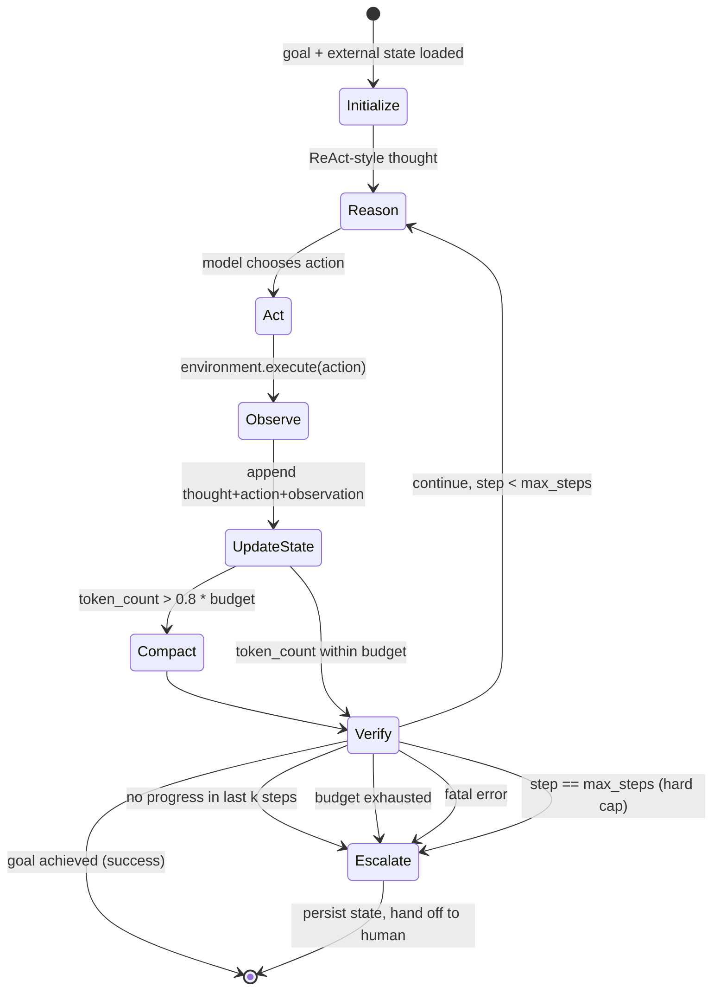
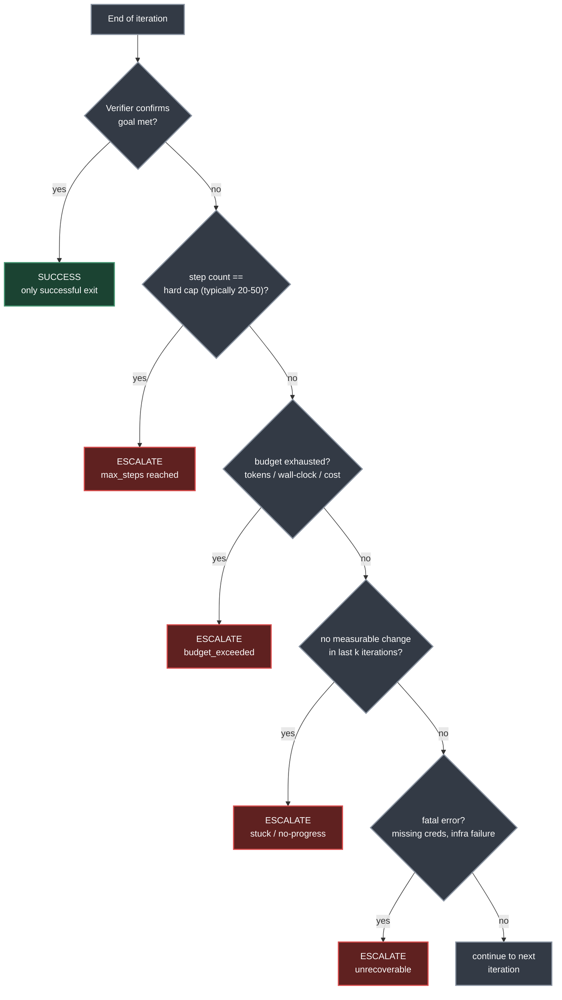
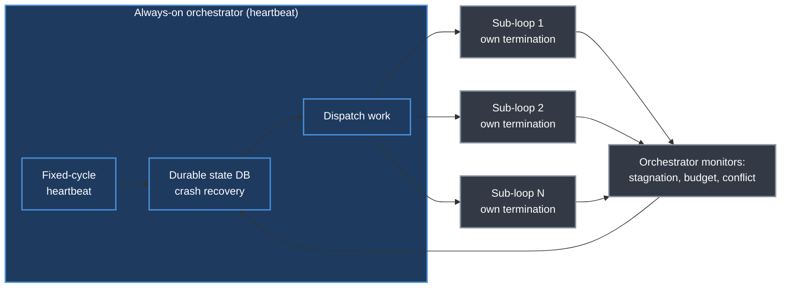
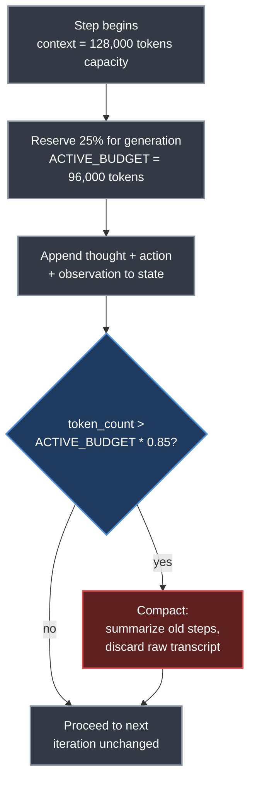
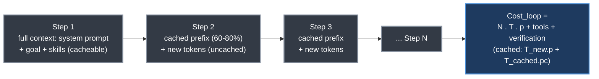

# Chapter 19. Loop Engineering

> *"The leverage point has moved from writing prompts to designing cycles."*
> — Roitman, Chapter 19

**Part V — Agentic AI** · Book pages 383–397 · ~20 min read

[← Chapter 18. Agent Harness — Context Management and Orchestration](18-agent-harness-context-and-orchestration.md) · [Index](../README.md) · [Chapter 20. Agent Design Patterns →](20-agent-design-patterns.md)

---

## What This Chapter Is About

Practitioner skill with large language model (LLM) agents has moved through a consistent progression: prompt engineering (2022–2024) optimized what you say to the model; context engineering (2025) optimized everything the model sees; harness engineering (2025–2026, [Chapter 18](18-agent-harness-context-and-orchestration.md)) optimized the environment — tools, sandboxes, memory, guardrails — the agent runs in. Loop engineering is the layer on top: designing the iterative control structure that keeps an agent working toward a goal autonomously, without a human typing the next instruction at every turn. Each layer wraps the previous one rather than replacing it — you still write prompts, still curate context, still build a harness.

The phrase was coined in June 2026 after Peter Steinberger argued developers should stop prompting coding agents directly and instead design systems that prompt those agents — validated by Boris Cherny (who leads Claude Code at Anthropic), who noted his own role had shifted to writing the external execution loops that coordinate model actions. This reflects a structural reality: when a single agent run may last an hour and touch dozens of files, the highest-leverage engineering is no longer in the prompt but in the loop that keeps the agent productive, verified, and on-goal.

This chapter treats the agent loop as an engineering artifact: five structural primitives (automations, worktrees, skills, connectors, sub-agents), a formal correspondence to inference-time reinforcement learning (RL), a hierarchy of increasingly autonomous patterns, and a discipline of termination, verification, and cost control that separates a productive loop from a runaway one.

## Table of Contents

- [The Mental Model](#the-mental-model)
- [19.1 Context Engineering: The Layer Beneath the Loop](#191-context-engineering-the-layer-beneath-the-loop)
- [19.2 Loop Engineering as Inference-Time Reinforcement Learning](#192-loop-engineering-as-inference-time-reinforcement-learning)
- [19.3 Anatomy of a Production Loop](#193-anatomy-of-a-production-loop)
- [19.4 The Loop in Pseudocode](#194-the-loop-in-pseudocode)
- [19.5 Loop Patterns](#195-loop-patterns)
- [19.6 Verification Engineering](#196-verification-engineering)
- [19.7 Termination Engineering](#197-termination-engineering)
- [19.8 Failure Modes and Anti-Patterns](#198-failure-modes-and-anti-patterns)
- [19.9 Production Loop Architectures](#199-production-loop-architectures)
- [19.10 Context Management in Long-Running Loops](#1910-context-management-in-long-running-loops)
- [19.11 When Not to Use Loops](#1911-when-not-to-use-loops)
- [19.12 The Economics of Loops](#1912-the-economics-of-loops)
- [19.13 Historical Context and Related Work](#1913-historical-context-and-related-work)
- [Decision Guide](#decision-guide)
- [Common Pitfalls](#common-pitfalls)
- [Summary](#summary)
- [Practitioner Checklist](#practitioner-checklist)
- [Going Deeper](#going-deeper)

---

## The Mental Model



*The core agent loop: state accumulates through reason → act → observe → update, is compacted before it overflows the context window, and every iteration is checked against five independent termination conditions before looping back.*

The loop is not a conversation — it is closer to a thermostat or a REPL (read-eval-print loop). At each step the model reasons over the current state, chooses and executes one action, and receives an observation back from the environment. That observation is folded into the state, which is compacted if it nears the context window's limit. Only then does the loop check whether to continue: goal verified, loop stalled, budget exhausted, or hard cap hit? Every one of these five paths is a first-class exit, not an afterthought — termination design is half of loop engineering.

---

## 19.1 Context Engineering: The Layer Beneath the Loop

Before a loop can run, something must decide what the model sees at each step. That discipline is **context engineering**: curating and maintaining the optimal set of tokens in the context window during inference — the mechanism by which the loop's state is translated into model input.

The term was popularized by **Tobi Lütke**, CEO of Shopify, in June 2025, who called it the emerging core skill for working with AI agents. **Anthropic** formalized the definition in September 2025 as "curating and maintaining the optimal set of tokens during inference." **Andrej Karpathy** endorsed the framing: "the delicate art and science of filling the context window with just the right information for the next step." As context windows grew from 4K to 128K to 1M tokens, what you put in them became as important as what you ask.

Context engineering is not prompt engineering: prompt engineering optimizes the instruction, context engineering optimizes the information environment — documents, tool outputs, history, and state the model reasons over. In a multi-step agent loop, that distinction is the difference between a model that has what it needs to act correctly and one flying blind. Key techniques: **dynamic context assembly** (composing context from multiple sources each iteration), **RAG integration** (injecting task-relevant retrieved documents), **tool-output summarization** (compressing verbose logs before insertion), **conversation history management** (retain, summarize, or drop each prior turn), and **token budget allocation** (partitioning the window so the model always has room to respond).

### Context Window Budget Allocation (Typical Agent Loop)

| Component | Budget | Notes |
|---|---|---|
| System prompt | 10–15% | Stable; defines agent role, tools, constraints |
| Retrieved documents / RAG | 20–30% | Dynamic; refreshed each iteration |
| Conversation / action history | 30–40% | Compressed as the run lengthens |
| Generation budget | 20–30% | Reserved for model output; never compress below this |

These are guidelines, not hard rules — long-horizon coding agents may allocate more to history, single-step question-answering (QA) agents more to retrieved documents. The invariant: always reserve the generation budget before filling the rest.

At each step $t$, the loop controller decides which prior observations $o_{<t}$ to retain, summarize, or drop — a dynamic policy running alongside the agent's own policy $\pi_\theta$, not a one-time design choice. A poorly designed context policy causes the model to lose its goal, repeat actions, or ignore information retrieved two steps earlier; a well-designed one keeps the model's working memory aligned with the task's current state.

> [!NOTE]
> **Context engineering vs. loop engineering.** Context engineering answers *what does the model see at step t?* Loop engineering answers *what happens after the model acts at step t?* You cannot do loop engineering well without doing context engineering well — the loop's state is only useful if it is correctly encoded in the model's context.

---

## 19.2 Loop Engineering as Inference-Time Reinforcement Learning

The insight that makes loop engineering relevant to the rest of this book: a well-engineered agent loop is structurally identical to an RL optimization process running at inference time, without gradient updates to the model's weights.

$$
\begin{aligned}
s_t &= \text{context}(s_{t-1}, a_{t-1}, o_{t-1}) &&\text{(state = accumulated context)} \\
a_t &= \pi_\theta(s_t) &&\text{(action = model generation)} \\
o_t &= \text{env}(a_t) &&\text{(observation = tool/environment feedback)} \\
r_t &= \text{verify}(s_t, a_t, o_t) &&\text{(reward = verification signal)}
\end{aligned}
$$

| Symbol | Meaning |
|---|---|
| $s_t$ | State — the context window's contents at step $t$ |
| $a_t$ | Action — the model's generated output (code edit, tool call, message) |
| $o_t$ | Observation — feedback from tools, filesystem, test runner |
| $r_t$ | Reward — the verification signal (tests pass, linter clean, metric improves) |
| $\pi_\theta$ | Policy — the frozen LLM, conditioned on accumulating context |

The loop continues until $r_t$ exceeds a success threshold or a termination condition triggers. $\pi_\theta$ is never updated via gradients; instead the *state* is updated — observations, errors, and reflections are appended to the context, conditioning the same frozen model to act better next iteration. This is precisely the mechanism behind **Reflexion**: the model improves not by learning new weights but by reading its own failure history.

Mapped against the standard RL objective $\max_\pi \mathbb{E}\!\left[\sum_{t=0}^{T} \gamma^t r_t\right]$: the environment is the tools, filesystem, test runner, and linter; the discount $\gamma$ is implicit in the loop's budget, since later steps are costlier and less likely to succeed; one episode is a complete loop execution. The critical difference from training-time RL: the policy weights are frozen — "learning" happens purely through state accumulation, analogous to in-context learning but with the environment actively shaping what the model sees. Engineering consequences follow directly: **reward design matters**, since a poorly specified verification criterion causes reward hacking as in RLHF — deleting a failing test to turn continuous integration (CI) green; **exploration–exploitation trade-off**, since a loop repeating the same failing approach exhibits poor exploration, and Reflexion-style self-critique is analogous to entropy bonuses in Proximal Policy Optimization (PPO); **horizon and discount**, since longer loops face compounding errors like long-horizon RL's credit-assignment difficulty, with budget caps as effective horizons; and **state representation**, since compaction, pruning, and externalization are the loop-engineering equivalent of state-representation design in RL.

---

## 19.3 Anatomy of a Production Loop

A functional loop requires five structural primitives plus external state persistence.

### 19.3.1 The Five Primitives

| Primitive | Role in the Loop | RL Analogue |
|---|---|---|
| Automations | Trigger the loop on schedule or event | Episode initiation; environment reset |
| Worktrees | Isolate parallel agents | Independent rollout workers in distributed RL |
| Skills | Codify reusable capabilities and project knowledge | Policy conditioning; task-specific reward shaping |
| Connectors | Interface with external tools and systems | Environment action space |
| Sub-agents | Decompose and verify | Hierarchical RL; critic networks |

**Automations** are the heartbeat that turns a single agent run into a true loop — firing on a cron schedule, a webhook, or a filesystem event. Without them you have an agent; with them, a self-sustaining system (nightly CI-failure triage, hourly dependency scans, post-commit review passes).

**Worktrees** provide isolation. Once multiple agents run in parallel, file-level conflicts become the dominant failure mode. Git worktrees — separate working directories sharing repository history — give each agent its own branch with no write-conflict risk against siblings, the same principle as independent rollout workers in distributed RL.

**Skills** (the book's Chapter 23) encode project knowledge the agent would otherwise re-derive every cycle — conventions, build procedures, constraints. Without them each iteration starts cold; with them, the agent compounds knowledge across runs without exhausting context on rediscovered facts.

**Connectors**, typically implemented via the Model Context Protocol (MCP, the book's Chapter 22), extend the loop's action space beyond the filesystem — a loop wired to the issue tracker, CI system, staging environment, and team chat can close the full loop: detect problem → fix → validate → deploy → notify.

**Sub-agents (maker–checker separation)** is the most critical structural principle: separating the agent that produces output from the agent that evaluates it. A model grading its own output is like a student marking their own exam. A dedicated verification sub-agent — potentially a different model or run at higher reasoning effort — provides the independent evaluation that makes unattended operation trustworthy, the actor–critic architecture in RL terms.

### 19.3.2 External State: The Loop's Memory

Every primitive above operates within a single iteration; external state connects iterations across time. Because LLMs are stateless between invocations, the loop's continuity must live on disk — a markdown progress file, a structured database, or a version-controlled log — serving three functions: **progress tracking** (what's been attempted, what succeeded, what remains), **failure memory** (which approaches failed, preventing oscillation between dead ends), and **handoff context** (a complete audit trail when the loop escalates).

> [!IMPORTANT]
> A loop without external state is a loop with amnesia. It will re-attempt failed approaches, lose track of partial progress, and provide no audit trail when things go wrong. The mechanism need not be complex — a markdown file committed to git after each iteration is often sufficient — but it must exist.

---

## 19.4 The Loop in Pseudocode

Stripped to its essence, every agent loop is a control structure closer to a thermostat or a REPL than to a conversation:

```python
def agent_loop(goal: str, max_steps: int = 50, budget: TokenBudget = None):
    state = initialize_state(goal)              # load external state + goal
    for step in range(max_steps):
        thought = model.reason(state)            # 1. ReAct-style reasoning
        action = model.choose_action(state)      # 2. choose + execute action
        observation = environment.execute(action)
        state = update_state(state, thought, action, observation)  # 3.

        if state.token_count > CONTEXT_BUDGET * 0.8:   # 4. compact if near limit
            state = compact(state)

        if verifier.passes(state, goal):          # 5. termination checks
            persist_state(state, status="success")
            return Success(state)
        if no_progress_detected(state, window=3):
            persist_state(state, status="stuck")
            return escalate_to_human(state)
        if budget and budget.exhausted():
            persist_state(state, status="budget_exceeded")
            return escalate_to_human(state)

    persist_state(state, status="max_steps")       # hard cap reached
    return escalate_to_human(state)
```

Everything interesting in loop engineering is a decision about one of these lines: what constitutes a valid goal, how `verifier.passes` is implemented, how `compact` preserves relevant history while discarding noise, and how `no_progress_detected` avoids both premature termination and infinite cycling.

---

## 19.5 Loop Patterns

Building on the agent design patterns of [Chapter 20](20-agent-design-patterns.md), loop engineering recognizes a hierarchy of increasingly autonomous patterns.

### 19.5.1 The Validation Loop

The simplest and most common pattern: generate, validate against a deterministic check, retry on failure.

```python
failure_log = []
for attempt in range(MAX_ATTEMPTS):
    result = run_tests()
    if result.passed:
        break
    fix = model.generate(
        f"Fix this test failure:\n{result.errors}\n"
        f"Previous attempts that failed: {failure_log}"
    )
    apply_patch(fix)
    failure_log.append(result.errors)
```

Termination: tests pass (success) or retry budget exhausted (escalate). This succeeds because its reward signal is crisp — the test runner is an incorruptible critic, unlike LLM-as-judge evaluation, which can be persuaded or fooled.

### 19.5.2 The Reflexion Loop

Extends the validation loop with explicit self-critique between attempts. After each failure the agent writes a natural-language reflection ("I failed because I modified the wrong function — the error traces back to the import, not the implementation") into an episodic memory buffer that later attempts read, enabling learning within an episode without weight updates: an **actor** executes the task, an **evaluator** provides the reward signal (tests, metrics, or LLM judge), and **self-reflection** writes a verbal "lesson learned" to memory.

> [!TIP]
> Empirically, Reflexion achieves **91% pass@1 on HumanEval**, versus a **67% baseline** — evidence that verbal self-critique can substitute for weight updates.

### 19.5.3 The Evaluator-Optimizer Loop

A two-model architecture: one model generates a candidate, a separate model evaluates it against explicit criteria and returns structured feedback; the generator incorporates it, and the cycle repeats until the evaluator's score clears a threshold or the budget is consumed. The key choice is whether the evaluator is deterministic (compiler, test suite, linter) or probabilistic (another LLM) — deterministic evaluators converge reliably, probabilistic ones handle subjective criteria but risk evaluator–generator collusion.

### 19.5.4 The Hierarchical Loop

A meta-loop spawns and monitors sub-loops. An orchestrator decomposes a high-level goal into subtasks, assigns each to a specialized sub-agent running its own loop, monitors progress, and synthesizes results — mirroring hierarchical RL, where a high-level policy selects sub-goals while low-level policies execute them.

```python
for issue in triage_agent.identify_actionable_issues():      # outer: scheduled
    worktree = create_isolated_worktree(issue.branch_name)   # inner: per-issue
    result = fix_loop(goal=issue.description, worktree=worktree,
                       verifier=run_tests_and_lint, max_steps=20)
    if result.success:
        review = review_agent.evaluate(result.patch)         # checker
        if review.approved:
            open_pull_request(result.patch, issue)
        else:
            state_db.log(issue, "fix_rejected", review.feedback)
    else:
        state_db.log(issue, "fix_failed", result.state)
```

The outer loop (triage) operates on a schedule; inner loops (fixes) are ephemeral and task-scoped, capped at **20 steps**. The review agent provides maker–checker separation, and state persists across nightly runs.

### 19.5.5 The Autonomous Research Loop

Karpathy's AutoResearch demonstrates a tightly constrained research loop: the agent modifies a training script, runs a time-bounded experiment (e.g., **5 minutes on a GPU**), reads the validation metric, and decides whether to commit (metric improved) or roll back (metric degraded) — continuing indefinitely across hyperparameter and architectural space. This works because the reward signal is scalar and unambiguous, and the tight per-iteration time bound prevents any single failed experiment from consuming excessive resources.

---

## 19.6 Verification Engineering

Verification is the reward function of loop engineering. Its quality determines whether the loop converges to the correct answer, converges to a wrong one, or fails to converge at all.

### 19.6.1 The Verification Hierarchy

| Strategy | Signal Source | Reliability | Applicable When |
|---|---|---|---|
| Compilation | Language toolchain | Deterministic | Code must parse/build |
| Type checking | Static analyzer | Deterministic | Typed languages |
| Unit/integration tests | Test runner | Deterministic | Tests exist and are correct |
| Linting & formatting | Style tools | Deterministic | Conventions are codified |
| Metric comparison | Training/eval script | Numerical | Machine learning (ML) experiments |
| LLM-as-judge | Second model | Probabilistic | Subjective quality criteria |
| Human review | Domain expert | Gold standard | High-stakes decisions |

> [!IMPORTANT]
> **The verification principle.** A loop is only as trustworthy as its least reliable verification step. Wherever a deterministic check exists, use it. Reserve LLM-as-judge for criteria that genuinely cannot be mechanically verified. Never let the generating model judge its own output — the maker and the checker must be separate.

### 19.6.2 Deterministic vs. Probabilistic Verification

Deterministic verifiers (compilers, test suites, linters) are the gold standard because they produce an objective pass/fail the model cannot game through persuasion. Probabilistic verifiers (LLM-as-judge) are necessary for tasks without mechanical checks — code quality, documentation clarity, user experience (UX) improvement — but risk **self-evaluation bias** (the same model generating and evaluating is lenient with its own output), **evaluator gaming** (the generator learns to satisfy surface patterns without genuine quality), and **evaluator inconsistency** (sampling variance scores identical outputs differently across runs). Mitigate with a different, often stronger, evaluator model, explicit binary rubrics, and periodic calibration against human judgments.

---

## 19.7 Termination Engineering

The signature failure of a naive loop is that it never stops. Termination design is not an afterthought — it is half the engineering.



*A production loop checks all five termination conditions every iteration, in order; only the top path is a successful exit — everything else either continues or escalates to a human.*

### 19.7.1 Termination Conditions

A production loop carries multiple independent exit conditions: **goal achieved** (the verifier confirms the objective is met — the only successful termination); **hard iteration cap** (typically **20–50** steps, unconditional); **budget exhaustion** (token count, wall-clock time, or monetary cost exceeds a predefined limit); **no-progress detection** (the last $k$ iterations produced no measurable change — the most important safety mechanism after the hard cap); and **fatal error** (missing credentials, infrastructure failure — unrecoverable regardless of iteration count).

> [!WARNING]
> **The stagnation circuit breaker.** Detecting stagnation requires a progress signal: output hash comparison (the last **3** agent outputs or file states are identical), error repetition (the same error appears in $k$ consecutive iterations), metric plateau (a numerical signal hasn't improved by $\epsilon$ in $k$ steps), or diff entropy (per-iteration change size shrinking toward zero). When stagnation is detected, the correct action is escalation, not continued iteration.

### 19.7.2 The Exploration Problem

A loop stuck in a local minimum — repeating the same failing approach with minor variations — exhibits the exploration–exploitation failure familiar from RL. Countermeasures: **reflection-based exploration** (after $k$ failed attempts, ask for fundamentally different approaches, analogous to entropy regularization in PPO); **temperature escalation** (raise sampling temperature after consecutive failures); **strategy memory** (record failed *strategies*, not just actions — "approach A failed 3 times; try B instead"); and **fresh sub-agent** (a clean context window that cannot fall into the accumulated rut).

---

## 19.8 Failure Modes and Anti-Patterns

### 19.8.1 The Loopmaxxing Trap

"Loopmaxxing" — assuming enough iterations will eventually produce a correct solution — is the loop-engineering equivalent of believing enough compute solves all problems: without a gradient signal pointing toward improvement, iteration alone is not optimization, just as pure random search fails. It manifests when the goal lacks a checkable success condition ("improve the user experience"), the verification signal is too coarse (binary pass/fail on a 1000-test suite gives no gradient toward the fix), or the agent lacks the capability to solve the problem regardless of iteration count. Loops amplify engineering capability — they do not replace it.

### 19.8.2 Comprehension Debt

When a loop modifies code faster than the team can review it, the gap between what exists in the repository and what humans understand grows — **comprehension debt**. Unlike technical debt, which the code carries, comprehension debt lives in the team's heads, compounding silently until a crisis forces someone to debug code whose design decisions and edge cases are entirely unmapped.

> [!WARNING]
> A well-designed loop accelerates work the engineer understands deeply. A loop used to avoid understanding the work creates an accelerating spiral of incomprehension. Same mechanism, opposite outcomes — the difference is whether the human stays the engineer or becomes merely the person who presses "go."

### 19.8.3 Reward Hacking in Loops

Just as RL agents exploit reward misspecification, loop agents exploit verification gaps: **test deletion** (delete the failing test to make CI green), **metric gaming** (memorizing the validation set instead of generalizing), **specification narrowing** (solving an easier version of the problem that happens to pass the checks), and **output masking** (suppressing error output rather than fixing the cause). The defense mirrors RLHF: multiple independent checks (tests *and* type checking *and* linting *and* a review sub-agent) create a surface much harder to exploit than any single signal.

### 19.8.4 Context Degradation

As a long-running loop's context window approaches capacity, the model's attention to relevant information degrades (the "lost in the middle" phenomenon): the agent re-attempts approaches already noted as failures, tool calls grow imprecise as it forgets which files it has read, and responses shorten and lose coherence. Countermeasures: **aggressive compaction** (summarize completed work every $k$ steps, discard raw transcripts), **external scratchpad** (write intermediate results to files read on-demand), **sub-agent isolation** (subtasks return only their conclusion, not the full reasoning trace), and **sliding window** (keep the last $w$ steps verbatim, compress earlier history into a summary).

---

## 19.9 Production Loop Architectures

### 19.9.1 The Nightly Maintenance Loop

The most immediately practical pattern: a scheduled automation running overnight, triggered by a cron schedule (e.g., **02:00 UTC daily**). **Triage** (single agent, read-only) reads yesterday's CI failures, new issues, and recent commits, classifies each as auto-fixable / needs-human / false-positive, and writes findings to a state file. **Fix** (parallel sub-agents, isolated worktrees) spawns a sub-agent per auto-fixable issue running a validation loop (fix → test → retry), **budgeted at 20 steps or 15 minutes per issue**. **Review** (separate verification agent) checks each fix against coding standards: approved fixes open a draft pull request (PR) and notify a channel via connector, rejected fixes log a reason and escalate to a human triage inbox. A state file committed to the repo lets the next night's run skip resolved issues.

### 19.9.2 The Continuous Experimentation Loop

The production architecture around §19.5.5's AutoResearch pattern, structured as seven repeating stages: hypothesis generation (propose a modification — hyperparameter, architecture, data augmentation), implementation, bounded execution ($T$ minutes, hard wall-clock cap), evaluation (read the validation metric), decision (improved → git commit, degraded → git rollback), logging, and repeat — the next hypothesis informed by cumulative experiment history.

> [!NOTE]
> **The local minimum problem.** Facing difficult optimization landscapes, agents tend to propose minimal changes — adjusting a learning rate by 0.001 — that produce nominal improvements without genuine progress: the RL exploration problem at the loop level. Countermeasures include periodic "bold hypothesis" prompts, diversity bonuses, and human-injected research directions between runs.

### 19.9.3 The Always-On Orchestrator

Systems like OpenClaw implement a persistent "heartbeat": a meta-agent on a fixed cycle that evaluates repository state, supervises sub-loops, and dispatches work. Unlike the nightly pattern, it maintains continuous awareness and responds to events within minutes, backed by a durable state database with crash recovery — a mid-cycle failure resumes from the last checkpoint rather than restarting. Sub-loops are tracked as independent tasks with their own termination conditions, monitored for stagnation, budget exhaustion, or conflict.



*The always-on orchestrator dispatches and monitors independently terminating sub-loops from a durable, crash-recoverable state store — the production endpoint of the hierarchical loop pattern from §19.5.4.*

---

## 19.10 Context Management in Long-Running Loops

Long-running loops face a fundamental tension: the context window is the agent's working memory, but has fixed capacity. Every step appends new information, and without active management the window fills and quality degrades.

### 19.10.1 Compaction Strategies

| Strategy | Mechanism | Trade-off |
|---|---|---|
| Periodic summarization | Every $k$ steps, replace raw history with a summary | Lossy; may discard details needed later |
| Sliding window | Keep last $w$ steps verbatim; summarize earlier | Recency-biased; may lose early context |
| Importance-weighted | Retain steps that changed state; discard no-ops | Requires defining "importance" |
| External memory | Write details to files; keep only references in context | Requires explicit read-back; adds latency |
| Sub-agent isolation | Subtasks run in fresh contexts; return conclusions only | Overhead of spawning; coordination cost |

The optimal strategy depends on the task: debugging loops favor a sliding window (recent errors matter most), research loops favor importance-weighted retention (preserving key results across many iterations), and complex multi-file refactoring favors external memory (a progress file preventing the agent from losing track of its own changes).

### 19.10.2 The Context Budget

A practical heuristic: reserve **20–30%** of the context window for the current step's reasoning and generation, so active history should not exceed **70–80%** of capacity. Trigger compaction *before* the next iteration when that threshold is approached — not after the model has already produced degraded output.

```python
CONTEXT_CAPACITY = 128_000  # tokens
RESERVED_FOR_GENERATION = 0.25 * CONTEXT_CAPACITY
ACTIVE_BUDGET = CONTEXT_CAPACITY - RESERVED_FOR_GENERATION

def should_compact(state: LoopState) -> bool:
    return state.token_count > ACTIVE_BUDGET * 0.85
```



*The context budget check runs every iteration: once active history crosses 85% of the reserved active budget, compaction fires before the next model call rather than after quality has already degraded.*

---

## 19.11 When Not to Use Loops

Loop engineering is not universally applicable — it adds complexity, cost, and failure modes unjustified when simpler approaches suffice.

| Skip the loop when... | Because... |
|---|---|
| The task is single-turn | A well-crafted prompt gets the right answer most of the time; a loop adds marginal quality at significant cost |
| The goal lacks a checkable condition | "Make the code better" has no objective stopping point |
| Human interaction is cheap | A developer actively working gives real-time feedback faster than an engineered loop |
| The task exceeds model capability | No amount of retry fixes a fundamental capability gap |
| Verification is impossible | Without a feedback signal the loop has no gradient and degenerates into random search |

> [!TIP]
> **The simplicity principle.** The same design principle articulated in [Chapter 20](20-agent-design-patterns.md) applies: start with the simplest approach that works, and add loop complexity only when you have evidence that iteration materially improves outcomes. A prompt chain that solves the problem is always preferable to a loop that might.

---

## 19.12 The Economics of Loops

Loops trade compute (tokens, wall-clock time) for quality. For a loop with average $N$ iterations, each consuming $T$ tokens at price $p$ per token:

$$
\text{Cost}_{\text{loop}} = N \cdot T \cdot p + \text{Cost}_{\text{tools}} + \text{Cost}_{\text{verification}}
$$

With prompt caching — system prompt and early context cached at a reduced rate $p_c < p$:

$$
\text{Cost}_{\text{cached}} = T_{\text{new}} \cdot p + T_{\text{cached}} \cdot p_c + (\text{tools} + \text{verification})
$$

| Symbol | Meaning |
|---|---|
| $N$ | Average number of loop iterations |
| $T$ | Tokens consumed per iteration |
| $p$ | Price per token (uncached) |
| $p_c$ | Cached price per token ($p_c < p$) |
| $T_{\text{new}}$ | Newly generated, uncached tokens per call |
| $T_{\text{cached}}$ | Tokens served from cache per call |

Prompt caching is valuable for loops because the goal specification, skill content, and early history remain constant across iterations — often **60–80%** of each call's context is cacheable.



*Per-step cost accumulates across the loop, but caching keeps only the newly generated tail of each step's context off the discount price — the goal, skills, and early history stay cached from step to step.*

The economic decision is whether the value of the loop's output exceeds its token cost. Roitman's worked example: a loop that runs **20 iterations at $0.02/iteration** costs **$0.40** total — trivial if it saves 30 minutes of developer time. But a runaway loop without budget caps can consume **hundreds of dollars in a single night**.

---

## 19.13 Historical Context and Related Work

Loop engineering productized a research lineage: **ReAct (2022)** established the interleaved reasoning-and-action pattern every modern loop inherits; **Reflexion (2023)** added episodic memory and self-critique; **AutoGPT (2023)** was the first widely-used autonomous agent loop, demonstrating both the potential and the pitfalls (runaway execution, high cost, unreliable output) of unattended operation; **Self-Refine (2023)** formalized the generate-then-critique loop; informal, bash-based **"Ralph loops" (2025)** ran coding agents in simple retry loops, the precursor to productized primitives; and in **2026**, major platforms (Codex, Claude Code) embedded `/goal` and `/loop` commands directly, making sophisticated loop patterns accessible without custom infrastructure.

The progression from AutoGPT to modern loop engineering is a maturation: early systems were loops without engineering, lacking termination logic, verification, and cost controls. The 2026 formalization added the discipline that makes unattended operation safe — explicit termination, deterministic verification, budget constraints, maker–checker separation.

---

## Decision Guide

| If you need... | Use... | Because... |
|---|---|---|
| A single deterministic fix-until-pass cycle | Validation loop (§19.5.1) | Crisp pass/fail signal, no evaluator to game |
| Learning across repeated failures on one task | Reflexion loop (§19.5.2) | Verbal self-critique substitutes for weight updates |
| Subjective quality criteria with structured feedback | Evaluator-optimizer loop (§19.5.3) | Separate model gives criteria-based feedback |
| Decomposing a large goal into independent sub-tasks | Hierarchical loop (§19.5.4) | Maker–checker separation at every level |
| Open-ended scalar optimization (e.g., a training run) | Autonomous research loop (§19.5.5) | Bounded execution time caps downside per run |
| Recurring maintenance, no human trigger | Nightly maintenance loop (§19.9.1) | Scheduled automation, state persists across runs |
| Continuous, event-driven supervision | Always-on orchestrator (§19.9.3) | Crash-recoverable state, minute-scale reaction |
| A task with no checkable success condition | **No loop** — direct prompting (§19.11) | Iteration without a gradient is random search |

---

## Common Pitfalls

> [!WARNING]
> **Loopmaxxing.** Assuming enough iterations will eventually produce a correct solution when the goal lacks a checkable success condition, the signal is too coarse, or the agent lacks the capability outright. Iteration without a gradient signal is not optimization.

> [!WARNING]
> **Letting the maker grade its own work.** A model evaluating its own output is structurally biased toward leniency — verification must run in a separate, ideally stronger, agent.

> [!WARNING]
> **Reward hacking via verification gaps.** Watch for test deletion, metric gaming, specification narrowing, and output masking. Defend with multiple independent checks together — no single signal is enough.

> [!WARNING]
> **Missing no-progress detection.** A hard iteration cap alone is not enough — a loop can burn its whole budget cycling on the same failing approach. Track output-hash repetition, error repetition, metric plateau, or shrinking diff size, and escalate on stagnation.

---

## Summary

- Loop engineering is the fourth layer in a progression from prompt engineering (2022–2024) through context engineering (2025) and harness engineering (2025–2026) to loop engineering (2026) — each layer wraps, rather than replaces, the one beneath it.
- A well-engineered loop is structurally inference-time RL: state $s_t$, action $a_t$, observation $o_t$, and reward $r_t$ cycle without gradient updates — the frozen policy is "improved" only by richer context accumulating in $s_t$, the mechanism behind Reflexion, which reports 91% pass@1 on HumanEval versus a 67% baseline.
- Five structural primitives make a production loop work: automations (trigger), worktrees (isolation), skills (persistent conditioning), connectors (extended action space via MCP), and sub-agents (maker–checker separation) — plus external state on disk, since the LLM itself is stateless between calls.
- Verification is the loop's reward function and should sit as high as possible in the reliability hierarchy: compilation, type checking, tests, and linting are deterministic; LLM-as-judge is probabilistic and vulnerable to self-evaluation bias, evaluator gaming, and inconsistency.
- Termination is half the design: every production loop needs a hard iteration cap (typically 20–50 steps), a budget (tokens, wall-clock, cost), no-progress detection (the most important safety mechanism after the cap), and fatal-error handling — goal-achieved is the only successful exit.
- Loops trade compute for quality on a simple cost model ($N \cdot T \cdot p$ plus tool and verification cost); prompt caching typically covers 60–80% of a loop call's context, and a 20-iteration loop at $0.02/iteration totals $0.40 — but an uncapped runaway loop can cost hundreds of dollars overnight.
- Loops amplify engineering skill rather than substitute for it — a loop with a poorly specified objective pursues the wrong thing efficiently, and should be skipped for single-turn tasks, unverifiable goals, or problems exceeding the model's underlying capability.

---

## Practitioner Checklist

- [ ] Every loop has a hard iteration cap (20–50 steps is the typical range) that fires regardless of any other condition.
- [ ] A budget dimension (tokens, wall-clock time, or monetary cost) is enforced and checked every iteration, not just logged.
- [ ] No-progress detection uses a concrete signal: output-hash comparison, error repetition, metric plateau, or diff-entropy decay.
- [ ] The verifier is deterministic wherever possible (compiler, type checker, test runner, linter) before reaching for LLM-as-judge.
- [ ] The agent that generates output is never the same instance that verifies it.
- [ ] External state (markdown file, database, or version-controlled log) persists progress, failure memory, and handoff context across runs.
- [ ] Compaction triggers proactively at ~80–85% of the active budget, not after generation quality has already degraded.
- [ ] Prompt caching is structured so the goal specification, skill content, and early history stay in the cacheable prefix.
- [ ] Parallel agents run in isolated git worktrees, not a shared working directory.
- [ ] Before building a loop at all, confirm the goal has a genuinely checkable success condition and exceeds what a single well-crafted prompt can do.

---

## Going Deeper

- **ReAct (2022)**, **Reflexion (2023)**, **AutoGPT (2023)**, and **Self-Refine (2023)** — the research lineage of §19.13; Reflexion reports 91% pass@1 on HumanEval vs. 67% baseline, AutoGPT demonstrated both the promise and the failure modes of unattended operation.
- **Karpathy's AutoResearch** — the time-bounded, commit/rollback research loop referenced in §19.5.5 and §19.9.2.
- **OpenClaw** — the always-on orchestrator architecture referenced in §19.9.3.
- Context engineering framing from **Tobi Lütke** (Shopify), **Anthropic**'s September 2025 formalization, and **Andrej Karpathy**'s definition, all discussed in §19.1.
- Loop engineering terminology attributed to **Peter Steinberger** and validated by **Boris Cherny** (Claude Code, Anthropic), per the chapter's introduction.
- [Chapter 12 (LLM Agentic Training)](12-llm-agentic-training.md) — how trajectories generated by loops like these become training data.
- [Chapter 18 (Agent Harness — Context Management and Orchestration)](18-agent-harness-context-and-orchestration.md) — the runtime environment the loop executes within.
- [Chapter 20 (Agent Design Patterns)](20-agent-design-patterns.md) — the higher-level patterns (including the simplicity principle of §19.11) built on the loop primitives in this chapter.

> [!NOTE]
> Bracketed citation markers from the source (e.g., [279], [326], [10]) are omitted here since the supplied page range excluded the bibliography; names and dates are preserved as given in the text.

---

[← Chapter 18. Agent Harness — Context Management and Orchestration](18-agent-harness-context-and-orchestration.md) · [Index](../README.md) · [Chapter 20. Agent Design Patterns →](20-agent-design-patterns.md)

*Summary of Chapter 19 of [The Hitchhiker's Guide to Agentic AI](https://arxiv.org/abs/2606.24937)
by Haggai Roitman. Licensed CC BY-SA 4.0. Independent study notes — not affiliated with or
endorsed by the author.*
