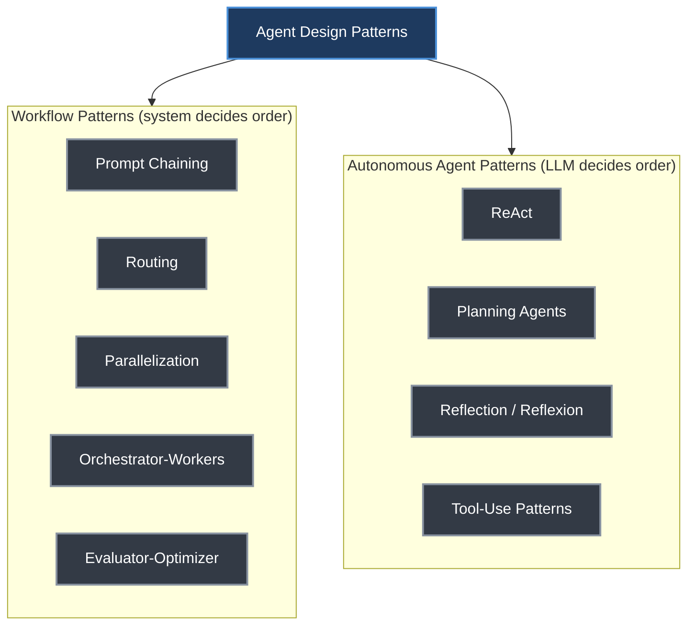
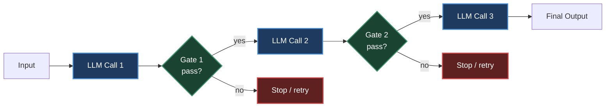
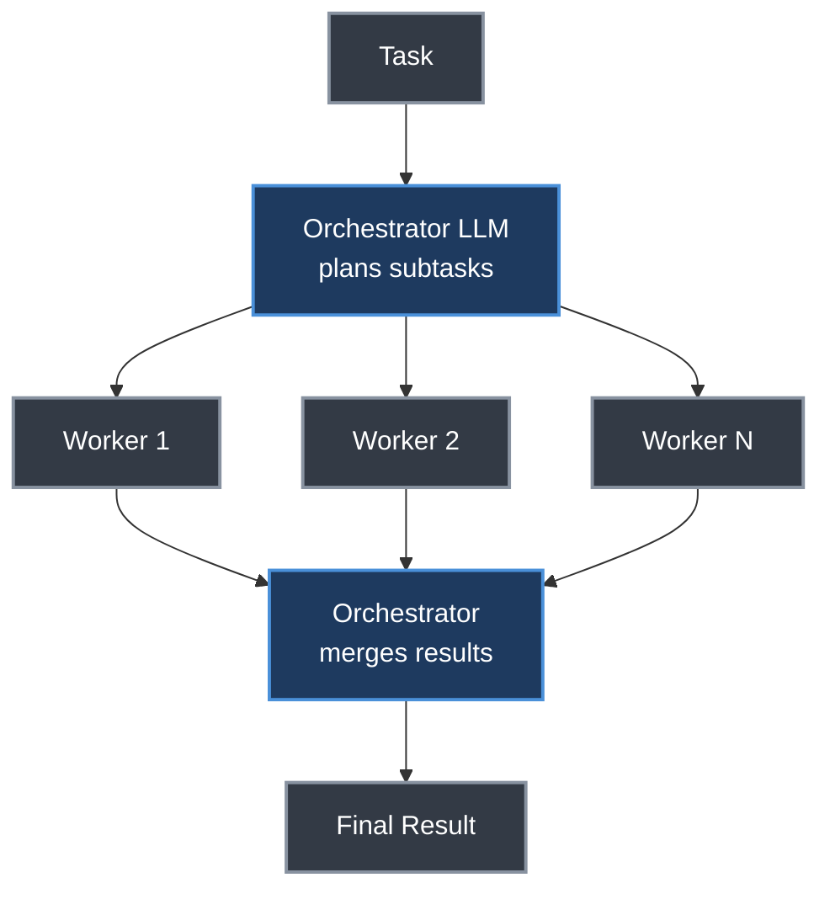
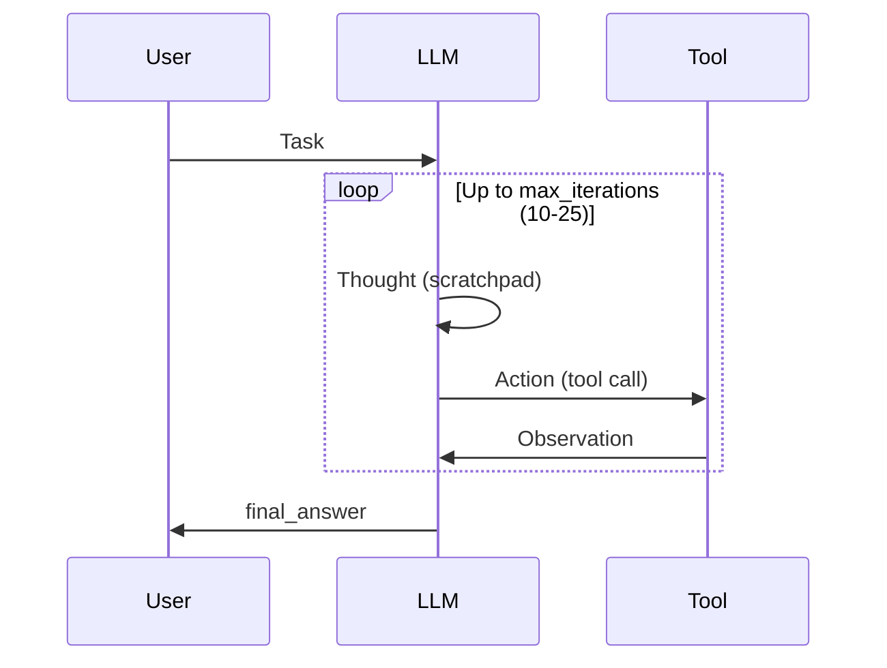
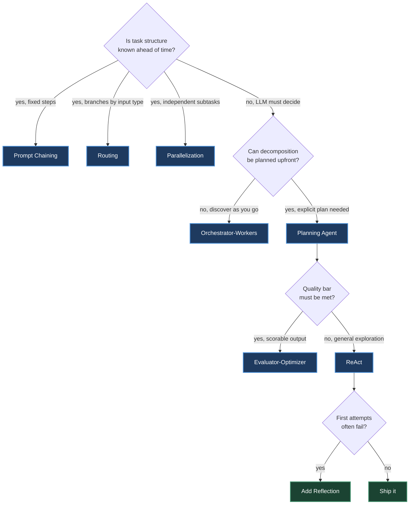

# Chapter 20. Agent Design Patterns

> *"A prompt chain that solves the problem is always preferable to a multi-agent system that might."*
> — Roitman, Chapter 20

**Part V — Agentic AI** · Book pages 398–403 · ~10 min read

[← Chapter 19. Loop Engineering](19-loop-engineering.md) · [Index](../README.md) · [Chapter 21. Agentic Environments and Benchmarks →](21-agentic-environments-and-benchmarks.md)

---

## What This Chapter Is About

A capable model and a set of tools are not enough to build a reliable agent. The architecture — how the large language model (LLM) is orchestrated, how tasks are decomposed, and how control flows between components — determines whether the result is reliable, debuggable, and cost-effective. This chapter catalogs the canonical design patterns that have emerged from production deployments at Anthropic, OpenAI, Google, and the open-source community.

The patterns split into two families: **workflow patterns**, where a predefined control flow calls the LLM at fixed points, and **autonomous agent patterns**, where the LLM itself decides what happens next. The first family is cheaper, more predictable, and easier to test; the second is more flexible and handles novelty the designer didn't anticipate. Roitman's guidance is to start with workflows and graduate to agents only when the task genuinely requires dynamic routing or open-ended exploration — the same simplicity bias that closes the chapter as an explicit design principle.

This chapter builds on [Chapter 19's loop engineering](19-loop-engineering.md): a loop is the execution primitive, while a pattern here shapes that loop (or composes several) into a reusable architecture. It also previews [Chapter 25's multi-agent systems](25-multi-agent-systems.md), the pattern at the top of this chapter's complexity ladder.

## Table of Contents

- [When to Use Agents vs. Workflows](#when-to-use-agents-vs-workflows)
- [The Mental Model](#the-mental-model)
- [Workflow Patterns](#workflow-patterns)
  - [Prompt Chaining](#prompt-chaining)
  - [Routing](#routing)
  - [Parallelization](#parallelization)
  - [Orchestrator-Workers](#orchestrator-workers)
  - [Evaluator-Optimizer](#evaluator-optimizer)
- [Autonomous Agent Patterns](#autonomous-agent-patterns)
  - [ReAct (Reason + Act)](#react-reason--act)
  - [Planning Agents](#planning-agents)
  - [Reflection and Self-Critique](#reflection-and-self-critique)
  - [Tool-Use Patterns](#tool-use-patterns)
- [Design Principles](#design-principles)
- [Key Formulas](#key-formulas)
- [Decision Guide](#decision-guide)
- [Common Pitfalls](#common-pitfalls)
- [Summary](#summary)
- [Practitioner Checklist](#practitioner-checklist)
- [Going Deeper](#going-deeper)

---

## When to Use Agents vs. Workflows

| | Control flow | Character | Use when |
|---|---|---|---|
| **Workflows** | Predefined, LLM calls at specific steps | Predictable, testable, cheaper | Task structure is known |
| **Agents** | LLM dynamically decides what to do next | Flexible, handles novel situations | Task requires adaptive decision-making |

## The Mental Model



*The taxonomy this chapter builds: workflow patterns hard-code the execution order, autonomous patterns hand that decision to the model.*

Every pattern here is a point on one axis: how much control the harness retains versus how much it delegates to the model. Prompt chaining sits at the fixed-control end; a planning agent that revises its own plan mid-execution sits near the delegated end. Complexity, cost, and unpredictability all rise as you move right — pattern selection is a ladder to climb only as far as the task demands.

## Workflow Patterns

These patterns — adapted from Anthropic's taxonomy of agentic building blocks [10] — use LLMs within a predefined control flow. The system, not the model, decides the execution order.

### Prompt Chaining

The simplest pattern: break a complex task into a fixed sequence of LLM calls, piping the result of one call as context into the next. Validation gates between steps catch errors before they propagate downstream.



*Prompt chaining with quality gates. Each step is a separate LLM call; gates can be LLM-based or programmatic.*

**When to use:** naturally sequential tasks — content generation, data transformation, multi-stage analysis. **Key advantage:** each step can use a different prompt, model, or temperature, and intermediate results are inspectable and debuggable.

### Routing

A classifier — LLM-based or traditional — examines the input once and dispatches it to a specialized handler. **When to use:** distinct task types that need different optimal prompts, tools, or models — customer-support triage, multi-modal input handling.

### Parallelization

Multiple LLM calls run concurrently, with a programmatic layer combining their outputs. Two sub-patterns:

- **Sectioning (fan-out):** partition the input into disjoint chunks and process each independently — e.g., run security, performance, and style checks on a codebase simultaneously.
- **Voting (redundancy):** issue the same prompt *N* times with different seeds or temperatures, then select the best result via majority vote [368], reward-model scoring, or LLM-as-judge.

A code-review example: security, performance, and style reviews run in parallel, then their findings are merged, deduplicated, and ranked by severity. The payoff is latency — parallel calls cost `max`, not `sum`, of the individual call times (see [Key Formulas](#key-formulas)).

### Orchestrator-Workers

Here the LLM itself decides how to split the work. An orchestrator model analyzes the task, produces a plan of subtasks, dispatches each to a worker LLM — potentially with different prompts or tools — and merges their outputs into a coherent result.



*Orchestrator-workers: the LLM decides how to decompose the task and synthesizes worker results.*

The key difference from parallelization is that the decomposition logic is model-generated, not hard-coded. **When to use:** open-ended problems where the number and nature of subtasks can't be enumerated at design time — "refactor this codebase" requires first understanding the dependency graph before deciding which files to touch.

### Evaluator-Optimizer

A two-model feedback loop [246]: a generator produces candidate outputs while a separate evaluator scores them against explicit criteria. If the score falls below a threshold, the evaluator's critique is appended to the generator's context and the cycle repeats until the quality bar is met or a retry budget is exhausted. **When to use:** tasks with clear quality criteria — code that must pass tests, translations that must preserve meaning, writing that must match a style guide.

## Autonomous Agent Patterns

These patterns give the LLM control over the execution flow itself.

### ReAct (Reason + Act)

The foundational agent pattern [408]. The LLM alternates between thinking (internal reasoning), acting (tool calls), and observing (processing results) in a loop until it produces a final answer.



*ReAct: the loop alternates thought, action, and observation until the model emits a terminal action.*

**Implementation essentials:**

- **Scratchpad:** the "Thought" step is logged but not shown to the user.
- **Tool parsing:** the harness extracts structured tool calls from model output.
- **Max iterations:** always cap the loop — typically 10–25 iterations.
- **Termination:** the model outputs a special action (e.g., `final_answer`) or no tool call is detected.

### Planning Agents

The agent generates an explicit plan before executing, and can revise the plan mid-execution [364].

| Strategy | Replanning | Characteristics |
|---|---|---|
| Plan-then-Execute | Never | Simple; fragile to unexpected results |
| Adaptive | On failure | Replans only when a step fails; moderate cost |
| Continuous | Every step | Full re-evaluation after each observation; expensive but robust |
| Hierarchical | On sub-plan done | High-level plan fixed; sub-plans generated dynamically |

*Table 20.1 — Planning strategies compared.*

A worked example: given "Write a 2-page report comparing transformer architectures for time-series forecasting," the agent first emits a dependency-ordered plan:

```json
[
  {"id": 1, "task": "Search recent transformer time-series models (2023-2025)",
   "tool": "search_web", "deps": []},
  {"id": 2, "task": "Read top 5 papers, extract key methods",
   "tool": "read_papers", "deps": [1]},
  {"id": 3, "task": "Build comparison table (architecture, dataset, metrics)",
   "tool": "none", "deps": [2]},
  {"id": 4, "task": "Write introduction + methodology section",
   "tool": "none", "deps": [2]},
  {"id": 5, "task": "Write results + conclusion",
   "tool": "none", "deps": [3, 4]},
  {"id": 6, "task": "Review and polish final report",
   "tool": "none", "deps": [5]}
]
```

The harness tracks dependencies as a directed acyclic graph (DAG) and only executes steps whose predecessors have completed. With adaptive replanning, if step 1's search returns only 3 relevant papers, the agent adds a sub-step broadening the search to adjacent domains (PatchTST, iTransformer) before continuing from step 2.

> [!TIP]
> The plan is a living document — it provides structure but adapts to observations, rather than being a rigid script executed blindly.

### Reflection and Self-Critique

The agent pauses to evaluate its own trajectory and correct course, at three possible levels:

1. **Output validation** — "Is this correct? Did I miss anything?"
2. **Trajectory review** — review the last *k* steps, identify mistakes or inefficiencies.
3. **Strategy revision** — reconsider the overall approach ("Am I solving the right problem?").

> [!NOTE]
> **Reflexion** [326] maintains a persistent "reflection memory." After each failed attempt, the agent writes a natural-language reflection ("I failed because I didn't check the edge case"). On the next attempt, these reflections are included in the prompt — enabling learning across episodes without weight updates.

### Tool-Use Patterns

How an agent invokes tools significantly affects reliability, latency, and cost. Five canonical patterns have emerged [315]:

| Pattern | Description | Example |
|---|---|---|
| Single-turn | One tool call per LLM response | Simple Q&A with search |
| Multi-tool | Multiple parallel tool calls in one response | Search + calculate + format |
| Sequential | Tool output feeds into next tool call | Search → read → extract |
| Nested | Tool call triggers another agent | Code agent calls test-runner |
| Fallback | Preferred tool fails; try alternative | API → scrape → cache |

*Table 20.2 — Tool invocation patterns.*

**Single-turn** is sufficient for factual lookups, unit conversions, or single API queries; the harness makes exactly two LLM calls — one to decide on the tool, one to synthesize the result. **Multi-tool (parallel)** lets modern APIs (OpenAI, Anthropic) request several tool calls in one response, executed concurrently — this cuts latency for independent lookups (stock price, weather, calendar) but requires the tools to be genuinely independent, since no tool's output can feed another in the same batch. **Sequential (pipeline)** chains tool output into the next tool's input — common in research workflows (`search → fetch_page → extract_data → analyze`) — and the harness must track the growing context, summarizing intermediate results to stay within budget. **Nested (agent-as-tool)** has a tool call invoke an entirely separate agent with its own prompt and context, treated as a black box by the parent — e.g., a research agent delegating code execution to a sandboxed coding agent. The Swarm pattern [276] generalizes this via handoffs between specialized agents. **Fallback (graceful degradation)** has the harness try tools in priority order, transparently to the model: primary search API → backup search → cached results → inform the model search is unavailable.

## Design Principles

Distilled from Anthropic's guide to building effective agents [10], these apply across every pattern above:

1. **Keep it simple.** Use the simplest architecture that works; add complexity only when demonstrated necessary. A prompt chain that solves the problem beats a multi-agent system that might.
2. **Transparency over cleverness.** Every step should be inspectable; avoid hidden state or implicit reasoning — opaque architectures make debugging impossible.
3. **Provide good tools.** Well-documented, well-typed tools with clear error messages are force multipliers; a vague description invites misuse, a precise schema gets it selected correctly.
4. **Plan for failure.** Every tool call can fail. Build retry logic, fallbacks, and graceful degradation at the harness level so the model doesn't have to reason about infrastructure failures.
5. **Use structured outputs.** Constrained generation (JSON schema, function calling) prevents parse failures; free-form text needing regex parsing is fragile, validated JSON is robust.
6. **Test with diverse inputs.** Agent behavior is more variable than single-turn chat — the same prompt can produce different tool-call sequences on different runs. Test adversarially, with edge cases and malformed inputs.

## Key Formulas

Parallelization's entire latency advantage reduces to one relationship:

$$\text{Latency}_{\text{parallel}} = \max_i(t_i) \qquad \text{vs.} \qquad \text{Latency}_{\text{sequential}} = \sum_i t_i$$

| Symbol | Meaning |
|---|---|
| $t_i$ | Wall-clock latency of individual LLM call $i$ |
| $\max_i(t_i)$ | Time to complete the slowest of the $N$ concurrent calls |
| $\sum_i t_i$ | Time to complete all $N$ calls run one after another |

At the limit, if all $N$ calls take the same time $t$, parallelization turns an $N \cdot t$ workflow into a $t$ workflow — the entire motivation for sectioning and voting.

## Decision Guide

| Pattern | Complexity | LLM calls | Best for |
|---|---|---|---|
| Prompt chaining | Low | *N* (fixed) | Sequential tasks, content pipelines |
| Routing | Low | 1+1 | Multi-type inputs, triage |
| Parallelization | Low | *N* (parallel) | Independent subtasks, voting |
| Orchestrator-workers | Medium | Variable | Unknown decomposition |
| Evaluator-optimizer | Medium | 2–10 (loop) | Quality-critical outputs |
| ReAct | Medium | 3–25 (loop) | General tool-use, exploration |
| Planning agent | High | 5–50+ | Long-horizon, multi-step tasks |
| Reflection | High | +50% overhead | Tasks where first attempt often fails |
| Multi-agent | High | Many | Complex domains, specialization |

*Table 20.3 — When to use each agent design pattern. Start from the top (simplest) and move down only when the simpler pattern demonstrably fails.*



*A decision tree over Table 20.3: climb the complexity ladder one rung at a time, and stop climbing as soon as a rung clears the bar.*

Patterns are composable: a planning agent may use prompt chaining for individual steps, an evaluator-optimizer within its review phase, and routing to dispatch subtasks to specialists. As Roitman puts it, the art is knowing when to stop adding layers.

## Common Pitfalls

> [!WARNING]
> Multi-tool (parallel) calls only work when tools are genuinely independent — no tool's output may be required as another's input in the same batch.

> [!WARNING]
> A ReAct loop without a hard iteration cap can run indefinitely. Bound it — typically 10–25 iterations — and give the model an explicit terminal action.

> [!WARNING]
> Evaluator-optimizer loops need a retry budget, not just a quality threshold, or an unsatisfiable criterion turns the loop into an unbounded cost sink.

> [!WARNING]
> Reflection adds roughly 50% call overhead. Reserve it for tasks where the first attempt often fails.

## Summary

- **Workflows and agents split on who controls execution order:** workflows use predefined control flow with the LLM called at fixed points; agents let the LLM dynamically decide what happens next — start with workflows and graduate to agents only when the task needs adaptive decision-making.
- **Prompt chaining** breaks a task into a fixed LLM-call sequence with validation gates between steps, so each step can use a different prompt, model, or temperature and intermediate results stay inspectable.
- **Parallelization's latency is `max`, not `sum`, of the individual calls** — sectioning fans a task into disjoint chunks (e.g., parallel security/performance/style code review) while voting reruns the same prompt *N* times and selects via majority vote, reward-model scoring, or LLM-as-judge.
- **Orchestrator-workers differs from parallelization because the decomposition is model-generated, not hard-coded** — an orchestrator LLM plans subtasks, dispatches them to workers, and merges results, suited to problems like codebase refactors where subtasks can't be enumerated upfront.
- **Evaluator-optimizer is a two-model feedback loop** that appends the evaluator's critique to the generator's context and repeats until a quality threshold is met or a retry budget runs out.
- **ReAct alternates thought, action, and observation in a capped loop** (typically 10–25 iterations), terminating on a special action like `final_answer` or the absence of a further tool call.
- **Planning agents choose among four replanning strategies** — plan-then-execute (never), adaptive (on failure), continuous (every step), hierarchical (on sub-plan done) — executing a dependency DAG that only runs steps whose predecessors have completed.
- **Reflexion persists a natural-language "reflection memory" across failed attempts** without weight updates, injecting past reflections into the next attempt's prompt.
- **Tool-use reliability comes from five patterns:** single-turn (exactly two LLM calls), multi-tool (parallel, independent calls only), sequential (pipelined, context-growing), nested (agent-as-tool, generalized by the Swarm handoff pattern), and fallback (harness-level degradation the model never reasons about).

## Practitioner Checklist

- [ ] Default to a workflow pattern; justify in writing why the task needs an autonomous agent.
- [ ] For sequential tasks, chain prompts with a validation gate after each step.
- [ ] For distinct input types, classify once with a router before dispatching to specialists.
- [ ] Before parallelizing, confirm subtasks are truly independent — no output-to-input dependency.
- [ ] For voting, fix the selection mechanism up front: majority vote, reward-model score, or LLM-as-judge.
- [ ] Cap every ReAct-style loop at 10–25 iterations with an explicit terminal action.
- [ ] Pick a replanning strategy deliberately — plan-then-execute when stable, adaptive/continuous when observations may invalidate the plan.
- [ ] Track plan steps as a dependency DAG; execute only steps whose predecessors have completed.
- [ ] Set an explicit retry budget on every evaluator-optimizer loop, not just a quality threshold.
- [ ] Reserve reflection for tasks where the first attempt often fails — it costs roughly 50% more calls.
- [ ] Give every tool a precise schema; a vague description gets it misused.
- [ ] Build retry, fallback, and graceful-degradation logic at the harness level, not inside the model's reasoning.
- [ ] Test agent behavior against diverse and malformed inputs — the same prompt can yield different tool-call sequences on different runs.

## Going Deeper

- **Anthropic's guide to building effective agents** [10] — source taxonomy for this chapter's workflow patterns and six design principles.
- **ReAct** — Yao et al., "Synergizing Reasoning and Acting in Language Models" [408] — the foundational thought/action/observation loop.
- **Reflexion (2023)** [326] — verbal reinforcement learning via persistent reflection memory, with no weight updates.
- **Swarm** — OpenAI's Swarm library [276], the reference implementation of the handoff-based nested/multi-agent pattern.
- [Chapter 19 (Loop Engineering)](19-loop-engineering.md) — the execution loop these patterns shape and compose.
- [Chapter 21 (Agentic Environments and Benchmarks)](21-agentic-environments-and-benchmarks.md) — where these patterns get evaluated.
- [Chapter 25 (Multi-Agent Systems)](25-multi-agent-systems.md) — the nested/handoff pattern generalized into full multi-agent architectures.

---

[← Chapter 19. Loop Engineering](19-loop-engineering.md) · [Index](../README.md) · [Chapter 21. Agentic Environments and Benchmarks →](21-agentic-environments-and-benchmarks.md)

*Summary of Chapter 20 of [The Hitchhiker's Guide to Agentic AI](https://arxiv.org/abs/2606.24937)
by Haggai Roitman. Licensed CC BY-SA 4.0. Independent study notes — not affiliated with or
endorsed by the author.*
