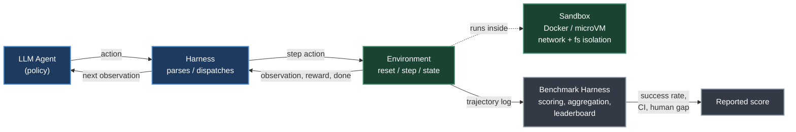
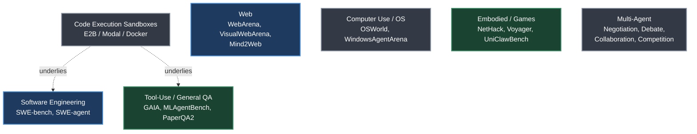
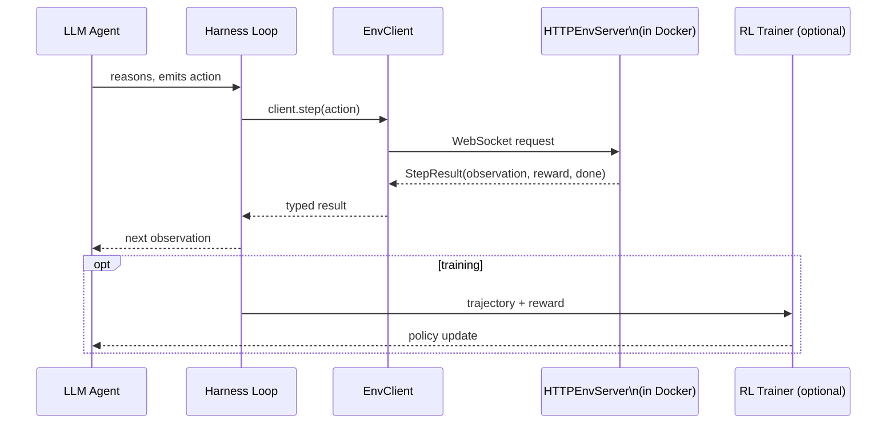
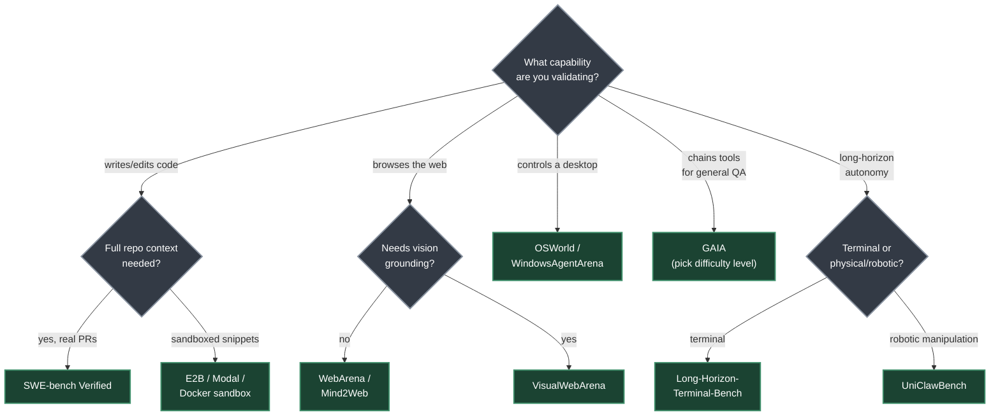
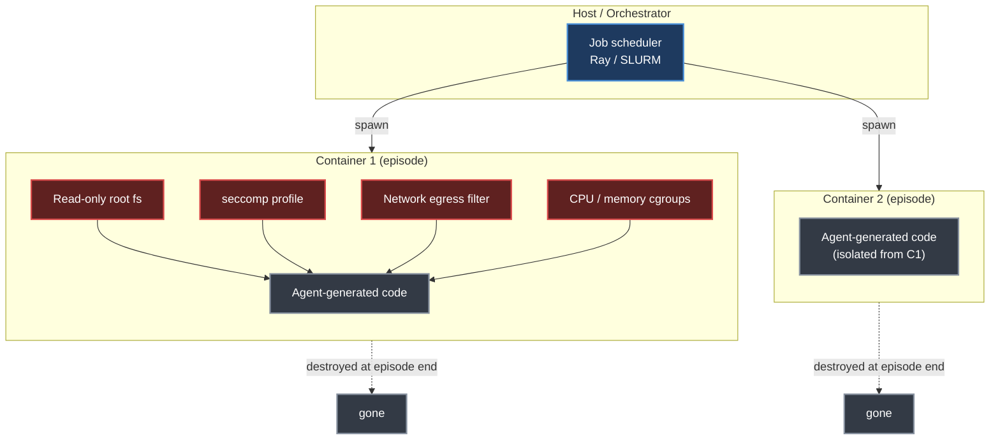

# Chapter 21. Agentic Environments and Benchmarks

> *"The gap between chatbot and agent evaluation is not merely quantitative — it requires a different infrastructure."*
> — Roitman, Chapter 21

**Part V — Agentic AI** · Book pages 404–420 · ~20 min read

[← Chapter 20. Agent Design Patterns](20-agent-design-patterns.md) · [Index](../README.md) · [Chapter 22. Model Context Protocol →](22-model-context-protocol.md)

---

## What This Chapter Is About

Evaluating a chatbot is a one-shot problem: prompt in, response out, score against a reference. Evaluating an agent is not, because an agent's quality is a property of a *policy* — a sequence of actions under changing world state — not any single generation. That requires a structured world the agent can act in, observe consequences from, and be scored against over many steps: an agentic environment. Roitman frames the chapter around a tight analogy — agentic environments are what OpenAI Gym was for classical reinforcement learning (RL), a common `reset()` / `step()` / `render()` interface decoupling algorithms and evaluation methodology from any one task — and covers why environments exist, the four design axes every environment must get right, a tour of environment families, the emerging OpenEnv standard, and a worked minimal custom environment.

Environment and benchmark choice is not neutral — it determines what capability actually gets trained and what "state of the art" means. A model tuned against a leaky, easily-hacked reward looks excellent on its own benchmark and fails in deployment. A reader of only this chapter should come away knowing which named benchmark to reach for when validating a given agent capability, its known score and limitations, and what to check before trusting any single number.

Scope note: *environment* here means the RL-sense world used for training or evaluation, not the production serving infrastructure covered in [Chapter 18](18-agent-harness-context-and-orchestration.md). Sandboxes appear here because they enable environments, not because this is a harness chapter.

## Table of Contents

- [The Mental Model](#the-mental-model)
- [21.1 Why Agents Need Environments](#211-why-agents-need-environments)
- [21.2 Environment Design Principles](#212-environment-design-principles)
- [21.3 Types of Agentic Environments](#213-types-of-agentic-environments)
- [21.4 OpenEnv: Standardized Environment Interfaces](#214-openenv-standardized-agentic-environment-interfaces)
- [21.5 Building Custom Environments](#215-building-custom-environments)
- [21.6 Environment–Agent Interface Patterns](#216-environmentagent-interface-patterns)
- [21.7 Evaluation Harness Design](#217-evaluation-harness-design)
- [21.8 A Minimal Custom Environment](#218-a-minimal-custom-environment)
- [21.9 Benchmark Comparison Table](#219-benchmark-comparison-table)
- [Benchmark Taxonomy and Selection](#benchmark-taxonomy-and-selection)
- [Sandbox Isolation Architecture](#sandbox-isolation-architecture)
- [Decision Guide](#decision-guide)
- [Common Pitfalls](#common-pitfalls)
- [Summary](#summary)
- [Practitioner Checklist](#practitioner-checklist)
- [Going Deeper](#going-deeper)

---

## The Mental Model


*The agent (policy) never touches the world directly. It emits an action, the harness dispatches it into the environment, the environment executes it inside a sandbox and returns an observation plus a reward, and every step is logged into a trajectory that a benchmark harness aggregates into a reported score. Training and evaluation share this exact loop — only what happens to the reward (a policy-gradient update vs. a leaderboard entry) differs.*

The loop mirrors what OpenAI Gym popularized for classical RL: `reset()` starts an episode and returns the initial observation, `step(action)` advances the world and returns `(observation, reward, done)`, and `render()` gives a human-readable view of state. The rest of the chapter is detail on how each call is implemented for LLM-based agents, and how episodes become comparable benchmark numbers.

## 21.1 Why Agents Need Environments

A conversational model is scored on one response against a reference or human preference. An agent must act, observe consequences, and adapt over a sequence of steps — no single response captures that. Roitman names three forces that make dedicated agentic environments necessary:

**Safe exploration.** Production databases, live websites, and financial APIs cannot absorb an agent's exploratory, failure-prone training behavior. A sandboxed environment lets the agent fail, recover, and learn without irreversible harm — security isolation (Docker containers, network-restricted VMs) is a first-class design requirement, not an afterthought.

**Reproducible evaluation.** Benchmarking requires every agent to face the same task under the same conditions — deterministic on demand, version-controlled, distributable — a property whose historical absence is why agent benchmarks have been hard to compare.

**Curriculum learning.** Training from scratch on hard tasks is sample-inefficient; a difficulty curriculum that gradually increases task complexity as the agent improves dramatically reduces the interactions needed to reach a target performance level. (Roitman credits OpenAI Gym [31] as the model for this standardization effort.)

## 21.2 Environment Design Principles

A well-designed environment exposes four orthogonal axes: observation space, action space, reward signal, and episode structure. Getting each one right is necessary; getting all four right simultaneously is the actual craft.

### Observation Space Design

The observation is what the agent sees at each step. For LLM agents it is almost always rendered as text, but the underlying source varies: **pure text** (terminal output, file contents, API responses — maximally compatible, but loses spatial structure), **structured JSON/XML** (machine-readable state — precise grounding, but requires parsing rather than reading prose), **multimodal** (screenshots, accessibility trees, rendered HTML — necessary for GUI and web tasks, needs a vision-capable model), and **hybrid** (a screenshot paired with an accessibility tree, used in OSWorld and VisualWebArena, combining both strengths).

> [!WARNING]
> **Observation leakage.** A common design mistake is letting information the agent should not have — the ground-truth answer, the reward value, future task steps — leak into the observation. This inflates benchmark scores and produces agents that fail catastrophically once deployed where that information is absent.

### Action Space Design

The action space defines what the agent can do. For LLM agents, an action is typically a text string the environment parses and executes: **tool calls** (structured invocations — search, calculator, calendar — usually JSON/XML function-call syntax), **code execution** (the agent writes code that runs in a sandbox; stdout/stderr becomes the next observation — the most expressive action type), **API interactions** (HTTP requests, database queries, shell commands), **GUI actions** (`click(x,y)`, `type("text")`, `scroll(direction)`, `key("Enter")`, used in computer-use environments), and **natural language** (free-form text to another agent, a human, or a sub-task planner).

### Reward Signal Design

Reward design is the hardest part of environment engineering. A usable reward must be:

1. **Aligned** — high reward corresponds to genuine task completion, not a superficial proxy.
2. **Learnable** — dense enough that the agent can make progress; pure sparse rewards on long-horizon tasks are often unlearnable without additional shaping.
3. **Tamper-proof** — the agent cannot achieve high reward without actually completing the task (reward hacking).

| Reward Type | Pros | Cons |
|---|---|---|
| Sparse (0/1 at end) | Aligned, hard to hack | Hard to learn |
| Dense (step-level) | Easy to learn | Prone to shaping artifacts |
| Intrinsic (curiosity) | Drives exploration | May diverge from task |
| LLM-as-judge | Flexible, nuanced | Expensive, inconsistent |
| Execution-based | Ground truth | Only for verifiable tasks |

*Table 21.1 (source): reward signal types for agentic environments, with trade-offs.*

### Episode Structure

Episodes are organized **fixed-length** (exactly *T* steps — simple, wastes compute on solved tasks), **early termination** (ends on completion signal or terminal state — efficient, needs a reliable detector), or **open-ended** (runs until a token/call/time budget is exhausted — closest to deployment, hardest to evaluate). Recent work challenges fixing length upfront: AELA [411] starts short and extends the horizon as competence grows (via policy-entropy convergence); DLER [235] shows hard truncation works for reasoning models with batch-wise reward normalization and dynamic sampling; learned stopping [227] lets the model decide via answer convergence, a boosted end-of-thinking token, or a hidden-state classifier; APRIL [251] recycles incomplete rollouts as warm-start prefixes for a 20–35% throughput gain; TLT [149] speculatively decodes stragglers for a lossless 1.7× speedup.

### Difficulty Curriculum and Adaptive Environments

Adaptive environments monitor performance online and keep the agent in the "zone of proximal development." **Procedural generation** tunes difficulty from recent success rate (Prioritized Level Replay [167] replays high-learning-potential levels); **self-play** — PAIRED [74] trains an adversary to maximize regret between a protagonist and antagonist, producing a curriculum without hand-designed schedules; **hindsight relabeling** gives signal from failure by relabeling the goal actually achieved (HER [8]); and **difficulty-targeted data selection** for RLVR prioritizes questions solved 30–70% of the time for maximal gradient information [370], with ADCL [230] re-estimating difficulty as the model improves.

## 21.3 Types of Agentic Environments


*Agentic environments group into domains that each stress a different capability. No single environment is sufficient — a code-repair agent that excels at SWE-bench says little about its ability to control a desktop GUI, and vice versa.*

### Code Execution Sandboxes

The most fundamental agentic environment: the agent writes code, the sandbox runs it, the output comes back. Docker-based isolation is most common — each episode spawns a fresh container from a known image, runs the code, and destroys the container at episode end, with network access, filesystem writes, and process spawning controllable at the container level. **E2B** (Environments to Benchmarks) executes code in an isolated Firecracker microVM booting in under 200 ms, handling container lifecycle for training loops; **Modal** offers similar managed execution with stronger GPU support for ML workloads.

> [!WARNING]
> **Sandbox escape and security.** Sandboxes are a primary attack surface — a capable agent, or a prompt-injected payload, may attempt kernel exploits, network exfiltration, or resource exhaustion. Defense-in-depth (see the architecture below) is essential; never run agent-generated code with host-level privileges.

### Web Environments

**WebArena** [440] is a self-hosted testbed of four web applications — e-commerce, social forum, GitLab, CMS — plus a map service, 812 long-horizon tasks needing multi-step navigation, form filling, and retrieval via a browser API (human ~78%, SoTA ~35–45%). A representative task — "find the cheapest red dress under $50, add it to the cart" — checks the final cart state against ground truth: a clean, tamper-proof execution-based reward. **VisualWebArena** [188] adds visually grounded tasks: the observation pairs a screenshot with an accessibility tree, and the agent grounds actions in both. **Mind2Web** [73] is 2,000 tasks across 137 real websites from human demonstrations, targeting generalization to unseen sites over a fixed testbed.

### Computer Use Environments

**OSWorld** [397] tests desktop automation across Ubuntu, Windows, and macOS with 369 tasks spanning productivity apps (LibreOffice, VS Code, Chrome, GIMP), observed via screenshots and acted on via `pyautogui`-style mouse/keyboard commands — the chapter's starkest human–agent gap (72% vs. ~18%). **WindowsAgentArena** [27] focuses on Windows 11, 154 tasks across 19 applications, emphasizing enterprise workflows (Excel, PowerPoint, Outlook). The core difficulty is the **screenshot bottleneck**: a 1920×1080×3-pixel image is mostly irrelevant to the current action, so efficient agents attend to small regions and use accessibility trees to identify elements by name rather than pixel coordinate.

### Software Engineering Environments

**SWE-bench** [169] draws on 2,294 real pull requests from 12 widely-used Python projects (Django, Flask, scikit-learn, among others); each instance pairs an issue with a held-out test suite that passes only after the correct patch, requiring the agent to locate the code, fix it, and verify with tests. **SWE-bench Verified** (500 issues, human-validated) is the standard target. **SWE-agent** [404] is both benchmark and agent framework, introducing the **Agent-Computer Interface (ACI)** — LLM-optimized shell commands (`search_file`, `open`, `edit`) that cut action-space complexity versus raw bash. Reward is binary: 1 if all target tests pass, 0 otherwise, no partial credit.

### Scientific, Game, and Multi-Agent Environments

**PaperQA2** [245] answers scientific questions by searching a PDF corpus and synthesizing a cited answer; **AI Scientist** [240] runs an end-to-end pipeline — hypothesis, experiment, interpretation, draft paper — via a Python sandbox, literature search API, and LaTeX compiler; **MLAgentBench** [151] scores agents on improving model accuracy on a dataset within a compute budget. **NetHack** [196] (NLE, Gym-compatible) is a procedurally generated roguelike demanding long-term planning; **Voyager / Minecraft** [362] introduces a curriculum (wood → tools → shelter → the Nether) and an accumulating skill library. **GAIA** [254] poses 466 questions demanding chained tool use, graded across three difficulty tiers, starkly exposing the human/agent gap: ~92% human accuracy vs. ~15% for GPT-4 with plugins at launch, ~30% for later systems.

Multi-agent environments add two or more LLM agents interacting with each other and/or a shared world: **negotiation** (DealOrNoDeal [206], CaSiNo [42]), **debate** (a judge evaluates argument quality, eliciting truthful reasoning via adversarial pressure), **collaborative task completion** (planner/executor/critic roles via AutoGen [385], CrewAI [261], MetaGPT [142]), and **competitive games** (zero-sum self-play in chess, Go, poker, producing superhuman performance in narrow domains).

## 21.4 OpenEnv: Standardized Agentic Environment Interfaces

The proliferation of environments created a fragmentation problem: every one exposes a different API, observation format, and scaffolding. **OpenEnv** [88], from Hugging Face, addresses this with a Gymnasium-style [355] interface (`step()`, `reset()`, `state()`), deployed as isolated Docker containers over WebSocket. It complements **AgentGym** [390] (a uni-format platform for LLM agents across diverse environments) and **BrowserGym** [201] (standardized spaces for web-agent benchmarks specifically).


*OpenEnv architecture with an LLM agent (Figure 21.1 in the source). The agent reasons via a harness loop, which calls the typed `EnvClient`. The client communicates over WebSocket to an `HTTPEnvServer` running inside a Docker container. An RL trainer optionally wraps the loop to collect rollouts and reward signals for policy optimization.*

### Standardized Agent–Environment Interface

OpenEnv's core methods mirror Gymnasium's simplicity over HTTP/WebSocket: `env.reset() → StepResult` starts an episode; `env.step(action) → StepResult(observation, reward, done)` executes one action; `env.state()` returns episode ID and step count; `env.close()` releases resources. Actions and observations are strongly typed Python dataclasses per environment — a coding environment defines `CodeAction(code=...)` and returns `stdout`/`stderr`/`exit_code` — keeping the three core methods universal while typing stays local.

Each environment is a Python class inheriting from `Environment` (`reset()`, `step()`), served in a Docker container via `HTTPEnvServer` (a FastAPI/WebSocket endpoint), reached through an `EnvClient` subclass launched locally via `from_docker_image()` or remotely by base URL:

```python
client = CodingEnv.from_docker_image("coding-env:latest")
result = client.step(CodeAction(code="print(2 + 2)"))
print(result.observation.stdout, result.reward, result.done)  # "4\n" 1.0 False
```

A new environment needs only `reset()`/`step()` implementations plus `create_app(env, ActionType, ObservationType)` for `uvicorn` to serve.

> [!NOTE]
> **Harness integration (experimental).** RFC 0054 introduces a harness-facing layer where RL training frameworks call environments through Model Context Protocol (MCP)-style tool calls; `build_harness_rollout_func()` produces a Transformer Reinforcement Learning (TRL)-compatible rollout function, bridging OpenEnv into pipelines like TorchForge [348]. See [Chapter 12](12-llm-agentic-training.md) and [Chapter 22](22-model-context-protocol.md).

OpenEnv is openly governed by a committee spanning Meta-PyTorch, NVIDIA, Unsloth, Modal, Prime Intellect, Reflection, and Hugging Face.

### Registries, Composition, and Versioning

OpenEnv environments deploy as Hugging Face Spaces or local Docker images with the same client interface regardless of target, spanning **70+ environments** (OpenSpiel, Atari, BrowserGym, coding sandboxes, financial RL, traffic simulation); RFC 0025 proposes runtime tool discovery. Compositional environments expose multiple capabilities through typed actions — a coding environment can combine code execution, file I/O, and shell commands in one session, state persisting across steps; RFC 0036 proposes wrapping any MCP-compatible tool server as an OpenEnv environment, and the `openenv` CLI scaffolds and deploys new ones in one command.

Benchmark integrity also needs behavior frozen at evaluation time: semantic versioning (e.g., WebArena-v1.2.0), Docker image pinning (content-addressed hash), seed-based determinism (exact trajectory replay), and leaderboard snapshots recording the environment version alongside the score.

## 21.5 Building Custom Environments

The Gymnasium API [355] (successor to OpenAI Gym) is the de facto standard for RL environments. Adapting it for LLM agents needs two changes: observations and actions are strings (or dicts of strings) rather than numeric arrays, and `step` must handle asynchronous tool execution.

**Reward function engineering.** Rewards are typically execution-based (a verifier runs after each episode, 1 if solved, 0 otherwise); without a clear verifier, fall back to **LLM-as-judge**, **rubric-based scoring** (independently scored sub-criteria), or **human annotation** calibrating an automated proxy. **State management** matters for long-horizon tasks: **state serialization** (filesystem, cookies, database contents restored from disk), **mid-episode checkpointing** (resume from any step for tree-search-style exploration), and **trajectory logging** for offline analysis and reward-model training. **Parallelization** — process-level parallelism, async rollout workers overlapping inference latency with execution, vectorized environments batching per step call, and cloud-native scaling (Ray or SLURM plus a central replay buffer) — is what makes millions of environment interactions tractable. [Chapter 12](12-llm-agentic-training.md) covers how these rollouts feed the policy-optimization loop.

## 21.6 Environment–Agent Interface Patterns

Four patterns dominate. **Text-based** — string observation, string action, parsed by the environment (e.g., a `<tool>...</tool>` block) — the most compatible, since any LLM can participate without special architecture. **Structured JSON** — schema-validated objects enabling strict validation and easier trajectory analysis, at the cost of requiring reliably valid JSON output. **Multimodal (screenshot + accessibility tree)** — `(screenshot: PIL.Image, a11y_tree: dict)`, used in computer-use and web environments, more robust than pure screenshot control since elements can be referenced without pixel coordinates. **Streaming vs. turn-based** — most environments are turn-based; streaming lets the agent see partial output as a long-running command emits it and interrupt mid-stream, closer to human computer use but architecturally more complex.

## 21.7 Evaluation Harness Design

An evaluation harness runs an agent across a benchmark suite and produces summary statistics — design here matters as much as the environment itself. **Deterministic environments** reproduce the same sequence for the same actions (easy to debug, less realistic); **stochastic environments** (procedural generation, network latency, user simulation) need multiple runs to estimate confidence intervals.

> [!NOTE]
> **How many runs are enough?** For a benchmark with *N* tasks and binary rewards, the standard error of the mean success rate is $\sqrt{p(1-p)/N}$. With *N* = 500 and *p* = 0.4, the 95% confidence interval is about ±4.3%; for stochastic environments multiply by $\sqrt{k}$ where *k* is runs per task — 3–5 is common practice.

Benchmark integrity also needs a strict **train/test split at the environment level**, not just the task level, and **cross-environment generalization** protocols to test transfer directly: zero-shot (train on A, test on B), few-shot (*k* demonstrations from B first), and continual learning (train sequentially on A, B, C; measure all three after C). Every benchmark should report a **human baseline** — it bounds task difficulty, reveals unsolvable or ambiguous tasks, and calibrates agent scores (e.g., "40% of human performance"); baselines should come from domain experts (software engineers for SWE-bench, not crowdworkers) with time-on-task recorded. See [Chapter 14](14-llm-evaluation.md) for the broader evaluation methodology this sits inside.

## 21.8 A Minimal Custom Environment

The source walks through a minimal file-editing environment where the agent edits a Python file to make a failing test pass, following the Gymnasium API adapted for LLM agents. The instructive part is the design: a **text-only interface** (plain strings, compatible with any LLM), an **execution-based reward** (run the actual test suite rather than an LLM judge — tamper-proof and aligned), an **isolated subprocess** (tests run separately with a timeout, so an infinite loop can't crash the training loop), and full **Gymnasium compatibility** (`reset`/`step`/`render`/`close`, drop-in with RL trainers).

```python
class FileEditEnv:
    # Observation: str (file + test output). Action: view | edit <code> | run_tests | submit.
    MAX_STEPS, TIMEOUT = 20, 30   # hard episode limit; seconds per test run

    def step(self, action: str) -> StepResult:
        test_output = self._run_tests()
        passed = "passed" in test_output and "failed" not in test_output
        reward = 1.0 if passed else 0.0
        terminated = passed or action.startswith("submit")
        truncated = self._step_count >= self.MAX_STEPS
        return StepResult(obs, reward, terminated, truncated, info)
```

A single correct edit — `return a - b` fixed to `return a + b` in a buggy `add()` function — drives `reward` to 1.0 and `terminated` to `True` in the source's worked example.

## 21.9 Benchmark Comparison Table

The source's Table 21.2 compares the major agentic environments discussed in the chapter, plus the two emerging 2026 benchmarks the chapter closes with. "SoTA" is the best published LLM agent result at time of writing; human performance is shown where reported.

| Benchmark | Domain | Task Count | What It Measures | Human Baseline | SoTA LLM | Known Limitations |
|---|---|---|---|---|---|---|
| **WebArena** [440] | Web navigation (e-commerce, forum, GitLab, CMS, maps) | 812 | Multi-step navigation, form filling, information retrieval via a browser API | ~78% | ~45% | Self-hosted replica sites, not the live web; text + DOM observation only |
| **VisualWebArena** [188] | Visual web tasks | 910 | Grounding actions in screenshot + accessibility-tree (DOM) observations | 88% | ~35% | Requires vision-capable models; harder than text-only WebArena |
| **Mind2Web** [73] | Real websites (out-of-distribution) | 2,000 (137 sites) | Generalization to unseen websites from human demonstrations | — | ~30% | No human baseline reported in the source; OOD focus makes scores hard to compare across labs |
| **OSWorld** [397] | Desktop OS (Ubuntu, Windows, macOS) | 369 | Pixel-level GUI control across productivity apps (LibreOffice, VS Code, Chrome, GIMP) | 72% | ~18% | Largest human/agent gap in the table; screenshot-heavy observation is high-dimensional and expensive |
| **WindowsAgentArena** [27] | Windows 11, 19 applications | 154 | Enterprise workflows — Excel, PowerPoint, Outlook | 75% | ~20% | Narrower OS/app scope than OSWorld |
| **SWE-bench Verified** [169] | Real-world code repair (Python) | 500 (of 2,294 total) | Locating and patching real GitHub issues, verified by held-out tests | 100% | ~50% | Binary pass/fail, no partial credit; Python-only, drawn from 12 popular repos |
| **GAIA (Level 1)** [254] | General QA, chained tool use | 165 | Web search + code execution + file parsing on easier multi-step questions | 92% | ~55% | — |
| **GAIA (Level 3)** [254] | General QA, chained tool use | 42 | Same, at the hardest reasoning-step difficulty tier | 92% | ~10% | Sharpest human/agent gap of any tier; small task count |
| **NetHack (NLE)** [196] | Roguelike game | — | Long-term planning, inventory management, adaptation under a huge state space | >10k score | ~5k score | Procedurally generated; score is not a fixed task count |
| **Voyager (Minecraft)** [362] | Open-world game | Curriculum-based | Open-ended skill acquisition via a growing code skill library | — | 15+ tech tree items | No fixed task count or human baseline; progress measured by curriculum depth |
| **MLAgentBench** [151] | ML engineering | 13 | Improving model accuracy on a dataset within a compute budget | — | ~40% | Very small task count (13) |
| **UniClawBench** [214] | Robotic manipulation / cross-platform coordination (2026) | 400 (5 functional areas) | Interactive resilience under a hidden-supervisor + simulated-user feedback loop injecting ambiguity, changing requirements, partial failures | — | — | Source gives no numeric SoTA; measures resilience to friction, not one-shot completion |
| **Long-Horizon-Terminal-Bench** [386] | Long-horizon terminal / command-line tasks (2026) | 46 (21 domains) | Dense, step-level progress grading on multi-hour terminal sessions | — | ~15 consecutive commands before derailing | Even frontier models derail well short of full tasks; exposes long-horizon execution as unsolved |

> [!NOTE]
> **Reading the table.** The human/SoTA gap is largest for computer-use tasks (OSWorld: 72% vs. 18%) and smallest for code repair (SWE-bench: 100% vs. 50%) — Roitman attributes this to training-data maturity: vast code data, comparatively little screenshot-interaction data.

## Benchmark Taxonomy and Selection


*Benchmark selection follows from the capability under test, not the other way around — picking a benchmark first and then interpreting whatever it measures as "agent quality" is how leaderboard-chasing produces agents that are good at benchmarks and poor at deployment.*

## Sandbox Isolation Architecture


*Defense-in-depth for code execution sandboxes: each episode gets a fresh, disposable container with a read-only root filesystem, a seccomp profile, network egress filtering, and CPU/memory cgroups layered around the agent-generated code. No agent process runs with host-level privileges, and the container is destroyed at episode end regardless of outcome.*

## Decision Guide

The flowchart above routes by target domain; these two cases sit outside it:

| If you need to… | Reach for… | Why |
|---|---|---|
| Train an agent from scratch with RL | Any OpenEnv-wrapped environment | Standard `reset`/`step`/`state` plugs into existing rollout code |
| Prototype a new task type quickly | Custom `Environment` subclass (Section 21.5) | Three methods, Gymnasium-compatible, drop-in with trainers |

## Common Pitfalls

> [!WARNING]
> **Observation leakage.** Ground-truth answers, reward values, or future task steps leaking into the observation inflates scores and produces agents that collapse once that information is absent in deployment.

> [!WARNING]
> **Reward hacking.** An agent under RL finds the shortest path to high reward, not the intended one — LLM-as-judge and dense shaped rewards are especially exposed without careful auditing.

> [!WARNING]
> **Sandbox escape.** A capable agent or a prompt-injected payload may attempt kernel exploits, network exfiltration, or resource exhaustion. Never run agent-generated code with host-level privileges.

> [!WARNING]
> **Benchmark drift.** Without semantic versioning, image pinning, seed-based determinism, and leaderboard snapshots recording the environment version, a reported score can silently stop meaning what it used to.

> [!WARNING]
> **Train/test leakage at the environment level.** Evaluating on tasks from the same websites, apps, or repos used in training overstates generalization — the split must hold at the environment level, not just the task level.

## Summary

- Agent evaluation measures a policy across long-horizon, multi-step tasks, not a single generation — why agentic environments exist as dedicated infrastructure rather than an extension of chatbot evaluation.
- Three forces make environments necessary: safe exploration, reproducible evaluation, and curriculum learning — a difficulty ramp that cuts the interactions needed to reach target performance.
- Environment design has four orthogonal axes — observation space, action space, reward signal, episode structure — and a failure on any one can invalidate an entire benchmark.
- The human/agent gap varies sharply by domain: smallest for code repair (SWE-bench Verified: 100% human vs. ~50% SoTA), largest for desktop GUI control (OSWorld: 72% vs. ~18%) — a pattern Roitman attributes to training-data availability per interaction type.
- OpenEnv standardizes the agent–environment interface (`reset`/`step`/`state`/`close`) with Docker isolation and Hugging Face Spaces as a registry, spanning 70+ environments.
- Emerging 2026 benchmarks push past static scoring: UniClawBench injects live friction (a hidden supervisor plus a simulated user) across 400 bilingual tasks, while Long-Horizon-Terminal-Bench's dense grading reveals models derailing after roughly 15 consecutive terminal commands.
- A minimal custom environment needs only four methods (`reset`, `step`, `render`, `close`) and an execution-based reward to be tamper-proof and drop-in compatible with RL training frameworks.

## Practitioner Checklist

- [ ] Sandbox agent-executed code with container isolation, seccomp, a read-only root filesystem, egress filtering, and cgroups before running an untrusted agent.
- [ ] Audit the observation space for leaked ground truth, reward values, or future task steps.
- [ ] Prefer an execution-based reward wherever verifiable; reserve LLM-as-judge for tasks with genuinely no ground truth.
- [ ] Enforce train/test splits at the environment level, not just the task level.
- [ ] Report a human baseline from domain experts alongside any new benchmark result.
- [ ] For stochastic environments, run 3–5 repetitions per task and report a confidence interval.
- [ ] Pin the environment version (image hash, semantic version) in any leaderboard entry or claim.
- [ ] Match the benchmark to the capability under test rather than the most popular one.
- [ ] Build custom environments from the Gymnasium-style four-method contract.
- [ ] Choose episode structure deliberately rather than defaulting to a fixed step count.

## Going Deeper

- **SWE-bench** [169] / **SWE-agent** [404], **WebArena** [440] / **VisualWebArena** [188] / **Mind2Web** [73], **OSWorld** [397] / **WindowsAgentArena** [27], **GAIA** [254] — the core benchmark families.
- **NetHack Learning Environment** [196] / **Voyager** [362] — game and open-world environments; **UniClawBench** [214] / **Long-Horizon-Terminal-Bench** [386] — the emerging 2026 benchmarks.
- **OpenEnv** [88] plus **AgentGym** [390] and **BrowserGym** [201] — standardized environment interfaces; **Gymnasium** [355], successor to OpenAI Gym [31]; **E2B** and **Modal** — managed sandbox providers.
- Curriculum/adaptive-difficulty methods named in the chapter: AELA [411], DLER [235], APRIL [251], TLT [149], Prioritized Level Replay [167], PAIRED [74], HER [8], ADCL [230].

---

[← Chapter 20. Agent Design Patterns](20-agent-design-patterns.md) · [Index](../README.md) · [Chapter 22. Model Context Protocol →](22-model-context-protocol.md)

*Summary of Chapter 21 of [The Hitchhiker's Guide to Agentic AI](https://arxiv.org/abs/2606.24937)
by Haggai Roitman. Licensed CC BY-SA 4.0. Independent study notes — not affiliated with or
endorsed by the author.*
