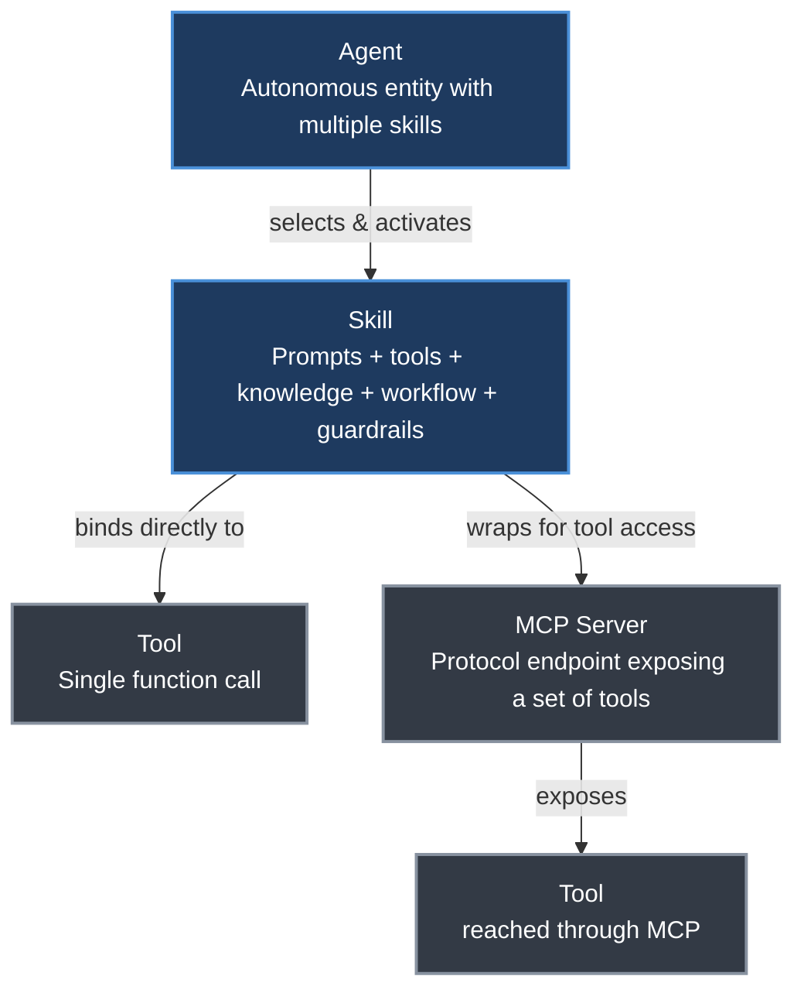
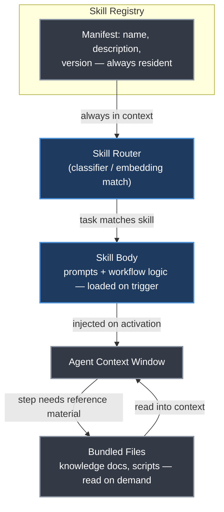
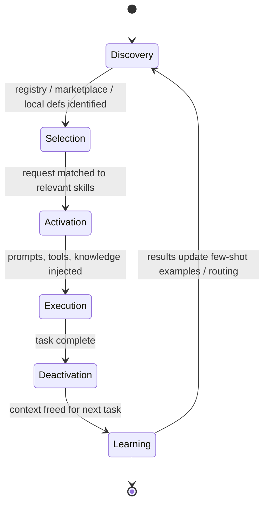

# Chapter 23. Agent Skills

> *"Skills encapsulate domain expertise in a composable, versionable format that scales beyond what any single prompt can hold."*
> — Roitman, Chapter 23

**Part V — Agentic AI** · Book pages 441–445 · ~9 min read

[← Chapter 22. Model Context Protocol](22-model-context-protocol.md) · [Index](../README.md) · [Chapter 24. Agent-to-Agent Communication →](24-agent-to-agent-communication.md)

---

## What This Chapter Is About

As agents move from monolithic prompt-and-tool systems to modular architectures, a design question follows immediately: how should an agent's capabilities be organized, discovered, and composed? Skills are the answer this chapter builds out — discrete, reusable units of behavior that can be loaded, combined, and swapped without retraining the model. The idea traces to Voyager, which showed an LLM agent in Minecraft accumulating a growing library of verified, reusable code skills; production agents apply the same principle to domain expertise rather than game actions.

A skill is not a bigger tool. A raw tool exposes one callable function; a skill bundles system-prompt instructions, tool bindings, reference knowledge, multi-step workflow logic, and guardrails into one loadable unit, and frequently wraps MCP servers (Chapter 22) for its tool access rather than replacing the standardized tool-protocol layer. This chapter covers what a skill packages, three loading patterns, Anthropic's production philosophy, the runtime lifecycle, the manifest format, and skills vs. fine-tuning.

## Table of Contents

- [The Mental Model](#the-mental-model)
- [23.1 What Is a Skill?](#231-what-is-a-skill)
- [23.2 Skill Architecture Patterns](#232-skill-architecture-patterns)
- [23.3 Case Study: Anthropic's Agent Design](#233-case-study-anthropics-agent-design)
- [23.4 Skill Lifecycle](#234-skill-lifecycle)
- [23.5 Skill Registries and Marketplaces](#235-skill-registries-and-marketplaces)
- [23.6 Skills vs. Fine-Tuning](#236-skills-vs-fine-tuning)
- [Decision Guide](#decision-guide)
- [Common Pitfalls](#common-pitfalls)
- [Summary](#summary)
- [Practitioner Checklist](#practitioner-checklist)
- [Going Deeper](#going-deeper)

---

## The Mental Model



*A tool is a single callable function. An MCP server is a protocol endpoint exposing a set of such tools to any client speaking MCP. A skill is neither — it bundles prompts, knowledge, workflow logic, and guardrails around one or more tools, whether bound directly or reached through an MCP server. An agent selects which skills to apply to a given task.*

The book's own framing: a tool is a hammer, a skill is knowing how to frame a house, and an agent is the carpenter who decides which skills the job calls for.

---

## 23.1 What Is a Skill?

A skill is a self-contained capability module that gives an agent expertise in a specific domain or task. Where a raw tool exposes a single function, a skill packages five things together:

| Component | What it contributes |
|---|---|
| System prompt augmentation | Domain-specific instructions, constraints, and persona elements injected into the agent's context |
| Tool bindings | One or more tools the skill requires — APIs, MCP servers, local commands |
| Knowledge | Reference material, examples, or few-shot demonstrations needed to execute the skill correctly |
| Workflow logic | Multi-step procedures, decision trees, or conditional flows guiding the agent through the task |
| Guardrails | Skill-specific safety constraints, output-format requirements, and validation rules |

| Concept | Scope | Example |
|---|---|---|
| Tool | Single function call | `web_search(query)` |
| MCP server | Protocol endpoint exposing a set of tools | GitHub MCP server exposing `git_diff`, issue and PR tools |
| Skill | Coherent capability: prompts + tools + knowledge | "Research Analyst" skill |
| Agent | Autonomous entity with multiple skills | A coding assistant |

## 23.2 Skill Architecture Patterns

### 23.2.1 Static Skill Loading

The simplest pattern: skills are loaded at agent initialization from configuration, and the agent always has access to all of them.

```python
# Pseudocode -- framework-agnostic pattern
agent = Agent(
    model="claude-sonnet-4-20250514",
    skills=["code-review", "documentation", "testing"],
    # Each skill adds prompts, tools, and knowledge to the agent
)
```

Pros: simple, predictable, low latency. Cons: wastes context window on unused skills, and doesn't scale to hundreds of skills.

### 23.2.2 Dynamic Skill Discovery

The agent activates skills based on the current task. A skill router — often a lightweight classifier or embedding-based matcher — selects relevant skills from a registry:

```python
# Pseudocode -- framework-agnostic pattern
relevant_skills = skill_router.match(
    user_request=message,
    available_skills=skill_registry,
    max_skills=3
)
agent.activate(relevant_skills)
```

Pros: scales to large skill libraries, context-efficient. Cons: routing errors can miss relevant skills, and routing adds latency.

### 23.2.3 Hierarchical Skill Composition

Skills can depend on other skills, forming a directed acyclic graph (DAG). A high-level skill such as "Deploy Application" may invoke sub-skills — "Run Tests," "Build Docker Image," "Update DNS." Skills declare their dependencies explicitly, an orchestrator resolves the dependency graph before execution, and sub-skills can be shared across multiple parent skills.



*Progressive disclosure: manifest metadata stays resident for every skill in the registry, cheap enough that the router matches on it without paying for the full skill body. Only on activation does the matched skill's prompt and workflow logic enter context (Chapter 18 covers this budget discipline generally); bundled knowledge files load only when a step needs them, and the whole skill is evicted on deactivation.*

## 23.3 Case Study: Anthropic's Agent Design

Anthropic's approach to agent architecture is, per Roitman, one of the clearest articulations of skill-based agent design in production, emphasizing simplicity over complexity and composable building blocks over monolithic frameworks. (Chapter 20 covers these same patterns from an orchestration perspective.)

### 23.3.1 Core Principles

1. **Start with the simplest solution.** Don't reach for agentic patterns until a single LLM call or retrieval-plus-generation has been tried and found insufficient.
2. **Workflows vs. agents.** A workflow is deterministic control flow with LLM steps at specific nodes — predictable, easy to debug. An agent lets the LLM dynamically decide tool selection, iteration count, and stopping criteria — flexible, harder to control.
3. **The augmented LLM as the atomic unit.** The primitive is never a bare model — it is a model bundled with retrieval sources, callable tools, and persistent memory: in practice, a skill-equipped model.

### 23.3.2 Building Block Patterns

Anthropic identifies five composable workflow patterns that function as skill templates:

| Pattern | Mechanism | When to Use |
|---|---|---|
| Prompt Chaining | Sequential LLM calls, each step's output feeding the next, with validation gates between steps | Multi-step transformations with clear decomposition |
| Routing | A classifier/LLM directs input to a specialized skill by task type | Distinct task categories needing different expertise |
| Parallelization | Sectioning (split task) or voting (same task, aggregate), run simultaneously | Independent subtasks; confidence via consensus |
| Orchestrator–Workers | A central LLM decomposes, delegates to workers, synthesizes results | Subtasks not predictable in advance |
| Evaluator–Optimizer | One LLM generates, another evaluates, iterate to a quality threshold | Tasks with clear quality criteria (code, writing) |

### 23.3.3 The Augmented LLM

$$\text{Augmented LLM} = \text{Model} + \text{Retrieval} + \text{Tools} + \text{Memory}$$

This maps directly onto the skill concept: each skill configures which retrieval sources, tools, and memory stores the model can reach for a specific task. The skill boundary defines what the model can see and do within a given invocation.

### 23.3.4 Practical Implications

Anthropic's key insight, as Roitman presents it: the most effective agents aren't the most complex ones — they are simple loops with good tools.

```python
while not done:
    action = llm.decide(context, tools)
    result = execute(action)
    context.append(result)
    done = llm.should_stop(context)
```

The intelligence comes from (1) the model's capability, (2) tool description quality, and (3) task-framing clarity — not elaborate orchestration; skills provide the structure for (2) and (3). Anthropic's resulting recommendations: keep loops simple, invest in tool descriptions over routing logic, force structured outputs (JSON, function calls) to cut execution errors, build in recovery (retry, clarify, escalate), and limit scope per skill.

## 23.4 Skill Lifecycle



*Six stages: discovery finds which skills exist; selection matches skills to the request; activation injects the skill's prompts, tools, and knowledge into context; execution runs the task; deactivation removes that context to free budget for what comes next; learning optionally feeds execution results back into the skill's examples or routing.*

## 23.5 Skill Registries and Marketplaces

Production skill systems need supporting infrastructure: a **skill manifest** for automatic discovery and routing, **version control** so agents can pin versions for reproducibility, **dependency resolution** for skills that require specific MCP servers, API keys, or other skills, a **permission model** since not all agents should reach all skills, and a **marketplace** where organizations publish, share, and install skills — the same role a package manager plays for code.

No industry-standard manifest schema exists yet. The illustrative format below captures fields common across real implementations (Anthropic's MCP, OpenAI function specs, LangChain tool definitions):

```json
{
  "name": "code-review",
  "description": "Review code changes for bugs, style, and security issues",
  "version": "2.1.0",
  "requires": {
    "tools": ["file_read", "grep", "git_diff"],
    "mcp_servers": ["github"],
    "models": ["claude-sonnet-4-20250514"]
  },
  "input_schema": {
    "type": "object",
    "properties": {
      "repo": { "type": "string" },
      "pr_number": { "type": "integer" }
    }
  },
  "prompts": ["skills/code-review/system.md"],
  "knowledge": ["skills/code-review/style-guide.md"]
}
```

Notice the split: `name`, `description`, and `version` are inline strings cheap enough to hold for every registered skill at once, while `prompts` and `knowledge` are file paths read in only once this skill is selected — the same progressive-disclosure split as the diagram above, now at registry scale.

## 23.6 Skills vs. Fine-Tuning

A natural question: why inject a skill at runtime instead of fine-tuning the model on the same capability?

| Dimension | Skills (In-Context) | Fine-Tuning |
|---|---|---|
| Deployment speed | Instant | Hours–days |
| Flexibility | Swap/combine at runtime | Fixed at training time |
| Context cost | Uses context window | Zero runtime cost |
| Deep behavior change | Limited by context length | Deep parametric change |
| Multi-tenant | Different skills per user | Same model for all |
| Maintenance | Update text files | Retrain on new data |

In practice the two are complementary: fine-tuning provides base capabilities — instruction following, tool-use format, reasoning — while skills layer task-specific expertise on top at runtime.

## Decision Guide

| If you need... | Choose |
|---|---|
| A handful of always-needed capabilities, low latency | Static skill loading (§23.2.1) |
| A large or growing skill library, context efficiency | Dynamic skill discovery with a router (§23.2.2) |
| A high-level task built from reusable sub-procedures | Hierarchical skill composition (§23.2.3) |
| A capability every user of the model should have permanently | Fine-tuning, not a skill |
| A capability that must vary per user, per tenant, or ship today | A skill, not fine-tuning |

## Common Pitfalls

> [!WARNING]
> Static loading puts every configured skill's prompts, tools, and knowledge into context whether the task needs them or not — it wastes window space and doesn't scale past a small, fixed skill set.

> [!WARNING]
> Dynamic routing trades that waste for a new failure mode: a router that misclassifies the request never activates the skill that would have solved it, and the matching step itself adds latency.

> [!WARNING]
> A skill scoped to do everything does nothing well — Anthropic's own recommendation is to keep skills narrow; broad skills compose worse, not better.

## Summary

- A skill differs from a tool by scope: a tool is a single callable function, while a skill bundles system-prompt augmentation, tool bindings, knowledge, workflow logic, and guardrails into one loadable unit.
- Skills frequently wrap MCP servers for tool access rather than binding tools directly, layering the skill abstraction on top of the standardized MCP tool layer from Chapter 22.
- Static loading is simple and low-latency but wastes context on unused skills and doesn't scale to large libraries; dynamic discovery via a router scales further but adds routing errors and latency.
- Skills compose hierarchically as a dependency DAG — a high-level skill like "Deploy Application" invoking shared sub-skills such as "Run Tests" or "Build Docker Image."
- Anthropic's philosophy treats the augmented LLM (model + retrieval + tools + memory) as the atomic unit, and argues the most effective agents are simple loops paired with good tool descriptions, not elaborate orchestration.
- The skill lifecycle runs discovery → selection → activation → execution → deactivation → learning; deactivation explicitly frees context window space for the next task.
- A skill manifest separates cheap, always-resident metadata (name, description, version) from prompt and knowledge files loaded only once a skill is selected — the mechanism that makes progressive disclosure work at registry scale.
- Skills and fine-tuning are complementary: skills deploy instantly, cost context, and update as text files; fine-tuning deploys in hours to days, costs nothing at runtime, and requires retraining to update.

## Practitioner Checklist

- [ ] Decide static vs. dynamic skill loading by library size — static for a handful of always-needed skills, a router once the library grows.
- [ ] Scope each skill narrowly; split a skill that is starting to do "everything."
- [ ] Write a manifest for every skill with `name`, `description`, `version`, and explicit `requires` (tools, MCP servers, models).
- [ ] Store prompts and knowledge as separate files referenced by path, not inlined into the manifest, so they load only on activation.
- [ ] Pin skill versions per agent for reproducibility.
- [ ] Declare skill dependencies (sub-skills, MCP servers, API keys) explicitly so an orchestrator can resolve them before execution.
- [ ] Apply a permission model — not every agent should reach every skill in the registry.
- [ ] Force skill outputs into structured formats and build in recovery (retry, clarify, escalate) rather than failing silently.
- [ ] Explicitly deactivate skills once a task completes to free context window budget.
- [ ] Prefer a skill when the capability must vary per user/tenant or ship immediately; prefer fine-tuning when it's universal and should cost zero runtime context.

## Going Deeper

- **Voyager** [362] — the Minecraft agent that popularized accumulating a library of verified, reusable executable skills; cited as the origin of the skill concept.
- **Anthropic's approach to agent architecture** [10] — source of the five building-block patterns, the augmented-LLM framing, and the "simple loops, good tools" philosophy in §23.3.
- [Chapter 22 (Model Context Protocol)](22-model-context-protocol.md) — the standardized tool-protocol layer skills frequently wrap for tool access.
- [Chapter 18 (Agent Harness — Context Management and Orchestration)](18-agent-harness-context-and-orchestration.md) — the context-budget discipline skill activation/deactivation and progressive disclosure serve.
- [Chapter 20 (Agent Design Patterns)](20-agent-design-patterns.md) — Anthropic's five workflow patterns, covered again from an orchestration perspective.

> [!NOTE]
> Bracketed citation markers from the source (e.g., [362], [10]) are preserved as given; the supplied page range excluded the bibliography, so full citations for these references are not available here.

---

[← Chapter 22. Model Context Protocol](22-model-context-protocol.md) · [Index](../README.md) · [Chapter 24. Agent-to-Agent Communication →](24-agent-to-agent-communication.md)

*Summary of Chapter 23 of [The Hitchhiker's Guide to Agentic AI](https://arxiv.org/abs/2606.24937)
by Haggai Roitman. Licensed CC BY-SA 4.0. Independent study notes — not affiliated with or
endorsed by the author.*
