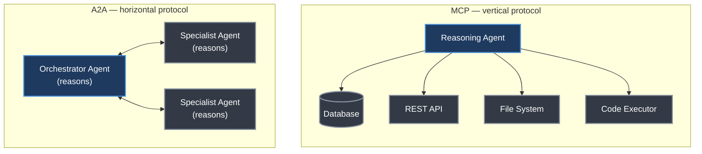
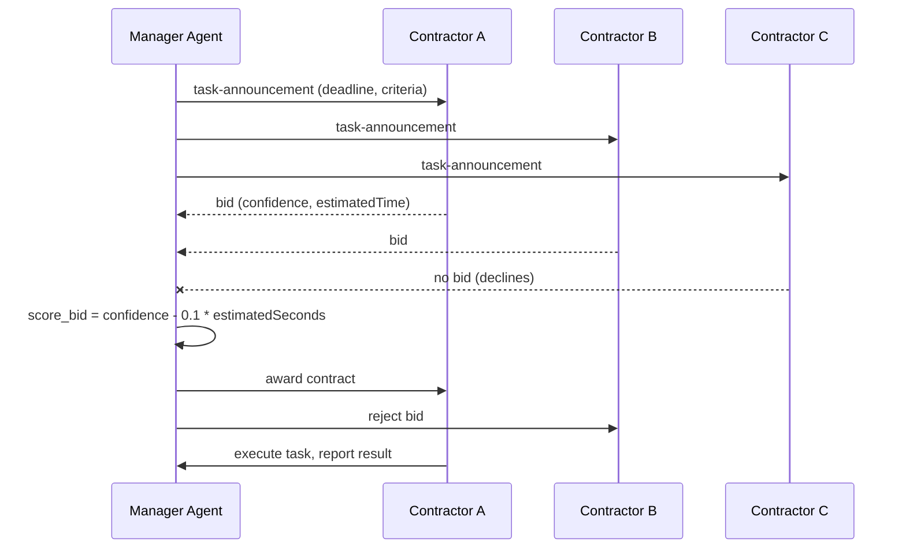
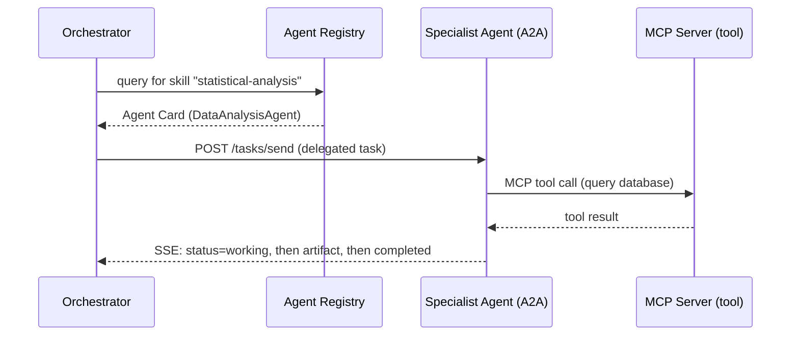
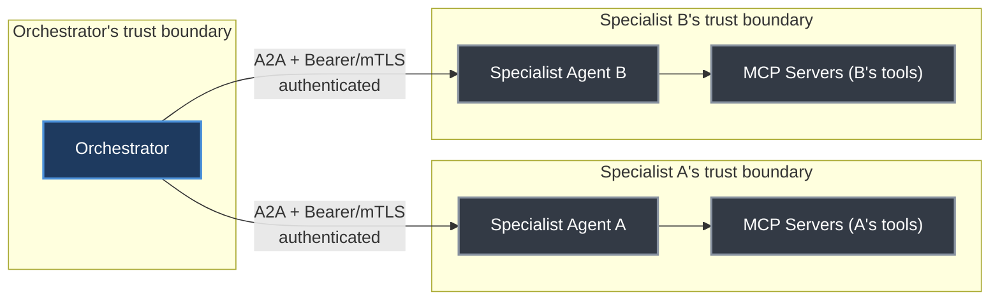
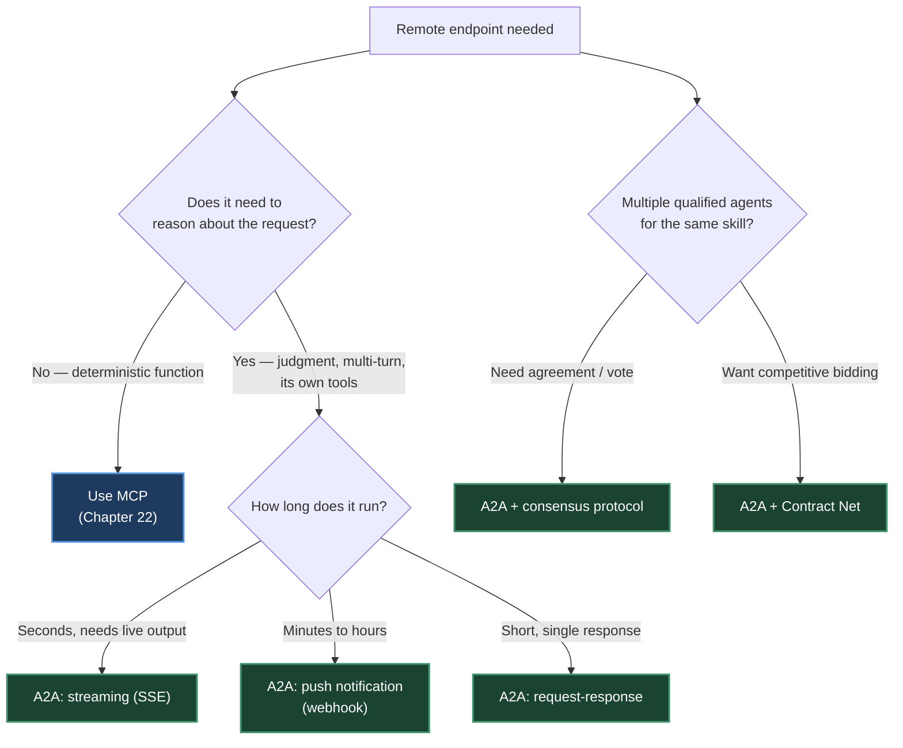

# Chapter 24. Agent-to-Agent Communication (A2A)

> *"MCP is the vertical protocol, extending an agent downward into tools; A2A is the horizontal protocol, linking one reasoning agent to another."*
> — Roitman, Chapter 24

**Part V — Agentic AI** · Book pages 446–467 · ~24 min read

[← Chapter 23. Agent Skills](23-agent-skills.md) · [Index](../README.md) · [Chapter 25. Multi-Agent Systems →](25-multi-agent-systems.md)

---

## What This Chapter Is About

A single generalist agent cannot simultaneously have the breadth of knowledge and the depth of capability that real-world tasks demand. Agent-to-agent communication resolves that tension by letting a network of specialists collaborate — a CodeAgent, a LegalAgent, a DataAgent — each contributing its strengths and delegating its weaknesses. This chapter covers the protocols, patterns, and engineering practices that let independently built agents discover each other, delegate work, and coordinate toward a shared goal.

The centerpiece is Google's Agent-to-Agent (A2A) Protocol, released in April 2025 with contributions from over 50 technology partners and since donated to the Linux Foundation, where it has grown to more than 150 supporting organizations. A2A gives multi-agent systems what HTTP gave the web and what the Model Context Protocol (MCP, [Chapter 22](22-model-context-protocol.md)) gave tool access: a shared, vendor-neutral wire format so that agents built by different teams — potentially running different underlying models — can talk to each other without bespoke integration code.

The chapter also works through the mechanics an orchestrator needs beyond the wire format itself: how agents discover each other and route work by capability, how much context to pass a sub-agent versus keep private, and higher-level coordination protocols (Contract Net, blackboard systems, consensus voting, leader election) borrowed from classical distributed multi-agent systems research. It closes by drawing a hard line between A2A and MCP — they are complementary layers of the same architecture, not competing standards — and by walking through security, trust, and a complete worked example of an orchestrator delegating to specialist agents.

## Table of Contents

- [The Mental Model](#the-mental-model)
- [24.1 Why Agents Must Communicate](#241-why-agents-must-communicate)
- [24.2 The Google A2A Protocol](#242-the-google-a2a-protocol)
  - [Design Philosophy](#design-philosophy)
  - [Agent Cards](#agent-cards)
  - [Task Lifecycle](#task-lifecycle)
  - [Streaming via Server-Sent Events](#streaming-via-server-sent-events)
  - [Push Notifications](#push-notifications-for-long-running-tasks)
  - [Authentication and Authorization](#authentication-and-authorization)
- [24.3 Communication Patterns](#243-communication-patterns)
- [24.4 Agent Discovery and Routing](#244-agent-discovery-and-routing)
- [24.5 Message Formats and Context Passing](#245-message-formats-and-context-passing)
- [24.6 Coordination Protocols](#246-coordination-protocols)
- [24.7 A2A vs. MCP](#247-a2a-vs-mcp-complementary-protocols)
- [24.8 Security and Trust in Multi-Agent Systems](#248-security-and-trust-in-multi-agent-systems)
- [24.9 Implementation Example](#249-implementation-example-multi-agent-research-workflow)
- [Decision Guide](#decision-guide)
- [Common Pitfalls](#common-pitfalls)
- [Summary](#summary)
- [Practitioner Checklist](#practitioner-checklist)
- [Going Deeper](#going-deeper)

---

## The Mental Model



*MCP reaches downward from one reasoning agent into deterministic tools and data. A2A reaches sideways between two reasoning agents that can each plan, use tools, and hold a multi-turn conversation.*

The distinction drives every design choice in this chapter. In MCP, only one side of the connection is intelligent — the endpoints are deterministic services that execute a call and return a result. In A2A, both sides can reason, ask clarifying questions, refuse a task, or negotiate terms. That single difference is why A2A needs a task lifecycle with states like `input-required`, why it needs Agent Cards for capability discovery instead of static tool manifests, and why its typical latency is seconds to minutes rather than the milliseconds typical of a tool call.

## 24.1 Why Agents Must Communicate

Real-world tasks — legal document review, multi-step scientific research, enterprise software development — demand both breadth of knowledge and depth of capability, a combination no single generalist agent achieves well. Several forces push systems toward structured inter-agent communication instead of one large agent:

- **Cognitive load and context limits.** Every large language model (LLM) operates within a finite context window. Workflows spanning hundreds of documents, tool calls, and reasoning steps quickly exceed what one agent can hold in memory; decomposing across agents keeps each agent's context manageable while the orchestrator tracks only high-level state.
- **Specialization and expertise.** A CodeAgent with compilers and test runners, a LegalAgent with case-law databases, a DataAgent with statistical libraries — routing subtasks to the right specialist improves both quality and efficiency over a jack-of-all-trades agent.
- **Parallelism and throughput.** Independent subtasks dispatch to multiple agents at once — a research orchestrator fanning literature search across five specialists in parallel cuts wall-clock time dramatically versus doing the same work serially.
- **Fault isolation and resilience.** When one agent fails, a well-designed system retries with a different agent, falls back to a simpler approach, or escalates to a human, without collapsing the whole workflow.
- **Delegation and handoff.** Long-running tasks pass between agents as context shifts — a PlannerAgent decomposes a goal, hands subtasks to ExecutorAgents, and a ReviewerAgent validates outputs, each receiving exactly the context it needs.

From these forces, the book distills five core requirements any A2A-style protocol must satisfy:

| Requirement | What it means |
|---|---|
| Discoverability | Agents can find other agents and understand their capabilities |
| Interoperability | Agents from different teams or vendors speak a common protocol |
| Asynchrony | Long-running tasks don't block the caller; results arrive via callback or polling |
| Security | Agents authenticate each other and enforce authorization boundaries |
| Observability | Every message exchange is traceable for debugging and auditing |

## 24.2 The Google A2A Protocol

### Design Philosophy

The A2A specification articulates five guiding principles:

- **Opaque execution.** Calling agents never inspect a remote agent's internals — they interact solely through its declared interface. Whether the target is GPT-4, Gemini, or a rule-based system is irrelevant to the protocol, enabling genuinely heterogeneous agent ecosystems.
- **Enterprise readiness.** Authentication (OAuth 2.0, API keys, JSON Web Tokens), audit logging, and regulatory compliance are integrated at the protocol level from the outset, not bolted on later.
- **Modality agnosticism.** A single message may combine text, binary files, and structured JSON payloads, so agents working on images, audio, code, or documents need no protocol extensions.
- **Simplicity via existing standards.** A2A reuses HTTP/HTTPS with JSON-RPC 2.0 messages, Server-Sent Events (SSE) for streaming, and gRPC as an alternative binding — technology every infrastructure team already operates, rather than inventing a new transport.
- **Async-first task model.** Long-running operations are the norm. Push notifications and polling are both first-class, so callers never hold a connection open for hours.

### Agent Cards

Discoverability rests on the **Agent Card** — a machine-readable JSON manifest hosted at a well-known endpoint, `/.well-known/agent.json`. It advertises what the agent can do, how to authenticate, and where to send tasks: an OpenAPI spec, but for autonomous agents rather than REST endpoints.

```python
# Agent Card served at https://agent.example.com/.well-known/agent.json
agent_card = {
    "name": "DataAnalysisAgent",
    "description": "Analyzes structured datasets, produces statistical "
                    "summaries, generates visualizations, and answers data questions.",
    "url": "https://agent.example.com/a2a",
    "version": "1.2.0",
    "capabilities": {
        "streaming": True,
        "pushNotifications": True,
        "stateTransitionHistory": True
    },
    "authentication": {"schemes": ["Bearer", "ApiKey"]},
    "skills": [
        {
            "id": "statistical-analysis",
            "name": "Statistical Analysis",
            "description": "Compute descriptive statistics, run hypothesis "
                            "tests, fit regression models on tabular data.",
            "tags": ["statistics", "data", "analysis", "regression"],
            "examples": ["What is the correlation between columns A and B?"],
            "inputModes": ["text", "data"],
            "outputModes": ["text", "data", "file"]
        }
    ],
    "defaultInputModes": ["text"],
    "defaultOutputModes": ["text"]
}
```

Each **skill** entry is a self-contained capability unit — an ID, a name, a description, searchable tags, example queries, and the input/output modalities it accepts. Agent Cards enable *capability-based routing*: an orchestrator fetches cards from a registry, semantically matches a subtask to the best-fitting agent, and dispatches — without hardcoded routing logic.

### Task Lifecycle

A2A models all work as **Tasks**, which progress through a well-defined state machine:

| State | Meaning |
|---|---|
| `submitted` | The client sent the task; the server acknowledged receipt |
| `working` | The agent is actively processing; the client may poll or await SSE events |
| `input-required` | The agent needs more information — a clarifying question, a missing credential — before it can proceed |
| `completed` | The task finished successfully; results are in the response |
| `failed` | An unrecoverable error occurred; an error message explains the cause |
| `rejected` | The agent declined the task — outside its capabilities or unauthorized. **Added in A2A v1.0.** |
| `canceled` | The task was aborted, by the client or the server |

```mermaid
stateDiagram-v2
    [*] --> submitted: client sends task
    submitted --> working: server acknowledges
    working --> input-required: needs clarification
    input-required --> working: reply supplied
    working --> completed: result ready
    working --> failed: unrecoverable error
    working --> canceled: aborted by client or server
    submitted --> rejected: outside capability / unauthorized
    completed --> [*]
    failed --> [*]
    rejected --> [*]
    canceled --> [*]
```

*Every A2A task moves through this state machine. `input-required` is the state that makes A2A genuinely bidirectional — unlike a tool call, the callee can push the conversation back to the caller mid-task.*

### Streaming via Server-Sent Events

For tasks producing incremental output — a long report, a generated code file — A2A uses SSE. The client opens a persistent HTTP connection and receives a stream of `TaskStatusUpdateEvent` and `TaskArtifactUpdateEvent` objects:

```python
# Event 1: status update
data: {"id": "task-abc123", "status": {"state": "working"}, "final": false}

# Event 2: partial artifact (streaming text)
data: {"id": "task-abc123",
       "artifact": {"parts": [{"type": "text", "text": "## Introduction\n\n..."}],
                    "index": 0, "append": false, "lastChunk": false},
       "final": false}

# Event 3: more text appended
data: {"id": "task-abc123",
       "artifact": {"parts": [{"type": "text", "text": "reinforcement learning..."}],
                    "index": 0, "append": true, "lastChunk": false},
       "final": false}

# Final event: task complete
data: {"id": "task-abc123", "status": {"state": "completed"}, "final": true}
```

The `append` flag lets the server stream a single artifact incrementally rather than re-sending it whole each time; `lastChunk` marks the end of one artifact within a task that may produce several.

### Push Notifications for Long-Running Tasks

When a task may take minutes or hours, holding an SSE connection open is impractical. A2A instead lets the client register a webhook URL when submitting the task; the server POSTs status updates as the task progresses.

```python
# Client registers a push notification endpoint when submitting the task
task_request = {
    "id": "task-xyz789",
    "message": {"role": "user",
                "parts": [{"type": "text",
                           "text": "Analyze Q3 sales data and produce a report."}]},
    "pushNotification": {
        "url": "https://my-orchestrator.example.com/webhooks/a2a",
        "token": "secret-hmac-token-for-verification",
        "authentication": {"schemes": ["Bearer"],
                            "credentials": "eyJhbGciOiJIUzI1NiJ9..."}
    }
}
# The server POSTs TaskStatusUpdateEvent objects to the webhook URL
# as the task transitions through states.
```



```mermaid
sequenceDiagram
    participant Client as Orchestrator
    participant Agent as A2A Agent
    participant Hook as Webhook Endpoint

    rect rgb(30,58,95)
    note over Client,Agent: Streaming pattern (short/medium tasks)
    Client->>Agent: POST /tasks/sendSubscribe
    Agent-->>Client: SSE: status=working
    Agent-->>Client: SSE: partial artifact
    Agent-->>Client: SSE: status=completed (final)
    end

    rect rgb(51,58,69)
    note over Client,Hook: Push-notification pattern (long-running tasks)
    Client->>Agent: POST /tasks/send + pushNotification.url
    Agent-->>Client: task {status: submitted}
    Agent->>Agent: work proceeds asynchronously
    Agent->>Hook: POST status=working
    Agent->>Hook: POST status=completed
    end
```

*Streaming keeps a connection open for near-real-time updates; push notifications trade that immediacy for a fire-and-forget model that survives connection drops and scales to tasks lasting hours.*

### Authentication and Authorization

A2A supports several authentication schemes, declared in the Agent Card and enforced per request: **Bearer tokens** (JWT/OAuth 2.0, carrying scopes that bound what the caller may request) for enterprise deployments; **API keys** for simpler internal or trusted environments; **mutual TLS (mTLS)** for high-security deployments; and **OpenID Connect** for federated identity across organizations.

> [!IMPORTANT]
> Authentication answers *who is calling*; authorization answers *what they're allowed to request*. A ReportingAgent might accept read-only data queries from any authenticated agent but restrict write operations to agents holding a specific OAuth scope. Failing to separate these creates privilege-escalation vulnerabilities in multi-agent systems.

## 24.3 Communication Patterns

Multi-agent systems draw on a set of communication patterns depending on task nature, latency requirements, and agent count:

- **Request-Response** — Agent A sends a task and waits for a complete reply. Suited to short, well-defined subtasks needed before the caller proceeds.
- **Streaming** — Agent A opens an SSE connection; Agent B streams partial results as produced. Ideal for long-form generation, real-time collaboration, progressive UI updates. In one cited use case, an orchestrator asks a WritingAgent for a 10-page document; streaming each section lets a ReviewAgent begin reviewing early sections while later ones are still being written — a pipeline that cuts total latency by **40–60%**.
- **Multi-Turn Interaction** — the agent enters `input-required`, the orchestrator supplies clarification, the task resumes. This mirrors a human draft → feedback → revision cycle.
- **Broadcast** — the orchestrator sends the same message to multiple agents at once, for announcements, shared-context distribution, or triggering parallel independent workflows.
- **Publish-Subscribe** — agents subscribe to event channels (`new-document-uploaded`, `model-retrained`); when an event fires, all subscribers are notified. Decouples producers from consumers for reactive, event-driven architectures.
- **Negotiation** — two agents exchange proposals and counter-proposals to reach agreement on a plan, resource allocation, or approach. In one example, a PlannerAgent proposes a 5-step research plan; a ResourceAgent objects that step 3 (a large simulation) exceeds the compute budget; the PlannerAgent counter-proposes a scaled-down simulation; the ResourceAgent approves, and the agreed plan dispatches to executor agents.
- **Auction-Based Task Allocation** — the orchestrator announces a task with requirements; candidate agents submit bids (estimated completion time, confidence, cost); the orchestrator awards to the winning bidder, enabling dynamic, market-based load balancing.

| Pattern | Latency | Best For |
|---|---|---|
| Request-Response | Low | Short, well-defined subtasks |
| Streaming | Low (first token) | Long-form generation, real-time UI |
| Multi-Turn | Medium | Ambiguous tasks requiring clarification |
| Broadcast | Low | Shared context distribution |
| Pub-Sub | Variable | Event-driven reactive workflows |
| Negotiation | Medium–High | Resource-constrained planning |
| Auction | Medium | Dynamic load balancing |

The multi-turn pattern is where the `input-required` state earns its keep in code:

```python
async def run_multiturn_task(client, initial_message):
    task = await client.send_task(message=initial_message)
    while task.status.state not in ("completed", "failed", "canceled"):
        if task.status.state == "input-required":
            clarification_needed = task.status.message
            user_reply = await get_clarification(clarification_needed)
            task = await client.send_task(
                task_id=task.id,
                message={"role": "user",
                         "parts": [{"type": "text", "text": user_reply}]})
        else:
            await asyncio.sleep(2)   # still working — poll after a delay
            task = await client.get_task(task.id)
    return task
```

## 24.4 Agent Discovery and Routing

Before communicating, an agent must find its counterpart. An **agent registry** is a directory service that indexes Agent Cards and provides search and lookup APIs, deployed one of two ways:

- **Centralized registry** — a single authoritative index (e.g., an enterprise service catalog). Simple to operate, but a single point of failure that may not scale across organizations.
- **Federated registry** — multiple registries, each authoritative for a domain or organization, with cross-registry search protocols. More resilient and privacy-preserving, but needs standardized federation.

**Capability-based routing** replaces hardcoded agent URLs: the orchestrator queries the registry for agents matching required skills, then selects the best match — by exact skill/tag lookup, or by embedding the task description and the candidate agents' descriptions and picking the highest cosine-similarity match:

```python
class AgentRouter:
    """Routes tasks to agents based on capability matching."""

    async def find_agents(self, required_skill: str,
                           tags: list[str] | None = None) -> list[AgentCard]:
        params = {"skill": required_skill}
        if tags:
            params["tags"] = ",".join(tags)
        resp = await self.client.get(f"{self.registry_url}/agents", params=params)
        return [AgentCard(**card) for card in resp.json()["agents"]]

    async def route(self, task_description: str) -> AgentCard:
        """Semantically match a task description to the best available agent."""
        task_embedding = await embed(task_description)
        all_agents = await self.find_agents(required_skill="*")
        scored = [(cosine_similarity(task_embedding, await embed(a.description)), a)
                  for a in all_agents]
        scored.sort(key=lambda x: x[0], reverse=True)
        return scored[0][1]
```

When multiple agents expose the same capability, the router still has to spread load. Common strategies: **round-robin** (distribute evenly), **least-loaded** (route to the fewest active tasks, requiring health/metrics endpoints), **latency-aware** (route to the lowest recent response time), and **affinity-based** (route related tasks to the same agent to exploit cached context).

Agent Cards carry a `version` field, and semantic versioning (`MAJOR.MINOR.PATCH`) is recommended: breaking interface changes increment MAJOR, new capabilities increment MINOR. Orchestrators should specify minimum-version requirements and degrade gracefully against older agents.

> [!WARNING]
> In production, different agents update at different times, producing **version skew** — an orchestrator built against Agent Card v2.1 may encounter agents still running v1.3. Always implement backward-compatible message handling and test cross-version scenarios explicitly.

## 24.5 Message Formats and Context Passing

An A2A message is a `role` (`user` or `agent`) plus a list of typed **parts**, spanning a spectrum from fully unstructured text to fully structured JSON:

| Part Type | Fields | Use Case |
|---|---|---|
| `TextPart` | `text: string` | Natural language instructions, responses |
| `FilePart` | `mimeType`, `uri` or `bytes` | Documents, images, audio, code files |
| `DataPart` | `data: object` | Structured JSON (tool results, schemas) |

| Message Type | Advantages | Disadvantages |
|---|---|---|
| Plain text | Flexible, human-readable, easy to generate | Hard to parse reliably, no schema validation |
| Structured JSON | Machine-parseable, validatable, typed | Requires schema agreement, less flexible |
| Hybrid (text + data) | Human-readable intent + machine-parseable payload | More complex to construct and parse |

`FilePart` supports any MIME type, so one message can combine natural language, a data payload, and a file:

```python
message = {
    "role": "user",
    "parts": [
        {"type": "text",
         "text": "Analyze the attached CSV and the schema below. "
                 "Identify anomalies and produce a summary report."},
        {"type": "file", "mimeType": "text/csv",
         "uri": "https://storage.example.com/data/sales_q3.csv"},
        {"type": "data",
         "data": {"schema": {"columns": ["date", "region", "product", "revenue", "units"],
                              "types": ["date", "string", "string", "float", "int"]},
                  "expectedRowCount": 15000,
                  "anomalyThreshold": 3.0}}
    ]
}
```

An image-analysis variant embeds bytes directly instead of a URI (`{"type": "file", "mimeType": "image/png", "bytes": base64.b64encode(chart_image_bytes).decode()}`), alongside a `data` part naming the chart type and known issues — the same three-part shape covering an entirely different modality.

**Context scoping** — how much conversation history and internal state to pass a sub-agent — is a first-order design decision, governed by four principles: pass **minimal context** (only what the sub-agent needs, reducing tokens, latency, and leak risk); prefer **summarized context** (goals, constraints, decisions, relevant facts) over raw history; keep **private state** — internal reasoning, intermediate drafts, user personally identifiable information (PII) — out of sub-agent messages unless explicitly required; and always pass a **correlation ID** so sub-agent actions trace back to the originating workflow.

```python
class WorkflowContext:
    """Carries correlation metadata through a multi-agent workflow."""
    def __init__(self, workflow_id: str | None = None):
        self.workflow_id = workflow_id or str(uuid.uuid4())
        self.span_id = str(uuid.uuid4())
        self.parent_span_id: str | None = None

    def child_context(self) -> "WorkflowContext":
        child = WorkflowContext(workflow_id=self.workflow_id)
        child.parent_span_id = self.span_id
        return child

    def to_metadata(self) -> dict:
        return {"x-workflow-id": self.workflow_id, "x-span-id": self.span_id,
                "x-parent-span-id": self.parent_span_id}
```

Every sub-task derives a `child_context()` from its parent's `WorkflowContext`, so a single top-level `workflow_id` links every task in a delegation chain across logs and audit trails, while each hop gets its own `span_id`.

## 24.6 Coordination Protocols

Beyond point-to-point delegation, multi-agent systems draw on higher-level coordination protocols for collective decision-making.

**Contract Net Protocol (CNP)**, a classic multi-agent coordination mechanism, adapts cleanly to LLM-based systems in four phases: (1) **Announcement** — the manager broadcasts task requirements and evaluation criteria to potential contractors; (2) **Bidding** — contractors evaluate the task against their capabilities and submit bids (estimated completion time, confidence, resource requirements); (3) **Award** — the manager selects the winning bid, or several for parallel subtasks; (4) **Execution and Reporting** — the contractor executes and reports back.



*Contract Net turns task allocation into a market: contractors self-select by bidding, and the manager only needs a scoring function — no hardcoded routing table.*

The book's reference scoring function rewards confidence and penalizes estimated time: `score = bid["confidence"] - 0.1 * bid["estimatedSeconds"]`; the manager awards the contract, notifies losing bidders, and the winner executes and reports back.

Three further protocols round out the coordination toolkit:

- **Blackboard systems** — a shared workspace where agents post partial solutions, observations, and hypotheses, and other agents monitor and contribute opportunistically when they can add value. Well suited to problems whose solution path isn't known in advance and where different agents contribute at different stages — scientific hypothesis generation, complex debugging, multi-source intelligence analysis.
- **Consensus protocols** — for decisions multiple agents must agree on. **Simple majority voting** (>50% wins) is fast but vulnerable to correlated errors when agents share a base model. **Weighted voting** scales votes by confidence or historical accuracy but needs calibrated confidence estimates. **Quorum-based** decisions require agreement from at least *k* of *n* agents, tolerating up to *n − k* failures or disagreements without blocking. The **Delphi method** has agents vote, see anonymized results, revise, and repeat until convergence — reducing anchoring bias and encouraging genuine deliberation.
- **Leader election** — in dynamic systems, a leader (orchestrator) may need election at runtime, e.g., when the original orchestrator fails or agents self-organize without a pre-assigned coordinator. Classic distributed-systems algorithms (Bully, Ring) adapt by having agents exchange capability scores or priority tokens to elect the most capable available agent as leader.

A quorum vote in code returns the first option meeting the threshold, or `None` if no option reaches quorum:

```python
async def quorum_vote(agents: list[AgentCard], question: str,
                       options: list[str], quorum: int) -> str | None:
    votes = await asyncio.gather(*[
        ask_agent_to_vote(agent, question, options) for agent in agents])
    counts: dict[str, int] = {}
    for vote in votes:
        if vote in options:
            counts[vote] = counts.get(vote, 0) + 1
    for option, count in sorted(counts.items(), key=lambda x: -x[1]):
        if count >= quorum:
            return option
    return None
```

## 24.7 A2A vs. MCP: Complementary Protocols

The relationship between A2A and MCP is a common point of confusion; the book is explicit that these are complementary, not competing:

| Dimension | MCP | A2A |
|---|---|---|
| Participants | Agent ↔ Tool/Resource | Agent ↔ Agent |
| Intelligence | One side (agent) is intelligent | Both sides are intelligent |
| Statefulness | Typically stateless tool calls | Stateful tasks with lifecycle |
| Streaming | Limited (tool results) | First-class SSE streaming |
| Discovery | Tool manifests | Agent Cards |
| Auth model | Server-controlled | Mutual, OAuth 2.0 |
| Typical latency | Milliseconds | Seconds to minutes |
| Use case | "Search the web", "Run SQL" | "Delegate to specialist" |

**When to use which:** use MCP when the remote endpoint is a deterministic function — a database query, an API call, a code sandbox — where the agent controls the interaction entirely. Use A2A when the remote endpoint needs to *reason* about the request: interpret ambiguous instructions, make judgment calls, use its own tools, or hold a multi-turn dialogue. Use both in the same system: an orchestrator uses A2A to delegate to specialist agents, and each specialist uses MCP to reach its own tools.



*The orchestrator never touches DataAnalysisAgent's tools directly — it only sees the Agent Card and the task result. MCP access stays entirely inside the specialist's own trust boundary.*

In production, A2A and MCP operate at different layers of the same architecture: A2A handles inter-agent delegation and coordination (horizontal, peer to peer); MCP handles each agent's connection to its own tools and data sources (vertical, agent to capability). This separation of concerns underlies four practical properties: **A2A for delegation** — when an agent needs a capability it lacks, it delegates via A2A task messages, and each agent is a self-contained service with its own Agent Card; **MCP for tool access** — each agent reaches its tools through its own MCP servers, so tools are never exposed directly to other agents, only through the owning agent's interface; **separation of trust boundaries** — the orchestrator trusts specialist agents (verified via A2A authentication), and each specialist trusts only its own MCP servers, with no transitive tool access; and **independent scaling** — code-heavy workloads scale CodeAgent instances, data workloads scale DataAgent instances, while the orchestrator stays lightweight.

## 24.8 Security and Trust in Multi-Agent Systems

When Agent A delegates to Agent B, which delegates to Agent C, the chain of trust must be carefully managed at every hop.

**Agent identity verification** has three common options: **JWT tokens** signed by a trusted identity provider, carrying the agent's ID, issuer, and expiry, verified against the provider's public key; **mTLS certificates** issued by an internal certificate authority, providing both authentication and transport encryption; and **decentralized identifiers (DIDs)** for cross-organization scenarios with no single trusted authority.

**Message integrity and encryption**: all A2A traffic should run over TLS 1.3 to prevent eavesdropping and man-in-the-middle attacks. For sensitive payloads, end-to-end encryption (JSON Web Encryption, JWE) keeps intermediate infrastructure — load balancers, proxies — from reading message content. Message signing (JSON Web Signature, JWS) provides non-repudiation: the receiving agent can prove a specific message came from a specific sender.

**Authorization scopes** bound what one agent may ask another to do, via OAuth 2.0 scopes declared per agent:

```python
SCOPES = {
    "data:read":          "Read data from connected databases",
    "data:write":         "Write or modify data in connected databases",
    "data:export":        "Export data to external systems",
    "analysis:run":       "Execute statistical analyses",
    "analysis:schedule":  "Schedule recurring analyses",
    "admin:config":       "Modify agent configuration"
}
# A ReportingAgent might hold only: data:read, analysis:run
# An ETL pipeline agent might hold: data:read, data:write, data:export
# Only a human admin holds: admin:config

def verify_authorization(self, token: str, required_scope: str) -> bool:
    claims = jwt.decode(token, self.public_key, algorithms=["RS256"])
    granted_scopes = claims.get("scope", "").split()
    if required_scope not in granted_scopes:
        raise PermissionError(f"Caller lacks required scope '{required_scope}'.")
    return True
```

> [!WARNING]
> **The accountability gap.** In a chain of delegations, it can become unclear who is responsible for an action. If Agent A asks Agent B to delete a file and Agent B does so, who is accountable? Every A2A interaction must be logged with the calling agent's identity, the task description, the authorization token used, the timestamp, and the outcome — this audit trail is essential for incident response, compliance, and debugging.

Every A2A server should emit structured audit events carrying, at minimum: `timestamp`, `workflow_id` (top-level correlation ID), `span_id`, `parent_span_id` (for delegation chains), `caller_agent_id`, `callee_agent_id`, `task_id`, `skill_invoked`, `authorization_scopes`, `outcome` (`completed`/`failed`/`rejected`), `duration_ms`, and `error_code`.



*Trust does not transit through the orchestrator: it verifies each specialist directly over A2A, and each specialist alone verifies and reaches its own MCP servers. No agent gets implicit access to another agent's tools.*

## 24.9 Implementation Example: Multi-Agent Research Workflow

The chapter closes with a worked, runnable example: a `ResearchOrchestrator` that decomposes a research question, dispatches sub-questions in parallel to a `ResearchAgent`, and synthesizes a report. A2A v1.0 defines three protocol bindings — **JSON-RPC 2.0**, **gRPC**, and **HTTP+JSON/REST** — and the example uses the REST binding for readability.

The `A2AClient` wraps four operations: `get_agent_card()` (GET `/.well-known/agent.json`), `send_task()` (POST `/tasks/send`, returns the initial `Task`), `stream_task()` (POST `/tasks/sendSubscribe`, an async generator yielding parsed SSE events until one carries `"final": true`), and `get_task()` / `wait_for_completion()` for polling a task to a terminal state (`completed`, `failed`, or `canceled`).

The `ResearchAgent` server side is a FastAPI app exposing the Agent Card at `/.well-known/agent.json`, `POST /tasks/send`, `POST /tasks/sendSubscribe` (returning a `StreamingResponse` of `text/event-stream`), and `GET /tasks/{task_id}`. Each incoming task runs asynchronously via `asyncio.create_task`, moving `submitted → working → completed`/`failed`, and on success attaches an `Artifact` with a text summary part and a data part listing source papers.

The `ResearchOrchestrator.run()` method demonstrates the full pattern this chapter builds toward:

```python
async def run(self, research_question: str) -> str:
    sub_questions = self._decompose(research_question)          # 1. decompose
    tasks = await asyncio.gather(*[                              # 2. dispatch in parallel
        self.research_client.send_task(
            message=Message(role="user", parts=[Part(type="text", text=q)]),
            metadata={"workflowId": self.workflow_id, "subQuestion": i})
        for i, q in enumerate(sub_questions)])
    completed_tasks = await asyncio.gather(*[                    # 3. wait for completion
        self.research_client.wait_for_completion(t) for t in tasks])
    failed = [t for t in completed_tasks if t.status.state == "failed"]  # 4. check failures
    findings = [f"### {q}\n{t.artifacts[0].parts[0].text}"
                for t, q in zip(completed_tasks, sub_questions)
                if t.status.state == "completed" and t.artifacts]
    return self._synthesize(research_question, findings)         # 5. synthesize
```

Each sub-question travels as its own A2A task carrying the shared `workflow_id` in its metadata — the correlation-ID discipline from §24.5 applied end to end — so a failure in one sub-task is isolated and logged without corrupting the others, and the orchestrator degrades gracefully (it only warns and proceeds with whatever completed) rather than failing the whole workflow on a single specialist's error.

## Decision Guide



*Start from whether the remote side needs to reason. Everything downstream — which A2A pattern, which coordination protocol — follows from that one branch.*

## Common Pitfalls

> [!WARNING]
> **Conflating MCP and A2A.** Exposing an agent's tools directly to other agents (instead of routing through the owning agent's A2A interface) breaks the trust-boundary separation the combined architecture depends on — it creates transitive tool access that no one authorized.

> [!WARNING]
> **Skipping authorization scopes.** Verifying *who* is calling without verifying *what* they're allowed to request opens a privilege-escalation path — a caller authenticated for read-only queries can end up triggering write operations if the callee only checks identity.

> [!WARNING]
> **Passing full conversation history to sub-agents.** Forwarding raw context instead of a minimal or summarized version wastes tokens, adds latency, and risks leaking private state or PII the sub-agent never needed.

> [!WARNING]
> **Ignoring version skew.** An orchestrator built against a newer Agent Card version can silently misbehave against agents still running an older one if message handling isn't tested for backward compatibility.

> [!WARNING]
> **Holding an SSE connection open for hour-long tasks.** Streaming is built for near-real-time updates on shorter tasks; long-running work should register a push-notification webhook instead, so the client isn't stuck holding a fragile long-lived connection.

## Summary

- **A2A resolves the breadth-versus-depth tension** by letting specialist agents collaborate instead of forcing one generalist to do everything — each agent operates within a manageable context while the orchestrator tracks only high-level state.
- **Google's A2A Protocol**, released April 2025 with 50+ technology partners and now under the Linux Foundation with 150+ supporting organizations, standardizes agent discovery (Agent Cards at `/.well-known/agent.json`), a task lifecycle (`submitted → working → input-required → completed/failed/rejected/canceled`), SSE streaming, webhook push notifications, and multi-scheme authentication (Bearer/JWT, API keys, mTLS, OpenID Connect) over three bindings: JSON-RPC 2.0, gRPC, and HTTP+JSON/REST.
- **Seven communication patterns** — request-response, streaming, multi-turn, broadcast, pub-sub, negotiation, and auction — cover latency and coordination needs from a single quick call to market-based dynamic load balancing; streaming a long document generation can cut end-to-end latency 40–60% by letting downstream review start early.
- **A2A and MCP are complementary, not competing**: MCP is vertical (agent-to-tool, one intelligent side, milliseconds), A2A is horizontal (agent-to-agent, both sides intelligent, seconds to minutes) — production systems typically use both, with A2A for delegation and MCP kept entirely inside each specialist's own trust boundary.
- **Classical multi-agent coordination protocols transfer directly to LLM agents**: Contract Net Protocol's announce/bid/award/execute cycle, blackboard systems for opportunistic contribution, consensus mechanisms (majority, weighted, quorum, Delphi) for collective decisions, and leader election (Bully, Ring) for dynamic orchestrator selection.
- **Security requires identity, encryption, and scoped authorization at every hop** — JWT/mTLS/DIDs for identity, TLS 1.3 plus optional JWE/JWS for message security, and OAuth 2.0 scopes (e.g., `data:read` vs. `data:write` vs. `admin:config`) to bound what each agent may request of another.
- **Correlation IDs make delegation chains auditable**: a `workflow_id` shared across every task in a workflow, with per-hop `span_id`/`parent_span_id`, lets structured audit events trace exactly which caller asked which callee to do what, and with what authorization.

## Practitioner Checklist

- [ ] Publish an Agent Card at `/.well-known/agent.json` listing accurate `skills`, `inputModes`/`outputModes`, and declared `capabilities` (streaming, pushNotifications, stateTransitionHistory).
- [ ] Implement the full task state machine, including `input-required` for clarification and `rejected` for tasks outside capability or unauthorized.
- [ ] Choose streaming (SSE) for tasks needing near-real-time output and push notifications (webhook) for tasks that may run minutes to hours.
- [ ] Enforce both authentication (verify caller identity) and authorization (verify caller's granted scopes) on every incoming task — never one without the other.
- [ ] Pass sub-agents minimal or summarized context, not raw conversation history; keep internal reasoning, drafts, and PII private unless explicitly required.
- [ ] Attach a `workflow_id` and per-hop `span_id`/`parent_span_id` to every task submission for cross-agent tracing.
- [ ] Emit structured audit events (caller, callee, task, scopes, outcome, duration, error code) on every A2A interaction.
- [ ] Never expose one agent's MCP tools directly to another agent — route all cross-agent capability access through A2A task delegation.
- [ ] Version Agent Cards with semantic versioning and test orchestrator behavior against older agent versions explicitly.
- [ ] Pick a coordination protocol deliberately: Contract Net for competitive allocation, quorum/consensus for collective decisions, blackboard for opportunistic open-ended problems — don't default to point-to-point delegation when the problem is really collective.
- [ ] Run TLS 1.3 on all A2A traffic; add JWE/JWS for sensitive payloads that cross intermediate infrastructure you don't fully trust.

## Going Deeper

- **Google's Agent-to-Agent (A2A) Protocol specification** — the primary reference for Agent Cards, task lifecycle, JSON-RPC 2.0/gRPC/REST bindings, SSE streaming, and push notifications; now maintained under the Linux Foundation.
- **Contract Net Protocol** — the classical multi-agent task-allocation mechanism this chapter adapts for LLM-based systems.
- **Blackboard systems** — the opportunistic shared-workspace architecture referenced for open-ended, unknown-solution-path problems.
- **OAuth 2.0 authorization framework** — the scope model used throughout §24.8 for bounding what one agent may request of another.
- [Chapter 22 (Model Context Protocol)](22-model-context-protocol.md) — the vertical, agent-to-tool counterpart to A2A; the two are designed to compose, as shown in §24.7.
- [Chapter 25 (Multi-Agent Systems)](25-multi-agent-systems.md) — builds directly on the delegation and coordination primitives in this chapter into full multi-agent architectures.

> [!NOTE]
> Bracketed citation markers from the source (e.g., [113], [9], [334], [135]) are omitted here since the supplied page range excluded the bibliography; names, dates, and organization counts are preserved as given in the text.

---

[← Chapter 23. Agent Skills](23-agent-skills.md) · [Index](../README.md) · [Chapter 25. Multi-Agent Systems →](25-multi-agent-systems.md)

*Summary of Chapter 24 of [The Hitchhiker's Guide to Agentic AI](https://arxiv.org/abs/2606.24937)
by Haggai Roitman. Licensed CC BY-SA 4.0. Independent study notes — not affiliated with or
endorsed by the author.*
