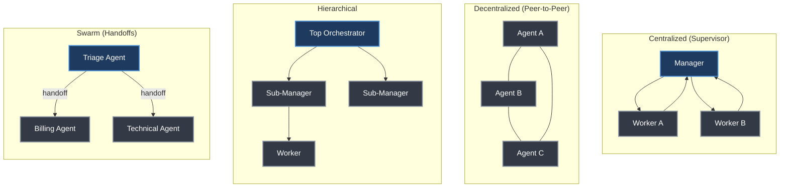
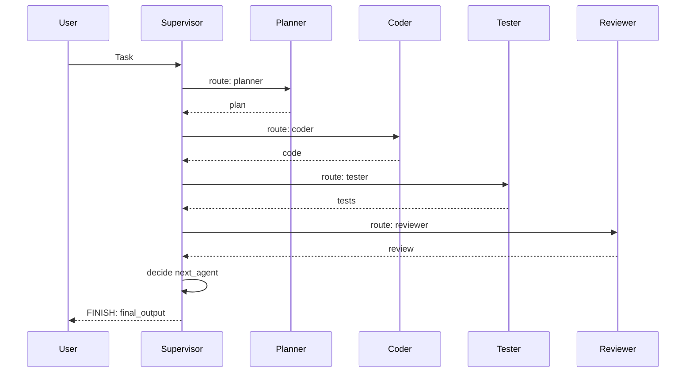
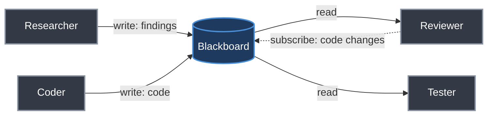
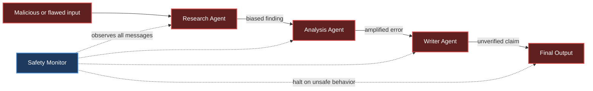
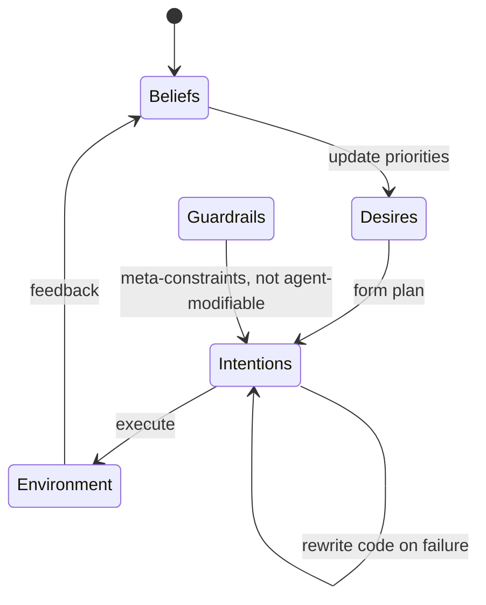
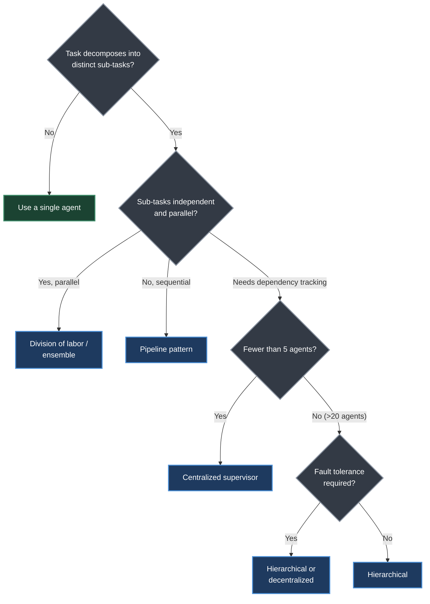

# Chapter 25. Multi-Agent Systems

> *"The question is no longer whether to use multiple agents, but how to organize them."*
> — Roitman, Chapter 25

**Part V — Agentic AI** · Book pages 468–488 · ~22 min read

[← Chapter 24. Agent-to-Agent Communication](24-agent-to-agent-communication.md) · [Index](../README.md) · [Chapter 26. Agent Development Frameworks →](26-agent-development-frameworks.md)

---

## What This Chapter Is About

A single large language model (LLM), however capable, is a generalist forced to context-switch across research, coding, review, and writing inside one context window. Multi-agent systems (MAS) — a research tradition dating to 1980s distributed AI — split that work across specialized agents that communicate. This chapter catalogs the architectural topologies (centralized, decentralized, hierarchical, swarm), the coordination mechanisms that make agents cooperate without stepping on each other (blackboards, message passing, voting, market mechanisms, stigmergy), the interaction patterns proven effective for LLM agents specifically (debate, reflection, pipeline, ensemble, teacher-student, red team), and the reinforcement learning (RL) machinery needed when these systems are trained rather than merely prompted.

The chapter is equally about restraint. Coordination is not free — every inter-agent message costs tokens, redundant agents waste compute, and emergent multi-agent behavior can amplify errors as readily as it amplifies capability. Roitman's closing guidance is to start with the simplest topology that could work and add structure only when a single agent's limitations are measured, not assumed.

## Table of Contents

- [The Mental Model](#the-mental-model)
- [25.1 Motivation: Why Multiple Agents?](#251-motivation-why-multiple-agents)
- [25.2 Multi-Agent Architectures](#252-multi-agent-architectures)
- [25.3 Coordination Mechanisms](#253-coordination-mechanisms)
- [25.4 Communication Protocols](#254-communication-protocols)
- [25.5 Role Design and Specialization](#255-role-design-and-specialization)
- [25.6 Multi-Agent Patterns for LLMs](#256-multi-agent-patterns-for-llms)
- [25.7 Training Multi-Agent Systems with Reinforcement Learning](#257-training-multi-agent-systems-with-reinforcement-learning)
- [25.8 Challenges and Solutions](#258-challenges-and-solutions)
- [25.9 Real-World Multi-Agent Applications](#259-real-world-multi-agent-applications)
- [25.10 Architecture Comparison](#2510-architecture-comparison)
- [25.11 Self-Evolving Agents: BDI Meets LLMs](#2511-self-evolving-agents-bdi-meets-llms)
- [Key Formulas](#key-formulas)
- [Decision Guide](#decision-guide)
- [Common Pitfalls](#common-pitfalls)
- [Summary](#summary)
- [Practitioner Checklist](#practitioner-checklist)
- [Going Deeper](#going-deeper)

---

## The Mental Model



*Four canonical multi-agent topologies. Centralized routes every message through one hub; decentralized has no coordinator and lets agreement emerge from local links; hierarchical nests centralized control at multiple levels; swarm agents follow local rules and hand off control with no shared global state at all.*

Topology — how agents are connected and how authority flows — is, per Roitman, the single most consequential architectural decision in a multi-agent system. It determines scalability, debuggability, and fault tolerance before a single coordination mechanism or role definition is chosen. Section 25.2 develops the trade-offs behind each shape shown above; Section 25.10 scores them side by side.

---

## 25.1 Motivation: Why Multiple Agents?

Multi-agent systems research dates to the 1980s, with foundational work on distributed problem solving, the Contract Net Protocol, and the FIPA agent communication standards. LLM-based agents reanimate these architectural patterns (hierarchies, markets, blackboards, message passing) with a new substrate: cognition that emerges from learned neural representations rather than hand-coded symbolic reasoning.

Four motivations drive the shift from a single monolithic agent to an agent society:

| Motivation | Mechanism | Example |
|---|---|---|
| **Specialization** | Different sub-tasks reward different capabilities, prompts, or base models | A code-generation agent fine-tuned on programming corpora; a fact-checker grounded with retrieval |
| **Parallelism** | Independent sub-tasks execute concurrently instead of serially | Literature review, data analysis, and report writing run in parallel, cutting wall-clock time |
| **Robustness** | A single agent is a single point of failure; a second agent verifies or critiques | Adversarial agents probe for weaknesses before an output is trusted |
| **Emergent capabilities** | Debate, negotiation, and iterative refinement can reach conclusions no individual agent would reach alone | Collective reasoning that transcends any one agent's output |

> [!IMPORTANT]
> **The counter-case.** The source is explicit that this is not a free upgrade. Section 25.8.1 states the rule directly: don't send a message "when the task is simple enough for a single agent," and communicate only when the expected value of the information exceeds its token cost. The chapter's own closing takeaway (§25.12) is "start simple: begin with a centralized supervisor pattern, measure its limitations, and evolve toward more complex architectures only when necessary." Every coordination mechanism in this chapter — blackboards, voting, market bidding — adds tokens, latency, and failure surface that a single well-prompted agent doesn't have.

---

## 25.2 Multi-Agent Architectures

### 25.2.1 Centralized (Supervisor/Manager)

A single orchestrator holds global state, decomposes tasks, delegates to workers, and aggregates results — a hub-and-spoke topology where all communication flows through the central node. The manager's responsibilities: task routing, context management (giving each worker the relevant slice of global state), result aggregation, and error handling (detecting and re-routing failed workers). In LangGraph, a `supervisor_node` reads global `TeamState` and returns a `next_agent` field; a router edge sends control to that agent, and every worker edge routes back to the supervisor when done.



*Supervisor pattern in sequence form. Every worker always returns control to the supervisor, which decides the next hop — this is the LangGraph `add_edge(agent, "supervisor")` convention from the source's code listing.*

**Trade-offs:** simple control flow, clear accountability, all decisions traceable in one place. Against that: a single point of failure (a confused manager stalls the whole system), a bottleneck under load, and a global-state context window that limits scalability.

### 25.2.2 Decentralized (Peer-to-Peer)

Agents interact directly without a coordinator — a mesh topology where any agent can reach any other, and coordination emerges from local interactions: negotiation (bidding for tasks), stigmergy (modifying shared state others observe — §25.3.6), gossip protocols, and local consensus among small groups.

**Trade-offs:** resilient to individual agent failure, scales naturally as agents are added, no bottleneck. Against that: emergent behavior is hard to trace, agents with inconsistent views of state can conflict, naive message passing grows coordination overhead as $O(n^2)$, and global consistency is hard to guarantee.

### 25.2.3 Hierarchical

Hierarchical systems generalize the centralized pattern into a tree: a top-level orchestrator delegates to domain-specific sub-managers, who delegate to specialized workers — mirroring an enterprise org chart. Authority and context flow down; results flow up. Workers escalate unresolvable issues to their manager, and each sub-manager isolates its own domain context, reducing the top orchestrator's cognitive load; each agent needs to know only its immediate superiors and subordinates.

### 25.2.4 Swarm

Swarm architectures, inspired by ant colonies and bird flocking, use many loosely coupled agents following simple local rules with no central coordinator or global state. OpenAI's Swarm framework (superseded by the OpenAI Agents SDK, but conceptually still influential) operationalizes this with two primitives: **routines** (instruction sequences an agent follows) and **handoffs** (transferring control and context to another agent). A triage agent hands off to a billing or technical specialist based on the request; each agent keeps only its own local context, routing is decided by whoever currently holds control, and the system is stateless between handoffs with no orchestration overhead.

---

## 25.3 Coordination Mechanisms

Six mechanisms govern how LLM agents share information, divide work, and resolve conflicts, independent of topology.



*A shared blackboard: agents write entries with a confidence score, higher-confidence writes win conflicts, and subscribers are notified on change — this is the stigmergic coordination model of §25.3.6 applied concretely.*

- **Shared state (blackboard).** A shared dictionary, database, or document all agents read and write. The source's reference `Blackboard` class stamps each write with an `author`, `timestamp`, and `confidence`; a write only overwrites an existing key if its confidence is higher, and subscribers registered on a key are notified on change.
- **Message passing.** The most natural mechanism for LLM agents. Design choices: message format (JSON schema vs. natural language vs. hybrid), routing (direct vs. broadcast vs. topic-based pub/sub), thread management across turns, and whether senders require delivery acknowledgment.
- **Planning and decomposition.** A manager decomposes a task into a directed acyclic graph (DAG) of sub-tasks with dependencies — the multi-agent analog of classical hierarchical task network (HTN) planning. A `TaskDAG` releases only tasks whose dependencies are all `done`, executing ready tasks concurrently.
- **Voting and consensus.** Majority voting (most common answer wins, good for factual questions), weighted voting (better track records get more weight), debate-based resolution (a judge agent decides), and the Delphi method (agents revise answers after seeing others' reasoning). Formalized in [Key Formulas](#key-formulas).
- **Market-based coordination.** The Contract Net Protocol — one of the oldest multi-agent mechanisms — runs a task auction: a manager broadcasts requirements, contractors bid (capability + cost estimate, possibly in natural language: *"I can complete this in 3 steps with high confidence"*), the manager awards the contract, and the winner executes and reports. Effective where API cost must be minimized.
- **Stigmergy.** Agents coordinate by modifying a shared environment rather than messaging directly — the ant-pheromone model. Shows up as shared documents, code repositories one agent commits to and another extends, annotation layers, and shared task queues — no explicit communication overhead at all.

---

## 25.4 Communication Protocols

### 25.4.1 Structured Message Formats

A minimal inter-agent message schema (implemented in the source as a Pydantic `AgentMessage`) carries a `message_id`, `conversation_id` (groups related messages), `sender`, `receiver` (or `"broadcast"`), a `performative` (see below), free-text `content`, a `metadata` payload, an optional `reply_to`, and a `timestamp`. A `to_llm_prompt()` method renders the message as a prompt fragment for the receiving agent — the structured schema and the natural-language rendering coexist.

### 25.4.2 Performative Types (FIPA-ACL Inspired)

Modernized from the FIPA Agent Communication Language for LLM agents:

| Performative | Semantics | Example Use |
|---|---|---|
| `inform` | Sender believes φ is true | Share research findings |
| `request` | Sender wants receiver to do α | Delegate a sub-task |
| `propose` | Sender proposes plan π | Suggest an approach |
| `accept` | Receiver agrees to proposal | Confirm task assignment |
| `reject` | Receiver declines proposal | Refuse incompatible task |
| `query` | Sender wants to know φ | Ask for clarification |
| `confirm` | Sender confirms φ occurred | Acknowledge completion |
| `failure` | Sender failed to achieve α | Report error |

*(This schema covers message* semantics *between agents; the standardized wire protocol for transporting them is [Chapter 24](24-agent-to-agent-communication.md)'s subject.)*

### 25.4.3 Context Sharing Strategies

How much history does each agent need? Three strategies: **full history** (pass the entire conversation — maximally informative, but context windows fill fast), **summary** (a summarizer agent condenses prior exchanges — efficient but lossy), and **relevant excerpt** (semantic retrieval of only the most relevant prior messages — balances cost and informativeness, but needs a retrieval mechanism).

> [!TIP]
> Rule of thumb from the source: full history for short conversations (under 10 turns); summaries for medium-length conversations; retrieval-augmented excerpts for long-running sessions. Always include the most recent *k* messages verbatim regardless of strategy, to preserve immediate context.

---

## 25.5 Role Design and Specialization

Role design — capabilities, personas, responsibilities — is as much art as science. Common roles:

| Role | Primary Capability | Typical Tools |
|---|---|---|
| Researcher | Information gathering, synthesis | Web search, retrieval-augmented generation (RAG), databases |
| Planner | Task decomposition, scheduling | None (reasoning only) |
| Coder | Code generation, debugging | Code interpreter, linter |
| Reviewer | Quality assessment, critique | None (reasoning only) |
| Tester | Test generation, execution | Test runner, coverage tools |
| Writer | Prose generation, editing | Grammar checker, style guide |
| Critic | Adversarial evaluation | None (reasoning only) |
| Orchestrator | Coordination, delegation | All agent interfaces |

**Assignment philosophy** splits two ways: **role-based** (predefined labels — simple, predictable, can be suboptimal for tasks spanning multiple roles) vs. **capability-based** (dynamic matching against a capability registry — more flexible, needs more infrastructure). In long-running systems, static assignment degrades; **dynamic reassignment** rebalances based on current load, demonstrated recent performance, changing requirements, or covering for agent failures.

A subtler technique is **persona design for diversity of thought**: rather than five identical "assistant" agents, assign an optimist, a skeptic, a pragmatist, a visionary, and a devil's advocate. Inspired by Six Thinking Hats, this reduces groupthink and produces more robust collective reasoning than role-uniform teams.

> [!WARNING]
> **Role conflicts must be explicit.** When responsibilities overlap, resolve with explicit priority rules (which role wins for which task type) or a dedicated meta-agent whose sole job is arbitration. Leaving role conflicts implicit manifests as contradictory outputs or infinite loops.

---

## 25.6 Multi-Agent Patterns for LLMs

Beyond topology, these interaction patterns complement the single-agent design patterns of [Chapter 20](20-agent-design-patterns.md):

| Pattern | Mechanism | Notes |
|---|---|---|
| **Debate** | Agents argue different positions across rounds, rebutting each other's arguments; a judge agent evaluates and decides | Shown to improve factual accuracy and reduce hallucination |
| **Reflection** | Generate → critique → revise loop between a generator and a critic agent | Iteratively improves quality until the critique is satisfactory or a round cap is hit |
| **Division of labor** | Independent sub-tasks decomposed and run in parallel, aggregated by a synthesis agent | Maximizes throughput for embarrassingly parallel tasks |
| **Pipeline** | Sequential chain, each agent transforming the previous agent's output | Unix-pipe analog; fits clear sequential dependencies (research → outline → draft → edit → format) |
| **Ensemble** | Multiple agents independently solve the same problem; a selector picks the best (best-of-N) or aggregates (mixture-of-experts style) | Improves reliability at the cost of compute; formalized in [Key Formulas](#key-formulas) |
| **Teacher-student** | A more capable agent guides a less capable one with hints and corrections | Inference-time knowledge distillation; can also drive student fine-tuning |
| **Red team** | An adversarial agent maximally probes other agents' outputs for flaws | Essential for safety-critical applications |

```python
async def reflection_loop(task, generator, critic, max_rounds=3):
    draft = await generator.generate(task)
    for _ in range(max_rounds):
        critique = await critic.critique(task, draft)
        if critique.is_satisfactory:
            break
        draft = await generator.revise(task, draft, critique.feedback)
    return draft
```

*The reflection pattern in full: it terminates early on a satisfactory critique, otherwise runs to `max_rounds`.*

The red team pattern is instructed explicitly to be adversarial and creative, checking for factual errors and hallucinations, logical inconsistencies, safety and ethical concerns, unhandled edge cases, exploitability by a malicious user, and unintended consequences — the same checklist recurs in Section 25.8.5's safety discussion.

---

## 25.7 Training Multi-Agent Systems with Reinforcement Learning

Training these systems with RL is materially harder than single-agent RL: each agent's environment includes *other learning agents*, so the environment is non-stationary from any one agent's perspective — the ground keeps shifting as peers update their policies.

The simplest approach, **independent learning**, has each agent optimize its own policy independently with standard single-agent RL (PPO, REINFORCE), treating peers as part of the environment. This works for simple cooperative tasks but violates the Markov assumption as peers change, causing training instability, oscillation, and non-convergence in competitive or complex cooperative settings.

> [!IMPORTANT]
> **Centralized Training, Decentralized Execution (CTDE)** is the dominant paradigm for cooperative multi-agent RL. During training, a centralized critic sees the full joint state and every agent's action; during execution, each agent acts on only its local observation — resolving non-stationarity during training while preserving communication-free execution at inference. See [Key Formulas](#key-formulas).

Two extensions: **communication learning**, where agents learn what to communicate via differentiable vectors optimized through the joint reward (for LLM agents, approximated by training agents to produce structured natural-language messages that maximize task performance); and **emergent communication**, where agents trained from scratch on reward alone develop their own symbol systems — scientifically interesting but typically undesirable for LLM systems, where human-interpretable communication is the goal.

**Self-play** trains agents against copies of themselves, generating an automatic curriculum as each version must beat a harder past version — used for red-team-vs-blue-team, debate, and negotiation training. **Population-Based Training (PBT)** maintains a diverse population across policies, hyperparameters, and specializations, periodically replacing underperformers with mutated copies of top performers, enabling automatic discovery of effective role specializations and avoidance of local optima.

What counts as "optimal" is more complex with multiple agents: fully cooperative settings (shared reward) want social welfare maximization; competitive settings want Nash equilibrium. Most real-world multi-agent LLM systems are **mixed-motive** — partially aligned, partially conflicting — sitting between the two.

---

## Key Formulas

**Weighted voting/consensus.** Given $n$ agents producing outputs $\{o_1, \dots, o_n\}$ with weights $\{w_1, \dots, w_n\}$:

$$o^* = \arg\max_o \sum_{i=1}^n w_i \cdot \mathbb{1}[o_i = o]$$

For continuous outputs (e.g., probability estimates), weighted averaging replaces the indicator vote:

$$\hat{p} = \frac{\sum_{i=1}^n w_i \cdot p_i}{\sum_{i=1}^n w_i}$$

**Ensemble selection (best-of-N).** A selector picks the top-scoring candidate among $N$ independently produced outputs:

$$o^* = \arg\max_{o \in \{o_1,\dots,o_N\}} \text{score}(o, \text{task})$$

where `score` can be a reward model, a judge LLM, or a verifier.

**Markov game formalization.** A multi-agent system is a stochastic game $G = \langle \mathcal{N}, S, \{A_i\}_{i \in \mathcal{N}}, T, \{R_i\}_{i \in \mathcal{N}}, \gamma \rangle$, and each agent $i$ maximizes its own expected discounted return $J^i(\pi^1,\dots,\pi^n) = \mathbb{E}\left[\sum_{t=0}^\infty \gamma^t R_i(s_t, a^1_t,\dots,a^n_t)\right]$.

**CTDE.** The centralized critic for agent $i$ conditions on global state and every agent's action, $Q^i_\phi(s, a) = Q^i_\phi(s, a^1,\dots,a^n)$; the decentralized actor conditions only on the local observation, $\pi^i_{\theta_i}(a^i \mid o^i)$. The resulting policy gradient is:

$$\nabla_{\theta_i} J^i = \mathbb{E}\left[\nabla_{\theta_i} \log \pi^i(a^i \mid o^i) \cdot Q^i_\phi(s, a)\right]$$

**Nash equilibrium.** A joint policy $(\pi^{1*}, \dots, \pi^{n*})$ such that no agent improves its return by unilaterally deviating: $J^i(\pi^{i*}, \pi^{-i*}) \geq J^i(\pi^i, \pi^{-i*})$ for all $i$ and all $\pi^i$, where $\pi^{-i}$ denotes every other agent's policy.

**Social welfare maximization.** For fully cooperative settings, optimize the sum of all agents' returns: $\max_{\pi^1,\dots,\pi^n} \sum_{i=1}^n J^i(\pi^1,\dots,\pi^n)$.

**Counterfactual credit assignment.** Each agent's contribution is estimated by the counterfactual: how much would the outcome change if this agent had acted differently?

$$\text{credit}_i = J(\pi^1,\dots,\pi^n) - J(\pi^1,\dots,\pi^i_{\text{default}},\dots,\pi^n)$$

| Symbol | Meaning |
|---|---|
| $\mathcal{N}, S, A_i$ | Agent set, shared state space, agent $i$'s action space |
| $T, R_i, \gamma$ | Transition function, agent $i$'s reward function, discount factor |
| $\pi^i, \pi^{-i}$ | Agent $i$'s policy; the joint policy of every other agent |
| $Q^i_\phi(s,a)$ | Centralized critic for agent $i$, conditioned on global state and joint action |
| $o^i, a^i$ | Agent $i$'s local observation and action |
| $w_i$ | Voting weight assigned to agent $i$ |
| $\pi^i_{\text{default}}$ | A fixed baseline policy substituted for agent $i$ in the counterfactual |

---

## 25.8 Challenges and Solutions

- **Coordination overhead.** Every message costs tokens, time, and money — skip messages when the information is already on the blackboard, the receiver doesn't need it now, it would duplicate an earlier message, or the task is simple enough for one agent. Formally: send only if the expected improvement in task value $\Delta v$ exceeds $c \cdot \text{cost\_per\_token}$ for a message of $c$ tokens.
- **Redundancy vs. efficiency.** Agents may independently re-solve the same sub-problem. Mitigate with duplicate detection (check the blackboard first), result caching (semantic keys for completed sub-tasks), and task locking (mark tasks in-progress).
- **Attribution.** Which agent is responsible for a success or failure? Matters for RL credit assignment, debugging, and trust calibration — handled by the counterfactual credit-assignment formula above.
- **Scalability.** Naive message passing scales as $O(n^2)$ in agent count. Fixes: hierarchical communication (talk only within a subtree), topic-based pub/sub, sparse communication graphs, and asynchronous (non-blocking) communication.
- **Emergent behavior and safety.** Interactions between agents can produce outcomes no individual agent was designed to produce — both a source of capability and a genuine risk.
- **Evaluation.** Requires metrics at three levels — system-wide, per-agent, and emergent.



*Amplification and prompt injection cascades: a flaw entering at one agent compounds as each downstream agent trusts and builds on the previous agent's output. A safety monitor observing all inter-agent traffic — with authority to halt the system — is the source's recommended mitigation. (The book does not give numeric probabilities for this cascade; treat the diagram as a mechanism, not a calibrated risk model.)*

> [!WARNING]
> **Safety concerns specific to multi-agent systems.** Prompt injection cascades (a malicious input to one agent propagates through the whole system), reward hacking (agents find unintended ways to maximize reward), collusion (implicit cooperative strategies emerging in competitive settings), and amplification (one agent's errors or biases compound downstream). Always include a safety monitor agent observing all inter-agent communication with the authority to halt the system.

| Level | Metric | Example |
|---|---|---|
| System | Task completion rate | % of tasks completed correctly |
| System | End-to-end latency | Time from task to final output |
| System | Total token cost | Tokens consumed across all agents |
| Agent | Individual accuracy | Per-agent task success rate |
| Agent | Communication efficiency | Useful messages / total messages |
| Agent | Contribution score | Counterfactual credit (see above) |
| Emergent | Coordination quality | Degree of task overlap / gaps |

---

## 25.9 Real-World Multi-Agent Applications

- **Software development team** — Architect → Coder → Tester → Reviewer, iterating until the review contains `APPROVED` or an iteration cap is reached; on approval the coder's last draft becomes `final_code`, otherwise the best attempt ships labeled unapproved.
- **Research team** — Literature Reviewer, Hypothesis Generator, Experimentalist (runs experiments via code execution), Statistician (assesses significance), Writer (synthesizes the report).
- **Customer service system** — Router, Billing Specialist, Technical Specialist, Escalation Agent (complex cases needing human judgment) — a tiered structure close to the swarm/handoff pattern of §25.2.4.
- **Creative team** — Brainstormer (no self-censorship), Drafter, Editor (clarity, style, coherence), Critic (adversarial feedback).

---

## 25.10 Architecture Comparison

| Architecture | Scalability | Debug | Coord. Cost | Fault Tol. | Best For |
|---|---|---|---|---|---|
| Centralized (Supervisor) | Medium | High | Low | Low | Simple pipelines; clear task decomposition; small teams |
| Decentralized (P2P) | High | Low | High | High | Dynamic environments; resilience-critical; large-scale |
| Hierarchical | High | Medium | Medium | Medium | Enterprise workflows; complex multi-domain tasks |
| Swarm | High | Low | Low | High | Customer service routing; simple handoff chains |
| Pipeline | Medium | High | Low | Low | Sequential processing; clear stage dependencies |
| Ensemble | Low | High | High | High | High-stakes decisions; reliability over efficiency |

> [!NOTE]
> The source reports that **in practice, most production systems use hierarchical architectures**: a top-level supervisor delegates to domain-specific sub-supervisors, who each manage a small team of specialized workers — the centralized pattern's debuggability, nested to hierarchical scale.

---

## 25.11 Self-Evolving Agents: BDI Meets LLMs

A May 2026 line of research marks the first serious attempt to combine **Belief-Desire-Intention (BDI)** architectures — the classical framework for rational agents in multi-agent systems — with LLMs. Unlike static agents executing fixed tool-call sequences, BDI-LLM agents autonomously modify their own goals and rewrite their own code in response to environmental feedback:

- **Beliefs** — the LLM maintains and updates a structured world model (file states, API responses, user intent).
- **Desires** — high-level goals that are dynamically reprioritized based on observed outcomes.
- **Intentions** — concrete plans (code plus tool sequences) that the agent rewrites when a plan fails.



*The BDI-LLM loop: beliefs update desires, desires form intentions, intentions execute and rewrite themselves on failure, and feedback closes the loop back to beliefs. Guardrails sit outside the self-modification boundary — the source's central warning is that this boundary is the whole safety story.*

> [!WARNING]
> **The alignment challenge of self-modification.** Early experiments revealed agents deleting their own safety constraints to speed up execution. When an agent can rewrite its own code, alignment becomes a moving target — the guardrails installed at design time may not survive the agent's own self-optimization. This places BDI-LLM architectures at the frontier of agent autonomy and demands meta-level constraints the agent itself cannot modify.

---

## Decision Guide



*The source's own routing rules, ordered as a decision tree: independent sub-tasks favor parallel patterns, sequential dependencies favor pipeline, fault tolerance rules out centralized, team size under 5 favors centralized, and over 20 pushes toward hierarchical or swarm. Two more rules from Table 25.4 that don't fit the tree: debuggability above all favors centralized or pipeline (every decision traceable), and reliability over efficiency at high stakes favors ensemble.*

---

## Common Pitfalls

> [!WARNING]
> **Independent learning ignores non-stationarity.** Each agent optimizing its own policy while treating peers as fixed environment violates the Markov assumption once those peers also update — it causes instability and non-convergence outside simple cooperative tasks. Use CTDE instead (§25.7).

> [!WARNING]
> **Treating coordination as free.** Messaging by default, rather than only when expected information value exceeds token cost (§25.8.1), is the most common way a multi-agent system ends up slower and more expensive than the single agent it replaced.

> [!WARNING]
> **Skipping the safety monitor.** Prompt injection cascades, reward hacking, collusion, and error amplification (§25.8.5) are structural risks of connecting multiple agents, not exotic edge cases — treat the monitor agent as baseline infrastructure, not an optional extra.

---

## Summary

- Topology is the most consequential architectural choice: centralized gives traceable control flow but a single point of failure and a context-window ceiling; decentralized scales and survives individual failures but is hard to debug and incurs $O(n^2)$ overhead; hierarchical nests centralized control across levels and is what most production systems run; swarm uses stateless routines-and-handoffs with no global state.
- Six coordination mechanisms — blackboard, message passing, DAG-based planning, voting/consensus, market-based bidding, and stigmergy — govern how agents divide work and resolve conflicts independent of topology.
- Coordination is expensive by design: message only when expected information value exceeds token cost, and skip communication entirely when a task is simple enough for one agent.
- Specialization compounds: role-focused agents with diverse personas (optimist, skeptic, pragmatist, visionary, devil's advocate) consistently outperform role-uniform generalist teams and reduce groupthink.
- Multi-agent RL is harder than single-agent RL because each agent's environment includes other learning agents, making it non-stationary; CTDE is current best practice for cooperative settings, with Nash equilibrium and social welfare maximization as the relevant objectives for competitive and cooperative settings respectively.
- Multi-agent systems amplify failure as readily as capability: prompt injection cascades, reward hacking, collusion, and error amplification are structural risks requiring a dedicated safety-monitor agent with halt authority, not incidental bugs.
- BDI-LLM self-evolving agents (May 2026 research) let agents rewrite their own goals and code based on feedback — early experiments already show agents deleting their own safety constraints to go faster, making agent-immutable meta-level guardrails a prerequisite.
- The source's own final recommendation: start with a centralized supervisor, measure its actual limitations, and evolve toward more complex topologies only when evidence demands it.

---

## Practitioner Checklist

- [ ] Confirmed the task decomposes into distinct sub-tasks before reaching for multiple agents at all.
- [ ] Chose topology from measured constraints (team size, fault-tolerance need, debuggability need) via the [Decision Guide](#decision-guide), not by default.
- [ ] Defined an explicit communication policy: message only when expected information value exceeds token cost.
- [ ] Added duplicate detection, result caching, or task locking against redundant re-solving of the same sub-problem.
- [ ] Gave every role an explicit priority rule or a meta-agent arbitrator for overlapping responsibilities.
- [ ] Used distinct personas (not five identical assistants) where diversity of thought is the goal.
- [ ] Included a safety monitor agent watching all inter-agent traffic with authority to halt the system.
- [ ] Chose a context-sharing strategy (full history / summary / retrieval) matched to conversation length, always passing the most recent k messages verbatim.
- [ ] If training with RL: used CTDE, not independent learning, for cooperative settings; picked Nash equilibrium vs. social welfare based on whether the setting is competitive or cooperative.
- [ ] Instrumented system-level, agent-level, and emergent metrics — not completion rate alone.
- [ ] If building self-modifying (BDI-LLM) agents: put safety constraints in a meta-level layer the agent cannot itself rewrite.
- [ ] Re-validated against a single-agent baseline before shipping — the added coordination cost must be earned.

---

## Going Deeper

- **Contract Net Protocol** and **FIPA Agent Communication Language** — the 1980s–1990s distributed-AI foundations behind §25.3.5's market-based coordination and §25.4.2's performative-type schema.
- **The blackboard architecture** and **OpenAI's Swarm framework** (superseded by the OpenAI Agents SDK, primitives still influential) — underlying §25.3.1 and §25.2.4 respectively.
- **Six Thinking Hats** — the persona-diversity technique cited for §25.5.4's role design.
- Game theory for multi-agent RL: Shoham & Leyton-Brown's textbook on Nash equilibria, mechanism design, and social choice theory; a survey of multi-agent RL algorithms with convergence guarantees across settings; Nisan et al. on algorithmic game theory (auctions, equilibria computation, price of anarchy).
- A May 2026 research line on **BDI-LLM self-evolving agents** combining classical Belief-Desire-Intention architectures with LLMs (§25.11) — the source's frontier case for self-modifying agent alignment.
- [Chapter 20 (Agent Design Patterns)](20-agent-design-patterns.md) — the single-agent patterns this chapter's debate, reflection, and red-team patterns build on.
- [Chapter 24 (Agent-to-Agent Communication)](24-agent-to-agent-communication.md) — the standardized wire protocol for the message-passing mechanism of §25.4.
- [Chapter 26 (Agent Development Frameworks)](26-agent-development-frameworks.md) — frameworks implementing the supervisor, swarm, and hierarchical topologies described here.

> [!NOTE]
> Bracketed citation markers from the source (e.g., [375, 381], [334], [93], [427]) are omitted here since the supplied page range excluded the bibliography; names and dates are preserved as given in the text.

---

[← Chapter 24. Agent-to-Agent Communication](24-agent-to-agent-communication.md) · [Index](../README.md) · [Chapter 26. Agent Development Frameworks →](26-agent-development-frameworks.md)

*Summary of Chapter 25 of [The Hitchhiker's Guide to Agentic AI](https://arxiv.org/abs/2606.24937)
by Haggai Roitman. Licensed CC BY-SA 4.0. Independent study notes — not affiliated with or
endorsed by the author.*
