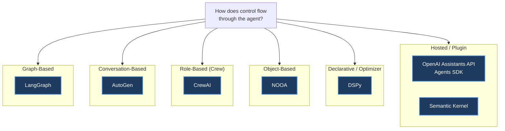
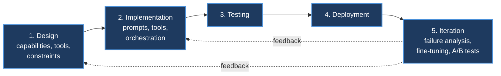
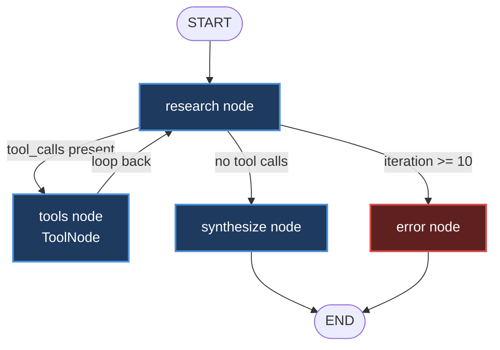
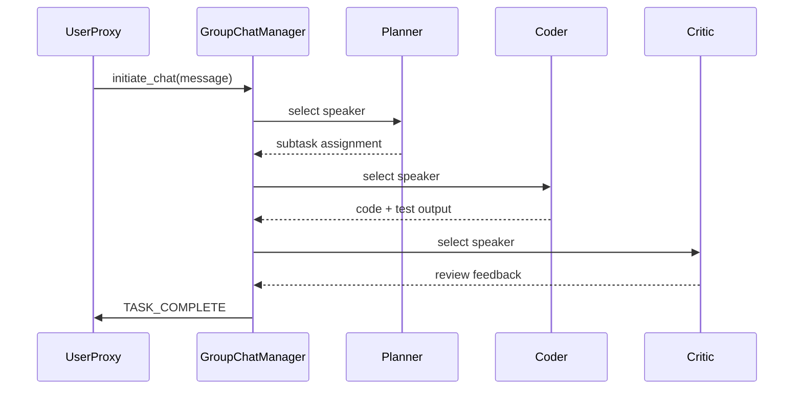
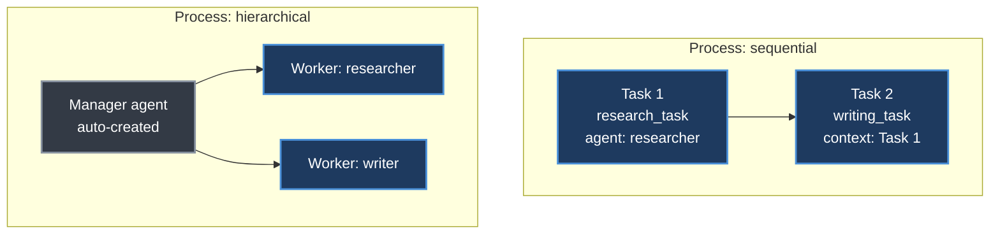
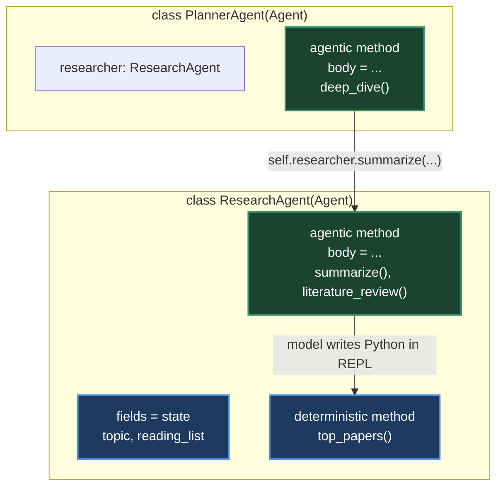
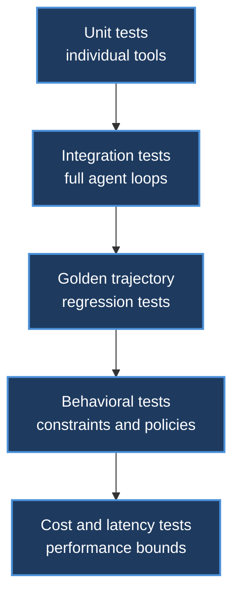
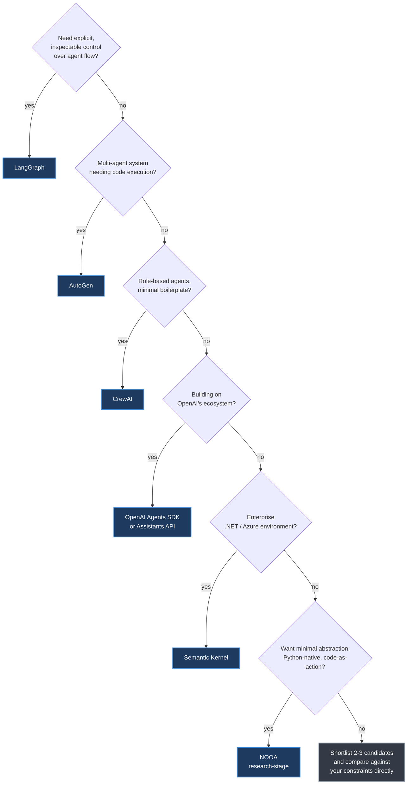

# Chapter 26. Agent Development Frameworks

> *"Building a capable agent in a Jupyter notebook is straightforward. Building one that runs reliably in production... requires a fundamentally different engineering discipline."*
> — Roitman, Chapter 26

**Part V — Agentic AI** · Book pages 489–521 · ~30 min read

[← Chapter 25. Multi-Agent Systems](25-multi-agent-systems.md) · [Index](../README.md) · [Chapter 27. Agentic UI Frameworks →](27-agentic-ui-frameworks.md)

---

## What This Chapter Is About

Once an agent design leaves the notebook, the question stops being "can the model do the task" and becomes "which piece of software will run the loop, hold the state, and fail predictably when something breaks." This chapter is a buyer's guide to that piece of software. It surveys seven major agent development frameworks — LangGraph, AutoGen, CrewAI, OpenAI's Assistants API and Agents SDK, DSPy, Semantic Kernel, and NVIDIA's NOOA — each of which encodes a different bet about how agent control flow should be expressed: as a graph, a conversation, a crew of roles, a hosted state machine, a compiled program, a plugin system, or a plain Python object.

Framework choice is not cosmetic. A graph-based framework makes every transition inspectable and pausable at the cost of upfront schema design; a conversation-based framework makes multi-agent collaboration natural at the cost of less deterministic control; an object-based framework collapses the abstraction to "if you know Python, you know the framework" at the cost of production hardening. The chapter also covers the engineering discipline that surrounds framework choice — the development lifecycle, the open-source tooling ecosystem, testing strategy, observability, and deployment patterns — because the framework is only one input into whether an agent survives contact with production traffic.

The organizing idea is comparison, not consensus: Roitman's own guidance (Section 26.8) is a short decision tree matched to concrete requirements, reproduced here so you can go from "what do I need" to "which framework" directly.

## Table of Contents

- [The Mental Model](#the-mental-model)
- [Why Agent Engineering Is Hard](#why-agent-engineering-is-hard)
- [The Framework Landscape at a Glance](#the-framework-landscape-at-a-glance)
- [Major Frameworks](#major-frameworks)
  - [LangGraph](#langgraph)
  - [AutoGen](#autogen-microsoft)
  - [CrewAI](#crewai)
  - [OpenAI Assistants API and Agents SDK](#openai-assistants-api-and-agents-sdk)
  - [DSPy](#dspy)
  - [Semantic Kernel](#semantic-kernel-microsoft)
  - [NOOA](#nvidia-oo-agents-nooa)
- [Open-Source Tooling and Interoperability Standards](#open-source-tooling-and-interoperability-standards)
- [Testing, Observability, and Deployment](#testing-observability-and-deployment)
- [Decision Guide](#decision-guide)
- [Common Pitfalls](#common-pitfalls)
- [Summary](#summary)
- [Practitioner Checklist](#practitioner-checklist)
- [Going Deeper](#going-deeper)

---

## The Mental Model



*Every major agent framework answers the same question — where does control flow live — differently. The answer determines what is easy, what is hard, and what "state" even means in that framework.*

Six control models cover the field. LangGraph makes flow explicit as a directed graph you draw yourself. AutoGen makes it emergent from a conversation between agents. CrewAI makes it implicit in organizational roles (sequential task order or a delegating manager). OpenAI's Assistants API and Semantic Kernel host or plan the flow for you through a server-side state machine or a planner over registered plugins. DSPy removes orchestration entirely and instead compiles a declarative program's prompts. NOOA collapses the framework into the Python object model itself — an agent is a class, its capabilities are methods, and the "loop" is whatever body a method's `...` placeholder expands into at runtime.

---

## Why Agent Engineering Is Hard

Roitman frames the entire chapter around what he calls the engineering gap: a prototype assumes a cooperative environment — well-formed inputs, available tools, responsive APIs, a patient human ready to restart on failure. Production agents get none of that. The gap shows up along five dimensions:

- **Reliability** — tool failures, partial state corruption, and infinite loops must be handled systematically, not ad hoc.
- **Observability** — a wrong answer requires structured logs of every LLM call, tool invocation, and state transition, not just the final output.
- **Testability** — non-deterministic, context-dependent behavior defeats traditional unit testing and demands golden-trajectory comparisons and behavioral suites.
- **Deployment** — agents are stateful, long-running processes needing async execution, checkpointing, resumption, and multi-tenant isolation.
- **Iteration** — production agents degrade as the world changes; improvement requires failure analysis, prompt versioning, and fine-tuning pipelines.

Roitman defines a five-stage **agent development maturity model** — Prototype (single-file script, hardcoded prompts, manual testing), Alpha (modular code, basic error handling, manual evaluation), Beta (framework-based, automated tests, staging environment), Production (full observability, CI/CD, auto-scaling, SLAs), and Mature (continuous learning, A/B testing, self-improvement loops) — and notes that most teams underestimate the jump between Alpha and Beta.

That jump maps onto a five-phase lifecycle with feedback loops running back from later phases to earlier ones.



*The agent development lifecycle. Iteration closes the loop back into design and implementation rather than terminating the process.*

Design establishes a capability matrix (tasks handled, edge cases rejected, out-of-scope behaviors) before any code is written, and warns against over-tooling — too many tools cause tool-selection confusion and added latency. Implementation interleaves prompt engineering (a versioned, tested living document), tool integration (typed interfaces, idempotency where possible), and orchestration — where framework choice, the subject of the next section, most directly matters. Testing and Deployment get their own sections below. Iteration requires failure logging with full context, failure categorization by type, regression-tested prompt updates, fine-tuning once prompt engineering plateaus, and statistically rigorous A/B testing of new versions.

---

## The Framework Landscape at a Glance

The table below is the master comparison. "Streaming" is left as *not detailed in source* for every row — the chapter's framework deep-dives do not differentiate frameworks on streaming support, so no per-framework claim is made here.

| Framework | Core Abstraction | Control Model | State Handling | Multi-Agent Support | Streaming | Maturity / Backing | Best Fit |
|---|---|---|---|---|---|---|---|
| **LangGraph** | Directed graph of nodes and edges | Graph | Typed state schema (`TypedDict`/Pydantic) + checkpointer (SQLite/Postgres) enabling pause, resume, time-travel | Via composable, nested subgraphs | Not detailed in source | Developed by LangChain Inc.; production-oriented | Explicit, inspectable control over agent flow |
| **AutoGen** | `ConversableAgent` + `GroupChat` | Conversation | Message history inside the group chat; no built-in checkpointer described | Native — `GroupChatManager` orchestrates turn-taking (round-robin, LLM-selected, or custom) | Not detailed in source | Microsoft Research project | Multi-agent systems needing sandboxed code execution |
| **CrewAI** | `Agent` (role/goal/backstory) + `Task` + `Crew` | Role-based (Crew) | Task outputs chained via `context=[...]` between tasks; no persistence layer described | Native — sequential order or hierarchical process with an auto-created manager agent | Not detailed in source | Independent open-source framework | Role-based agents with minimal boilerplate |
| **OpenAI Assistants API** | `Assistant` + `Thread` + `Run` | Hosted state machine | Server-side thread persists full conversation history | Not a primary focus (one assistant per run) | Not detailed in source | OpenAI-hosted infrastructure | Stateful agents without managing your own persistence |
| **OpenAI Agents SDK** (formerly Swarm) | `Agent` + `handoff` | Handoff chain | Context passed at each handoff; `RunConfig` controls tracing | Native — `handoff()` transfers control between specialized agents | Not detailed in source | OpenAI-maintained lightweight library | Building on OpenAI's ecosystem |
| **DSPy** | `Signature` + `Module` + optimizer | Declarative / optimizer | Compiled program serialized via `.save()`; no runtime agent state | Not a primary focus | Not detailed in source | Active open-source research framework | Automated prompt optimization with a clear metric and 50+ dev examples |
| **Semantic Kernel** | `Kernel` + plugins (native/prompt/OpenAPI) + planner | Plugin + planner | Pluggable memory backends (Azure Cognitive Search, Chroma, Pinecone, Weaviate) | Not a primary focus — composition happens via the planner over plugins | Not detailed in source | Microsoft enterprise product | Enterprise .NET/Azure environments needing compliance and audit |
| **NOOA** | Agent = Python class; methods = capabilities; body = `...` for LLM-driven ones | Object | Typed instance fields as state; pass-by-reference live objects | Native — agents hold references to sub-agents; nested spans traced automatically | Not detailed in source | Research software as of July 2026 (NVIDIA) | Minimal abstraction, type-safe I/O, code-as-action, testability via pytest |

---

## Major Frameworks

### LangGraph

LangGraph, from LangChain Inc., models agent execution as a directed graph: nodes are Python functions that receive state and return updates, and edges (unconditional or conditional) route between them. A built-in checkpointer persists graph state after every node execution, enabling resumption, human-in-the-loop approval gates, and "time travel" replay from any checkpoint.

```python
from langgraph.graph import StateGraph, START, END
from langgraph.checkpoint.sqlite import SqliteSaver

builder = StateGraph(AgentState)
builder.add_node("plan", plan_node)
builder.add_node("human_review", human_review_node)
builder.add_node("execute", execute_node)

builder.add_edge(START, "plan")
builder.add_edge("plan", "human_review")
builder.add_edge("human_review", "execute")
builder.add_edge("execute", END)

memory = SqliteSaver.from_conn_string("agent_state.db")
graph = builder.compile(checkpointer=memory, interrupt_before=["human_review"])

config = {"configurable": {"thread_id": "task-001"}}
result = graph.invoke({"messages": [HumanMessage("Analyze Q3 sales")]}, config)
graph.update_state(config, {"human_feedback": "Approved, proceed"})
result = graph.invoke(None, config)  # resume from checkpoint
```

The chapter's full worked example is a research agent whose graph loops between a `research` node (LLM decides what to search or signals completion), a `tools` node, and a `synthesize` node, with a `should_continue` router and a hard `iteration >= 10` cutoff to an `error` node:



*LangGraph's execution graph for the research agent. Conditional edges implement the tool-use loop and a hard iteration cutoff.*

**Good at:** explicit, debuggable control flow; checkpointed pause/resume and human review gates; composable subgraphs for larger systems. **Bad at:** requires upfront schema and graph design — more boilerplate than a role-based or conversational framework for simple tasks.

### AutoGen (Microsoft)

AutoGen takes the opposite approach: agents are `ConversableAgent`s that communicate through structured message passing, and multi-agent collaboration emerges from a shared `GroupChat` rather than a hand-drawn graph. Every agent carries a system message defining its role, a `human_input_mode` (`ALWAYS`, `NEVER`, `TERMINATE`), a code execution config, and a function map of tools. A `GroupChatManager` orchestrates turn-taking via round-robin, LLM-based speaker selection, or custom routing.

```python
import autogen

llm_config = {"config_list": config_list, "temperature": 0}

planner = autogen.AssistantAgent(name="Planner", system_message="...", llm_config=llm_config)
coder = autogen.AssistantAgent(
    name="Coder", system_message="...", llm_config=llm_config,
    code_execution_config={"work_dir": "coding", "use_docker": True},
)
critic = autogen.AssistantAgent(name="Critic", system_message="...", llm_config=llm_config)
user_proxy = autogen.UserProxyAgent(
    name="UserProxy", human_input_mode="TERMINATE", max_consecutive_auto_reply=10,
    is_termination_msg=lambda x: "TASK_COMPLETE" in x.get("content", ""),
)

groupchat = autogen.GroupChat(
    agents=[user_proxy, planner, coder, critic], messages=[],
    max_round=20, speaker_selection_method="auto",
)
manager = autogen.GroupChatManager(groupchat=groupchat, llm_config=llm_config)
user_proxy.initiate_chat(manager, message="Analyze sales_data.csv and report.")
```



*AutoGen's conversation-based control model. The GroupChatManager, not a graph, decides which agent speaks next.*

**Good at:** multi-agent collaboration with sandboxed code execution — the `UserProxyAgent` can iteratively write, run, and fix Python or shell code in a Docker container or local process. **Bad at:** looser control over exact flow than a graph; the chapter's own security note is unambiguous.

> [!WARNING]
> AutoGen code execution agents can run arbitrary code. Always use Docker isolation in production (`"use_docker": True`), restrict network access, and never run code execution agents with elevated privileges.

### CrewAI

CrewAI organizes multi-agent systems around professional roles rather than graphs or conversations, leaning on the LLM's own understanding of organizational structure. An `Agent` is defined by `role`, `goal`, `backstory`, and `tools`; a `Task` has a `description`, `expected_output`, and an assigned `agent`, optionally depending on another task's output via `context=[...]`; a `Crew` bundles agents and tasks under a `Process` — `sequential` (tasks run in order) or `hierarchical` (an auto-created manager agent delegates).

```python
from crewai import Agent, Task, Crew, Process

researcher = Agent(
    role="Senior Research Analyst",
    goal="Uncover cutting-edge developments in AI",
    backstory="...", tools=[search_tool, web_tool],
    allow_delegation=False,
)
writer = Agent(role="Tech Content Strategist", goal="...", backstory="...",
                tools=[web_tool], allow_delegation=True)

research_task = Task(description="Conduct research on {topic}.",
                      expected_output="A detailed research report...", agent=researcher)
writing_task = Task(description="Write a blog post about {topic}.",
                     expected_output="A polished blog post...",
                     agent=writer, context=[research_task])

crew = Crew(agents=[researcher, writer], tasks=[research_task, writing_task],
            process=Process.sequential, verbose=2)
result = crew.kickoff(inputs={"topic": "Reinforcement Learning for LLMs"})
```



*CrewAI's two process modes. Sequential runs tasks in a fixed order with explicit context handoffs; hierarchical delegates dynamically through a manager agent.*

**Good at:** minimal boilerplate for role-based teams; hierarchical mode handles complex, interdependent workflows without explicit task ordering. **Bad at:** the source describes no built-in checkpointer or persistence layer — state lives in task context chains, not a durable store.

### OpenAI Assistants API and Agents SDK

OpenAI provides two complementary offerings. The **Assistants API** manages agent state server-side through three objects — `Assistant` (model, instructions, tools), `Thread` (a persistent conversation), and `Run` (an execution with lifecycle states `queued → in_progress → requires_action → completed`) — and ships three hosted tools requiring no external infrastructure: Code Interpreter (sandboxed Python with file I/O), File Search (vector-store-backed retrieval), and Web Search (in select models).

```python
assistant = client.beta.assistants.create(
    name="Data Analysis Assistant", instructions="...",
    model="gpt-4o", tools=[{"type": "code_interpreter"}, {"type": "file_search"}],
)
thread = client.beta.threads.create()
client.beta.threads.messages.create(thread_id=thread.id, role="user",
                                     content="Analyze this sales data.")
run = client.beta.threads.runs.create_and_poll(thread_id=thread.id, assistant_id=assistant.id)
if run.status == "completed":
    messages = client.beta.threads.messages.list(thread_id=thread.id)
```

The **Agents SDK** (formerly Swarm) is a separate, lightweight library built around the `handoff` primitive: an agent transfers control to another agent, passing context along.

```python
from agents import Agent, Runner, RunConfig, handoff, InputGuardrail

billing_agent = Agent(name="BillingAgent", instructions="Handle billing inquiries.",
                       tools=[lookup_invoice, process_refund])
technical_agent = Agent(name="TechnicalAgent", instructions="Resolve technical issues.",
                         tools=[check_system_status, create_ticket])

triage_agent = Agent(
    name="TriageAgent", instructions="Classify requests and route to a specialist.",
    handoffs=[handoff(billing_agent, tool_name_override="transfer_to_billing"),
              handoff(technical_agent, tool_name_override="transfer_to_technical")],
    input_guardrails=[InputGuardrail(guardrail_function=safety_guardrail)],
)
result = await Runner.run(triage_agent, "I was charged twice last month.",
                           run_config=RunConfig(tracing_disabled=False))
```

**Good at:** the Assistants API removes persistence engineering entirely (threads are server-managed); the Agents SDK gives modular handoff-based routing with built-in input guardrails and tracing. **Bad at:** both are tied to OpenAI's hosted infrastructure and model ecosystem.

### DSPy

DSPy (Declarative Self-improving Python) rejects manual prompt engineering outright: you write a program's `Signature` (input/output contract) and compose `Module`s, then an **optimizer** searches for the prompts and few-shot examples that maximize a metric on a development set. This decouples *what* a module should do from *how* it does it, making programs more robust to model swaps.

```python
class GenerateAnswer(dspy.Signature):
    """Answer questions with factual, concise responses."""
    context: list[str] = dspy.InputField(desc="Relevant passages")
    question: str = dspy.InputField()
    answer: str = dspy.OutputField(desc="Concise factual answer")

class RAGAgent(dspy.Module):
    def __init__(self, num_passages=3):
        self.retrieve = dspy.Retrieve(k=num_passages)
        self.generate = dspy.ChainOfThought(GenerateAnswer)

    def forward(self, question: str) -> dspy.Prediction:
        context = self.retrieve(question).passages
        return self.generate(context=context, question=question)

from dspy.teleprompt import MIPROv2
optimizer = MIPROv2(metric=answer_metric, auto="medium")
compiled_agent = optimizer.compile(RAGAgent(), trainset=train_examples,
                                    num_candidates=30, max_bootstrapped_demos=4,
                                    max_labeled_demos=16)
compiled_agent.save("optimized_rag_agent.json")
```

DSPy also supports `dspy.Assert` for runtime self-assessment (e.g., checking an answer's faithfulness to retrieved context before returning it).

> [!TIP]
> The chapter's own guidance: DSPy excels when (1) you have a clear evaluation metric, (2) you have 50+ development examples, (3) you need to port an agent across different LLMs, or (4) manual prompt engineering has plateaued. It is less suitable for highly creative tasks where the "correct" output is subjective.

**Good at:** automated, metric-driven prompt optimization; portability across models. **Bad at:** not an orchestration framework in the LangGraph/AutoGen sense — no native multi-agent conversation or graph control described.

### Semantic Kernel (Microsoft)

Semantic Kernel (SK) is Microsoft's enterprise-focused framework for integrating existing business logic as AI-callable functions. A `Kernel` invokes **plugins** — collections of functions ("skills") that can be native code (`@kernel_function`-decorated Python/C# methods), prompt templates, or auto-generated OpenAPI plugins. A `FunctionCallingStepwisePlanner` decides which plugin functions to call and in what order to satisfy a request.

```python
kernel = sk.Kernel()
kernel.add_service(OpenAIChatCompletion(ai_model_id="gpt-4o"))

class EmailPlugin:
    @kernel_function(description="Send an email to a recipient")
    def send_email(self, recipient: str, subject: str, body: str) -> str:
        return f"Email sent to {recipient}: {subject}"

kernel.add_plugin(EmailPlugin(), plugin_name="Email")
kernel.add_plugin(CalendarPlugin(), plugin_name="Calendar")

from semantic_kernel.planners import FunctionCallingStepwisePlanner
planner = FunctionCallingStepwisePlanner(service_id="gpt-4o")
result = await planner.invoke(
    kernel, "Schedule a meeting with alice@company.com next Tuesday at 2pm, "
            "then send her a confirmation email."
)
```

SK's memory system supports multiple backends (Azure Cognitive Search, Chroma, Pinecone, Weaviate) through a unified interface, and its connector system integrates Microsoft 365, Azure DevOps, and custom REST APIs.

**Good at:** enterprise deployment — native C# support for .NET, Azure OpenAI integration with managed identity, compliance-friendly audit logging, and support for on-premises model deployments. **Bad at:** the source frames it around plugin orchestration and planning rather than native multi-agent conversation.

### NVIDIA OO Agents (NOOA)

NOOA is NVIDIA's model-agnostic framework built on the premise that **an agent is a Python object**. Where other frameworks add DSLs, graph definitions, or decorators, NOOA maps agent concepts directly onto native Python constructs: a class and its docstring are the agent's identity and instructions, typed instance fields are persistent state, methods are capabilities, method docstrings are prompts, and type annotations are I/O contracts. A method whose body is the literal `...` (Python's `Ellipsis`) becomes **agentic** — implemented at runtime by an LLM-driven loop. Methods with normal bodies stay deterministic Python, callable by both developer and model.

| Agent Concept | Python Construct |
|---|---|
| Agent identity and instructions | Class + class docstring |
| Persistent state | Instance fields (typed) |
| Capabilities / tools | Methods on `self` |
| Prompts | Method docstrings |
| I/O contracts | Type annotations |
| LLM-driven behavior | Body = `...` |
| Deterministic logic | Body = normal code |

```python
from nooa import Agent
from pydantic import BaseModel, Field

class PaperSummary(BaseModel):
    title: str
    key_findings: list[str]
    relevance_score: float = Field(ge=0, le=1)

class ResearchAgent(Agent, llm=llm):
    """You are a research assistant specializing in ML papers."""
    topic: str
    reading_list: list[PaperSummary] = []

    def top_papers(self, n: int = 5) -> list[PaperSummary]:
        """Return the highest-relevance papers seen so far."""
        return sorted(self.reading_list, key=lambda p: p.relevance_score, reverse=True)[:n]

    async def summarize(self, abstract: str) -> PaperSummary:
        """Read the abstract and produce a structured summary."""
        ...

    async def literature_review(self, abstracts: list[str]) -> str:
        """Summarize each abstract, add to reading_list, then synthesize a review."""
        ...
```

Three things happen at once here: `top_papers` is a regular, unit-testable method also available to the LLM as a callable tool; `summarize` returns a typed `PaperSummary` that the framework auto-validates against the Pydantic schema and retries on failure; and `literature_review` composes both agentic and deterministic logic in one control flow. When the model executes an agentic method, it does not emit JSON tool calls — it writes Python in a sandboxed, Jupyter-style REPL with access to `self` and its methods, so its action space is the full language rather than a fixed tool schema. Objects are passed by reference rather than serialized to JSON, so a method receiving an `Order` or `Database` object lets the model call methods on it and mutate its state directly.

Multi-agent composition falls out of Python's object model — one agent simply holds a reference to another:

```python
class PlannerAgent(Agent, llm=llm):
    """Decompose complex research tasks into sub-tasks."""
    researcher: ResearchAgent  # sub-agent, inherits llm from parent

    async def deep_dive(self, question: str) -> str:
        """Break the question into sub-questions, delegate to self.researcher,
        then synthesize a final answer."""
        ...
```



*NOOA's object-as-agent model. Fields hold state, `...` bodies mark agentic methods, and one agent composes another through a plain typed field — no message bus, no serialization boundary.*

The planner's `deep_dive` can call `self.researcher.summarize(...)` directly — no message bus, just a Python method call that triggers a nested LLM loop, with the parent-child span hierarchy traced automatically (the built-in `nooa start-dev` trace viewer needs no external observability infrastructure). NOOA supports any model reachable through its `UnifiedLLM` layer — Anthropic, OpenAI, local models via Ollama, or self-hosted endpoints via vLLM — as a constructor parameter, not an architectural decision.

> [!NOTE]
> The trade-off Roitman names explicitly: NOOA is **research software (as of July 2026)** without the production hardening, managed deployment, or ecosystem integrations of LangGraph or Semantic Kernel. It prioritizes programming-model clarity over operational maturity.

**Good at:** minimal abstraction overhead, type-safe I/O with automatic validation and retry, standard-pytest testability (mock the LLM, test deterministic methods normally), code-as-action instead of rigid tool schemas, and nested agent composition with no serialization boundary. **Bad at:** operational maturity — it is explicitly pre-production.

---

## Open-Source Tooling and Interoperability Standards

Beyond the full-stack frameworks above, an open-source ecosystem provides more transparent, composable building blocks around specific concerns — prioritizing composability over convenience.

| Category | Tools (as named in the source) |
|---|---|
| Prompt management | Promptflow (Microsoft, visual prompt engineering/eval), Guidance (Microsoft, constrained generation), LMQL (SQL-like prompting query language with constraints), Outlines (structured generation with regex/JSON-schema constraints) |
| Tool registries | Composio (250+ pre-built integrations with OAuth management), Toolhouse (hosted tool execution with sandboxing), E2B (code execution sandboxes) |
| Memory stores | Mem0 (adaptive memory layer with automatic summarization), Zep (long-term memory with temporal awareness), Letta — formerly MemGPT (agents with self-managed memory hierarchies) |
| Evaluation harnesses | RAGAS (RAG-specific metrics), DeepEval (unit testing for LLM outputs), Promptfoo (CLI prompt eval and red-teaming), AgentBench (standardized agent-capability benchmarks) |

**OpenClaw** is called out separately as a self-hosted gateway rather than a development framework — it emphasizes the *deployment* layer: multi-channel integration (Slack, Discord, WhatsApp, Teams), event-driven always-on execution, sandboxed tool running, and approval gates for high-impact actions. It separates low-level **tools** (shell commands, API calls) from higher-level **skills** that orchestrate tools with planning logic.

Three interoperability standards are converging the ecosystem: the **Model Context Protocol (MCP)** — Anthropic's open standard for tool and resource exposure, covered in [Chapter 22](22-model-context-protocol.md); the **Agent-to-Agent Protocol (A2A)** — Google's open standard for inter-agent communication and task delegation, covered in [Chapter 24](24-agent-to-agent-communication.md); and **OpenAPI as a tool interface layer**, where an existing REST API spec is parsed and auto-converted into callable tools with no hand-written wrapper: resolve `$ref`s, discover each operation, generate a function-calling schema (name from `operationId`, description from `summary`), then execute the HTTP request when the LLM emits a call and feed the response back into context. Google ADK, Semantic Kernel ("OpenAPI plugins"), LangChain's `OpenAPIToolkit`, and standalone libraries such as `openapi-llm` all support this pattern.

---

## Testing, Observability, and Deployment

### Testing Pyramid

Non-deterministic, stateful, multi-step agents defeat traditional unit testing, so the chapter lays out a multi-layered strategy.



*Agent testing pyramid. Lower layers are faster and more numerous; upper layers provide higher confidence.*

- **Unit tests** cover each tool in isolation — happy paths, error cases (empty query raises `ValueError`), and retry behavior (rate limit triggers a retry, `mock_api.call_count == 2`).
- **Integration tests** verify the full loop orchestrates tools correctly — e.g., asserting a `search_web` call happens before `write_report`, and that the agent recovers gracefully (`status in ("done", "partial")`) when a tool fails mid-run.
- **Golden trajectory regression tests** replay a fixed input at `temperature=0, seed=42` and assert the tool-call sequence exactly matches a recorded golden trajectory, that final-output semantic similarity (cosine similarity of sentence embeddings) stays above **0.85**, and that token usage does not regress by more than **20%** over the golden baseline.
- **Behavioral tests** check that the agent refuses harmful requests, respects a `max_tool_calls` bound, and stays within an `allowed_domains` allowlist.
- **Cost and latency tests** assert per-task-type bounds — the chapter's example table pairs a simple lookup with a $0.01 / 5-second budget, a research task with $0.10 / 60 seconds, and a complex analysis with $0.50 / 120 seconds.

### Observability: Three Pillars and a Failure Taxonomy

Production observability rests on **traces** (complete execution records of every LLM call, tool invocation, and state transition), **metrics** (aggregated cost, latency, success rate, tool usage), and **logs** (structured events for debugging and audit). Named tracing platforms include LangSmith (deep LangChain/LangGraph integration), Arize Phoenix (open-source, with hallucination detection and relevance scoring), Braintrust (evaluation-focused, A/B testing and prompt versioning), Weights & Biases Weave, and OpenTelemetry (a standard instrumentation protocol with growing LLM support).

Without a structured failure taxonomy, teams "waste cycles on ad-hoc debugging — treating symptoms rather than root causes," and a single user-visible failure often cascades across categories (a tool error triggers a reasoning error during recovery, which spirals into an infinite loop):

| Failure Type | Symptoms | Detection | Remediation |
|---|---|---|---|
| Tool Error | Exception in tool call, empty result | Error rate monitoring | Retry logic, fallback tools |
| Reasoning Error | Wrong tool selected, incorrect arguments | Trajectory analysis | Prompt improvement, few-shot examples |
| Hallucination | Fabricated facts, invented tool results | Fact-checking, grounding checks | RAG, citation requirements |
| Infinite Loop | Repeated tool calls, no progress | Loop detection, max iterations | Hard limits, loop-breaking prompts |
| Context Overflow | Truncated history, lost context | Token counting | Summarization, context management |
| Refusal | Agent declines a valid task | Output classification | Prompt adjustment, guardrail tuning |

When a production failure occurs, replay tooling (e.g., LangSmith's `read_run`/`list_runs`) lets an operator step through every child run in a trace, inspect the exact failing prompt, and re-run that single step against a stronger model to validate a fix before deploying it.

### Deployment: Async, Multi-Tenant, and Cost-Aware

Long-running agents should execute asynchronously rather than blocking an API connection. A distributed task queue (the chapter uses Celery, backed by Redis) handles retries, worker scaling, and result persistence: workers pull tasks off the queue and persist state (status, result, cost) independently in a Redis/Postgres store, while a separate web layer (Flask/FastAPI) submits tasks and polls status.

Multi-tenant production systems need **namespace isolation** (each tenant's state, memory, and tool configs in separate namespaces), **rate limiting** (per-tenant limits on LLM calls, tool invocations, compute time), **resource quotas** (max concurrent agents, token budgets, storage), and **audit logging** (all actions logged with tenant ID for compliance and billing).

Cost optimization strategies named in the chapter: **model routing** (cheap models for classification/extraction, large models reserved for complex reasoning), **prompt caching** (OpenAI and Anthropic both offer it, reducing costs by up to **90%** for high-traffic agents), **result caching** (identical tool inputs within a time window), **batching** independent LLM calls, and **early termination** once the agent has sufficient information. The chapter's example router maps task types to models with concrete per-token pricing:

| Model | Task Types | Input Price | Output Price |
|---|---|---|---|
| gpt-4o-mini | classification, extraction, summarization | $0.15 / 1M tokens | $0.60 / 1M tokens |
| gpt-4o | reasoning, code generation | $2.50 / 1M tokens | $10.00 / 1M tokens |
| o1 | complex analysis | $15.00 / 1M tokens | $60.00 / 1M tokens |

Auto-scaling for bursty agent workloads should scale on **queue depth** rather than CPU utilization, use **predictive scaling** from historical time-of-day/day-of-week patterns, allow **spot/preemptible instances** for long-running tasks (with checkpointing to survive preemption), and enforce **graceful shutdown** so workers finish in-flight tasks before scaling down.

---

## Decision Guide



*Framework selection, reconstructed from the chapter's own "Choosing the Right Framework" questions plus the per-framework "when to use" guidance for DSPy and NOOA.*

This is Roitman's own selection logic (Section 26.8): explicit control over agent flow → LangGraph; multi-agent system needing code execution → AutoGen; role-based agents with minimal boilerplate → CrewAI; building on OpenAI's ecosystem → Agents SDK; automated prompt optimization → DSPy; enterprise .NET/Azure environment → Semantic Kernel. DSPy sits orthogonally to the rest — it optimizes prompts within a program rather than orchestrating flow, so it can layer on top of whichever framework you pick, wherever you have a metric and 50+ development examples. NOOA fits specifically when Python-native minimalism and code-as-action outweigh the need for production hardening today.

---

## Common Pitfalls

> [!WARNING]
> Over-tooling an agent — giving it too many tools — causes tool-selection confusion and increased latency. Start from a capability matrix, not a tool catalog.

> [!WARNING]
> AutoGen's code-execution agents run arbitrary code. Always enable Docker isolation (`"use_docker": True`), restrict network access, and never grant elevated privileges.

> [!WARNING]
> A single visible failure can be a cascade across the six-category failure taxonomy above (a tool error triggering a reasoning error triggering an infinite loop). Categorize failures by root type before prescribing a fix — the remediation for a tool error (retry logic) does nothing for a hallucination (which needs grounding).

> [!WARNING]
> NOOA is explicitly research software as of the chapter's writing (July 2026) — choosing it trades away the production hardening, managed deployment, and ecosystem integrations that LangGraph and Semantic Kernel already have.

> [!WARNING]
> Golden-trajectory regression tests are only meaningful at fixed `temperature=0, seed=42`; without pinning both, tool-call sequence and token-count comparisons against a golden baseline are not reproducible.

---

## Summary

- Framework selection is not interchangeable: LangGraph optimizes for complex, controllable, checkpointed workflows; AutoGen for multi-agent collaboration with sandboxed code execution; CrewAI for role-based simplicity; and DSPy for automated prompt optimization rather than orchestration at all.
- NOOA (added since earlier editions) maps agent concepts directly onto Python's object model — fields as state, methods as tools, a body of `...` as an LLM-driven loop — trading production maturity for near-zero abstraction overhead and full pytest-based testability.
- Testing agents requires multiple layers because non-determinism defeats unit testing alone: unit tests on individual tools, integration tests on full loops, golden-trajectory regression tests (≥0.85 semantic similarity, ≤20% token regression), behavioral constraint tests, and cost/latency bound tests.
- A structured six-category failure taxonomy (tool error, reasoning error, hallucination, infinite loop, context overflow, refusal) is a prerequisite for systematic debugging — without it, teams treat symptoms rather than root causes.
- Production agents are long-running, stateful processes that belong on async, queue-based infrastructure (Celery/Redis in the chapter's example) with namespace isolation, per-tenant rate limits, and audit logging for multi-tenant serving.
- Cost management is not optional at scale: model routing, prompt caching (up to 90% cost reduction), result caching, batching, and early termination together can cut costs 50–90% without sacrificing quality.
- Interoperability standards — MCP for tool/resource exposure, A2A for inter-agent communication, and OpenAPI-as-tool-definition — are converging the ecosystem so tools and agents built for one framework can work with another.
- The agent development lifecycle (design, implementation, testing, deployment, iteration) is not linear — iteration feeds failure analysis and fine-tuning back into design and implementation, and most teams underestimate exactly this jump from ad hoc (Alpha) to framework-based, tested (Beta) maturity.

---

## Practitioner Checklist

- [ ] All tools have retry logic and error handling.
- [ ] Maximum iteration limits are enforced in the graph/loop, not just documented.
- [ ] Sensitive data is not logged in traces.
- [ ] Rate limiting is configured per tenant.
- [ ] Checkpointing is enabled for long-running tasks.
- [ ] Behavioral tests pass (no harmful outputs, domain allowlists respected).
- [ ] Cost and latency bounds are validated per task type before launch.
- [ ] Rollback procedure is documented and tested.
- [ ] On-call runbook covers each of the six failure-taxonomy categories.
- [ ] A capability matrix (in-scope tasks, rejected edge cases, out-of-scope behaviors) exists before tool selection.
- [ ] Golden-trajectory regression tests run at fixed temperature and seed before every prompt change ships.
- [ ] Auto-scaling is configured on queue depth, not CPU utilization, with graceful shutdown for in-flight tasks.

---

## Going Deeper

- **LangGraph** [154] — LangChain Inc.'s graph-based orchestration library; the chapter's Section 26.9 walks a complete production research agent built on it, from state schema through Postgres checkpointing to a FastAPI + Kubernetes deployment.
- **AutoGen** [385] — Microsoft Research's conversation-based multi-agent framework.
- **CrewAI** [261] — the role-based multi-agent framework.
- **OpenAI Agents SDK** [277] — formerly Swarm.
- **DSPy** [183] — Declarative Self-improving Python.
- **Semantic Kernel** [256] — Microsoft's enterprise plugin/planner framework.
- **NOOA** [102] — NVIDIA's object-oriented agent framework.
- **Model Context Protocol (MCP)** [9] — Anthropic's tool/resource exposure standard; see [Chapter 22](22-model-context-protocol.md).
- **Agent-to-Agent Protocol (A2A)** [113] — Google's inter-agent communication standard; see [Chapter 24](24-agent-to-agent-communication.md).
- **LMQL** [26] and **Outlines** [378] — constrained-generation prompt tooling named in the open-source tooling survey.
- **Letta** [281] (formerly MemGPT) — self-managed memory hierarchies; see also [Chapter 17 (Agentic Memory Systems)](17-agentic-memory-systems.md).
- [Chapter 25 (Multi-Agent Systems)](25-multi-agent-systems.md) — the coordination patterns (conversation, role delegation, handoffs) that AutoGen, CrewAI, and the Agents SDK each implement as a framework primitive.
- [Chapter 12 (LLM Agentic Training)](12-llm-agentic-training.md) — how the trajectories these frameworks produce feed back into fine-tuning during the Iteration phase.

> [!NOTE]
> Bracketed citation markers from the source (e.g., [154], [385], [261]) are omitted from the running text since the supplied page range excluded the bibliography; names and dates are preserved as given in the text.

---

[← Chapter 25. Multi-Agent Systems](25-multi-agent-systems.md) · [Index](../README.md) · [Chapter 27. Agentic UI Frameworks →](27-agentic-ui-frameworks.md)

*Summary of Chapter 26 of [The Hitchhiker's Guide to Agentic AI](https://arxiv.org/abs/2606.24937)
by Haggai Roitman. Licensed CC BY-SA 4.0. Independent study notes — not affiliated with or
endorsed by the author.*
