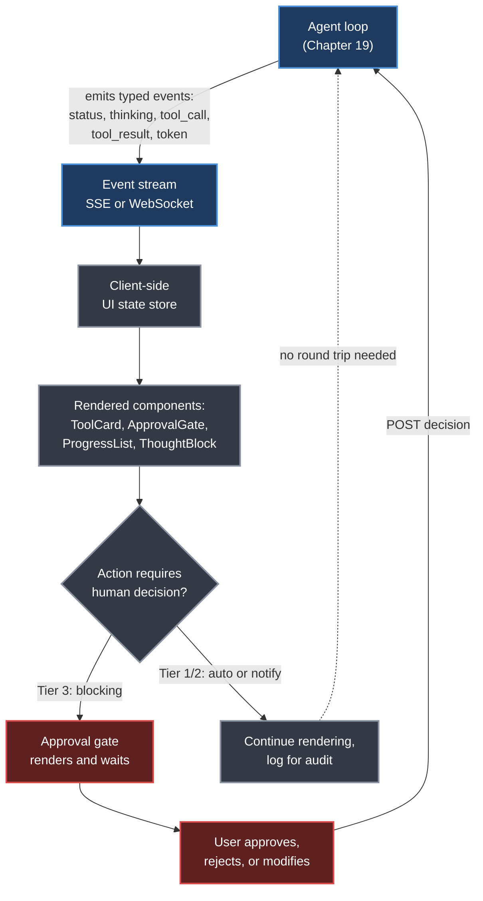
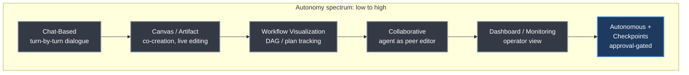
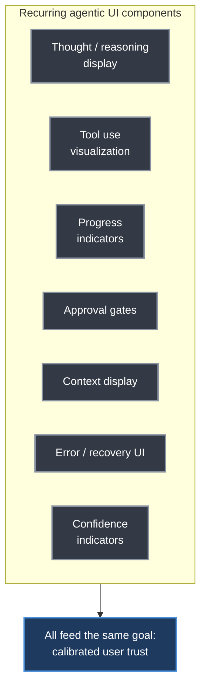
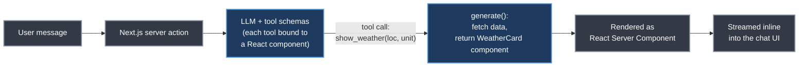
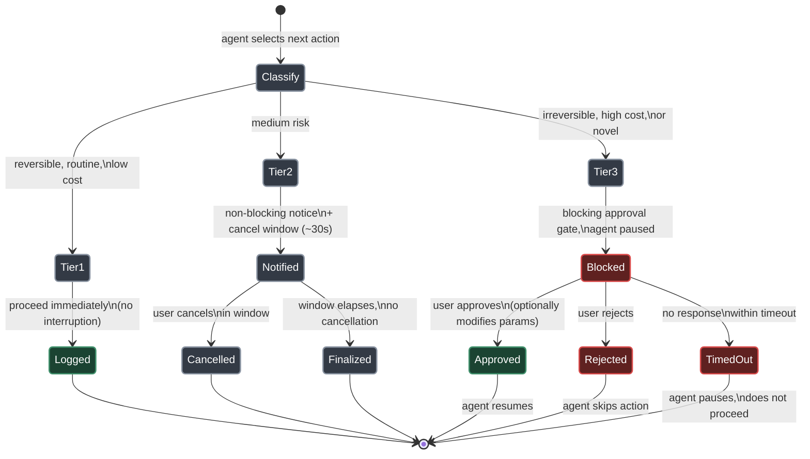
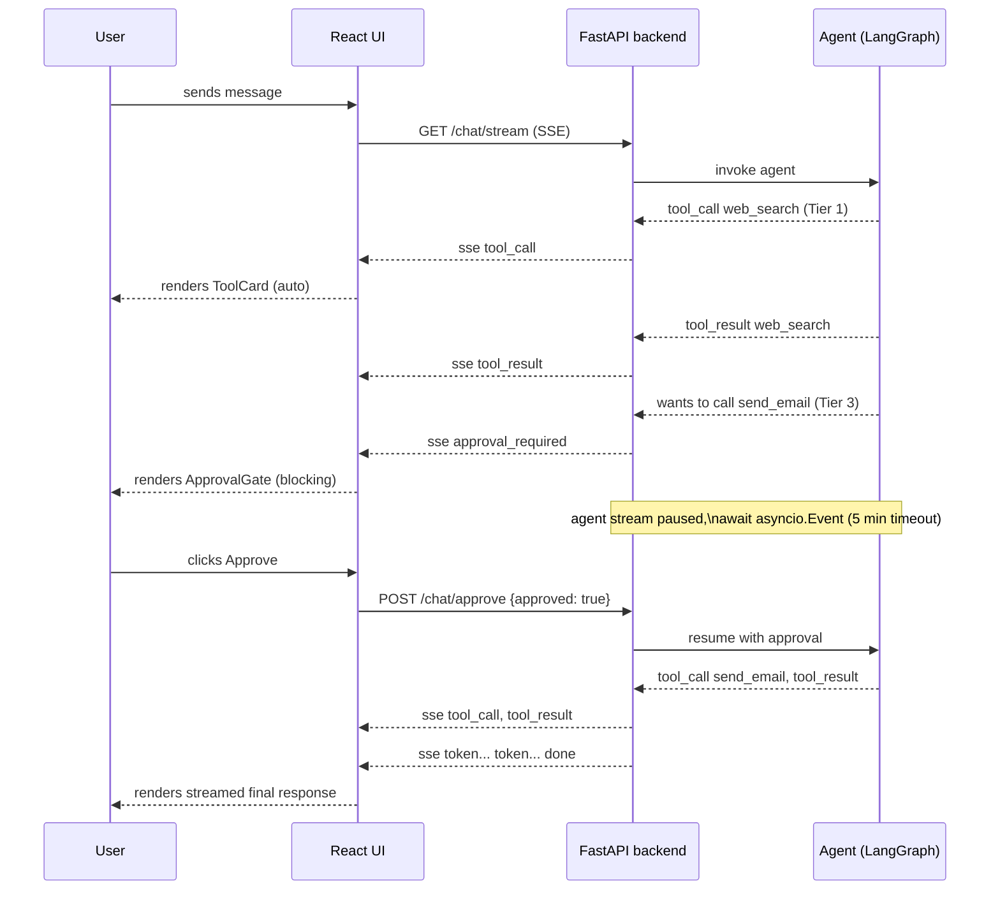

# Chapter 27. Agentic UI Frameworks

> *"Trust is not a feature—it is an emergent property of a system that consistently behaves as expected, explains itself clearly, and recovers gracefully from failures."*
> — Roitman, Chapter 27

**Part V — Agentic AI** · Book pages 522–543 · ~22 min read

[← Chapter 26. Agent Development Frameworks](26-agent-development-frameworks.md) · [Index](../README.md) · [Chapter 28. Quiz Questions and Detailed Answers →](28-quiz-questions-and-answers.md)

---

## What This Chapter Is About

Every earlier chapter in Part V builds the machinery behind an agent: the loop that keeps it working toward a goal ([Chapter 19](19-loop-engineering.md)), the design patterns it executes ([Chapter 20](20-agent-design-patterns.md)), the protocols it speaks to tools and other agents ([Chapter 22](22-model-context-protocol.md), [Chapter 24](24-agent-to-agent-communication.md)), and the frameworks that assemble all of it into a runnable system ([Chapter 26](26-agent-development-frameworks.md)). This chapter asks a different question: once that machinery is running, how does a human actually experience it? A chat bubble reports a result; it does not convey the process — the reasoning, the tools invoked, the decisions made, and the points where human judgment was required. Without that visibility, users cannot trust, correct, or learn from the agent.

Agentic UIs exist to close that gap. They sit at the intersection of human-computer interaction (HCI), explainable AI (XAI), and software engineering, and they carry a specific burden that ordinary chat interfaces do not: agents run long, act in parallel, use tools with real-world side effects, and sometimes need to be stopped mid-task. A UI that treats an agent like a chatbot — a single scrolling thread of text — actively misrepresents what is happening underneath it.

This chapter surveys the paradigms (chat, canvas, workflow visualization, dashboards, collaborative editing, autonomous-with-checkpoints), the recurring components every agentic UI needs (tool visualization, approval gates, progress indicators, confidence signals), the frameworks that implement them (Vercel AI SDK, Chainlit, Gradio, Streamlit, LangGraph Studio), the streaming transports underneath, and the human-in-the-loop patterns that make autonomous execution safe to leave unattended. It closes Part V for a reason: everything else in this part of the book is only as trustworthy as the interface a human uses to observe and steer it.

## Table of Contents

- [The Mental Model](#the-mental-model)
- [27.1 Motivation: Beyond the Chat Box](#271-motivation-beyond-the-chat-box)
- [27.2 UI Paradigms for Agents](#272-ui-paradigms-for-agents)
- [27.3 Key UI Components for Agents](#273-key-ui-components-for-agents)
- [27.4 Frameworks and Libraries](#274-frameworks-and-libraries)
- [27.5 Generative UI](#275-generative-ui)
- [27.6 Streaming and Real-Time Patterns](#276-streaming-and-real-time-patterns)
- [27.7 Human-in-the-Loop UI Design](#277-human-in-the-loop-ui-design)
- [27.8 Accessibility and Trust](#278-accessibility-and-trust)
- [27.9 Implementation Example: A Full-Stack Agentic UI](#279-implementation-example-a-full-stack-agentic-ui)
- [Decision Guide](#decision-guide)
- [Common Pitfalls](#common-pitfalls)
- [Summary](#summary)
- [Practitioner Checklist](#practitioner-checklist)
- [Going Deeper](#going-deeper)

---

## The Mental Model



*The agent↔UI state-synchronization loop: the agent's internal loop emits a typed event stream, the client renders it into components, and any action crossing the approval threshold pauses the loop until a human decision flows back over the same channel.*

An agentic UI is not a view onto a finished response — it is a live projection of a running process. The agent loop from Chapter 19 emits a stream of typed events as it reasons, calls tools, and receives observations. The client subscribes to that stream, maintains its own state store, and renders each event as the appropriate component: a thought block, a tool card, a progress step, or — when the action crosses a risk threshold — a blocking approval gate. Two things make this different from a normal request/response UI: the loop can pause mid-execution waiting for a human decision that flows back into the same channel, and multiple things can be true (and rendered) at once, because tool calls, reasoning, and streaming tokens are not strictly sequential. Every paradigm and component in this chapter is a variation on how to make that live projection legible.

---

## 27.1 Motivation: Beyond the Chat Box

A chat bubble conveys a result. An agentic UI conveys a process. The gap between the two mirrors the gap between a vending machine and a skilled collaborator: when an agent executes a 20-step research task — browsing the web, writing and running code, synthesizing a report — a plain text response cannot answer the questions a user actually has:

- **What is the agent doing right now?** Long-running tasks need progress feedback; silence breeds distrust.
- **Why did the agent make this decision?** Transparency into reasoning lets users catch errors early.
- **Which tools were used, and with what inputs?** Tool provenance is essential for verifying factual claims and auditing behavior.
- **Where should I intervene?** Agents must surface decision points worth human judgment without asking about every micro-decision.
- **Can I undo this?** Irreversible actions — sending emails, modifying files, executing code — require explicit confirmation and rollback paths.

> [!WARNING]
> **Automation bias.** Research on human-automation interaction consistently shows users over-trust automated systems, especially when those systems present outputs confidently and without uncertainty signals. Agentic UIs must actively counteract this by surfacing uncertainty, showing reasoning, and making it easy to question or override agent decisions — confidence in presentation is not evidence of correctness.

Five design goals follow directly: **transparency** (make the agent's internal state legible), **control** (meaningful intervention points without requiring constant supervision), **trust calibration** (help users build an accurate mental model of what the agent can and cannot do), **efficiency** (minimize cognitive load; surface the right information at the right time), and **recoverability** (make mistakes cheap to detect and reverse).

---

## 27.2 UI Paradigms for Agents

No single paradigm suits every agentic use case. The right interface depends on task duration, the human involvement required, the output type, and user expertise — the spectrum runs from fully conversational chat to fully autonomous dashboards with minimal human interaction. Most production systems combine more than one.



*Six UI paradigms ordered roughly by how much they let the agent proceed without a human in the immediate loop; production systems typically layer two or three of these rather than picking one.*

### 27.2.1 Chat-Based Interfaces

Message bubbles, a text input, and a scrolling history remain the most familiar entry point, with low learning curve and natural-language flexibility. For agentic use, chat is augmented with streaming responses (tokens appear as generated, over Server-Sent Events (SSE) or WebSockets, reducing perceived latency), inline tool indicators (small badges or expandable sections showing a tool was called), typing and status messages ("Agent is thinking…", "Running Python code…") that fill latency gaps, and message threading — collapsible sub-threads for intermediate steps.

> [!WARNING]
> **Chat serializes inherently parallel processes.** When an agent fans out to five tools simultaneously, a linear message stream misrepresents the actual execution graph. For complex agentic workflows, chat should be augmented with — or replaced by — a richer paradigm.

### 27.2.2 Canvas and Artifact-Based Interfaces

Popularized by Claude Artifacts and ChatGPT Canvas, the canvas paradigm splits the screen: the left pane hosts conversation, the right pane (the "canvas" or "artifact panel") displays generated content — code, documents, diagrams, spreadsheets — as a live, editable artifact. Key characteristics: **persistent artifacts** that survive turns and can be refined by natural-language instruction ("make the chart blue"); **in-place editing** where the user edits directly and the agent observes and responds; **version history** enabling rollback to any prior state; and **multi-artifact workspaces** supporting several simultaneous artifacts (a code file, its test suite, a documentation page). This paradigm suits co-creation tasks — writing, coding, data analysis, design — where the output is a document rather than a conversational answer.

### 27.2.3 Workflow Visualization

For agents executing structured plans — sequences or graphs of steps — workflow UIs make the plan explicit and trackable. Common in agentic pipelines (LangGraph, AutoGen, CrewAI — see [Chapter 26](26-agent-development-frameworks.md)), where the execution graph renders as a directed acyclic graph (DAG) with nodes as steps and edges as data or control flow; task decomposition views showing the plan as a checklist or Gantt-style timeline; and live progress tracking where nodes change color or spin as they execute, and completed or failed nodes show outputs or errors. **LangGraph Studio** is the canonical example — a graph-based debugger and visualizer letting users inspect state at each node, replay executions, and inject modified state to test alternative paths.

### 27.2.4 Dashboard and Monitoring Interfaces

For long-running or production agents, dashboards provide the operator's view: real-time status (which agents are running, idle, or failed; current task and step), resource metrics (token consumption, API call counts, latency histograms, cost estimates), queue management (pending tasks, priority ordering, rate-limit status), alert and anomaly detection (excessive retries, cost spikes, repeated failures surfaced as notifications), and historical analytics (completion rates, average duration, error frequency over time). Typically built with Grafana, custom React dashboards, or Streamlit, and aimed at operators rather than end users.

### 27.2.5 Collaborative Interfaces

Collaborative UIs treat the agent as a peer contributor to a shared workspace alongside human collaborators: presence indicators (a named cursor or avatar), change attribution (agent edits visually distinguished from human edits, e.g., color-coded diffs), inline suggestions (proposed changes as tracked edits or comments the human accepts, rejects, or modifies), and conflict resolution when both edit the same region simultaneously. This paradigm is emerging in Cursor (collaborative code editing with AI), Notion AI, and Google Docs with Gemini integration.

### 27.2.6 Autonomous with Checkpoints

At the far end of the spectrum, agents run largely independently — browsing the web, writing code, executing commands — surfacing only at predefined checkpoints requiring approval. Used in computer-use agents (Anthropic Computer Use, OpenAI Operator, where the agent controls a browser or desktop and the UI shows a live screen feed, pausing before irreversible actions), automated pipelines with gates (CI/CD-style workflows where the agent completes a phase and waits for a human "merge"), and scheduled agents (running on a schedule, reporting results asynchronously through a notification-based UI).

> [!TIP]
> **Checkpoint UI in practice.** An agent tasked with "clean up my email inbox" might autonomously categorize and archive 500 emails, then pause with: "I found 23 emails that appear to be from mailing lists you haven't opened in 6 months. Shall I unsubscribe from all, some, or none?" The user reviews a list, makes selections, and the agent proceeds — autonomous execution punctuated by human decision points, balancing efficiency with control.

---

## 27.3 Key UI Components for Agents

Regardless of paradigm, agentic UIs share a recurring set of components.

**Thought and reasoning display.** Models trained with chain-of-thought or extended thinking (OpenAI o1/o3, Claude with extended thinking) generate substantial internal reasoning before a final response. Surfacing it is a double-edged sword — more transparency, but risk of overwhelming users with internal monologue. Best practice: collapsible reasoning blocks ("Thought for 12 seconds" with an expand toggle), progressive disclosure (show the conclusion by default), structured reasoning (render hypotheses, evidence, conclusions with visual hierarchy rather than a wall of text), and a clear visual distinction between reasoning (which may contain errors or false starts) and the final response.

**Tool use visualization.** Tool calls are the primary mechanism by which agents touch the world, so visualizing them is essential for trust and debugging. Each invocation has four displayable parts: the tool name and icon, the input arguments (potentially large JSON), the output/result (potentially large), and timing (latency) — the UI must balance completeness against readability. Patterns: inline tool cards (compact, expandable, status-tagged running/success/error), a tool timeline (all calls in a turn, with durations, exposing bottlenecks), input/output diffs for state-modifying tools, recognizable tool icons for rapid scanning, and error highlighting in red with the message and any retries.

**Progress indicators.** Multi-step tasks need step-level progress (a numbered plan list with checkmarks, dynamically adjusted as the agent adapts), token streaming indicators (a blinking cursor, or a tokens-per-second counter for power users), estimated completion with appropriate uncertainty ("approximately 2–5 minutes"), subtask nesting (a tree view for hierarchical tasks), and a clearly visible cancellation control that gracefully halts the agent and summarizes work completed.

**Approval gates.** The primary mechanism for human-in-the-loop control (expanded in §27.7): action summary in plain language, a risk indicator (green = easily undoable, yellow = hard to undo, red = irreversible), an Approve / Reject / Modify interface, an expandable context panel showing why the agent wants to act, and clear timeout behavior (the agent pauses, it does not proceed by default).

> [!WARNING]
> **Alert fatigue.** If an agent requests approval too frequently, users begin approving reflexively without reading — defeating the gate's purpose. Tiered approval policies (§27.7.2) are essential to keep oversight meaningful.

**Context display.** Agents carry internal state — memory, active tools, retrieved documents, conversation history — that shapes behavior. A memory panel (editable, showing what the agent currently "remembers"), an active tools list (with enable/disable toggles), retrieved context with source citations, and a token budget indicator all help users predict agent behavior and know when to start a fresh session.

**Error and recovery UI.** Agents fail: tools error, models hallucinate, plans become infeasible. Error cards show type, message, and the agent's interpretation; retry controls allow manual retry with adjusted parameters; the agent can propose selectable alternative approaches when the primary one fails; partial results are preserved and shown when a multi-step task fails midway; and an escalation path leads to human support or manual completion.

**Confidence indicators.** LLMs are probabilistic systems with calibrated — or miscalibrated — uncertainty. Verbal hedging display highlights phrases like "I'm not certain"; source-quality indicators show recency, authority, and relevance for retrieved information; an explicit "How confident are you?" control prompts self-assessment; and for high-stakes outputs the agent proactively suggests independent verification.



*Seven components recur across almost every agentic UI paradigm — each answers one of the user questions from §27.1, and together they are the vocabulary the rest of this chapter's frameworks render into.*

---

## 27.4 Frameworks and Libraries

A growing ecosystem accelerates agentic UI development, organized here by primary language and use case.

**Vercel AI SDK** is a TypeScript/JavaScript library for streaming AI interfaces in React, Next.js, Svelte, and Vue, and the most widely used framework for production web-based agent UIs. Core abstractions: `useChat` (a React hook managing a chat conversation with streaming, message history, loading states), `useCompletion` (single-turn streaming text completion), `useObject` (streams structured JSON objects for progressive rendering of complex outputs), and server-side `streamText` / `streamObject` functions. Its most distinctive feature is **generative UI via React Server Components (RSC)** — covered in §27.5.

**Chainlit** is a Python framework for production-ready agent UIs with minimal boilerplate, particularly popular in the LangChain and LlamaIndex ecosystems. It natively renders LangChain/LlamaIndex execution steps as a collapsible tree (each chain call, retrieval, and tool invocation), supports multi-modal file upload, image, audio, and PDF rendering out of the box, ships built-in authentication and persistent multi-user sessions, allows custom React components registered and rendered from Python, and collects thumbs up/down feedback with optional comments to a database.

```python
import chainlit as cl

@cl.on_message
async def on_message(message: cl.Message):
    # Chainlit auto-renders each step as a collapsible UI element
    async with cl.Step(name="Agent", type="run") as step:
        step.input = message.content
        result = await agent.ainvoke(
            {"messages": [{"role": "user", "content": message.content}]},
            config={"callbacks": [cl.LangchainCallbackHandler()]},
        )
        step.output = result["messages"][-1].content
    await cl.Message(content=step.output).send()
```

*Adapted from Listing 27.1 — the `cl.Step` context manager is what produces the collapsible step tree without any extra UI code.*

**Gradio** is a Python library for rapidly building ML demos and agent interfaces via `gr.ChatInterface` and `gr.Blocks`. Strengths: zero-configuration one-line sharing via Hugging Face Spaces, a Custom Components system for building React components that integrate with Python backends, multi-modal inputs (file, image, audio, video, webcam) with minimal configuration, and native generator-based streaming. Its layout system is less flexible than a full React framework, and session-scoped state management makes complex multi-agent coordination harder.

**Streamlit** is a Python framework for data applications widely adopted for agent dashboards and monitoring UIs. Its reactive model — the entire script reruns on each interaction — is simple but limiting for complex agentic workflows. Agentic use: dashboards via `st.metric`, `st.dataframe`, `st.status`; `st.session_state` persisting agent state across reruns for multi-turn conversations; `st.write_stream` for progressive generator rendering; and the `@st.fragment` decorator enabling partial reruns for better live-dashboard performance.

**OpenAI Assistants Playground** serves as a reference implementation rather than a buildable framework: thread-based conversation management with persistent history, file attachment and retrieval visualization, code interpreter execution with output display (stdout, images, files), function-call display with input/output inspection, and run-step visualization of the sequence of model calls and tool invocations. Its design patterns are widely emulated even though it is not itself embeddable.

**LangGraph Studio** is a desktop application providing a visual IDE for LangGraph agents (see [Chapter 26](26-agent-development-frameworks.md)) — the most sophisticated workflow-visualization environment available. It offers interactive graph visualization of the agent's state machine, full state inspection at any point (all variables, memory, tool results as structured JSON), time-travel debugging (replay any prior step, modify state, re-run from that point), human-in-the-loop breakpoints on any node, and visualization of supervisor–subagent hierarchies and inter-agent message passing.

### Framework Comparison

| Framework | Language | Stream | Tool Viz | Multi-Agent | Gen UI | Prod-Ready |
|---|---|:---:|:---:|:---:|:---:|:---:|
| Vercel AI SDK | TypeScript | ✓ | Partial | Partial | ✓ | ✓ |
| Chainlit | Python | ✓ | ✓ | Partial | Partial | ✓ |
| Gradio | Python | ✓ | ◦ | × | ◦ | ✓ |
| Streamlit | Python | ✓ | ◦ | × | × | ✓ |
| OpenAI Assistants Playground | N/A (hosted) | ✓ | ✓ | × | × | × |
| LangGraph Studio | Python/TS | ✓ | ✓ | ✓ | × | Partial |

*Table 27.1 (source), reproduced. ✓ = full support, ◦ = partial/basic, × = not supported.*

---

## 27.5 Generative UI

> [!NOTE]
> **The concept.** Traditional LLM interfaces render model output as text or markdown. Generative UI inverts this: the model's tool calls generate UI components. The model decides not just what to say, but how to present it — a chart, a form, a map, a calendar widget — based on content type and user intent, rather than the developer pre-specifying every possible UI state.

### 27.5.1 React Server Components for Dynamic Interfaces

The Vercel AI SDK's RSC integration is the most mature implementation. The flow: (1) the user sends a message to a Next.js server action; (2) the server calls the LLM with a set of tools, each associated with a React component; (3) when the LLM calls a tool (e.g., `show_weather`), the server renders the corresponding component with the tool's output as props; (4) the rendered component streams to the client as a React Server Component, appearing inline in the chat.

```typescript
// app/actions.tsx — condensed from Listing 27.2
export async function chat(userMessage: string) {
  const result = await streamUI({
    model: openai('gpt-4o'),
    messages: [{ role: 'user', content: userMessage }],
    tools: {
      show_weather: {
        description: 'Display current weather for a location',
        parameters: z.object({ location: z.string(), unit: z.enum(['celsius', 'fahrenheit']) }),
        generate: async ({ location, unit }) => {
          const data = await fetchWeather(location, unit);
          return <WeatherCard data={data} />;
        },
      },
    },
  });
  return result.value;
}
```



*Generative UI rendering flow: the model does not choose text vs. component after the fact — the tool call itself is bound to a component, so the model's decision to invoke `show_weather` is simultaneously a decision to render a weather card.*

### 27.5.2 Adaptive Interfaces Based on Content Type

Generative UI adapts presentation to content: tabular data → sortable, filterable data table with export; geographic data → interactive map with markers and layers; time series → zoomable line chart with annotations; code → syntax-highlighted editor with a run button; documents → formatted viewer with annotation tools; forms/structured input → dynamically generated fields. The model acts as a UI orchestrator, reducing the need for developers to anticipate every output type and pre-build a matching component.

> [!WARNING]
> **Limits of generative UI.** Fully model-driven UI generation risks inconsistency, accessibility failures, and security vulnerabilities — e.g., a model generating a form that submits to an unexpected endpoint. In practice, generative UI works best when the model selects from a curated library of pre-built, accessible, and secure components rather than generating arbitrary HTML or JSX.

---

## 27.6 Streaming and Real-Time Patterns

Streaming is foundational: it transforms the experience from "wait for a result" to "watch the agent work."

**Token streaming** delivers output incrementally rather than waiting for the complete response, over two common transports. **Server-Sent Events (SSE)** is a unidirectional HTTP stream, simple, works over standard HTTP/1.1, auto-reconnected by browsers — the dominant mechanism for LLM streaming APIs (OpenAI, Anthropic, and Google all use SSE). **WebSockets** are bidirectional persistent connections, more complex to implement but necessary when the client must send data mid-stream — for example, interrupting the agent or providing mid-generation feedback.

```python
# condensed from Listing 27.3 — SSE token streaming with FastAPI
async def token_stream(prompt: str):
    stream = await client.chat.completions.create(
        model="gpt-4o", messages=[{"role": "user", "content": prompt}], stream=True,
    )
    async for chunk in stream:
        delta = chunk.choices[0].delta
        if delta.content:
            yield f"data: {json.dumps({'token': delta.content})}\n\n"
        elif chunk.choices[0].finish_reason:
            yield f"data: {json.dumps({'done': True})}\n\n"
```

**Tool call streaming** streams the tool name and arguments incrementally, so the UI can show "Agent is calling `search_web` with query: 'climate change 2024'…" before the call has even executed — this requires parsing partial JSON with a streaming parser. Patterns: progressive argument display, parallel tool call indicators (show all pending calls, then update each as results arrive), and tool result streaming (piping a tool's own streamed output, e.g. code execution or web scraping, through to the UI progressively).

**Multi-agent streaming** must handle several agents generating output simultaneously: agent-labeled streams (each stream tagged with the agent's identity, rendered in separate lanes or panels), stream merging (a supervisor's stream interleaving with subagent streams while maintaining coherent ordering), and backpressure — if the UI cannot render as fast as streams arrive, strategies include dropping intermediate tokens (showing only the latest), batching updates, or pausing slower streams.

**Optimistic UI updates** improve perceived responsiveness: a sent message appears immediately while the request is in flight; an accepted approval gate immediately shows "approved" and begins showing next steps before the server confirms; if the server errors, the optimistic update rolls back and an error state is shown.

**Backpressure handling** in high-throughput scenarios uses token batching (buffer for **50–100ms**, render in batches rather than one-by-one), virtual scrolling (render only the visible portion of long output, discarding off-screen DOM nodes), throttled updates (metrics and status displays update at a fixed rate, e.g. **10 Hz**, regardless of incoming data rate), and progressive detail (a summary view during high-throughput periods, full detail on demand).

---

## 27.7 Human-in-the-Loop UI Design

Human-in-the-loop (HITL) interaction is one of the most consequential design challenges in agentic UIs: maintain meaningful oversight without creating a bottleneck that negates automation's efficiency benefit.

### 27.7.1 When to Interrupt the Agent

Not all actions warrant human review. A principled interruption policy weighs: **reversibility** (irreversible actions — deleting files, sending emails, making purchases — always warrant approval; reversible ones like reading files or searching the web generally do not), **scope** (actions affecting external systems or other people warrant more scrutiny than purely local ones), **confidence** (low confidence in interpreting user intent should trigger a clarifying question, not proceeding), **cost** (high-cost actions — large API calls, expensive computations — warrant approval), and **novelty** (actions the agent has not taken before in this context warrant more scrutiny than routine ones).

### 27.7.2 Tiered Approval Workflows

> [!IMPORTANT]
> **Three-tier approval model.** **Tier 1 (Auto-approve):** low-risk, reversible, routine actions — web search, reading files, read-only API calls. The agent proceeds without interruption; actions are logged for audit. **Tier 2 (Notify):** medium-risk actions get a non-blocking notification ("Agent sent a draft email to your Drafts folder") with a brief cancellation window (e.g., **30 seconds**) before the action finalizes. **Tier 3 (Require approval):** high-risk, irreversible, or high-cost actions pause the agent behind a blocking approval gate — the user must explicitly approve, reject, or modify before it continues.

Thresholds between tiers can be user-configured ("always ask before sending emails") or learned from behavior (if the user always approves web searches, auto-approve them going forward).



*The three-tier approval state machine: Tier 1 never interrupts, Tier 2 interrupts asynchronously with a cancellation window, and only Tier 3 blocks the loop outright — and even there, the default on no response is "pause," never "proceed."*

### 27.7.3 Feedback Mechanisms

Beyond approval gates, rich feedback helps the agent improve over time: **thumbs up/down** (simple binary feedback, stored for reinforcement learning from human feedback (RLHF) fine-tuning or preference learning), **inline corrections** (users edit agent output directly; the delta is a training signal), **preference selection** (choosing among agent-offered options is itself a preference signal), **explicit instruction** ("Don't do this again", "Always ask before X" — natural-language updates to behavioral policy), and **rating with rationale** (optional free-text explanation alongside a rating).

### 27.7.4 Teaching the Agent Through UI Interaction

The most sophisticated HITL UIs treat every interaction as a teaching opportunity: **demonstration** (the user performs a task manually; the agent observes the preferred approach), **correction with generalization** (the UI asks "Should I always do this differently?" after a correction, generalizing it), **preference elicitation** (periodic prompts comparing two agent behaviors), and **behavioral profiles** (a visible, editable "preferences" profile that makes learned behavior transparent and controllable).

---

## 27.8 Accessibility and Trust

Trust is not a feature — it is an emergent property of a system that consistently behaves as expected, explains itself clearly, and recovers gracefully from failures.

**Explaining agent decisions** goes beyond chain-of-thought: decision rationale (which factors were considered, what alternatives were rejected, what assumptions were made), source attribution (claims linked to citable sources), counterfactual explanations ("If you had said X instead of Y, I would have done Z" — helping users understand the agent's decision boundary), and explicit uncertainty quantification.

**Showing confidence levels** must be calibrated and meaningful: verbal confidence ("I'm fairly confident") is more interpretable to most users than numerical probabilities; visual confidence (color coding, icon variants, font weight) encodes confidence without added text; and per-claim confidence indicators (e.g., inline footnotes) are more informative than a single response-level score for multi-claim answers.

**Undo and rollback capabilities** should exist for every consequential action where technically feasible: an action log with an "Undo" button per reversible action, snapshot-based rollback for stateful tasks (code editing, document writing), a dry-run mode that simulates a plan and shows predicted state changes before real execution, and graceful degradation when undo is impossible (an email already sent) — the UI communicates this clearly and offers the best available alternative, such as a follow-up message.

**Audit trails in the UI** matter for enterprise and regulated use: an immutable action log (every action, tool call, and approval, timestamped with user identity and full parameters), exportable history (JSON, CSV, or PDF for compliance reporting), diff views for document or code modifications, and full session replay for debugging or compliance review.

**Managing user expectations** actively counters a primary source of distrust: capability disclosure (clear documentation of what the agent can and cannot do), limitation acknowledgment (saying so clearly rather than attempting and silently failing), proactive uncertainty communication (rather than waiting for the user to discover errors), and a consistent persona that builds familiarity and predictability.

> [!TIP]
> **Trust through transparency — a case study.** Booking a flight: a low-trust UI shows only "I've booked your flight. Confirmation: AA1234." A high-trust UI shows (1) the search parameters used, (2) the alternatives considered and why this flight was selected, (3) the exact API calls made, (4) confirmation details with a link to the booking, (5) an undo option valid for 24 hours, and (6) a note on what the agent cannot do ("I cannot modify this booking; you'll need to call the airline directly"). The second UI costs more screen space but gives the user what they need to verify the action and recover if something is wrong.

---

## 27.9 Implementation Example: A Full-Stack Agentic UI

The source chapter walks through a concrete Python/React stack combining streaming, tool visualization, and approval gates: a FastAPI backend built on LangGraph, and a React frontend using Vercel-AI-SDK-style patterns against a custom backend. The backend defines tools (`web_search`, `read_file` as auto-approved; `send_email` flagged as requiring human approval), streams a typed sequence of Server-Sent Events (`status`, `thinking`, `tool_call`, `tool_result`, `approval_required`, `action_rejected`, `token`, `done`) over a single HTTP connection, and — on hitting the `send_email` call — creates an `asyncio.Event`, emits an `approval_required` event carrying the approval ID, the tool, its tier, a risk label, an action summary, and parameters, then `await`s that event with a **5-minute timeout**. A separate `POST /chat/approve` endpoint receives the human's decision and sets the event, unblocking the stream; on timeout, the backend emits `approval_timeout` and skips the action.

The frontend defines a discriminated union `AgentEvent` type covering every event the backend can emit, a `ToolCard` component (color-coded by tier — green for Tier 1/auto, amber and red for higher tiers — expandable to show the raw input JSON), and an `ApprovalGate` component (risk-colored border, an action summary, and Approve/Reject buttons that `POST` the decision back to `/chat/approve`). The main `AgentChat` component opens an `EventSource` against the streaming endpoint, appends non-token events to a list rendered by type, and accumulates `token` events into the visible response text with a blinking cursor while streaming is active.



*The streaming approval sequence from §27.9: Tier 1 tool calls render and continue without interruption, while the Tier 3 `send_email` call blocks the entire SSE stream behind an `asyncio.Event` until the human's decision arrives over a separate POST request.*

**What this implementation demonstrates:** SSE streaming carries every event type — status, thinking, tool calls, tokens — over one HTTP connection; a typed discriminated-union event protocol lets the frontend render each event appropriately; `ToolCard` and `ApprovalGate` are the concrete realization of the tool-visualization and approval-gate components from §27.3; and `asyncio.Event` cleanly decouples the approval UI (a separate POST endpoint) from the streaming logic — the backend does not need to know how or when the human responds, only that the event eventually resolves or times out.

---

## Decision Guide

| If you need... | Reach for... | Because... |
|---|---|---|
| Fast prototyping of a conversational agent, Python-only team | Gradio or Streamlit | Zero-config deploy, minimal boilerplate, native streaming |
| A production web chat UI with generative UI components | Vercel AI SDK | RSC integration streams arbitrary React components inline; production-ready |
| Rich step visualization for a LangChain/LlamaIndex agent | Chainlit | Native collapsible step tree, built-in auth, multi-modal I/O |
| Debugging and time-travel through a LangGraph agent's execution | LangGraph Studio | State inspection, replay, HITL breakpoints, multi-agent visualization |
| An operator-facing view of many running agents | Dashboard paradigm (§27.2.4) | Real-time status, resource metrics, alerting built for monitoring, not conversation |
| Co-creation on a document, codebase, or design | Canvas / Artifact paradigm (§27.2.2) | Persistent, versioned, in-place-editable output the agent and human both act on |
| An agent that must never act on an external system unsupervised | Autonomous-with-checkpoints (§27.2.6) | Blocking approval gates at defined checkpoints, not continuous supervision |
| Bidirectional mid-stream interruption or steering | WebSockets over SSE (§27.6.1) | SSE is server→client only; steering requires the client to send data mid-stream |

---

## Common Pitfalls

> [!WARNING]
> **Serializing parallel execution into a linear chat log.** When an agent fans out to several tools at once, a plain scrolling message stream misrepresents the actual execution graph — augment or replace chat with workflow visualization for anything beyond simple back-and-forth.

> [!WARNING]
> **Flat approval policies.** Approving everything defeats oversight; approving nothing defeats automation's value. Untiered gates also cause alert fatigue — users start clicking "Approve" reflexively without reading, which is worse than no gate at all.

> [!WARNING]
> **Fully model-driven UI generation.** Letting the model emit arbitrary HTML or JSX risks inconsistency, accessibility failures, and security vulnerabilities (a generated form posting to an unexpected endpoint). Constrain generative UI to a curated, pre-built, accessible component library.

> [!WARNING]
> **Confident presentation mistaken for correctness.** Automation bias means users over-trust systems that present outputs confidently without uncertainty signals — a slick UI with no confidence indicators or reasoning display actively works against calibrated trust.

> [!WARNING]
> **No default-safe timeout behavior.** An approval gate that silently proceeds when a user doesn't respond defeats the purpose of the gate; the default on timeout must be to pause and skip the action, not to assume consent.

---

## Summary

- Agentic UIs must convey process, not just results — what the agent is doing, why, which tools it used, where to intervene, and whether an action can be undone — because automation bias means confident-looking output is over-trusted by default without those signals.
- Six paradigms span the autonomy spectrum — chat, canvas/artifact, workflow visualization, dashboard/monitoring, collaborative, and autonomous-with-checkpoints — and most production systems combine several rather than committing to one.
- Seven recurring components (thought display, tool visualization, progress indicators, approval gates, context display, error/recovery UI, confidence indicators) are the shared vocabulary every paradigm renders into.
- Streaming is the baseline, not a feature: SSE is the dominant unidirectional transport for LLM APIs (OpenAI, Anthropic, Google all use it), while WebSockets are needed only when the client must interrupt or steer mid-generation.
- Tiered approval policies — Tier 1 auto-approve, Tier 2 notify with a ~30-second cancel window, Tier 3 blocking approval — are essential; flat policies either bottleneck the agent or train users into reflexive, meaningless approval clicks.
- Generative UI (most mature via the Vercel AI SDK's React Server Components) lets the model select and parameterize a UI component per tool call rather than always returning text, but works best constrained to a curated, accessible component library rather than free-form generation.
- Trust is earned, not declared: undo/rollback, immutable audit trails, calibrated per-claim confidence, and explicit capability/limitation disclosure matter as much as raw model capability for whether users actually rely on the system.
- The frameworks surveyed — Vercel AI SDK, Chainlit, Gradio, Streamlit, the OpenAI Assistants Playground, and LangGraph Studio — are building blocks; production systems combine them according to the specific needs of their users and the specific risks of their domain.

---

## Practitioner Checklist

- [ ] Every long-running action shows live progress (status message, step list, or token stream) — silence longer than a few seconds is treated as a bug.
- [ ] Tool calls render as inline cards showing name, inputs, outputs, and timing, with errors highlighted distinctly from success.
- [ ] Actions are classified into a three-tier approval policy (auto-approve / notify with cancel window / blocking approval) rather than a flat all-or-nothing gate.
- [ ] Approval gates show a plain-language action summary, a reversibility-based risk indicator, and Approve/Reject/Modify — not just Approve/Reject.
- [ ] The default behavior on approval timeout is "pause, do not proceed," and this is visible to the user before they need it.
- [ ] Streaming is implemented over SSE by default; WebSockets are reserved for flows that genuinely need mid-stream client-to-server interruption.
- [ ] High-throughput streams are batched (50–100ms) or throttled (e.g., 10 Hz for status/metrics) rather than triggering a DOM update per token.
- [ ] Every consequential, reversible action has a visible undo path; irreversible ones are clearly labeled before the user commits.
- [ ] An audit trail (timestamp, identity, full parameters) is captured for every tool call and approval decision, exportable for compliance.
- [ ] Confidence or uncertainty is surfaced somewhere in the response — verbally, visually, or per-claim — rather than presenting every output with uniform, unearned confidence.
- [ ] If generative UI is used, tool-to-component bindings are drawn from a curated, accessible, pre-built library — the model is never generating raw HTML/JSX.
- [ ] Multi-agent or parallel tool-call output is rendered in separate labeled lanes rather than interleaved into a single ambiguous stream.

---

## Going Deeper

- **Vercel AI SDK** — TypeScript/JavaScript streaming framework with `useChat`/`useCompletion`/`useObject` hooks and RSC-based generative UI, referenced throughout §27.4 and §27.5.
- **Chainlit** — Python agent-UI framework with native LangChain/LlamaIndex step visualization, referenced in §27.4.2.
- **Gradio** — Python ML-demo and agent-interface library with Hugging Face Spaces deployment, referenced in §27.4.3.
- **Streamlit** — Python reactive data-app framework used for agent dashboards, referenced in §27.4.4.
- **LangGraph Studio** — visual IDE for LangGraph agents with time-travel debugging and HITL breakpoints, referenced in §27.4.6 and §27.2.3; see also [Chapter 26](26-agent-development-frameworks.md) for LangGraph itself.
- **Claude Artifacts** and **ChatGPT Canvas** — the canvas/artifact paradigm's reference implementations, §27.2.2.
- **Anthropic Computer Use** and **OpenAI Operator** — autonomous-with-checkpoints computer-use agents, §27.2.6.
- [Chapter 19 (Loop Engineering)](19-loop-engineering.md) — the agent loop this chapter's UIs render and pause; the event stream in §27.9 is a direct projection of that loop's reason→act→observe cycle.
- [Chapter 20 (Agent Design Patterns)](20-agent-design-patterns.md) — the maker–checker and hierarchical patterns that workflow-visualization UIs (§27.2.3) make visible as graphs.
- [Chapter 22 (Model Context Protocol)](22-model-context-protocol.md) — the tool-calling protocol underlying the tool-visualization components of §27.3.
- [Chapter 26 (Agent Development Frameworks)](26-agent-development-frameworks.md) — LangGraph, AutoGen, and CrewAI, whose execution graphs the workflow-visualization paradigm and LangGraph Studio render.

> [!NOTE]
> Bracketed citation markers from the source (e.g., [284], [358], [40], [1], [156], [155]) are omitted here since the supplied page range excluded the bibliography; framework and tool names are preserved as given in the text.

---

[← Chapter 26. Agent Development Frameworks](26-agent-development-frameworks.md) · [Index](../README.md) · [Chapter 28. Quiz Questions and Detailed Answers →](28-quiz-questions-and-answers.md)

*Summary of Chapter 27 of [The Hitchhiker's Guide to Agentic AI](https://arxiv.org/abs/2606.24937)
by Haggai Roitman. Licensed CC BY-SA 4.0. Independent study notes — not affiliated with or
endorsed by the author.*
