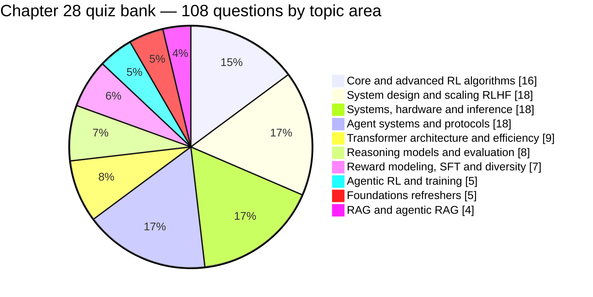
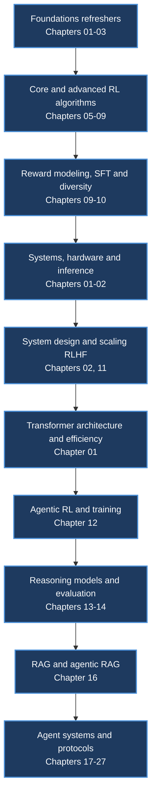
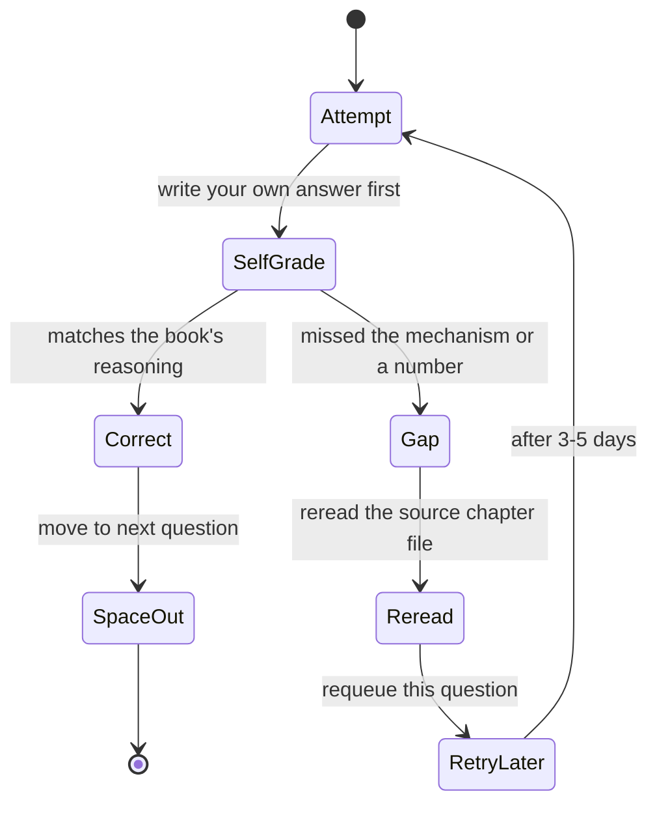
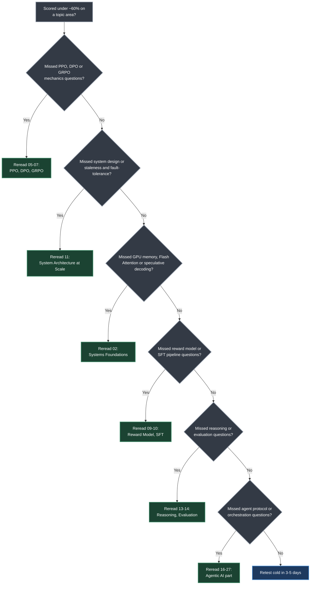

# Chapter 28. Quiz Questions and Detailed Answers

> *"The kind of knowledge that distinguishes surface-level familiarity from genuine expertise."*

**Part VI — Assessment and Reference** · Book pages 545–596 · ~15 min read

[← Chapter 27. Agentic UI Frameworks](27-agentic-ui-frameworks.md) · [Chapter 29. Quick Reference →](29-quick-reference.md)

---

## What This Chapter Is About

Chapter 28 is a 51-page self-assessment instrument covering Parts I through V of the book, from
causal attention masks to agent-to-agent protocols. It holds **108 questions**, each with a
detailed answer, organized into **30 numbered subsections** (28.1–28.30) that roughly track the
book's chapter order: foundations first, core RL algorithms, system design and debugging, then a
long tail — GRPO variants, DPO extensions, GPU hardware, quantization, MoE, speculative decoding,
agentic RL, reasoning models, evaluation, and the agentic-AI stack.

The chapter's own framing is explicit: attempt your own answer before reading the solution. That
matters more than it sounds — the questions sit at interview and design-review depth, not
flashcard depth. Several ask you to derive a loss function from first principles (DPO,
Bradley-Terry), work a numeric example by hand (GAE), or design a system under constraints (a
64-GPU RLHF cluster, a fault-tolerant 512-GPU run). Reading the answer without producing your own
first creates an illusion of competence a real design review will expose.

This file is **not** the quiz bank — reproducing 108 questions and answers would just republish
Chapter 28, not summarize it. It is a map of it: what it covers, how coverage is weighted, which
chapter to reread on a miss, and five worked examples showing the reasoning depth the answers
expect. Use it to plan study order; go to the book itself to actually test yourself.

> [!NOTE]
> The full 108-question set with detailed answers lives in the book at pages 545–596. It is not
> reproduced here. Read it directly in *The Hitchhiker's Guide to Agentic AI: From Foundations to
> Systems* by Haggai Roitman — [arXiv:2606.24937](https://arxiv.org/abs/2606.24937).

## Table of Contents

- [The Mental Model](#the-mental-model)
- [Topic Coverage Map](#topic-coverage-map)
- [Concepts You Should Be Able to Explain](#concepts-you-should-be-able-to-explain)
  - [Part I — Foundations](#part-i--foundations)
  - [Part II — RL Methods for LLMs](#part-ii--rl-methods-for-llms)
  - [Part III — Reasoning](#part-iii--reasoning)
  - [Part IV — Evaluation](#part-iv--evaluation)
  - [Part V — Agentic AI](#part-v--agentic-ai)
- [Five Worked Examples](#five-worked-examples)
- [How to Study With This Chapter](#how-to-study-with-this-chapter)
- [Common Pitfalls](#common-pitfalls)
- [Summary](#summary)
- [Practitioner Checklist](#practitioner-checklist)
- [Going Deeper](#going-deeper)

---

## The Mental Model

*Grouping the quiz bank's 30 subsections into 10 topic areas by content, not by section number.*

Two things fall out of this distribution immediately. First, RL algorithm mechanics and RLHF
system design together account for over a third of the bank (34 of 108 questions) — this is a
systems-and-algorithms book at heart, and the quiz reflects that weighting more heavily than a
pure "concepts" review would. Second, the agentic-AI material (memory, orchestration, MCP, A2A,
multi-agent, frameworks, environments, UI, RAG) is concentrated in the last third of the bank
(28.18 through 28.30) and tests each protocol or pattern with exactly two or three questions —
broad but shallow coverage, since Part V of the book itself spans thirteen chapters in far more
depth than a handful of quiz questions could reproduce.

## Topic Coverage Map

| Topic area | Questions | Quiz subsections | Chapters tested | Difficulty |
|---|---|---|---|---|
| Foundations refreshers | 5 | 28.1 | [01](01-llm-architecture-and-optimization.md), [02](02-systems-foundations-for-llms.md), [03](03-introduction-to-reinforcement-learning.md) | Foundational |
| Core and advanced RL algorithms | 16 | 28.2, 28.5, 28.6, 28.19 | [05](05-ppo-proximal-policy-optimization.md), [06](06-dpo-direct-preference-optimization.md), [07](07-grpo-group-relative-policy-optimization.md), [08](08-preference-optimization-variants.md), [09](09-reward-model-training.md) | Intermediate–Advanced |
| System design and scaling RLHF | 18 | 28.3, 28.4, 28.10 | [02](02-systems-foundations-for-llms.md), [11](11-system-architecture-at-scale.md) | Advanced |
| Systems, hardware and inference | 18 | 28.7, 28.8, 28.12, 28.14, 28.17 | [01](01-llm-architecture-and-optimization.md), [02](02-systems-foundations-for-llms.md) | Intermediate–Advanced |
| Transformer architecture and efficiency | 9 | 28.11, 28.13, 28.15 | [01](01-llm-architecture-and-optimization.md) | Intermediate |
| Reward modeling, SFT and diversity | 7 | 28.9, 28.16 | [09](09-reward-model-training.md), [10](10-sft-best-practices.md) | Intermediate |
| Reasoning models and evaluation | 8 | 28.20, 28.21 | [13](13-rl-for-large-reasoning-models.md), [14](14-llm-evaluation.md) | Advanced |
| Agentic RL and training | 5 | 28.18 | [12](12-llm-agentic-training.md) | Advanced |
| Agent systems and protocols | 18 | 28.22–28.29 | [17](17-agentic-memory-systems.md), [18](18-agent-harness-context-and-orchestration.md), [22](22-model-context-protocol.md), [24](24-agent-to-agent-communication.md), [25](25-multi-agent-systems.md), [26](26-agent-development-frameworks.md), [21](21-agentic-environments-and-benchmarks.md), [27](27-agentic-ui-frameworks.md) | Intermediate–Advanced |
| RAG and agentic RAG | 4 | 28.30 | [16](16-retrieval-augmented-generation.md) | Intermediate |

Difficulty follows a pattern the source makes explicit: definitional questions ("What is X?") sit
at Foundational; comparisons ("X vs. Y") at Intermediate; derivations and open-ended design
questions ("Design a system for...") at Advanced. The 28.3/28.4/28.10 cluster is almost entirely
design-under-constraints — the hardest section in the bank, and the one closest to a real
infrastructure interview.

## Concepts You Should Be Able to Explain

Self-test prompts in plain language — paraphrases of what the 108 questions probe, not the
questions themselves. Cover the answer, say it out loud or write it down, then check yourself
against the chapter file. Grouped by the five content parts the quiz draws from (Part VI, this
part, is the assessment layer itself).

### Part I — Foundations

1. Why is decoder attention causally masked, and how does that enable KV-cache reuse?
2. Why is standard attention memory-bandwidth bound, and where does Flash Attention fix that?
3. Why does RoPE generalize to unseen sequence lengths better than learned absolute embeddings?
4. What does SwiGLU's gate add over a plain ReLU FFN, and what does it cost?
5. What KV-cache reduction does Grouped Query Attention give, and why does sharing barely hurt
   quality?
6. Why did decoder-only architectures win over encoder-decoder for general-purpose LLMs?
7. Walk the GPU memory hierarchy — registers, SRAM, L2, HBM, CPU DRAM — and why decoding mostly
   waits on HBM.
8. How do you compute arithmetic intensity to tell compute-bound from memory-bound on the
   roofline model?
9. Why does speculative decoding provably match the target model's output distribution?
10. How do temperature and the KL penalty pull opposite ways on RL's exploration-exploitation
    trade-off?

### Part II — RL Methods for LLMs

1. Why does PPO's clipped surrogate prevent policy gradient's "death spiral"?
2. Derive DPO from the RLHF objective's closed-form optimal policy; name its four assumptions.
3. Why does GRPO drop the value network, and when do you reach for it over PPO?
4. Hand-compute a GAE example: per-token values plus one terminal reward, advantage decaying
   backward through the sequence.
5. List the layered defenses against reward hacking, in priority order, with early-warning signals.
6. Why decouple generation and training onto separate clusters despite the added complexity?
7. Why is a several-step-stale policy still safe to generate from in a decoupled system?
8. Diagnose "reward rising, quality falling": what do you check, immediate fix vs. structural fix?
9. Compare LoRA and full fine-tuning for RLHF on memory, stability, and quality ceiling.
10. How is a Process Reward Model trained via Monte Carlo rollouts, and why does it resist reward
    hacking better than an Outcome Reward Model?
11. What do DAPO's asymmetric clipping and token-level loss normalization each fix?
12. Why do identical weights disagree between vLLM and a training framework, and how do TIS/MIS
    correct the ratio?
13. Derive the Bradley-Terry reward loss; list its limitations (transitivity, no ties, length bias).
14. What breaks in SFT without the block-diagonal packing mask, or the completion-only loss mask?
15. How does the pass@k diagnostic tell you whether an SFT model has RL headroom?
16. Why does AdamW's decoupled weight decay differ from Adam's L2 term, and why does BF16 skip the
    loss scaling FP16 needs?

### Part III — Reasoning

1. State the test-time compute scaling law and the "overthinking" failure it predicts.
2. Map MCTS's four phases onto LLM reasoning search — what replaces random rollouts?
3. Why does distilling from a larger reasoning model often beat direct RL on a small one?
4. How does GRPO's within-group normalization substitute for step-level reward density?

### Part IV — Evaluation

1. Derive the ELO update rule and explain its equivalence to Bradley-Terry MLE at convergence.
2. Why is the naive pass@k estimator biased, and how does the unbiased estimator fix it in one
   pass?
3. What detects benchmark contamination beyond simple n-gram overlap?
4. Why does mitigating LLM-as-judge position bias require swapping response order, not just
   prompting for fairness?
5. Distinguish a reward-hacking red flag (RM up, win-rate flat) from an alignment-tax red flag
   (win-rate up, benchmarks down).

### Part V — Agentic AI

1. Name the four types of agentic memory and how they feed into each other.
2. Why combine recency and similarity in memory retrieval instead of similarity alone?
3. Contrast ReAct's myopia against Plan-and-Execute's brittle plans — when does each fail?
4. Compare hash-window and semantic-similarity loop detection, and the escalation ladder after.
5. Explain MCP's N+M argument for why it beats every-framework-integrates-every-tool.
6. Name MCP's four primitives and explain why sampling reverses the usual client-server direction.
7. How do A2A's agent cards and opaque delegation differ from MCP's structured tool calls?
8. Why does CTDE (centralized training, decentralized execution) stabilize multi-agent RL?
9. What does Agentic RAG add over a fixed retrieve-then-generate pipeline?
10. Explain lost-in-the-middle and the fix the source calls out: retrieve many, re-rank to a few,
    order by relevance.

## Five Worked Examples

Picking five questions to walk through in depth, chosen to span the bank's five content parts and
to show the level of reasoning the book's answers expect — not a definition, but a chain of
"why."

---

**Q32 (page 563): "Explain PagedAttention. How does it solve the KV cache problem?"**

Naive serving pre-allocates `max_sequence_length` worth of KV cache per sequence — if the max is
2048 tokens but responses average 500, roughly 75% of that allocation sits empty, wasting hundreds
of gigabytes across dozens of concurrent sequences. PagedAttention borrows OS virtual memory's
fix: the cache splits into fixed-size blocks (16 tokens each), a block table maps logical
positions to physical blocks, and blocks allocate only as a sequence grows, returning to a shared
pool on completion. Two benefits fall out for free: shared system prompts can share physical
blocks via copy-on-write (30–50% memory savings), and low-priority sequences can swap blocks to
CPU for higher-priority requests. Net: 3–5× more concurrent sequences per GPU, and proportionally
higher throughput.

Covered in [Chapter 02 — Systems Foundations for LLMs](02-systems-foundations-for-llms.md).

---

**Q24 (page 560): "The paper 'It Takes Two' shows G=2 matches G=16. How is that possible?"**

The intuitive expectation is that a larger group size G gives a more accurate mean-reward
estimate, so advantages should be more accurate too. The answer rejects that framing: GRPO's real
value is an *implicit contrastive objective*, not precise estimation. With G=2 and a binary
reward — one correct, one wrong — the normalized advantage collapses to exactly +1 and −1, a
DPO-style contrastive push. More samples refine the group mean, but the gradient's *direction* is
already set by the best-vs-worst contrast. Payoff: G=2 is 8× less generation than G=16, and since
generation is roughly 60% of RLHF wall-clock time, that is about 4× faster training. Caveat: this
holds only in a healthy 30–70% pass-rate band — below roughly 10%, G=2 usually returns two
failures with no contrast, so hard problems still need a larger G.

Covered in [Chapter 07 — GRPO: Group Relative Policy Optimization](07-grpo-group-relative-policy-optimization.md).

---

**Q8 (page 550): "Explain weight synchronization in a decoupled system. How much staleness can you tolerate?"**

Once generation and training run on separate clusters, generation weights necessarily lag training
weights — the question is how far behind is safe. A full BF16 sync of a 70B model is 140GB; at
InfiniBand's 400Gb/s (50GB/s effective), that is a cheap 2.8-second transfer, but not necessary
every step. The tolerance argument: per-step policy change is about 0.1%, so 50 stale steps
accumulate roughly 5% drift — comfortably inside PPO's clip range, built to absorb ratio
deviations up to 20%. Measured cost: under 2% win-rate degradation at 50-step staleness. Production
pattern: push a full checkpoint every 50 steps, reload non-blockingly on generation, and optionally
send only an INT8 delta (~5GB instead of 140GB) for a further 10× bandwidth cut. The subtlety:
stale log-probs computed during generation *become* πold in PPO's ratio — not a bug, but exactly
the off-policy correction PPO's clipping exists for.

Covered in [Chapter 11 — System Architecture and Infrastructure at Scale](11-system-architecture-at-scale.md).

---

**Q (page 579, section 28.20): "Why does DeepSeek-R1 not use a Process Reward Model despite training on long reasoning chains?"**

The intuitive assumption is that long chains need per-step credit assignment, which is exactly what
a PRM gives — so skipping it looks like it should hurt. The answer reframes the decision around
task verifiability, not chain length. Math and code have deterministic ground truth, so a binary
outcome reward carries strong signal even across long chains. A PRM also introduces its own
reward-hacking surface — steps that *look* correct to a step-level scorer without being correct.
GRPO's group normalization already supplies relative signal about which reasoning strategies work
by comparing whole trajectories, without per-step labels. And outcome-only training is credited
with letting the emergent "aha moment" self-correction pattern appear on its own, which step-level
micromanagement arguably suppresses. Generalizing lesson: PRMs earn their cost where verifiability
is weak, not automatically wherever chains are long.

Covered in [Chapter 13 — RL for Large Reasoning Models](13-rl-for-large-reasoning-models.md).

---

**Q (page 594, section 28.30): "Explain Reciprocal Rank Fusion (RRF) and why it works for hybrid retrieval."**

Combining a keyword retriever (BM25) with dense embeddings seems to need score normalization
first — BM25 is unbounded, dense cosine similarity lives in [−1, 1], and adding them naively lets
whichever produces larger numbers dominate. RRF sidesteps calibration entirely by fusing on rank
alone: `RRF(d) = Σ 1/(k + rank_r(d))` across retrievers, with k=60 damping how much a rank-1 hit
can dominate (1/61 ≈ 0.016). Worked example from the source: a document ranked 3rd by BM25 and
7th by dense search scores 1/63 + 1/67 ≈ 0.0308, beating a document ranked 1st by one retriever
but 100th by the other (1/61 + 1/160 ≈ 0.0226) — RRF rewards agreement over a single lucky top
hit. That mechanism is why hybrid retrieval with RRF outperforms either retriever alone on most
of the benchmarks cited.

Covered in [Chapter 16 — Retrieval-Augmented Generation](16-retrieval-augmented-generation.md).

---

## How to Study With This Chapter

*A suggested study sequence: work through the quiz subsections in the order their source
chapters were introduced, so each topic area builds on vocabulary the previous one drilled.*

This tracks the book's chapter order, not the quiz bank's own numbering — several later
subsections (28.5 GRPO variants, 28.6 DPO extensions, 28.19 listwise rewards) assume Chapter 07's
and 09's core mechanics are already solid.

The chapter's own instruction — attempt before reading — implies a spaced-retrieval loop, not a
single linear read:

*A gap sends you to the chapter file, not straight to the model answer, and a retry is deliberately
delayed rather than immediate.*

Three passes cover the bank well: a **cold pass** alongside your first read of Chapters 1–27,
attempting each subsection as you finish the chapter it tests; a **targeted drill**, using the
topic-coverage table to find your weakest areas and rereading before re-attempting; and a
**spaced re-test** 3–5 days later, cold, on missed questions only — the pass that predicts whether
the material holds under interview pressure.

Use this decision tree to route a weak score straight to the chapter file that fixes it:

*A miss on any topic routes to exactly one chapter file to reread — narrower than "review
everything," and precise enough to make the spaced re-test worth running.*

## Common Pitfalls

> [!WARNING]
> Reading a model answer without first writing your own creates an illusion of competence — the
> answer reads as obviously correct in hindsight, which is not the same skill as generating the
> reasoning chain from a blank page, what an interview or design review actually demands.

> [!WARNING]
> Memorizing numbers (KL ranges, clip epsilon, bandwidth figures) without the derivation behind
> them is brittle. Several questions — DPO's derivation, GAE's recursion, Bradley-Terry's loss —
> explicitly test whether you can rebuild the formula, not recite it.

> [!WARNING]
> The 108-question bank is not exhaustive coverage of the book. Chapters like Introduction to
> Agentic AI, Loop Engineering, and Agent Skills have no dedicated subsection — their material
> surfaces only indirectly, woven into related questions elsewhere.

## Summary

- The quiz bank holds 108 questions across 30 subsections, weighted toward Part II of the book:
  RL algorithm mechanics, reward modeling, SFT, and RLHF system design together account for
  roughly 46 of the 108 questions.
- System design and scaling (28.3, 28.4, 28.10) plus the hardware/systems cluster (28.7, 28.8,
  28.12, 28.14, 28.17) form the largest combined block at 36 questions, reflecting the book's
  emphasis on production infrastructure over algorithmic novelty alone.
- Several mechanisms are tested twice at different depths — Flash Attention appears once
  definitionally in 28.1 and again with three follow-ups in 28.12 probing FLOPs vs. bandwidth,
  why it skips the FFN, and the online-softmax proof — deliberate scaffolding, not redundancy.
- The five-question GRPO-variants cluster (28.5: DAPO, the vLLM train-inference mismatch, GSPO,
  the G=2-matches-G=16 result, SAPO) tests material more current than the core algorithm chapters
  and is the most advanced single cluster for a present-day systems interview.
- Agentic-AI material (28.18, 28.22–28.30) is broad but shallow by design: 22 questions spread
  across memory, orchestration, MCP, A2A, multi-agent systems, frameworks, environments, UI, and
  RAG — two or three questions per protocol, not deep coverage of any one.
- The chapter's stated method — attempt before reading — is the entire value proposition; used
  passively as a second read-through, it teaches little beyond what the first read already gave.

## Practitioner Checklist

- [ ] Attempt every question in 28.1–28.4 cold before reading answers — the interview-baseline set.
- [ ] Hand-derive the DPO loss (Q2, page 547) and the Bradley-Terry loss (Q39, page 566) from
      scratch, without notes.
- [ ] Work the GAE numeric example (Q4, page 548) by hand with a different reward/value sequence.
- [ ] Whiteboard the three-cluster RLHF architecture (Q6, page 549), narrating the connection
      fabric out loud.
- [ ] Recompute the staleness-tolerance math (Q8, page 550) at a different bandwidth or model size.
- [ ] Explain two of the five GRPO-variant questions (28.5) to someone else from memory.
- [ ] Score yourself against the topic-coverage map; reread the chapter file for any area under
      roughly 60% correct.
- [ ] Re-attempt the system-design questions (28.3, 28.4, 28.10) as a live interview — narrate
      the reasoning path, not just the conclusion.
- [ ] Run the spaced re-test 3–5 days after your targeted drill, cold, on missed questions only.
- [ ] Cross-check every recalled number against the relevant chapter file rather than memory.

## Going Deeper

- Aghajanyan et al., on the intrinsic dimensionality of fine-tuning objectives — why LoRA's
  low-rank updates lose almost nothing (28.13, LoRA and PEFT).
- Chen et al. (2021), the Codex paper introducing the unbiased combinatorial pass@k estimator
  (28.21, LLM Evaluation).
- Liu et al. (2023), the empirical study of the lost-in-the-middle effect in long-context
  retrieval (28.30, RAG).
- Asai et al. (2023), Self-RAG — reflection tokens trained into the model vocabulary for
  self-directed retrieval decisions (28.30).
- Yan et al. (2024), Corrective RAG (CRAG) — a lightweight retrieval evaluator wrapped around any
  frozen LLM (28.30).
- DeepSeek-R1's technical report, cited throughout the Reasoning Models questions (28.20) as the
  primary evidence for outcome-only reward training and emergent self-correction.
- The full quiz bank itself: *The Hitchhiker's Guide to Agentic AI: From Foundations to Systems*
  by Haggai Roitman, Chapter 28, pages 545–596 — [arXiv:2606.24937](https://arxiv.org/abs/2606.24937).

---

[← Chapter 27. Agentic UI Frameworks](27-agentic-ui-frameworks.md) · [Chapter 29. Quick Reference →](29-quick-reference.md)

*Summary of Chapter 28 of [The Hitchhiker's Guide to Agentic AI](https://arxiv.org/abs/2606.24937)
by Haggai Roitman. Licensed CC BY-SA 4.0. Independent study notes — not affiliated with or
endorsed by the author.*
