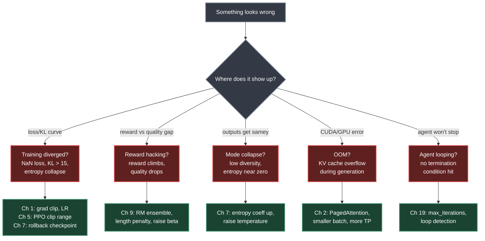
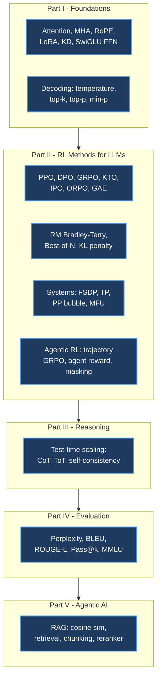

# Chapter 29. Quick Reference

> *"This chapter consolidates key equations, architecture specifications, API references, and failure mode diagnostics for rapid lookup during development and debugging."*

**Part VI — Assessment and Reference** · Book pages 597–604 · ~12 min read

[← Chapter 28. Quiz Questions and Detailed Answers](28-quiz-questions-and-answers.md) · [Index](../README.md) · [Chapter 30. Conclusion and Future Directions →](30-conclusion-and-future-directions.md)

---

## What This Chapter Is About

This is the lookup chapter, not a reading chapter. Every equation, hyperparameter default, and failure mode below was already derived somewhere earlier in the book, and each entry links back to the chapter that explains the *why*. Use it like a cheat sheet: Ctrl-F for a symptom, a trainer name, a protocol primitive, or a formula number, and follow the link for the derivation. Numbers are reproduced exactly as the source states them — nothing here is estimated.

> [!NOTE]
> Conditional-probability bars inside LaTeX table cells are written `\vert` instead of a literal `|`, since a raw pipe character breaks Markdown table syntax on GitHub.

## Table of Contents

- [The Mental Model](#the-mental-model)
- [Key Equations by Area](#key-equations-by-area)
  - [RL and Preference Optimization](#rl-and-preference-optimization)
  - [Transformer, Architecture, and Decoding](#transformer-architecture-and-decoding)
  - [Systems, Parallelism, and Hardware](#systems-parallelism-and-hardware)
  - [RAG Pipeline](#rag-pipeline)
  - [Agentic RL](#agentic-rl)
  - [Context Window Budget](#context-window-budget)
- [Hyperparameter Quick Reference](#hyperparameter-quick-reference)
- [Failure-Mode Diagnostics](#failure-mode-diagnostics)
- [APIs, Protocols, and Frameworks](#apis-protocols-and-frameworks)
  - [TRL Trainer API](#trl-trainer-api)
  - [MCP Quick Reference](#mcp-quick-reference)
  - [A2A Protocol Quick Reference](#a2a-protocol-quick-reference)
  - [Agentic Design Patterns](#agentic-design-patterns)
  - [Agent Framework Comparison](#agent-framework-comparison)
  - [Memory System Types](#memory-system-types)
  - [Agent Security Checklist](#agent-security-checklist)
- [Evaluation and Benchmarks](#evaluation-and-benchmarks)
- [Decision Guide](#decision-guide)
- [Common Pitfalls](#common-pitfalls)
- [Summary](#summary)
- [Going Deeper](#going-deeper)

---

## The Mental Model

*Route a symptom to a diagnosis to a chapter — this is the fastest path from "training is broken" to the right fix.*

Five symptom clusters cover most practical incidents: divergence (loss/Kullback-Leibler (KL) divergence curve), reward hacking (reward up, quality down), mode collapse (repetitive, low-diversity output), out-of-memory (OOM) errors (CUDA failures during generation), and runaway agents (loops that never terminate). The [Failure-Mode Diagnostics](#failure-mode-diagnostics) table below expands this into all twelve symptom/cause/fix rows the source gives.

## Key Equations by Area

*Every formula in this chapter traces back to one part of the book — this map is the index of indexes.*

### RL and Preference Optimization

Proximal Policy Optimization (PPO), Direct Preference Optimization (DPO), Group Relative Policy Optimization (GRPO), Kahneman-Tversky Optimization (KTO), Identity Preference Optimization (IPO), and Odds Ratio Preference Optimization (ORPO) — the last built on Supervised Fine-Tuning (SFT) loss instead of a reference model — plus Generalized Advantage Estimation (GAE), below share the same Kullback-Leibler (KL) divergence and reward-model (RM) conventions used throughout the book.

| # | Name | Formula | Used For | Derived In |
|---|------|---------|----------|------------|
| 29.1 | PPO Clip | $L = E[\min(r_t\hat A_t,\ \text{clip}(r_t, 1\pm\epsilon)\hat A_t)]$, $r_t = \pi_\theta(a_t\vert s_t)/\pi_{old}(a_t\vert s_t)$ | Trust-region actor-critic update | [Ch 5 — PPO](05-ppo-proximal-policy-optimization.md) |
| 29.2 | DPO | $L = -E[\log\sigma(\beta\log\frac{\pi_\theta(y_w\vert x)}{\pi_{ref}(y_w\vert x)} - \beta\log\frac{\pi_\theta(y_l\vert x)}{\pi_{ref}(y_l\vert x)})]$ | No reward model, no rollouts | [Ch 6 — DPO](06-dpo-direct-preference-optimization.md) |
| 29.3 | GRPO | $\hat A_i = (r_i - \mu_G)/\sigma_G$, then PPO clip, no critic | Group-relative advantage | [Ch 7 — GRPO](07-grpo-group-relative-policy-optimization.md) |
| 29.4 | KTO | $L = \lambda_w(1-v(y_w)) + \lambda_l v(y_l)$, $v = \sigma(\beta\log(\pi_\theta/\pi_{ref}) - z)$ | Unpaired binary feedback | [Ch 8 — Preference Variants](08-preference-optimization-variants.md) |
| 29.5 | IPO | $L = E[(\log\frac{\pi_\theta(y_w)}{\pi_{ref}(y_w)} - \log\frac{\pi_\theta(y_l)}{\pi_{ref}(y_l)} - \frac{1}{2\beta})^2]$ | Robust to noisy labels | [Ch 8 — Preference Variants](08-preference-optimization-variants.md) |
| 29.6 | ORPO | $L = L_{SFT}(y_w) - \lambda\log\sigma(\log\frac{\text{odds}(y_w)}{\text{odds}(y_l)})$ | SFT + preference, no ref model | [Ch 8 — Preference Variants](08-preference-optimization-variants.md) |
| 29.7 | GAE | $\hat A_t = \sum_{l=0}^{T-t}(\gamma\lambda)^l\delta_{t+l}$, $\delta_t = r_t + \gamma V(s_{t+1}) - V(s_t)$ | Advantage estimate for PPO | [Ch 5 — PPO](05-ppo-proximal-policy-optimization.md) |
| 29.8 | KL Penalty | $R_{total} = r_\phi(x,y) - \beta D_{KL}[\pi_\theta(y\vert x)\Vert\pi_{ref}(y\vert x)]$ | Keeps policy near reference | [Ch 4 — RL Foundations for LMs](04-rl-foundations-for-language-models.md) |
| 29.9 | RM (Bradley-Terry) | $L = -E[\log\sigma(r_\phi(x,y_w) - r_\phi(x,y_l))]$ | RM from pairwise data | [Ch 9 — Reward Model Training](09-reward-model-training.md) |
| 29.10 | Best-of-N | $y^* = \arg\max_{y_i\sim\pi_\theta(\cdot\vert x),\ i=1..N} r_\phi(x,y_i)$ | Training-free reranking | [Ch 8 — Preference Variants](08-preference-optimization-variants.md) |

γ discounts future reward, λ trades GAE bias for variance, β scales the KL term, ϵ bounds the PPO clip range.

### Transformer, Architecture, and Decoding

| # | Name | Formula | Used For |
|---|------|---------|----------|
| 29.11 | Self-Attention | $\text{Attn}(Q,K,V) = \text{softmax}(QK^\top/\sqrt{d_k})\cdot V$ | Core attention op |
| 29.12 | Multi-Head Attention | $\text{MHA}(X) = \text{Concat}(head_1,\dots,head_h)W^O$, $head_i = \text{Attn}(XW_i^Q, XW_i^K, XW_i^V)$ | Parallel attention subspaces |
| 29.13 | RoPE | $f(x_m, m) = x_m e^{im\theta_j}$, $\theta_j = 10000^{-2j/d}$ | Rotary position embedding |
| 29.14 | Low-Rank Adaptation (LoRA) | $W' = W_0 + (\alpha/r)\cdot BA$, $B\in\mathbb{R}^{d\times r}$, $A\in\mathbb{R}^{r\times k}$ | Parameter-efficient fine-tuning |
| 29.15 | Knowledge Distillation (KD) | $L_{KD} = (1-\alpha)L_{CE}(y,\hat y) + \alpha T^2\cdot KL(p^{teacher}_T \Vert p^{student}_T)$ | Soft-target student training |
| 29.16 | SwiGLU FFN | $\text{FFN}(x) = (\text{Swish}(xW_1)\odot xW_3)W_2$ | Gated FFN variant |

All six formulas above are derived in [Chapter 1 — LLM Architecture and Optimization](01-llm-architecture-and-optimization.md), which also covers decoding — how a next-token distribution becomes a chosen token:

| Method | Formula / Rule | Key Param |
|---|---|---|
| Greedy | $y_t = \arg\max_v P(v\vert y_{<t})$ | — |
| Beam search | Keep top-$B$ partial sequences by joint probability | $B = 4$–8 |
| Temperature | $P'(v) = \text{softmax}(logit_v/T)$ | $T \in [0.1, 1.5]$ |
| Top-k | Zero out all but top-$k$ logits, renormalize | $k = 40$–100 |
| Top-p (nucleus) | Keep smallest set $V'$ s.t. $\sum_{v\in V'}P(v)\ge p$ | $p = 0.9$–0.95 |
| Min-p | Keep tokens with $P(v) \ge p_{min}\cdot P(v_{max})$ | $p_{min} = 0.05$–0.1 |
| Repetition penalty | $logit_v \leftarrow logit_v/\theta$ if $v$ appeared before | $\theta = 1.1$–1.3 |

### Systems, Parallelism, and Hardware

Figures below are given for a 70B-parameter model in BF16 precision.

| Formula | Value (70B, BF16) | Description | Derived In |
|---|---|---|---|
| Model memory = $2P$ bytes | 140 GB (weights only) | Bytes/param at BF16 | [Ch 2 — Systems Foundations](02-systems-foundations-for-llms.md) |
| Adam optimizer = $2P \times 4$ bytes ($m+v$) | 280 GB | Adam moment states | [Ch 2 — Systems Foundations](02-systems-foundations-for-llms.md) |
| Full training footprint ≈ $8P$ bytes | 560 GB | Weights + optimizer + gradients | [Ch 2 — Systems Foundations](02-systems-foundations-for-llms.md) |
| Fully Sharded Data Parallel (FSDP) memory/GPU = $8P/N_{GPUs}$ | 70 GB with 8 GPUs | Per-GPU footprint after sharding | [Ch 11 — System Architecture at Scale](11-system-architecture-at-scale.md) |
| Gen arithmetic intensity = $2P/2P = 1$ FLOP/byte | — | Memory-bound decoding | [Ch 2 — Systems Foundations](02-systems-foundations-for-llms.md) |
| Token rate (gen) = $HBM\_BW/(2P)$ | ~14 tok/s (A100, batch = 1) | Set by High-Bandwidth Memory (HBM) bandwidth | [Ch 2 — Systems Foundations](02-systems-foundations-for-llms.md) |
| Tensor Parallel (TP) AllReduce/layer = $2\times2\cdot\frac{T-1}{T}\cdot bsd$ bytes | ~188 MB (70B, TP = 8) | Per-layer comm volume | [Ch 11 — System Architecture at Scale](11-system-architecture-at-scale.md) |
| Pipeline Parallel (PP) bubble fraction = $(P-1)/(P+M-1)$ | — | $P$=stages, $M$=micro-batches | [Ch 11 — System Architecture at Scale](11-system-architecture-at-scale.md) |
| Model FLOPs Utilization (MFU) = $\frac{observed\_toks\times 6P}{peak\_FLOPS}$ | Target > 40% | Fraction of peak throughput | [Ch 11 — System Architecture at Scale](11-system-architecture-at-scale.md) |

The hardware these formulas run on ([Ch 2 — Systems Foundations](02-systems-foundations-for-llms.md)):

| GPU | Memory | BW (HBM) | BF16 TFLOPS | NVLink | Notes |
|---|---|---|---|---|---|
| A100-80GB | 80 GB HBM2e | 2.0 TB/s | 312 | 600 GB/s | Workhorse, widely available |
| H100-80GB | 80 GB HBM3 | 3.35 TB/s | 989 | 900 GB/s | Current gen, FP8 support |
| H200-141GB | 141 GB HBM3e | 4.8 TB/s | 989 | 900 GB/s | Large context / fewer GPUs |
| B200 | 192 GB HBM3e | 8.0 TB/s | 2250 | 1800 GB/s | Next gen (2025) |

### RAG Pipeline

| # | Name | Formula | Used For |
|---|------|---------|----------|
| 29.17 | Cosine similarity | $sim(q,d) = \dfrac{q\cdot d}{\Vert q\Vert\cdot\Vert d\Vert}$ | Embedding similarity |
| 29.18 | Retrieval | $D_k = \text{top-}k_{d\in C}\ sim(embed(q), embed(d))$ | Top-$k$ chunk selection |
| 29.19 | RAG generation | $P(y\vert q) = P_{LLM}(y\vert q, D_k)$ | Generation on retrieved context |
| 29.20 | Chunking overlap | $stride = chunk\_size - overlap$ | Chunk boundary control |
| 29.21 | Reranker (cross-encoder) | $score(q,d) = MLP(BERT([q; d]))$ | Post-retrieval relevance scoring |

All five formulas above are derived in [Chapter 16 — Retrieval-Augmented Generation](16-retrieval-augmented-generation.md).

### Agentic RL

| # | Name | Formula | Used For |
|---|------|---------|----------|
| 29.23 | Trajectory GRPO | $\hat A_i = (R(\tau_i)-\mu_G)/\sigma_G$, $R(\tau_i) = \sum_t r_t^{(\tau_i)}$ | Group-relative advantage over trajectories |
| 29.24 | Agent reward | $R = w_1 R_{task} + w_2 R_{efficiency} + w_3 R_{safety}$, $R_{eff} = \max(0,\ 1-steps/N_{max})$ | Composite multi-objective reward |
| 29.25 | Masking | $L = \sum_{t\in\text{agent tokens}}\min(r_t\hat A_t,\ clip(r_t)\hat A_t)$, environment outputs masked | Excludes tool tokens from loss |
| 29.26 | Pass@k | $1 - \dfrac{\binom{n-c}{k}}{\binom{n}{k}}$, $n$=total samples, $c$=correct | P(≥1 of $k$ samples correct) |

All four formulas above are derived in [Chapter 12 — LLM Agentic Training](12-llm-agentic-training.md).

### Context Window Budget

$$C \ge \underbrace{S}_{\text{system}} + \underbrace{M}_{\text{memory/RAG}} + \underbrace{T}_{\text{tool defs}} + \underbrace{H}_{\text{history}} + \underbrace{R}_{\text{reserved output}} \tag{29.22}$$

Rule of thumb for a 128K context, from [Chapter 18 — Agent Harness](18-agent-harness-context-and-orchestration.md):

| Budget component | Typical size | Notes |
|---|---|---|
| System prompt ($S$) | 1–4K tokens | Fixed |
| Tool definitions ($T$) | 2–8K tokens | Scales with number of tools |
| RAG context ($M$) | 4–16K tokens | Top-$k$ chunks |
| History ($H$) | Grows unbounded | Summarize/truncate |
| Reserved output ($R$) | 2–8K tokens | Held back for generation |

## Hyperparameter Quick Reference

| Parameter | Typical Range | Default | Notes | Derived In |
|---|---|---|---|---|
| β (DPO/KTO) | 0.05–0.5 | 0.1 | Higher = more conservative | [Ch 6](06-dpo-direct-preference-optimization.md) / [Ch 8](08-preference-optimization-variants.md) |
| ϵ (PPO clip) | 0.1–0.3 | 0.2 | Higher = more aggressive updates | [Ch 5 — PPO](05-ppo-proximal-policy-optimization.md) |
| γ (GAE discount) | 0.99–1.0 | 1.0 | Use 1.0 for episodic tasks | [Ch 5 — PPO](05-ppo-proximal-policy-optimization.md) |
| λ (GAE) | 0.9–0.99 | 0.95 | Lower = more biased, less variance | [Ch 5 — PPO](05-ppo-proximal-policy-optimization.md) |
| KL coeff ($\beta_{KL}$) | 0.01–0.2 | 0.05 | Auto-adapt to target KL ≈ 5–8 | [Ch 4 — RL Foundations for LMs](04-rl-foundations-for-language-models.md) |
| Learning rate (RLHF) | 1e-7 – 5e-6 | 5e-7 | Much lower than pre-training | [Ch 5 — PPO](05-ppo-proximal-policy-optimization.md) |
| Learning rate (SFT) | 1e-5 – 5e-5 | 2e-5 | Standard fine-tuning range | [Ch 10 — SFT Best Practices](10-sft-best-practices.md) |
| LoRA rank $r$ | 8–128 | 16–64 | Higher $r$ = more capacity, more memory | [Ch 1 — LLM Architecture](01-llm-architecture-and-optimization.md) |
| LoRA alpha $\alpha$ | $r$ – $2r$ | $2r$ | Scaling factor; $\alpha/r$ is the effective scale | [Ch 1 — LLM Architecture](01-llm-architecture-and-optimization.md) |
| Temperature (gen) | 0.6–1.0 | 0.7 | Lower = less diverse candidates | [Ch 1 — LLM Architecture](01-llm-architecture-and-optimization.md) |
| Num generations $K$ | 4–64 | 4–16 | For GRPO / Online DPO / Best-of-N | [Ch 7 — GRPO](07-grpo-group-relative-policy-optimization.md) |
| Grad clip norm | 0.5–2.0 | 1.0 | Prevents gradient explosion | [Ch 5 — PPO](05-ppo-proximal-policy-optimization.md) |

## Failure-Mode Diagnostics

This is the table worth bookmarking. Every row is a symptom you can literally search for, paired with the most likely cause, the fix, and the chapter that explains both in depth.

| Symptom | Likely Cause | Fix | Chapter |
|---|---|---|---|
| Reward up, quality down | Reward hacking | RM ensemble, length penalty, increase β | [Ch 9 — Reward Model Training](09-reward-model-training.md) |
| KL exploding (>15) | LR too high or mode collapse | Reduce LR, checkpoint rollback | [Ch 5 — PPO](05-ppo-proximal-policy-optimization.md) |
| Entropy collapse | Premature convergence | Increase entropy coeff, raise temperature | [Ch 7 — GRPO](07-grpo-group-relative-policy-optimization.md) |
| Training loss NaN | Gradient explosion | Reduce LR, increase grad clip, check data | [Ch 1 — LLM Architecture](01-llm-architecture-and-optimization.md) |
| No improvement after 5K steps | Bad prompt distribution | Goldilocks filter (20–80% pass rate) | [Ch 7 — GRPO](07-grpo-group-relative-policy-optimization.md) |
| Benchmark regression | Alignment tax | Reduce RL budget, use LoRA, mix SFT data | [Ch 10 — SFT Best Practices](10-sft-best-practices.md) |
| Length increasing monotonically | Length exploit in reward model | Length penalty, retrain RM with length control | [Ch 9 — Reward Model Training](09-reward-model-training.md) |
| OOM during generation | KV cache overflow | Reduce batch, increase TP, PagedAttention | [Ch 2 — Systems Foundations](02-systems-foundations-for-llms.md) |
| Agent loops forever | No max-iteration guard | Set `max_iterations`, add loop detection | [Ch 19 — Loop Engineering](19-loop-engineering.md) |
| Tool call parse failures | Inconsistent output format | Few-shot examples, constrained decoding | [Ch 22 — Model Context Protocol](22-model-context-protocol.md) |
| RAG returns irrelevant docs | Poor embedding / chunking | Reranker, hybrid search, smaller chunks | [Ch 16 — RAG](16-retrieval-augmented-generation.md) |
| Multi-agent deadlock | Circular dependencies | DAG enforcement, timeout per agent | [Ch 25 — Multi-Agent Systems](25-multi-agent-systems.md) |

> [!TIP]
> If a symptom doesn't cleanly match one row, check whether it's actually two rows stacked — e.g., KL exploding *and* entropy collapse together usually means the learning rate is the shared root cause.

## APIs, Protocols, and Frameworks

### TRL Trainer API

The Transformer Reinforcement Learning (TRL) library's trainers, keyed to algorithm.

| Trainer | Method | Key Config | Data Format | Chapter |
|---|---|---|---|---|
| `SFTTrainer` | Supervised fine-tuning | `packing`, `max_seq_length` | prompt + completion | [Ch 10 — SFT Best Practices](10-sft-best-practices.md) |
| `RewardTrainer` | Reward model | `center_rewards_coefficient` | prompt + chosen + rejected | [Ch 9 — Reward Model Training](09-reward-model-training.md) |
| `PPOTrainer` | PPO | `init_kl_coef`, `target_kl`, `cliprange` | prompts (online generation) | [Ch 5 — PPO](05-ppo-proximal-policy-optimization.md) |
| `DPOTrainer` | DPO / IPO | `beta`, `loss_type="sigmoid"`/`"ipo"` | prompt + chosen + rejected | [Ch 6 — DPO](06-dpo-direct-preference-optimization.md) |
| `GRPOTrainer` | GRPO | `num_generations`, `beta`, `use_vllm` | prompts + `reward_fn` | [Ch 7 — GRPO](07-grpo-group-relative-policy-optimization.md) |
| `OnlineDPOTrainer` | Online DPO | `num_generations`, `reward_model_path` | prompts (online generation) | [Ch 8 — Preference Variants](08-preference-optimization-variants.md) |
| `KTOTrainer` | KTO | `desirable_weight`, `undesirable_weight` | prompt + completion + label | [Ch 8 — Preference Variants](08-preference-optimization-variants.md) |
| `ORPOTrainer` | ORPO | `beta` | prompt + chosen + rejected | [Ch 8 — Preference Variants](08-preference-optimization-variants.md) |
| Best-of-N (manual) | Best-of-N | `n_samples` | prompts (inference) | [Ch 8 — Preference Variants](08-preference-optimization-variants.md) |

### MCP Quick Reference

| Primitive | Direction | Side Effects? | Purpose |
|---|---|---|---|
| Tools | Client → Server | Yes | Execute actions (create, modify, delete) |
| Resources | Client → Server | No (read-only) | Read data (files, database records, configs) |
| Prompts | Client → Server | No | Reusable templates for common tasks |
| Sampling | Server → Client | No | Server requests LLM generation from client |

Transport is `stdio` (local subprocess) or HTTP+Server-Sent Events (HTTP+SSE, remote, streamable). Discovery happens at connection init via `tools/list`, `resources/list`, `prompts/list`. Tool annotations: `readOnlyHint`, `destructiveHint`, `idempotentHint`, `openWorldHint`. OpenAI Function Calling covers the same tool-use scope via a JSON schema in a `tools[]` array on the API payload, without MCP's client/server split. Full detail in [Chapter 22 — Model Context Protocol](22-model-context-protocol.md).

### A2A Protocol Quick Reference

| Concept | Description |
|---|---|
| Agent Card | JSON at `/.well-known/agent.json` — name, skills, supported content types |
| Task | Unit of work: id, status, artifacts. Lifecycle: submitted → working → completed/failed |
| Message | Communication unit within a task (role: user/agent, parts: text/file/data) |
| Artifact | Output produced by the agent (structured data, files, generated content) |
| Push Notifications | Webhook-based updates for long-running tasks, via `tasks/pushNotification/set` |

Key endpoints: `tasks/send` (create/update), `tasks/get` (poll status), `tasks/sendSubscribe` (SSE stream). Full detail in [Chapter 24 — Agent-to-Agent Communication](24-agent-to-agent-communication.md).

### Agentic Design Patterns

| Pattern | Structure | Best For |
|---|---|---|
| ReAct | Think → Act → Observe → loop | General tool-use agents |
| Plan-and-Execute | Plan → Execute steps → Revise | Long-horizon, structured tasks |
| Supervisor | Router → specialist agents | Multi-domain, clear subtask boundaries |
| Swarm (handoffs) | Agent transfers control + context | Customer service, escalation flows |
| Hierarchical | Tree of delegating agents | Complex decomposition |
| Human-in-the-loop | Agent → Approval gate → Continue | High-stakes, irreversible actions |

All six patterns are detailed in [Chapter 20 — Agent Design Patterns](20-agent-design-patterns.md).

### Agent Framework Comparison

| Framework | Orchestration | Multi-Agent | Best For |
|---|---|---|---|
| LangGraph | Explicit state graph | Conditional routing | Production: persistence, HITL, fine control |
| OpenAI Agents SDK | Declarative handoffs | Handoff-based | Simplicity: guardrails, tracing |
| AutoGen (AG2) | Conversation-driven | GroupChat | Prototyping: code execution, research |
| CrewAI | Role-based teams | Sequential/parallel | Low-code: quick demos |
| Google Agent Development Kit (ADK) | Session + events | A2A native | Enterprise: artifact mgmt, multi-modal |

Detail in [Chapter 26 — Agent Development Frameworks](26-agent-development-frameworks.md).

### Memory System Types

| Type | Storage | Use Case |
|---|---|---|
| Working memory | Context window | Current conversation, immediate tool results |
| Episodic memory | Vector store | Past interactions, user preferences, session history |
| Semantic memory | Knowledge graph / embeddings | Facts, concepts, domain knowledge |
| Procedural memory | Skill library / code | How-to procedures, learned workflows |

Full treatment in [Chapter 17 — Agentic Memory Systems](17-agentic-memory-systems.md).

### Agent Security Checklist

| Threat | Layer | Mitigation | Chapter |
|---|---|---|---|
| Prompt injection (direct) | Input | Input validation, instruction hierarchy, delimiters | [Ch 18 — Agent Harness](18-agent-harness-context-and-orchestration.md) |
| Prompt injection (indirect) | Tool output | Treat tool output as untrusted; don't follow instructions in retrieved docs | [Ch 18 — Agent Harness](18-agent-harness-context-and-orchestration.md) |
| Tool misuse | Execution | Least-privilege permissions; `destructiveHint` gates; sandboxing | [Ch 18 — Agent Harness](18-agent-harness-context-and-orchestration.md) |
| Data exfiltration | Output | Output filtering; restrict tool access to allowed domains | [Ch 18 — Agent Harness](18-agent-harness-context-and-orchestration.md) |
| Excessive autonomy | Architecture | Max iterations; cost budgets; human approval gates | [Ch 19 — Loop Engineering](19-loop-engineering.md) |
| Confused deputy | Multi-agent | Verify task origin; capability-based access control | [Ch 25 — Multi-Agent Systems](25-multi-agent-systems.md) |

## Evaluation and Benchmarks

**General and RAG evaluation metrics** — see [Chapter 14 — LLM Evaluation](14-llm-evaluation.md); RAG-specific rows also in [Chapter 16 — RAG](16-retrieval-augmented-generation.md).

| Metric | Range | What It Measures |
|---|---|---|
| Perplexity | $[1, \infty)$ | Model's surprise; lower = better language modeling |
| Win Rate (vs. baseline) | $[0, 1]$ | Fraction of outputs preferred by judge/human |
| BLEU | $[0, 1]$ | n-gram overlap with reference (precision-focused) |
| ROUGE-L | $[0, 1]$ | Longest common subsequence with reference |
| Pass@k | $[0, 1]$ | Probability ≥1 of $k$ code samples passes tests |
| MMLU / GPQA | $[0, 1]$ | Multi-choice accuracy on knowledge/reasoning benchmarks |
| HumanEval | $[0, 1]$ | Functional correctness of generated code |
| Faithfulness (RAG) | $[0, 1]$ | Fraction of claims supported by retrieved context |
| Context Relevancy | $[0, 1]$ | Fraction of retrieved content relevant to query |
| Answer Relevancy | $[0, 1]$ | Degree to which answer addresses the question |

**Agent evaluation metrics** — see [Chapter 21 — Agentic Environments and Benchmarks](21-agentic-environments-and-benchmarks.md).

| Metric | Formula / Definition | Target |
|---|---|---|
| Task Success Rate (TSR) | Correct completions / total tasks | > 85% (production) |
| Steps to completion | Avg agent actions per successful task | Lower = more efficient |
| Cost per task | Total tokens × price/token | Budget-dependent |
| Latency (Time to First Chunk, TTFC) | Time from request to first useful output | < 5s for interactive |
| Tool call accuracy | Correct tool selections / total calls | > 90% |
| Recovery rate | Successful retries / initial failures | > 60% |
| Human escalation rate | Tasks requiring human / total tasks | < 15% |

**Key agentic benchmarks (2025 state of the art)** — same chapter.

| Benchmark | Domain | Metric | SOTA (2025) |
|---|---|---|---|
| SWE-bench Verified | Software engineering | % resolved issues | ~70% |
| WebArena | Web browsing | Task success rate | ~40% |
| OSWorld | Desktop computer use | Task success rate | ~25% |
| GAIA | General AI assistant | Exact match accuracy | ~75% (L1) |
| Tau-bench | Tool-use reliability | Pass rate (5 trials) | ~65% |
| HumanEval / MBPP | Code generation | Pass@1 | > 95% |

**Reasoning and test-time scaling** — see [Chapter 13 — RL for Large Reasoning Models](13-rl-for-large-reasoning-models.md).

| Method | Compute Cost | Mechanism |
|---|---|---|
| Chain-of-Thought (CoT) | 1.5–3× tokens | "Think step by step" in prompt |
| Self-Consistency | $N\times$ generation | Sample $N$ CoT paths, majority vote |
| Tree-of-Thought (ToT) | $B\times D\times$ generation | BFS/DFS over reasoning tree; evaluate branches |
| Best-of-N | $N\times$ generation | Sample $N$, score with RM, pick highest |
| Beam search (on reasoning) | $B\times$ generation | Maintain top-$B$ partial reasoning chains |
| Budget forcing | Variable | Allocate more tokens to harder problems dynamically |
| Verification (ORM/PRM) | $N\times$ gen + scoring | Generate $N$ solutions, rank by outcome/process reward model |

## Decision Guide

```mermaid
flowchart TD
    Start{"What feedback\nsignal do you have?"}
    Start -->|"paired: chosen + rejected"| Q1{"Data situation?"}
    Start -->|"binary: thumbs up/down"| KTO["KTO"]
    Start -->|"verifiable reward\nmath/code"| GRPO["GRPO"]
    Start -->|"need max quality,\nany cost"| PPO["PPO"]
    Start -->|"want training-free\nimprovement"| BoN["Best-of-N"]
    Q1 -->|"noisy labels"| IPO["IPO"]
    Q1 -->|"memory-constrained,\nno SFT yet"| ORPO["ORPO"]
    Q1 -->|"clean data,\nlimited compute"| DPO["DPO"]
    Q1 -->|"DPO plateaus,\nwant exploration"| OnlineDPO["Online DPO"]

    classDef neutral fill:#333a45,stroke:#8892a0,stroke-width:2px,color:#ffffff
    classDef core fill:#1e3a5f,stroke:#4a90d9,stroke-width:2px,color:#ffffff

    class Start,Q1 neutral
    class KTO,GRPO,PPO,BoN,IPO,ORPO,DPO,OnlineDPO core
```

*The method-selection decision tree from the source, redrawn as a flowchart: what feedback signal you have determines which trainer you reach for.*

Each branch links to its dedicated chapter: [DPO](06-dpo-direct-preference-optimization.md), [GRPO](07-grpo-group-relative-policy-optimization.md), [PPO](05-ppo-proximal-policy-optimization.md), and [KTO / IPO / ORPO / Online DPO / Best-of-N](08-preference-optimization-variants.md).

## Common Pitfalls

> [!WARNING]
> A KL value above 15 is not an early warning — by the time it shows up, the policy has usually drifted too far for anything but a checkpoint rollback. See [Chapter 5 — PPO](05-ppo-proximal-policy-optimization.md).

> [!WARNING]
> Reward climbing while quality falls is reward hacking, not progress. Trust the reward curve only alongside an independent quality check. See [Chapter 9 — Reward Model Training](09-reward-model-training.md).

> [!WARNING]
> Tool output is not trusted input. Indirect prompt injection through retrieved documents is a distinct threat from direct injection in the user's message, and needs its own mitigation layer. See [Chapter 18 — Agent Harness](18-agent-harness-context-and-orchestration.md).

## Summary

- Every preference-optimization loss here — PPO, DPO, GRPO, KTO, IPO, ORPO — reduces to a clipped policy-gradient objective or a Bradley-Terry-style pairwise log-sigmoid loss; GRPO's only structural change from PPO is swapping the learned value baseline for group statistics ($\mu_G$, $\sigma_G$).
- At 70B parameters in BF16, weights cost 140 GB, Adam optimizer states cost 280 GB, and the full training footprint reaches ~560 GB — why FSDP sharding across 8 GPUs is needed to bring per-GPU memory to 70 GB.
- Generation is memory-bound, not compute-bound: arithmetic intensity for autoregressive decoding is exactly 1 FLOP/byte, so token throughput is set by HBM bandwidth divided by twice the parameter count.
- The twelve-row failure-mode table routes each symptom to one cause and one fix — "training loss NaN" is gradient explosion fixed by lowering LR and tightening grad clip; "agent loops forever" is a missing termination guard fixed with `max_iterations`.
- The method-selection tree resolves on the *kind of feedback signal available* first — paired preferences, binary labels, verifiable rewards, or none — before compute budget or data cleanliness.
- MCP's four primitives split by direction and side effects: Tools and Resources both flow client→server, but only Tools have side effects; Sampling is the one primitive that flows server→client.
- Explicit targets recur throughout: MFU > 40%, Task Success Rate > 85% in production, tool call accuracy > 90%, human escalation rate < 15%, interactive latency under 5 seconds to first useful output.

## Going Deeper

This chapter distills the whole book, so "going deeper" means following the links above back into Chapters 1–26. Named by source: the TRL library (SFT, reward modeling, PPO, DPO, GRPO, Online DPO, KTO, ORPO trainers), vLLM and PagedAttention (the fix for KV-cache OOM), the MCP and A2A protocol specifications, and the frameworks LangGraph, OpenAI Agents SDK, AutoGen (AG2), CrewAI, and Google ADK.

> [!NOTE]
> No bibliography was present in the supplied page range; framework and library names are reproduced exactly as the source spells them.

---

[← Chapter 28. Quiz Questions and Detailed Answers](28-quiz-questions-and-answers.md) · [Index](../README.md) · [Chapter 30. Conclusion and Future Directions →](30-conclusion-and-future-directions.md)

*Summary of Chapter 29 of [The Hitchhiker's Guide to Agentic AI](https://arxiv.org/abs/2606.24937)
by Haggai Roitman. Licensed CC BY-SA 4.0. Independent study notes — not affiliated with or
endorsed by the author.*
