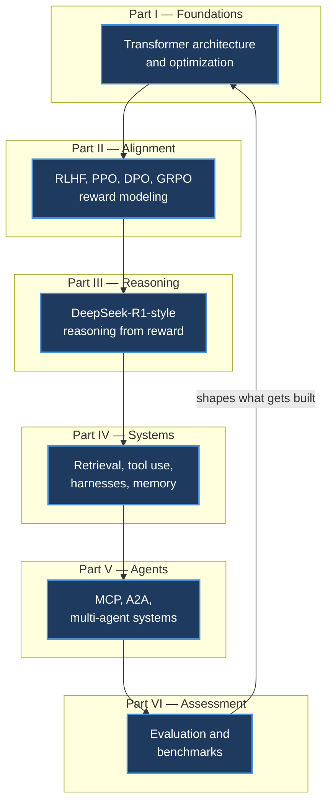
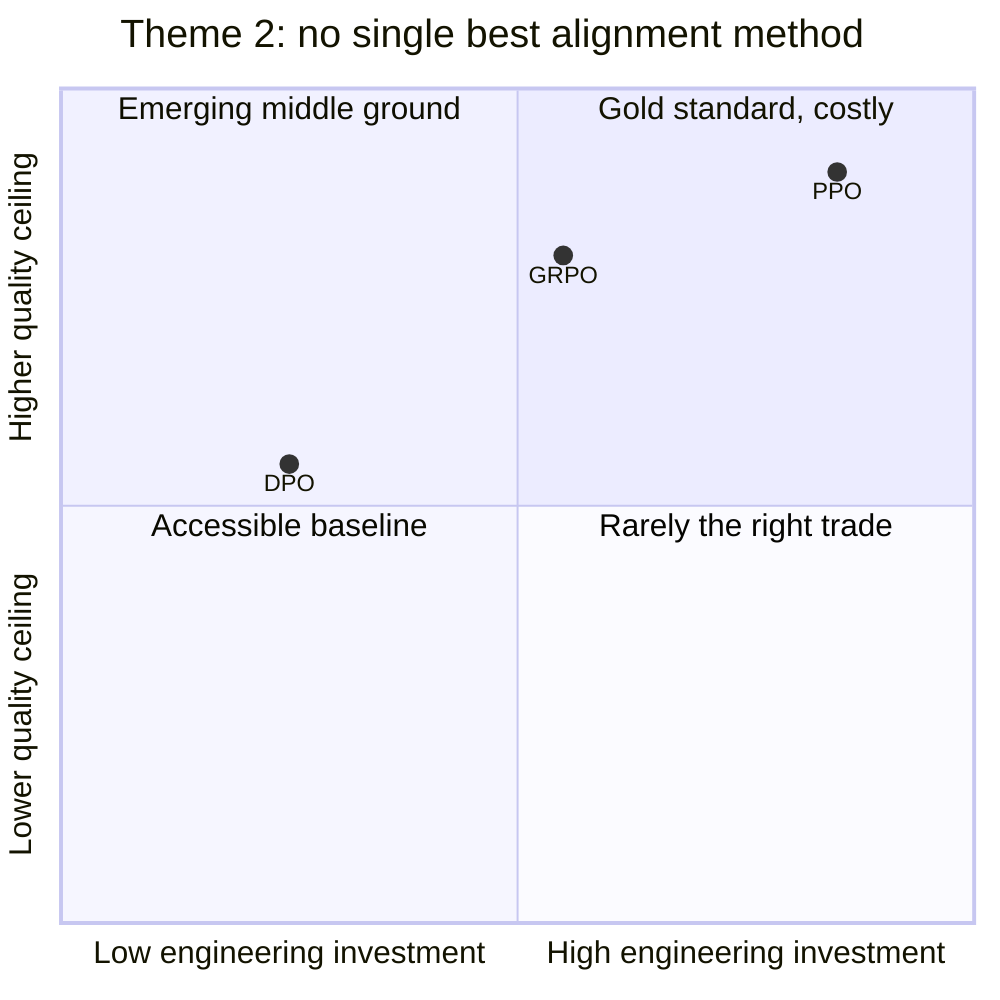
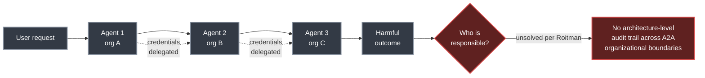
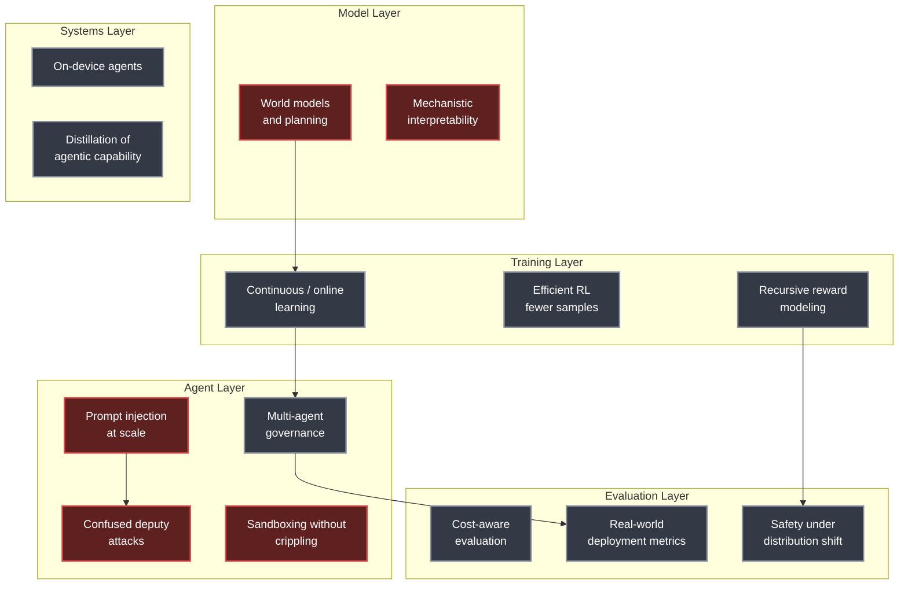
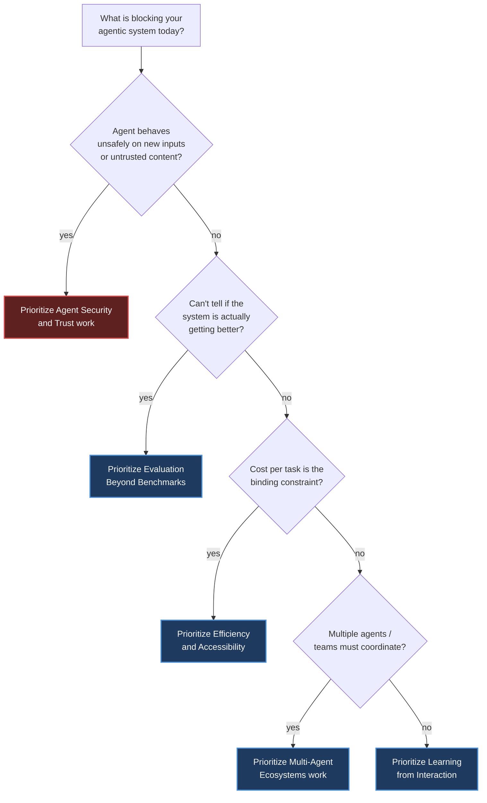

# Chapter 30. Conclusion and Future Directions

> *"The best way to predict the future is to build it." — Alan Kay, quoted by Roitman to close the book*

**Part VI — Assessment and Reference** · Book pages 605–636 · ~14 min read

[← Chapter 29. Quick Reference](29-quick-reference.md)  ·  Next: [Index](../README.md)

---

## What This Chapter Is About

Every earlier chapter built one piece of the stack: transformer foundations, reinforcement learning for alignment, retrieval, tool use, multi-agent coordination, evaluation. This closing chapter is where Roitman steps back and says what it adds up to. It has three parts: a seven-point synthesis of the book's recurring themes (Section 30.1), a survey of seven open-problem areas the field has not solved (Section 30.2), and a curated reading list organized by topic, closing on the Alan Kay epigraph above (Section 30.3).

Two things make this chapter different from the other 29. First, it is argument rather than exposition — Roitman is telling you what he thinks matters, not deriving a formula, so his claims are marked as his throughout. Second, its most durable content is negative space: the problems the book's own techniques do *not* solve. Continuous learning, scalable oversight, world models, multi-agent governance, agent security, evaluation beyond benchmarks, and cost — each gets a short list of named open problems, several with inline citations to work in progress rather than settled results.

Someone who reads only this chapter gets a compressed map of the whole book (the seven themes) plus a checklist of what to watch for as the field moves past 2026 — useful independent of whether they read Chapters 1–29 first.

## Table of Contents

- [The Mental Model](#the-mental-model)
- [30.1 — Seven Themes That Recur Across the Book](#301--seven-themes-that-recur-across-the-book)
- [30.2 — The Road Ahead: Open Challenges](#302--the-road-ahead-open-challenges)
  - [Learning from Interaction](#learning-from-interaction)
  - [Scalable Oversight](#scalable-oversight)
  - [World Models and Planning](#world-models-and-planning)
  - [Multi-Agent Ecosystems](#multi-agent-ecosystems)
  - [Agent Security and Trust](#agent-security-and-trust)
  - [Evaluation Beyond Benchmarks](#evaluation-beyond-benchmarks)
  - [Efficiency and Accessibility](#efficiency-and-accessibility)
- [Open Problems by Layer](#open-problems-by-layer)
- [30.3 — Further Reading](#303--further-reading)
- [Decision Guide](#decision-guide)
- [Common Pitfalls](#common-pitfalls)
- [Summary](#summary)
- [Open Problems to Watch](#open-problems-to-watch)
- [Going Deeper](#going-deeper)

---

## The Mental Model

*The book's six parts form one dependency chain, not six independent topics: a trained-and-aligned model (Parts I–II) develops reasoning under verifiable reward (Part III), gets embedded in a system with tools and memory (Part IV), coordinates with other agents over open standards (Part V), and is judged by evaluation methods that — per theme 6 below — feed back and shape what gets built next (Part VI). Roitman's closing argument is that no part of this chain is optional: a well-aligned model without agentic infrastructure cannot act, and agentic infrastructure without evaluation is unmeasurable.*

## 30.1 — Seven Themes That Recur Across the Book

Roitman opens the chapter by naming seven themes that recur across the book's chapters. These are presented as the book's own conclusions, restated rather than re-derived:

1. **Alignment is a systems problem.** A good loss function is not enough — production RLHF (reinforcement learning from human feedback) requires managing 4+ models simultaneously, distributing computation across hundreds of GPUs (graphics processing units), handling fault tolerance, and monitoring for reward hacking, all at once.
2. **There is no single best alignment method.** PPO (Proximal Policy Optimization) remains the gold standard for maximum quality but demands enormous engineering investment. DPO (Direct Preference Optimization) and its variants trade some quality for teams with limited infrastructure. GRPO (Group Relative Policy Optimization) bridges the gap specifically for verifiable-reward domains. The right choice depends on data, compute budget, and quality bar.
3. **Reasoning emerges from reward.** DeepSeek-R1 proved that chain-of-thought, self-verification, and backtracking can emerge from simple binary reward signals and group-relative optimization — without explicit demonstrations of reasoning. Test-time compute scaling means smaller models with more "thinking" can match larger models.
4. **Standards unlock ecosystems.** MCP (Model Context Protocol) reduces the tool-integration problem from N × M to N + M. A2A (Agent-to-Agent Protocol) enables agents built by different teams to collaborate without shared internals. Roitman's claim: these protocols are to agentic AI what HTTP was to the web — the enabling infrastructure for an open ecosystem.
5. **Agents are the natural next step after alignment.** Once a model is aligned, the frontier shifts from "how good is a single response?" to "can the model solve multi-step problems autonomously?" This demands new training paradigms (agentic RL with environment rewards), new infrastructure (harnesses, tool protocols, memory systems), and new evaluation methods (trajectory-level benchmarks).
6. **Evaluation drives everything.** Without rigorous evaluation — spanning reward model validation, agent task success rates, contamination detection, and LLM-as-Judge calibration — progress is unmeasurable and regressions are invisible. Roitman states plainly: the benchmarks you choose shape the systems you build.
7. **Simplicity scales.** The most reliable production agents use the simplest architecture that meets requirements — prompt chaining and routing before autonomous loops, single agents before multi-agent swarms. Complexity should be earned through demonstrated need, not assumed up front.

> [!NOTE]
> These seven points are Roitman's own synthesis of the preceding 29 chapters, not a separate new result. Theme 7 in particular restates a design principle argued at length in the multi-agent-systems chapter.

*Roitman's second theme is a trade-off, not a ranking: PPO sits at high investment and high achievable quality, DPO trades quality for infrastructure simplicity, and GRPO occupies a middle ground built specifically for domains with verifiable rewards. The chapter's claim is that the right pick depends on your data, compute budget, and quality bar — not that one method dominates the others.*

## 30.2 — The Road Ahead: Open Challenges

Section 30.2 is where the chapter shifts from summary to forecast. Roitman organizes unsolved problems into seven areas; each subsection below preserves his framing and the specific open problems he names, each with its own inline citation in the source.

### Learning from Interaction

Current RLHF pipelines treat alignment as a one-time training phase. Roitman argues the future points toward **continuous learning from deployment**: agents that improve from every user interaction, tool failure, and environment observation — without catastrophic forgetting or reward drift. He names three open problems:

- Online learning with non-stationary reward distributions.
- Safe exploration in production (avoiding harmful actions while the agent is still learning).
- Efficient credit assignment over long agent trajectories spanning hundreds of tool calls.

### Scalable Oversight

As agents grow more capable, human oversight itself becomes the bottleneck. Current approaches — RLHF and Constitutional AI — rely on humans evaluating model outputs directly. Roitman poses the open question directly: what happens when model outputs exceed human understanding? Four candidate directions, each cited to prior work in the source:

- **Recursive reward modeling** — use AI to help humans evaluate AI.
- **Debate and amplification** — two models argue; a human judges which argument is more compelling.
- **Process-based supervision** — reward correct reasoning steps, not just final answers.
- **Mechanistic interpretability** — understand what the model is doing internally, not just what it outputs.

### World Models and Planning

Current agents are, in Roitman's word, **reactive** — they observe and respond one step at a time. He argues future agents will need internal world models that enable lookahead planning:

- Predicting the consequences of actions before executing them.
- Tree search over possible action sequences — the source cites AlphaGo and MuZero as precedents — but for open-ended tasks rather than closed games.
- Learning environment dynamics directly from interaction traces.

### Multi-Agent Ecosystems

The A2A protocol and multi-agent frameworks (Chapters 24–25) hint at a future where hundreds of specialized agents collaborate, negotiate, and delegate, forming what Roitman terms an "economy of agents." He lists four open challenges:

- Trust and verification between agents with different principals.
- Emergent cooperation vs. emergent deception in competitive settings.
- Market mechanisms for resource allocation — compute, tool access, priority.
- Governance: who is responsible when a chain of 10 agents produces a harmful outcome?

*Roitman's governance question — "who is responsible when a chain of 10 agents produces a harmful outcome?" — is concrete once the chain crosses organizational boundaries via A2A: each hop delegates credentials, but the source states that tracing who authorized what action across that chain "remains architecturally unsolved."*

### Agent Security and Trust

Roitman is emphatic here: autonomous agents inherit every security vulnerability of the LLMs they are built on, **plus** new attack surfaces created by tool access, multi-agent delegation, and persistent memory (cross-referenced to Chapters 19–21 in the source). He calls out five unsolved problems:

- **Prompt injection at scale** — as agents consume untrusted content (web pages, emails, API responses), indirect prompt injection becomes systemic. Roitman states plainly: no robust defense exists today.
- **Confused deputy attacks** — an agent with legitimate credentials can be tricked into misusing them on behalf of an attacker embedded in the data stream.
- **Sandboxing without crippling** — least-privilege execution constrains what agents can do, but overly restrictive sandboxes negate agentic value; finding the right boundary is an open design problem.
- **Audit and attribution** — when an agent chain spans multiple organizations via A2A, tracing who authorized what action remains architecturally unsolved.
- **Trust calibration** — agents must learn when *not* to trust, whether a tool response is authentic, and whether another agent's claim is verified.

### Evaluation Beyond Benchmarks

Referencing Chapter 14's argument that benchmarks shape the systems that get built, Roitman identifies four gaps in current evaluation practice:

- **Real-world deployment metrics** — benchmarks like SWE-bench and GAIA (General AI Assistants benchmark) measure isolated tasks, while production agents face ambiguous goals, shifting requirements, and multi-turn recovery.
- **Reward model validity** — RLHF assumes reward models capture human preferences, but reward hacking and distributional shift undermine this assumption at scale.
- **Cost-quality frontiers** — two agents may reach the same accuracy while one costs 10× more tokens; evaluation, Roitman argues, must become cost-aware.
- **Safety under distribution shift** — an agent safe in testing may behave unsafely on novel inputs; adversarial evaluation and red-teaming at agentic scale remain immature.

### Efficiency and Accessibility

The source gives concrete cost figures here: training a 70B-parameter model with RLHF costs **\$10K–\$100K**, and running autonomous agents costs **\$1–\$50 per complex task**. For agentic AI to achieve broad impact, Roitman names four directions:

- Distillation of agentic capabilities from large to small models.
- More efficient RL algorithms — fewer samples, lower variance.
- On-device agents that operate without cloud round-trips.
- Open-weight models that match proprietary quality for agentic tasks.

| Open-problem area | Central question Roitman poses | Named directions |
|---|---|---|
| Learning from Interaction | How do agents improve continuously without forgetting or reward drift? | Non-stationary online learning, safe production exploration, long-horizon credit assignment |
| Scalable Oversight | What happens once model outputs exceed human understanding? | Recursive reward modeling, debate, process supervision, interpretability |
| World Models and Planning | How do reactive agents gain lookahead? | Consequence prediction, tree search, learned environment dynamics |
| Multi-Agent Ecosystems | Who governs an "economy of agents"? | Trust/verification, cooperation vs. deception, market mechanisms, chain-of-responsibility governance |
| Agent Security and Trust | Can agentic attack surfaces be closed? | Injection defenses, confused-deputy mitigation, sandboxing, audit/attribution, trust calibration |
| Evaluation Beyond Benchmarks | Do benchmarks measure what production needs? | Deployment metrics, reward validity, cost-aware evaluation, distribution-shift safety |
| Efficiency and Accessibility | How does agentic AI reach broad impact at \$10K–\$100K training cost and \$1–\$50/task inference cost? | Distillation, efficient RL, on-device agents, open-weight parity |

## Open Problems by Layer

*Roitman's seven open-problem areas map onto five layers of the agentic stack introduced across the book. Security problems (red) cluster at the agent layer because that is where new attack surfaces — tool access, delegation, persistent memory — get introduced on top of an already-vulnerable base model. Roitman does not present this layering explicitly in the source text; it is a structural reading of how his seven areas relate to the model/training/systems/agent/evaluation stack used throughout the book.*

## 30.3 — Further Reading

Section 30.3 closes the book with a curated bibliography, organized by the topic areas the book covers. The source groups it into five categories; representative entries from each are reproduced here (full citation details are in the chapter's Bibliography, not restated below):

**Foundational Papers** — Attention Is All You Need (the transformer architecture); RLHF / InstructGPT (the first large-scale RLHF deployment); PPO; DPO; GRPO / DeepSeek-R1 (group-relative optimization and emergent reasoning); ReAct (reasoning + acting for LLM agents); Toolformer (teaching LLMs to use tools); RAG (Retrieval-Augmented Generation).

**Systems and Scaling** — Megatron-LM (tensor and pipeline parallelism); DeepSpeed ZeRO (memory-efficient distributed training); vLLM (PagedAttention for efficient LLM serving); Flash Attention (IO-aware exact attention).

**Agentic AI** — Building Effective Agents (design patterns and principles); Voyager (open-ended agent with a skill library in Minecraft); SWE-bench (benchmark for autonomous software engineering); OSWorld (full computer-use benchmarks); GAIA (General AI Assistants benchmark for real-world tasks); MemGPT (OS-inspired memory management for unbounded context); Model Context Protocol; Agent-to-Agent Protocol.

**Alignment and Safety** — Constitutional AI (self-supervised alignment); Sleeper Agents (deceptive alignment concerns); Reflexion (learning from verbal self-reflection); Indirect Prompt Injection (security risks for LLM-integrated applications).

**Online Resources** — HuggingFace TRL (`github.com/huggingface/trl`, production RL library); LangGraph (`github.com/langchain-ai/langgraph`, agent workflow graphs); OpenAI Agents SDK (`github.com/openai/openai-agents-python`); DeepSpeed-Chat (`github.com/microsoft/DeepSpeedExamples`, end-to-end RLHF pipeline); DSPy (`github.com/stanfordnlp/dspy`, declarative prompt optimization); AutoGen (`github.com/microsoft/autogen`, multi-agent conversation framework).

The chapter — and the book — closes on a single quoted line, attributed to Alan Kay: *"The best way to predict the future is to build it."*

## Decision Guide

The chapter itself poses no single decision, but its structure implies one: when planning what to invest in next, weigh Roitman's seven open-problem areas against how directly they gate what you are building.

*This flowchart is a structural reading of Section 30.2, not something Roitman draws explicitly — use it to route between the chapter's seven open-problem areas based on which one is actually the binding constraint for your system.*

## Common Pitfalls

> [!WARNING]
> Roitman states plainly that **no robust defense exists today** against indirect prompt injection at scale — as agents consume untrusted content from web pages, emails, and API responses, injected instructions become a systemic risk, not an edge case to patch later.

> [!WARNING]
> Treating agent evaluation as complete once a benchmark score improves is exactly the gap Section 30.2.6 calls out: SWE-bench- and GAIA-style benchmarks measure isolated tasks, while production agents face ambiguous goals, shifting requirements, and multi-turn recovery that these benchmarks do not exercise.

> [!WARNING]
> Sandboxing an agent too aggressively "negates agentic value" per the source — the right least-privilege boundary is named as an open design problem, not a solved default to copy from another system.

## Summary

- Roitman synthesizes the book into seven recurring themes: alignment is a systems problem, no single alignment method dominates (PPO for quality, DPO for lower infrastructure cost, GRPO for verifiable-reward domains), reasoning emerges from reward without explicit demonstrations, standards like MCP and A2A unlock ecosystems the way HTTP did for the web, agents are the natural next step after alignment, evaluation shapes what gets built, and simplicity scales better than premature complexity.
- Training a 70B-parameter model with RLHF costs **\$10K–\$100K**, and running autonomous agents costs **\$1–\$50 per complex task** — the cost figures Roitman cites as the barrier that efficiency and distillation work must address for broad impact.
- MCP is credited with reducing the tool-integration problem from N × M to N + M; A2A is credited with letting agents from different teams collaborate without shared internals — both framed as infrastructure-level standards, not incremental features.
- Section 30.2 names seven areas of unsolved problems — learning from interaction, scalable oversight, world models and planning, multi-agent ecosystems, agent security and trust, evaluation beyond benchmarks, and efficiency and accessibility — each with specific named sub-problems rather than a vague "more research needed."
- Roitman states directly that no robust defense exists today against indirect prompt injection at scale, and that audit and attribution across multi-organization agent chains (via A2A) remains architecturally unsolved.
- The chapter closes the entire book on a single quoted line from Alan Kay — "The best way to predict the future is to build it" — positioned as Roitman's own closing stance on the field.

## Open Problems to Watch

- [ ] Continuous learning from deployment without catastrophic forgetting or reward drift (online learning under non-stationary reward distributions).
- [ ] Safe exploration in production — learning from live interaction without taking harmful actions along the way.
- [ ] Efficient credit assignment across agent trajectories spanning hundreds of tool calls.
- [ ] Scalable oversight once model outputs exceed human evaluators' understanding (recursive reward modeling, debate, process supervision, interpretability).
- [ ] Internal world models that let agents plan via lookahead instead of acting reactively step by step.
- [ ] Trust, verification, and governance across multi-agent "economies" — including who is responsible when a chain of 10 agents produces a harmful outcome.
- [ ] A robust defense against indirect prompt injection at scale — the source states none exists today.
- [ ] Confused-deputy attacks, where an agent's legitimate credentials get misused on an attacker's behalf.
- [ ] A least-privilege sandboxing boundary that constrains agents without crippling their agentic value.
- [ ] Audit and attribution across agent chains that span multiple organizations via A2A.
- [ ] Real-world, cost-aware, distribution-shift-robust evaluation that goes beyond isolated-task benchmarks like SWE-bench and GAIA.
- [ ] Distillation, more efficient RL algorithms, on-device agents, and open-weight models that close the cost gap for broad agentic-AI accessibility.

## Going Deeper

The chapter's own "Further Reading" list is the going-deeper section for the whole book. Grouped as the source groups them:

- **Foundational papers**: Attention Is All You Need; RLHF / InstructGPT; PPO; DPO; GRPO / DeepSeek-R1; ReAct; Toolformer; RAG.
- **Systems and scaling**: Megatron-LM; DeepSpeed ZeRO; vLLM; Flash Attention.
- **Agentic AI**: Building Effective Agents; Voyager; SWE-bench; OSWorld; GAIA; MemGPT; Model Context Protocol; Agent-to-Agent Protocol.
- **Alignment and safety**: Constitutional AI; Sleeper Agents; Reflexion; Indirect Prompt Injection.
- **Online resources**: HuggingFace TRL, LangGraph, OpenAI Agents SDK, DeepSpeed-Chat, DSPy, AutoGen — repository names and paths as reproduced above.

> [!NOTE]
> Immediately after this reading list, the book's page range (605–636) continues into a full numbered Bibliography of 443 references (page 609 onward), which this summary does not enumerate — see the extraction note below.

---

[← Chapter 29. Quick Reference](29-quick-reference.md)  ·  Next: [Index](../README.md)

*Summary of Chapter 30 of [The Hitchhiker's Guide to Agentic AI](https://arxiv.org/abs/2606.24937)
by Haggai Roitman. Licensed CC BY-SA 4.0. Independent study notes — not affiliated with or
endorsed by the author.*
