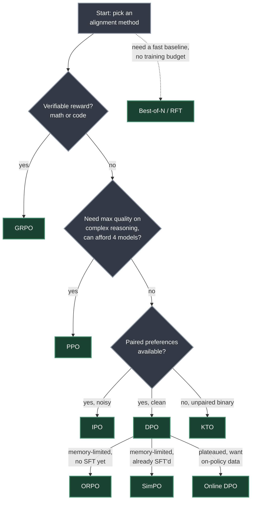
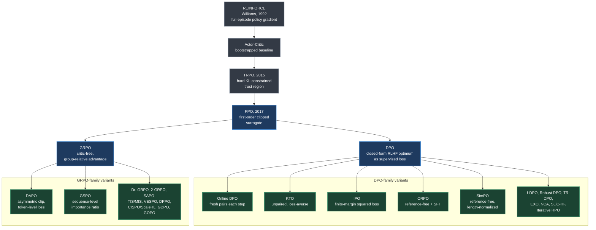

# Alignment Algorithm Cheatsheet

One page covering the nine alignment algorithms from [Chapters 5–8](../chapters/05-ppo-proximal-policy-optimization.md): PPO, DPO, GRPO, Online DPO, KTO, IPO, ORPO, SimPO, and Best-of-N. Every number below is pulled directly from those four chapters — no values are estimated or invented.

---

## Master Comparison Table

| Algorithm | One-line idea | Data required | Policy | Reference | Reward Model | Value Head | Online / Offline | Key hyperparameter (typical) | Main failure mode | Chapter |
|---|---|---|---|---|---|---|---|---|---|---|
| **PPO** | Clipped-ratio actor-critic update bounds policy drift without a hard KL constraint (TRPO's ~10× cheaper first-order approximation) | Prompts + reward-model scores from online rollouts | ✓ trainable | ✓ frozen | ✓ frozen | ✓ trainable | Online (on-policy; buffer purged every cycle) | `cliprange` ε = 0.2; `init_kl_coef` 0.01–0.1 | Low stability — 4 networks to balance; generation dominates 60–70% of wall-clock time | [05](../chapters/05-ppo-proximal-policy-optimization.md) |
| **DPO** | Closed-form optimal-policy substitution turns RLHF into one binary cross-entropy loss on log-prob ratios — no reward model, no rollouts | Offline pairs `{prompt, chosen, rejected}` | ✓ trainable | ✓ frozen (evictable after precompute) | – | – | Offline | β = 0.1 (range 0.05–0.5) | Distribution shift as the policy diverges from static pairs; degenerate solution overfits at margin → ∞ | [06](../chapters/06-dpo-direct-preference-optimization.md) |
| **GRPO** | Deletes the critic — normalizes a group's own reward mean/std into the advantage instead of learning a value function | Prompts + verifiable/RM reward, online rollouts of G completions per prompt | ✓ trainable | ✓ frozen (KL only, no critic) | ✓ frozen/verifier | – | Online | Group size G = 8 default (16 for hard tasks); β = 0.04 KL coefficient | Uniform-outcome groups (all right or all wrong) normalize to zero advantage — no learning signal | [07](../chapters/07-grpo-group-relative-policy-optimization.md) |
| **Online DPO** | Regenerates fresh preference pairs from the live policy every step, scores them with a reward model, then applies the ordinary DPO loss | Prompts only; K responses per prompt ranked by RM into chosen/rejected | ✓ trainable | ✓ frozen | ✓ frozen | – | Online | β = 0.1; K = 4 responses/prompt | Needs a reward model and fresh generation every step — more expensive than offline DPO | [08](../chapters/08-preference-optimization-variants.md) |
| **KTO** | Drops the pairing requirement — trains on independent thumbs-up/down examples with prospect-theory loss aversion | Unpaired `{prompt, completion, label}` | ✓ trainable | Optional (or none with LoRA) | – | – | Offline | λw/λl default 1.0/1.0 (raise λl for loss aversion); β = 0.1 | Needs weight tuning on heavily imbalanced label data | [08](../chapters/08-preference-optimization-variants.md) |
| **IPO** | Replaces DPO's unbounded log-sigmoid loss with a squared loss targeting a finite margin, closing the overfitting failure mode | Offline pairs (same format as DPO) | ✓ trainable | ✓ frozen (or LoRA-implicit) | – | – | Offline | β sets target margin 1/(2β); e.g. β = 0.1 | Fixed margin can be too loose or too tight if β is mis-set | [08](../chapters/08-preference-optimization-variants.md) |
| **ORPO** | Folds SFT and an odds-ratio preference term into one loss, eliminating the reference model entirely | Offline pairs (same format as DPO) | ✓ trainable | – | – | – | Offline | λ odds-ratio weight (TRL `beta`), e.g. 0.1 | Two loss terms can conflict; needs high-quality chosen responses; less proven at 70B+ scale | [08](../chapters/08-preference-optimization-variants.md) |
| **SimPO** | Eliminates the reference model, using length-normalized average log-probability as the implicit reward plus a target margin γ | Offline pairs (same format as DPO) | ✓ trainable | – | – | – | Offline | γ = 0.5 target margin; β = 2.5 (length-norm coefficient, not KL strength) | Without length normalization the model would learn to prefer longer responses — mitigated by design | [06](../chapters/06-dpo-direct-preference-optimization.md) |
| **Best-of-N** | No gradient training — sample N candidates, reward-score, keep the best (optionally SFT on it for iterative RFT) | Prompts only | ✓ frozen at inference | – | ✓ frozen | – | Online generation, no training (RFT variant adds SFT) | N = 4–64 (N=16 "often matches PPO quality") | Cost scales linearly with N; diminishing returns past ~64; inference-only unless paired with RFT | [08](../chapters/08-preference-optimization-variants.md) |

> [!NOTE]
> Online DPO sits between offline DPO and PPO on model count: 3 models (policy + reference + reward model) versus DPO's 2 and PPO's 4 — it has on-policy data like PPO but no value head.

---

## Loss Functions

**PPO — clipped surrogate objective** ([Chapter 5](../chapters/05-ppo-proximal-policy-optimization.md))

$$L^{CLIP}(\theta) = \mathbb{E}_t\Big[\min\big(r_t(\theta)\hat{A}_t,\ \text{clip}(r_t(\theta), 1-\epsilon, 1+\epsilon)\hat{A}_t\big)\Big], \qquad r_t(\theta) = \frac{\pi_\theta(a_t\mid s_t)}{\pi_{\theta_{old}}(a_t\mid s_t)}$$

*Reading:* take the more conservative (pessimistic) of the raw and clipped policy-ratio-times-advantage term, so the optimizer's incentive to keep pushing a good action's probability up — or a bad action's probability down — vanishes once the ratio drifts past 1±ε.

**DPO — binary cross-entropy on implicit rewards** ([Chapter 6](../chapters/06-dpo-direct-preference-optimization.md))

$$\mathcal{L}_{DPO}(\theta) = -\mathbb{E}_{(x,y_w,y_l)}\left[\log \sigma\left(\beta \log \frac{\pi_\theta(y_w|x)}{\pi_{ref}(y_w|x)} - \beta \log \frac{\pi_\theta(y_l|x)}{\pi_{ref}(y_l|x)}\right)\right]$$

*Reading:* push the chosen response's log-probability (relative to the frozen reference) above the rejected response's, exactly as far as a Bradley-Terry preference model demands — no reward model needed because its normalization term cancels in the subtraction.

**GRPO — group-normalized clipped objective** ([Chapter 7](../chapters/07-grpo-group-relative-policy-optimization.md))

$$\hat{A}_i = \frac{r_i - \mu_G}{\sigma_G + \epsilon}, \qquad L = \mathbb{E}\Big[\min\big(\rho_t(\theta)\hat{A}_i,\ \mathrm{clip}(\rho_t(\theta), 1-\epsilon, 1+\epsilon)\hat{A}_i\big)\Big] - \beta\, D_{KL}\big[\pi_\theta \,\|\, \pi_{ref}\big]$$

*Reading:* replace PPO's learned value baseline with the empirical mean/std of G same-prompt rollouts, normalize each completion's reward against its own group, then apply the identical PPO-style clip plus a KL penalty back to the reference.

**Online DPO** — identical loss to DPO above, applied every step to pairs freshly generated by the current policy and ranked by a reward model, rather than to a static offline dataset ([Chapter 8](../chapters/08-preference-optimization-variants.md)).

**KTO loss** ([Chapter 8](../chapters/08-preference-optimization-variants.md))

$$L_{KTO} = \mathbb{E}_{y_w}\left[\lambda_w\left(1 - v(x, y_w)\right)\right] + \mathbb{E}_{y_l}\left[\lambda_l \cdot v(x, y_l)\right], \qquad v(x, y) = \sigma\left(\beta \log \frac{\pi_\theta(y|x)}{\pi_{ref}(y|x)} - z_{ref}\right)$$

*Reading:* desirable responses get diminishing-returns utility from higher probability, undesirable responses get a loss-aversion-weighted penalty — each example scored independently, so no chosen/rejected pairing is required.

**IPO loss** ([Chapter 8](../chapters/08-preference-optimization-variants.md))

$$L_{IPO} = \mathbb{E}\left[\left(\log\frac{\pi_\theta(y_w|x)}{\pi_{ref}(y_w|x)} - \log\frac{\pi_\theta(y_l|x)}{\pi_{ref}(y_l|x)} - \frac{1}{2\beta}\right)^2\right]$$

*Reading:* a squared loss minimized at a specific finite log-ratio margin (1/(2β)), not at margin → ∞ like DPO — so a mislabeled pair's influence is bounded rather than pushing the loss toward infinity.

**ORPO loss** ([Chapter 8](../chapters/08-preference-optimization-variants.md))

$$L_{ORPO} = L_{SFT}(y_w) - \lambda \cdot \log \sigma\left(\log \frac{\text{odds}_\theta(y_w|x)}{\text{odds}_\theta(y_l|x)}\right), \qquad \text{odds}_\theta(y|x) = \frac{P_\theta(y|x)}{1 - P_\theta(y|x)}$$

*Reading:* a standard SFT negative-log-likelihood term on the chosen response, plus an odds-ratio preference term that needs no reference model — the SFT term itself anchors the model, doing the job KL-to-reference does elsewhere.

**SimPO loss** ([Chapter 6](../chapters/06-dpo-direct-preference-optimization.md))

$$\mathcal{L}_{SimPO} = -\mathbb{E}\left[\log\sigma\left(\frac{\beta}{|y_w|}\log\pi_\theta(y_w|q) - \frac{\beta}{|y_l|}\log\pi_\theta(y_l|q) - \gamma\right)\right]$$

*Reading:* the implicit reward is the response's own length-normalized average log-probability (no reference model at all), and the loss further demands the winning response's reward exceed the losing response's by at least a target margin γ.

**Best-of-N — no loss, an argmax** ([Chapter 8](../chapters/08-preference-optimization-variants.md))

$$y^* = \arg\max_{y_i \sim \pi_\theta(\cdot|x)} r_\phi(x, y_i)$$

*Reading:* sample N completions, keep the highest-reward one — no gradient step happens; the only "training" is the optional downstream SFT step that turns this into Rejection Sampling Fine-Tuning (RFT).

---

## Decision Guide

*Adapted from Chapter 8's decision tree (extended with GRPO's own verifiable-reward branch from Chapter 7, and SimPO as a second memory-constrained, reference-free option alongside ORPO). Branches are not mutually exclusive — Best-of-N is a compute-matched sanity check worth running against any of the others.*

---

## Historical Lineage

*Chapter 3's stated progression — REINFORCE → Actor-Critic → TRPO → PPO — feeds two branches: PPO's clipped-surrogate lineage continues straight into GRPO's critic-free variant family (Chapter 7), while DPO's closed-form-optimum lineage spawns the reference-handling and pairing variants of Chapter 8 (SimPO is covered in Chapter 6 alongside DPO's other extensions). Only years the source states are shown; unlabeled nodes have no year given in the text.*

---

*Reference material for the [chapter summaries](../README.md) of [The Hitchhiker's Guide to Agentic AI](https://arxiv.org/abs/2606.24937) by Haggai Roitman. Licensed CC BY-SA 4.0.*
