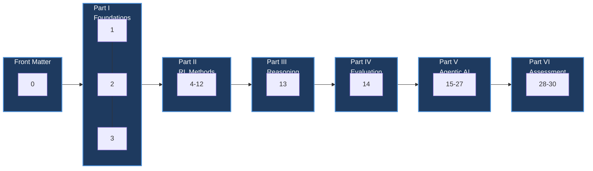
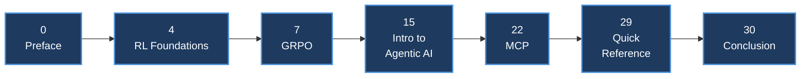
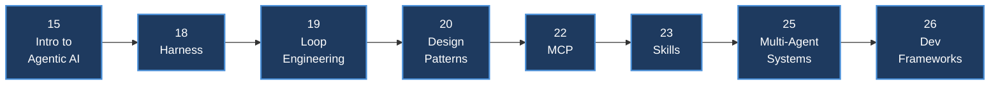
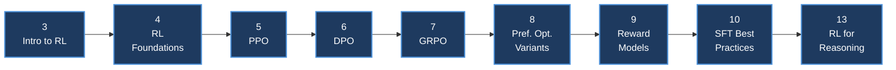
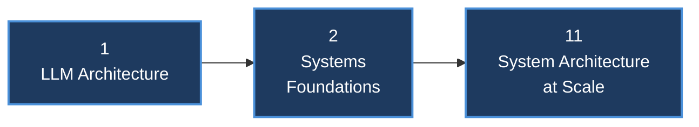
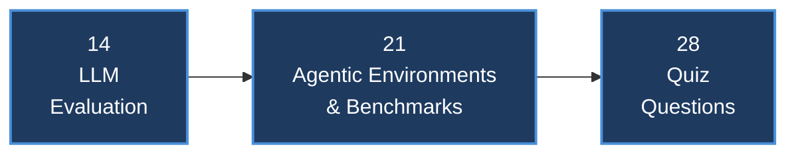
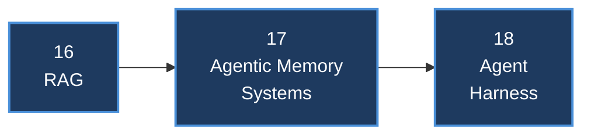

# Reading Paths

Seven named routes through the book's 31 chapter-summary files (front matter plus Chapters 1–30), built for readers who don't need — or don't yet have time for — the full linear read. Per-chapter time estimates are the `~N min read` figures in each chapter file's own metadata line; path totals are the sum of those.

---

## Overview

The book runs six Parts plus front matter, per each chapter file's own metadata line:

| Part | Chapters | Topic |
|---|---|---|
| Front Matter | 0 | Preface & Introduction |
| Part I — Foundations | 1–3 | Transformer architecture, GPU/systems foundations, classical RL |
| Part II — RL Methods for LLMs | 4–12 | PPO, DPO, GRPO, preference variants, reward models, SFT, systems at scale, agentic training |
| Part III — Reasoning | 13 | RL for large reasoning models |
| Part IV — Evaluation | 14 | LLM evaluation |
| Part V — Agentic AI | 15–27 | RAG, memory, harnesses, loops, design patterns, MCP, skills, A2A, multi-agent systems, frameworks, UI |
| Part VI — Assessment and Reference | 28–30 | Quiz, quick reference, conclusion |

*The book's six-part backbone. Every path below is a subset and reordering of these 31 files — see each path's own small flowchart for its specific chapter sequence.*

---

## "I Have One Afternoon"

**For:** someone who wants a working mental model of the whole book in one sitting, not mastery of any one part.

The shortest route pulls the two chapters explicitly built as compressed maps (Quick Reference and the Conclusion), the two shortest substantive chapters (RL Foundations and Introduction to Agentic AI, 7 minutes each), the algorithm the book calls the field's current default, and the protocol it treats as the connective tissue of the agentic tooling story.

| # | Chapter | Why it's in the path |
|---|---|---|
| 1 | [Preface & Introduction](../chapters/00-preface-and-introduction.md) | Orients you in the author's framing and the book's own six-part map before anything else. |
| 2 | [Ch. 4 — RL Foundations for Language Models](../chapters/04-rl-foundations-for-language-models.md) | Shortest chapter in the book (7 min); names the two paradigms — RLHF/DPO and RLVR — that every later alignment chapter assumes. |
| 3 | [Ch. 7 — GRPO](../chapters/07-grpo-group-relative-policy-optimization.md) | The algorithm the chapter itself calls the default RL trainer across open-source alignment frameworks today — understand this one and the PPO/DPO comparisons follow. |
| 4 | [Ch. 15 — Introduction to Agentic AI](../chapters/15-introduction-to-agentic-ai.md) | Shortest agentic chapter (7 min); defines what makes a system "agentic" before harness, loop, and protocol chapters build on it. |
| 5 | [Ch. 22 — Model Context Protocol (MCP)](../chapters/22-model-context-protocol.md) | The standard the book compares to what LSP did for developer tooling — the connective layer the rest of Part V's tool/agent chapters assume. |
| 6 | [Ch. 29 — Quick Reference](../chapters/29-quick-reference.md) | Explicitly built by the author as a lookup chapter consolidating every equation, hyperparameter, and failure mode from earlier chapters. |
| 7 | [Ch. 30 — Conclusion and Future Directions](../chapters/30-conclusion-and-future-directions.md) | The author's own compressed synthesis — designed, per its own text, so a reader who reads only this chapter still gets a map of the whole book. |

**Total: ~94 min (1h34m).**

---

## Agent Builder

**For:** an engineer shipping a production agent — harness, loop, tools, and multi-agent coordination — who doesn't need the alignment-training internals underneath the model.

| # | Chapter | Why it's in the path |
|---|---|---|
| 1 | [Ch. 15 — Introduction to Agentic AI](../chapters/15-introduction-to-agentic-ai.md) | Defines the observe-reason-act loop every later chapter in this path assumes. |
| 2 | [Ch. 18 — Agent Harness](../chapters/18-agent-harness-context-and-orchestration.md) | The "operating system" layer — memory, tool dispatch, state tracking — that turns a stateless LLM into a goal-directed agent. |
| 3 | [Ch. 19 — Loop Engineering](../chapters/19-loop-engineering.md) | The control structure on top of the harness that keeps an agent working toward a goal without a human typing the next instruction every turn. |
| 4 | [Ch. 20 — Agent Design Patterns](../chapters/20-agent-design-patterns.md) | Catalogs the production architectures — prompt chaining, routing, orchestration — that determine whether the agent is reliable and debuggable. |
| 5 | [Ch. 22 — Model Context Protocol (MCP)](../chapters/22-model-context-protocol.md) | The standard interface for tool connectivity your agent will speak. |
| 6 | [Ch. 23 — Agent Skills](../chapters/23-agent-skills.md) | Discrete, reusable capability units your agent loads and composes without retraining the model. |
| 7 | [Ch. 25 — Multi-Agent Systems](../chapters/25-multi-agent-systems.md) | The topologies and coordination mechanisms for when one agent isn't enough. |
| 8 | [Ch. 26 — Agent Development Frameworks](../chapters/26-agent-development-frameworks.md) | The buyer's guide to which piece of software actually runs the loop, holds state, and fails predictably in production. |

**Total: ~146 min (2h26m).**

---

## RLHF / Post-Training Engineer

**For:** someone training or fine-tuning models — the full alignment-algorithm stack from classical RL through reasoning-model RL.

| # | Chapter | Why it's in the path |
|---|---|---|
| 1 | [Ch. 3 — Introduction to Reinforcement Learning](../chapters/03-introduction-to-reinforcement-learning.md) | The classical RL vocabulary — states, policies, GAE, the REINFORCE → Actor-Critic → TRPO → PPO progression — everything after this builds on it. |
| 2 | [Ch. 4 — RL Foundations for Language Models](../chapters/04-rl-foundations-for-language-models.md) | Bridges classical RL to LLMs and names the RLHF/DPO vs. RLVR paradigm split Chapters 5–13 elaborate. |
| 3 | [Ch. 5 — PPO](../chapters/05-ppo-proximal-policy-optimization.md) | The clipped-objective algorithm that made RLHF practical at LLM scale, and the baseline every later method compares itself against. |
| 4 | [Ch. 6 — DPO](../chapters/06-dpo-direct-preference-optimization.md) | Derives the closed-form alternative to PPO's RL loop — a supervised loss over preference pairs — and its variant family (SimPO included). |
| 5 | [Ch. 7 — GRPO](../chapters/07-grpo-group-relative-policy-optimization.md) | Removes PPO's critic entirely via group-relative advantages; the current default trainer, with its own dense variant family. |
| 6 | [Ch. 8 — Preference Optimization Variants](../chapters/08-preference-optimization-variants.md) | Online DPO, KTO, IPO, ORPO, and Best-of-N — each patches one specific weakness of offline DPO. |
| 7 | [Ch. 9 — Reward Model Training](../chapters/09-reward-model-training.md) | How the scalar training signal PPO/GRPO/Online DPO all depend on actually gets built from pairwise human judgments. |
| 8 | [Ch. 10 — SFT Best Practices](../chapters/10-sft-best-practices.md) | The supervised-fine-tuning foundation RL sits on top of — RL cannot manufacture a capability absent from the SFT model. |
| 9 | [Ch. 13 — RL for Large Reasoning Models](../chapters/13-rl-for-large-reasoning-models.md) | Where GRPO-style verifiable-reward RL is applied to teach multi-step reasoning, closing the loop from Chapter 7. |

**Total: ~146 min (2h26m).**

---

## Inference and Systems Engineer

**For:** someone responsible for GPU infrastructure, serving throughput, and the distributed-training systems underneath any of the algorithms above.

| # | Chapter | Why it's in the path |
|---|---|---|
| 1 | [Ch. 1 — LLM Architecture and Optimization](../chapters/01-llm-architecture-and-optimization.md) | The transformer, optimizer, and inference-compression building blocks every downstream systems decision optimizes around. |
| 2 | [Ch. 2 — Systems Foundations for LLMs](../chapters/02-systems-foundations-for-llms.md) | The hardware facts — GPU memory hierarchy, roofline model, vLLM/PagedAttention — that determine what's even physically possible to serve or train. |
| 3 | [Ch. 11 — System Architecture and Infrastructure at Scale](../chapters/11-system-architecture-at-scale.md) | The distributed-training layer — parallelism strategies, ZeRO, pipeline scheduling — that keeps a multi-model RLHF loop from running out of memory or falling over. |

**Total: ~78 min (1h18m).**

---

## Evaluation Lead

**For:** someone who owns how the org measures model and agent quality — from single-response evaluation through agentic benchmarks to the book's own self-assessment instrument.

| # | Chapter | Why it's in the path |
|---|---|---|
| 1 | [Ch. 14 — LLM Evaluation](../chapters/14-llm-evaluation.md) | Why evaluating an unbounded, multidimensional output space is structurally harder than classical supervised-learning evaluation, and the metric families that address it. |
| 2 | [Ch. 21 — Agentic Environments and Benchmarks](../chapters/21-agentic-environments-and-benchmarks.md) | Extends evaluation from single-shot responses to trajectories — the OpenAI-Gym-style `reset()`/`step()`/`render()` interface for scoring a policy over many steps. |
| 3 | [Ch. 28 — Quiz Questions and Detailed Answers](../chapters/28-quiz-questions-and-answers.md) | A 108-question self-assessment instrument covering Parts I–V — use it to check whether your own team's understanding holds up, not just the model's. |

**Total: ~57 min.**

---

## Retrieval and Memory

**For:** someone building the knowledge layer — grounding generation in external documents and giving a long-running agent state that survives past the context window.

| # | Chapter | Why it's in the path |
|---|---|---|
| 1 | [Ch. 16 — Retrieval-Augmented Generation (RAG)](../chapters/16-retrieval-augmented-generation.md) | Attaches a dynamic, non-parametric memory to the model — the full chunking/embedding/retrieval/reranking pipeline and its failure metrics. |
| 2 | [Ch. 17 — Agentic Memory Systems](../chapters/17-agentic-memory-systems.md) | What happens once a single retrieval pass isn't enough — working/episodic/semantic memory architectures for agents that run for hours or months. |
| 3 | [Ch. 18 — Agent Harness](../chapters/18-agent-harness-context-and-orchestration.md) | Where memory actually gets wired into a running agent, alongside tool dispatch and context management. |

**Total: ~75 min (1h15m).**

---

## Front to Back

**For:** the complete, in-order read — all 31 files, front matter through the conclusion.

| # | Chapter | Min | # | Chapter | Min |
|---|---|---|---|---|---|
| 0 | [Preface & Introduction](../chapters/00-preface-and-introduction.md) | 12 | 16 | [RAG](../chapters/16-retrieval-augmented-generation.md) | 25 |
| 1 | [LLM Architecture and Optimization](../chapters/01-llm-architecture-and-optimization.md) | 35 | 17 | [Agentic Memory Systems](../chapters/17-agentic-memory-systems.md) | 24 |
| 2 | [Systems Foundations for LLMs](../chapters/02-systems-foundations-for-llms.md) | 18 | 18 | [Agent Harness](../chapters/18-agent-harness-context-and-orchestration.md) | 26 |
| 3 | [Introduction to Reinforcement Learning](../chapters/03-introduction-to-reinforcement-learning.md) | 16 | 19 | [Loop Engineering](../chapters/19-loop-engineering.md) | 20 |
| 4 | [RL Foundations for Language Models](../chapters/04-rl-foundations-for-language-models.md) | 7 | 20 | [Agent Design Patterns](../chapters/20-agent-design-patterns.md) | 10 |
| 5 | [PPO](../chapters/05-ppo-proximal-policy-optimization.md) | 16 | 21 | [Agentic Environments and Benchmarks](../chapters/21-agentic-environments-and-benchmarks.md) | 20 |
| 6 | [DPO](../chapters/06-dpo-direct-preference-optimization.md) | 18 | 22 | [Model Context Protocol (MCP)](../chapters/22-model-context-protocol.md) | 22 |
| 7 | [GRPO](../chapters/07-grpo-group-relative-policy-optimization.md) | 20 | 23 | [Agent Skills](../chapters/23-agent-skills.md) | 9 |
| 8 | [Preference Optimization Variants](../chapters/08-preference-optimization-variants.md) | 14 | 24 | [Agent-to-Agent Communication (A2A)](../chapters/24-agent-to-agent-communication.md) | 24 |
| 9 | [Reward Model Training](../chapters/09-reward-model-training.md) | 14 | 25 | [Multi-Agent Systems](../chapters/25-multi-agent-systems.md) | 22 |
| 10 | [SFT Best Practices](../chapters/10-sft-best-practices.md) | 15 | 26 | [Agent Development Frameworks](../chapters/26-agent-development-frameworks.md) | 30 |
| 11 | [System Architecture at Scale](../chapters/11-system-architecture-at-scale.md) | 25 | 27 | [Agentic UI Frameworks](../chapters/27-agentic-ui-frameworks.md) | 22 |
| 12 | [LLM Agentic Training](../chapters/12-llm-agentic-training.md) | 28 | 28 | [Quiz Questions and Answers](../chapters/28-quiz-questions-and-answers.md) | 15 |
| 13 | [RL for Large Reasoning Models](../chapters/13-rl-for-large-reasoning-models.md) | 26 | 29 | [Quick Reference](../chapters/29-quick-reference.md) | 12 |
| 14 | [LLM Evaluation](../chapters/14-llm-evaluation.md) | 22 | 30 | [Conclusion and Future Directions](../chapters/30-conclusion-and-future-directions.md) | 14 |
| 15 | [Introduction to Agentic AI](../chapters/15-introduction-to-agentic-ai.md) | 7 | | | |

**Total: ~588 min (9h48m)** — roughly two working days at a sustained read pace, or spread across a week at ~90 minutes a day.

---

*Reference material for the [chapter summaries](../README.md) of [The Hitchhiker's Guide to Agentic AI](https://arxiv.org/abs/2606.24937) by Haggai Roitman. Licensed CC BY-SA 4.0.*
